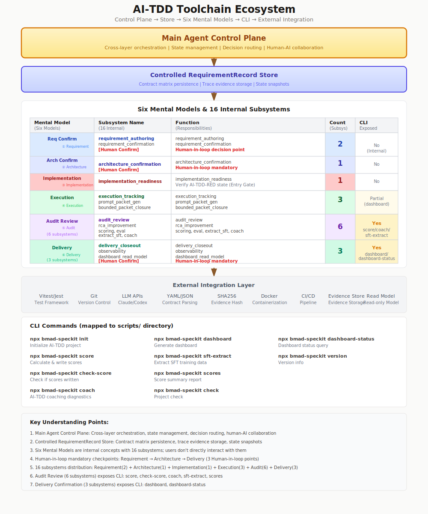
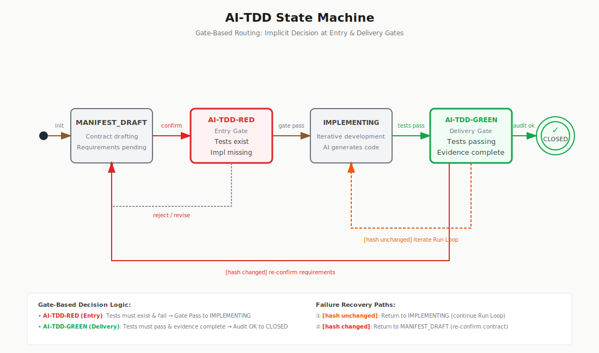
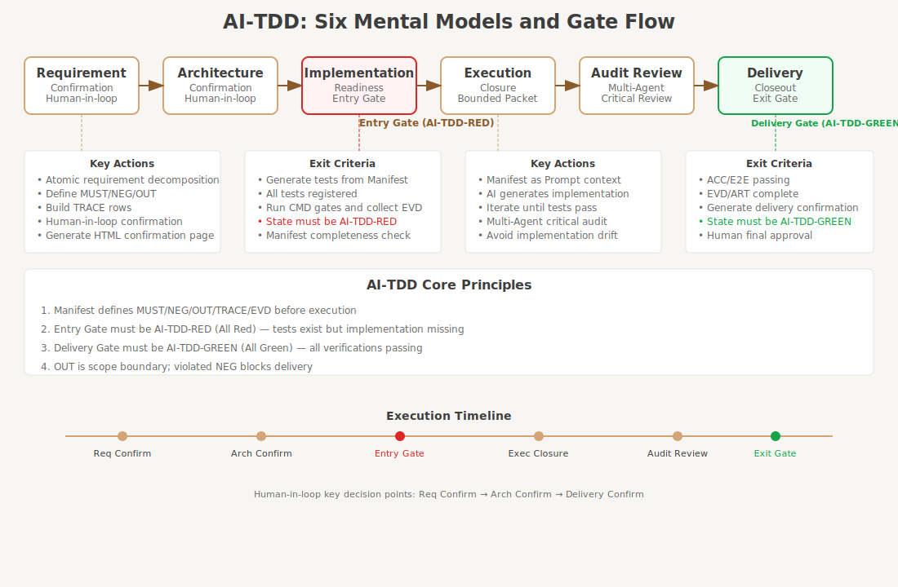
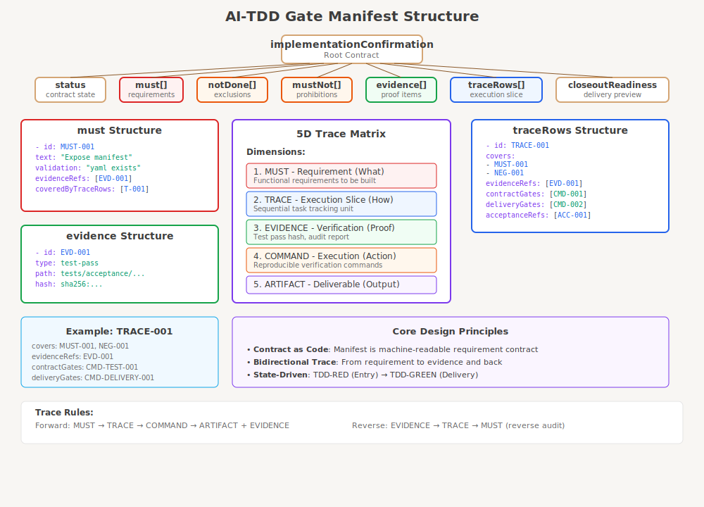
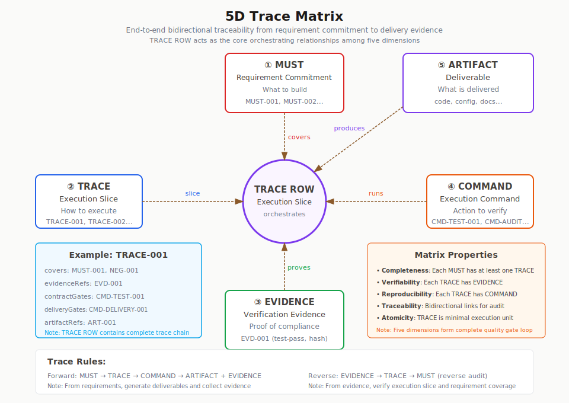
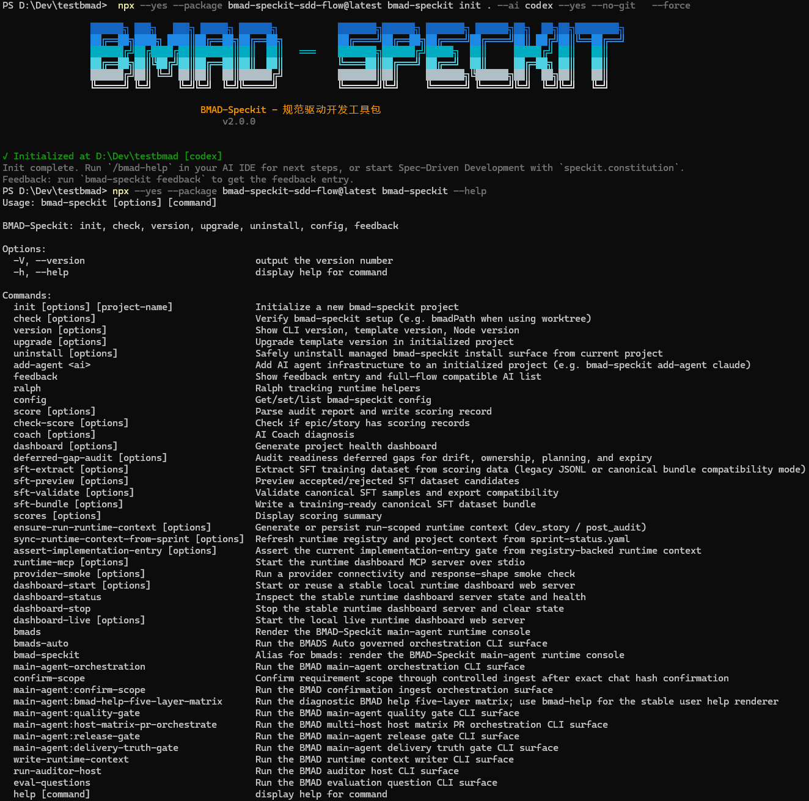

# BMAD-SpeCKit-SDD-Flow: Requirement-Contract Driven Agent Automation

English | [简体中文](README.zh-CN.md)

<p align="center">
  
</p>

<h3 align="center">
  Governed Spec-Driven AI Delivery for Cursor, Claude Code, and Codex
</h3>

<p align="center">
  <strong>Built on <a href="https://github.com/bmad-code-org/BMAD-METHOD">BMAD-METHOD</a> and <a href="https://github.com/github/spec-kit">Spec-Kit</a>.</strong><br>
  <em>The 1.x release line integrates BMAD + Speckit. The 2.0.0 release line turns that workflow into an AI-TDD control plane for governed Main Agent orchestration.</em>
</p>

<p align="center">
  <a href="LICENSE"></a>
  <a href="https://nodejs.org"></a>
</p>

## Table Of Contents

- [What This Is](#what-this-is)
- [Who This Is For](#who-this-is-for)
- [Prerequisites](#prerequisites)
- [Quick Start](#quick-start)
- [Runtime Model](#runtime-model)
- [1.x Five-Layer Architecture](#1x-five-layer-architecture)
- [AI-TDD Control Plane](#ai-tdd-control-plane)
- [Six Mental Models](#six-mental-models)
- [Manifest And Trace Evidence](#manifest-and-trace-evidence)
- [CLI Installation And External Interfaces](#cli-installation-and-external-interfaces)
- [Delivery Evidence](#delivery-evidence)
- [Release Line Compatibility](#release-line-compatibility)
- [Repository Map](#repository-map)
- [Documentation](#documentation)
- [Development And Contribution Policy](#development-and-contribution-policy)
- [License](#license)

---

## What This Is

BMAD-SpeCKit-SDD-Flow is not a prompt pack that asks AI to write more code. It is a Main Agent orchestration workflow that installs into consumer projects through the CLI, then runs inside Codex, Claude Code CLI, or Cursor through the `bmads` / `bmad-speckit` skills.

The goal is simple: make AI work inside requirement contracts, gates, evidence, and traceability. The 1.x release line connected BMAD and Speckit into a full delivery flow. The 2.0.0 release line makes that flow requirement-contract driven with AI-TDD, six mental models, and two delivery gates.

<p align="center">
  
</p>

The CLI is the installation and external interface. It installs the workflow into a consumer project, validates the install surface, and exposes runtime read models such as dashboard, scoring, Coach, and SFT extraction. Daily delivery control belongs to the Main Agent after the user activates it in the AI host.

---

## Who This Is For

This project is a good fit when you need:

- Governed AI delivery inside a consumer project, not just prompts.
- Requirement contracts, readiness gates, delivery gates, and evidence trails.
- A Main Agent that can inspect state, route work, enforce bounded execution, and block weak delivery claims.
- External read models for dashboard, scoring, Coach, and SFT workflows.

This project is not the best fit when you only want:

- A minimal prompt library with no runtime governance.
- A codegen-only CLI with no host-session workflow.
- A local script that skips requirement contracts and gate evidence.

---

## Prerequisites

| Tool | Version | Why it matters |
| --- | --- | --- |
| Node.js | 22+ | Required for the published CLI and package install surface. |
| npm | 9+ | Required for `npx --package`, local install, and workspace workflows. |
| PowerShell | 7+ on Windows | Recommended for setup, verification, and runtime helper scripts. |
| Git | 2.30+ | Required for worktrees, branch workflows, and contribution flow. |
| AI host | Codex, Claude Code CLI, or Cursor | Required for the normal `bmads` / `bmad-speckit` runtime entry. |

---

## Quick Start

For most consumer projects, use the published package to install the workflow surface, then activate the Main Agent inside the AI host.

```bash
npx --yes --package bmad-speckit-sdd-flow@latest bmad-speckit version
npx --yes --package bmad-speckit-sdd-flow@latest bmad-speckit-init . --agent claude-code --full --no-package-json
npx --yes --package bmad-speckit-sdd-flow@latest bmad-speckit-init . --agent cursor --full --no-package-json
npx --yes --package bmad-speckit-sdd-flow@latest bmad-speckit-init . --agent codex --full --no-package-json
npx --yes --package bmad-speckit-sdd-flow@latest bmad-speckit check
```

Then switch to the AI host session and activate the Main Agent:

```text
$bmads
```

If you are installing from a CI artifact instead of npm registry, use the same non-invasive path with the local tarball:

```bash
npx --yes --package ./bmad-speckit-sdd-flow-<version>.tgz bmad-speckit version
npx --yes --package ./bmad-speckit-sdd-flow-<version>.tgz bmad-speckit-init . --agent claude-code --full --no-package-json
npx --yes --package ./bmad-speckit-sdd-flow-<version>.tgz bmad-speckit-init . --agent cursor --full --no-package-json
npx --yes --package ./bmad-speckit-sdd-flow-<version>.tgz bmad-speckit-init . --agent codex --full --no-package-json
npx --yes --package ./bmad-speckit-sdd-flow-<version>.tgz bmad-speckit check
```

---

## Runtime Model

The normal user entry is typed inside the active AI host session:

```text
$bmads
/bmads
bmads
$bmad-speckit
/bmad-speckit
bmad-speckit
```

After activation, the Main Agent takes root governed runtime authority for the current request. Its first responsibility is not implementation. It must inspect the active requirement, read the current requirement record, determine the current mental model, show progress, and recommend the next governed action.

The Main Agent owns these decisions:

| Decision | Main Agent responsibility |
| --- | --- |
| Active requirement | Resolve the current requirement from explicit IDs or runtime requirement records. |
| Current mental model | Read `currentMentalModel` and continue from the governed stage instead of guessing from chat history. |
| Progress | Show what is confirmed, blocked, missing, or ready for the active requirement. |
| Next action | Recommend confirmation, architecture, readiness, dispatch, audit, rerun, or delivery closeout. |
| Evidence | Surface missing Manifest, trace, command, artifact, audit, score, or closeout evidence. |

CLI commands are allowed for install validation, CI, debug, fallback hosts, and external read models. They are not the primary daily activation path when the host skill is available.

Daily operation should stay simple: activate the host skill, let the Main Agent inspect the active requirement, and follow the governed next action it returns. Do not bypass the Implementation Readiness Gate by sending an implementation agent directly into coding. Do not claim delivery from dashboard green, score green, task completion, or chat confidence alone. Delivery closes only through the Delivery Closeout Gate and the current evidence chain.

---

## 1.x Five-Layer Architecture

The 1.x release line remains the delivery map that connects BMAD product discovery to Speckit implementation. It is still the easiest way to explain how product intent becomes audited, reviewable delivery.

<p align="center">
  
</p>

| Layer | Purpose | Primary output |
| --- | --- | --- |
| Layer 1: Product Brief | Define product intent, users, goals, and problem framing. | Product brief and discovery notes. |
| Layer 2: PRD + Architecture | Turn intent into requirements, architecture boundaries, and risk decisions. | PRD and architecture documents. |
| Layer 3: Epic / Story | Split product and architecture scope into executable story units. | Epics, stories, and story context. |
| Layer 4: Speckit Workflow | Run `specify -> plan -> GAPS -> tasks -> implement` for technical execution. | Specs, plans, gap analysis, tasks, code, and tests. |
| Layer 5: Closeout And Integration | Audit implementation, score evidence, and prepare reviewable delivery. | Post-audit, scoring, PR, human review, and release evidence. |

In the 2.0.0 release line, this five-layer architecture is not removed. It becomes the upstream delivery map that feeds the AI-TDD control plane: product and story artifacts become requirement-contract inputs, Speckit work becomes bounded execution packets, and delivery still closes only through controlled evidence gates.

---

## AI-TDD Control Plane

AI-TDD in this project means Manifest-level, acceptance-driven development. The Manifest is the requirement contract matrix: it carries `MUST`, `NEG` (`MUST NOT` negative assertions), `OUT` (`OUT OF SCOPE` boundaries), `TRACE`, `EVD`, `ACC/E2E`, `FAIL/EDGE`, `CMD`, `ART`, and `TASK` definitions that both humans and agents can verify. `MUST NOT` is the conceptual alias for `NEG-*`; older `NOT DONE` wording means `OUT OF SCOPE / OUT-*`.

The control plane exists to enforce two rules:

| Rule | Gate |
| --- | --- |
| No complete Manifest, no execution. | Implementation Readiness Gate, expected status `AI-TDD-RED`. |
| Unverified Manifest items, no delivery. | Delivery Closeout Gate, expected status `AI-TDD-GREEN`. |

<p align="center">
  
</p>

The readiness gate does not mean "the feature is done." It means the requirement contract is complete enough, the acceptance baseline exists, and implementation is allowed to start from `AI-TDD-RED`. The delivery closeout gate means all Manifest-linked acceptance items and evidence are verified before completion language is allowed.

---

## Six Mental Models

The Main Agent drives every requirement through six mental models. They are not dashboard tabs. They are the questions that decide whether the next action is confirmation, architecture, readiness, execution, audit, or delivery closeout.

<p align="center">
  
</p>

| Mental model | Governed question | Target outcome |
| --- | --- | --- |
| Requirement Confirmation | What is in scope, out of scope, and provable by evidence IDs? | Confirmed requirement contract. |
| Architecture Confirmation | Does the implementation boundary still match the confirmed architecture and risk envelope? | Confirmed architecture boundary. |
| Implementation Readiness | Is the Manifest complete enough and is the acceptance baseline registered? | Entry gate reaches `AI-TDD-RED`. |
| Execution Closure | Did bounded agents implement only within the contract and produce traceable evidence? | Bounded execution closes against the Manifest. |
| Audit Review | Do findings, reruns, RCA, scores, and review evidence have verifiable provenance? | Audit evidence is current and replayable. |
| Delivery Confirmation | Are all acceptance items and delivery evidence verified for the current closeout attempt? | Delivery gate reaches `AI-TDD-GREEN`. |

Implementation agents do not choose the global route. They receive bounded packets only after readiness passes, then the Main Agent re-inspects state after each child result, audit result, rerun, or blocking event.

---

## Manifest And Trace Evidence

The Manifest is the source of truth for the AI-TDD contract. It is closer to contract-as-code than to a prose requirements document.

<p align="center">
  
</p>

Every meaningful delivery claim should be traceable across requirement, trace, evidence, command, and artifact dimensions.

<p align="center">
  
</p>

The Main Agent should block or reroute when Manifest completeness, trace coverage, command evidence, artifact evidence, audit provenance, or closeout evidence is missing.

---

## CLI Installation And External Interfaces

Install the workflow into a consumer project with the published npm package. These commands are for installation, validation, lifecycle operations, and external runtime views.

```bash
npx --yes --package bmad-speckit-sdd-flow@latest bmad-speckit --help
npx --yes --package bmad-speckit-sdd-flow@latest bmad-speckit version
npx --yes --package bmad-speckit-sdd-flow@latest bmad-speckit-init . --agent claude-code --full --no-package-json
npx --yes --package bmad-speckit-sdd-flow@latest bmad-speckit-init . --agent cursor --full --no-package-json
npx --yes --package bmad-speckit-sdd-flow@latest bmad-speckit-init . --agent codex --full --no-package-json
npx --yes --package bmad-speckit-sdd-flow@latest bmad-speckit check
npx --yes --package bmad-speckit-sdd-flow@latest bmad-speckit dashboard-status
```

If you prefer a project dependency:

```bash
npm install --save-dev bmad-speckit-sdd-flow@latest
npx bmad-speckit-init . --agent codex --full --no-package-json
npx bmad-speckit check
```

The public CLI exposes these auxiliary surfaces:

| Surface | Commands |
| --- | --- |
| Install and lifecycle | `init`, `check`, `version`, `upgrade`, `uninstall`, `add-agent`. |
| Runtime read models | `bmads`, `bmad-speckit`, `dashboard-start`, `dashboard-status`, `dashboard-stop`, `dashboard-live`, `runtime-mcp`. |
| Evidence and scoring | `score`, `check-score`, `scores`, `dashboard`, `deferred-gap-audit`. |
| Data and feedback | `coach`, `sft-extract`, `sft-preview`, `sft-validate`, `sft-bundle`, `feedback`. |

### Public CLI Surface

The screenshot below shows the published npm CLI command surface. It is a quick reference for installation, lifecycle, runtime read models, scoring, Coach, and SFT tooling; it is not the daily Main Agent workflow.

<p align="center">
  
</p>

### Install Verification

Recommended install verification commands for a consumer project:

```bash
npx --yes --package bmad-speckit-sdd-flow@latest bmad-speckit version
npx --yes --package bmad-speckit-sdd-flow@latest bmad-speckit check
npx --yes --package bmad-speckit-sdd-flow@latest bmad-speckit dashboard-status
```

Use the CLI to install and inspect. Use the host skill to let the Main Agent control the requirement flow.

---

## Delivery Evidence

Delivery evidence is different from the CLI command-surface screenshot. It is the gate material used to decide whether the active requirement can close through the Delivery Closeout Gate.

| Evidence type | Required proof |
| --- | --- |
| Requirement contract | Confirmed Manifest and requirement record. |
| Readiness | Implementation Readiness Gate result at `AI-TDD-RED`. |
| Execution | Bounded packet result, command evidence, artifact index, and trace closure. |
| Audit | Findings, reruns, RCA, score records, and provenance. |
| Delivery | Delivery Closeout Gate result at `AI-TDD-GREEN` for the current attempt. |

---

## Release Line Compatibility

The 1.x release line BMAD + Speckit assets remain part of the compatibility surface: Product Brief, PRD, Architecture, Epic/Story, Speckit specify/plan/GAPS/tasks, implementation, audit, scoring, dashboard, Coach, and SFT extraction remain useful.

The 2.0.0 release line now presents the five-layer architecture as the 1.x delivery map before introducing AI-TDD. Its primary authority is still the AI-TDD toolchain ecosystem and the Main Agent control plane. 1.x artifacts are inputs and projections inside that control plane, not a replacement for requirement-contract authority.

---

## Repository Map

This map describes the tracked source and package layout. Local/generated folders such as `node_modules/`, `coverage/`, `test-results/`, `_bmad-output/`, `outputs/`, `reports/`, `tmp-*`, `.worktrees/`, and host cache directories can appear during development, but they are not source modules.

```text
BMAD-Speckit-SDD-Flow/
├── _bmad/                 # Canonical workflow assets installed into consumer projects
├── bin/                   # Published root package bin wrappers
├── docs/                  # User docs, reference docs, ops notes, evidence assets
├── packages/              # npm workspace packages
│   ├── bmad-speckit/      # Internal CLI workspace bundled by the root package
│   ├── ralph-method/      # Task-level TDD evidence tracker for Speckit implementation
│   ├── runtime-context/   # Runtime context registry and ensure-run utilities
│   ├── runtime-emit/      # Pre-bundled runtime policy/audit emit tools
│   ├── schema/            # Shared schema assets
│   └── scoring/           # Scoring, dashboard, Coach, and SFT tooling
├── scripts/               # Installers, CLI entrypoints, gates, release/test utilities
├── specs/                 # Epic/story specs, audits, and governed delivery evidence
├── src/                   # Shared source helpers for host/story validation workflows
├── templates/             # Consumer-facing templates such as MCP setup
├── tests/                 # Acceptance, integration, unit, fixture, and host tests
└── website/               # Documentation site source
```

The published root npm package is assembled from `package.json#files`. It does not publish every local development directory; it packages the install/runtime surface such as `_bmad/`, `bin/`, `scripts/`, selected docs/assets, scoring, runtime-context pieces, and selected acceptance fixtures.

---

## Documentation

- [Getting Started](docs/tutorials/getting-started.md)
- [Main-Agent Orchestration Reference](docs/reference/main-agent-orchestration.md)
- [Consumer Installation Guide](docs/how-to/consumer-installation.md)
- [Runtime Dashboard Guide](docs/how-to/runtime-dashboard.md)
- [Runtime MCP Installation](docs/how-to/runtime-mcp-installation.md)
- [Provider Configuration](docs/how-to/provider-configuration.md)
- [Cursor Setup](docs/how-to/cursor-setup.md)
- [Claude Code Setup](docs/how-to/claude-code-setup.md)
- [Codex Setup](docs/how-to/codex-setup.md)
- [Run Tests Locally](docs/how-to/run-tests-locally.md)

---

## Development And Contribution Policy

This is primarily a personal workflow project. I publish it because the workflow may be useful to others, but I cannot commit to a fixed schedule for reviewing issues, feature requests, or pull requests.

Bug reports, documentation fixes, and small compatibility improvements are welcome. For larger features, architectural changes, or workflows that do not align with my current usage, forking the project and adapting it to your own context is the recommended path.

If you still want to contribute upstream:

- Read [CONTRIBUTING.md](CONTRIBUTING.md) for local setup, branch conventions, tests, and pull request expectations.
- Read [CODE_OF_CONDUCT.md](CODE_OF_CONDUCT.md) for community standards.
- Use [docs/how-to/run-tests-locally.md](docs/how-to/run-tests-locally.md) for local verification flow.

Common local validation commands:

```bash
npm install
npm test
npm run lint
npm run format:check
```

For repository maintainers, the internal workspace CLI implementation lives in [packages/bmad-speckit/README.md](packages/bmad-speckit/README.md). Consumer users should still follow the root package contract documented in this README.

---

## License

Released under the [MIT License](LICENSE).

---

<p align="center">
  <a href="LICENSE">MIT License</a> •
  <a href="https://github.com/bmad-code-org/BMAD-METHOD">BMAD-METHOD</a> •
  <a href="https://github.com/github/spec-kit">Spec-Kit</a>
</p>
