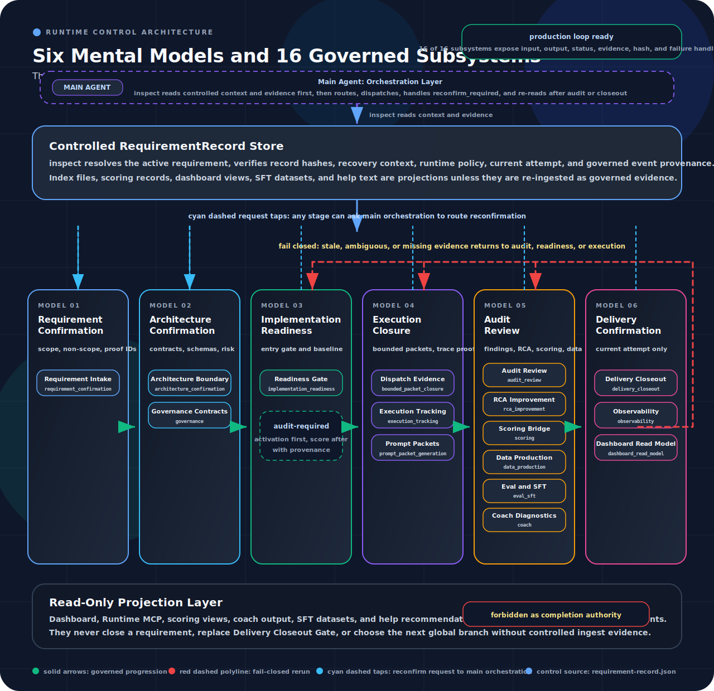

# BMAD-Speckit-SDD-Flow

English | [简体中文](README.zh-CN.md)

<p align="center">
  
</p>

<h3 align="center">
  Governed Spec-Driven AI Delivery for Cursor, Claude Code, and Codex
</h3>

<p align="center">
  <strong>Built on <a href="https://github.com/bmad-code-org/BMAD-METHOD">BMAD-METHOD</a> and <a href="https://github.com/github/spec-kit">Spec-Kit</a>.</strong><br>
  <em>Runtime governance, mandatory audit loops, dashboard observability, and published npm installation in one flow.</em>
</p>

<p align="center">
  <a href="LICENSE"></a>
  <a href="https://nodejs.org"></a>
</p>

---

## Why This Flow?

Traditional AI tooling often stops at prompt orchestration. BMAD-Speckit-SDD-Flow turns that into a governed delivery pipeline: specify, plan, audit, enter implementation through readiness gates, run runtime governance during execution, then close out into scoring, dashboard, coach, and SFT data.

<p align="center">
  
</p>

### Key Capabilities

- **Six-model governed control plane**: requirement, architecture, readiness, execution, audit, and delivery are explicit runtime questions, not loose checklist labels.
- **16-subsystem production-loop readiness**: every production-loop subsystem must expose machine-readable inputs, outputs, status, evidence, hashes, and failure handling before delivery can be trusted.
- **Controlled RequirementRecord authority**: `inspect` resolves the active requirement, reloads governed state from the record, verifies provenance, and only then chooses the next global branch.
- **Readiness baseline self-healing**: readiness gates write controlled `audit_required` activation metadata, while the audit/scoring pipeline writes `implementation_readiness` score records with verifiable provenance.
- **Bounded packet execution**: `dispatch-plan` is generated only when `inspect` says dispatch is allowed; child agents execute bounded packets and cannot choose the global route.
- **Audit, scoring, and projection separation**: audit owns scored evidence, while dashboard, MCP, coach, SFT, and help surfaces are read-only projections unless re-ingested as governed evidence.
- **Fail-closed delivery governance**: ambiguous active requirements, stale hashes, missing current attempts, stale baselines, incomplete evidence, or subsystem coverage gaps block, rerun, or require controlled closeout.

> Image strategy: README assets live in `docs/assets/` and are tracked in Git. The package `README.md` is rendered on npm as GitHub Flavored Markdown, so keeping repository assets tracked and using repository-relative paths is the most reliable cross-surface strategy for GitHub and npm. Source: [About package README files](https://docs.npmjs.com/about-package-readme-files)

---

## Runtime Governance At A Glance

- **Inspect first, fail closed**: the main agent starts from `main-agent-orchestration inspect`; missing, ambiguous, or stale active requirement resolution does not fall through to implementation.
- **RequirementRecord is control authority**: `requirement-records/index.json` is a locator projection; the current control state is reloaded from the requirement record and governed event history.
- **Readiness gate activates audit, not score**: readiness pass writes controlled activation metadata and can trigger or request a readiness audit; it does not directly create score records.
- **Audit writes scored provenance**: the audit/scoring pipeline writes `RunScoreRecord` entries such as `stage=implementation_readiness`, including score, audit, gate, record hash, and command provenance.
- **Drift baseline precedence is deterministic**: current requirement metadata wins, then requirement-scoped scoring baseline, then legacy `packages/scoring/data`; runtime context fallback is not allowed.
- **Dispatch remains conditional**: `dispatch-plan` appears only when the controlled record says bounded packet execution should happen; otherwise closeout, audit, rerun, or blocked diagnostics are surfaced.
- **Closeout is attempt-scoped**: a closeout pass leads to `completed_no_dispatch` only for the current governed attempt; missing global scoring baseline alone must not become an implementation blocker.
- **Diagnostics are user-visible**: `inspect` explains missing active requirement, missing readiness baseline, stale baseline, projection-only surfaces, and evidence gaps instead of returning silent "not ready" states.

### Six Mental Models

The latest runtime path is organized around six mental models. They are not dashboard tabs or status colors; they are the governed questions the main agent must answer from `requirement-record.json`, `currentMentalModel`, current attempt metadata, and controlled ingest events before it can continue.

<p align="center">
  
</p>

<p align="center"><em>Figure: the diagram uses the ClawScope README architecture style as visual reference while mapping BMAD-Speckit-SDD-Flow's six control lanes and sixteen governed subsystems.</em></p>

The active chain is:

1. **Requirement Confirmation**: what is in scope, what is out of scope, and which evidence IDs prove closure.
2. **Architecture Confirmation**: whether implementation still fits the confirmed boundary, shared contracts, and risk envelope.
3. **Implementation Readiness**: whether the controlled record permits implementation, including readiness baseline activation.
4. **Execution Closure**: whether bounded packets, trace closure, command evidence, and artifact indexing exist for the current run.
5. **Audit Review**: whether findings, reruns, RCA, and audit-written `RunScoreRecord` data carry verifiable provenance.
6. **Delivery Confirmation**: whether the current closeout attempt alone authorizes completion language and delivery closure.

Dashboard, runtime MCP, scoring, coach, and SFT outputs are read-only projections over that chain. They improve navigation and observability, but dashboard green, score green, task done, SFT generated, or legacy `mainAgentReady` hints cannot close a requirement or choose the next global branch.

The table below is the primary-owner map. A subsystem can emit evidence or projections across more than one model, but the primary lane shows which mental model owns the control decision.

`main_agent_orchestration` is the cross-cutting control layer over all six mental models. It is not owned by Execution Closure alone; Execution Closure owns the packet dispatch and trace evidence produced under that orchestration.

| Mental model | Primary subsystem ownership | Runtime question |
| --- | --- | --- |
| Requirement Confirmation | `requirement_confirmation` | Scope, exclusions, and proof IDs. |
| Architecture Confirmation | `architecture_confirmation`, `governance` | Boundaries, contracts, schemas, and risks. |
| Implementation Readiness | `implementation_readiness` | Entry permission and current readiness baseline. |
| Execution Closure | `execution_tracking`, `prompt_packet_generation`, `bounded_packet_closure` | Bounded dispatch, trace closure, packet evidence, and rerun routing. |
| Audit Review | `audit_review`, `rca_improvement`, `scoring`, `data_production`, `eval_sft`, `coach` | Findings, RCA, score provenance, derived datasets, and coach feedback. |
| Delivery Confirmation | `delivery_closeout`, `observability`, `dashboard_read_model` | Current closeout attempt, observability evidence, and read-model projection. |

## Dashboard And MCP

- **Dashboard is default**: the published package supports runtime dashboard status, start/stop helpers, and runtime snapshot generation without any extra MCP setup.
- **Runtime MCP is optional**: enable it only when you want runtime data exposed as agent tools via `--with-mcp`.
- **Dashboard and runtime governance do not depend on MCP**: live dashboard, hooks, scoring projection, and runtime close-out all work without `.mcp.json`.

Quick mental model:

- `dashboard`: human-facing runtime and scoring visibility
- `runtime-mcp`: explicit agent-tool surface over the same runtime data

---

## Recommended npm Installation

Ensure you have **[Node.js](https://nodejs.org) v18+** installed.

### Recommended Off-Repo Install From npm

Use the published root package directly. This is the current recommended path when you're installing into a consumer project without cloning this repository.

This is the verified off-repo path for the published package contract.

```bash
npx --yes --package bmad-speckit-sdd-flow@latest bmad-speckit version
npx --yes --package bmad-speckit-sdd-flow@latest bmad-speckit-init . --agent claude-code --full --no-package-json
npx --yes --package bmad-speckit-sdd-flow@latest bmad-speckit-init . --agent cursor --full --no-package-json
npx --yes --package bmad-speckit-sdd-flow@latest bmad-speckit-init . --agent codex --full --no-package-json
npx --yes --package bmad-speckit-sdd-flow@latest bmad-speckit check
npx --yes --package bmad-speckit-sdd-flow@latest bmad-speckit dashboard-status
```

Why this is the recommended path:

- it uses the published single public root package
- it aligns both host surfaces explicitly
- it preserves the non-invasive `--no-package-json` consumer install style
- it matches the validated published package flow rather than an older bootstrap-only shortcut

### Persistent Install In A Project

If you want the package present in the consumer project's dependency tree:

```bash
npm install --save-dev bmad-speckit-sdd-flow@latest
npx bmad-speckit-init . --agent claude-code --full --no-package-json
npx bmad-speckit-init . --agent cursor --full --no-package-json
npx bmad-speckit check
```

### Quick Bootstrap Path

The faster bootstrap command still exists:

```bash
npx --yes --package bmad-speckit-sdd-flow@latest bmad-speckit init . --ai cursor-agent --yes
```

Treat that as a quick initializer, not the highest-confidence installation path for the full runtime governance surface. If you care about the latest published hooks, runtime governance, dashboard wiring, and dual-host alignment, use the recommended installation path above.

> Need help choosing the next governed route? Run `/bmad-help` in your AI IDE. It evaluates `flow`, `contextMaturity`, `complexity`, and `implementationReadinessStatus` before recommending or blocking routes.

### Alternative Deployments

<details>
<summary><b>Install via CI Artifact (Consumer Projects)</b></summary>
<br>
If you are installing from a release artifact instead of npm registry:

1. Download the `npm-packages-<commit-sha>` artifact from GitHub Actions.
2. Extract the `bmad-speckit-sdd-flow-<version>.tgz` tarball.
3. Install and initialize:
   ```bash
   npx --yes --package ./bmad-speckit-sdd-flow-<version>.tgz bmad-speckit version
   npx --yes --package ./bmad-speckit-sdd-flow-<version>.tgz bmad-speckit-init . --agent claude-code --full --no-package-json
   npx --yes --package ./bmad-speckit-sdd-flow-<version>.tgz bmad-speckit-init . --agent cursor --full --no-package-json
   ```
   </details>

<details>
<summary><b>One-Line Deploy Scripts</b></summary>
<br>

```powershell
# Windows
pwsh scripts/setup.ps1 -Target <project-path>
```

```bash
# WSL / Linux / macOS
bash scripts/setup.sh -Target <project-path>
```

</details>

<details>
<summary><b>Safe Uninstallation</b></summary>
<br>
To remove managed installation surfaces in the current project:

```bash
npx --yes --package bmad-speckit-sdd-flow@latest bmad-speckit uninstall
```

This only removes installer-managed entries. It does not delete `.cursor`, `.claude`, or global skills, and it never deletes `_bmad-output`.

</details>

---

## Architecture And Modules

### Core Components

| Component                   | Purpose                                                                                                                                    |
| :-------------------------- | :----------------------------------------------------------------------------------------------------------------------------------------- |
| **`_bmad/`**                | Canonical source of truth for workflow modules, hooks, prompts, routing, and host-facing assets.                                           |
| **`packages/scoring/`**     | Scoring engine, readiness drift evaluation, dashboard projection, coach inputs, and SFT extraction.                                        |
| **`dashboard`**             | Default runtime observability surface: live dashboard, runtime snapshots, and scoring projections.                                         |
| **`runtime-mcp`**           | Optional MCP surface for agent tools over runtime data; enabled explicitly with `--with-mcp`.                                              |
| **`speckit-workflow`**      | Specify -> Plan -> GAPS -> Tasks -> TDD with mandatory audit loops.                                                                        |
| **`bmad-story-assistant`**  | Story lifecycle entry: main agent reads `inspect`, dispatches bounded packets when needed, and closes post-audit through `runAuditorHost`. |
| **`bmad-bug-assistant`**    | Bug lifecycle path: RCA -> Party Mode -> BUGFIX -> Implement, while the main Agent still owns the global `inspect -> dispatch-plan -> closeout` chain. |
| **`bmad-standalone-tasks`** | TASKS/BUGFIX execution still follows the main-agent path: `inspect` first, `dispatch-plan` only when needed, then bounded subagent work.             |

<details>
<summary><b>View Folder Structure</b></summary>

```text
BMAD-Speckit-SDD-Flow/
├── _bmad/                # Core modules and configuration
├── packages/             # Monorepo packages (CLI, scoring)
├── scripts/              # Setup and deployment utilities
├── docs/                 # Diataxis-style documentation
├── tests/                # Acceptance & epic testing
└── specs/                # Generated story specs
```

</details>

---

## Documentation

Key entry points:

- [Getting Started](docs/tutorials/getting-started.md)
- [Main-Agent Orchestration Reference](docs/reference/main-agent-orchestration.md)
- [Consumer Installation Guide](docs/how-to/consumer-installation.md)
- [Runtime Dashboard Guide](docs/how-to/runtime-dashboard.md)
- [Runtime MCP Installation](docs/how-to/runtime-mcp-installation.md)
- [Provider Configuration](docs/how-to/provider-configuration.md)
- [Cursor Setup](docs/how-to/cursor-setup.md)
- [Claude Code Setup](docs/how-to/claude-code-setup.md)
- [WSL / Shell Scripts](docs/how-to/wsl-shell-scripts.md)

---

<p align="center">
  <a href="LICENSE">MIT License</a> •
  <a href="https://github.com/bmad-code-org/BMAD-METHOD">BMAD-METHOD</a> •
  <a href="https://github.com/github/spec-kit">Spec-Kit</a>
</p>
