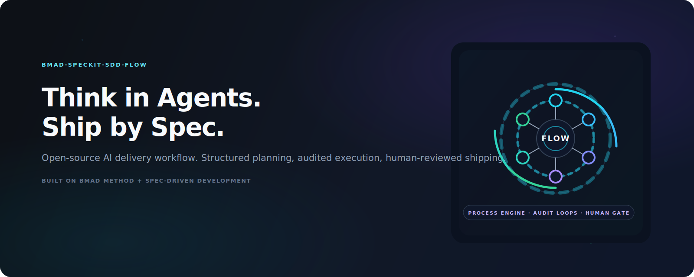

# BMAD-Speckit-SDD-Flow

[](LICENSE)
[](https://nodejs.org)

<p align="center">
  
</p>

**Built on** [BMAD-METHOD](https://github.com/bmad-code-org/BMAD-METHOD) and [github/spec-kit](https://github.com/github/spec-kit).
**Extended with** audit loops, critical auditor, scoring system, AI Coach, and SFT fine-tuning data extraction.

100% free and open source. No paywalls.

---

## Why BMAD-Speckit-SDD-Flow?

Traditional AI tools do the thinking for you. BMAD-Speckit-SDD-Flow combines **BMAD Method** (agile, party-mode, multi-agent) with **Spec-Driven Development** (specify → plan → GAPS → tasks → TDD), adding:

- **Five-layer architecture** — Product Brief → PRD → Architecture → Epic/Story → speckit specify/plan/GAPS/tasks → TDD implement → PR + human review
- **Mandatory audit loops** — Each stage requires code-review pass before proceeding
- **Critical Auditor** — Dedicated challenger role, >60% share in party-mode
- **Scoring system** — Multi-stage weighted scores, one-vote veto, AI Coach diagnosis
- **SFT extraction** — Instruction-response pairs from low-score runs for fine-tuning

---

## Quick Start

**Prerequisites**: [Node.js](https://nodejs.org) v18+

```bash
# Initialize in current directory
npx bmad-speckit init . --ai cursor-agent --yes

# Or create a new project
npx bmad-speckit init my-project --ai cursor-agent --yes

# Verify installation
npx bmad-speckit check
```

> **Not sure what to do?** Run `/bmad-help` in your AI IDE. See [Installation & Migration Guide](docs/INSTALLATION_AND_MIGRATION_GUIDE.md) for details.

**One-line deploy**:

```powershell
# Windows
pwsh scripts/setup.ps1 -Target <project-path>
```

```bash
# WSL / Linux / macOS
bash scripts/setup.sh -Target <project-path>
# or: npm run setup:sh -- -Target <path>
```

See [WSL / Shell scripts](docs/WSL_SHELL_SCRIPTS.md) for full shell script reference.

---

## Built On

| Upstream | Purpose |
|----------|---------|
| [BMAD-METHOD](https://github.com/bmad-code-org/BMAD-METHOD) | Agile workflows, Party Mode, 34+ workflows |
| [github/spec-kit](https://github.com/github/spec-kit) | Spec-Driven Development (constitution, specify, plan, tasks) |

**Our extensions**: scoring, critical auditor, speckit-workflow audit loops, bmad-story-assistant, bmad-bug-assistant.

---

## Modules & Components

| Component | Purpose |
|-----------|---------|
| **_bmad/** | BMAD core (core, bmm, bmb, cis, tea, scoring) |
| **speckit-workflow** | specify → plan → GAPS → tasks → TDD with mandatory audits |
| **bmad-story-assistant** | Create Story → Party-Mode → Dev Story → implement |
| **bmad-bug-assistant** | Bug description → Party-Mode → BUGFIX doc |
| **bmad-standalone-tasks** | Execute TASKS/BUGFIX docs via subagents |

---

## Documentation

- [Installation & Migration Guide](docs/INSTALLATION_AND_MIGRATION_GUIDE.md)
- [bmad-speckit CLI Manual](docs/BMAD/bmad-speckit-CLI功能说明.md)
- [Integration Spec](docs/BMAD/bmad-speckit-integration-FINAL-COMPLETE.md)
- [Upstream & Sync](docs/BMAD/BMAD-METHOD-v6-Gaps与同步建议.md)

---

## License

MIT License — see [LICENSE](LICENSE) for details.
