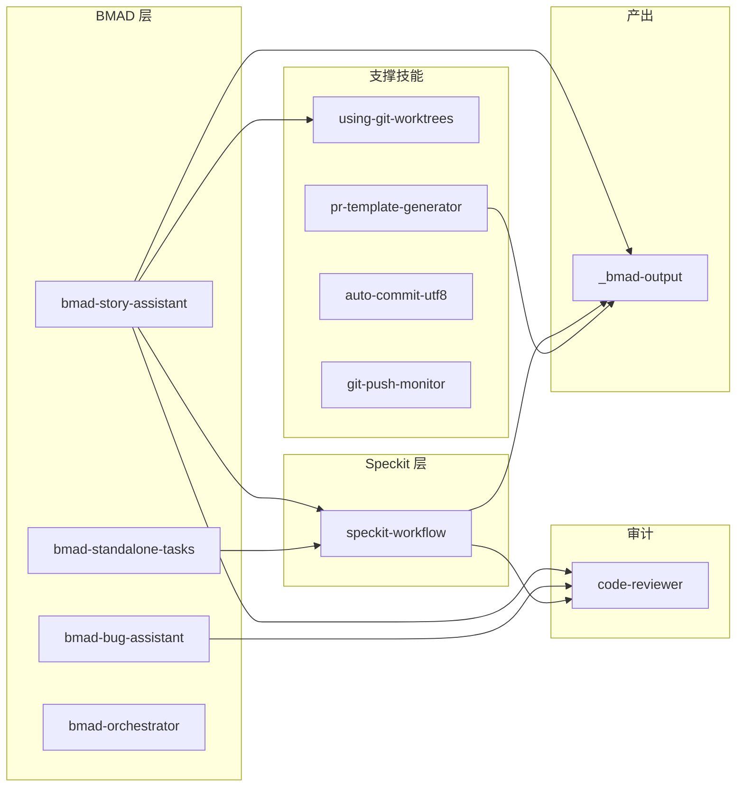
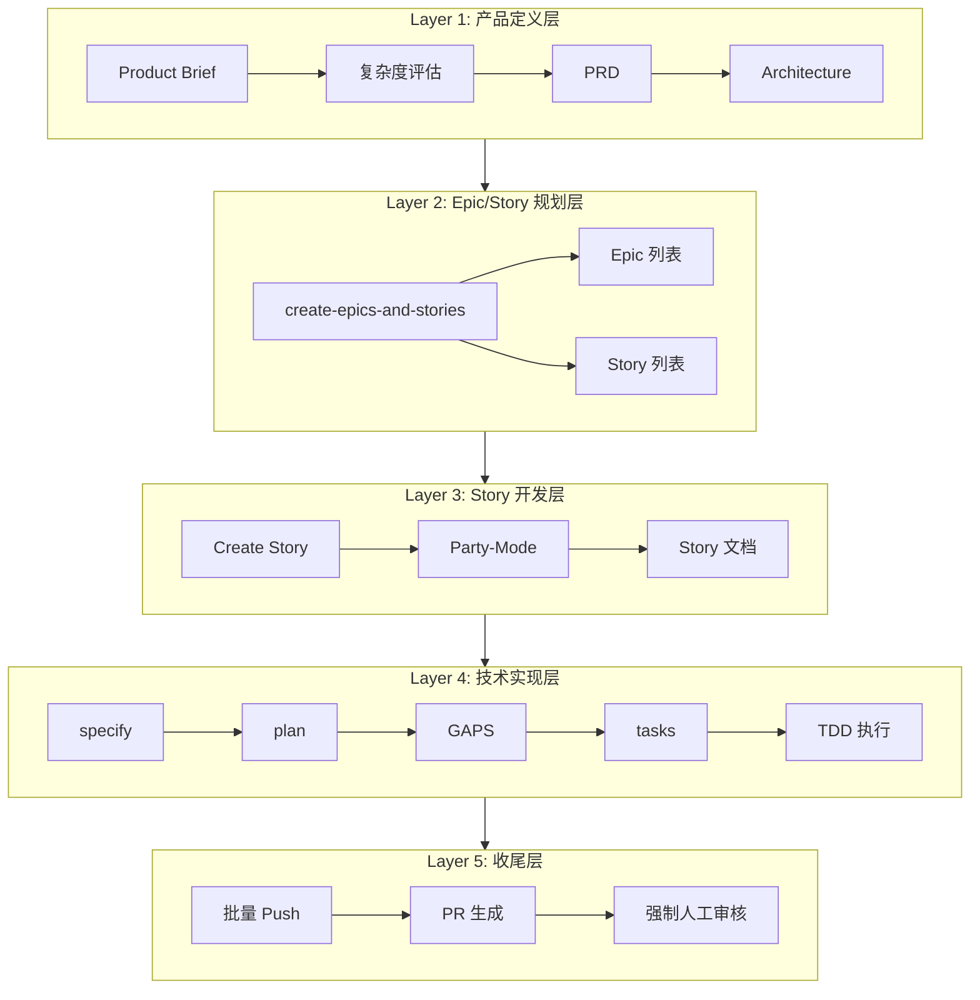
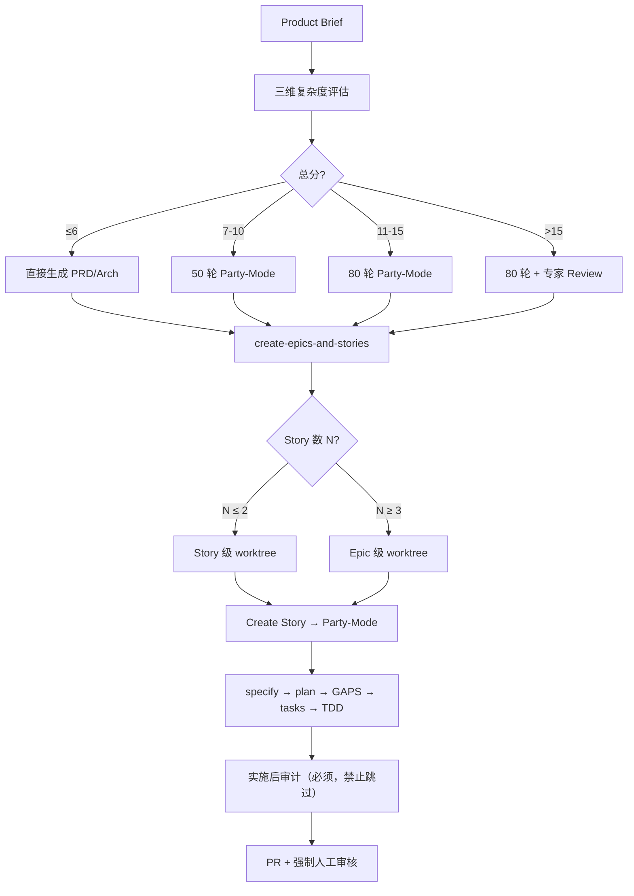
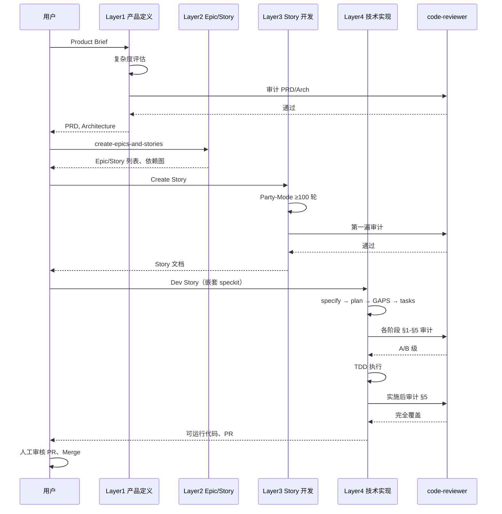
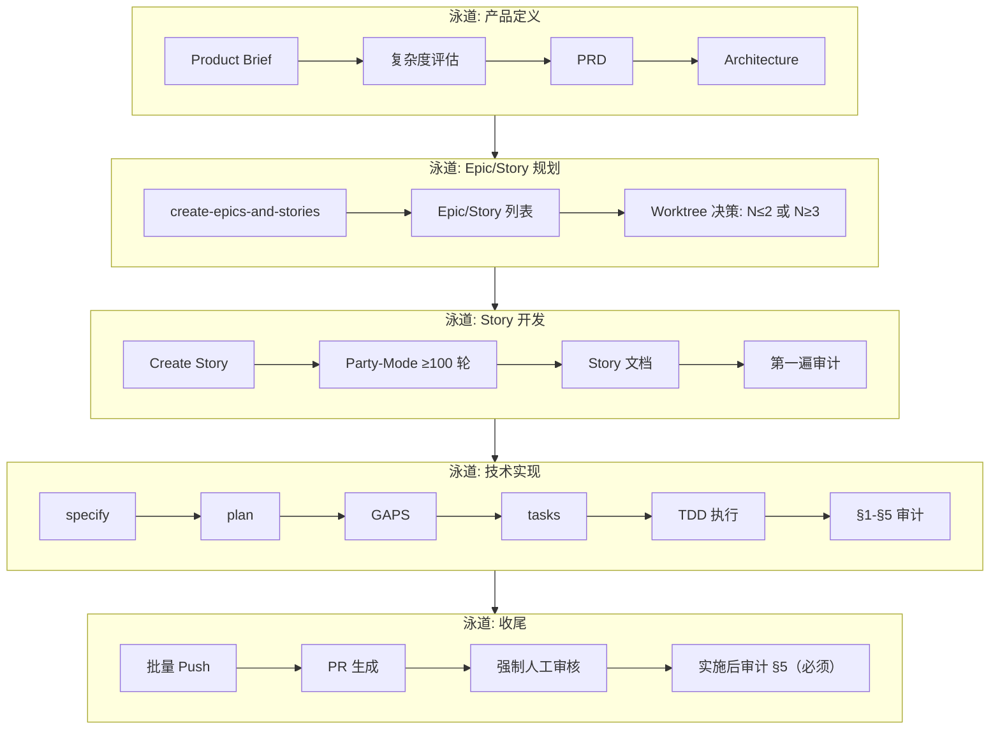

# BMAD-Speckit-SDD-Flow

将 **BMAD + Speckit** 工作流与评分扩展骨架集中到独立仓库，便于克隆或通过 npx/npm 安装到项目根后，与现有 Cursor 技能（bmad、speckit-workflow）协同使用。

**目标**：独立可运行的 Speckit 流程（constitution → spec → plan → GAPS → tasks → implement）、与审计闭环强绑定的步骤与审计 prompt、可复用脚本/模板/文档、评分扩展骨架。**目录**：`_bmad/`、`_bmad-output/`、`workflows/`、`commands/`、`rules/`、`config/`、`templates/`、`docs/`、`scoring/`、`skills/`。**最小复现**：克隆后可将 `commands/`、`rules/`、`_bmad`、`_bmad-output` 复制到项目根，或使用 npx 安装；详见 [docs/BMAD/bmad-speckit-integration-FINAL-COMPLETE.md](docs/BMAD/bmad-speckit-integration-FINAL-COMPLETE.md)。

下文为 **BMAD 与 Speckit 整合方案** 的流程总览与图示（含 Mermaid 模块图、架构图、流程图、时序图、泳道图），便于快速理解五层架构、决策点与审计链。完整规格与实施细节见 **docs/BMAD/bmad-speckit-integration-FINAL-COMPLETE.md**。

---

## 1. 文档来源与用途

| 项目 | 说明 |
|------|------|
| **权威文档** | [bmad-speckit-integration-FINAL-COMPLETE.md](docs/BMAD/bmad-speckit-integration-FINAL-COMPLETE.md)（五层架构、复杂度评估、Party-Mode、Worktree、审计、回滚） |
| **本 README** | 基于 FINAL-COMPLETE 提炼的流程图与速查表，供入口与 PoC/流程图查阅 |
| **版本** | Final v2.0 (Complete)，2026-03-02，已批准实施 |

---

## 2. Mermaid 图示

以下为 Mermaid 格式的模块图、架构图、流程图、时序图与泳道图，便于在支持 Mermaid 的查看器中渲染（如 GitHub、GitLab、VS Code 插件、Typora）。

### 2.1 模块图 (Module Diagram)

技能与核心组件的依赖关系；bmad 引用 speckit，单向依赖。



### 2.2 架构图 (Architecture Diagram)

五层架构及每层主要组件。



### 2.3 流程图 (Flowchart)

主流程与关键决策（复杂度、Worktree）。



### 2.4 时序图 (Sequence Diagram)

用户与各层、审计的交互顺序。



### 2.5 泳道图 (Swimlane)

按职责分泳道：产品定义、规划、Story 开发、技术实现、收尾。



---

## 3. 五层架构总览（主流程图）

```
┌─────────────────────────────────────────────────────────────────────────────┐
│ Layer 1: 产品定义层                                                           │
│   Product Brief → 复杂度评估(3–15分) → PRD → Architecture                     │
│   Party-Mode: 按分数触发（跳过/50轮/80轮/80轮+专家）                           │
│   审计: code-review(prd/arch 模式)                                            │
└─────────────────────────────────────────────────────────────────────────────┘
                                        ↓
┌─────────────────────────────────────────────────────────────────────────────┐
│ Layer 2: Epic/Story 规划层                                                     │
│   create-epics-and-stories → Epic 列表、Story 列表、依赖图                    │
│   决策: Story 数 ≤2 → Story 级 worktree；≥3 → Epic 级 worktree               │
└─────────────────────────────────────────────────────────────────────────────┘
                                        ↓
┌─────────────────────────────────────────────────────────────────────────────┐
│ Layer 3: Story 开发层                                                          │
│   Create Story（细化）→ Party-Mode(≥100 轮) → Story 文档                      │
│   审计: 第一遍（PRD/Architecture/Epic 覆盖、禁止词）                          │
│   产出: 详细 Story 文档、验收标准                                              │
└─────────────────────────────────────────────────────────────────────────────┘
                                        ↓
┌─────────────────────────────────────────────────────────────────────────────┐
│ Layer 4: 技术实现层（嵌套 speckit-workflow）                                  │
│   specify → plan → GAPS → tasks → TDD 执行                                    │
│   审计: 每阶段 code-review(§1–§5)，A/B 级通过                                 │
│   产出: spec.md, plan.md, IMPLEMENTATION_GAPS.md, tasks.md, 可运行代码         │
└─────────────────────────────────────────────────────────────────────────────┘
                                        ↓
┌─────────────────────────────────────────────────────────────────────────────┐
│ Layer 5: 收尾层                                                                │
│   批量 Push + PR 自动生成(pr-template-generator) + 强制人工审核(禁止自动 merge) │
│   实施后审计（必须，禁止跳过）: audit-prompts §5，完全覆盖、验证通过             │
└─────────────────────────────────────────────────────────────────────────────┘
```

**设计原则**：bmad 聚焦 Epic/Story 与产品视角；speckit 聚焦技术实现；单向依赖（bmad 引用 speckit）；每层有明确输入、输出与审计点。

---

## 4. 复杂度评估与 Party-Mode 触发

**速查表（FINAL-COMPLETE §2.2.2）**：

| 总分 | PRD 处理 | Architecture 处理 | Create Story 处理 |
|------|----------|-------------------|-------------------|
| ≤6 分 | 直接生成 | 直接生成 | 标准流程 |
| 7–10 分 | 50 轮 Party-Mode | 可选 30 轮 | 标准流程 |
| 11–15 分 | 80 轮 Party-Mode | 80 轮 Party-Mode | 可选 Party-Mode |
| >15 分 | 80 轮 + 专家 Review | 80 轮 + 专家 Review | 强制 Party-Mode |

---

## 5. Worktree 策略与回滚

- **Story 数 ≤2**：Story 级 worktree（每 Story 一树）；**≥3**：Epic 级 worktree（每 Epic 一树），支持串行/并行模式。
- **模式切换**：`/bmad-set-worktree-mode epic=4 mode=parallel|serial|story-level`
- **回滚**：`_bmad-output/config/settings.json` 中 `worktree_granularity: "story-level"`，按 [FINAL-COMPLETE §4.4](docs/BMAD/bmad-speckit-integration-FINAL-COMPLETE.md) 执行。

---

## 6. 审计链与 code-reviewer 4 模式

审计链：PRD → code-review(prd) → Architecture → code-review(arch) → Story 文档(1st) → audit-prompts → spec.md → code-review §1 → … → tasks → code-review §4 → TDD 执行 → code-review §5 → 实施后 audit-prompts §5。

**code-reviewer 4 模式**：code（代码）、prd（PRD）、arch（Architecture）、pr（Pull Request）。专用提示词见 FINAL-COMPLETE 附录 7.4 / 7.5 / 7.6。

---

## 7. 文档映射与批判审计员

- **文档对应**：Product Brief → PRD/Arch → Epic/Story 列表 → Story 文档 ↔ spec.md → plan.md + tasks.md；BUGFIX ↔ IMPLEMENTATION_GAPS；progress ↔ TDD 记录。
- **批判审计员**：介入 Layer 1 PRD/Arch Party-Mode、Layer 3 Create Story party-mode；每轮至少 1 个深度质疑；近 3 轮无新 gap 退出；详见 [FINAL-COMPLETE §2.6.3](docs/BMAD/bmad-speckit-integration-FINAL-COMPLETE.md)。

---

## 8. 实施顺序与工作量（速查）

| 阶段 | 内容 | 预计 |
|------|------|------|
| 1 | speckit-workflow 修改 | 12h |
| 2 | bmad-story-assistant 修改 | 20h |
| 3 | using-git-worktrees 修改 | 10h |
| 4 | code-reviewer 扩展（4 模式） | 8h |
| 5 | PR 自动化整合 | 6h |
| 6 | 集成测试 | 13h |
| 缓冲 | — | 14h |
| **合计** | — | **约 83h（约 10 工作日）** |

---

## 9. 相关链接

- [bmad-speckit-integration-FINAL-COMPLETE.md](docs/BMAD/bmad-speckit-integration-FINAL-COMPLETE.md) — 完整方案与附录
- [BMAD_Speckit_SDD_Flow_最优方案文档.md](docs/BMAD/BMAD_Speckit_SDD_Flow_最优方案文档.md) — 本仓库迁移与目录说明
- [双repo_bmad_speckit_智能同步方案.md](docs/BMAD/双repo_bmad_speckit_智能同步方案.md) — 双仓库同步与校验
- 技能：bmad-story-assistant、speckit-workflow、using-git-worktrees、pr-template-generator、code-reviewer（见本仓库 `skills/`）
- 流程图副本（含 ASCII 详图）：[poc/flowchart/README.md](poc/flowchart/README.md)
