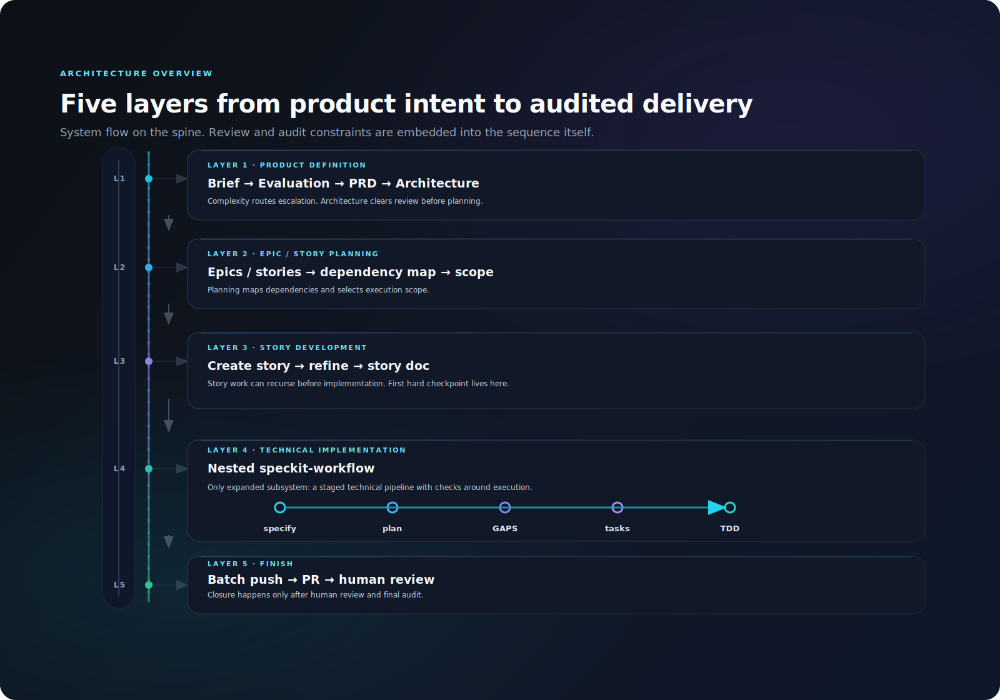

# BMAD-Speckit-SDD-Flow

[](LICENSE)
[](https://nodejs.org)

<p align="center">
  
</p>

**Built on** [BMAD-METHOD](https://github.com/bmad-code-org/BMAD-METHOD) and [github/spec-kit](https://github.com/github/spec-kit).
**Extended with** audit loops, critical auditor, scoring system, AI Coach, and SFT fine-tuning data extraction.

100% free and open source. No paywalls.

---

## Why BMAD-Speckit-SDD-Flow?

Traditional AI tools do the thinking for you. BMAD-Speckit-SDD-Flow combines **BMAD Method** (agile, party-mode, multi-agent) with **Spec-Driven Development** (specify → plan → GAPS → tasks → TDD).

<p align="center">
  
</p>

What this adds in practice:
- **Five-layer architecture** — Product Brief → PRD → Architecture → Epic/Story → speckit specify/plan/GAPS/tasks → TDD implement → PR + human review
- **Mandatory audit loops** — Each stage requires code-review pass before proceeding
- **Critical Auditor** — Dedicated challenger role, >60% share in party-mode
- **Scoring system** — Multi-stage weighted scores, one-vote veto, AI Coach diagnosis
- **SFT extraction** — Instruction-response pairs from low-score runs for fine-tuning

---

## Quick Start

**Prerequisites**: [Node.js](https://nodejs.org) v18+

```bash
# Initialize in current directory
npx bmad-speckit init . --ai cursor-agent --yes

# Or create a new project
npx bmad-speckit init my-project --ai cursor-agent --yes

# Verify installation
npx bmad-speckit check
```

> **Not sure what to do?** Run `/bmad-help` in your AI IDE. See [Installation & Migration Guide](docs/how-to/migration.md) for details.

**One-line deploy**:

```powershell
# Windows
pwsh scripts/setup.ps1 -Target <project-path>
```

```bash
# WSL / Linux / macOS
bash scripts/setup.sh -Target <project-path>
# or: npm run setup:sh -- -Target <path>
```

See [WSL / Shell scripts](docs/how-to/wsl-shell-scripts.md) for full shell script reference.

面向消费项目的完整安装入口见 [Consumer Installation Guide](docs/how-to/consumer-installation.md)。如果你需要继续配置 provider 的 `baseUrl` / `apiKeyEnv` / `model`，也从这篇开始。

---

## Built On

| Upstream | Purpose |
|----------|---------|
| [BMAD-METHOD](https://github.com/bmad-code-org/BMAD-METHOD) | Agile workflows, Party Mode, 34+ workflows |
| [github/spec-kit](https://github.com/github/spec-kit) | Spec-Driven Development (constitution, specify, plan, tasks) |

**Our extensions**: scoring, critical auditor, speckit-workflow audit loops, bmad-story-assistant, bmad-bug-assistant.

---

## Project Structure

```
BMAD-Speckit-SDD-Flow/
├── _bmad/                              # BMAD core modules (single source of truth)
│   ├── speckit/                        # Speckit module (commands, templates, workflows, scripts)
│   ├── core/                           # Core BMAD functionality
│   ├── bmm/, bmb/, cis/, tea/          # Other BMAD modules
│   ├── scoring/                        # Scoring system
│   └── _config/                        # Configuration files
├── packages/                           # Source code (monorepo)
│   ├── bmad-speckit/                   # CLI package
│   └── scoring/                        # Scoring extensions (see [packages/scoring/README.md](packages/scoring/README.md))
├── tests/                              # Test suite (acceptance/, epic-acceptance/)
├── scripts/                            # Deployment/utility scripts only
│   └── _config/                        # Project configuration (merged from former root config/)
├── specs/                              # Story specifications (generated)
├── docs/                               # Documentation (Diataxis)
│   ├── tutorials/                      # Learning-oriented
│   ├── how-to/                         # Task-oriented
│   ├── explanation/                    # Understanding-oriented
│   ├── reference/                      # Information-oriented
│   └── sample/                         # Example documents
└── package.json
```

## Modules & Components

| Component | Purpose |
|-----------|---------|
| **_bmad/** | BMAD core (core, bmm, bmb, cis, tea, scoring) |
| **packages/scoring/** | Scoring extensions: audit report parsing, score persistence, Coach diagnosis, Dashboard, SFT extraction |
| **scripts/** | Deployment/utility scripts: init-to-root, setup. Scoring 已整合进 bmad-speckit CLI，目标项目使用 `npx bmad-speckit score/coach/dashboard/sft-extract/scores` |
| **speckit-workflow** | specify → plan → GAPS → tasks → TDD with mandatory audits |
| **bmad-story-assistant** | Create Story → Party-Mode → Dev Story → implement |
| **bmad-bug-assistant** | Bug description → Party-Mode → BUGFIX doc |
| **bmad-standalone-tasks** | Execute TASKS/BUGFIX docs via subagents |

---

## Documentation

- [Getting Started](docs/tutorials/getting-started.md)
- [Consumer Installation Guide](docs/how-to/consumer-installation.md)
- [Installation & Migration Guide](docs/how-to/migration.md)
- [Cursor Setup](docs/how-to/cursor-setup.md)
- [Claude Code Setup](docs/how-to/claude-code-setup.md)
- [Provider Configuration](docs/how-to/provider-configuration.md)
- [WSL / Shell Scripts](docs/how-to/wsl-shell-scripts.md)

---

## License

MIT License — see [LICENSE](LICENSE) for details.
