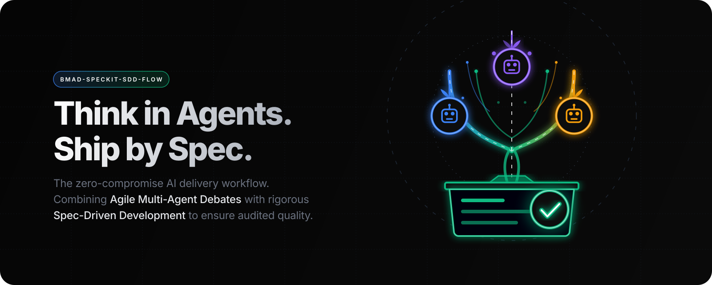
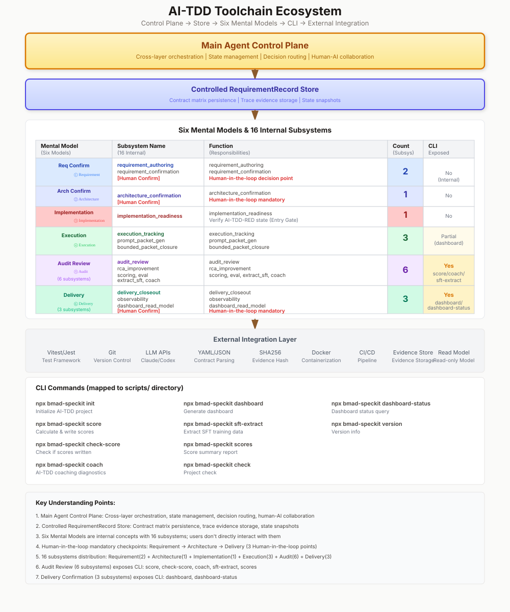
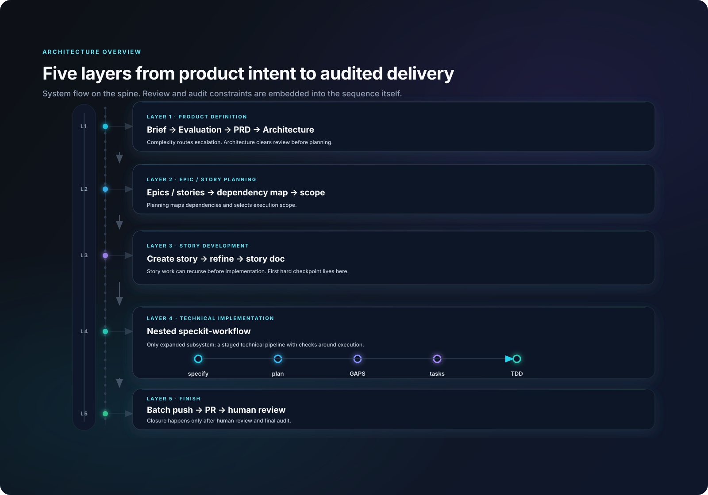
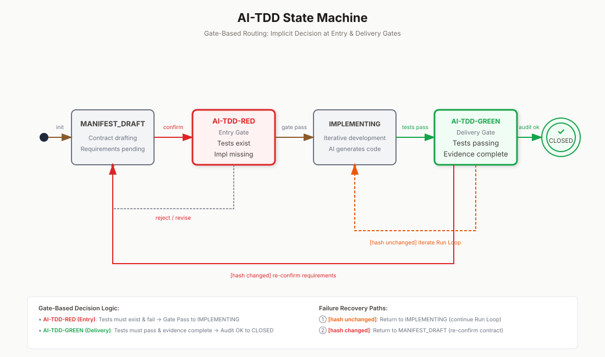
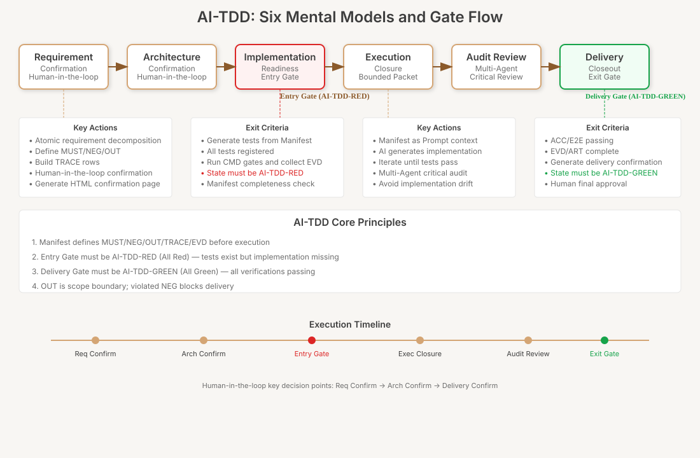
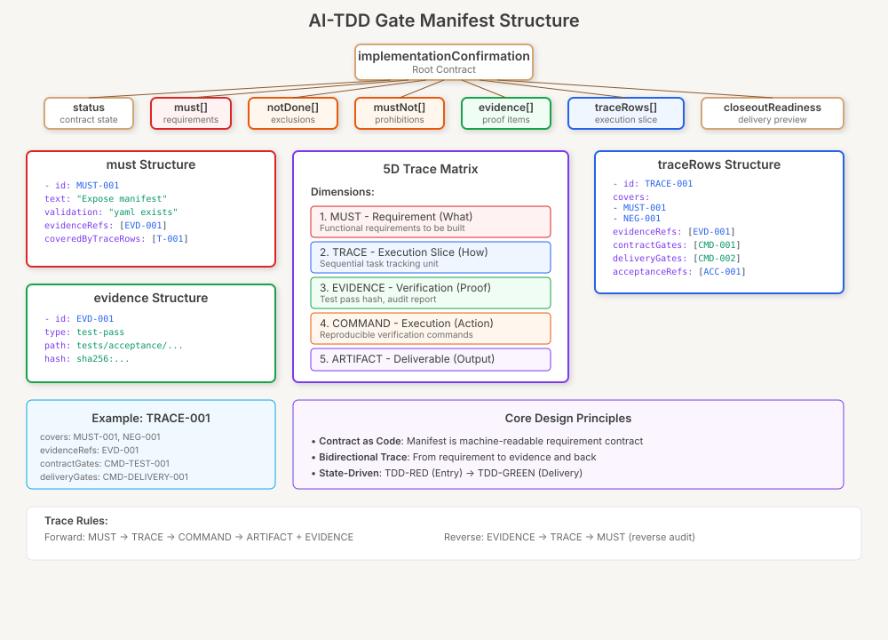
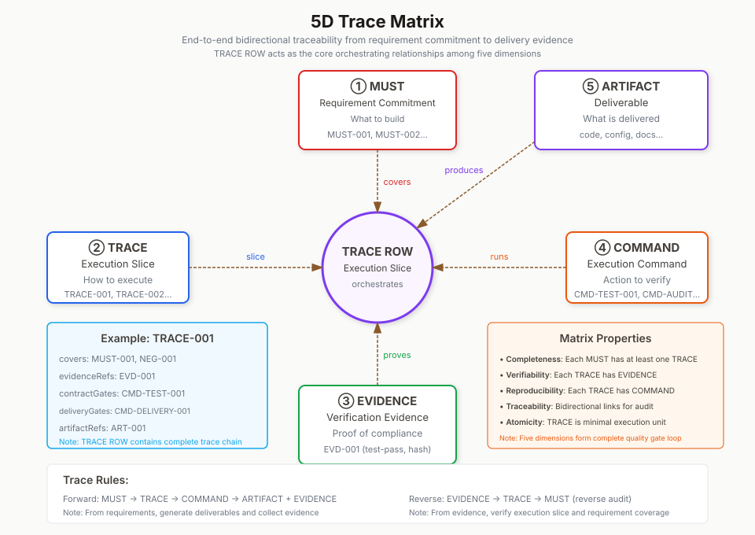
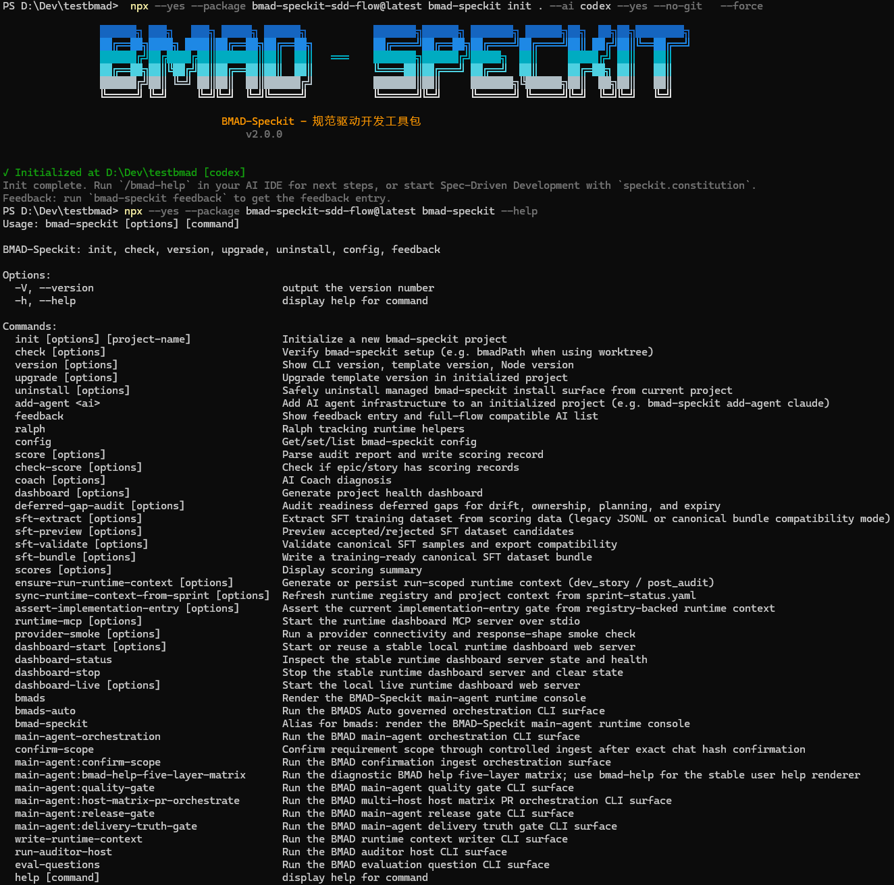

# BMAD-Speckit-SDD-Flow: AI-TDD Control Plane For Requirement Contracts And Evidence-Chain Delivery

English | [简体中文](README.zh-CN.md)

<p align="center">
  
</p>

<h3 align="center">
  AI-TDD control plane for requirement contracts and evidence-chain delivery across Cursor, Claude Code, and Codex
</h3>

<p align="center">
  <strong>Built on <a href="https://github.com/bmad-code-org/BMAD-METHOD">BMAD-METHOD</a> and <a href="https://github.com/github/spec-kit">Spec-Kit</a>.</strong><br>
  <em>BMAD-Speckit-SDD-Flow turns BMAD + Spec-Kit delivery into a governed AI-TDD path: confirmed Manifest contracts before execution, bounded agent work during implementation, and TRACE/EVD/CMD/ART evidence-chain closeout before delivery claims.</em>
</p>

<p align="center">
  <a href="LICENSE"></a>
  <a href="https://nodejs.org"></a>
</p>

## Table Of Contents

- [What This Is](#what-this-is)
- [Core AI-TDD Model](#core-ai-tdd-model)
- [Who This Is For](#who-this-is-for)
- [Prerequisites](#prerequisites)
- [Quick Start](#quick-start)
- [Runtime Model](#runtime-model)
- [Common Skills And Workflow Selection](#common-skills-and-workflow-selection)
- [1.x Five-Layer Architecture](#1x-five-layer-architecture)
- [AI-TDD Control Plane](#ai-tdd-control-plane)
- [Six Mental Models](#six-mental-models)
- [Manifest Contract And Evidence Chain](#manifest-contract-and-evidence-chain)
- [CLI Installation And External Interfaces](#cli-installation-and-external-interfaces)
- [Delivery Closeout Evidence](#delivery-closeout-evidence)
- [Release Line Compatibility](#release-line-compatibility)
- [Repository Map](#repository-map)
- [Documentation](#documentation)
- [Development And Contribution Policy](#development-and-contribution-policy)
- [License](#license)

---

## What This Is

BMAD-Speckit-SDD-Flow is a requirement-contract-driven AI-TDD control plane for AI-assisted software delivery. It combines the product and delivery structure of BMAD-METHOD with the specification-driven development flow of Spec-Kit, then adds a governed Orchestrator Agent control plane, the top-level coordinator that routes work, enforces gates, and closes delivery, for Cursor, Claude Code, and Codex.

The goal is not to replace BMAD or Spec-Kit. The goal is to make the complete path from product intent to implementation safer, more traceable, and easier to execute with AI agents. The workflow installs into consumer projects through the CLI, then runs inside Codex, Claude Code CLI, or Cursor through the `bmads` / `bmad-speckit` skills.

AI-TDD in this project follows one rule: without a confirmed Manifest, AI is guessing; without a current evidence chain, delivery is only an optimistic claim. The Orchestrator Agent may not dispatch implementation until the Manifest is complete enough to establish `AI-TDD-RED`, and it may not claim delivery until the current attempt closes the Manifest-linked TRACE/EVD/CMD/ART evidence chain, receives a Gate Verdict, and records a Human-in-the-loop decision.

<p align="center">
  
</p>

The CLI is the installation and external interface. It installs the workflow into a consumer project, validates the install surface, and exposes runtime read models such as dashboard, scoring, Coach, and SFT extraction. Daily delivery control belongs to the Orchestrator Agent after the user activates it in the AI host.

The project provides:

- Requirement-contract-driven control plane.
- Agent governance across Cursor, Claude Code, and Codex.
- AI-TDD workflow control.
- Readiness gates before implementation.
- Delivery gates before completion claims.
- Multi-dimensional TRACE/EVD/CMD/ART evidence-chain acceptance.
- Bounded execution to reduce uncontrolled agent drift.
- End-to-end BMAD + Spec-Kit delivery flow support.

---

## Core AI-TDD Model

The operating model is:

```text
Intent -> Manifest Contract -> AI-TDD-RED -> Bounded Execution -> Evidence Chain -> AI-TDD-GREEN
```

| Stage             | Meaning                                                                                  | Control rule                                                           |
| ----------------- | ---------------------------------------------------------------------------------------- | ---------------------------------------------------------------------- |
| Intent            | Human goal, scope, non-goals, and assumptions are clarified.                             | Ambiguity must be converted into contract language before execution.   |
| Manifest Contract | `MUST`, `NEG`, `OUT`, `TRACE`, `EVD`, `CMD`, `ART`, tests, and tasks are registered.     | Manifest is the requirement contract matrix, not a test checklist.     |
| `AI-TDD-RED`      | The readiness gate confirms the contract and acceptance baseline exist.                  | Implementation may start only after the entry gate reaches this state. |
| Bounded Execution | Agents receive bounded packets and implement inside the confirmed contract.              | Agent work must stay inside Manifest constraints and trace rows.       |
| Evidence Chain    | The current attempt produces replayable TRACE/EVD/CMD/ART evidence and audit provenance. | Stale evidence and unbound tests cannot prove the current attempt.     |
| `AI-TDD-GREEN`    | Gate Verdict plus Human-in-the-loop decision closes the delivery attempt.                | Completion language is allowed only after closeout evidence closes.    |

---

## Who This Is For

This project is a good fit when you need:

- Governed AI delivery inside a consumer project, not just prompts.
- Requirement contracts, readiness gates, delivery gates, and evidence trails.
- A top-level coordinator that can inspect state, route work, enforce bounded execution, and block weak delivery claims.
- External read models for dashboard, scoring, Coach, and SFT workflows.

This project is not the best fit when you only want:

- A minimal prompt library with no runtime governance.
- A codegen-only CLI with no host-session workflow.
- A local script that skips requirement contracts and gate evidence.

---

## Prerequisites

| Tool       | Version                           | Why it matters                                                                                              |
| ---------- | --------------------------------- | ----------------------------------------------------------------------------------------------------------- |
| Node.js    | 22+                               | Required for the published CLI and package install surface.                                                 |
| npm        | 9+                                | Required for project-local install, `npx --no-install`, temporary `npx --package`, and workspace workflows. |
| PowerShell | 7+ on Windows                     | Recommended for setup, verification, and runtime helper scripts.                                            |
| Git        | 2.30+                             | Required for worktrees, branch workflows, and contribution flow.                                            |
| AI host    | Codex, Claude Code CLI, or Cursor | Required for the normal `bmads` / `bmad-speckit` runtime entry.                                             |

---

## Quick Start

For long-term use in a consumer project, install the package as a project-local dependency, then run `init` explicitly for the AI host you want. Generated skills call the project-local CLI through `npx --no-install`, so the package must exist in this project's `node_modules`.

```bash
npm install --save-dev --ignore-scripts bmad-speckit-sdd-flow@latest
npm ls bmad-speckit-sdd-flow --depth=0
npx --no-install bmad-speckit version
npx --no-install bmad-speckit init . --ai codex --yes --force
npx --no-install bmad-speckit check
npx --no-install bmad-speckit dashboard-status
npx --no-install bmad-speckit bmads
```

To install all three common AI host surfaces in one pass, use `--ai claude,cursor-agent,codex` instead of `--ai codex`.

The `--ignore-scripts` flag keeps dependency installation separate from install-surface generation. If you omit it, the current root package `postinstall` runs `scripts/init-to-root.js` and writes a default install surface before your explicit `bmad-speckit init ...` command.

Then switch to the AI host session and activate the Orchestrator Agent:

```text
$bmads
```

Use `$bmad-help` for workflow routing only; it does not take root runtime authority.

If you are installing from a CI artifact instead of the npm registry, install the local tarball as a project dependency:

```bash
npm install --save-dev --ignore-scripts ./bmad-speckit-sdd-flow-<version>.tgz
npm ls bmad-speckit-sdd-flow --depth=0
npx --no-install bmad-speckit version
npx --no-install bmad-speckit init . --ai codex --yes --force
npx --no-install bmad-speckit check
npx --no-install bmad-speckit dashboard-status
npx --no-install bmad-speckit bmads
```

Use `npx --package` only for smoke tests, CI artifact checks, or one-time initialization. It does not persist the runtime in the consumer project, so generated skills may fail later unless you also install the package locally.

---

## Runtime Model

The normal user entry is typed inside the active AI host session:

```text
$bmads
/bmads
bmads
$bmad-speckit
/bmad-speckit
bmad-speckit
```

For BMAD workflow routing help without root runtime takeover, use:

```text
$bmad-help
```

`$bmad-help` explains recommended next steps, but it is a read-model helper only. It does not activate the Orchestrator Agent, replace the active requirement record, replace `currentMentalModel`, or satisfy controlled gate evidence.

After activation, the Orchestrator Agent takes root governed runtime authority for the current request. Its first responsibility is not implementation. It must inspect the active requirement, read the current requirement record, determine the current mental model, show progress, and recommend the next governed action.

The Orchestrator Agent owns these decisions:

| Decision             | Orchestrator Agent responsibility                                                                     |
| -------------------- | ----------------------------------------------------------------------------------------------------- |
| Active requirement   | Resolve the current requirement from explicit IDs or runtime requirement records.                     |
| Current mental model | Read `currentMentalModel` and continue from the governed stage instead of guessing from chat history. |
| Progress             | Show what is confirmed, blocked, missing, or ready for the active requirement.                        |
| Next action          | Recommend confirmation, architecture, readiness, dispatch, audit, rerun, or delivery closeout.        |
| Evidence             | Surface missing Manifest, trace, command, artifact, audit, score, or closeout evidence.               |

CLI commands are allowed for install validation, CI, debug, fallback hosts, and external read models. They are not the primary daily activation path when the host skill is available.

Daily operation should stay simple: activate the host skill, let the Orchestrator Agent inspect the active requirement, and follow the governed next action it returns. Do not bypass the Implementation Readiness Gate by sending an implementation agent directly into coding. Do not claim delivery from dashboard green, score green, task completion, or chat confidence alone. Delivery closes only through the Delivery Closeout Gate and the current evidence chain.

The accepted main-agent path is `inspect -> dispatch-plan -> closeout`: inspect resolves governed state, dispatch-plan emits bounded child work, and closeout verifies delivery evidence before completion language is allowed.

---

## Common Skills And Workflow Selection

BMAD-Speckit-SDD-Flow installs a layered skill surface. The canonical core layer `_bmad/skills` contains 29 shared skills. During host installation, BMAD workflow, agent, core task, and host-specific overlay skills are expanded into the target host. The current host-expanded skill surface is 70 skills for Codex, 72 skills for Claude Code, and 72 skills for Cursor, with 72 unique skill names across all supported hosts.

| Scope                         | Count | Meaning                                           |
| ----------------------------- | ----- | ------------------------------------------------- |
| Core shared layer             | 29    | Canonical shared skills in `_bmad/skills`.        |
| Codex expanded surface        | 70    | Skills visible after installing into Codex.       |
| Claude Code expanded surface  | 72    | Skills visible after installing into Claude Code. |
| Cursor expanded surface       | 72    | Skills visible after installing into Cursor.      |
| Cross-host unique skill names | 72    | Unique skill names across supported hosts.        |

Use `$bmads` / `$bmad-speckit` as the normal governed runtime entry. Use `$bmad-help` when you need a state-aware workflow navigator for the BMAD 1.x workflow map or the 2.x governed runtime projection. `$bmad-help` is a read-model navigator: it does not progress mental models, does not execute remediation, and does not replace the active requirement record or controlled gates.

| Skill                                  | Use when                                                                                        | Primary output                                                                                | Control role                                                                          |
| -------------------------------------- | ----------------------------------------------------------------------------------------------- | --------------------------------------------------------------------------------------------- | ------------------------------------------------------------------------------------- |
| `$bmads` / `$bmad-speckit`             | You need the governed runtime entry inside Codex, Claude Code, or Cursor.                       | Current requirement state, next governed action, and evidence gaps.                           | Root Orchestrator Agent entry for the active requirement.                             |
| `$bmad-help`                           | You need the BMAD workflow map or are unsure what to run next.                                  | Recommended, blocked, or rerouteRequired path.                                                | Read-model navigator only. It does not progress mental models.                        |
| `$requirements-contract-authoring`     | You need to create or update a confirmation-ready PRD, BUGFIX, TASKS, or story source document. | Inline `implementationConfirmation`, traceRows, evidence expectations, and confirmation HTML. | Prepares the source for user confirmation. It is not a separate authority.            |
| `$req-trace-matrix-prompt-generator`   | You need strict trace matrix prompts from a requirement source.                                 | Prompt-ready requirement trace matrix contract.                                               | Produces trace authoring input; it does not close runtime gates.                      |
| `$goal-execution-contract-generator`   | You need a frozen execution contract for `/goal`.                                               | Goal execution contract under `docs/plans`.                                                   | Produces the contract for `/goal`; it does not execute `/goal`.                       |
| `$goal-contract-partition-orchestrator` | You need to partition an already frozen Goal Execution Contract.                                | Diagnostic child-contract candidates and partition manifest v2 validation evidence.           | Never treats current raw `--out` as authority; governed activation remains blocked until ER-GH-004. |
| `$grill-with-docs`                     | You need adversarial clarification against existing docs.                                       | Grilling questions, contradictions, and evidence gaps.                                        | Improves requirement clarity before confirmation or execution.                        |
| `$docs-review`                         | You need review of README, docs, or diff clarity, structure, and style.                         | Documentation review findings.                                                                | Optional companion skill. It is not part of the project install surface unless added. |
| `$bmad-create-product-brief`           | You need to frame product intent before a PRD.                                                  | Product brief and discovery notes.                                                            | 1.x upstream workflow input to the 2.x control plane.                                 |
| `$bmad-create-prd`                     | You need a structured product requirements document.                                            | PRD with goals, scope, and acceptance direction.                                              | 1.x upstream requirements artifact that feeds requirement contracts.                  |
| `$bmad-create-architecture`            | You need architecture boundaries and technical decisions.                                       | Architecture document and risk decisions.                                                     | 1.x upstream architecture artifact for later confirmation.                            |
| `$bmad-create-epics-and-stories`       | You need executable delivery slices from product and architecture scope.                        | Epics, stories, and story context.                                                            | 1.x planning output that can become controlled implementation input.                  |
| `$bmad-check-implementation-readiness` | You need to check PRD, UX, architecture, and story readiness.                                   | Readiness findings and missing prerequisites.                                                 | Pre-control-plane readiness support; runtime gates still decide.                      |
| `$bmad-story-assistant`                | You need the supported story execution path.                                                    | Story execution assistance and story-state guidance.                                          | Official story path, preferred over relying on legacy dev-story alone.                |
| `$bmad-standalone-tasks`               | You need to execute standalone task documents.                                                  | Task execution result and evidence.                                                           | Task-level support that must still respect active requirement gates.                  |
| `$bmad-bug-assistant`                  | You need a bugfix flow with root-cause analysis and fix planning.                               | Bug report analysis, fix plan, and verification direction.                                    | Bugfix preparation path that can feed requirement confirmation.                       |

---

## 1.x Five-Layer Architecture

The 1.x release line remains the delivery map that connects BMAD product discovery to Speckit implementation. It is still the easiest way to explain how product intent becomes audited, reviewable delivery.

<p align="center">
  
</p>

| Layer                             | Purpose                                                                      | Primary output                                               |
| --------------------------------- | ---------------------------------------------------------------------------- | ------------------------------------------------------------ |
| Layer 1: Product Brief            | Define product intent, users, goals, and problem framing.                    | Product brief and discovery notes.                           |
| Layer 2: PRD + Architecture       | Turn intent into requirements, architecture boundaries, and risk decisions.  | PRD and architecture documents.                              |
| Layer 3: Epic / Story             | Split product and architecture scope into executable story units.            | Epics, stories, and story context.                           |
| Layer 4: Speckit Workflow         | Run `specify -> plan -> GAPS -> tasks -> implement` for technical execution. | Specs, plans, gap analysis, tasks, code, and tests.          |
| Layer 5: Closeout And Integration | Audit implementation, score evidence, and prepare reviewable delivery.       | Post-audit, scoring, PR, human review, and release evidence. |

In the 2.x release line, this five-layer architecture is not removed. It becomes the upstream delivery map that feeds the AI-TDD control plane: product and story artifacts become requirement-contract inputs, Speckit work becomes bounded execution packets, and delivery still closes only through controlled evidence gates.

---

## AI-TDD Control Plane

AI-TDD in this project means Manifest-level, acceptance-driven development. The Manifest is not a test list. It is the requirement contract matrix that binds `MUST`, `NEG` (`MUST NOT` negative assertions), `OUT` (`OUT OF SCOPE` boundaries), `TRACE`, `EVD`, `ACC/E2E`, `FAIL/EDGE`, `CMD`, `ART`, `TASK`, tests, artifacts, Gate Verdicts, and Human-in-the-loop decisions into one acceptance surface. `MUST NOT` is the conceptual alias for `NEG-*`; older `NOT DONE` wording means `OUT OF SCOPE / OUT-*`.

The control plane exists to enforce two rules:

| Rule                                    | Gate                                                         |
| --------------------------------------- | ------------------------------------------------------------ |
| No complete Manifest, no execution.     | Implementation Readiness Gate, expected status `AI-TDD-RED`. |
| Unverified Manifest items, no delivery. | Delivery Closeout Gate, expected status `AI-TDD-GREEN`.      |

<p align="center">
  
</p>

The readiness gate does not mean "the feature is done." It means the requirement contract is complete enough, the acceptance baseline exists, and implementation is allowed to start from `AI-TDD-RED`. The delivery closeout gate means all Manifest-linked acceptance items and evidence are verified before completion language is allowed.

---

## Six Mental Models

The Orchestrator Agent drives every requirement through six mental models. They are not dashboard tabs. They are the questions that decide whether the next action is confirmation, architecture, readiness, execution, audit, or delivery closeout.

<p align="center">
  
</p>

| Mental model              | Governed question                                                                          | Target outcome                                 |
| ------------------------- | ------------------------------------------------------------------------------------------ | ---------------------------------------------- |
| Requirement Confirmation  | What is in scope, out of scope, and provable by evidence IDs?                              | Confirmed requirement contract.                |
| Architecture Confirmation | Does the implementation boundary still match the confirmed architecture and risk envelope? | Confirmed architecture boundary.               |
| Implementation Readiness  | Is the Manifest complete enough and is the acceptance baseline registered?                 | Entry gate reaches `AI-TDD-RED`.               |
| Execution Closure         | Did bounded agents implement only within the contract and produce traceable evidence?      | Bounded execution closes against the Manifest. |
| Audit Review              | Do findings, reruns, RCA, scores, and review evidence have verifiable provenance?          | Audit evidence is current and replayable.      |
| Delivery Confirmation     | Are all acceptance items and delivery evidence verified for the current closeout attempt?  | Delivery gate reaches `AI-TDD-GREEN`.          |

Implementation agents do not choose the global route. They receive bounded packets only after readiness passes, then the Orchestrator Agent re-inspects state after each child result, audit result, rerun, or blocking event.

---

## Manifest Contract And Evidence Chain

The Manifest is the source of truth for the AI-TDD contract. It is closer to contract-as-code than to a prose requirements document: it encodes what must happen, what must not happen, what is out of scope, how each slice is traced, and which evidence can prove delivery.

<p align="center">
  
</p>

Every meaningful delivery claim should be traceable across requirement, trace, evidence, command, artifact, verdict, and human-decision dimensions.

<p align="center">
  
</p>

| Dimension   | Required proof                                                                   | Closeout meaning                                       |
| ----------- | -------------------------------------------------------------------------------- | ------------------------------------------------------ |
| Requirement | Confirmed Manifest rows for `MUST`, `NEG`, and `OUT`.                            | The acceptance target is explicit and versioned.       |
| Trace       | `TRACE` rows bind requirements to tasks, tests, commands, artifacts, and audits. | Each claim has a replayable contract slice.            |
| Evidence    | `EVD` records identify the proof expected for each trace row.                    | The gate knows what evidence must exist.               |
| Command     | `CMD` records show the current attempt ran the registered checks.                | Old or unrelated command output cannot close delivery. |
| Artifact    | `ART` records capture reports, receipts, hashes, snapshots, or audit outputs.    | Results are reviewable after the chat session ends.    |
| Decision    | Gate Verdict and Human-in-the-loop decision are recorded for the attempt.        | Delivery can close only after machine and human gates. |

The Orchestrator Agent should block or reroute when Manifest completeness, trace coverage, command evidence, artifact evidence, audit provenance, or closeout evidence is missing.

---

## CLI Installation And External Interfaces

Install the workflow into a consumer project with the published npm package. For stable generated-skill runtime, make the package a project-local dependency and run the CLI through `npx --no-install`.

```bash
npm install --save-dev --ignore-scripts bmad-speckit-sdd-flow@latest
npm ls bmad-speckit-sdd-flow --depth=0
npx --no-install bmad-speckit version
npx --no-install bmad-speckit --help
npx --no-install bmad-speckit init . --ai codex --yes --force
npx --no-install bmad-speckit check
npx --no-install bmad-speckit dashboard-status
npx --no-install bmad-speckit bmads
```

Use `--ignore-scripts` for the clearest install flow: first install the package, then run `bmad-speckit init ...` explicitly for the AI host surfaces you want. If you omit `--ignore-scripts`, the current root package `postinstall` runs `scripts/init-to-root.js` during dependency installation and may write a default install surface before your explicit init command.

On Windows, use `npx.cmd` if your shell does not resolve the shim:

```powershell
npx.cmd --no-install bmad-speckit bmads
```

The public CLI exposes these auxiliary surfaces:

| Surface               | Commands                                                                                                           |
| --------------------- | ------------------------------------------------------------------------------------------------------------------ |
| Install and lifecycle | `init`, `check`, `version`, `upgrade`, `uninstall`, `add-agent`.                                                   |
| Runtime read models   | `bmads`, `bmad-speckit`, `dashboard-start`, `dashboard-status`, `dashboard-stop`, `dashboard-live`, `runtime-mcp`. |
| Evidence and scoring  | `score`, `check-score`, `scores`, `dashboard`, `deferred-gap-audit`.                                               |
| Data and feedback     | `coach`, `sft-extract`, `sft-preview`, `sft-validate`, `sft-bundle`, `feedback`.                                   |

### Installation Matrix

| Installation path                                                                                   | Use it for                                                                   | Project files changed                                                                                                                                         | Long-term generated-skill runtime                                                                                                                                                   |
| --------------------------------------------------------------------------------------------------- | ---------------------------------------------------------------------------- | ------------------------------------------------------------------------------------------------------------------------------------------------------------- | ----------------------------------------------------------------------------------------------------------------------------------------------------------------------------------- |
| `npm install --save-dev --ignore-scripts bmad-speckit-sdd-flow@latest`                              | Default for normal consumer projects.                                        | Writes `node_modules`, `package.json`, and the lockfile; skips package lifecycle scripts.                                                                     | Supported. Run explicit `npx --no-install bmad-speckit init ...`, then generated skills can call `npx --no-install bmad-speckit ...`.                                               |
| `npm install --save-dev bmad-speckit-sdd-flow@latest`                                               | Convenience install only when you accept package `postinstall` side effects. | Writes `node_modules`, `package.json`, and the lockfile; the current `postinstall` may also write default install surfaces through `scripts/init-to-root.js`. | Supported only after you verify the local shim and rerun explicit `bmad-speckit init ...` for the desired AI host surfaces.                                                         |
| `npm install --save-dev --ignore-scripts ./bmad-speckit-sdd-flow-<version>.tgz`                     | Verifying a CI artifact or release candidate in a real consumer project.     | Writes `node_modules`, `package.json`, and the lockfile; skips package lifecycle scripts.                                                                     | Supported, pinned to the tarball content. Run explicit init after installation.                                                                                                     |
| `npm install --no-save --package-lock=false --ignore-scripts ./bmad-speckit-sdd-flow-<version>.tgz` | Temporary local artifact smoke tests.                                        | Writes `node_modules`; should not update `package.json` or the lockfile.                                                                                      | Temporary only. It works while `node_modules` remains, but it is not a durable project contract.                                                                                    |
| `npx --yes --package bmad-speckit-sdd-flow@latest bmad-speckit ...`                                 | One-time CLI execution, smoke tests, and CI artifact checks.                 | Does not persist a project-local runtime dependency.                                                                                                          | Not supported for long-term skills. Generated skills may fail later because `npx --no-install` cannot find the package.                                                             |
| Global install                                                                                      | Manual operator convenience outside a governed project.                      | Does not pin the runtime in the consumer project.                                                                                                             | Not recommended for project skills because the project does not control the runtime version. It can also hide a missing local install if verification only runs `npx --no-install`. |

The stable generated-skill runtime contract is: call the public package CLI from a project-local install through `npx --no-install bmad-speckit ...`, not repository paths. New or migrated skills should not use `node packages/bmad-speckit/bin/bmad-speckit.js`, `scripts/*.ts`, `tsx`, or `ts-node` as consumer runtime commands. If legacy skill text still mentions root script commands, treat those references as migration debt, not the recommended consumer runtime.

`bmad-speckit-init` remains a compatibility alias. Prefer `bmad-speckit init ...` for new README examples, generated skills, and integration scripts.

### Public CLI Surface

The screenshot below shows the published npm CLI help surface for the current release. It is a quick reference for installation, lifecycle, runtime read models, scoring, Coach, and SFT tooling; it is not the daily Orchestrator Agent workflow.

<p align="center">
  
</p>

### Install Verification

Recommended install verification commands for a consumer project. Run the `init` line for the AI host surface you expect before checking generated files:

```bash
npm ls bmad-speckit-sdd-flow --depth=0
npx --no-install bmad-speckit version
npx --no-install bmad-speckit init . --ai codex --yes --force
npx --no-install bmad-speckit check
npx --no-install bmad-speckit dashboard-status
npx --no-install bmad-speckit bmads
```

Do not treat `npx --no-install` alone as proof of a project-local runtime. First verify the dependency and local shim so a global executable cannot hide a missing or unpinned project install.

If you initialize all common hosts with `--ai claude,cursor-agent,codex`, also check the expected host surfaces:

```bash
node -e "const fs=require('node:fs'); const paths=['_bmad-output/config/bmad-speckit-install-manifest.json','.codex/skills','.claude/hooks/runtime-policy-inject.cjs','.claude/hooks/pre-continue-check.cjs','.cursor/hooks/runtime-policy-inject.cjs','.cursor/hooks/pre-continue-check.cjs']; for (const p of paths){ if(!fs.existsSync(p)){ console.error('missing '+p); process.exit(1); } console.log('found '+p); }"
```

Use the CLI to install and inspect. Use the host skill to let the Orchestrator Agent control the requirement flow.

---

## Delivery Closeout Evidence

Delivery closeout evidence is different from the CLI command-surface screenshot. It is the attempt-scoped gate material used to decide whether the active requirement can close through the Delivery Closeout Gate.

| Evidence type        | Required proof                                                              | Gate impact                                                     |
| -------------------- | --------------------------------------------------------------------------- | --------------------------------------------------------------- |
| Requirement contract | Confirmed Manifest, requirement record, and Manifest/source hash.           | Defines the contract that all later evidence must satisfy.      |
| Readiness            | Implementation Readiness Gate result at `AI-TDD-RED`.                       | Allows bounded implementation to begin.                         |
| Execution            | Bounded packet result, command evidence, artifact index, and trace closure. | Proves implementation stayed inside the contract.               |
| Audit                | Findings, reruns, RCA, score records, scope checks, and provenance.         | Detects drift, stale proof, and unreviewed risk.                |
| Delivery             | TRACE/EVD/CMD/ART closure, Gate Verdict, and Human-in-the-loop decision.    | Allows `AI-TDD-GREEN` and completion language for this attempt. |

---

## Release Line Compatibility

The 1.x release line BMAD + Speckit assets remain part of the compatibility surface: Product Brief, PRD, Architecture, Epic/Story, Speckit specify/plan/GAPS/tasks, implementation, audit, scoring, dashboard, Coach, and SFT extraction remain useful.

The 2.x release line now presents the five-layer architecture as the 1.x delivery map before introducing AI-TDD. Its primary authority is still the AI-TDD toolchain ecosystem and this control plane. 1.x artifacts are inputs and projections inside that control plane, not a replacement for requirement-contract authority.

---

## Repository Map

This map describes the tracked source and package layout. Local/generated folders such as `node_modules/`, `coverage/`, `test-results/`, `_bmad-output/`, `outputs/`, `reports/`, `tmp-*`, `.worktrees/`, and host cache directories can appear during development, but they are not source modules.

```text
BMAD-Speckit-SDD-Flow/
├── _bmad/                 # Canonical workflow assets installed into consumer projects
├── bin/                   # Published root package bin wrappers
├── docs/                  # User docs, reference docs, ops notes, evidence assets
├── packages/              # npm workspace packages
│   ├── bmad-speckit/      # Internal CLI workspace bundled by the root package
│   ├── ralph-method/      # Task-level TDD evidence tracker for Speckit implementation
│   ├── runtime-context/   # Runtime context registry and ensure-run utilities
│   ├── runtime-emit/      # Pre-bundled runtime policy/audit emit tools
│   ├── schema/            # Shared schema assets
│   └── scoring/           # Scoring, dashboard, Coach, and SFT tooling
├── scripts/               # Installers, CLI entrypoints, gates, release/test utilities
├── specs/                 # Epic/story specs, audits, and governed delivery evidence
├── src/                   # Shared source helpers for host/story validation workflows
├── templates/             # Consumer-facing templates such as MCP setup
├── tests/                 # Acceptance, integration, unit, fixture, and host tests
└── website/               # Documentation site source
```

The published root npm package is assembled from `package.json#files`. It does not publish every local development directory; it packages the install/runtime surface such as `_bmad/`, `bin/`, `scripts/`, selected docs/assets, scoring, runtime-context pieces, and selected acceptance fixtures.

---

## Documentation

- [Getting Started](docs/tutorials/getting-started.md)
- [Main-Agent Orchestration Reference](docs/reference/main-agent-orchestration.md)
- [Consumer Installation Guide](docs/how-to/consumer-installation.md)
- [Runtime Dashboard Guide](docs/how-to/runtime-dashboard.md)
- [Runtime MCP Installation](docs/how-to/runtime-mcp-installation.md)
- [Provider Configuration](docs/how-to/provider-configuration.md)
- [Cursor Setup](docs/how-to/cursor-setup.md)
- [Claude Code Setup](docs/how-to/claude-code-setup.md)
- [Codex Setup](docs/how-to/codex-setup.md)
- [Run Tests Locally](docs/how-to/run-tests-locally.md)

---

## Development And Contribution Policy

This is primarily a personal workflow project. I publish it because the workflow may be useful to others, but I cannot commit to a fixed schedule for reviewing issues, feature requests, or pull requests.

Bug reports, documentation fixes, and small compatibility improvements are welcome. For larger features, architectural changes, or workflows that do not align with my current usage, forking the project and adapting it to your own context is the recommended path.

If you still want to contribute upstream:

- Read [CONTRIBUTING.md](CONTRIBUTING.md) for local setup, branch conventions, tests, and pull request expectations.
- Read [CODE_OF_CONDUCT.md](CODE_OF_CONDUCT.md) for community standards.
- Use [docs/how-to/run-tests-locally.md](docs/how-to/run-tests-locally.md) for local verification flow.

Common local validation commands:

```bash
npm install
npm test
npm run lint
npm run format:check
```

For repository maintainers, the internal workspace CLI implementation lives in [packages/bmad-speckit/README.md](packages/bmad-speckit/README.md). Consumer users should still follow the root package contract documented in this README.

---

## License

Released under the [MIT License](LICENSE).

---

<p align="center">
  <a href="LICENSE">MIT License</a> •
  <a href="https://github.com/bmad-code-org/BMAD-METHOD">BMAD-METHOD</a> •
  <a href="https://github.com/github/spec-kit">Spec-Kit</a>
</p>
