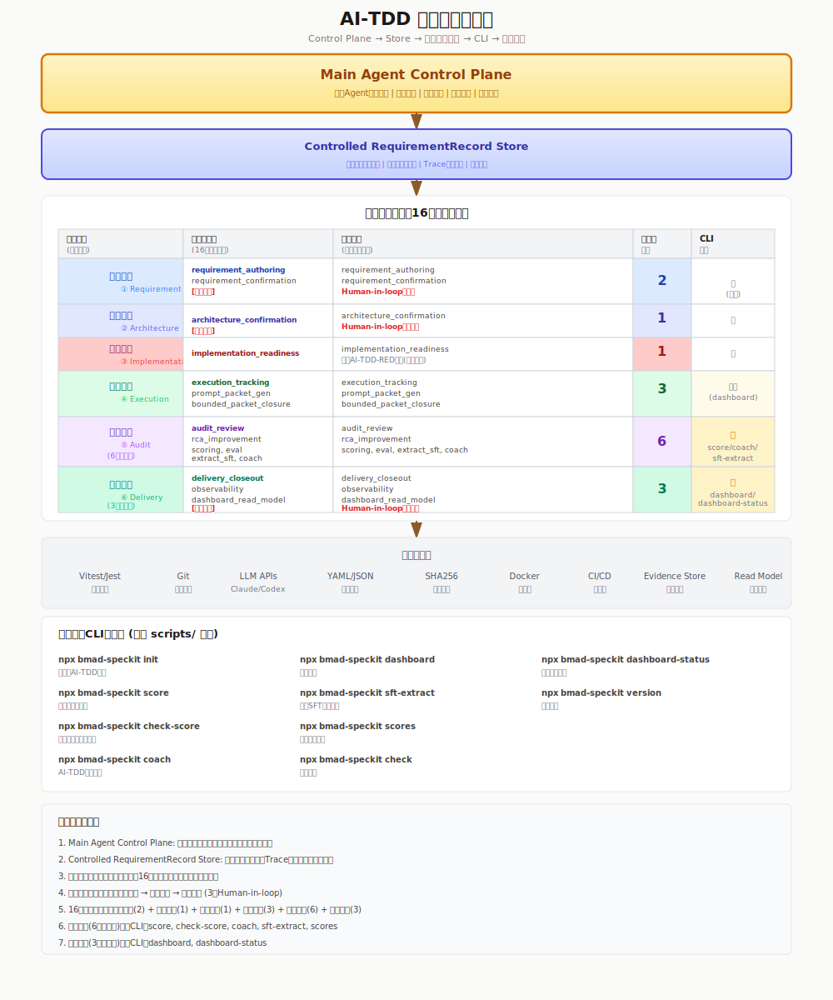
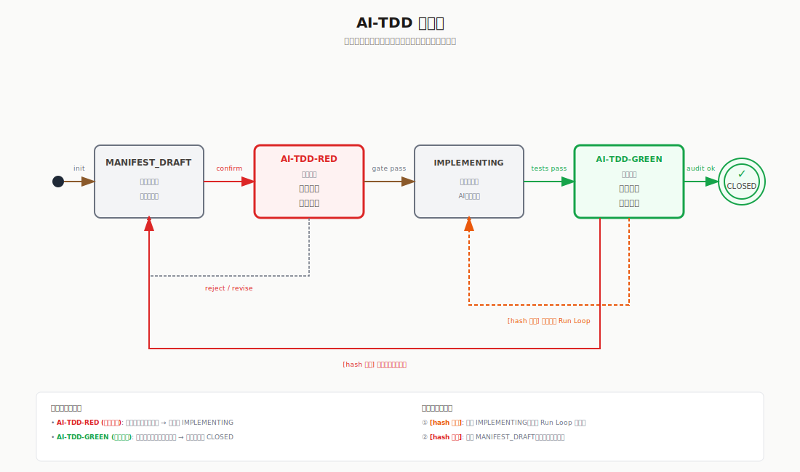
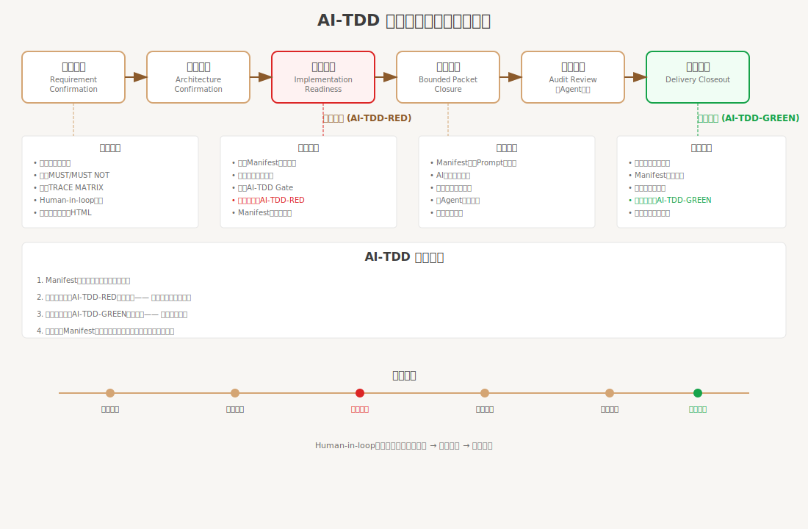
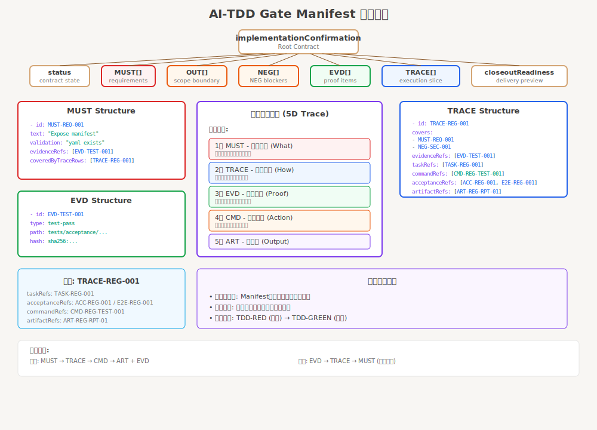
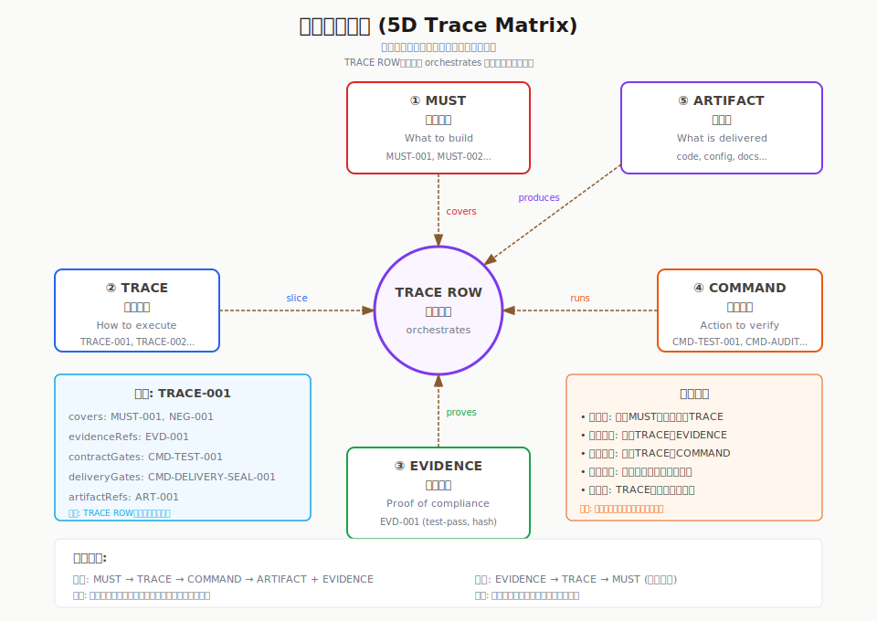

# BMAD-SpeCKit-SDD-Flow：需求契约驱动的 Agent 主控编排

[English](README.md) | 简体中文

<p align="center">
  
</p>

<h3 align="center">
  面向 Cursor、Claude Code 与 Codex 的规范化 Spec-Driven AI 开发流程
</h3>

<p align="center">
  <strong>基于 <a href="https://github.com/bmad-code-org/BMAD-METHOD">BMAD-METHOD</a> 与 <a href="https://github.com/github/spec-kit">Spec-Kit</a> 构建。</strong><br>
  <em>1.x 发布线整合 BMAD + Speckit 全流程；2.0.0 发布线将这条流程升级为 AI-TDD 控制面和主 Agent 编排系统。</em>
</p>

<p align="center">
  <a href="LICENSE"></a>
  <a href="https://nodejs.org"></a>
</p>

## 目录

- [这是什么](#这是什么)
- [适用对象](#适用对象)
- [前置条件](#前置条件)
- [快速开始](#快速开始)
- [运行时模型](#运行时模型)
- [1.x 五层架构](#1x-五层架构)
- [AI-TDD 控制面](#ai-tdd-控制面)
- [六心智模型](#六心智模型)
- [Manifest 与追溯证据](#manifest-与追溯证据)
- [CLI 安装与外部接口](#cli-安装与外部接口)
- [交付证据链](#交付证据链)
- [发布线兼容说明](#发布线兼容说明)
- [仓库结构](#仓库结构)
- [文档入口](#文档入口)
- [开发与贡献策略](#开发与贡献策略)
- [许可证](#许可证)

---

## 这是什么

BMAD-SpeCKit-SDD-Flow 不是让 AI 多写代码的提示词包。它是主 Agent 编排工作流，通过 CLI 安装到消费项目，然后在 Codex、Claude Code CLI 或 Cursor 中通过 `bmads` / `bmad-speckit` 技能激活主控流程。

它的目标很明确：让 AI 在需求契约、门禁、证据和追溯链内执行。1.x 发布线把 BMAD 与 Speckit 串成完整交付流；2.0.0 发布线以 AI-TDD、六个心智模型和双门禁为核心，把交付流升级为需求契约驱动的 Agent 编排系统。

<p align="center">
  
</p>

CLI 是安装与外部接口。它负责把工作流安装到消费项目、校验安装面，并暴露看板、评分、Coach、SFT 数据提取等运行时只读或数据集成能力。日常交付控制属于用户在 AI 宿主中激活后的主 Agent。

---

## 适用对象

适合以下场景：

- 你要把受治理的 AI 交付流程安装进消费项目，而不是只堆提示词。
- 你需要需求契约、准入门禁、交付门禁和证据追溯链。
- 你需要一个能 inspect 状态、路由工作、约束 bounded execution、阻断弱交付声明的主 Agent。
- 你希望把 dashboard、scoring、Coach、SFT workflow 当作外部只读视图或数据集成面使用。

不适合以下场景：

- 你只想要一个没有运行时治理的最小 prompt library。
- 你只想要一个纯 codegen CLI，不需要宿主会话中的主控流程。
- 你打算跳过需求契约和门禁证据，直接让 AI 自由开工。

---

## 前置条件

| 工具 | 版本 | 作用 |
| --- | --- | --- |
| Node.js | 22+ | 用于已发布 CLI 和安装面。 |
| npm | 9+ | 用于 `npx --package`、本地安装和 workspace 工作流。 |
| PowerShell | Windows 上建议 7+ | 用于 setup、验证和运行时辅助脚本。 |
| Git | 2.30+ | 用于 worktree、分支流和贡献流程。 |
| AI 宿主 | Codex、Claude Code CLI 或 Cursor | 用于正常的 `bmads` / `bmad-speckit` 运行时入口。 |

---

## 快速开始

对大多数消费项目，推荐先用已发布包安装工作流安装面，再在 AI 宿主中激活主 Agent。

```bash
npx --yes --package bmad-speckit-sdd-flow@latest bmad-speckit version
npx --yes --package bmad-speckit-sdd-flow@latest bmad-speckit-init . --agent claude-code --full --no-package-json
npx --yes --package bmad-speckit-sdd-flow@latest bmad-speckit-init . --agent cursor --full --no-package-json
npx --yes --package bmad-speckit-sdd-flow@latest bmad-speckit-init . --agent codex --full --no-package-json
npx --yes --package bmad-speckit-sdd-flow@latest bmad-speckit check
```

然后切换到 AI 宿主会话里激活主 Agent：

```text
$bmads
```

如果你是通过 CI artifact 安装而不是直接走 npm registry，推荐的非侵入式路径是使用本地 tarball：

```bash
npx --yes --package ./bmad-speckit-sdd-flow-<version>.tgz bmad-speckit version
npx --yes --package ./bmad-speckit-sdd-flow-<version>.tgz bmad-speckit-init . --agent claude-code --full --no-package-json
npx --yes --package ./bmad-speckit-sdd-flow-<version>.tgz bmad-speckit-init . --agent cursor --full --no-package-json
npx --yes --package ./bmad-speckit-sdd-flow-<version>.tgz bmad-speckit-init . --agent codex --full --no-package-json
npx --yes --package ./bmad-speckit-sdd-flow-<version>.tgz bmad-speckit check
```

---

## 运行时模型

正常用户入口是在当前 AI 宿主会话中输入：

```text
$bmads
/bmads
bmads
$bmad-speckit
/bmad-speckit
bmad-speckit
```

激活后，主 Agent 获得当前请求的根治理权限。它的第一责任不是立刻实现，而是检查活动需求、读取当前需求记录、判断当前心智模型、显示进度，并推荐下一步受控动作。

主 Agent 负责这些判断：

| 判断项 | 主 Agent 职责 |
| --- | --- |
| 活动需求 | 从显式 ID 或运行时 requirement record 中解析当前需求。 |
| 当前心智模型 | 读取 `currentMentalModel`，从受控阶段继续，而不是根据聊天历史猜测。 |
| 进度 | 显示哪些内容已确认、被阻塞、缺失或已就绪。 |
| 下一步 | 推荐确认、架构、就绪、派发、审计、重跑或交付收口。 |
| 证据 | 暴露缺失的 Manifest、追溯、命令、产物、审计、评分或 closeout 证据。 |

CLI 可以用于安装校验、CI、调试、fallback 宿主和外部只读视图。只要宿主技能可用，它就不是日常主流程的激活方式。

正常操作应该保持简单：激活宿主技能，让主 Agent inspect 当前活动需求，并按它返回的受控下一步执行。不要绕过 Implementation Readiness Gate 直接让实现 Agent 开工。不要用 dashboard green、score green、task done 或聊天信心来宣称交付。交付只能通过 Delivery Closeout Gate 和当前证据链关闭。

已接受的 main-agent path 是 `inspect -> dispatch-plan -> closeout`：inspect 解析受控状态，dispatch-plan 生成有边界的子任务，closeout 在允许完成表述前验证交付证据。

---

## 1.x 五层架构

1.x 发布线仍然是连接 BMAD 产品发现与 Speckit 技术实现的交付地图。它也是解释“产品意图如何变成可审计、可评审交付”的最直观入口。

<p align="center">
  
</p>

| 层级 | 目的 | 主要产出 |
| --- | --- | --- |
| Layer 1: Product Brief | 定义产品意图、用户、目标和问题框架。 | Product brief 与发现记录。 |
| Layer 2: PRD + Architecture | 将意图转成需求、架构边界和风险决策。 | PRD 与架构文档。 |
| Layer 3: Epic / Story | 将产品和架构范围拆成可执行 story 单元。 | Epic、Story 与 Story 上下文。 |
| Layer 4: Speckit Workflow | 按 `specify -> plan -> GAPS -> tasks -> implement` 推进技术执行。 | spec、plan、gap 分析、tasks、代码和测试。 |
| Layer 5: Closeout And Integration | 审计实现、评分证据，并准备可评审交付。 | post-audit、评分、PR、人工评审和发布证据。 |

在 2.0.0 发布线中，五层架构没有被移除。它成为 AI-TDD 控制面的上游交付地图：产品和 Story 产物会进入需求契约输入，Speckit 工作会成为 bounded execution packet，最终交付仍然只能通过受控证据门禁关闭。

---

## AI-TDD 控制面

本项目中的 AI-TDD 指 Manifest 级的验收驱动开发。Manifest 是需求契约矩阵，承载 `MUST`、`NEG`（`MUST NOT` 负向断言）、`OUT`（`OUT OF SCOPE` 范围边界）、`TRACE`、`EVD`、`ACC/E2E`、`FAIL/EDGE`、`CMD`、`ART` 和 `TASK` 等可被人和 Agent 共同验证的定义。`MUST NOT` 是 `NEG-*` 的概念别名；旧 `NOT DONE` 语义应迁移为 `OUT OF SCOPE / OUT-*`。

控制面要执行两条规则：

| 规则 | 门禁 |
| --- | --- |
| Manifest 不完整，不允许进入执行。 | Implementation Readiness Gate，目标状态 `AI-TDD-RED`。 |
| Manifest 仍有未验证项，不允许交付。 | Delivery Closeout Gate，目标状态 `AI-TDD-GREEN`。 |

<p align="center">
  
</p>

readiness gate 不表示功能已经完成。它表示需求契约足够完整、验收基线已经建立，允许从 `AI-TDD-RED` 开始实现。delivery closeout gate 表示 Manifest 关联的验收项和证据链都已验证，才允许说交付完成。

---

## 六心智模型

主 Agent 用六个心智模型推进每个需求。它们不是看板标签，而是决定下一步应该确认、架构、准入、执行、审计还是交付收口的治理问题。

<p align="center">
  
</p>

| 心智模型 | 治理问题 | 目标结果 |
| --- | --- | --- |
| Requirement Confirmation | 做什么、不做什么、哪些证据 ID 可以证明闭合？ | 需求契约已确认。 |
| Architecture Confirmation | 实现边界是否仍符合已确认架构和风险范围？ | 架构边界已确认。 |
| Implementation Readiness | Manifest 是否足够完整，验收基线是否已注册？ | 准入门禁达到 `AI-TDD-RED`。 |
| Execution Closure | 有界 Agent 是否只在契约内实现，并产生可追溯证据？ | 执行在 Manifest 约束内闭合。 |
| Audit Review | finding、rerun、RCA、score 和审计证据是否有可验证 provenance？ | 审计证据当前且可复核。 |
| Delivery Confirmation | 当前 closeout attempt 的验收项和交付证据是否全部通过？ | 交付门禁达到 `AI-TDD-GREEN`。 |

实现 Agent 不能选择全局路线。只有 readiness 通过后，它们才接收 bounded packet；每次子结果、审计结果、重跑或阻塞事件之后，主 Agent 都必须重新 inspect 再决定下一条全局分支。

---

## Manifest 与追溯证据

Manifest 是 AI-TDD 契约的事实源。它更接近 contract-as-code，而不是普通自然语言需求文档。

<p align="center">
  
</p>

每个有意义的交付声明，都应该能在需求、追溯、证据、命令和产物五个维度上回放。

<p align="center">
  
</p>

当 Manifest 完备性、trace 覆盖、命令证据、产物证据、审计 provenance 或 closeout 证据缺失时，主 Agent 应该阻塞、重路由或要求补证，而不是继续实现或直接交付。

---

## CLI 安装与外部接口

使用已发布 npm 包把工作流安装到消费项目。下面这些命令用于安装、校验、生命周期操作和外部运行时查看。

```bash
npx --yes --package bmad-speckit-sdd-flow@latest bmad-speckit --help
npx --yes --package bmad-speckit-sdd-flow@latest bmad-speckit version
npx --yes --package bmad-speckit-sdd-flow@latest bmad-speckit-init . --agent claude-code --full --no-package-json
npx --yes --package bmad-speckit-sdd-flow@latest bmad-speckit-init . --agent cursor --full --no-package-json
npx --yes --package bmad-speckit-sdd-flow@latest bmad-speckit-init . --agent codex --full --no-package-json
npx --yes --package bmad-speckit-sdd-flow@latest bmad-speckit check
npx --yes --package bmad-speckit-sdd-flow@latest bmad-speckit dashboard-status
```

如果希望写入项目依赖树：

```bash
npm install --save-dev bmad-speckit-sdd-flow@latest
npx bmad-speckit-init . --agent codex --full --no-package-json
npx bmad-speckit check
```

公开 CLI 暴露这些辅助接口：

| 接口面 | 命令 |
| --- | --- |
| 安装与生命周期 | `init`, `check`, `version`, `upgrade`, `uninstall`, `add-agent`。 |
| 运行时只读视图 | `bmads`, `bmad-speckit`, `dashboard-start`, `dashboard-status`, `dashboard-stop`, `dashboard-live`, `runtime-mcp`。 |
| 证据与评分 | `score`, `check-score`, `scores`, `dashboard`, `deferred-gap-audit`。 |
| 数据与反馈 | `coach`, `sft-extract`, `sft-preview`, `sft-validate`, `sft-bundle`, `feedback`。 |

### 公开 CLI 命令面

下面的截图展示已发布 npm 包暴露的 CLI 命令面。它用于快速理解安装、生命周期、运行时只读视图、评分、Coach 和 SFT 工具入口；它不是用户日常的主 Agent 工作流。

<p align="center">
  
</p>

### 安装校验

建议为消费项目保留这些安装校验命令：

```bash
npx --yes --package bmad-speckit-sdd-flow@latest bmad-speckit version
npx --yes --package bmad-speckit-sdd-flow@latest bmad-speckit check
npx --yes --package bmad-speckit-sdd-flow@latest bmad-speckit dashboard-status
```

CLI 用来安装和查看；宿主技能用来让主 Agent 接管需求流。

---

## 交付证据链

交付证据链不同于 CLI 命令面截图。它用于判断当前需求是否可以通过 Delivery Closeout Gate 收口。

| 证据类型 | 必要证明 |
| --- | --- |
| 需求契约 | 已确认的 Manifest 和 requirement record。 |
| 准入 | `AI-TDD-RED` 状态的 Implementation Readiness Gate 结果。 |
| 执行 | Bounded packet 结果、命令证据、产物索引与 trace closure。 |
| 审计 | Findings、rerun、RCA、score record 与 provenance。 |
| 交付 | 当前 attempt 达到 `AI-TDD-GREEN` 的 Delivery Closeout Gate 结果。 |

---

## 发布线兼容说明

1.x 发布线的 BMAD + Speckit 资产仍然是兼容面：Product Brief、PRD、Architecture、Epic/Story、Speckit specify/plan/GAPS/tasks、实现、审计、评分、看板、Coach 和 SFT extraction 仍然有用。

2.0.0 发布线现在会先把五层架构作为 1.x 交付地图呈现，再引出 AI-TDD。它的主权威仍然是 AI-TDD 工具链生态和主 Agent 控制面。1.x 产物是控制面里的输入和投影，而不是需求契约权威的替代品。

---

## 仓库结构

这里描述的是 Git 跟踪的源码和发布结构。开发时可能出现 `node_modules/`、`coverage/`、`test-results/`、`_bmad-output/`、`outputs/`、`reports/`、`tmp-*`、`.worktrees/`、宿主缓存目录等本地或生成产物，但它们不是源码模块。

```text
BMAD-Speckit-SDD-Flow/
├── _bmad/                 # 安装到消费项目的规范工作流资产
├── bin/                   # 根发布包的 bin wrapper
├── docs/                  # 用户文档、参考文档、运维说明和证据资产
├── packages/              # npm workspace 包
│   ├── bmad-speckit/      # 根包内打包的内部 CLI workspace
│   ├── ralph-method/      # Speckit 实现阶段的任务级 TDD 证据追踪器
│   ├── runtime-context/   # runtime context registry 与 ensure-run 工具
│   ├── runtime-emit/      # 预打包的 runtime policy / audit emit 工具
│   ├── schema/            # 共享 schema 资产
│   └── scoring/           # 评分、看板、Coach 和 SFT 工具
├── scripts/               # 安装器、CLI 入口、门禁、发布和测试工具
├── specs/                 # Epic/story specs、审计和受治理交付证据
├── src/                   # 宿主与 story 验证流程使用的共享源码辅助模块
├── templates/             # 面向消费项目的模板，例如 MCP 配置
├── tests/                 # 验收、集成、单元、fixture 和宿主一致性测试
└── website/               # 文档站点源码
```

根 npm 包的实际发布内容由 `package.json#files` 组装。它不会发布所有本地开发目录，而是发布 `_bmad/`、`bin/`、`scripts/`、部分 docs/assets、scoring、runtime-context 片段和选定验收 fixture 等安装与运行时表面。

---

## 文档入口

- [快速开始](docs/tutorials/getting-started.md)
- [主 Agent 编排参考](docs/reference/main-agent-orchestration.md)
- [消费项目安装指南](docs/how-to/consumer-installation.md)
- [运行时看板指南](docs/how-to/runtime-dashboard.md)
- [运行时 MCP 安装](docs/how-to/runtime-mcp-installation.md)
- [Provider 配置](docs/how-to/provider-configuration.md)
- [Cursor 配置](docs/how-to/cursor-setup.md)
- [Claude Code 配置](docs/how-to/claude-code-setup.md)
- [Codex 配置](docs/how-to/codex-setup.md)
- [本地运行测试](docs/how-to/run-tests-locally.md)

---

## 开发与贡献策略

这是一个以个人工作流为主的项目。我把它开源，是因为这套流程可能对其他人有参考价值，但我无法承诺固定节奏地处理 issue、功能请求或 PR。

欢迎提交 bug 反馈、文档修正和小范围兼容性改进。对于较大的功能、架构调整，或不符合我当前使用方向的工作流，更建议 fork 后基于自己的场景做二次开发。

如果你仍希望向上游贡献：

- 阅读 [CONTRIBUTING.md](CONTRIBUTING.md)，了解本地环境、分支规范、测试和 PR 要求。
- 阅读 [CODE_OF_CONDUCT.md](CODE_OF_CONDUCT.md)，了解社区行为规范。
- 阅读 [docs/how-to/run-tests-locally.md](docs/how-to/run-tests-locally.md)，了解本地验证流程。

常用本地验证命令：

```bash
npm install
npm test
npm run lint
npm run format:check
```

对仓库维护者来说，内部 workspace CLI 实现在 [packages/bmad-speckit/README.md](packages/bmad-speckit/README.md)。消费项目用户仍应以本 README 里的根包契约为准。

---

## 许可证

本项目基于 [MIT License](LICENSE) 发布。

---

<p align="center">
  <a href="LICENSE">MIT License</a> •
  <a href="https://github.com/bmad-code-org/BMAD-METHOD">BMAD-METHOD</a> •
  <a href="https://github.com/github/spec-kit">Spec-Kit</a>
</p>
