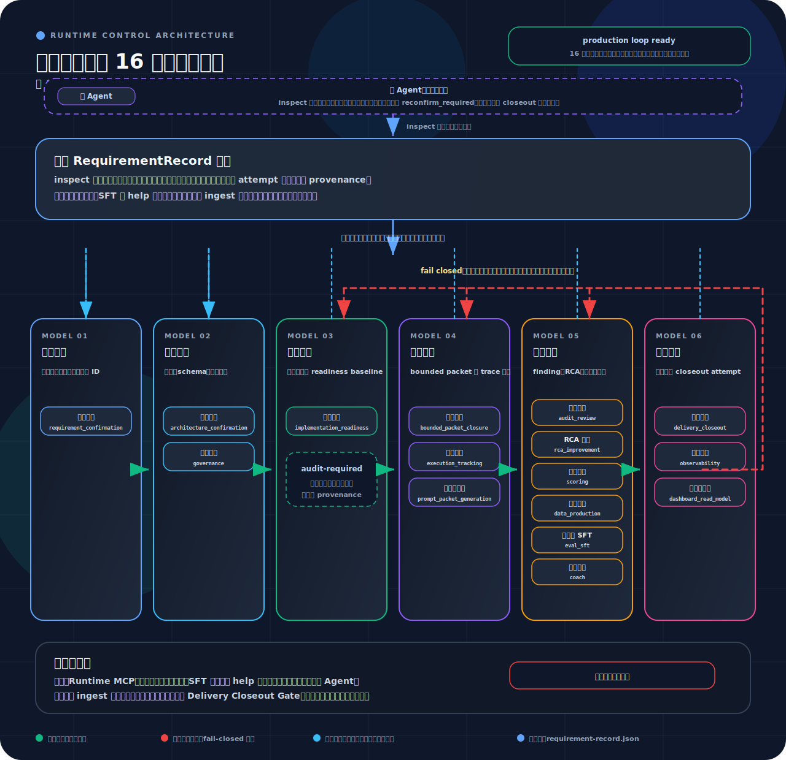

# BMAD-Speckit-SDD-Flow

[English](README.md) | 简体中文

<p align="center">
  
</p>

<h3 align="center">
  面向 Cursor 与 Claude Code 的规范化 Spec-Driven AI 开发流程
</h3>

<p align="center">
  <strong>基于 <a href="https://github.com/bmad-code-org/BMAD-METHOD">BMAD-METHOD</a> 与 <a href="https://github.com/github/spec-kit">Spec-Kit</a> 构建。</strong><br>
  <em>把需求规范、审计流程、运行监控和评分反馈整合成一条完整的工程化交付链路。</em>
</p>

<p align="center">
  <a href="LICENSE"></a>
  <a href="https://nodejs.org"></a>
</p>

---

## 这套流程要解决什么问题？

很多 AI 工具只停留在提示词编排层面。BMAD-Speckit-SDD-Flow 把它推进成一条可管理的交付流水线：先写规范、再出计划、经过审计，确认 ready 后再进入实现阶段，执行过程中有运行时管控，最后统一输出评分、看板和训练数据。

<p align="center">
  
</p>

### 主要特性

- **六心智模型控制面**：需求、架构、就绪、执行、审计、交付都是运行时必须回答的治理问题，而不是松散状态标签
- **16 子系统生产闭环就绪**：每个生产闭环子系统都必须具备机器可读的输入、输出、状态、证据、哈希与失败处理
- **受控 RequirementRecord 权威**：`inspect` 先解析活动需求，从受控记录恢复状态并校验 provenance，再决定下一条全局分支
- **readiness baseline 自愈**：就绪门禁只写受控的 `audit_required` 激活元数据，audit/scoring 管线负责写入带 provenance 的 `implementation_readiness` 评分记录
- **bounded packet 执行**：只有 `inspect` 明确允许 dispatch 时才生成 `dispatch-plan`；子代理只执行 packet，不能替主控选择全局路线
- **审计、评分与投影分离**：审计负责评分证据；看板、MCP、诊断、SFT 与 help 都是只读投影，除非被受控 ingest 回写为证据
- **fail-closed 交付治理**：活动需求歧义、哈希过期、当前 attempt 缺失、baseline 陈旧、证据不足或子系统覆盖不完整，都会阻塞、重跑或进入受控 closeout

> **关于图片**：README 中的图片放在 `docs/assets/` 目录下并纳入 Git 管理。npm 包里的 README 会按 GitHub Flavored Markdown 渲染，因此"仓库内相对路径 + 已跟踪资源"是对 GitHub 和 npm 都最稳定的策略。来源：[About package README files](https://docs.npmjs.com/about-package-readme-files)

---

## 运行时管控一览

- **先 inspect，失败即关闭推进路径**：主 Agent 从 `main-agent-orchestration inspect` 开始；活动需求缺失、歧义或过期时，不会继续落入实现分支
- **RequirementRecord 是控制权威**：`requirement-records/index.json` 只是定位投影；当前控制状态必须从需求记录与受控事件历史恢复
- **readiness gate 激活审计，不直接写评分**：就绪通过后写受控激活元数据，并触发或提示 readiness audit；评分记录仍由 audit/scoring 管线写入
- **Audit 写评分 provenance**：audit/scoring 管线写入 `stage=implementation_readiness` 等 `RunScoreRecord`，并携带 score、audit、gate、record hash 与命令 provenance
- **drift baseline 优先级确定**：当前需求 metadata 优先，其次是 requirement-scoped scoring baseline，最后才是 legacy `packages/scoring/data`；禁止 runtime context fallback
- **dispatch 仍然是条件动作**：只有受控记录说明需要 bounded packet 执行时，才出现 `dispatch-plan`；否则暴露 closeout、audit、rerun 或 blocked 诊断
- **closeout 绑定当前 attempt**：closeout pass 只能让当前受控 attempt 进入 `completed_no_dispatch`；缺少全局 scoring baseline 本身不能成为实现 blocker
- **诊断必须对用户可见**：`inspect` 需要说明活动需求缺失、readiness baseline 缺失、baseline 陈旧、投影面不可作为权威、证据不足等原因

### 六心智模型

最新运行时主链围绕六个心智模型组织。它们不是看板标签或状态颜色，而是主 Agent 继续推进前必须从 `requirement-record.json`、`currentMentalModel`、当前 attempt 元数据和 controlled ingest 事件中回答的治理问题。

<p align="center">
  
</p>

<p align="center"><em>图：视觉风格参考 ClawScope README 架构图；内容映射 BMAD-Speckit-SDD-Flow 的六条控制泳道与十六个受控子系统。</em></p>

当前权威链路是：

1. **需求确认**：确认做什么、不做什么，以及哪些证据 ID 可以证明闭合。
2. **架构确认**：确认实现仍在架构边界、共享契约和风险范围内。
3. **实施准备**：确认受控记录允许进入或继续实现，包括 readiness baseline 激活。
4. **执行闭合**：确认当前运行已有 bounded packet、trace closure、命令证据和 artifact index。
5. **审计复核**：确认 finding、rerun、RCA 与 audit 写入的 `RunScoreRecord` 都带可验证 provenance。
6. **交付确认**：确认只有当前 closeout attempt 可以授权完成表述和交付关闭。

看板、runtime MCP、评分、诊断和 SFT 输出都只是这条链路上的只读投影。它们提升导航和可观测性，但 dashboard green、score green、task done、SFT generated 或旧 `mainAgentReady` hint 不能关闭需求，也不能替代主控选择下一条全局分支。

下表是主责任映射。一个子系统可以跨多个模型输出证据或投影，但主责任泳道表示它的控制判断归属。

`main_agent_orchestration` 是覆盖全部六个心智模型的横向主控层，不只属于执行闭合。执行闭合负责的是在主控编排下产生的 packet 派发、trace closure 与命令证据。

| 心智模型 | 主责任子系统 | 运行时问题 |
| --- | --- | --- |
| 需求确认 | `requirement_confirmation` | 做什么、不做什么、哪些证据 ID 可闭合 |
| 架构确认 | `architecture_confirmation`, `governance` | 边界、契约、schema、风险是否受控 |
| 实施准备 | `implementation_readiness` | 是否允许进入或继续实现，readiness baseline 是否当前 |
| 执行闭合 | `execution_tracking`, `prompt_packet_generation`, `bounded_packet_closure` | 是否只派发 bounded packet，trace、命令证据与重跑路径是否闭合 |
| 审计复核 | `audit_review`, `rca_improvement`, `scoring`, `data_production`, `eval_sft`, `coach` | finding、RCA、评分 provenance、派生数据与诊断反馈是否受控 |
| 交付确认 | `delivery_closeout`, `observability`, `dashboard_read_model` | 当前 closeout attempt 是否允许完成表述，观测证据与只读投影是否一致 |

## 看板与 MCP

- **看板是默认能力**：发布包默认支持运行时看板状态查询、启停辅助、快照生成
- **运行时 MCP 是可选能力**：只有在你希望把运行时数据暴露成 agent 工具接口时，才显式启用 `--with-mcp`
- **看板和运行时管控不依赖 MCP**：实时看板、钩子、评分投影、运行时收口在没有 `.mcp.json` 的情况下也能工作

简单理解：

- `dashboard`：给人看的运行时/评分可视化
- `runtime-mcp`：把同一份运行时数据暴露成 agent 工具接口

---

## 推荐的 npm 安装方式

确保本机已安装 **[Node.js](https://nodejs.org) v18+**。

### 推荐的 npm 离仓安装路径

如果你是要把它装进一个消费项目，而不是修改本仓库源码，当前推荐直接使用已发布的根包：

```bash
npx --yes --package bmad-speckit-sdd-flow@latest bmad-speckit version
npx --yes --package bmad-speckit-sdd-flow@latest bmad-speckit-init . --agent claude-code --full --no-package-json
npx --yes --package bmad-speckit-sdd-flow@latest bmad-speckit-init . --agent cursor --full --no-package-json
npx --yes --package bmad-speckit-sdd-flow@latest bmad-speckit check
npx --yes --package bmad-speckit-sdd-flow@latest bmad-speckit dashboard-status
```

为什么推荐这条路径：

- 它使用唯一公开发布的根包
- 它显式对齐两侧宿主安装面
- 它保留 `--no-package-json` 这种非侵入式消费安装风格
- 它对应的是这次已经验证过的已发布 npm 路径，而不是旧的纯引导快捷入口

### 持久安装到项目依赖树

如果你希望把包写进消费项目的依赖树：

```bash
npm install --save-dev bmad-speckit-sdd-flow@latest
npx bmad-speckit-init . --agent claude-code --full --no-package-json
npx bmad-speckit-init . --agent cursor --full --no-package-json
npx bmad-speckit check
```

### 快速引导路径

更快的引导命令仍然保留：

```bash
npx --yes --package bmad-speckit-sdd-flow@latest bmad-speckit init . --ai cursor-agent --yes
```

但应把它理解成一个快速初始化入口，而不是完整运行时治理安装面的最高置信路径。如果你关心已发布钩子、运行时管控、看板接入和双宿主对齐，优先使用上面的推荐路径。

> 不确定该走哪条治理路径时，在 AI IDE 中运行 `/bmad-help`。它会结合流程、上下文成熟度、复杂度和实现就绪状态做推荐或阻断。

### 其他安装方式

<details>
<summary><b>通过 CI 产物安装到消费项目</b></summary>
<br>
如果你使用 release 产物，而不是直接从 npm registry 安装：

1. 下载 GitHub Actions 产物 `npm-packages-<commit-sha>`
2. 解压出 `bmad-speckit-sdd-flow-<version>.tgz`
3. 执行：

   ```bash
   npx --yes --package ./bmad-speckit-sdd-flow-<version>.tgz bmad-speckit version
   npx --yes --package ./bmad-speckit-sdd-flow-<version>.tgz bmad-speckit-init . --agent claude-code --full --no-package-json
   npx --yes --package ./bmad-speckit-sdd-flow-<version>.tgz bmad-speckit-init . --agent cursor --full --no-package-json
   ```

</details>

<details>
<summary><b>一键部署脚本</b></summary>
<br>

```powershell
# Windows
pwsh scripts/setup.ps1 -Target <项目路径>
```

```bash
# WSL / Linux / macOS
bash scripts/setup.sh -Target <项目路径>
```

</details>

<details>
<summary><b>安全卸载</b></summary>
<br>
如果要移除当前项目里的受管安装面：

```bash
npx --yes --package bmad-speckit-sdd-flow@latest bmad-speckit uninstall
```

它只会删除安装器受管条目，不会整删 `.cursor`、`.claude` 或全局 skills，也不会删除 `_bmad-output`。

</details>

---

## 架构与模块

### 核心组件

| 组件                        | 说明                                                                                                               |
| :-------------------------- | :----------------------------------------------------------------------------------------------------------------- |
| **`_bmad/`**                | 工作流模块、钩子、提示词、路由与宿主侧资产的规范源                                                                 |
| **`packages/scoring/`**     | 评分引擎、就绪漂移评估、看板投影、诊断输入与训练数据提取                                                           |
| **`dashboard`**             | 默认运行时可观测层：实时看板、运行时快照、评分投影                                                                 |
| **`runtime-mcp`**           | 可选的 MCP 工具接口，通过 `--with-mcp` 显式启用                                                                    |
| **`speckit-workflow`**      | Specify → Plan → GAPS → Tasks → TDD，并带强制审计循环                                                              |
| **`bmad-story-assistant`**  | Story 生命周期入口：主 Agent 先读 `inspect`，按需派发 bounded packet，并在 post-audit 后通过 `runAuditorHost` 收口 |
| **`bmad-bug-assistant`**    | Bug 生命周期路径：RCA → Party Mode → BUGFIX → Implement，但全局 `inspect -> dispatch-plan -> closeout` 主链仍由主 Agent 控制 |
| **`bmad-standalone-tasks`** | 针对 TASKS 或 BUGFIX 文档的执行仍先经过主 Agent `inspect`，必要时 `dispatch-plan`，再进入 bounded 子代理实施       |

<details>
<summary><b>查看目录结构</b></summary>

```text
BMAD-Speckit-SDD-Flow/
├── _bmad/                # 核心模块与配置
├── packages/             # Monorepo 包（CLI、评分）
├── scripts/              # 安装与部署工具脚本
├── docs/                 # Diataxis 风格文档
├── tests/                # 验收测试与 epic 测试
└── specs/                # 生成的 Story 规范
```

</details>

---

## 文档入口

- [快速开始](docs/tutorials/getting-started.md)
- [主 Agent 编排参考](docs/reference/main-agent-orchestration.md)
- [消费项目安装指南](docs/how-to/consumer-installation.md)
- [运行时看板指南](docs/how-to/runtime-dashboard.md)
- [运行时 MCP 安装](docs/how-to/runtime-mcp-installation.md)
- [Provider 配置](docs/how-to/provider-configuration.md)
- [Cursor 配置](docs/how-to/cursor-setup.md)
- [Claude Code 配置](docs/how-to/claude-code-setup.md)
- [WSL / Shell 脚本](docs/how-to/wsl-shell-scripts.md)

---

<p align="center">
  <a href="LICENSE">MIT License</a> •
  <a href="https://github.com/bmad-code-org/BMAD-METHOD">BMAD-METHOD</a> •
  <a href="https://github.com/github/spec-kit">Spec-Kit</a>
</p>
