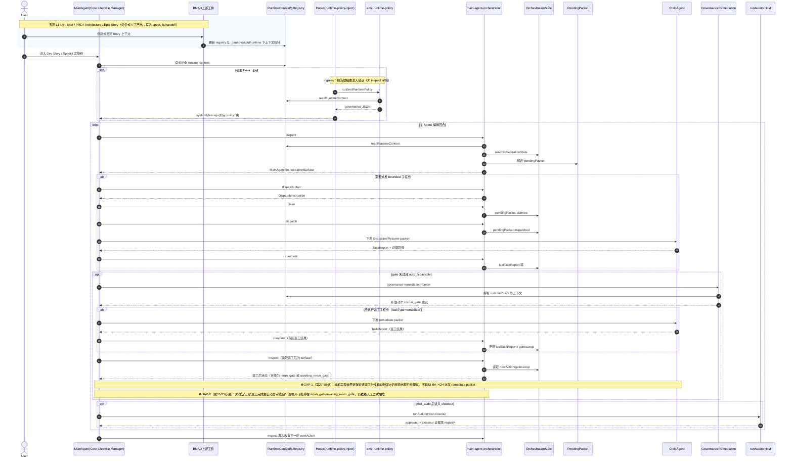
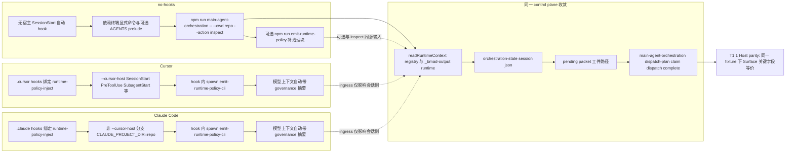

# TASKS_v1 - Main-Agent Orchestration Gap Closure

> 基线来源：`docs/design/2026-04-24-orchestration-recommended-architecture-adr.md`、`docs/design/2026-04-24-github-agent-orchestration-systems-deep-analysis.md`、`docs/design/2026-04-24-governance-signals-main-agent-integration-patch.md`
>  
> 目标：把“已接入能力”推进到“可长时自治 + 可并行治理 + 可稳定收口”的工程完成态。
>
> 统一引用（single source）：
> - 策略层：`_bmad/_config/orchestration-governance.contract.yaml`
> - 事实层：`_bmad-output/runtime/governance/user_story_mapping.json`

---

## 0. 执行原则（强约束）

1. 主 Agent 是唯一 orchestrator；子代理仅执行 bounded task。
2. `hooks/no-hooks` 必须进入同一 control plane（同构 state/packet 语义）。
3. `recommendation` packet 不可直接 dispatch；必须冻结为 `execution/resume`。
4. 执行成功不等于完成；必须 `gate pass + closeout approved`。
5. 所有推进必须可追溯到 machine-readable 工件（state/packet/report）。
6. five-signal 作为策略层（contract）统一定义，不允许多份平行标准。
7. user_story_mapping 作为事实层（index）统一落盘，不允许规则与事实混写。

---

## 0.1 单一真相源（contract + index）

为避免标准散落，固定为两层：

1. **策略层（contract）**
   - 路径：`_bmad/_config/orchestration-governance.contract.yaml`
   - 内容：
     - five-signal 统一定义（含第5信号 `orchestration_governance_completeness`）
     - 各阶段 gate requirements
     - mapping 一致性规则（required fields / consistency checks）
2. **事实层（index）**
   - 路径：`_bmad-output/runtime/governance/user_story_mapping.json`
   - 内容：
     - `requirement -> epic/story/sprint/flow/status/allowedWriteScope` 的运行事实
3. **主循环消费约束**
   - 主循环仅消费 contract + index 两个一等来源；
   - ADR/TASKS/audit 仅作说明，不重复定义规则。

## 0.1.1 单一来源边界（强制）

以下 5 条为硬约束，违反任一条即视为实现不合格：

1. `contract` **只定义规则**，不存运行事实。
2. `mapping` **只存事实**，不存规则阈值。
3. `runtime policy` **只存会话参数**，并附 `contractHash + mappingHash`。
4. 主循环判定 **只认一个入口**：`inspect surface`。
5. CI 必须执行 **single-source 测试**，任一失败即整体失败。

## 0.1.2 字段白名单表（可直接做 schema 硬校验）

> 用法：新增字段前先判断“属于哪一层”，不在白名单即拒绝；命中禁止项直接 fail。

| 层 | 文件 | 允许字段（白名单） | 禁止字段（黑名单） | 责任方（写/读） |
| --- | --- | --- | --- | --- |
| 规则层 | `_bmad/_config/orchestration-governance.contract.yaml` | `version`、`contract_id`、`owner`、`status`、`updated_at`、`description`、`sources_of_truth`、`consumption_rules`、`signals`、`stage_requirements`、`mapping_contract`、`adaptive_intake_governance_gate`、`observability_targets` | 运行态字段（如 `pendingPacket`、`sessionId`、`retryCount`、`lastTaskReport`、`executionRecordId`、`updatedItems`） | 写：架构/治理维护者；读：主编排与审计 |
| 事实层 | `_bmad-output/runtime/governance/user_story_mapping.json` | 顶层：`version`、`updatedAt`、`source`、`items`；`items[]`：`requirementId`、`sourceType`、`epicId`、`storyId`、`flow`、`sprintId`、`allowedWriteScope`、`status`、`acceptanceRefs`、`lastPacketId`、`updatedAt` | 规则阈值字段（如 `signal_overrides`、`required_signals`、`severity_default`、`gateThreshold`、`strictness`） | 写：intake/路由；读：主编排/报告 |
| 会话参数层 | 由 `emit-runtime-policy` 输出（见 `docs/reference/runtime-policy-emit.schema.json`） | 会话参数与运行上下文（如 `helpRouting`、`implementationEntryGate`、`mainAgentOrchestration`、`continueDecision`、`mainAgentNextAction`、`mainAgentReady`、`complexity*`），并**必须附** `contractHash`、`mappingHash`（放入 `mainAgentOrchestration` 或等价稳定位置） | 规则正文复制（完整 `signals/stage_requirements`）与事实正文复制（完整 `items[]` 映射表） | 写：hook/emit；读：会话执行与诊断 |
| 判定入口 | `inspect surface`（`main-agent-orchestration --action inspect`） | `orchestrationState`、`pendingPacketStatus`、`pendingPacket`、`latestGate`、`gatesLoop`、`closeout`、`drift`、`continueDecision`、`mainAgentNextAction`、`mainAgentReady` | 旁路判定（直接从临时 markdown、硬编码阈值、未注册 YAML 读取决策） | 写：主编排；读：主 Agent/CI gate |

### 白名单执行规则

1. 字段不在白名单：拒绝写入并返回失败。
2. 命中黑名单字段：CI 直接失败（single-source gate）。
3. `runtime policy` 缺少 `contractHash` 或 `mappingHash`：判定失败。
4. 主循环若未通过 `inspect surface` 判定下一步：判定失败。

## 0.2 Five-Signal 统一ID（冻结）

1. `p0_journey_coverage`
2. `smoke_e2e_readiness`
3. `evidence_proof_chain`
4. `cross_document_traceability`
5. `orchestration_governance_completeness`

> 第5信号上线策略：先 `warn-only`，稳定后在 `implement/post_audit/closeout` 阶段升为 `block`。

## 0.2.1 Host Mode Detection & Seamless Orchestration Contract（固定）

> 目标：在 `hooks` 与 `no-hooks` 场景下保持同一控制面、同一收口语义。  
> 原则：**差异只允许出现在 ingress，不允许出现在 orchestration truth。**

1. 必须在主编排开始前执行 `HostModeDetect`，识别宿主类型（`cursor` / `claude` / terminal）。
2. 必须检测 hook 可用性（`runtime-policy-inject` 可执行性）并输出布尔结果。
3. 必须检测 control-plane 可用性（`main-agent-orchestration --action inspect`）。
4. 必须检测关键工件可读性（`sprint-status.yaml`、runtime registry、orchestration-state）。
5. `HostModeDetect` 输出必须 machine-readable：`host_mode`、`orchestration_entry`、`degradation_level`。
6. `host_mode` 仅允许：`hooks_enabled` / `no_hooks`。
7. `orchestration_entry` 仅允许：`hook_ingress` / `cli_ingress`。
8. `hooks_enabled` 时，hook 仅用于会话注入；不得替代 control-plane truth（`inspect/state/packet/closeout`）。
9. `no_hooks` 时，必须直接走 `cli_ingress`，并与 hooks 路径共享同一状态机与 gate 语义。
10. hook 失败时必须自动降级到 `cli_ingress`，同时记录 `degradation_reason`，不得中断主链。
11. 仅当 control-plane 不可用时允许 `hard_block`，且必须写入 machine-readable 阻断原因。
12. 两条 ingress 路径最终必须收敛到同一出口：`release-gate pass + completion-intent + authorized sprint-status write`。

---

## 0.3 主 Agent 自动化编排时序图（现状 vs 目标态）

> **读图约定**
>
> - **五层架构**：Product Brief → PRD → Architecture → Epic/Story → Speckit（specify/plan/gaps/tasks/implement）。时序图把前四层压缩为「BMAD 上游产物 + runtime registry 落盘」，第五层与主循环展开。
> - **现状图**：描述当前仓库已落地的主链（`runtime-policy-inject` / `emit-runtime-policy`、`readRuntimeContext`、`main-agent-orchestration`、`orchestrationState`、`pendingPacket`、`runAuditorHost` closeout、`governance-remediation-runner` 等）。**不暗示** `inspect` 已把 emit 出的 JSON 整块回显（双出口：Hook 喂模型、CLI 读落盘事实）。
> - **目标态图**：描述 `TASKS_v1.md` + `TASKS_v1.audit.md` + `TASKS_v1.audit-log.md` 全部达成后的主 Agent 系统（contract/index 单一消费、adaptive gate、长跑策略、并行锁、PR 拓扑、closeout 后 index 回写等）。部分模块名为**规划中的逻辑边界**，实现时可合并文件但不得合并语义。
> - **Host parity 子图（0.3.3）**：挂在 **0.3.2 目标态**之下，用三条泳道对比 **no-hooks / Cursor / Claude** 的 ingress 差异与同一 **control plane** 收敛点（对应 **T1.1**）。

### 0.3.1 现状：五层主链 + 已实现的主 Agent 编排全流程



### 0.3.2 目标态：按控制面优先级重排后的唯一验收主链

```mermaid
sequenceDiagram
  autonumber
  actor U as User
  participant MA as MainAgent
  participant BM as BMAD上游工件
  participant HM as HostModeDetect
  participant IS as IngressSelector
  participant H as runtime-policy-inject
  participant EM as emit-runtime-policy
  participant CT as contract_yaml
  participant IDX as user_story_mapping
  participant SS as sprint-status.yaml
  participant RC as RuntimeContext与Registry
  participant AG as adaptive_intake_governance_gate
  participant SA as ScenarioClassifier/StoryAdapter
  participant CLI as main-agent-orchestration
  participant OS as OrchestrationState
  participant LR as LongRunRuntime
  participant PP as ParallelPlanner
  participant PR as PRTopology
  participant PK as PendingPackets
  participant CH as ChildAgents
  participant AH as runAuditorHost
  participant JR as dual-host-journey-runner
  participant RG as main-agent-release-gate
  participant SU as update-sprint-status-from-main-agent

  Note over MA,SU: 唯一验收顺序：CP0 -> CP1 -> CP2 -> CP3 -> CP4 -> CP5；CP6 为最终硬化覆盖层
  Note over MA,SU: S* = sequence steps；A* = scenario adaptation steps；R* = long-run runtime obligations；AC* = hard checkpoints
  Note over MA,SU: 编号规则：`S*` 只表示可落盘、可产证据、可绑定测试的动作步骤；分支条件统一使用 `G*`

  rect rgb(245, 250, 255)
    Note over U,RC: CP0 Unified Truth & Cross-Host Ingress：先建立单一真相源，再建立双 ingress 收敛
    Note over U,BM: S1-S3 五层 L1-L4 上游产物落盘（artifact/registry）
    U->>BM: S1 提交 Story/Epic/增量需求
    BM-->>RC: S2 写 runtime registry 与 artifact 指针
    BM-->>SS: S3 写入/更新 Epic/Story 执行事实提案（非 committed sprint-status）
    MA->>HM: S3a 识别宿主/Hook/控制面可用性
    HM-->>MA: S3b host_mode + orchestration_entry + degradation_level
    MA->>IS: S3c 选择 ingress（hook_ingress / cli_ingress）
    IS-->>MA: S3d ingress 选择结果（不改变 orchestration truth）

    opt S3e hook ingress（hook 可用时）
      Note over H,EM: 仅影响会话注入，不替代 control-plane truth（state/packet/inspect）
      IS->>H: 启用 runtime-policy-inject
      H->>EM: runEmitRuntimePolicy
      EM->>RC: readRuntimeContext
      EM-->>H: governance 注入块
    end

    opt S3e' cli ingress（no-hooks 或 hook 降级时）
      Note over MA,RC: 主 Agent 通过 CLI/显式命令写 runtime context 并进入同一 control plane
      MA->>RC: 显式写 normalized runtime context
      MA->>EM: 必要时显式调用 emit-runtime-policy
    end
  end

  rect rgb(255, 248, 240)
    Note over MA,SA: CP1 Adaptive Intake & Story Adaptation：先判定是否应纳管，再自动适配到 Epic/Story
    MA->>AG: S4 提交 intake 候选 + scoring 因子
    AG->>SS: S5 检查 sprint 执行进度与当前 intake 一致性
    AG->>CT: S6 检查 stage_requirements 与 gate policy
    alt S7a block/reroute
      AG-->>MA: block 或 reroute（machine-readable reason）
      MA->>OS: 记录 blocker/reroute 原因
    else S7b pass
      AG-->>MA: pass
      MA->>SA: A0 场景分类 + candidate_story_keys 计算
      SA->>IDX: A1/A2/A3 读写 requirement -> epic/story 映射
      SA->>SS: A5 同步 sprint 执行提案与 queue 变更（非 committed sprint-status）
      alt A6 无现有 Story 可承接
        SA->>BM: A7 生成最小 Story 草案（draft_pending_readiness）
        SA-->>MA: A8 readiness 前置后方可进入主链
      else A4/A5 适配成功
        SA-->>MA: 已绑定的 Epic/Story 集 + allowedWriteScope
      end
    end
  end

  rect rgb(245, 255, 245)
    Note over MA,OS: CP2 Main Loop & Packet Lifecycle Closure：唯一 orchestrator 的 inspect/dispatch/complete/remediate 主循环
    MA->>LR: S8 注入 LongRunPolicy（checkpoint/retry/compaction）
    LR->>OS: S8 写入长跑策略字段

    loop S9-S29 主编排循环（唯一 orchestrator）
      MA->>CLI: S9 inspect
      CLI->>CT: S10 解析 contract（five-signal/stage gate）
      CLI->>SS: S11 解析 sprint 执行进度事实（authoritative）
      CLI->>RC: S12 readRuntimeContext
      CLI->>OS: S13 readOrchestrationState
      CLI->>PK: S14 读取 pendingPacket 生命周期状态
      CLI-->>MA: S15 Surface（nextAction/pendingPacketStatus/continueDecision）

      alt S16 需派发子任务
        MA->>CLI: S17 dispatch-plan（先物化）
        CLI-->>MA: S18 DispatchInstruction（route/taskType/expectedDelta）
        MA->>CLI: S19 claim
        MA->>CLI: S20 dispatch
        MA->>CH: S21 下发 bounded packet
        CH-->>MA: S22 TaskReport + 证据
        MA->>CLI: S23 complete
        CLI->>OS: S24 写 lastTaskReport + packet status
      end

      alt S25 gate=auto_repairable_block
        MA->>CH: S26 下发 remediate packet（taskType=remediate）
        CH-->>MA: S27 返工 TaskReport(done/partial/fail)
        MA->>CLI: S28 complete（返工结果写回）
        MA->>CLI: S29 inspect（应自动生成复审下一跳）
        Note over MA,CLI: AC-LoopClosure：S29 后必须出现可执行复审动作；否则 T1.6 fail
      end
    end
  end

  rect rgb(250, 245, 255)
    Note over MA,SU: CP3 Release / Closeout Authority：先 journey、再 closeout、再 release-gate、最后才允许 sprint-status 写入
    MA->>JR: S31 执行双宿主真用户路径 E2E（Claude/Codex）
    JR-->>MA: S32 E2E verdict + evidence bundle（journeyMode=real|mock）
    Note over MA,JR: AC-DualHostE2E：必须满足 journeyE2EPassed=true AND journeyMode=real AND hostsPassed.claude=true AND hostsPassed.codex=true；任一宿主失败 => 禁止推进 sprint-status

    alt S33 Closeout 前置条件满足
      Note over MA,AH: AC-Closeout：只要求 allow_closeout=true；不得依赖 release-gate pass 或 closeout approved
      MA->>AH: S34 runAuditorHost closeout
      AH-->>MA: S35 approved + scoreWriteResult + handoffPersisted
      MA->>OS: S36 收口 closeout/gatesLoop
    else S33b 前置条件不满足
      MA->>OS: 记录 blocked/await_user 原因，禁止宣称 done
    end

    MA->>RG: S37 执行 release-gate 聚合判定（输入=dual-host verdict + closeout_result + all_affected_stories_passed + pr_topology）
    RG-->>MA: S38 pass/fail + completion-intent token（fail 时 blocked_sprint_status_update=true）
    Note over MA,RG: AC-ReleaseGate：main-agent:release-gate 必须 pass；任一 critical failure 即 fail

    alt S39 release-gate=pass 且 token 有效
      Note over MA,SU: token contract：single-use + bound(sessionId/contractHash/storyKey) + ttl
      MA->>SU: S40 请求授权写入 sprint-status（携带 token + gate report）
      SU->>SS: S41 更新 Story 状态（唯一授权写入路径）
      SU-->>MA: S42 写入审计记录（sessionId/contractHash/storyKey/from->to）
    else S39b gate fail 或 token 无效
      MA->>OS: S40b 记录阻断原因并设置 nextAction=dispatch_remediation（禁止更新 sprint-status）
    end

    MA->>CLI: S43 最终 inspect（收敛下一轮或结束）
  end

  rect rgb(255, 255, 240)
    Note over LR,PK: CP4 Long-Run Runtime & Recovery：R1-R10 不是独立分支，而是覆盖 CP2/CP3 的运行时义务
    LR->>OS: R1/R5/R6 tick、progress proof、no-progress circuit
    LR->>PK: R7 lease / heartbeat / stale recovery
    LR-->>MA: R3 retry budget、R4 rerun_gate auto-continue、R8 host degradation continuity、R9 终止条件
  end

  opt S30 并行治理（CP5 Parallel Mission Control）
    MA->>PP: S30 并行分组 + writeScope 冲突检测（禁止直接写 sprint-status）
    PP->>PR: 输出 ParallelMissionPlan / PR DAG
    PP-->>MA: 冲突重排或降级串行（附原因 + protected_write_paths）
  end

  Note over MA,SU: CP6 Governance Hardening（T1.8/T1.9/T5.1/T5.2/T5.3）不是第二主链；它是对 CP0-CP5 的最终阻断式验收覆盖层
```



#### 0.3.2.0 控制面阶段映射（唯一执行顺序）

> 后续所有任务、测试、工件与 closeout，必须先映射到下面的控制面阶段，再谈实现完成。  
> **不允许**再按 `T1/T2/T3/T4` 编号顺序宣称“已经做到”。  

| 控制面阶段 | 覆盖步骤 | 核心能力 | 对应任务包 |
| --- | --- | --- | --- |
| `CP0 Unified Truth & Cross-Host Ingress` | `S1-S3e` | contract/index 单一真相源、hooks/no-hooks 同 ingress contract | `T1.1, T1.4, T1.5, T1.11` |
| `CP1 Adaptive Intake & Story Adaptation` | `P0.5-P0.6 + A0-A8 + S4-S7` | `CP1a`=`P0.5-P0.6 + A0-A8`（发生在 `S1` 前，负责 readiness 与 Story 归属）；`CP1b`=`S4-S7`（发生在 `S3e` 后、`S8` 前，负责 intake gate 与 route verdict） | `T3.1, T3.2, T3.3` |
| `CP2 Main Loop & Packet Lifecycle Closure` | `S8-S29` | inspect/dispatch/complete/remediate/rerun_gate 自动续跑 | `T1.2, T1.3, T1.6` |
| `CP3 Release / Closeout Authority` | `S31-S43` | dual-host journey、closeout、release-gate、tokenized sprint write | `T1.7, T1.13, T1.14, T1.15, T1.16` |
| `CP4 Long-Run Runtime & Recovery` | `R1-R10` | 8h tick、heartbeat、lease、retry、chaos recovery、soak | `T2.1, T2.2, T1.10` |
| `CP5 Parallel Mission Control` | `S30` | 并行分组、writeScope 锁、PR DAG、重排/降级串行 | `T4.1, T4.2` |
| `CP6 Governance Hardening Overlay` | 覆盖 `CP0-CP5` | quality gate、audit sync、ADR drift、traceability、single-source guard | `T1.8, T1.9, T5.1, T5.2, T5.3` |

#### 0.3.2.1 复杂需求完整 User Journey（说人话）

> 这一版不是“流程简介”，而是**逐步骤演练脚本**。  
> 每一步都强制包含：`输入` / `动作` / `通过断言` / `失败分支` / `证据`。  
> 任一步断言失败，整条链路判定为“半成品”，禁止宣称完成。
>  
> **编号解释**：本节前面的有序列表数字只是阅读辅助，不是机器真相源；真正的 canonical step ID 只认 `P0.* / S* / A* / R* / G*`。

##### A) 逐步骤演练（复杂需求，跨多 Story）

###### 阶段0（时序图外前置）：L1-L4 产物准备 + readiness

1. **`P0.1` `PM/BA -> Brief`**：入参=原始需求；成功回参=可验证目标/范围/非目标；失败去向=`block:brief_not_testable`；证据=brief 文档。  
2. **`P0.2` `Brief -> PRD`**：入参=已通过 Brief；成功回参=需求-验收映射完整；失败去向=`block:prd_unmapped_requirements`；证据=PRD + mapping 表。  
3. **`P0.3` `PRD -> Architecture`**：入参=PRD；成功回参=模块边界/数据流/风险闭环；失败去向=`block:architecture_gap`；证据=architecture 文档。  
4. **`P0.4` `Architecture -> Epic/Story`**：入参=architecture 约束；成功回参=Epic/Story 拆分 + DoD + 依赖关系；失败去向=`block:story_not_actionable`；证据=story 工件。  
5. **`P0.5` `Story -> Implementation Readiness Check`**：入参=story + PRD + architecture；成功回参=`readiness=pass`；失败去向=`P0.5a`（不得直接进入 `S1`）；证据=readiness 报告。  
6. **`P0.5a` readiness 失败触发 rerun_gate**：入参=`readiness_failed` + fail_reasons；成功回参=`nextAction=dispatch_remediation` 且 `gateStatus=awaiting_rerun_gate`；失败去向=`hard_block:readiness_loop_not_created`；证据=orchestration-state 中 `nextAction/gateStatus/fail_reasons`。  
7. **`P0.5b` 前置返工执行与复检**：入参=remediation task packet（仅修复 readiness 缺口）；成功回参=自动重跑 readiness（`rerun_gate`）并得到新 verdict；失败去向=达到 retry budget 后 `block:readiness_retry_budget_exhausted`；证据=remediation 报告 + rerun readiness 报告 + retries 计数。  
8. **`P0.6` 前置证据收敛断言**：入参=brief/prd/architecture/story/readiness(+rerun) 工件；成功回参=全部绑定同一 StoryKey 且最新 verdict=`pass`；失败去向=`hard_block:prestage_traceability_broken`；证据=trace 清单 + latest readiness verdict。

###### 阶段1（严格按 0.3.2 调用顺序）：`S1 -> ... -> S43`

4. **`S1` 需求入场（`U->BM`）**：输入=通过 `U4` 的 StoryKey；动作=提交增量需求；断言=StoryKey 不为空且存在于上游工件；失败=缺 StoryKey -> `hard_block:intake_invalid`；证据=需求 payload + StoryKey 校验日志。  
5. **`S2` registry 指针落盘（`BM->RC`）**：输入=StoryKey 与 brief/prd/arch/story 路径；动作=写 runtime registry；断言=四类指针均可解析；失败=任一缺失 -> `block:missing_upstream_artifact`；证据=`_bmad-output/runtime/**`。  
6. **`S3` 执行进度事实提案写入（`BM->SS`）**：输入=当前 Story 执行状态；动作=仅更新 `planning_sync` / queue / mapping 提案，不得写 committed `execution_transition`；断言=状态提案单调且不回退；失败=冲突/倒退 -> `block:sprint_status_conflict`；证据=sprint-status proposal diff。  
7. **`S3a` HostModeDetect 调用（`MA->HM`）**：输入=当前宿主环境；动作=检测 host/hook/control-plane；断言=必须返回 machine-readable 结构；失败=无返回 -> `hard_block:host_mode_unknown`；证据=host detect JSON。  
8. **`S3b` 检测结果回传（`HM->MA`）**：输入=detect 结果；动作=回传 `host_mode/orchestration_entry/degradation_level`；断言=字段值域合法；失败=越界 -> `block:host_mode_schema_violation`；证据=schema 校验记录。  
9. **`S3c` 入口选择（`MA->IS`）**：输入=host mode；动作=选择 ingress；断言=同输入同输出（可复算）；失败=不确定性 -> `block:nondeterministic_ingress`；证据=ingress decision record。  
10. **`S3d` 入口决策返回（`IS->MA`）**：输入=ingress 决议；动作=写会话决策；断言=降级场景必须附 `degradation_reason`；失败=缺 reason -> `block:missing_degradation_reason`；证据=session decision artifact。  
11. **`S3e` ingress 执行（`IS->H->EM->RC` 或 CLI）**：输入=入口决策；动作=hook 注入或 CLI 直入；断言=hook 只注入会话，不改 control-plane；hook 失败自动降级不断链；失败=污染真相/未降级 -> `hard_block:ingress_contract_breach`；证据=hook log + inspect 前后对比。  
12. **`S3e-degradation` 宿主退化合同**：入参=`host_mode + orchestration_entry`；成功回参=`degradation_level` 仅允许 `none | hook_lost | transport_degraded | host_partial | cli_forced`，且 `degradation_reason` 必须含 `detected_at/failed_capability/fallback_entry/expected_behavior_change`；失败去向=`block:degradation_contract_violation`；证据=host decision artifact + inspect parity snapshot。  
13. **`S3f` 回切合同**：入参=degraded 运行态；成功回参=仅当连续 N 次 health probe 成功且 parity snapshot 一致时才允许从 `cli_ingress` 回切 `hook_ingress`，并记录 `degradation_cleared_at/recovery_probe_count/recovered_host_mode`；失败去向=`block:unsafe_host_recovery_switch`；证据=recovery log + before/after parity diff。  
14. **`S4` intake 提交（`MA->AG`）**：输入=intake 候选 + scoring 因子；动作=进入自适应门禁；断言=候选字段完整且无隐式默认；失败=字段缺失 -> `block:intake_payload_invalid`；证据=intake payload 快照。  
15. **`S5` 进度一致性校验（`AG->SS`）**：输入=候选任务 + sprint 执行事实提案；动作=检查冲突；断言=不得重复派发已封板 Story；失败=冲突 -> `reroute_or_block`；证据=gate check report。  
16. **`S6` 合同规则校验（`AG->CT`）**：输入=候选 + contract；动作=校验 stage/gate policy；断言=命中链可追溯；失败=不可追溯 -> `block:opaque_gate_decision`；证据=rule trace log。  
17. **`S7` verdict 回传（`AG->MA`）**：输入=S5/S6 结果；动作=返回 `pass/reroute/block`；断言=machine-readable + reason code；失败=仅自然语言 -> `block:non_machine_verdict`；证据=verdict JSON。  
18. **`S8` 长跑策略写入（`MA->OS`）**：输入=会话运行配置；动作=写 checkpoint/retry/compaction；断言=策略与 state 同源且版本可追溯；失败=漂移 -> `block:longrun_policy_drift`；证据=state policy 字段。  
17. **`S9` `MA -> CLI`**：入参=inspect 请求；成功回参=进入读取流程；失败去向=`hard_block:inspect_call_failed`；证据=inspect 调用日志。  
18. **`S10` `CLI -> CT`**：入参=contract 读取请求；成功回参=规则解析结果；失败去向=`block:contract_unreadable`；证据=contract parse log。  
19. **`S11` `CLI -> SS`**：入参=sprint-status 读取请求；成功回参=执行进度事实；失败去向=`block:sprint_status_unreadable`；证据=sprint-status read log。  
20. **`S12` `CLI -> RC`**：入参=runtime context 读取请求；成功回参=context 快照；失败去向=`block:runtime_context_missing`；证据=runtime context snapshot。  
21. **`S13` `CLI -> OS`**：入参=orchestration state 读取请求；成功回参=state 快照；失败去向=`block:state_unreadable`；证据=state read log。  
22. **`S14` `CLI -> PK`**：入参=pending packet 查询；成功回参=生命周期状态；失败去向=`block:packet_state_missing`；证据=packet artifact。  
25. **`S15` `CLI -> MA`**：入参=surface（nextAction/pendingPacketStatus/continueDecision）；成功回参=MA 决策输入就绪；失败去向=`hard_block:inspect_surface_invalid`；证据=surface JSON。  
26. **`G1 dispatch_needed`**：入参=`S15 surface`；成功回参=若需派发则进入 `S17-S24`；失败去向=`block:nondeterministic_dispatch_branch`；证据=dispatch branch decision。  
27. **`S17` `MA -> CLI`**：入参=dispatch-plan 请求；成功回参=instruction 生成；失败去向=`block:dispatch_plan_failed`；证据=dispatch-plan log。  
28. **`S18` `CLI -> MA`**：入参=DispatchInstruction；成功回参=route/taskType/expectedDelta 齐全；失败去向=`block:instruction_incomplete`；证据=instruction JSON。  
29. **`S19` `MA -> CLI`**：入参=claim 请求；成功回参=packet claimed；失败去向=`block:claim_failed`；证据=packet claimed 状态。  
30. **`S20` `MA -> CLI`**：入参=dispatch 请求；成功回参=packet dispatched；失败去向=`block:dispatch_failed`；证据=packet dispatched 状态。  
31. **`S21` `MA -> CH`**：入参=bounded execution packet；成功回参=子任务启动；失败去向=`block:child_not_started`；证据=child dispatch record。  
32. **`S22` `CH -> MA`**：入参=TaskReport + evidence；成功回参=报告结构合法；失败去向=`block:task_report_invalid`；证据=task report artifact。  
33. **`S23` `MA -> CLI`**：入参=complete 请求；成功回参=进入写回；失败去向=`block:complete_failed`；证据=complete call log。  
34. **`S24` `CLI -> OS`**：入参=lastTaskReport + packet status；成功回参=state 写回成功；失败去向=`block:state_writeback_failed`；证据=state diff。  
35. **`S24a` packet 生命周期断言**：入参=更新后 state；成功回参=packet 生命周期闭环成立；失败去向=`block:packet_lifecycle_broken`；证据=pendingPacket 生命周期轨迹。  
36. **`G2 gate=auto_repairable_block`**：入参=`S24a` 后的 gate verdict；成功回参=若命中则进入 `S26-S29`；失败去向=`block:gate_classification_invalid`；证据=gate 分类记录。  
37. **`S26` `MA -> CH`**：入参=remediate packet；成功回参=返工任务启动；失败去向=`fail:T1.6_half_done`；证据=remediate dispatch record。  
38. **`S27` `CH -> MA`**：入参=返工 TaskReport；成功回参=返工结果可解析；失败去向=`fail:T1.6_half_done`；证据=remediate report。  
39. **`S28` `MA -> CLI`**：入参=返工 complete 写回请求；成功回参=返工状态落盘；失败去向=`fail:T1.6_half_done`；证据=post-remediate state diff。  
40. **`S29` `MA -> CLI`**：入参=返工后 inspect 请求；成功回参=出现可执行下一跳；失败去向=`fail:T1.6_half_done`；证据=post-remediate surface。  
38. **`S30` `MA -> PP -> PR`**：入参=并行任务集；成功回参=冲突重排后的 PR DAG；失败去向=`hard_block:write_path_violation`；证据=冲突日志 + PR topology。  
42. **`S31` `MA -> JR`**：入参=dual-host journey 请求；成功回参=测试执行完成；失败去向=`blocked_sprint_status_update=true`；证据=journey run log。  
43. **`S32` `JR -> MA`**：入参=E2E verdict bundle；成功回参=`journeyMode=real|mock` + `hostsPassed.{claude,codex}` + `journeyE2EPassed`；失败去向=`blocked_sprint_status_update=true`；证据=dual-host evidence bundle。  
44. **`S33` Closeout 前置判定**：入参=`journeyE2EPassed + all_affected_stories_passed + pendingPacket=0 + critical_failures=0`；成功回参=`allow_closeout=true`；失败去向=`block:closeout_precondition_failed`；证据=pre-closeout check JSON。  
42. **`S34` `MA -> AH`**：入参=closeout 请求；成功回参=closeout 执行完成；失败去向=`block:closeout_incomplete`；证据=auditor-host run log。  
43. **`S35` `AH -> MA`**：入参=approved + scoreWriteResult + handoffPersisted；成功回参=MA 收到完整收口结果；失败去向=`block:closeout_incomplete`；证据=closeout envelope。  
44. **`S36` `MA -> OS`**：入参=closeout 收口字段；成功回参=state 收口成功；失败去向=`block:closeout_state_write_failed`；证据=closeout state diff。  
45. **`S37` `MA -> RG`**：入参=release-gate 聚合请求；成功回参=进入总判定；失败去向=`block:release_gate_call_failed`；证据=release-gate call log。  
49. **`S38` `RG -> MA`**：入参=pass/fail + completion-intent；成功回参=token 可用；失败去向=不签 token + 阻断；证据=release-gate JSON。  
50. **`S39` token 判定**：入参=completion-intent；成功回参=token 合法（single-use+bound+ttl）；失败去向=`S40b`；证据=token validation log。  
51. **`S40` `MA -> SU`**：入参=授权写入请求（含 token）；成功回参=进入写入流程；失败去向=`S40b`；证据=write-auth request log。  
52. **`S41` `SU -> SS`**：入参=story 状态变更；成功回参=仅 `SU` 可写 `execution_transition` 字段，且 batch 原子写入成功；失败去向=`S40b`；证据=sprint-status from/to diff。  
53. **`S42` `SU -> MA`**：入参=写入审计记录；成功回参=审计落盘成功；失败去向=`S40b`；证据=audit trail。  
54. **`S40b` `MA -> OS`**：入参=gate fail 或 token invalid；成功回参=阻断原因 + `nextAction=dispatch_remediation` 写入；失败去向=`block:non_machine_block_reason`；证据=blocked record。  
55. **`S43` `MA -> CLI`**：入参=最终 inspect 请求；成功回参=终态收敛；失败去向=回 remediation 且禁止宣称完成；证据=final surface snapshot。  

###### 阶段1运行时循环合同（8h+ 自动编排，强制）

56. **`R1` Tick 驱动主循环**：MA 必须以固定 tick 驱动（建议 5-30s），每轮写入 `loop_seq/running_for_ms/last_tick_ts/last_progress_ts`。若 tick 中断则 `hard_block:loop_scheduler_dead`。  
54. **`R2` 失败去向必须动作化**：除 `hard_block:*` 外，所有 `block:*`/`fail:*` 必须映射为可执行动作（`dispatch_remediation`、`reroute`、`awaiting_rerun_gate`），禁止停留在纯文本错误态。  
57. **`R3` Retry Budget + Cooldown**：每类失败必须配置 `max_retries + cooldown_ms`，未达预算自动重试，达预算转 `*_retry_budget_exhausted` 终止态。  
58. **`R4` Rerun Gate 自动续跑**：`awaiting_rerun_gate -> dispatch_review|dispatch_remediation|blocked:*` 必须在下一轮 tick 内完成状态转移，不允许停留在无 owner、无 schedule、无 nextAction 的悬空态。`rerun_gate` 真相源以 `orchestrationState.gateStatus + nextAction + pendingPacket.status` 三元组为准，三者不一致即 `block:rerun_gate_state_diverged`。连续复检失败超过策略预算时必须转入 `*_retry_budget_exhausted`，禁止无限往返于 `awaiting_rerun_gate <-> rerun_gate`。  
59. **`R5` 进度证明（Progress Proof）**：只有以下事件才计为 progress：`phase` 变化、`nextAction` 变化、packet 生命周期推进、gate verdict 变化、closeout/release-gate verdict 变化。单纯 `tick`、`heartbeat`、`lease renew`、重复写同值不得计为 progress。  
60. **`R6` No-Progress 自愈与熔断**：若连续 `max_no_progress_ticks` 未出现有效 progress，则依次执行 `re-read state -> rebuild dispatch-plan -> reconcile active lease -> force inspect snapshot`；仍无 progress 则 `block:no_progress_circuit_open`，并输出最近一次有效 progress 与最近一次无效活跃事件的对照证据。  
61. **`R7` Lease/Heartbeat 防僵尸**：活跃 packet 必须带 `lease_owner/lease_expires_ts/last_heartbeat_ts/heartbeat_seq`。当 `now > lease_expires_ts` 或连续丢失 heartbeat 达阈值时，packet 必须原地转为 `stale_recoverable`，保留 `originalExecutionPacketId`，清空 owner，并追加 `stale_recovered_count`。恢复后只能由 Main Agent 重新 claim；若检测到双 owner、过期 owner 仍 complete、或 stale packet 被旁路 closeout，直接 `hard_block:stale_packet_split_brain`。  
62. **`R8` Host Degradation 连续运行**：hook 抖动时只允许 transport 降级，不允许 control-plane 语义降级。`degradation_level` 必须写入状态并驱动恢复策略；降级期间 `inspect/dispatch/complete/rerun_gate/release-gate` 语义保持不变；仅在满足回切合同后才允许恢复 hook ingress，否则持续以 `cli_ingress` 运行并保留审计证据。  
63. **`R9` 终止条件机器化**：仅当 `S43` 收敛且 `critical_failures=0` 且无待处理 packet 时允许正常结束，否则继续 loop 或进入受控终止态。  
64. **`R10` 8小时验收条件**：soak ≥ 8h 必须满足“无人工重启、无 silent hang、无假完成”，并产出 loop 时间线证据（tick、重试、熔断、恢复）。  

###### 场景分流（churn-in / standalone tasks / bugfix）——不改主链，只改 `S4-S7` 与 `S16-S24` 的 route

19. **churn-in（阶段0逐步骤）**：`C0.1` 变更请求入场 -> `C0.2` 影响面分析（受影响 Story 集）-> `C0.3` 差异 PRD 更新 -> `C0.4` 架构差异评审 -> `C0.5` Story 重切分与回填 DoD -> `C0.6` readiness 复检。任一步失败返回上游修正。  
20. **churn-in（阶段1路由点）**：`S4-S7` 输出 `reroute=churn_in_eval`；`G1 + S17-S24` 只能消费统一 `AdaptiveIntakeDecision` 契约，且必须产出 `taskType=churn_in` + `all_affected_story_keys[]`，否则 `block:churn_route_incomplete`。  
21. **standalone tasks（阶段0逐步骤）**：`T0.1` 任务文档来源校验 -> `T0.2` 未完成项抽取 -> `T0.3` 与现有 Story 绑定/新建映射 -> `T0.4` PRD/架构引用校验 -> `T0.5` 可执行性与测试入口校验 -> `T0.6` readiness 判定。失败即 `block:standalone_doc_not_actionable`。  
22. **standalone tasks（阶段1路由点）**：`S4-S7` 必须带文档段落证据；`G1 + S17-S24` 只能消费统一 `AdaptiveIntakeDecision` 契约，且产出 `taskType=standalone_task_doc` + `doc_anchor_refs[]`，缺失则阻断。  
23. **bugfix（阶段0逐步骤）**：`B0.1` 问题受理 -> `B0.2` 复现证据固定 -> `B0.3` 根因假设与反证 -> `B0.4` 修复策略评审 -> `B0.5` 影响 Story/模块映射 -> `B0.6` bugfix readiness（含回归范围）。失败即 `block:bugfix_not_ready`。  
24. **bugfix（阶段1路由点）**：`S4-S7` 必须先通过 bug 诊断门；`G1 + S17-S24` 必须产出 `taskType=bugfix/remediate`，并强制触发 `G2 + S26-S29`。若 `S29` 无复审下一跳，直接 `fail:T1.6_half_done`。  
25. **三场景共同硬约束**：无论分流如何，都必须经过 `S31-S32`（dual-host E2E）、`S37-S38`（release-gate）、`S39-S43`（token 授权写入与终态收敛）。

###### 阶段0补充：三场景如何自动适配 Epic/Story（强制）

26. **`A0` 统一适配入口（scenario classifier，首轮）**：入参=用户输入 + 现有工件上下文；成功回参=`AdaptiveIntakeDecision`（最少含 `scenario_type`、`primary_story_key`、`all_affected_story_keys[]`、`epic_keys[]`、`adaptation_mode`、`task_type`、`target_sprint_id`、`allowed_write_scope[]`、`doc_anchor_refs[]`、`regression_story_keys[]`、`evidence_refs[]`、`readiness_status`、`sprint_decision.decision_type`、`sprint_decision.capacity_score`、`sprint_decision.risk_score`、`sprint_decision.dependency_blockers[]`、`sprint_decision.reason`）+ `confidence`；失败去向=`A0a`；证据=首轮分类结果 JSON。  

26a. **`A0a` 低置信触发自动编排 loop（scenario rerun_gate）**：入参=`confidence<threshold` 或 `candidate_story_keys` 为空；成功回参=`nextAction=dispatch_remediation` + `gateStatus=awaiting_rerun_gate`；失败去向=`hard_block:scenario_classification_failed`；证据=orchestration-state 中 scenario gate 字段。  

26b. **`A0b` 自动补证子任务（分类增强）**：入参=scenario remediation packet（补全上下文、抽取锚点、影响面扫描）；成功回参=补证结果写回；失败去向=`block:scenario_remediation_failed`；证据=remediation 报告。  

26c. **`A0c` rerun classifier（自动重跑）**：入参=补证后的上下文；成功回参=新 `scenario_type/candidate_story_keys/confidence`；失败去向=`A0d`；证据=二轮分类结果 JSON。  

26d. **`A0d` loop 收敛与熔断**：入参=重跑结果 + retries 计数；成功回参=`confidence>=threshold` 且进入 `A1/A2/A3`；失败去向=超过预算则 `block:scenario_retry_budget_exhausted`；证据=loop 计数与最终 verdict。

27. **`A1` churn-in -> Epic/Story 自动适配**：入参=`scenario_type=churn_in` + 影响面分析；成功回参=  
`AdaptiveIntakeDecision` 中的 `adaptation_mode`（`attach_existing_story` 或 `create_story_draft` 或 `split_story_delta`）+ `epic_keys[]` + `all_affected_story_keys[]`；失败去向=`block:churn_story_adaptation_failed`；证据=churn 影响面报告 + story 映射决议。  

28. **`A2` standalone tasks -> Epic/Story 自动适配**：入参=`scenario_type=standalone_task_doc` + 文档锚点；成功回参=  
`AdaptiveIntakeDecision` 中的 `doc_anchor_refs[] -> primary_story_key/all_affected_story_keys[]` 全量映射（每个未完成任务都必须绑定 Story）；失败去向=`block:standalone_anchor_unmapped`；证据=doc-anchor 映射表。  

29. **`A3` bugfix -> Epic/Story 自动适配**：入参=`scenario_type=bugfix` + 复现证据 + 根因定位；成功回参=  
`AdaptiveIntakeDecision` 中的 `primary_story_key` + `all_affected_story_keys[]` + `regression_story_keys[]`；失败去向=`block:bugfix_story_adaptation_failed`；证据=bugfix 映射报告。  

30. **`A4` 适配完整性断言（进入 `P0.5` 前）**：入参=场景映射结果；成功回参=  
所有执行单元都落在 Epic/Story 上（禁止 orphan task）；失败去向=`hard_block:orphan_task_detected`；证据=适配完整性检查报告。  

31. **`A5` 适配后回写与可追溯性**：入参=最终映射；成功回参=  
registry / queue / sprint-status 提案 / story 工件同步更新，且 `scenario_type -> epic/story` 可追溯；失败去向=`block:adaptation_writeback_inconsistent`；证据=三处工件 diff + trace id 对账。  

32. **`A6` 无现存 Epic/Story 的终局分支判定**：入参=`A1/A2/A3` 结果（`candidate_story_keys` 为空且重跑已收敛）；成功回参=`resolution_mode=new_story_required`；失败去向=`block:adaptation_resolution_undetermined`；证据=适配终局判定记录。  

33. **`A7` 自动生成最小 Story 草案（非直接实施）**：入参=场景上下文 + 补证结果；成功回参=  
`proposed_epic_key/proposed_story_key` + DoD + 验收草案 + 风险清单（状态=`draft_pending_readiness`）；失败去向=`block:new_story_draft_failed`；证据=新 Story 草案工件。  

34. **`A8` 草案门禁与最终处理**：入参=Story 草案；成功回参=  
通过 `P0.5/P0.5a/P0.5b` readiness loop 后，状态转为 `ready_for_S1` 并进入主链；失败去向=  
`block:new_story_readiness_failed`（保持 fail-closed，不允许进入 `S1`）；证据=readiness loop 报告 + 最终状态变更记录。

##### B) 20 轮推翻式反思（每轮推翻前一版缺陷）

1. V1 被推翻：只有“做什么”，没有“失败怎么判”。  
2. V2 被推翻：有失败判定，但没有 machine-readable reason code。  
3. V3 被推翻：有 reason code，但没写证据工件。  
4. V4 被推翻：写了证据，但没有 host/no-hooks 分叉。  
5. V5 被推翻：有分叉，但没有“降级仍不断链”约束。  
6. V6 被推翻：写了降级，但没防 hook 污染 control-plane。  
7. V7 被推翻：写了污染防护，但 intake 判定不可追溯。  
8. V8 被推翻：可追溯了，但缺 packet 生命周期完整性断言。  
9. V9 被推翻：有生命周期，但返工闭环仍可“只建议不执行”。  
10. V10 被推翻：返工可执行了，但没有“自动复审下一跳”硬断言。  
11. V11 被推翻：复审有了，但并行冲突未绑定写域约束。  
12. V12 被推翻：有写域约束，但未禁止子任务直写 sprint-status。  
13. V13 被推翻：禁止直写了，但 dual-host E2E 不是前置硬门。  
14. V14 被推翻：E2E 前置了，但 closeout 与 release-gate 关系含混。  
15. V15 被推翻：关系理清了，但 token 合约不完整（缺 ttl/single-use）。  
16. V16 被推翻：token 完整了，但失败回流 remediation 不明确。  
17. V17 被推翻：回流明确了，但终态 inspect 缺“禁止宣称完成”约束。  
18. V18 被推翻：终态约束有了，但步骤粒度仍把多动作打包。  
19. V19 被推翻：粒度拆开了，但 L1-L5 与 S* 映射仍不够明确。  
20. V20 当前版：以“输入-动作-断言-失败-证据”逐步落地，仍需后续把每步与 `0.3.4` 矩阵逐行对齐，否则依旧可能回退成口头规范。

### 0.3.3 Host parity 补充子图（no-hooks / Cursor / Claude）

> **意图**：三条路径只在「**如何把上下文送进会话 / 是否自动 emit**」上不同；**编排真相**仍落在同一套 repo-native 工件与 `main-agent-orchestration` 命令面（与 `TASKS_v1` **T1.1** 验收字段对齐：`phase` / `nextAction` / `pendingPacket` 语义一致）。



### 0.3.4 控制面-证据-测试矩阵（按 CP0-CP6 重排，机器可证明）

> 规则：
>
> 1. 每个控制面至少绑定 **一个主证据工件** 与 **一个主测试/命令**。
> 2. 状态统一收敛为 4 档：
>    - `已有`：脚本/测试/命令都存在，且不是 TODO fail-closed 占位
>    - `部分已有`：已有一部分真实实现或测试，但控制面未闭环
>    - `占位`：脚本/命令存在，但实现仍是 TODO fail-closed 或 mock-only 骨架
>    - `缺失`：关键脚本或测试不存在
> 3. 只要某控制面里存在 `占位/缺失` 的关键项，就不得宣称该控制面完成。

| 控制面 | 对应步骤 | Required Proof | Observed Repo Evidence | 真实状态 | 说明 |
| --- | --- | --- | --- | --- | --- |
| `CP0 Unified Truth & Cross-Host Ingress` | `S1-S3e` | `contract/index` 单一真相源；`validate-single-source-whitelist`；host parity fixture；`inspect surface` | `_bmad/_config/orchestration-governance.contract.yaml`、`_bmad-output/runtime/governance/user_story_mapping.json`、`npm run main-agent-orchestration -- --cwd . --action inspect`、`main-agent-orchestration-consumer.test.ts`、`runtime-write-context-script-contract.test.ts`、`runtime-policy-emit-stable.test.ts` | `部分已有` | contract/index 文件存在；host parity 相关入口存在；但 `validate-single-source-whitelist.ts` 与 `governance-single-source-of-truth.test.ts` 缺失，单一来源还未被硬门禁化。 |
| `CP1 Adaptive Intake & Story Adaptation` | `P0.5-P0.6 + A0-A8 + S4-S7` | `AdaptiveIntakeDecision` 契约；`adaptive-intake-governance-gate.test.ts`；`main-agent-churn-routing-score.test.ts`；orphan-task=0 证据 | `adaptive_intake_governance_gate` contract 段、`user_story_mapping.json` | `缺失` | 只有 contract 声明，没有 `scripts/adaptive-intake-governance-gate.ts`，也没有对应 acceptance；A0-A8 基本未形成可执行控制面。 |
| `CP2 Main Loop & Packet Lifecycle Closure` | `S8-S29` | `main-agent-rerun-gate-e2e-loop.test.ts`；`gateStatus/nextAction/pendingPacket.status` 三元组一致；packet lifecycle 无悬空态 | `scripts/main-agent-orchestration.ts`、`scripts/orchestration-state.ts`、packet artifacts、`main-agent-packet-lifecycle-e2e.test.ts`、`main-agent-child-result-e2e.test.ts`、`main-agent-gates-loop-e2e.test.ts` | `部分已有` | 主循环、packet 生命周期、gatesLoop 基础能力已存在；但 `main-agent-rerun-gate-e2e-loop.test.ts` 缺失，`S26-S29` 的“返工后自动复审下一跳”还没有被机器证明。 |
| `CP3 Release / Closeout Authority` | `S31-S43` | `main-agent:release-gate`；`journeyMode=real` 双宿主通过；`completion-intent` token 校验；唯一授权写入 `sprint-status` | `scripts/e2e-dual-host-journey-runner.ts`、`scripts/main-agent-release-gate.ts`、`scripts/run-auditor-host.ts`、`e2e-dual-host-journey-runner.test.ts`、`main-agent-release-gate-contract.test.ts`、`main-agent-closeout-e2e.test.ts` | `部分已有` | dual-host journey runner 与 release-gate 已存在，但 journey 目前主要是 mock acceptance；release-gate 只聚合 dual-host E2E，没有 token 签发；`update-sprint-status-from-main-agent.ts`、`main-agent-sprint-status-write-gate.test.ts`、`sprint-status-write-path-hard-cut.test.ts` 缺失。 |
| `CP4 Long-Run Runtime & Recovery` | `R1-R10` | `runtime-longrun-policy-contract.test.ts`；`main-agent-soak-8h-contract.test.ts`；`main-agent-chaos-recovery-e2e.test.ts`；`LongRunPolicy` 与 runtime state/lease 工件回放 | `scripts/main-agent-chaos-scenarios.ts`、`scripts/main-agent-quality-gate.ts`、`npm run test:main-agent-chaos` | `占位` | `main-agent-chaos-scenarios.ts` 和 `main-agent-quality-gate.ts` 都还是 TODO fail-closed；`LongRunPolicy`/tick/heartbeat/lease 没有形成独立可验证控制面，soak/chaos acceptance 也缺失。 |
| `CP5 Parallel Mission Control` | `S30` | `ParallelMissionPlan` 契约；`main-agent-parallel-locking.test.ts`；`main-agent-pr-topology.test.ts`；PR DAG 工件 | 无稳定脚本/测试现状 | `缺失` | 当前仓库没有 `parallel-planner.ts`、`pr-topology.ts`，也没有对应 acceptance；并行与竞态治理仍是纯任务规划态。 |
| `CP6 Governance Hardening Overlay` | 覆盖 `CP0-CP5` | `main-agent:quality-gate`；`task-audit:sync-status`；`architecture-drift-guard.test.ts`；`governance-single-source-of-truth.test.ts`；traceability matrix | `npm run main-agent:quality-gate`、`npm run task-audit:sync-status` | `占位` | `main-agent:quality-gate`、`task-audit:sync-status` 脚本和 npm 命令存在，但脚本仍是 TODO fail-closed；ADR drift / traceability / source-of-truth guard 对应文件和测试大多不存在。 |

#### 0.3.4.1 控制面校准说明（为什么这样标）

1. `CP0` 不是 `已有`
   - 因为单一来源白名单校验脚本 `scripts/validate-single-source-whitelist.ts` 不存在；
   - `governance-single-source-of-truth.test.ts` 也不存在；
   - 说明“设计原则已经明确，但 fail-close contract 还没落地”。

2. `CP2` 不是 `已有`
   - 因为 `S26-S29` 对应的 `main-agent-rerun-gate-e2e-loop.test.ts` 缺失；
   - 当前主循环已能处理 packet 与部分 gatesLoop，但“返工后自动续跑复审”尚未被 E2E 证明。

3. `CP3` 不是 `已有`
   - 因为 `main-agent-release-gate.ts` 当前只聚合 `dual-host-e2e-journey` 一个检查；
   - `completion-intent token`、唯一授权写入 `sprint-status.yaml` 的写入服务与测试都没有落成；
   - 双宿主 journey runner 的 acceptance 目前是 `mock` 模式为主，不足以证明真用户长期闭环。

4. `CP4` 和 `CP6` 是 `占位`
   - 因为对应 npm script 存在，但脚本本体仍然是 TODO fail-closed：
     - `scripts/main-agent-chaos-scenarios.ts`
     - `scripts/main-agent-quality-gate.ts`
     - `scripts/sync-task-audit-status.ts`

5. `CP1` 与 `CP5` 是 `缺失`
   - 因为关键控制面脚本、测试、工件约定都尚未形成。

#### 0.3.4.2 机器证明最小条件（按控制面）

1. `CP0` 必须达到 `已有`
2. `CP1` 必须至少达到 `部分已有`
3. `CP2` 必须达到 `已有`
4. `CP3` 必须达到 `已有`
5. `CP4` 必须至少达到 `部分已有`，且 soak/chaos 证据为真
6. `CP5` 必须至少达到 `部分已有`，且 writeScope 冲突可机审
7. `CP6` 允许晚于 `CP0-CP5` 完成，但在 `CP6` 未转为 `已有/部分已有` 前，不得宣称“产品级完成”

#### 0.3.4.3 当前最小可接受结论

基于当前真实状态，仓库最多只能宣称：

1. 已具备 `CP0` 的一部分
2. 已具备 `CP2` 的一部分
3. 已具备 `CP3` 的一部分
4. `CP1 / CP4 / CP5 / CP6` 仍然没有形成完整控制面闭环

因此，当前仓库**不能**根据 `0.3.2` 目标态宣称：

1. 能从 brief 自动纳管到 sprint
2. 能 8 小时以上连续自治直到最终 closeout
3. 能进行产品级 agent team 并行治理
4. 能通过唯一授权路径自动推进 `sprint-status.yaml`

---

## 1. 里程碑与任务分解

## 1.0 控制面优先执行顺序（唯一顺序，不按编号线性推进）

> 目标：把当前线性任务清单重排为 6 个控制面闭环 + 1 个硬化覆盖层。  
> 原则：**不新增任务 ID，不删除任务内容，只重排执行视角与包级验收顺序**。  
> 强约束：**只有上一控制面包级退出标准通过，下一控制面才允许开始。**

### CP0 Unified Truth & Cross-Host Ingress（单一真相源与跨宿主入口）

- **能力目标**：先把 `contract/index/runtime context/host parity` 固定下来，确保 hooks/no-hooks 进入同一 control plane。
- **纳入任务**：`T1.1, T1.4, T1.5, T1.11`
- **包级退出标准**：
  1. host parity + single-source + stage 对齐全部通过；
  2. single-source 白名单校验通过；
  3. 主控面不依赖 hook 才能继续。
- **机审三元组**：
  - `验收命令/测试`: `main-agent-host-parity-regression.test.ts` + `validate:single-source-whitelist`
  - `工件字段断言`: `contractHash/mappingHash` 存在，且 host parity fixture 下 `phase/nextAction/pendingPacket` 一致
  - `失败码`: `hard_block:single_source_broken`

### CP1 Adaptive Intake & Story Adaptation（自动纳管与 Story 适配）

- **能力目标**：把“用户 brief / churn-in / standalone / bugfix”自动分类、自动匹配到 Epic/Story，并在进入主循环前完成 readiness 前置闭环。
- **纳入任务**：`T3.1, T3.2, T3.3`
- **包级退出标准**：
  1. `A0-A8` 对应能力全部落盘为 machine-readable 工件；
  2. orphan task = 0；
  3. 任何场景都必须先纳入 Story/Epic，再允许进入 `S8-S29` 主循环。
- **机审三元组**：
  - `验收命令/测试`: `adaptive-intake-governance-gate.test.ts` + `main-agent-churn-routing-score.test.ts`
  - `工件字段断言`: `AdaptiveIntakeDecision` 覆盖全部 `execution_unit_id`，且 `primary_story_key/target_sprint_id/allowed_write_scope` 非空
  - `失败码`: `hard_block:orphan_task_detected`

### CP2 Main Loop & Packet Lifecycle Closure（主循环与包生命周期闭环）

- **能力目标**：把 inspect/dispatch/complete/remediate/rerun_gate 真正收敛成唯一 orchestrator 主循环。
- **纳入任务**：`T1.2, T1.3, T1.6`
- **包级退出标准**：
  1. `rerun_gate` 后自动复审下一跳可机器证明；
  2. packet lifecycle 无悬空态；
  3. 子代理永远不能越过 Main Agent 自主推进全局分支。
- **机审三元组**：
  - `验收命令/测试`: `main-agent-rerun-gate-e2e-loop.test.ts`
  - `工件字段断言`: `gateStatus/nextAction/pendingPacket.status` 三元组一致，且不存在 `claimed_expired|dispatched_no_report|rerun_missing_next_action`
  - `失败码`: `fail:T1.6_half_done`

### CP3 Release / Closeout Authority（收口与授权控制面）

- **能力目标**：把 dual-host journey、closeout、release-gate、completion-intent、唯一授权写入 `sprint-status.yaml` 收敛成单一通过出口。
- **纳入任务**：`T1.7, T1.13, T1.14, T1.15, T1.16`
- **包级退出标准**：
  1. release-gate 成为唯一通过出口；
  2. sprint-status 写入必须经过资格令牌与反旁路校验；
  3. Claude/Codex 双宿主 E2E journey 通过后才允许状态推进。
- **机审三元组**：
  - `验收命令/测试`: `main-agent:release-gate` + `test:e2e:dual-host:journey` + `test:main-agent-sprint-status-write-gate`
  - `工件字段断言`: `journeyMode=real`、`journeyE2EPassed=true`、`blocked_sprint_status_update=false`、token scope 与 `authorized_story_updates[]` 一致
  - `失败码`: `block:release_gate_call_failed`

### CP4 Long-Run Runtime & Recovery（8h 自治与恢复）

- **能力目标**：在 CP2/CP3 正常成立后，再把主循环升级成 8h+ 可持续自治 runtime。
- **纳入任务**：`T2.1, T2.2, T1.10`
- **包级退出标准**：
  1. `LongRunPolicy` contract、runtime state 字段、inspect surface 三者一致；
  2. `tick / retry / no-progress / heartbeat / lease / degradation / resume` 均有机器可回放证据；
  3. chaos 最小故障集全部通过且每类故障至少有 1 份恢复时间线；
  4. soak 报告达到阈值，且报告来自真实运行工件而非手写摘要；
  5. 未满足以上任一项时，`CP4` 只能标记为 `占位/缺失`，不得标记为 `部分已有`。
- **机审三元组**：
  - `验收命令/测试`: `test:main-agent-chaos` + `main-agent-soak-8h-contract.test.ts` + `runtime-longrun-policy-contract.test.ts`
  - `工件字段断言`: `orchestrationState.longRun.*`、packet `lease_* / heartbeat_*`、`resume_count`、恢复时间线完整
  - `失败码`: `block:no_progress_circuit_open`

### CP5 Parallel Mission Control（并行治理与 PR 拓扑）

- **能力目标**：在单链主控与长跑恢复都成立后，再开启 agent-team 并行与 PR DAG 控制面。
- **纳入任务**：`T4.1, T4.2`
- **包级退出标准**：
  1. 并行冲突可检测可重排；
  2. writeScope 锁可阻断竞态；
  3. PR DAG 可驱动后续 merge/order 决策。
- **机审三元组**：
  - `验收命令/测试`: `main-agent-parallel-locking.test.ts` + `main-agent-pr-topology.test.ts`
  - `工件字段断言`: `ParallelMissionPlan` 中 `conflicts[]/merge_order[]/protected_write_paths[]` 非空且自洽
  - `失败码`: `hard_block:write_path_violation`

### CP6 Governance Hardening Overlay（最终硬化覆盖层）

- **能力目标**：在主链控制面都成立后，再用质量/审计/追踪/ADR 一致性把产品收口成长期可维护形态。
- **纳入任务**：`T1.8, T1.9, T5.1, T5.2, T5.3`
- **包级退出标准**：
  1. quality gate + audit status sync 可机审；
  2. ADR drift / traceability / single-source 全部可机审；
  3. 不存在“主链能跑，但治理无法证明”的残缺状态。
- **机审三元组**：
  - `验收命令/测试`: `main-agent:quality-gate` + `task-audit:sync-status` + `architecture-drift-guard.test.ts` + `governance-single-source-of-truth.test.ts`
  - `工件字段断言`: traceability matrix、audit-log status board、ADR drift report、single-source report 全部存在且相互一致
  - `失败码`: `hard_block:governance_proof_missing`

---

## 1.1 任务明细（保持原 ID，不增不减）

> **注意**：以下只是任务目录，不代表执行顺序。  
> **真实执行顺序只认：`0.3.2` 时序图 + `1.0` 控制面顺序 + `2.` 依赖关系。**

## M1 - 主循环稳态化（P0）

### T1.1 Host Parity 回归矩阵
- **目标**：建立 Cursor/Claude/no-hooks 三路径输入输出等价回归。
- **产物**：
  - `tests/acceptance/main-agent-host-parity-regression.test.ts`
  - `docs/ops/host-parity-regression-matrix.md`
- **验收**：
  - 同一 fixture 下三路径 `phase/nextAction/pendingPacket` 一致。
  - CI 中可重复运行，无 flaky > 2%。

### T1.2 Orchestration State 幂等与重入
- **目标**：强化 claim/dispatch/ingest/closeout 中断重入安全。
- **产物**：
  - `tests/acceptance/main-agent-state-idempotency.test.ts`
  - `scripts/orchestration-state.ts`（幂等保护补丁）
- **验收**：
  - 任意步骤重复执行不产生重复 side-effect。
  - 中断后 resume 不丢失 `originalExecutionPacketId` 与 `gatesLoop` 计数。

### T1.3 Gates Loop 异常补偿
- **目标**：`auto_repairable_block` 分支具备可控补偿与熔断。
- **产物**：
  - `scripts/governance-remediation-runner.ts` 增强（retry budget + circuit open）
  - `tests/acceptance/main-agent-gates-loop-retry-budget.test.ts`
- **验收**：
  - 达到 maxRetries 时进入 `blocked` 且写明原因。
  - no-progress 连续触发后自动熔断，不无限循环。

### T1.4 Contract/Index 收敛接入
- **目标**：把 five-signal 与 story 映射统一收敛到 contract + index。
- **产物**：
  - `_bmad/_config/orchestration-governance.contract.yaml`
  - `_bmad-output/runtime/governance/user_story_mapping.json`（含 schema 校验）
  - `scripts/main-agent-orchestration.ts`（仅从 contract + index 读取）
- **验收**：
  - five-signal 与 stage gate 仅从 contract 读取。
  - 路由/漂移/纳管事实仅从 mapping 读取。
  - 主循环不存在第三策略来源。
  - `runtime policy` 仅包含会话参数，且带 `contractHash + mappingHash`。
  - 主循环判定只通过 `inspect surface` 进入，不得旁路读取平行策略源。

### T1.5 StageName 对齐治理合同
- **目标**：确保 `orchestration-governance.contract.yaml` 的 `stage_requirements` 与运行时 `StageName` 完全对齐。
- **产物**：
  - `_bmad/_config/orchestration-governance.contract.yaml`（阶段键修正）
  - `tests/acceptance/governance-stage-requirements-alignment.test.ts`
- **验收**：
  - contract 阶段键是 `StageName` 子集且覆盖五层主链关键阶段。
  - 禁止出现运行时未定义阶段（如 `create/audit/closeout`）导致静默失效。
  - 测试在 CI 中稳定通过。

### T1.6 返工闭环自动续跑（Anti-Half-Done Gate）
- **目标**：把“检测不达标 -> 补偿返工 -> rerun gate -> 复审 -> 回主链”做成主 Agent 自动闭环，杜绝人工二次触发才能继续的半成品状态。
- **产物**：
  - `scripts/main-agent-orchestration.ts`（`rerun_gate` 自动续跑逻辑，至少可物化下一跳 `dispatch_review` 或等价审计动作）
  - `tests/acceptance/main-agent-rerun-gate-e2e-loop.test.ts`
  - `docs/ops/main-agent-rerun-gate-e2e-evidence.md`
- **状态机合同**：
  - 合法状态仅允许 `dispatch_remediation -> packet_done -> awaiting_rerun_gate -> dispatch_review -> review_pass|review_fail`
  - `review_pass` 只能流向 `dispatch_implement|run_closeout`
  - `review_fail` 只能流向 `dispatch_remediation|*_retry_budget_exhausted`
- **E2E 验证（必须全部满足）**：
  1. **触发返工**：构造 `auto_repairable_block` fixture，`inspect` 返回 `dispatch_remediation`；
  2. **执行返工**：子任务完成后写入 `TaskReport(done)`，状态进入 `rerun_gate`（或等价等待复审状态）；
  3. **自动续跑**：无需人工再发指令，主循环下一轮自动物化复审动作（生成可消费 packet 或显式审计 dispatch 指令），且必须带 owner、schedule 证据和可消费 packet；
  4. **复审收口**：复审通过后回到 `dispatch_implement`/`run_closeout` 正常路径；复审失败则再次进入受控返工，不出现悬空状态；
  5. **多 host 等价**：Cursor / Claude / no-hooks 三路径在同一 fixture 下 `gateStatus/nextAction/pendingPacket.status` 三元组一致。
- **防谎报机制（完成门禁）**：
  - 若出现 `rerun_gate` 后 1 个主循环周期内未产生下一跳可执行动作，测试直接失败；
  - 若状态机出现未定义转移，直接失败；
  - 若连续失败后未进入预算耗尽终态，直接失败；
  - 若任务标记 `pass` 但缺少 E2E 证据文档中的命令输出摘要与工件路径，audit 判定为 `fail`；
  - 若状态机停在 `awaiting_rerun_gate` 且无调度记录（scheduled/pending with owner），或复审未完成即进入 closeout，不得进入 closeout。

### T1.7 Release Gate 总控脚本（Single Pass/Fail）
- **目标**：提供“是否可宣称成品”的唯一机器判定出口，禁止凭主观总结宣布完成。
- **产物**：
  - `scripts/main-agent-release-gate.ts`
  - `tests/acceptance/main-agent-release-gate-contract.test.ts`
  - `docs/ops/main-agent-release-gate-playbook.md`
- **验收**：
  - 一个命令聚合校验：Host parity、rerun-gate 闭环、closeout、single-source、关键 E2E；
  - 任一子检查失败时进程 exit code 必须非 0；
  - 输出结构化报告（json + markdown 摘要），含失败条目、证据路径、建议修复动作。
- **验收命令**：
  - `npm run main-agent:release-gate`
- **失败判定**：
  - 退出码非 0 或报告中存在 `critical_failures > 0` 即判定 `fail`；
  - 在 release-gate 失败时把任务标记为 `pass`，视为流程违规。

### T1.8 代码质量退化硬阈值（Anti-Slop Guard）
- **目标**：把“能跑但代码屎山”转化为可量化、可阻断的失败条件。
- **产物**：
  - `scripts/main-agent-quality-gate.ts`
  - `tests/acceptance/main-agent-quality-gate-thresholds.test.ts`
  - `docs/reference/main-agent-quality-thresholds.md`
- **阈值建议（可调但必须落盘）**：
  - 新增 lint error = 0；
  - 新增 critical complexity 超阈函数数 = 0；
  - 新增重复代码/超大函数/超大文件超阈项 = 0；
  - 关键编排路径覆盖率不低于基线阈值。
- **验收命令**：
  - `npm run main-agent:quality-gate`
- **失败判定**：
  - 任一阈值 breach => 退出码非 0；
  - 未同步阈值文档与脚本中的版本字段 => 直接 `fail`。

### T1.9 审计状态自动回写（防手工糊弄）
- **目标**：把 audit-log 的任务状态更新自动化，杜绝“手填 pass”。
- **产物**：
  - `scripts/sync-task-audit-status.ts`
  - `tests/acceptance/task-audit-status-sync.test.ts`
  - `docs/ops/task-audit-status-sync.md`
- **验收**：
  - 读取结构化测试结果与 gate 结果，自动更新 `TASKS_v1.audit-log.md` 的 Status Board；
  - fail 任务自动标注阻塞依赖（后续任务不得 `in_progress/pass`）；
  - 仅允许 `todo -> in_progress -> pass|partial|fail` 合法状态流转。
- **验收命令**：
  - `npm run task-audit:sync-status`
- **失败判定**：
  - 检测到“上游 fail，下游 pass/in_progress” => 同步脚本返回非 0；
  - 检测到手工篡改状态且无对应证据记录 => 返回非 0。

### T1.10 故障注入与恢复验收（Chaos for Loop）
- **目标**：验证主编排 loop 在真实异常下可恢复，而非仅 happy-path 通过。
- **产物**：
  - `tests/acceptance/main-agent-chaos-recovery-e2e.test.ts`
  - `scripts/main-agent-chaos-scenarios.ts`
  - `docs/ops/main-agent-chaos-recovery-report.md`
- **最小故障集**：
  1. `pendingPacket` 文件丢失；
  2. closeout 失败（score/handoff 缺失）；
  3. `awaiting_rerun_gate` 长时间 pending；
  4. 主循环中断后 session 恢复；
  5. host 切换（Cursor/Claude/no-hooks）后继续执行。
- **验收命令**：
  - `npm run test:main-agent-chaos`
- **失败判定**：
  - 任一故障场景未在规定步骤内恢复到可继续状态 => `fail`；
  - 出现“无证据完成”或“不可解释自动跳过 gate” => `fail`。

### T1.11 P0 硬校验：validate-single-source-whitelist（先做）
- **优先级**：P0（必须先于闭环校验与总门禁）
- **目标**：字段越界立即失败，阻断规则/事实/会话参数互相污染。
- **产物**：
  - `scripts/validate-single-source-whitelist.ts`
  - `tests/acceptance/validate-single-source-whitelist.test.ts`
- **验收命令**：
  - `npm run validate:single-source-whitelist`
- **失败判定**：
  - 任一白名单外字段或黑名单字段 => 退出码非 0；
  - runtime policy 缺失 `contractHash` 或 `mappingHash` => 退出码非 0。

### T1.12 P0 闭环校验：main-agent-rerun-gate-e2e-loop（第二步）
- **优先级**：P0（必须在 T1.11 通过后执行）
- **目标**：卡住“返工建议后不自动续跑复审”的半成品。
- **产物**：
  - `tests/acceptance/main-agent-rerun-gate-e2e-loop.test.ts`
  - `docs/ops/main-agent-rerun-gate-e2e-evidence.md`
- **验收命令**：
  - `npm run test:main-agent-rerun-gate-e2e-loop`
- **失败判定**：
  - `rerun_gate` 后未自动进入复审下一跳 => 退出码非 0；
  - 需要人工二次触发才能继续 => 退出码非 0。

### T1.13 P0 总门禁：main-agent:release-gate（最后一步）
- **优先级**：P0（唯一通过出口）
- **目标**：聚合判定“可宣称完成”的唯一标准。
- **产物**：
  - `scripts/main-agent-release-gate.ts`（聚合 T1.11 + T1.12 + 既有关键门禁）
  - `tests/acceptance/main-agent-release-gate-contract.test.ts`
- **验收命令**：
  - `npm run main-agent:release-gate`
- **失败判定**：
  - 任一子门禁失败或 `critical_failures > 0` => 退出码非 0；
  - release-gate 未通过时禁止标记任务完成。

### T1.14 P0 写入前置闭环：sprint-status 更新资格令牌（先签发后写入）
- **优先级**：P0（高于任何自动写回动作）
- **目标**：把“release-gate 通过资格”与“sprint-status 写入动作”绑定为单一闭环，杜绝无门禁写入。
- **产物**：
  - `scripts/main-agent-release-gate.ts`（通过后签发 `completion-intent` 令牌）
  - `scripts/update-sprint-status-from-main-agent.ts`（仅接受有效令牌写入）
  - `tests/acceptance/main-agent-sprint-status-write-gate.test.ts`
- **验收命令**：
  - `npm run main-agent:release-gate`
  - `npm run test:main-agent-sprint-status-write-gate`
- **验收标准（必须全部满足）**：
  1. release-gate 失败时，写入脚本必须拒绝执行并返回非 0；
  2. release-gate 通过后，写入脚本只允许一次受控写入（可审计写入记录）；
  3. 写入记录必须包含 `sessionId/contractHash/gateReportPath/storyKey/fromStatus/toStatus`；
  4. 不允许任何绕过 `update-sprint-status-from-main-agent` 的写入路径。
- **`completion-intent` payload 合同**：
  - `sessionId`
  - `gateReportHash`
  - `contractHash`
  - `authorized_story_updates[]`: `storyKey`, `fromStatus`, `toStatus`, `sprintId`, `required_pr_nodes[]`
  - `all_affected_stories_passed`
  - `journeyE2EPassed`
  - `expiresAt`
  - `nonce`
  - `single_use=true`
- **写入规则**：
  1. `update-sprint-status-from-main-agent` 只接受 batch 原子写入；任一 story 更新失败 => 全批失败；
  2. token 一旦消费或部分写入失败立即失效，并设置 `blocked_sprint_status_update=true`；
  3. token scope 外的 story/status 变更一律 `block:token_scope_mismatch`；
  4. 重放同一 `sessionId + nonce` 一律 `block:token_replay`。
- **失败判定**：
  - 无令牌仍可写入 `sprint-status.yaml`；
  - 令牌与 gate 报告不匹配仍可写入；
  - 写入缺失审计字段。

### T1.15 P0 真用户路径 E2E：双宿主统一旅程闭环（Claude/Codex）
- **优先级**：P0（防半成品核心）
- **目标**：建立与真实用户流程等价的双宿主 E2E（mock/real 双层），在更新 sprint-status 前验证主编排全链路可行。
- **产物**：
  - `scripts/e2e-dual-host-journey-runner.ts`（mock/real 双层）
  - `tests/acceptance/e2e-dual-host-journey-runner.test.ts`
  - `docs/ops/e2e-dual-host-journey-evidence.md`
- **验收命令**：
  - `npm run test:e2e:dual-host:journey`
  - `npm run e2e:dual-host:journey -- --mode real --hosts claude,codex`（本地集成）
- **验收标准（必须全部满足）**：
  1. 真实 CLI 入口触发（非函数直调）；
  2. 至少一次跨进程执行（主编排入口 + 宿主 transport 检查）；
  3. 合同 preflight/postflight 均输出结构化证据；
  4. 仅在 gate 全绿时允许 sprint-status 进入下一状态；
  5. Claude/Codex 两宿主在同一 fixture 下结论一致（pass/fail 一致）；
  6. 只有 `journeyMode=real` 的通过结果才可计入 `CP3` 完成；`journeyMode=mock` 仅可用于开发冒烟。
- **失败判定**：
  - 任一宿主 E2E 失败仍被判总体通过；
  - `journeyMode=mock` 被当作 release 证据使用；
  - 仅单元/局部集成通过而缺失旅程 E2E 证据；
  - 存在“占位实现/伪实现”却未被 E2E 阻断。

### T1.16 P0 反旁路硬门禁：禁止未授权 sprint-status 写入
- **优先级**：P0（防规避）
- **目标**：把 `sprint-status.yaml` 写入路径收敛到唯一授权入口，任何旁路写入一律失败。
- **产物**：
  - `scripts/validate-sprint-status-write-path.ts`
  - `tests/acceptance/sprint-status-write-path-hard-cut.test.ts`
  - `docs/reference/sprint-status-write-contract.md`
- **验收命令**：
  - `npm run validate:sprint-status-write-path`
- **验收标准（必须全部满足）**：
  1. CI 能检测并阻断非授权脚本对 `sprint-status.yaml` 的写入；
  2. release-gate 报告中必须显式包含 `blocked_sprint_status_update`；
  3. 检测到旁路写入时，输出明确阻断原因并返回非 0。
- **失败判定**：
  - 发现未授权写入但 CI 未失败；
  - release-gate 未披露写入阻断状态；
  - 写入路径契约与实现不一致。

---

## M2 - 8小时自治长跑（P0）

### T2.1 Long-Run Runtime Policy
- **目标**：把长跑自治 runtime 固化为可机读、可恢复、可审计的统一策略合同，明确 tick / retry / heartbeat / lease / degradation / resume 的唯一语义。
- **产物**：
  - `scripts/emit-runtime-policy.ts` 增强长跑字段
  - `docs/reference/runtime-longrun-policy.md`
  - `tests/acceptance/runtime-longrun-policy-contract.test.ts`
- **LongRunPolicy 最小字段（必须全部 machine-readable）**：
  - `tick_interval_ms`
  - `progress_probe_every_n_ticks`
  - `max_no_progress_ticks`
  - `lease_ttl_ms`
  - `heartbeat_interval_ms`
  - `heartbeat_timeout_ms`
  - `max_retries_by_error_class`
  - `cooldown_ms_by_error_class`
  - `degradation_policy`
  - `resume_policy`
  - `checkpoint_every_n_ticks`
  - `compaction_threshold_tokens`
- **状态写入合同**：
  - `orchestrationState.longRun` 必须至少包含 `policyVersion/policyHash/loop_seq/running_for_ms/last_tick_ts/last_progress_ts/degradation_level/active_host_mode/resume_count`
  - 每个活跃 packet 必须至少包含 `lease_owner/lease_expires_ts/last_heartbeat_ts/heartbeat_seq/retry_count/stale_recovered_count`
- **验收**：
  1. LongRunPolicy 缺任一必填字段即 fail-close；
  2. 策略写入 `orchestrationState` 后，inspect surface 必须可直接读到关键运行时字段；
  3. 主循环、恢复逻辑、chaos 脚本只能消费该统一策略源，不允许平行策略源；
  4. 中断后 resume 必须保留 `loop_seq/retry_count/originalExecutionPacketId/gatesLoop`，并记录 `resume_count + resumed_from_checkpoint`；
  5. 任一 lease/heartbeat/degradation 行为都必须能在工件中回放。

### T2.2 Soak Test (>= 8h)
- **目标**：新增持续运行压测与恢复验证。
- **产物**：
  - `scripts/live-smoke-main-agent-runtime.ts` 增加 soak 模式
  - `tests/acceptance/main-agent-soak-8h-contract.test.ts`
  - `docs/ops/main-agent-soak-report-template.md`
- **验收**：
  1. 8h 期间无未受控退出；
  2. 每次故障恢复都能给出 `fault_detected_at -> mitigation_started_at -> resumed_at` 时间线；
  3. stale packet 恢复后不产生重复 side-effect、双 owner 或丢失 `originalExecutionPacketId`；
  4. 发生可恢复故障时恢复成功率 >= 95%。

---

## M3 - 增量需求自动纳管（P0）

### T3.1 Churn-in 路由评分器
- **目标**：将 churn-in/standalone/bugfix 自动映射至最优 epic/story。
- **产物**：
  - `scripts/main-agent-orchestration.ts` 增加 routing scorer
  - `tests/acceptance/main-agent-churn-routing-score.test.ts`
- **验收**：
  - 输出可解释的路由评分（impact/dependency/capacity）。
  - `reroute` 进入统一主循环，而非分叉流程。

### T3.2 Sprint Epic/Story Queue 自动联动
- **目标**：增量需求注入后自动更新 Epic/Story Queue 工件与依赖。
- **产物**：
  - `scripts/main-agent-orchestration.ts` Epic/Story Queue update hook
  - `docs/reference/sprint-epic-story-queue-sync-contract.md`
- **验收**：
  - 注入后自动写入 Epic/Story Queue 变更记录（新增/重排/阻塞关系）。
  - 保持 `story/bugfix/standalone` 三流一致语义。

### T3.3 Adaptive Intake Governance Gate
- **目标**：将“自动匹配 + 纳管 sprint”固化为统一门禁（`adaptive_intake_governance_gate`）。
- **产物**：
  - `_bmad/_config/orchestration-governance.contract.yaml`（新增 adaptive gate 配置）
  - `tests/acceptance/adaptive-intake-governance-gate.test.ts`
  - `docs/ops/adaptive-intake-governance-report.md`
- **验收**：
  - churn-in/standalone/bugfix 注入时必须执行 match scoring（domain/dependency/sprint/risk/readiness）。
  - 三类一致性（mapping/lifecycle/sprint）任一失败必须 `block`。
  - reroute 后旧 active mapping 被正确降级，且 Epic/Story Queue 同步记录存在。

---

## M4 - 并行与竞态治理（P0）

### T4.1 Parallel Planner + Write Scope Lock
- **目标**：实现最小可用并行编排器与写域锁。
- **产物**：
  - `scripts/main-agent-orchestration.ts` 并行分组与锁策略
  - `tests/acceptance/main-agent-parallel-locking.test.ts`
- **`ParallelMissionPlan` 最小契约**：
  - `batch_id`
  - `nodes[]`: `node_id`, `story_key`, `packet_id`, `write_scope[]`, `protected_write_paths[]`, `depends_on[]`, `assigned_agent`, `target_branch`, `target_pr`
  - `conflicts[]`: `scope`, `contenders[]`, `resolution` (`serialize | repartition | block`)
  - `merge_order[]`
  - `sprint_status_write_allowed=false`
- **验收**：
  - 并行任务具备 `writeScope` 冲突检测。
  - 冲突时自动重排或降级串行并记录原因。
  - `sprint-status.yaml`、contract/index、shared schema、root workflow config 默认属于 `protected_write_paths`，不得并行写。
  - 任意两个 node 的 `write_scope` 相交且无显式 `depends_on` 时，必须降级串行。

### T4.2 PR Topology Orchestration
- **目标**：自动维护 PR 拓扑（create/update/sync/merge gate）。
- **产物**：
  - `docs/reference/pr-topology-contract.md`
  - `scripts/main-agent-orchestration.ts` 输出 PR DAG 工件
  - `tests/acceptance/main-agent-pr-topology.test.ts`
- **验收**：
  - 每批并行任务都生成 PR 依赖图。
  - gate 通过后可自动推进下一合并节点。
  - `S37 release-gate` 必须消费 `pr_topology.json`；仅当 `required_nodes[].state ∈ {merged, closed_not_needed}` 时，`all_affected_stories_passed` 才可为 `true`。

---

## M5 - 架构一致性收口（P1）

### T5.1 ADR Drift Guard
- **目标**：确保实现持续对齐 ADR/设计补丁。
- **产物**：
  - `scripts/architecture-drift-check.ts`
  - `tests/acceptance/architecture-drift-guard.test.ts`
- **验收**：
  - 若实现偏离“主控唯一/治理支持层/closeout真相源”，测试失败。

### T5.2 三向追踪矩阵（目标->代码->测试）
- **目标**：避免文档先行、实现滞后。
- **产物**：
  - `docs/ops/main-agent-capability-traceability-matrix.md`
- **验收**：
  - 5 大目标均有代码路径与验收测试映射。

### T5.3 Single Source Guard
- **目标**：防止后续再出现平行标准与散落检查点。
- **产物**：
  - `tests/acceptance/governance-single-source-of-truth.test.ts`
  - `docs/ops/governance-source-of-truth-report.md`
- **验收**：
  - 检测到重复标准文件时测试失败。
  - 检测到主循环读取 contract/index 之外策略源时测试失败。

---

## 2. 依赖关系（按控制面顺序执行）

1. **控制面总顺序（唯一顺序）**：`CP0 -> CP1 -> CP2 -> CP3 -> CP4 -> CP5 -> CP6`
2. **CP0 内部**：`T1.4 -> T1.5 -> T1.11 -> T1.1`
3. **CP1 内部**：`T3.1 -> T3.2 -> T3.3`
4. **CP2 内部**：`T1.2 -> T1.3 -> T1.6 -> T1.12`
5. **CP3 内部**：`T1.7 -> T1.15 -> T1.13 -> T1.14 -> T1.16`
6. **CP4 内部**：`T2.1 -> T1.10 -> T2.2`
7. **CP5 内部**：`T4.1 -> T4.2`
8. **CP6 内部**：`T1.8 -> T1.9 -> T5.1 -> T5.2 -> T5.3`
9. **跨包约束 A**：`CP1a`（`P0.5-P0.6 + A0-A8`）未通过，禁止进入 `S1`；`CP1b`（`S4-S7`）未通过，禁止进入 `CP2`。
10. **跨包约束 B**：`CP2` 未通过，禁止进入 `CP3`；因为 packet lifecycle 与 rerun_gate 闭环不稳定时，不允许谈 release/closeout。
11. **跨包约束 C**：`CP3` 未通过，禁止进入 `CP4`；因为还没有唯一收口出口时，8h 自治只会放大假完成。
12. **跨包约束 D**：`CP4` 未通过，禁止进入 `CP5`；因为单链长跑都不稳定时，不允许扩展到并行竞态治理。
13. **跨包约束 E**：`CP5` 未通过，`CP6` 只能做文档/静态校验，不得宣称产品级并行能力完成。

---

## 3. Definition of Done（DoD）

满足以下全部条件方可 closeout：

1. P0 任务全部完成并通过 acceptance tests。
2. 8h soak 报告产出且达标（恢复成功率 >= 95%）。
3. 并行冲突具备自动检测与重排证据。
4. `recommendation` 直发防护有测试覆盖。
5. `gate pass + closeout approved` 作为唯一 done 语义。
6. 主循环策略只来自 contract，运行事实只来自 index。
7. contract 的 `stage_requirements` 与运行时 `StageName` 完全对齐。
8. 需求自动匹配与纳管必须通过 `adaptive_intake_governance_gate`。
9. 返工场景满足“自动续跑复审”E2E 证据，禁止停留在需要人工二次触发的 `rerun_gate/awaiting_rerun_gate` 悬空态。
10. `main-agent:release-gate` 必须返回成功，且无 critical_failures。
11. `main-agent:quality-gate` 必须返回成功，且无阈值 breach。
12. `task-audit:sync-status` 必须通过，且不存在上游 fail 下游通过的状态污染。
13. 故障注入验收通过，主循环在定义故障集下可恢复且有证据。
14. `validate:single-source-whitelist` 必须通过（字段越界为 0）。
15. `test:main-agent-rerun-gate-e2e-loop` 必须通过（返工闭环自动续跑）。
16. `main-agent:release-gate` 必须通过（唯一通过出口），否则不得宣称完成。
17. `sprint-status.yaml` 的写入必须走唯一授权入口，且存在写入资格令牌与审计记录。
18. 双宿主真用户路径 E2E（Claude/Codex）必须通过后，方可执行 sprint-status 状态推进。

---

## 4. 建议验证命令

```bash
npm test
npm run test:bmad
npm run test:cursor-regression
npm run main-agent-orchestration -- --cwd . --action inspect
npm run main-agent-orchestration -- --cwd . --action dispatch-plan
npm run main-agent:release-gate
npm run main-agent:quality-gate
npm run task-audit:sync-status
npm run test:main-agent-chaos
npm run validate:single-source-whitelist
npm run test:main-agent-rerun-gate-e2e-loop
```

> 若新增脚本命令，请同步更新 `package.json` 与 `docs/reference/speckit-cli.md`。

### Contract/Index 验证（新增）

```bash
node -e "const fs=require('fs');console.log(fs.existsSync('_bmad/_config/orchestration-governance.contract.yaml')?'contract:ok':'contract:missing')"
node -e "const fs=require('fs');console.log(fs.existsSync('_bmad-output/runtime/governance/user_story_mapping.json')?'index:ok':'index:missing')"
```

---

## 5. 风险与止损

1. **风险**：并行治理引入新竞态。  
   **止损**：先启用 `writeScope` 强校验，冲突默认降级串行。

2. **风险**：长跑测试成本高。  
   **止损**：先 2h burn-in，再扩展到 8h soak。

3. **风险**：hooks/no-hooks 语义漂移。  
   **止损**：Host parity 测试设为 required gate。
