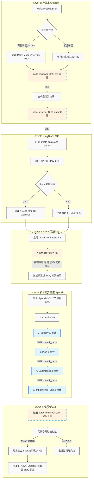

```mermaid
graph TD
    %% 附图 1：系统五层架构流转示意图

    subgraph Layer1 [Layer 1: 产品定义与规划]
        A[输入: Product Brief] --> B{复杂度评估}
        B -- "高复杂度(≥11分)" --> C[启动 Party-Mode 对抗生成 PRD]
        B -- "低复杂度" --> D[单角色直接生成 PRD]
        C --> E[code-reviewer 模式: prd 审计]
        D --> E
        E -- "通过" --> F[生成系统架构设计]
        F --> G[code-reviewer 模式: arch 审计]
    end

    subgraph Layer2 [Layer 2: Epic/Story 规划]
        G -- "通过" --> H[启动 create-epics-and-stories]
        H --> I[输出: 拆分的 Story 列表]
        I --> J{Story 数量评估}
        J -- "≥3个" --> K[创建 Epic 级独立 Git Worktree]
        J -- "<3个" --> L[使用默认主干开发模式]
    end

    subgraph Layer3 [Layer 3: Story 深度辩论]
        K --> M[启动 bmad-story-assistant]
        L --> M
        M --> N[多角色对抗辩论引擎]
        N -->|批判审计员: 连续3轮无新Gap| O[生成锁定版 Story 档案快照]
    end

    subgraph Layer4 [Layer 4: 技术实现 嵌套 Speckit]
        O --> P[进入 Speckit-SDD 5节点状态机]
        P --> Q[1. Constitution]
        Q --> R[2. Specify & 审计]
        R -->|锁定 commit_hash| S[3. Plan & 审计]
        S -->|锁定 commit_hash| T[4. Gaps/Tasks & 审计]
        T -->|锁定 commit_hash| U["5. Implement (TDD) & 审计"]
    end

    subgraph Layer5 [Layer 5: 收尾与验证]
        U --> V[触发 parseAndWriteScore 解析入库]
        V --> W[代码合并验收拦截]
        W -- "发现严重缺陷" --> X[触发独立 Bugfix 解耦工作流]
        X --> Y[修复日志与扣分项同步回写至 Story 状态]
        W -- "验收通过" --> Z[全链路闭环完结]
    end

    classDef default fill:#f9f9f9,stroke:#333,stroke-width:1px;
    classDef locked fill:#e1f5fe,stroke:#3b82f6,stroke-width:2px;
    classDef audit fill:#fff3e0,stroke:#0288d1,stroke-width:1px,stroke-dasharray: 5 5;
    
    class R,S,T,U locked;
    class E,G,N,V audit;
```