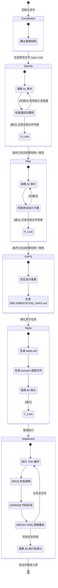

```mermaid
stateDiagram-v2
    %% 附图 2：嵌套式 SDD 状态机控制流图

    [*] --> Constitution : 初始化命令
    
    state Constitution {
        [*] --> 确立框架结构
    }
    
    Constitution --> Specify : 生成规范文件 (spec.md)
    
    state Specify {
        S_Audit: 调用 §1 审计
        S_Check: 检查描述完整性
        
        [*] --> S_Audit
        S_Audit --> S_Check
        S_Check --> S_Audit : [未通过] 发现歧义或遗漏
        S_Check --> S_Lock : [通过] 记录当前文件哈希
    }
    
    Specify --> Plan : [条件] 验证前置哈希一致性
    
    state Plan {
        P_Audit: 调用 §2 审计
        P_Check: 检查测试设计方案
        
        [*] --> P_Audit
        P_Audit --> P_Check
        P_Check --> P_Audit : [未通过]
        P_Check --> P_Lock : [通过] 记录当前文件哈希
    }
    
    Plan --> GAPS : [条件] 验证前置哈希一致性
    
    state GAPS {
        G_Audit: 定位设计差距
        G_Output: 生成 IMPLEMENTATION_GAPS.md
        
        [*] --> G_Audit
        G_Audit --> G_Output
    }
    
    GAPS --> Tasks : 细化原子任务
    
    state Tasks {
        T_Gen_List: 生成 tasks.md
        T_Gen_Track: 生成 prd.json 追踪文件
        T_Audit: 调用 §4 审计
        
        [*] --> T_Gen_List
        T_Gen_List --> T_Gen_Track
        T_Gen_Track --> T_Audit
        T_Audit --> T_Lock : [通过]
    }
    
    Tasks --> Implement : 落地执行
    
    state Implement {
        I_TDD: 执行 TDD 循环
        I_Red: [RED] 失败用例
        I_Green: [GREEN] 代码实现
        I_Refactor: [REFACTOR] 逻辑重构
        I_Final_Audit: 调用 §5 执行后审计
        
        [*] --> I_TDD
        I_TDD --> I_Red
        I_Red --> I_Green
        I_Green --> I_Refactor
        I_Refactor --> I_TDD : 任务未穷尽
        I_Refactor --> I_Final_Audit : 所有任务完成
    }
    
    Implement --> [*] : 验证并触发入库
```