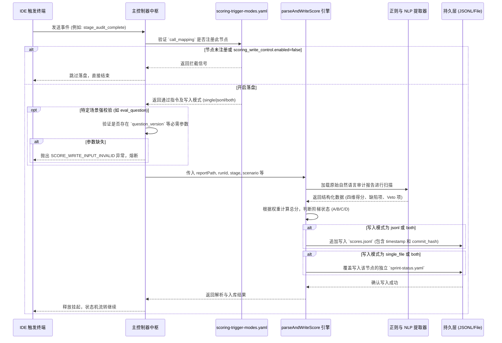

```mermaid
sequenceDiagram
    %% 附图 3：parseAndWriteScore 全链路审计落盘事件驱动时序图

    participant IDE as IDE 触发终端
    participant Ctrl as 主控制器中枢
    participant CFG as scoring-trigger-modes.yaml
    participant Parser as parseAndWriteScore 引擎
    participant NLP as 正则与 NLP 提取器
    participant Disk as 持久层 (JSONL/File)

    IDE->>Ctrl: 发送事件 (例如: stage_audit_complete)
    Ctrl->>CFG: 验证 `call_mapping` 是否注册此节点
    
    alt 节点未注册或 scoring_write_control.enabled=false
        CFG-->>Ctrl: 返回拦截信号
        Ctrl-->>IDE: 跳过落盘，直接结束
    else 开启落盘
        CFG-->>Ctrl: 返回通过指令及写入模式 (single/jsonl/both)
        
        opt 特定场景强校验 (如 eval_question)
            Ctrl->>Ctrl: 验证是否存在 `question_version` 等必需参数
            alt 参数缺失
                Ctrl-->>IDE: 抛出 SCORE_WRITE_INPUT_INVALID 异常，熔断
            end
        end
        
        Ctrl->>Parser: 传入 reportPath, runId, stage, scenario 等
        Parser->>NLP: 加载原始自然语言审计报告进行扫描
        NLP-->>Parser: 返回结构化数据 (四维得分、缺陷项、Veto 项)
        
        Parser->>Parser: 根据权重计算总分，判断阶梯状态 (A/B/C/D)
        
        alt 写入模式为 jsonl 或 both
            Parser->>Disk: 追加写入 `scores.jsonl` (包含 timestamp 和 commit_hash)
        end
        alt 写入模式为 single_file 或 both
            Parser->>Disk: 覆盖写入该节点的独立 `sprint-status.yaml`
        end
        
        Disk-->>Parser: 确认写入成功
        Parser-->>Ctrl: 返回解析与入库结果
        Ctrl-->>IDE: 释放挂起，状态机流转继续
    end
```