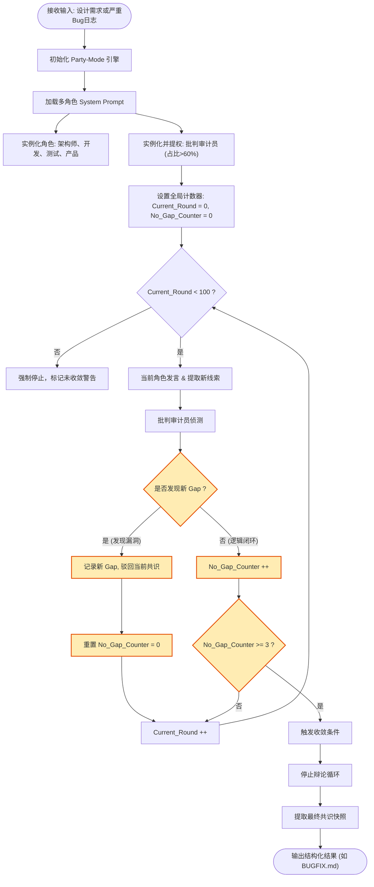

```mermaid
flowchart TD
    %% 附图 4：多角色对抗辩论（Party-Mode）100 轮收敛算法逻辑框图

    A([接收输入: 设计需求或严重Bug日志]) --> B[初始化 Party-Mode 引擎]
    B --> C[加载多角色 System Prompt]
    C --> D[实例化角色: 架构师、开发、测试、产品]
    C --> E["实例化并提权: 批判审计员 (占比>60%)"]
    
    E --> F[设置全局计数器: Current_Round = 0, No_Gap_Counter = 0]
    
    F --> G{Current_Round < 100 ?}
    G -- "否" --> H[强制停止，标记未收敛警告]
    
    G -- "是" --> I["当前角色发言 & 提取新线索"]
    I --> J[批判审计员侦测]
    
    J --> K{是否发现新 Gap ?}
    K -- "是 (发现漏洞)" --> L[记录新 Gap, 驳回当前共识]
    L --> M[重置 No_Gap_Counter = 0]
    M --> N[Current_Round ++]
    N --> G
    
    K -- "否 (逻辑闭环)" --> O[No_Gap_Counter ++]
    O --> P{No_Gap_Counter >= 3 ?}
    P -- "否" --> N
    P -- "是" --> Q[触发收敛条件]
    
    Q --> R[停止辩论循环]
    R --> S[提取最终共识快照]
    S --> T(["输出结构化结果 (如 BUGFIX.md)"])
    
    classDef highlight fill:#ffecb3,stroke:#e65100,stroke-width:2px;
    class K,L,M,O,P highlight;
```