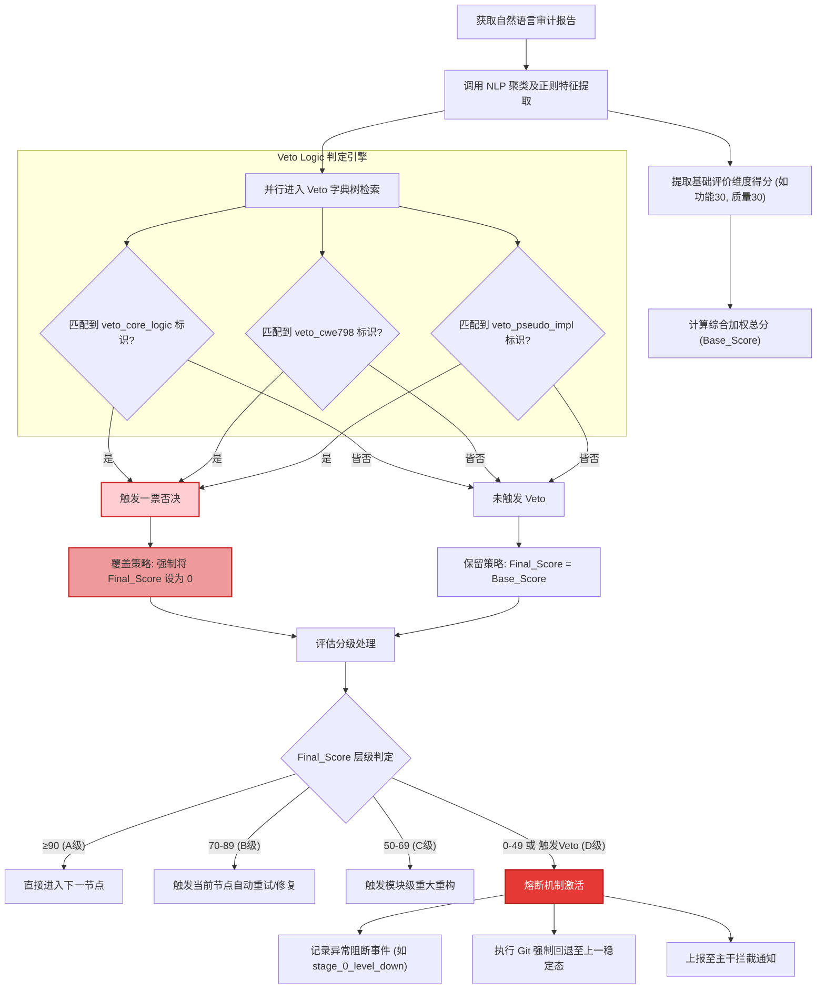

```mermaid
flowchart TD
    %% 附图 5：veto_core_logic 等一票否决项（Veto Logic）拦截与异常熔断处理流程图

    A[获取自然语言审计报告] --> B[调用 NLP 聚类及正则特征提取]
    B --> C["提取基础评价维度得分 (如功能30, 质量30)"]
    C --> D["计算综合加权总分 (Base_Score)"]
    
    B --> E[并行进入 Veto 字典树检索]
    
    subgraph VetoEngine [Veto Logic 判定引擎]
        E --> F1{匹配到 veto_core_logic 标识?}
        E --> F2{匹配到 veto_cwe798 标识?}
        E --> F3{匹配到 veto_pseudo_impl 标识?}
    end
    
    F1 -- "是" --> V[触发一票否决]
    F2 -- "是" --> V
    F3 -- "是" --> V
    
    F1 & F2 & F3 -- "皆否" --> W[未触发 Veto]
    
    V --> X[覆盖策略: 强制将 Final_Score 设为 0]
    W --> Y[保留策略: Final_Score = Base_Score]
    
    X --> Z[评估分级处理]
    Y --> Z
    
    Z --> S{Final_Score 层级判定}
    
    S -- "≥90 (A级)" --> L1[直接进入下一节点]
    S -- "70-89 (B级)" --> L2[触发当前节点自动重试/修复]
    S -- "50-69 (C级)" --> L3[触发模块级重大重构]
    S -- "0-49 或 触发Veto (D级)" --> L4[熔断机制激活]
    
    L4 --> M1["记录异常阻断事件 (如 stage_0_level_down)"]
    L4 --> M2["执行 Git 强制回退至上一稳定态"]
    L4 --> M3[上报至主干拦截通知]
    
    style V fill:#ffcdd2,stroke:#d32f2f,stroke-width:2px
    style X fill:#ef9a9a,stroke:#c62828,stroke-width:2px
    style L4 fill:#e53935,color:#fff,stroke:#b71c1c,stroke-width:2px
```