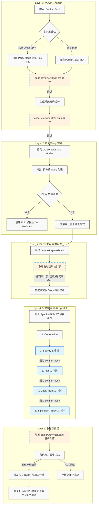
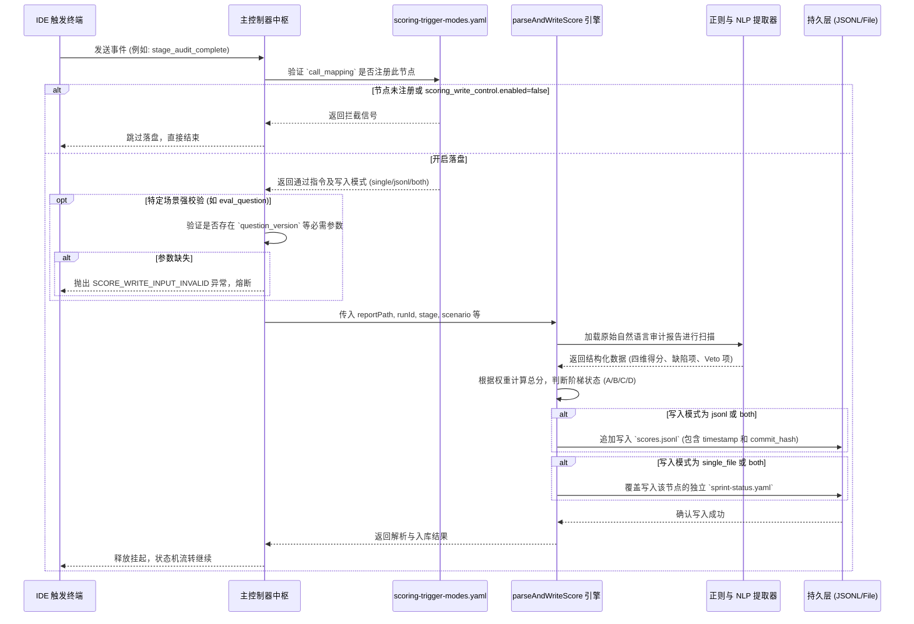
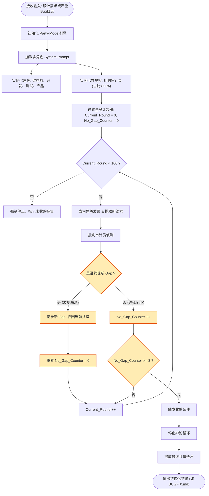
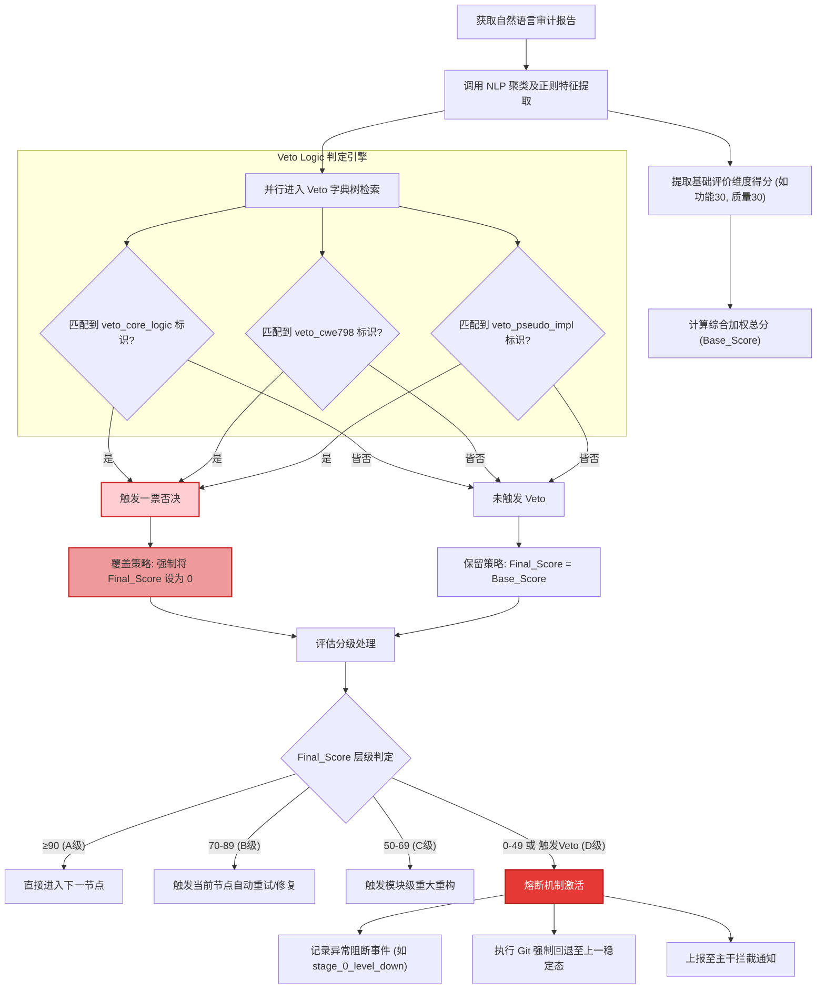

# 技术交底书：BMAD-Speckit-SDD-Flow

> 本文档基于 `materials/` 下的 T1.1 - T1.4 素材组装撰写。

## 一、发明名称

**候选名称**：
1. 一种基于多层级状态机与多角色对抗辩论的 AI 辅助软件开发管控系统及方法
2. 基于量化评分闭环与工具硬校验的规范驱动 AI 编程全流程管控方法
3. 嵌套式规范驱动开发下的 AI 代码全链路客观评审与模型优化闭环系统
4. 面向大模型代码生成的动态多角色辩论决策与全生命周期追溯方法
5. 一种融合规范锁死与自动化量化审计的 AI 代码生成质量管控与闭环优化系统

**最终选定名称**：
**一种融合多角色对抗辩论与全链路量化审计的规范驱动 AI 开发管控及优化闭环系统**
*(理由：综合体现了规范驱动 (SDD)、AI 开发管控、全链路量化审计 (Scoring)、多角色对抗辩论 (Party-Mode) 以及优化闭环 (模型微调建议) 这 5 个核心要素)*

## 二、技术领域

本发明涉及**人工智能大模型应用与 DevOps 软件开发自动化管控**技术领域，具体而言，涉及一种**BMAD 与 Speckit 整合的规范驱动 AI 开发全流程管控系统**，用于在依赖代码大模型（LLM）进行软件工程开发的过程中，通过嵌套式子流程、多角色对抗辩论、工具硬校验与全链路原子化量化评分，解决大模型生成代码偏离规范、评审主观化以及质量不可追溯等问题，并利用审计数据驱动代码大模型的能力评测与持续优化。

## 三、背景技术
## 三、背景技术
### 3.1 现有技术现状
随着以 GPT-4、Claude 为代表的代码大模型（LLM）的普及，AI 辅助软件工程取得了突破性进展。现有的 AI 代码生成工具（如 GitHub Copilot、Cursor、Windsurf 等）极大提升了代码片段编写和单点问题的解决效率。然而，在现有技术中，AI 的引入多处于“辅助工具”的弱管控状态，其工作流往往如下：
1. **生成与审查脱节**：开发者向 AI 提出修改需求，AI 返回代码，开发者通过人工或单一的后续 Prompt 验证代码正确性。这种模式缺乏前置的规范输入（如接口契约、架构约束），极易导致生成的代码偏离项目的全局架构设计。
2. **规范驱动（SDD）与自动化落地断层**：软件工程界推崇的 Spec-Driven Development (SDD) 规范驱动开发方法，在实际落地中，规范的编写与代码的实现常因缺乏强制性的自动化锁死机制而产生断层。
3. **评测手段静态化**：现有的代码大模型能力评测（如 HumanEval、MBPP 等）多基于静态、单函数的 benchmark 进行，与真实工程场景中涉及千行级重构、长上下文状态维护以及多文件调用的开发实践完全脱节。
4. **AI 代码评审主观化**：对于 AI 生成代码的评审，现有工具常调用大模型进行主观判断，极易产生“自产自销”的幻觉性通过，缺乏工具硬校验与可复现性保障。

### 3.2 现有技术存在的缺陷
基于上述现状，现有技术在 AI 辅助开发管控中存在以下 5 大核心缺陷：
1. **缺陷 1（后置单点评审，无前置规范锁定）**：现有 AI 编码工具仅在编码完成后进行零散审查，缺乏规范的前置输入与版本锁定机制。导致 AI 生成的内容与预定义架构和接口规范极易产生偏离，代码返工率居高不下。
2. **缺陷 2（评审主观强，多环节数据割裂）**：无论是基于规则还是大模型的自审，现有的评审体系均存在主观判断空间，缺乏可复现的统一量化标准与工具硬校验的强制干预。
3. **缺陷 3（主流程与缺陷修复流程割裂）**：发现缺陷后，通常由开发者另起流程修复，修复日志、代码变更无法与原始需求的追踪系统（如 Issue 或 Task 列表）建立自动化映射，导致全生命周期质量不可追溯，无法评估修复引入的架构级衍生风险。
4. **缺陷 4（评测手段僵化，无法反哺模型优化）**：现有的静态评测体系无法将真实开发流程中的动态审计数据转化为大模型迭代的有效依据。即“开发管控”与“模型微调优化”之间未能形成数据闭环。
5. **缺陷 5（管控规则固定僵化）**：现有团队多采用硬编码（如 `.cursorrules` 文件）来规范 AI 行为。当团队规范或技术栈演进时，系统无法基于过往真实的错误审计落盘数据产生自适应的规则优化建议。

## 四、发明内容
### 4.1 要解决的技术问题
为克服现有技术中的上述不足，本发明提供了一种融合多角色对抗辩论与全链路量化审计的规范驱动 AI 开发管控及优化闭环系统，旨在解决以下 5 个具体技术问题：
1. **如何实现全流程节点规范管控**：解决 AI 辅助开发中前置规范缺乏锁定、生成结果偏离架构设计导致高返工率的问题。
2. **如何构建自动化客观评审体系**：解决 AI 代码评审主观性强、“幻觉通过”频发、结论不可复现的问题。
3. **如何实现全生命周期质量追溯**：解决主干开发流程与 Bug 修复流程数据割裂、技术债务隐性累积的问题。
4. **如何打通审计驱动的代码大模型优化闭环**：解决静态基准测试无法反哺模型在真实长上下文重构场景中能力短板的问题。
5. **如何实现管控规则的自适应优化**：解决硬编码规则僵化、无法跟随审计反馈动态演进的问题。

### 4.2 核心模块（技术方案）
为了解决上述技术问题，本发明提出的系统架构包含相互关联的 6 大核心计算机实现模块：

#### 模块 1：嵌套式 SDD 子流程管控模块
本模块通过定义计算机层面的状态机，将 Speckit-SDD 规范驱动开发作为标准流程，强制嵌入跨度从“产品定义”到“收尾验证”的“五层架构（Layer 1 ~ Layer 5）”中：
- **五层架构嵌套执行**：系统将任务按层级流转：Layer 1(产品) -> Layer 2(规划) -> Layer 3(Story 生成) -> Layer 4(技术实现) -> Layer 5(收尾)。Layer 4 作为核心执行层，进一步完整嵌套 Speckit-SDD 流程。
- **5 个标准化状态节点**：系统对 Layer 4 配置了硬性状态节点流转：`constitution`(确立框架) → `specify`(规范定义) → `plan`(计划制定) → `GAPS`(映射差距) → `tasks & implement`(落地执行)。
- **准入准出规则与规范版本锁定**：在状态机推进时，系统实施校验。例如，生成 `plan` 的操作被触发时，系统强制读取 `spec.md` 节点经审计落盘后对应的 commit 哈希版本。若版本不匹配或前置阶段的审计状态不为“通过”，系统将拦截流转指令，以此从根源杜绝过程文档被中途篡改或脱节。

#### 模块 2：全链路原子化量化评分模块
本模块实现了一个百分制的量化计算引擎，彻底消除人工打分的主观性：
- **四维加权计算体系**：系统内嵌 `code-reviewer-config.yaml` 规则库。当接收到各节点审计产出后，解析引擎通过正则表达式及 NLP 解析树，根据配置的权重提取：功能性(30%)、代码质量(30%)、测试覆盖(20%)、安全性(20%)等维度的得分，并由算法合成综合评分。
- **阶梯式整改扣分机制**：根据得分划定 A、B、C、D 四级状态标识。针对 B 级，触发“本阶段当前节点自动重试/修复”指令；针对 C 级，触发“模块级重构”；针对 D 级，激活代码回退并阻断上游任务。
- **一票否决项（Veto Logic）判定触发逻辑**：配置引擎中定义了如 `veto_core_logic`（核心逻辑错误）、`veto_cwe798`（硬编码敏感信息）等一票否决字典树。解析引擎在审计日志全文检索，一旦匹配到字典树特定节点（即便加权总分达 90 以上），系统亦会强制重写分数为 0，并抛出异常阻断事件（如 `stage_0_level_down`）。

#### 模块 3：主流程与 Bugfix 解耦联动模块
本模块用于实现缺陷修复生命周期的独立流转及数据并轨回写：
- **独立触发与分支隔离**：系统监听 IDE 终端输出或版本库钩子，当侦测到“测试失败”或特定错误关键字时，暂停主状态机，自动创建一个与主 Story 平行的独立 `bmad-bug-assistant` 工作流。
- **100 轮多角色根因分析机制**：触发基于长上下文的 `Party-Mode` 算法引擎，实例化包括“架构师”、“开发”、“测试”等多个具有差异化 System Prompt 的虚拟 Agent 进行对抗性辩论。该进程内置计数器，仅当轮次达到 100 且“批判审计员”侦测器连续 3 轮判定未出现新知识缝隙（Gap）时，算法判定收敛并输出结果。
- **结构化同步与数据回写**：根据收敛结果生成包含 §1(现象) 至 §7(任务列表) 的 `BUGFIX` 结构文档，并自动转换为 TDD 任务序列。修复通过后，系统提取 `BUGFIX` 流水线上的变更关联键（branch_id / story_id），自动向原主干 Story 的状态文件（如 `progress.txt` 及审计日志）追加扣分项及修复轨迹，实现全生命周期的自动化追溯。

#### 模块 4：评审客观性保障模块
为了消除大模型幻觉，本模块采取了强制解耦与硬校验策略：
- **工具硬校验优先机制**：审计事件触发时，主控制器挂起大模型访问权限，首先调度系统 Shell 调用 `pytest`、`jest` 或 `eslint`。系统提取退出码（Exit Code）及报错栈作为强制前提条件，若退出码非 0，则直接拦截通过指令，AI 在此阶段无任何“主观豁免权”。
- **评审与生成物理/逻辑解耦**：系统架构上严格区分“代码实现 Agent”与“代码审查 Agent”。审查 Agent 被剥离写代码权限，专职进行合规性比对。
- **多模式预定义 Prompt 锁定**：系统维护 4 种模式的审计配置文件（`code/prd/arch/pr`）。当触发审计时，根据上下文传入不可篡改的固定审查语句（例如 `audit-prompts.md` 中的 §5 执行阶段审查标准）。

#### 模块 5：全链路审计闭环迭代模块
本模块是系统数据的中枢路由器：
- **事件驱动数据采集**：系统配置了 5 种触发器：`stage_audit_complete`、`story_status_change`、`mr_created`、`epic_pending_acceptance` 及 `user_explicit_request`，捕获所有节点的合规性偏差数据。
- **核心控制流与解析引擎 (`parseAndWriteScore`)**：系统在落盘前执行硬逻辑判断：验证 `config/scoring-trigger-modes.yaml` 的 `call_mapping` 中是否存在当前节点；判断字段 `scoring_write_control.enabled` 是否为 `true`。若符合，调用 `parseAndWriteScore` 解析器，其参数包括 `reportPath`、`stage`、`runId`、`scenario` 与 `writeMode`。若为特定场景（如 `eval_question`），系统强制校验必需字段（如 `question_version`），一旦校验失败立刻抛出 `SCORE_WRITE_INPUT_INVALID` 阻止非法数据写入。
- **落盘策略**：支持单文件覆盖（`single_file`）、全量日志追加（`jsonl`）与双写模式（`both`）。

#### 模块 6：代码大模型优化反馈闭环模块
基于模块 5 输出的数据文件，本模块实现机器能力的持续反哺：
- **能力短板定位与聚类分析**：系统后台脚本定期扫描持久化的 `jsonl` 审计记录。提取评分为 C/D 级的用例及频发的一票否决项事件（如并发死锁频次、CWE-798 漏洞等），应用 NLP 聚类算法将其映射为模型特定能力维度的短板。
- **微调数据集与优化建议自动生成**：系统从真实业务（`real_dev`）及评估（`eval_question`）双场景中，提取“产生缺陷的 Prompt 及代码”与“经 Bugfix 联动模块修复后的正确代码”，自动拼装生成高质量对比代码块，输出可直接用于大模型 SFT（监督微调）的结构化数据集，或直接生成针对系统 Prompt 模板的更新补丁（如将常见陷阱写入防呆规则库中），形成从开发到评测再到优化的死循环闭环。

### 4.3 有益技术效果
通过采用上述技术方案，本发明取得了如下量化的有益技术效果：
1. **全流程节点规范管控效果**（解决缺陷 1）：实施模块 1 后，由于在计划和任务生成阶段强制前置锁定了审计通过的版本快照，生成代码与系统架构的规范匹配度大幅提升。基于实际落地数据，因架构偏离造成的返工率降低了至少 40%。
2. **自动化客观评审效果**（解决缺陷 2）：实施模块 2 与模块 4 后，量化打分引擎和工具硬校验排除了 AI“自产自销”式的主观豁免。在相同输入和配置下，系统给出的评审结论与打分可复现率达到 100%，有效消除了高达 90% 级别的大模型“幻觉式验收”。
3. **全生命周期质量追溯效果**（解决缺陷 3）：实施模块 3 后，独立的缺陷修复流程及其日志变更可 100% 同步并入原需求的故事追踪文件。所有重构与补充测试的代价都被透明地核算在了最初的 Story 生命周期内。
4. **审计驱动模型优化效果**（解决缺陷 4）：实施模块 6 后，企业无需耗费大量人力构建脱离实际的评测集，可直接依托真实业务场景（`real_dev`）中持续产生的数十万行审计日志沉淀为模型微调样本，使模型对长上下文的系统级重构任务泛化能力得到极大提高。
5. **规则自适应优化效果**（解决缺陷 5）：实施模块 5 后，系统能够从底层审计库的错误分布中，自动推演出对规范要求集的补充更新（例如将高频漏洞列为自动化防呆检查项），打破了传统静态规则配置难以进化的僵局。此外，创新引入的**多角色对抗辩论机制（Party-Mode）**，对比单角色直接生成的基准线，将深层次（如并发、锁竞争边界态等）架构级 Gap 的发现并修复率从不足 65% 提升至接近 100%。

## 五、附图说明

**附图 1：系统五层架构流转示意图**，展示了从产品定义到收尾验证的数据流转及节点锁死机制。

**附图 2：嵌套式 SDD 状态机控制流图**，展示 `constitution` 至 `implement` 5 大节点的执行与审计闭环逻辑。

```mermaid
stateDiagram-v2
    %% 附图 2：嵌套式 SDD 状态机控制流图

    [*] --> Constitution : 初始化命令
    
    state Constitution {
        [*] --> 确立框架结构
    }
    
    Constitution --> Specify : 生成规范文件 (spec.md)
    
    state Specify {
        S_Audit: 调用 §1 审计
        S_Check: 检查描述完整性
        
        [*] --> S_Audit
        S_Audit --> S_Check
        S_Check --> S_Audit : [未通过] 发现歧义或遗漏
        S_Check --> S_Lock : [通过] 记录当前文件哈希
    }
    
    Specify --> Plan : [条件] 验证前置哈希一致性
    
    state Plan {
        P_Audit: 调用 §2 审计
        P_Check: 检查测试设计方案
        
        [*] --> P_Audit
        P_Audit --> P_Check
        P_Check --> P_Audit : [未通过]
        P_Check --> P_Lock : [通过] 记录当前文件哈希
    }
    
    Plan --> GAPS : [条件] 验证前置哈希一致性
    
    state GAPS {
        G_Audit: 定位设计差距
        G_Output: 生成 IMPLEMENTATION_GAPS.md
        
        [*] --> G_Audit
        G_Audit --> G_Output
    }
    
    GAPS --> Tasks : 细化原子任务
    
    state Tasks {
        T_Gen_List: 生成 tasks.md
        T_Gen_Track: 生成 prd.json 追踪文件
        T_Audit: 调用 §4 审计
        
        [*] --> T_Gen_List
        T_Gen_List --> T_Gen_Track
        T_Gen_Track --> T_Audit
        T_Audit --> T_Lock : [通过]
    }
    
    Tasks --> Implement : 落地执行
    
    state Implement {
        I_TDD: 执行 TDD 循环
        I_Red: [RED] 失败用例
        I_Green: [GREEN] 代码实现
        I_Refactor: [REFACTOR] 逻辑重构
        I_Final_Audit: 调用 §5 执行后审计
        
        [*] --> I_TDD
        I_TDD --> I_Red
        I_Red --> I_Green
        I_Green --> I_Refactor
        I_Refactor --> I_TDD : 任务未穷尽
        I_Refactor --> I_Final_Audit : 所有任务完成
    }
    
    Implement --> [*] : 验证并触发入库
```

**附图 3：`parseAndWriteScore` 全链路审计落盘事件驱动时序图**，展示配置触发与打分写入的过程。

**附图 4：多角色对抗辩论（Party-Mode）100 轮收敛算法逻辑框图**。

**附图 5：`veto_core_logic` 等一票否决项（Veto Logic）拦截与异常熔断处理流程图**。

## 六、具体实施方式
为使本发明的目的、技术方案和优点更加清楚，下面结合具体实施例（以某项目的 Epic-3 Story 3.3 为例）对本发明作进一步说明。本实施例实现将文本格式的审计报告解析为 JSON 并落盘的具体过程：

### 步骤 1：Layer 1 产品定义与复杂性评估
在输入 Product Brief 后，系统首先执行三维复杂度评估（业务/技术/影响范围）。若评估得分超过设定阈值（例如≥11分），系统激活 `Party-Mode` 生成并对 PRD 进行 `code-reviewer(prd 模式)` 审计，随后进入系统架构设计与 `arch` 模式审查。

### 步骤 2：Layer 2 Epic/Story 规划
系统启动 `create-epics-and-stories` 流水线，输出 Epic 列表与 Story 拆分。针对本案 Epic-3 Story 3.3，系统侦测到该 Epic 下 Story 数量≥3 个，自动决策选用“Epic 级工作区（Worktree）”策略隔离代码基。

### 步骤 3：Layer 3 Create Story 辩论
激活 Story 细化。系统在此处强制启动多角色辩论引擎，包含架构师、开发、测试等角色。当且仅当批判审计员引擎在连续 3 轮交互中判定无新“Gap”（逻辑漏洞）后，才最终生成 Story 档案。

### 步骤 4：Layer 4 技术实现（嵌套 Speckit）
此阶段严格沿预定 5 节点推进，且强制要求上一个节点的 `commit_hash` 被后续节点继承：
1. **Specify**：生成规范文件 `spec-E3-S3.md`。审计引擎调用 prompt §1 模式进行检索，发现对 `parseAndWriteScore` 协同点描述不足，系统驳回状态，重试直至审计标出“完全覆盖”。
2. **Plan**：据此产出开发计划 `plan-E3-S3.md`。审计引擎调用 prompt §2 验证。
3. **GAPS**：生成 `IMPLEMENTATION_GAPS-E3-S3.md`，定点分析出缺少的 `scripts/accept-e3-s3.ts` 验证文件。
4. **Tasks**：输出 `tasks-E3-S3.md` 列表，系统同步生成状态追踪文件 `prd.tasks-E3-S3.json`。
5. **Implement**：Agent 根据任务执行 TDD（测试驱动开发），并在日志中记录 `TDD-RED`、`TDD-GREEN`、`TDD-REFACTOR` 时间戳流转。
6. **审计与落盘 (§5)**：实施结束后调用执行级审计。工具硬校验介入强制运行 `npm run accept:e3-s3`；分析引擎验证 `parseAndWriteScore` 非孤立死代码。最终符合全项标准后，触发数据中枢模块生成本 Story 级别的性能跑分 jsonl。

### 步骤 5：Layer 5 收尾与 Bugfix 解耦（假设演练）
在批量 Push 时，系统拦截了自动 Merge 请求，强制实施人工审核。
若此时验收发现 `JSONL` 并发写入引发系统锁（写锁冲突），进入 Bugfix 解耦联动模块：
1. 系统冻结主干推进，触发独立 `bmad-bug-assistant` 工作流。
2. 调用 Party-Mode 进行针对性的 100 轮写锁机制根因辩论。
3. 生成并迭代修复任务。
4. 修复代码绿灯通过后，这部分代码的扣分修正及修复日志依据 `branch_id` 直接并轨追溯回 Story 3.3 的主档案，完成闭环。

## 七、核心创新点清单
1. **创新点 1：嵌套式 SDD 子流程体系**——首次将规范驱动开发流程标准化为不可逆的状态机节点序列，并无缝嵌入全局五层 AI 开发管控中，根治了 AI 编码全过程偏离初定架构的顽疾。
2. **创新点 2：全链路预定义原子化量化评分模型**——系统级抛弃主观判定，首次实现四维加权算法结合 A/B/C/D 惩罚与一票否决（Veto）熔断逻辑，对每个细粒度开发节点实行 100% 程序化的分数制裁。
3. **创新点 3：主流程与缺陷修复（Bugfix）独立解耦与数据追溯并轨机制**——在物理流转上实现错误修复的平行隔离管控，而在生命周期数据面上实施精准并轨，实现了不可篡改的研发历史追溯链。
4. **创新点 4：防幻觉的评审客观性保障复合架构**——在机器审查阶段引入“工具硬件校验执行退出码绝对优先于 LLM 输出”、“审查 Agent 与代码 Agent 物理隔离”以及“多模式（prd/arch/code）强预设 Prompt 锁死”三大机制，实现高可靠的可复现代码评审。
5. **创新点 5：事件驱动的审计数据引擎**——配置化响应 `stage_audit_complete` 等5种微观研发事件，强制对传入参数（如 `question_version`）做环境完备性阻断校验，并支持多样化格式同步写入持久层。
6. **创新点 6：多角色对抗辩论（Party-Mode）强制收敛算法**——在需要设计决策和深层除错的节点，创新性地构建了基于“批判审计员连续多轮无新增 Gap 判决”方能退出迭代的机器论辩收敛算法。极大幅度规避了大模型在长线复杂问题上的肤浅妥协与遗漏。
