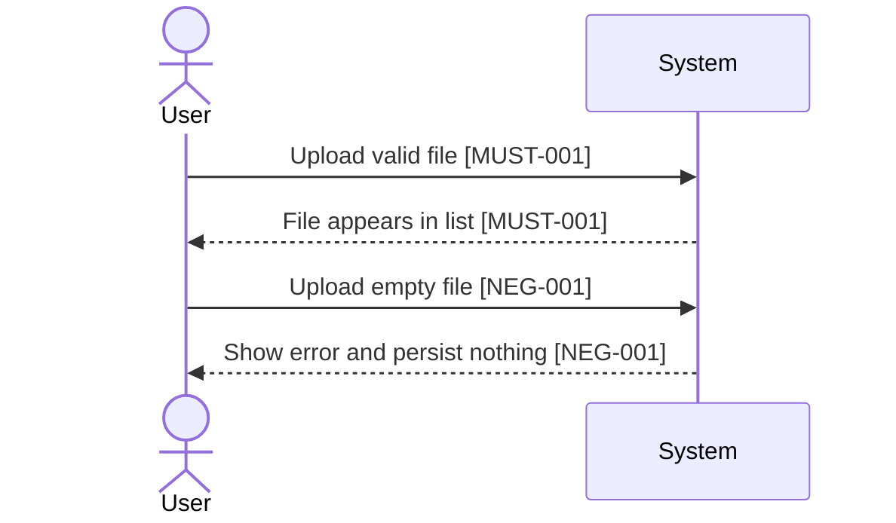

# Requirements Contract Authoring

## Purpose

Use this skill to create or update an implementation source document:

```text
implementation source document = human-readable context + machine-readable implementationConfirmation block
```

The source document itself is authoritative. Do not create a separate authoritative requirements contract, sidecar confirmation file, amendment file, or conversation-only implementation prompt.

If older project material says "requirements contract", treat it as a legacy alias for the inline `implementationConfirmation` block inside the implementation source document.

## Required Mindset

- Prevent MVP, toy demo, stub, mock-only, smoke-only, and happy-path-only specs.
- Do not let AI freely extract, rewrite, merge, shrink, summarize, or reinterpret requirements from prose.
- Keep requirement semantics in one place: `implementationConfirmation`.
- Use diagrams, steps, matrices, and trace rows only as views over `implementationConfirmation` IDs.
- Do not set `status: user_confirmed`; only explicit user confirmation may do that.
- Require `contractAuthoringRequired: true` for every `entryFlow`; bugfix and standalone task flows may bypass the full BMAD chain, but never user confirmation or traceRows.
- Bind every implementation task to existing `MUST` / `NEG` / `OUT` / `EVD` / `TRACE` IDs before implementation readiness.
- Before asking for confirmation, require the user to choose the confirmation language unless the user already explicitly selected it for this source document.
- Do not infer confirmation language from the conversation language, repository language, or document language.
- Render the confirmation page as mandatory HTML in the selected language; there is no Markdown/chat fallback.
- Treat HTML render failure, missing renderer, missing render report, or hash mismatch as a confirmation gate failure.
- Require the user to confirm in chat with the exact confirmation phrase plus current hashes from the HTML render report.
- Keep renderer output read-only for confirmation: it may show scope and hashes, but it must not mutate requirements or mark confirmation.
- Author the schema in this order: core fields first, `applicability.*` declarations second, then expand only the conditional domains marked `applies: true`.
- Treat `failurePaths[]` and `edgeCases[]` as core mandatory fields for every source document; they are not optional advanced runtime sections.
- Keep ordinary business/functional failure paths separate from the conditional `functionalResumeFailureCaseRegistry`.
- Use `contractValidationCommandRefs[]` and `deliveryEvidenceCommandRefs[]` in `traceRows[]`; do not use legacy `commandRefs[]` as the sole command authority.
- When governance events apply, require `governanceEventTypeRegistry[]` and a `payloadContract` for every event type.
- When runtime recovery applies or requires functional resume coverage, require source-defined `functionalResumeFailureCaseRegistry` groups, actions, failure cases, expected recovery actions, and record event types.
- Score, dashboard, SFT, report, summary, and hook receipt outputs are read models or evidence only; they do not close requirements unless a controlled gate writes `decision`.

## Authoritative Block

Every implementation source document must contain this inline block:

```yaml
implementationConfirmation:
  contractSchemaVersion: 1
  status: draft | user_confirmed | reconfirm_required
  recordId: REQ-...
  requirementSetId: REQ-...
  entryFlow: story | bugfix | standalone_tasks
  entryFlowClass: full_story_entry | corrective_entry | task_packet_entry
  workflowAdapter: bmad | speckit | direct | legacy
  contractAuthoringRequired: true
  confirmationLanguage: zh-CN | en-US | bilingual
  confirmationProfile: implementation_confirmation
  requiredViewPacks: []
  optionalViewPacks: []
  confirmedAt: null
  confirmedBy: null
  sourceDocumentHash: null
  confirmationRender:
    htmlPath: null
    summaryPath: null
    reportPath: null
    htmlHash: null
    confirmationPhrase: null
  applicability:
    governanceEvents:
      applies: false
      reasonCode: no_governance_event_or_control_envelope_changes
    runtimeRecovery:
      applies: false
      reasonCode: no_resume_rerun_closeout_hook_ingest_or_trace_checkpoint_changes
      requiresFunctionalResumeFailureCaseRegistry: false
    scoringDashboardSft:
      applies: false
      reasonCode: no_scoring_dashboard_sft_dataset_or_read_model_changes
    currentTargetMap:
      applies: false
      reasonCode: no_current_target_migration_or_governance_comparison_needed
    scriptsAndHooks:
      applies: false
      reasonCode: no_script_hook_report_or_generated_artifact_changes
  must:
    - id: MUST-001
      text: "..."
      evidenceRefs: ["EVD-001"]
      coveredByTraceRows: ["TRACE-001"]
      coveredBySequenceViews: ["SEQ-001"]
  notDone:
    - id: NEG-001
      text: "..."
      evidenceRefs: ["EVD-002"]
      whyItBlocksCompletion: "..."
      negativeAssertionRequired: true
      coveredByFailurePath: ["FAIL-001"]
  mustNot:
    - id: OUT-001
      text: "..."
      scopeBoundary: "..."
      userApprovalRequiredIfChanged: true
  evidence:
    - id: EVD-001
      text: "..."
      gate: "..."
      oracle: "..."
      requiredCommandRefs: ["CMD-DELIVERY-001"]
      artifactRefs: ["ART-EVD-001"]
  openQuestions:
    - id: Q-001
      text: "..."
      blocksImplementation: true
  failurePaths:
    - id: FAIL-001
      title: "..."
      trigger: "..."
      expectedBehavior: "..."
      forbiddenBehavior: "..."
      blocksCompletionWhenViolated: true
      linkedNegIds: ["NEG-001"]
      linkedEvidenceIds: ["EVD-002"]
      requiredAssertions: ["..."]
  edgeCases:
    - id: EDGE-001
      category: invalid_input
      condition: "..."
      expectedBehavior: "..."
      forbiddenBehavior: "..."
      linkedFailurePathIds: ["FAIL-001"]
      linkedEvidenceIds: ["EVD-002"]
  traceRows:
    - id: TRACE-001
      covers: ["MUST-001", "NEG-001"]
      taskRefs: []
      evidenceRefs: ["EVD-001", "EVD-002"]
      contractValidationCommandRefs: ["CMD-CONTRACT-001"]
      deliveryEvidenceCommandRefs: ["CMD-DELIVERY-001"]
      sequenceViewRefs: []
      artifactRefs: []
      status: PENDING
  sequenceViews: []
  flowViews: []
  edgeCaseViews: []
  boundaryViews: []
  artifactAutomationPlan: []
  requiredCommands: []
  suggestedCommands: []
  closeoutReadinessPreview:
    requiredCommands: []
    orphanPolicy: "..."
    currentAttemptPolicy: "..."
```

Allowed status transitions:

```text
draft -> user_confirmed
user_confirmed -> reconfirm_required
reconfirm_required -> user_confirmed
```

If any ID text changes, any ID is deleted, IDs are merged/split, or scope/proof semantics change, reset `status` to `draft` or `reconfirm_required`.

## Workflow

### 1. Identify The Source

Use one of two inputs:

- Existing PRD / BUGFIX / TASKS source document path.
- Current session requirement description with no source document.

When there is no source document, create a source document draft first:

- PRD-like source for feature/product requirements.
- BUGFIX-like source for bugs.
- TASKS-like source for standalone work.

Conversation requirements must not go directly to implementation or prompt generation.

### 2. Create Or Update `implementationConfirmation`

Work only inside the implementation source document.

Authoring order is mandatory:

1. Write core fields: status, entryFlow, IDs, `must`, `notDone`, `mustNot`, `evidence`, `failurePaths`, `edgeCases`, `traceRows`, views, artifact plan, commands, and closeout preview.
2. Declare every `applicability.*` domain with `applies` and `reasonCode`.
3. Expand only the conditional domains whose `applies` value is `true`.

Never omit an applicability domain to imply it is irrelevant. Use `applies: false` plus a concrete `reasonCode`.

Conditional expansion rules:

- `governanceEvents.applies=true`: define or reference `governanceEventTypeRegistry[]`; every event type needs `payloadContract`.
- `runtimeRecovery.applies=true` or `requiresFunctionalResumeFailureCaseRegistry=true`: define `functionalResumeFailureCaseRegistry` with source-defined groups, failure cases, recovery actions, expected recovery actions, and record event types.
- `scoringDashboardSft.applies=true`: define score/dashboard/SFT read-model boundaries and state why they cannot reverse-drive closeout.
- `currentTargetMap.applies=true`: define source-driven current/target rows; do not rely on renderer hardcoded rows.
- `scriptsAndHooks.applies=true`: define visible script/hook/artifact outputs, ownerModel, input/output artifacts, event types, fallback, and control/evidence role.

For an existing source document:

- Read the whole source document.
- Create or update the inline `implementationConfirmation` block in the same document.
- Leave `status: draft` unless the user explicitly confirms the final confirmation page.
- If a previously confirmed block changes semantically, set `status: reconfirm_required`.

For session-only input:

- Create a new implementation source document draft.
- Add the inline `implementationConfirmation` block with `status: draft`.
- Do not create a separate requirements contract.
- Do not set `status: user_confirmed` until explicit user confirmation.

### 3. Add Human-Readable Views

Human-readable views are mandatory confirmation surfaces. They must include:

- Happy-path sequence view.
- Failure/negative-path sequence view.
- State or flow view.
- Edge case view.
- Evidence overview.
- E2E acceptance overview.
- Artifact and automation plan view.
- Current-vs-target comparison when the source concerns workflow, governance, scripts, hooks, reports, dashboard, scoring, or SFT behavior.

Every requirement-bearing diagram message, business step, state transition, failure path, or evidence statement must reference one or more IDs from `implementationConfirmation`.

Example:



If a diagram or prose introduces behavior without a confirmation ID, either add it to `implementationConfirmation` as `draft` and ask for confirmation, or mark it as a blocking question. Do not silently implement it.

Diagrams are views only. They must not introduce requirement semantics that are absent from `implementationConfirmation`. Every diagram node, edge, branch, business transition, artifact write, script call, hook observation, and failure path must map to `MUST`, `NEG`, `OUT`, or `EVD` IDs.

The Artifact and Automation Plan View must make planned outputs visible before implementation. Include each planned artifact, script, hook, report, dashboard, score, SFT output, producer, consumer, path, `ownerModel`, `sourceOfTruthRole`, `inputArtifacts`, `outputArtifacts`, `recordEventTypes`, whether it may affect control flow, retention/cleanup rule, and orphan risk. Old script outputs may be evidence/context/projection/compatibility/schema/derived artifacts only; they must not directly control main-agent state.

### 4. Build `traceRows`

`traceRows` are execution mapping rows, not another requirements expression.

Rules:

- Preserve the source document's confirmation IDs.
- Reference `must`, `notDone`, and `evidence` IDs.
- Do not restate new requirement semantics in trace rows.
- Do not invent requirements to make trace rows look complete.
- Keep rows `PENDING` until implementation evidence exists.
- Split commands into `contractValidationCommandRefs[]` and `deliveryEvidenceCommandRefs[]`.
- `contractValidationCommandRefs[]` prove that the contract, views, trace rows, and renderer output are valid.
- `deliveryEvidenceCommandRefs[]` prove the implemented behavior in the current closeout attempt.
- Legacy `commandRefs[]` may be read for compatibility by older reports, but it must not be the only command field in newly authored source documents.

### 5. Select Confirmation Language

Before rendering the HTML confirmation page, ask the user to choose the confirmation language unless the user already explicitly selected it for this source document.

Use a short choice prompt:

```text
请选择确认页语言：
1. 中文
2. English
3. 中英双语
```

Rules:

- Do not proceed to confirmation page display until the user chooses a language or explicitly states an equivalent choice.
- Do not treat the user's normal conversation language as an implicit language selection.
- Preserve the selected language for this source document's confirmation flow.
- If the implementation source document is later changed semantically and confirmation must be regenerated, reuse the previously selected language unless the user asks to change it.

### 6. Render The HTML Confirmation Page

Before readiness or prompt generation, render a low-burden HTML confirmation page. Use the skill-local renderer:

```bash
node _bmad/skills/requirements-contract-authoring/scripts/render-requirements-confirmation-html.ts \
  --source <source-document.md> \
  --out _bmad-output/runtime/requirements/<recordId>/confirmation/confirmation.html \
  --language zh-CN \
  --record-id <recordId> \
  --entry-flow <story|bugfix|standalone_tasks> \
  --mode confirmation
```

The renderer is part of this skill. Do not create or call a root-level `scripts/render-requirements-confirmation-html.ts` wrapper.

If the consuming project does not yet contain the skill-local renderer, do not fall back to chat confirmation. Instead, mark readiness as blocked by `confirmation_html_renderer_missing` and ask to install, sync, or provide the skill renderer.

If the renderer reports missing core fields, missing `applicability`, missing `failurePaths[]`, missing `edgeCases[]`, invalid `payloadContract`, missing conditional runtime recovery registry, invalid trace command split, missing Mermaid runtime, or any blocking issue, stop before readiness. Do not proceed to implementation prompt generation.

Required outputs:

- `confirmation.html`
- `confirmation-summary.json`
- `confirmation-render-report.json`

The renderer must follow [html-confirmation-renderer-spec.md](references/html-confirmation-renderer-spec.md). It is a read-only renderer and must not modify the source document, set `status: user_confirmed`, write gate decisions, or create control events.

The HTML must answer:

- What am I confirming?
- What is explicitly not done or cannot count as done?
- Is business logic complete, including failure paths?
- How will each requirement be verified?
- What files, scripts, hooks, reports, dashboards, score outputs, and SFT outputs will AI generate or touch?
- Which artifacts affect control flow and which are evidence/read-model only?
- What is the gap between current and target state?
- After confirmation, what may the agent do and what is forbidden?

### 7. Confirm In Chat With Hashes

Do not treat silence, opening the HTML, lack of objection, or clicking inside HTML as confirmation.

The user must reply in chat with the exact phrase shown in the render report plus the current source and HTML hashes, for example:

```text
确认以上范围进入实施准备 sourceDocumentHash=<sha256> confirmationHtmlHash=<sha256>
```

Rules:

- The confirmation phrase and hashes must match `confirmation-render-report.json`.
- The HTML must be generated from the current source document hash.
- If source content, confirmation IDs, traceRows, diagrams, artifact plan, or evidence expectations change, regenerate HTML and require confirmation again.
- Only after exact chat confirmation may the source document be updated to `status: user_confirmed`.
- When English or bilingual output is selected, the renderer may display an English phrase, but the Chinese phrase above remains accepted if hashes match.

### 8. Handle Gaps

If the user finds a gap:

1. Stop progression.
2. Update the source document and inline `implementationConfirmation`.
3. Regenerate the human-readable views and HTML confirmation page.
4. Require explicit confirmation again.
5. Point to the regenerated HTML path and render report hashes.

Do not patch only the diagram, only the trace row, or only the task list.

### 9. Reverse Audit

Before the source document can be used for readiness or implementation prompt generation, audit it:

- `implementationConfirmation` exists.
- `status: user_confirmed` before implementation readiness.
- No open question with `blocksImplementation: true` remains.
- All diagrams and business steps reference confirmation IDs.
- Every trace row references existing confirmation IDs.
- Trace rows do not introduce new requirement semantics.
- Mandatory HTML confirmation outputs exist and match the current source hash.
- `confirmationRender` fields point to the current HTML, summary, and report.
- Sequence, flow, edge-case, and artifact automation plan views exist and are ID-bound.
- Failure paths, state transitions, invariants, idempotency, recovery, permissions, configuration, and evidence are covered.
- Smoke tests are not counted as acceptance evidence.

When a local file is produced, run:

```bash
node <skill-dir>/scripts/reverse_audit_contract.js <source-document.md>
```

Use the script output as evidence. If it reports `FAIL`, revise the source document before using it for implementation.

## Output Structure

Use [contract-template.md](references/contract-template.md) as the source-document confirmation template.

Use [html-confirmation-renderer-spec.md](references/html-confirmation-renderer-spec.md) when implementing or invoking `_bmad/skills/requirements-contract-authoring/scripts/render-requirements-confirmation-html.ts`.

Use [matrix-rules.md](references/matrix-rules.md) when validating diagrams, traceRows, and evidence coverage.

Use [e2e-dod.md](references/e2e-dod.md) when designing acceptance E2E and Definition of Done.

Use [reverse-audit-gate.md](references/reverse-audit-gate.md) when writing or evaluating the reverse audit report.

## Scope Change

If a requested update would reduce, replace, or reinterpret confirmed scope, output this and stop:

```text
Scope Change Request
Original confirmed IDs:
Proposed change:
Reason:
Impact on users:
Impact on implementationConfirmation:
Alternative:
Required user decision:
```

Do not silently reduce scope to MVP.
