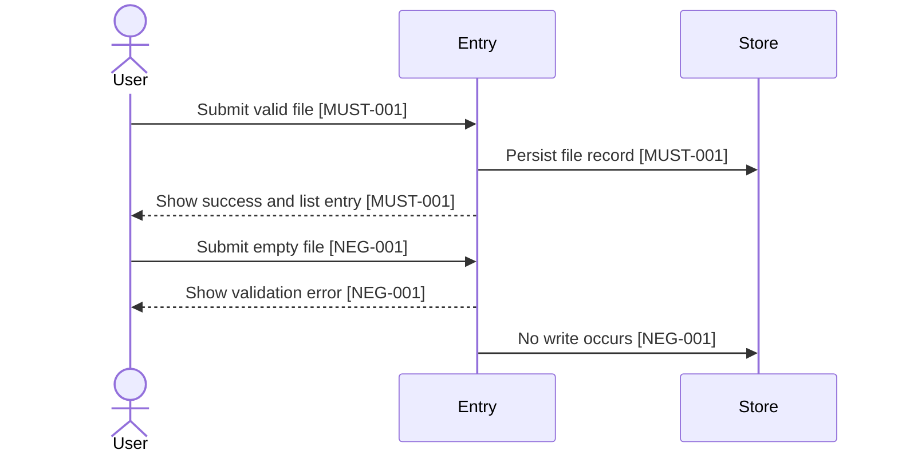

# Source Document Confirmation Template

This is not a separate authoritative requirements contract. Place this template inside the implementation source document: PRD, BUGFIX, TASKS, or Story.

The source document is authoritative only through the inline `implementationConfirmation` block. Prose, diagrams, task lists, reports, dashboards, scores, SFT outputs, and hook receipts are views or evidence only unless their semantics are represented by IDs in `implementationConfirmation`.

## Adaptive Schema Rule

Every requirement instance uses the same layered schema:

1. Core mandatory fields are always present.
2. `applicability.*` domains are always declared.
3. Conditional expansion modules are filled only when their domain has `applies: true`.

Consumer projects must not be forced to fill heavy registries that do not apply. They must still show every non-applicable domain with `applies: false` plus a concrete `reasonCode`.

## Core Mandatory Fields

```yaml
implementationConfirmation:
  contractSchemaVersion: 1
  status: draft
  recordId: REQ-EXAMPLE-001
  requirementSetId: REQ-EXAMPLE-001
  entryFlow: story | bugfix | standalone_tasks
  entryFlowClass: full_story_entry | corrective_entry | task_packet_entry
  workflowAdapter: bmad | speckit | direct | legacy
  contractAuthoringRequired: true
  confirmationLanguage: zh-CN | en-US | bilingual
  confirmationProfile: implementation_confirmation
  requiredViewPacks: []
  optionalViewPacks: []
  confirmedAt: null
  confirmedBy: null
  sourceDocumentHash: null
  implementationConfirmationHash: null
  confirmationRender:
    htmlPath: null
    summaryPath: null
    reportPath: null
    htmlHash: null
    confirmationPhrase: null

  applicability:
    governanceEvents:
      applies: false
      reasonCode: no_governance_event_or_control_envelope_changes
    runtimeRecovery:
      applies: false
      reasonCode: no_resume_rerun_closeout_hook_ingest_or_trace_checkpoint_changes
      requiresFunctionalResumeFailureCaseRegistry: false
      activeRequirementResolutionRequired: false
      retiredContextSurfaceForbidden: true
    scoringDashboardSft:
      applies: false
      reasonCode: no_scoring_dashboard_sft_dataset_or_read_model_changes
    currentTargetMap:
      applies: false
      reasonCode: no_current_target_migration_or_governance_comparison_needed
    scriptsAndHooks:
      applies: false
      reasonCode: no_script_hook_report_or_generated_artifact_changes

  must:
    - id: MUST-001
      text: "User uploads a valid file, the file is persisted, and the file appears in the list."
      evidenceRefs: ["EVD-001"]
      coveredByTraceRows: ["TRACE-001"]
      coveredBySequenceViews: ["SEQ-001"]
      upstreamRequirementIds: ["PRD-001"]
      riskLevel: high
  notDone:
    - id: NEG-001
      text: "An empty file must not display success and must not create persistent side effects."
      evidenceRefs: ["EVD-002"]
      whyItBlocksCompletion: "Without this, smoke-only success can be misreported as complete."
      negativeAssertionRequired: true
      coveredByFailurePath: ["FAIL-001"]
  mustNot:
    - id: OUT-001
      text: "Batch upload is outside this confirmed scope."
      scopeBoundary: "single file only"
      userApprovalRequiredIfChanged: true
      coveredByBoundaryView: ["BOUNDARY-001"]
  evidence:
    - id: EVD-001
      text: "Run positive upload acceptance and assert persisted state plus list visibility."
      gate: "npm run test:e2e -- upload"
      oracle: "Independent storage query shows persisted file and UI/API list includes it."
      requiredCommandRefs: ["CMD-DELIVERY-001"]
      artifactRefs: ["ART-EVD-001"]
      acceptanceType: acceptance_e2e
    - id: EVD-002
      text: "Run invalid upload acceptance and assert no persistent side effects."
      gate: "npm run test:e2e -- upload-invalid"
      oracle: "Independent storage query shows no new file record."
      requiredCommandRefs: ["CMD-DELIVERY-002"]
      artifactRefs: ["ART-EVD-002"]
      acceptanceType: adversarial_e2e
  openQuestions: []

  failurePaths:
    - id: FAIL-001
      title: "Empty upload rejected"
      trigger: "User submits an empty file."
      expectedBehavior: "Show validation error and persist nothing."
      forbiddenBehavior: "Do not show success, create a record, enqueue work, or mark requirement complete."
      blocksCompletionWhenViolated: true
      linkedNegIds: ["NEG-001"]
      linkedEvidenceIds: ["EVD-002"]
      requiredAssertions:
        - "Empty file returns an actionable validation error."
        - "No file record or downstream artifact is created."
      userVisibleOutcome: "The user sees a clear error and no false success state."

  edgeCases:
    - id: EDGE-001
      category: invalid_input
      condition: "Empty, malformed, duplicate, unauthorized, missing config, interrupted, stale hash, orphan artifact, or pending rerun condition is observed."
      expectedBehavior: "Fail closed or require explicit recovery according to linked IDs."
      forbiddenBehavior: "Do not silently continue or claim closeout from a report/read model."
      linkedFailurePathIds: ["FAIL-001"]
      linkedEvidenceIds: ["EVD-002"]
      blocksImplementation: false

  traceRows:
    - id: TRACE-001
      covers: ["MUST-001", "NEG-001", "OUT-001"]
      taskRefs: ["TASK-001"]
      evidenceRefs: ["EVD-001", "EVD-002"]
      contractValidationCommandRefs: ["CMD-CONTRACT-001"]
      deliveryEvidenceCommandRefs: ["CMD-DELIVERY-001", "CMD-DELIVERY-002"]
      sequenceViewRefs: ["SEQ-001", "SEQ-002"]
      artifactRefs: ["ART-001", "ART-EVD-001", "ART-EVD-002"]
      status: PENDING
      blockingReason: null

  sequenceViews:
    - id: SEQ-001
      title: "Happy path upload"
      covers: ["MUST-001", "EVD-001"]
    - id: SEQ-002
      title: "Failure path empty upload"
      covers: ["NEG-001", "EVD-002"]
  flowViews:
    - id: FLOW-001
      title: "Upload state transitions"
      covers: ["MUST-001", "NEG-001"]
  edgeCaseViews:
    - id: EDGEVIEW-001
      title: "Upload edge cases"
      covers: ["NEG-001"]
      cases: ["empty file", "missing config", "duplicate submit", "interrupted run", "hash mismatch", "orphan artifact", "pending rerun"]
  boundaryViews:
    - id: BOUNDARY-001
      title: "Single upload boundary"
      covers: ["OUT-001"]

  artifactAutomationPlan:
    - artifactId: ART-001
      path: "src/uploads/**"
      artifactType: code
      sourceOfTruthRole: implementation
      ownerModel: implementation
      producer: dev agent
      consumer: acceptance tests
      inputArtifacts: ["source document"]
      outputArtifacts: ["upload behavior"]
      recordEventTypes: ["implementation_delta"]
      canAffectControlFlow: true
      userApprovalRequired: true
      retention: source_controlled
      cleanupPolicy: source_controlled
      orphanRisk: low
      containsSensitiveData: false
      trainingDataEligible: false
      group: executionEvidence
      linkedRequirements: ["MUST-001", "NEG-001", "EVD-001", "EVD-002"]

  requiredCommands:
    - id: CMD-CONTRACT-001
      command: "node _bmad/skills/requirements-contract-authoring/scripts/render-requirements-confirmation-html.ts --source <source-document.md> --out _bmad-output/runtime/requirement-records/<recordId>/confirmation/confirmation.html --language zh-CN --record-id <recordId> --entry-flow <entryFlow> --mode confirmation --json"
      purpose: "Validate source contract and render confirmation HTML."
    - id: CMD-DELIVERY-001
      command: "npm run test:e2e -- upload"
      purpose: "Produce delivery evidence for the positive path."
    - id: CMD-DELIVERY-002
      command: "npm run test:e2e -- upload-invalid"
      purpose: "Produce delivery evidence for the negative path."
  suggestedCommands:
    - id: CMD-SUG-001
      command: "npm run lint"
      purpose: "Optional quality trend signal; not a closeout proof unless required above."

  requiredContractChecks:
    - id: CC-001
      gate: implementation_confirmation_schema
      requiredBefore: implementation_readiness
      decisionField: contractChecks[].decision
  closeoutReadinessPreview:
    orphanPolicy: "orphan artifacts warn during execution and block only at closeout when relevant."
    currentAttemptPolicy: "Delivery evidence must be produced inside the current closeoutAttemptId."
    requiredCommands: ["CMD-DELIVERY-001", "CMD-DELIVERY-002"]
    blockingConditions: ["missing required evidence", "open blocker", "pending rerun", "orphan artifact", "stale hash"]
```

Only explicit chat confirmation with matching hashes may change `status` to `user_confirmed`.

## Applicability Domains

`applicability` is mandatory even when every heavy domain is irrelevant.

| Domain | Required Keys | When `applies=true` |
|---|---|---|
| `governanceEvents` | `applies`, `reasonCode` | Add or reference `governanceEventTypeRegistryPolicy`, `governanceEventTypeRegistry[]`, and `controlledIngestWriterRegistry[]`; each event type must include `payloadContract` that passes the policy, and each control-writing event type must be covered by a registered writer. |
| `runtimeRecovery` | `applies`, `reasonCode`, `requiresFunctionalResumeFailureCaseRegistry`, `activeRequirementResolutionRequired`, `retiredContextSurfaceForbidden` | Add `activeRequirementResolution` and `functionalResumeFailureCaseRegistry` when resume, rerun, closeout, hook trust, ingest, runtime policy, active requirement resolution, or trace checkpoint recovery is involved. |
| `scoringDashboardSft` | `applies`, `reasonCode` | Add read-model boundary details for scoring, dashboard, SFT, dataset manifests, eval/holdout, redaction, contamination, and withdrawal. |
| `currentTargetMap` | `applies`, `reasonCode` | Add `currentTargetMap` rows; renderer must parse this data instead of hardcoding project rows. |
| `scriptsAndHooks` | `applies`, `reasonCode` | Add artifact/script/hook visibility, ownerModel, input/output artifacts, fallback, and event type references. |

## Conditional Expansion Modules

### Governance Event Type Registry Policy

Use this only when `applicability.governanceEvents.applies: true` or any artifact/recovery action references `recordEventTypes[]`.

`governanceEventTypeRegistryPolicy` is the authority for lint rules: control field vocabulary, payload kinds, control write modes, and event-specific requirements. `governanceEventTypeRegistry[]` is the authority for concrete event definitions. Renderer, ingest, gates, hooks, workers, and tests must not maintain a second hardcoded event or payload rule list.

Any transport validator, hook, worker, no-hook adapter, or controlled ingest caller must pass the same policy and registry together and bind both `registryPolicyHash` and `registryHash`. A registry that is internally self-consistent but violates `governanceEventTypeRegistryPolicy` must fail closed. Any envelope field at top level or under `payload` that matches `controlFieldVocabulary[]` must be listed in the current event type `writesControlFields[]`, otherwise transport validation must reject it as unauthorized control-field smuggling.

```yaml
  governanceEventTypeRegistryPolicy:
    controlFieldVocabulary:
      - artifactIndex
      - closeout
      - contractChecks
      - executionIterations
      - failureRecords
      - gateChecks
      - requirementClosures
      - rerunLoops
    payloadKindContracts:
      - payloadKind: decision
        requiredFields: ["eventType", "decision"]
        forbiddenFields: ["result", "status"]
        allowedControlWriteModes: ["control"]
      - payloadKind: status
        requiredFields: ["eventType", "status"]
        forbiddenFields: ["result", "decision"]
        allowedControlWriteModes: ["control"]
      - payloadKind: artifactRefs
        requiredFields: ["eventType", "artifactRefs"]
        forbiddenFields: ["result", "decision", "status"]
        allowedControlWriteModes: ["artifact_only"]
    controlWriteModePolicies:
      - allowedControlWriteMode: control
        allowedWritesControlFields: ["contractChecks", "gateChecks", "executionIterations", "requirementClosures", "failureRecords", "rerunLoops", "closeout"]
      - allowedControlWriteMode: artifact_only
        allowedWritesControlFields: ["artifactIndex"]
    eventSpecificRequirements:
      - eventType: contract_check_recorded
        payloadKind: decision
        requiredFields: ["eventType", "decision"]
        forbiddenFields: ["result", "status"]
        requiredSourceRefs: true
        allowedControlWriteMode: control

  governanceEventTypeRegistry:
    - eventType: contract_check_recorded
      ownerModel: contract_gate
      payloadKind: decision
      writesControlFields: ["contractChecks"]
      canAffectControlFlow: true
      description: "Records a controlled contract validation decision."
      payloadContract:
        requiredFields: ["eventType", "decision"]
        forbiddenFields: ["result", "status"]
        requiredSourceRefs: true
        allowedControlWriteMode: control
    - eventType: artifact_registered
      ownerModel: artifact_index
      payloadKind: artifactRefs
      writesControlFields: ["artifactIndex"]
      canAffectControlFlow: false
      description: "Registers evidence, context, schema, projection, compatibility, or derived artifacts."
      payloadContract:
        requiredFields: ["eventType", "artifactRefs"]
        forbiddenFields: ["result", "decision", "status"]
        requiredSourceRefs: false
        allowedControlWriteMode: artifact_only
```

`result` is not a control field. New controlled records use `decision` for gates/checks and `status` for lifecycle state where explicitly allowed by `payloadContract` and `governanceEventTypeRegistryPolicy`.

### Controlled Ingest Writer Registry

Use this when `applicability.governanceEvents.applies: true`, controlled ingest is used, or any script/gate/hook/worker may write a requirement record, control event log, requirement index, artifact index, or requirement-scoped event file.

`controlledIngestWriterRegistry[]` is the only machine-readable authority for writer permissions. `governanceEventTypeRegistry[]` defines valid event types, but it does not authorize any script to consume or write those event types. A writer that receives a registered event type outside its `allowedEventTypes[]` must fail closed.

```yaml
  controlledIngestWriterRegistry:
    - writerId: requirements-confirmation-ingest
      scriptPath: "_bmad/skills/requirements-contract-authoring/scripts/ingest-confirmation-event.js"
      scriptContentHash: "sha256:<script-content>"
      ownerModel: requirement_confirmation
      allowedWriteApis:
        - appendControlEvent
        - atomicWriteRequirementRecord
        - appendArtifactIndex
      allowedPaths:
        - "_bmad-output/runtime/requirement-records/<requirement-set-id>/requirement-record.json"
        - "_bmad-output/runtime/requirement-records/<requirement-set-id>/events/control-events.jsonl"
        - "_bmad-output/runtime/requirement-records/<requirement-set-id>/artifact-index.jsonl"
        - "_bmad-output/runtime/requirement-records/artifact-index.jsonl"
      allowedEventTypes:
        - confirmation_recorded
        - contract_check_recorded
        - artifact_indexed
      payloadContractRefs:
        - confirmation_recorded
        - contract_check_recorded
        - artifact_indexed
      writesControlFields:
        - confirmationHistory
        - contractChecks
        - artifactIndex
      receiptPath: "_bmad-output/runtime/requirement-records/<requirement-set-id>/receipts/requirements-confirmation-ingest/<receipt-id>.json"
      beforeAfterHashRequired: true
      canModifyWriterRegistry: false
      registryHash: "sha256:<controlled-ingest-writer-registry>"
      architectureConfirmationHash: "sha256:<current-architecture-confirmation>"
```

Hard rules:

- `allowedPaths[]` must not use `_bmad-output/runtime/requirement-records/**` or another broad glob that grants cross-record writes.
- Every `allowedEventTypes[]` value must exist in `governanceEventTypeRegistry[]`.
- `payloadContractRefs[]` must include every event type the writer may consume.
- `writesControlFields[]` must be covered by the union of `writesControlFields[]` from the writer's `allowedEventTypes[]`.
- Every governance event type that writes control fields must be covered by at least one writer.
- `beforeAfterHashRequired` must be `true`.
- `canModifyWriterRegistry` must be `false`.
- Changing this registry is a shared control-contract change and requires architecture confirmation.

### Active Requirement Resolution

Use this when `applicability.runtimeRecovery.applies: true`, `activeRequirementResolutionRequired: true`, or the requirement touches runtime governance, hooks, no-hook fallback, bmad-help routing, scoring, dashboard, SFT, recovery, closeout, or controlled ingest.

```yaml
  activeRequirementResolution:
    resolver: scripts/resolve-active-requirement.ts
    explicitArgs:
      - --record-id
      - --requirement-set-id
      - --run-id
    locatorPath: "_bmad-output/runtime/requirement-records/index.json"
    controlRecordPath: "_bmad-output/runtime/requirement-records/<requirement-set-id>/requirement-record.json"
    runtimePolicySnapshotPath: "_bmad-output/runtime/requirement-records/<requirement-set-id>/recovery/runtime-policy-snapshot.json"
    recoveryContextPath: "_bmad-output/runtime/requirement-records/<requirement-set-id>/recovery/recovery-context.json"
    bmadWorkflowProjectionPath: "_bmad-output/runtime/requirement-records/<requirement-set-id>/artifacts/bmad-workflow-routing-<run-id>.json"
    forbiddenInputs:
      - "_bmad-output/runtime/context/**"
    noDirectoryGuessing: true
    noLegacyFallback: true
    failClosedWhen:
      - missing_explicit_args_and_missing_index
      - invalid_index_schema
      - multiple_active_records
      - active_record_missing
      - active_record_hash_mismatch
      - runtime_policy_snapshot_missing_or_mismatch
      - recovery_context_missing_or_mismatch
      - trace_checkpoint_missing
      - current_run_references_retired_context_surface
```

The resolver output is a read-only `ResolvedRuntimeContext`. It may be consumed by scripts, hooks, dashboards, and projections, but it must not mutate requirements or replace `requirement-record.json` as the control source.

### Functional Resume Failure Case Registry

Use this only when `applicability.runtimeRecovery.applies: true` or `requiresFunctionalResumeFailureCaseRegistry: true`.

```yaml
  functionalResumeFailureCaseRegistry:
    applies: true
    authority: source_document
    groupingAuthority: source_document
    recoveryActionDefinitions:
      - actionId: block_confirmation
        label: "Block confirmation"
        ownerModel: contract_gate
        automationLevel: automatic_block
        writesControlFields: ["contractChecks"]
        recordEventTypes: ["contract_check_recorded"]
        outputArtifacts: ["confirmation-render-report.json"]
        createsNewCloseoutAttempt: false
        requiresUserConfirmation: false
    groups:
      - groupId: source_integrity
        label: "Source and confirmation integrity"
        caseRefs: ["sourceDocumentHash_changed"]
        ownerModel: runtime_recovery
        blockingBehavior: fail_closed_before_resume
        requiredEvidenceRefs: ["EVD-001"]
        requiredTraceRefs: ["TRACE-001"]
    failureCases:
      - id: sourceDocumentHash_changed
        groupId: source_integrity
        triggerSignal: "Current source hash differs from rendered report hash."
        detectionPoint: confirmation_render
        failClosedGate: implementation_readiness
        failureRecordType: source_integrity_failure
        expectedRecoveryActions: ["block_confirmation"]
        recordEventTypes: ["contract_check_recorded"]
        requiredTraceRefs: ["TRACE-001"]
        requiredEvidenceRefs: ["EVD-001"]
```

Renderer and ingest must not classify recovery groups by regex. Grouping authority is the source document.

### Current Target Map

Use this only when `applicability.currentTargetMap.applies: true`.

```yaml
  currentTargetMap:
    schemaVersion: current-target-map/v1
    displayProfile: closed_loop_current_target_map
    introduction: "Source-driven current versus target comparison."
    diffRows:
      - dimension: "Trace command semantics"
        currentState: "commandRefs[] only"
        targetState: "contractValidationCommandRefs[] and deliveryEvidenceCommandRefs[]"
        action: "split"
    pathRegistry:
      - category: "Requirement record"
        fixedPath: "_bmad-output/runtime/requirement-records/<recordId>/requirement-record.json"
        sourceOfTruthRole: control
        description: "Main controlled requirement record."
```

### Scoring / Dashboard / SFT Read Model

Use this only when `applicability.scoringDashboardSft.applies: true`.

```yaml
  scoringDashboardSft:
    scoreRequired: true
    scoringPolicyHash: "sha256:..."
    scoreMaterializationGate: score_materialization
    scoreEvaluationGate: score_evaluation
    dashboardReadonly: true
    sftEligible: false
    evalHoldoutRedactionContaminationRequired: true
    noReverseCloseoutReason: "Score files, dashboard, and SFT outputs are read models; controlled gates write gateChecks[].decision."
```

## Human-Readable Views

Every requirement-bearing diagram node, edge, branch, artifact write, script call, hook observation, failure path, state transition, or evidence statement must reference `MUST`, `NEG`, `OUT`, or `EVD` IDs.



## HTML Confirmation Page

Render mandatory HTML to:

```text
_bmad-output/runtime/requirement-records/<recordId>/confirmation/confirmation.html
_bmad-output/runtime/requirement-records/<recordId>/confirmation/confirmation-summary.json
_bmad-output/runtime/requirement-records/<recordId>/confirmation/confirmation-render-report.json
```

The renderer is read-only. HTML render failure is blocked; there is no Markdown/chat fallback. The user confirms in chat only with the exact phrase and hashes from `confirmation-render-report.json`.

## Reverse Audit Report

```markdown
## Reverse Audit Report

Verdict: PASS|FAIL
Mode: scripted|manual
Audit command: `node <skill-dir>/scripts/reverse_audit_contract.js <source-document.md>`

### implementationConfirmation Findings
### Applicability Findings
### FailurePaths And EdgeCases Findings
### Governance Event PayloadContract Findings
### Runtime Recovery Registry Findings
### Trace Command Split Findings
### Diagram And Step Findings
### Artifact Automation Findings
### HTML Confirmation Findings
### Open Findings
```

## Definition Of Done

- `implementationConfirmation.status` is `user_confirmed` before implementation readiness.
- `failurePaths[]` and `edgeCases[]` are present for every requirement instance.
- `applicability.*` declares every domain with `applies` and `reasonCode`.
- Conditional heavy registries are present only when their applicability domain applies.
- `traceRows[]` uses `contractValidationCommandRefs[]` and `deliveryEvidenceCommandRefs[]`; legacy `commandRefs[]` is not the sole command authority.
- Governance event types include `payloadContract` when used.
- Controlled ingest writer permissions are declared in `controlledIngestWriterRegistry[]` when governance events or controlled ingest apply.
- Runtime recovery groups, actions, and failure cases are source-defined when applicable.
- No open question with `blocksImplementation: true` remains.
- Every ID reference resolves to an existing ID.
- Mandatory HTML confirmation outputs exist and match the current source hash.
- Read models, reports, score files, dashboards, SFT outputs, and hook receipts do not directly close requirements.
