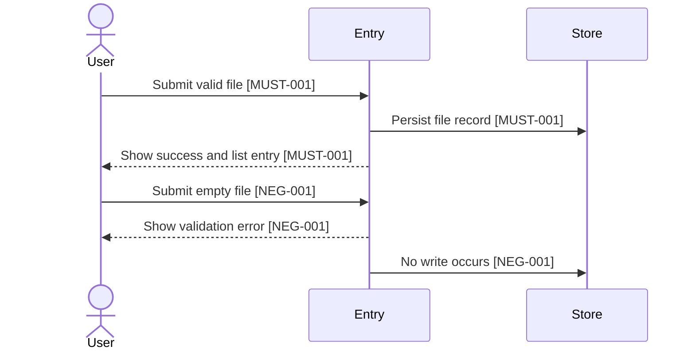

# Source Document Confirmation Template

This is not a separate authoritative requirements contract. Place this template inside the implementation source document: PRD, BUGFIX, TASKS, or Story.

The source document is authoritative only through the inline `implementationConfirmation` block. Prose, diagrams, task lists, reports, dashboards, scores, SFT outputs, and hook receipts are views or evidence only unless their semantics are represented by IDs in `implementationConfirmation`.

## Adaptive Schema Rule

Every requirement instance uses the same layered schema:

1. Core mandatory fields are always present.
2. `applicability.*` domains are always declared.
3. Conditional expansion modules are filled only when their domain has `applies: true`.

Consumer projects must not be forced to fill heavy registries that do not apply. They must still show every non-applicable domain with `applies: false` plus a concrete `reasonCode`.

## Required Source State Sections

Every source document authored by this skill MUST include dedicated human-readable sections before the inline `implementationConfirmation` block:

```markdown
## Source Current State

- Describe the consumer/project behavior that exists today, including concrete user-visible limitations, current controls, default state, rollback gaps, target files, or operational constraints.
- Do not describe confirmation governance, renderer state, audit state, hashes, or implementation-readiness state here.

## Source Target State

- Describe the target user-visible behavior after all confirmed MUST rows are implemented, including default behavior, rollback behavior, validation boundaries, and acceptance-visible outcomes.
- Every target statement must be represented by one or more IDs inside `implementationConfirmation.must[]`, `traceRows[]`, `acceptanceTests[]`, or `evidence[]`.
```

`currentTargetMap` materialization MUST project `Source Current State` and `Source Target State` first. It MUST NOT infer the current/target comparison by project name, domain keyword, file path keyword, or consumer-specific phrase matching. Heuristic highlighting is allowed only as an explicit fallback for legacy source documents that do not yet contain both dedicated sections.

## Core Mandatory Fields

```yaml
implementationConfirmation:
  contractSchemaVersion: 1
  status: draft
  recordId: REQ-EXAMPLE-001
  requirementSetId: REQ-EXAMPLE-001
  entryFlow: story
  entryFlowClass: full_story_entry
  workflowAdapter: bmad
  contractAuthoringRequired: true
  confirmationLanguage: zh-CN
  confirmationProfile: implementation_confirmation
  requiredViewPacks: ["currentTargetMap"]
  optionalViewPacks: []
  confirmedAt: null
  confirmedBy: null
  sourceDocumentHash: null
  implementationConfirmationHash: null
  confirmationRender:
    htmlPath: null
    summaryPath: null
    reportPath: null
    htmlHash: null
    confirmationPhrase: null

  preConfirmationDrilldown:
    semanticKernelRef:
      path: "_bmad-output/runtime/requirement-records/<recordId>/authoring/semantic-kernel.json"
      hash: "sha256:..."
    mustDecompositionPacketRef:
      path: "_bmad-output/runtime/requirement-records/<recordId>/authoring/must_decomposition_packet.json"
      hash: "sha256:..."
      status: synchronized
    criticalAuditor:
      minimumRounds: 3
      consecutiveNoNewGapRounds: "<derived-from-current-critical-auditor-receipts>"
      latestReceiptHash: "<latest-current-receipt-hash>"
      convergenceVerdict: "<audit_not_run|blocked|bounded_no_new_gap>"
    packetSourceReconciliation:
      reportPath: "_bmad-output/runtime/requirement-records/<recordId>/authoring/must_packet_source_reconciliation_report.json"
      verdict: pass
    preRenderGateReportPath: "_bmad-output/runtime/requirement-records/<recordId>/authoring/pre-render-must-decomposition-gate-report.json"

  applicability:
    governanceEvents:
      applies: false
      reasonCode: no_governance_event_or_control_envelope_changes
    runtimeRecovery:
      applies: false
      reasonCode: no_resume_rerun_closeout_hook_ingest_or_trace_checkpoint_changes
      requiresFunctionalResumeFailureCaseRegistry: false
      activeRequirementResolutionRequired: false
      retiredContextSurfaceForbidden: true
    scoringDashboardSft:
      applies: false
      reasonCode: no_scoring_dashboard_sft_dataset_or_read_model_changes
    currentTargetMap:
      applies: true
      reasonCode: requirements_contract_authoring_requires_visible_current_target_map
    scriptsAndHooks:
      applies: false
      reasonCode: no_script_hook_report_or_generated_artifact_changes
    aiTddContractGate:
      applies: true
      reasonCode: requirements_contract_authoring_requires_ai_tdd_contract_execution_manifest

  governanceEventTypeRegistryPolicy:
    controlFieldVocabulary:
      - artifactIndex
      - contractChecks
      - gateChecks
    payloadKindContracts:
      - payloadKind: artifactRefs
        requiredFields: ["eventType", "artifactRefs"]
        forbiddenFields: ["decision", "status"]
        allowedControlWriteModes: ["artifact_only"]
    controlWriteModePolicies:
      - allowedControlWriteMode: artifact_only
        allowedWritesControlFields: ["artifactIndex"]
    eventSpecificRequirements: []

  must:
    - id: MUST-001
      text: "用户提交有效文件后，系统必须持久化文件记录，并在上传列表中展示该文件。"
      evidenceRefs: ["EVD-001"]
      coveredByTraceRows: ["TRACE-001"]
      coveredBySequenceViews: ["SEQ-001"]
      upstreamRequirementIds: ["PRD-001"]
      riskLevel: high
      perMustOracle: "通过独立存储查询和列表断言同时证明持久化与可见性。"
  notDone:
    - id: NEG-001
      text: "空文件不得显示上传成功，也不得产生任何持久化副作用。"
      evidenceRefs: ["EVD-002"]
      whyItBlocksCompletion: "缺少该负向断言时，烟雾级成功可能被误报为完成。"
      negativeAssertionRequired: true
      coveredByFailurePath: ["FAIL-001"]
  mustNot:
    - id: OUT-001
      text: "批量上传不属于本次确认范围。"
      scopeBoundary: "本范围只确认单文件上传。"
      userApprovalRequiredIfChanged: true
      coveredByBoundaryView: ["BOUNDARY-001"]
    - id: OUT-GOV-001
      text: "确认页渲染、审计回执和只读报告不得替代交付完成证据。"
      scopeBoundary: "治理视图只能解释确认边界，不能关闭业务需求。"
      userApprovalRequiredIfChanged: true
      coveredByBoundaryView: ["GOV-BOUNDARY-001"]
  evidence:
    - id: EVD-001
      text: "运行正向上传验收，断言文件持久化状态和列表可见性。"
      gate: "npm run test:e2e -- upload"
      oracle: "独立存储查询能看到文件记录，UI 或 API 列表也能看到同一文件。"
      requiredCommandRefs: ["CMD-DELIVERY-001"]
      artifactRefs: ["ART-EVD-001"]
      acceptanceType: acceptance_e2e
    - id: EVD-002
      text: "运行无效上传验收，断言没有持久化副作用。"
      gate: "npm run test:e2e -- upload-invalid"
      oracle: "独立存储查询确认没有新增文件记录。"
      requiredCommandRefs: ["CMD-DELIVERY-002"]
      artifactRefs: ["ART-EVD-002"]
      acceptanceType: adversarial_e2e
  openQuestions: []

  failurePaths:
    - id: FAIL-001
      title: "空文件上传被拒绝"
      trigger: "用户提交空文件。"
      expectedBehavior: "系统显示校验错误，并且不持久化任何数据。"
      forbiddenBehavior: "不得显示成功、创建记录、进入队列或标记需求完成。"
      blocksCompletionWhenViolated: true
      linkedNegIds: ["NEG-001"]
      linkedEvidenceIds: ["EVD-002"]
      sequenceViewRefs: ["SEQ-002"]
      requiredAssertions:
        - "空文件返回可操作的校验错误。"
        - "没有创建文件记录或下游产物。"
      userVisibleOutcome: "用户看到明确错误，并且不会看到虚假成功状态。"

  edgeCases:
    - id: EDGE-001
      category: invalid_input
      condition: "出现空文件、格式错误、重复提交、未授权、配置缺失、中断、陈旧哈希、孤儿产物或待重跑状态。"
      expectedBehavior: "系统必须按关联 ID 失败关闭或要求显式恢复。"
      forbiddenBehavior: "不得静默继续，也不得用报告或只读模型声明 closeout。"
      linkedFailurePathIds: ["FAIL-001"]
      linkedEvidenceIds: ["EVD-002"]
      blocksImplementation: false

  acceptanceTests:
    - id: ACC-001
      suiteType: acceptance
      file: "tests/acceptance/requirements-contract-gold-template-render.test.ts"
      covers: ["MUST-001"]
      traceRows: ["TRACE-001"]
      evidenceRefs: ["EVD-001"]
      commandRefs: ["CMD-DELIVERY-001"]
      oracle: "测试必须证明有效上传后存在持久化记录并可在列表查询到。"
      positiveControl: true
      mockOnly: false
    - id: ACC-002
      suiteType: adversarial_acceptance
      file: "packages/bmad-speckit/src/main-agent/source-authority/tests/requirements-contract-source-template.test.ts"
      covers: ["NEG-001"]
      traceRows: ["TRACE-002"]
      evidenceRefs: ["EVD-002"]
      failurePathRefs: ["FAIL-001"]
      edgeCaseRefs: ["EDGE-001"]
      commandRefs: ["CMD-DELIVERY-002"]
      oracle: "测试必须证明空文件返回校验错误且没有新增持久化记录。"
      negativeControls: ["NEG-001"]
      mockOnly: false
  e2eSuites:
    - id: E2E-001
      suiteType: e2e
      file: "tests/acceptance/requirements-contract-gold-template-render.test.ts"
      covers: ["MUST-001", "NEG-001"]
      traceRows: ["TRACE-001", "TRACE-002"]
      evidenceRefs: ["EVD-001", "EVD-002"]
      failurePathRefs: ["FAIL-001"]
      edgeCaseRefs: ["EDGE-001"]
      commandRefs: ["CMD-DELIVERY-001", "CMD-DELIVERY-002"]
      oracle: "端到端路径必须同时覆盖成功持久化和失败无副作用两个验收边界。"
      mockOnly: false

  traceRows:
    - id: TRACE-001
      covers: ["MUST-001"]
      taskRefs: ["TASK-001"]
      evidenceRefs: ["EVD-001"]
      acceptanceRefs: ["ACC-001", "E2E-001"]
      contractValidationCommandRefs: ["CMD-CONTRACT-001"]
      deliveryEvidenceCommandRefs: ["CMD-DELIVERY-001"]
      sequenceViewRefs: ["SEQ-001"]
      flowViewRefs: ["FLOW-001"]
      artifactRefs: ["ART-001", "ART-EVD-001"]
      closureAssertion: "MUST-001 只有在持久化记录和列表可见性同时通过时才可关闭。"
      targetStateAssertion: "有效文件上传后进入可查询的已保存状态。"
      acceptanceSummary: "ACC-001 和 E2E-001 独立覆盖正向验收。"
      status: PENDING
      blockingReason: null
    - id: TRACE-002
      covers: ["NEG-001"]
      taskRefs: ["TASK-002"]
      evidenceRefs: ["EVD-002"]
      acceptanceRefs: ["ACC-002", "E2E-001"]
      contractValidationCommandRefs: ["CMD-CONTRACT-001"]
      deliveryEvidenceCommandRefs: ["CMD-DELIVERY-002"]
      sequenceViewRefs: ["SEQ-002"]
      flowViewRefs: ["FLOW-001"]
      edgeCaseViewRefs: ["EDGEVIEW-001"]
      artifactRefs: ["ART-001", "ART-EVD-002"]
      closureAssertion: "NEG-001 只有在空文件无副作用断言通过时才可关闭。"
      targetStateAssertion: "无效输入必须保持系统状态不变。"
      acceptanceSummary: "ACC-002 和 E2E-001 独立覆盖负向验收。"
      status: PENDING
      blockingReason: null

  sequenceViews:
    - id: SEQ-001
      title: "有效文件上传正向路径"
      visualKind: happy
      scope: business
      covers: ["MUST-001"]
      traceRows: ["TRACE-001"]
      evidenceRefs: ["EVD-001"]
      acceptanceRefs: ["ACC-001", "E2E-001"]
      mermaid: |
        sequenceDiagram
          actor User
          participant Entry
          participant Store
          User->>Entry: 提交有效文件 [MUST-001]
          Entry->>Store: 写入文件记录 [MUST-001]
          Entry-->>User: 返回成功并显示列表项 [MUST-001]
    - id: SEQ-002
      title: "空文件上传失败路径"
      visualKind: failure
      scope: business
      covers: ["NEG-001"]
      traceRows: ["TRACE-002"]
      evidenceRefs: ["EVD-002"]
      acceptanceRefs: ["ACC-002", "E2E-001"]
      failurePathRefs: ["FAIL-001"]
      mermaid: |
        sequenceDiagram
          actor User
          participant Entry
          participant Store
          User->>Entry: 提交空文件 [NEG-001]
          Entry-->>User: 返回校验错误 [NEG-001]
          Entry->>Store: 保持无写入状态 [NEG-001]
  flowViews:
    - id: FLOW-001
      title: "上传状态流"
      visualKind: flow
      scope: business
      covers: ["MUST-001", "NEG-001"]
      traceRows: ["TRACE-001", "TRACE-002"]
      evidenceRefs: ["EVD-001", "EVD-002"]
      acceptanceRefs: ["ACC-001", "ACC-002", "E2E-001"]
      mermaid: |
        flowchart TD
          A["用户选择文件 [MUST-001]"] --> B{"文件是否有效 [MUST-001][NEG-001]"}
          B -->|有效| C["保存记录 [MUST-001]"]
          C --> D["列表展示文件 [MUST-001]"]
          B -->|空文件| E["显示校验错误 [NEG-001]"]
          E --> F["不创建记录 [NEG-001]"]
  edgeCaseViews:
    - id: EDGEVIEW-001
      title: "上传边界输入矩阵"
      visualKind: edge
      scope: business
      covers: ["NEG-001", "EDGE-001"]
      traceRows: ["TRACE-002"]
      evidenceRefs: ["EVD-002"]
      acceptanceRefs: ["ACC-002", "E2E-001"]
      failurePathRefs: ["FAIL-001"]
      edgeCaseRefs: ["EDGE-001"]
      cases: ["EDGE-001"]
      mermaid: |
        flowchart TD
          A["检测边界输入 [EDGE-001]"] --> B["执行失败关闭策略 [NEG-001]"]
          B --> C["验证无持久化副作用 [EVD-002]"]
  boundaryViews:
    - id: BOUNDARY-001
      title: "单文件上传范围边界"
      visualKind: boundary
      scope: business
      covers: ["OUT-001"]
      evidenceRefs: ["EVD-002"]
      acceptanceRefs: ["ACC-002"]
      mermaid: |
        flowchart TD
          A["本次范围 [MUST-001]"] --> B["单文件上传"]
          A -.禁止.-> C["批量上传 [OUT-001]"]
    - id: GOV-BOUNDARY-001
      title: "治理证据边界"
      visualKind: boundary
      scope: governance
      covers: ["OUT-GOV-001"]
      evidenceRefs: ["EVD-002"]
      acceptanceRefs: ["ACC-002"]
      mermaid: |
        flowchart TD
          A["确认页渲染 [OUT-GOV-001]"] --> B["只能解释范围"]
          B -.不得替代.-> C["交付完成证据 [OUT-GOV-001]"]

  targetModificationPaths:
    - id: TARGET-MOD-001
      path: "packages/example-upload/src/uploads/**"
      coverageRole: implementation_target
      changeType: code
      intent: "实现单文件上传持久化、列表展示和空文件失败关闭。"
      ownerModel: implementation
      requirementRefs: ["MUST-001", "NEG-001"]
      traceRefs: ["TRACE-001", "TRACE-002"]
      evidenceRefs: ["EVD-001", "EVD-002"]
      artifactRefs: ["ART-001"]
      requiresReconfirmationOnChange: true
    - id: TARGET-MOD-002
      path: "<skill-dir>/scripts/render-requirements-confirmation-html.ts"
      coverageRole: validation_only
      changeType: validation
      intent: "渲染确认页并验证契约投影质量。"
      ownerModel: contract_gate
      traceRefs: ["TRACE-001", "TRACE-002"]
      evidenceRefs: ["EVD-001", "EVD-002"]
      artifactRefs: ["ART-EVD-001"]
      requiresReconfirmationOnChange: false
    - id: TARGET-MOD-003
      path: "tests/acceptance/requirements-contract-gold-template-render.test.ts"
      coverageRole: validation_only
      changeType: test
      intent: "验证 canonical contract template 能渲染 confirmable HTML。"
      ownerModel: verification
      traceRefs: ["TRACE-001"]
      evidenceRefs: ["EVD-001"]
      artifactRefs: ["ART-EVD-001"]
      requiresReconfirmationOnChange: false
    - id: TARGET-MOD-004
      path: "packages/bmad-speckit/src/main-agent/source-authority/tests/requirements-contract-source-template.test.ts"
      coverageRole: validation_only
      changeType: test
      intent: "验证 PRD source template 不形成第二套 schema。"
      ownerModel: verification
      traceRefs: ["TRACE-002"]
      evidenceRefs: ["EVD-002"]
      artifactRefs: ["ART-EVD-002"]
      requiresReconfirmationOnChange: false

  requirementBoundary:
    business:
      requirementIds: ["MUST-001", "NEG-001", "OUT-001", "EVD-001", "EVD-002"]
      viewRefs: ["SEQ-001", "SEQ-002", "FLOW-001", "EDGEVIEW-001", "BOUNDARY-001"]
      diagramRefs: ["SEQ-001", "SEQ-002", "FLOW-001", "EDGEVIEW-001", "BOUNDARY-001"]
    governance:
      requirementIds: ["OUT-GOV-001"]
      viewRefs: ["GOV-BOUNDARY-001"]
      diagramRefs: ["GOV-BOUNDARY-001"]

  artifactAutomationPlan:
    - artifactId: ART-001
      path: "packages/example-upload/src/uploads/**"
      artifactType: code
      sourceOfTruthRole: implementation
      ownerModel: implementation
      producer: implementation agent
      consumer: acceptance tests
      inputArtifacts: ["implementation source document"]
      outputArtifacts: ["upload behavior"]
      canAffectControlFlow: false
      userApprovalRequired: true
      retention: source_controlled
      cleanupPolicy: source_controlled
      orphanRisk: low
      containsSensitiveData: false
      trainingDataEligible: false
      group: executionEvidence
      linkedRequirements: ["MUST-001", "NEG-001"]
      traceRows: ["TRACE-001", "TRACE-002"]
      evidenceRefs: ["EVD-001", "EVD-002"]
    - artifactId: ART-EVD-001
      path: "tests/acceptance/requirements-contract-gold-template-render.test.ts"
      artifactType: test
      sourceOfTruthRole: evidence
      ownerModel: verification
      producer: test runner
      consumer: contract gate
      inputArtifacts: ["implementation source document"]
      outputArtifacts: ["positive upload evidence"]
      canAffectControlFlow: false
      userApprovalRequired: false
      retention: source_controlled
      cleanupPolicy: source_controlled
      orphanRisk: low
      containsSensitiveData: false
      trainingDataEligible: false
      group: executionEvidence
      linkedRequirements: ["MUST-001"]
      traceRows: ["TRACE-001"]
      evidenceRefs: ["EVD-001"]
    - artifactId: ART-EVD-002
      path: "packages/bmad-speckit/src/main-agent/source-authority/tests/requirements-contract-source-template.test.ts"
      artifactType: test
      sourceOfTruthRole: evidence
      ownerModel: verification
      producer: test runner
      consumer: contract gate
      inputArtifacts: ["implementation source document"]
      outputArtifacts: ["negative upload evidence"]
      canAffectControlFlow: false
      userApprovalRequired: false
      retention: source_controlled
      cleanupPolicy: source_controlled
      orphanRisk: low
      containsSensitiveData: false
      trainingDataEligible: false
      group: executionEvidence
      linkedRequirements: ["NEG-001"]
      traceRows: ["TRACE-002"]
      evidenceRefs: ["EVD-002"]

  currentTargetMap:
    schemaVersion: current-target-map/v1
    displayProfile: closed_loop_current_target_map
    introduction: "本区展示上传能力从未受控到可验收闭环的现状与目标差异。"
    sourceStateProjection:
      mode: source_current_target_sections
      currentSectionHeadings: ["Source Current State"]
      targetSectionHeadings: ["Source Target State"]
      currentRows:
        - id: SOURCE-CURRENT-001
          text: "当前上传示例缺少契约绑定的持久化和负向验收边界。"
          sourceLine: 1
      targetRows:
        - id: SOURCE-TARGET-001
          text: "目标状态必须用独立 ACC/E2E、trace 和 evidence 证明正向与负向行为。"
          sourceLine: 2
    currentSummary:
      - title: "现状行为"
        detail: "上传路径可能只有烟雾级成功信号，无法证明持久化和列表可见性。"
    targetSummary:
      - title: "目标行为"
        detail: "有效文件持久化并可见，空文件失败关闭且无副作用。"
    diffRows:
      - dimension: "正向行为闭环"
        currentState: "缺少每条 MUST 的独立验收边界。"
        targetState: "MUST-001 绑定 TRACE-001、ACC-001、E2E-001 和 EVD-001。"
        action: "add_per_must_acceptance"
      - dimension: "负向行为闭环"
        currentState: "空文件可能被烟雾级成功掩盖。"
        targetState: "NEG-001 绑定 FAIL-001、EDGE-001、ACC-002 和 EVD-002。"
        action: "add_negative_oracle"
      - dimension: "目标路径可审计性"
        currentState: "目标修改路径未显式列出。"
        targetState: "targetModificationPaths[] 覆盖实现、渲染器和验证路径。"
        action: "declare_target_paths"
    process:
      - phase: "Confirmation"
        currentState: "示例合同可能无法渲染高质量 HTML。"
        targetState: "renderer-backed gold contract 输出 confirmable HTML。"
    artifactPaths:
      - path: "packages/example-upload/src/uploads/**"
        targetRole: "上传实现目标路径"
        traceRows: ["TRACE-001", "TRACE-002"]
        evidenceRefs: ["EVD-001", "EVD-002"]
    canonicalArtifacts:
      - id: CANONICAL-001
        targetPathOrField: "packages/example-upload/src/uploads/**"
        functionDescription: "单文件上传实现与验证边界。"
        controlPlaneRole: implementation_surface
        traceRows: ["TRACE-001", "TRACE-002"]
        evidenceRefs: ["EVD-001", "EVD-002"]
    pathRegistry:
      - id: PATHREG-001
        category: "Confirmation renderer"
        fixedPath: "<skill-dir>/scripts/render-requirements-confirmation-html.ts"
        sourceOfTruthRole: validation
        description: "确认页只读渲染器。"
        traceRows: ["TRACE-001", "TRACE-002"]
        evidenceRefs: ["EVD-001", "EVD-002"]
    existingArtifacts:
      - id: LEGACY-001
        currentPath: "legacy/upload-smoke-output"
        currentFunction: "旧烟雾级上传输出。"
        targetTreatment: "只能作为背景，不能作为完成证明。"
        completionProofPolicy: legacy_only
        traceRows: ["TRACE-002"]
        evidenceRefs: ["EVD-002"]

  requiredCommands:
    - id: CMD-CONTRACT-001
      commandRef:
        skill: requirements-contract-authoring
        script: scripts/render-requirements-confirmation-html.ts
      command: "node <skill-dir>/scripts/render-requirements-confirmation-html.ts"
      purpose: "验证源合同并渲染确认 HTML。"
    - id: CMD-DELIVERY-001
      command: "npx vitest run tests/acceptance/requirements-contract-gold-template-render.test.ts"
      purpose: "产生正向路径交付证据。"
    - id: CMD-DELIVERY-002
      command: "npx vitest run packages/bmad-speckit/src/main-agent/source-authority/tests/requirements-contract-source-template.test.ts"
      purpose: "产生负向路径交付证据。"
  suggestedCommands:
    - id: CMD-SUG-001
      command: "npm run lint"
      purpose: "可选质量趋势信号；除非被上方必跑命令引用，否则不是 closeout 证明。"

  requiredContractChecks:
    - id: CC-001
      gate: implementation_confirmation_schema
      requiredBefore: implementation_readiness
      decisionField: contractChecks[].decision
  implementationTasks:
    - id: TASK-001
      title: "实现有效上传持久化与列表可见性"
      requirementRefs: ["MUST-001"]
      targetPaths: ["packages/example-upload/src/uploads/**"]
      traceRefs: ["TRACE-001"]
      evidenceRefs: ["EVD-001"]
    - id: TASK-002
      title: "实现空文件失败关闭和无副作用断言"
      requirementRefs: ["NEG-001"]
      targetPaths: ["packages/example-upload/src/uploads/**"]
      traceRefs: ["TRACE-002"]
      evidenceRefs: ["EVD-002"]
  aiTddContractExecutionManifestProjection:
    schemaVersion: ai-tdd-contract-execution-manifest-projection/v1
    applies: true
    requiredSections:
      - errorCaseCoverage
      - commandTargetCollection
      - traceClosureAssertions
      - currentTargetMap
      - canonicalSurfaceReconciliation
      - legacyDenial
      - closeoutProof
      - evidenceTrustStates
    atomicImplementationTaskLineage:
      - taskId: TASK-001
        requirementRefs: ["MUST-001"]
        traceRefs: ["TRACE-001"]
      - taskId: TASK-002
        requirementRefs: ["NEG-001"]
        traceRefs: ["TRACE-002"]
    errorCaseCoverage:
      - failurePathRef: FAIL-001
        negRefs: ["NEG-001"]
        acceptanceRefs: ["ACC-002", "E2E-001"]
        viewRefs: ["SEQ-002", "EDGEVIEW-001"]
      - edgeCaseRef: EDGE-001
        failurePathRefs: ["FAIL-001"]
        acceptanceRefs: ["ACC-002", "E2E-001"]
        viewRefs: ["EDGEVIEW-001"]
    commandTargets:
      - commandRef: CMD-DELIVERY-001
        targetFiles: ["tests/acceptance/requirements-contract-gold-template-render.test.ts"]
        traceRefs: ["TRACE-001"]
        evidenceRefs: ["EVD-001"]
      - commandRef: CMD-DELIVERY-002
        targetFiles: ["packages/bmad-speckit/src/main-agent/source-authority/tests/requirements-contract-source-template.test.ts"]
        traceRefs: ["TRACE-002"]
        evidenceRefs: ["EVD-002"]
    traceClosure:
      - traceRef: TRACE-001
        acceptanceRefs: ["ACC-001", "E2E-001"]
      - traceRef: TRACE-002
        acceptanceRefs: ["ACC-002", "E2E-001"]
    canonicalSurfaces:
      - artifactRef: CANONICAL-001
        traceRefs: ["TRACE-001", "TRACE-002"]
        evidenceRefs: ["EVD-001", "EVD-002"]
    legacyDenial:
      - legacyRef: LEGACY-001
        policy: legacy_only
        evidenceRefs: ["EVD-002"]
    closeoutProof:
      - proofRef: closeoutReadinessPreview
        requiredCommands: ["CMD-DELIVERY-001", "CMD-DELIVERY-002"]
    evidenceTrustStates:
      - evidenceRef: EVD-001
        oracle: "独立存储查询和列表断言。"
        commandRefs: ["CMD-DELIVERY-001"]
      - evidenceRef: EVD-002
        oracle: "独立存储查询确认无新增记录。"
        commandRefs: ["CMD-DELIVERY-002"]
  closeoutReadinessPreview:
    orphanPolicy: "执行期间孤儿产物只告警；相关时在 closeout 阶段阻断。"
    currentAttemptPolicy: "交付证据必须产生于当前 closeoutAttemptId。"
    recordClosedPolicy: "只有 controlled gate 写入 pass 决策后才能声明完成。"
    requiredCommands: ["CMD-DELIVERY-001", "CMD-DELIVERY-002"]
    blockingConditions: ["missing required evidence", "open blocker", "pending rerun", "orphan artifact", "stale hash"]
```

Only explicit chat confirmation with matching hashes may change `status` to `user_confirmed`.

`preConfirmationDrilldown` is drilldown metadata only. Final confirmation authority remains the inline `implementationConfirmation` block; the metadata only proves the source block was materialized from the semantic kernel, synchronized `must_decomposition_packet.json`, Critical Auditor receipts, and packet/source reconciliation.

The template assumes the pre-confirmation atomic decomposition loop has already produced:

- `_bmad-output/runtime/requirement-records/<recordId>/authoring/semantic-kernel.json`
- `_bmad-output/runtime/requirement-records/<recordId>/authoring/must_decomposition_packet.json`
- `_bmad-output/runtime/requirement-records/<recordId>/authoring/critical-auditor-receipt-round-*.json`
- `_bmad-output/runtime/requirement-records/<recordId>/authoring/must_decomposition_receipt.json`
- `_bmad-output/runtime/requirement-records/<recordId>/authoring/must_packet_source_reconciliation_report.json`
- `_bmad-output/runtime/requirement-records/<recordId>/authoring/pre-render-must-decomposition-gate-report.json`

The renderer and reverse audit must block if these artifacts are missing, stale, or not synchronized. A single_pass source still needs the same loop; single_pass only means the human-readable source may be authored in one pass after the packet has converged.

Run the deterministic gate before rendering:

```text
node <skill-dir>/scripts/pre_render_must_decomposition_gate.js --source <source-document.md> --authoring-dir _bmad-output/runtime/requirement-records/<recordId>/authoring --json
```

Critical Auditor receipt convergence is represented only by a value derived from three current, hash-bound Critical Auditor receipt files. Fewer rounds, unresolved validated gaps, stale input hashes, synthetic `bounded_no_new_gap` claims, or author claims without critic disposition block confirmation.

## Applicability Domains

`applicability` is mandatory even when every heavy domain is irrelevant.

| Domain | Required Keys | When `applies=true` |
|---|---|---|
| `governanceEvents` | `applies`, `reasonCode` | Add or reference `governanceEventTypeRegistryPolicy`, `governanceEventTypeRegistry[]`, and `controlledIngestWriterRegistry[]`; each event type must include `payloadContract` that passes the policy, and each control-writing event type must be covered by a registered writer. |
| `runtimeRecovery` | `applies`, `reasonCode`, `requiresFunctionalResumeFailureCaseRegistry`, `activeRequirementResolutionRequired`, `retiredContextSurfaceForbidden` | Add `activeRequirementResolution` and `functionalResumeFailureCaseRegistry` when resume, rerun, closeout, hook trust, ingest, runtime policy, active requirement resolution, or trace checkpoint recovery is involved. |
| `scoringDashboardSft` | `applies`, `reasonCode` | Add read-model boundary details for scoring, dashboard, SFT, dataset manifests, eval/holdout, redaction, contamination, and withdrawal. |
| `currentTargetMap` | `applies`, `reasonCode` | Mandatory for this skill. Add `currentTargetMap` rows; renderer must parse this data instead of hardcoding project rows. |
| `scriptsAndHooks` | `applies`, `reasonCode` | Add artifact/script/hook visibility, ownerModel, input/output artifacts, fallback, and event type references. |
| `aiTddContractGate` | `applies`, `reasonCode` | Mandatory for this skill. Provide the source data needed for the AI-TDD `ContractExecutionManifest` sections consumed by renderer, reverse audit, readiness, delivery verification, and closeout. |

## Conditional Expansion Modules

### Governance Event Type Registry Policy

Use this only when `applicability.governanceEvents.applies: true` or any artifact/recovery action references `recordEventTypes[]`.

`governanceEventTypeRegistryPolicy` is the authority for lint rules: control field vocabulary, payload kinds, control write modes, and event-specific requirements. `governanceEventTypeRegistry[]` is the authority for concrete event definitions. Renderer, ingest, gates, hooks, workers, and tests must not maintain a second hardcoded event or payload rule list.

Any transport validator, hook, worker, no-hook adapter, or controlled ingest caller must pass the same policy and registry together and bind both `registryPolicyHash` and `registryHash`. A registry that is internally self-consistent but violates `governanceEventTypeRegistryPolicy` must fail closed. Any envelope field at top level or under `payload` that matches `controlFieldVocabulary[]` must be listed in the current event type `writesControlFields[]`, otherwise transport validation must reject it as unauthorized control-field smuggling.

```yaml
  governanceEventTypeRegistryPolicy:
    controlFieldVocabulary:
      - artifactIndex
      - closeout
      - contractChecks
      - executionIterations
      - failureRecords
      - gateChecks
      - requirementClosures
      - rerunLoops
    payloadKindContracts:
      - payloadKind: decision
        requiredFields: ["eventType", "decision"]
        forbiddenFields: ["result", "status"]
        allowedControlWriteModes: ["control"]
      - payloadKind: status
        requiredFields: ["eventType", "status"]
        forbiddenFields: ["result", "decision"]
        allowedControlWriteModes: ["control"]
      - payloadKind: artifactRefs
        requiredFields: ["eventType", "artifactRefs"]
        forbiddenFields: ["result", "decision", "status"]
        allowedControlWriteModes: ["artifact_only"]
    controlWriteModePolicies:
      - allowedControlWriteMode: control
        allowedWritesControlFields: ["contractChecks", "gateChecks", "executionIterations", "requirementClosures", "failureRecords", "rerunLoops", "closeout"]
      - allowedControlWriteMode: artifact_only
        allowedWritesControlFields: ["artifactIndex"]
    eventSpecificRequirements:
      - eventType: contract_check_recorded
        payloadKind: decision
        requiredFields: ["eventType", "decision"]
        forbiddenFields: ["result", "status"]
        requiredSourceRefs: true
        allowedControlWriteMode: control

  governanceEventTypeRegistry:
    - eventType: contract_check_recorded
      ownerModel: contract_gate
      payloadKind: decision
      writesControlFields: ["contractChecks"]
      canAffectControlFlow: true
      description: "Records a controlled contract validation decision."
      payloadContract:
        requiredFields: ["eventType", "decision"]
        forbiddenFields: ["result", "status"]
        requiredSourceRefs: true
        allowedControlWriteMode: control
    - eventType: artifact_registered
      ownerModel: artifact_index
      payloadKind: artifactRefs
      writesControlFields: ["artifactIndex"]
      canAffectControlFlow: false
      description: "Registers evidence, context, schema, projection, compatibility, or derived artifacts."
      payloadContract:
        requiredFields: ["eventType", "artifactRefs"]
        forbiddenFields: ["result", "decision", "status"]
        requiredSourceRefs: false
        allowedControlWriteMode: artifact_only
```

`result` is not a control field. New controlled records use `decision` for gates/checks and `status` for lifecycle state where explicitly allowed by `payloadContract` and `governanceEventTypeRegistryPolicy`.

### Controlled Ingest Writer Registry

Use this when `applicability.governanceEvents.applies: true`, controlled ingest is used, or any script/gate/hook/worker may write a requirement record, control event log, requirement index, artifact index, or requirement-scoped event file.

`controlledIngestWriterRegistry[]` is the only machine-readable authority for writer permissions. `governanceEventTypeRegistry[]` defines valid event types, but it does not authorize any script to consume or write those event types. A writer that receives a registered event type outside its `allowedEventTypes[]` must fail closed.

```yaml
  controlledIngestWriterRegistry:
    - writerId: requirements-confirmation-ingest
      scriptRef:
        skill: requirements-contract-authoring
        script: scripts/ingest-confirmation-event.js
      scriptPath: "<skill-dir>/scripts/ingest-confirmation-event.js"
      scriptContentHash: "sha256:<script-content>"
      ownerModel: requirement_confirmation
      allowedWriteApis:
        - appendControlEvent
        - atomicWriteRequirementRecord
        - appendArtifactIndex
      allowedPaths:
        - "_bmad-output/runtime/requirement-records/<requirement-set-id>/requirement-record.json"
        - "_bmad-output/runtime/requirement-records/<requirement-set-id>/events/control-events.jsonl"
        - "_bmad-output/runtime/requirement-records/<requirement-set-id>/artifact-index.jsonl"
        - "_bmad-output/runtime/requirement-records/artifact-index.jsonl"
      allowedEventTypes:
        - confirmation_recorded
        - contract_check_recorded
        - artifact_indexed
      payloadContractRefs:
        - confirmation_recorded
        - contract_check_recorded
        - artifact_indexed
      writesControlFields:
        - confirmationHistory
        - contractChecks
        - artifactIndex
      receiptPath: "_bmad-output/runtime/requirement-records/<requirement-set-id>/receipts/requirements-confirmation-ingest/<receipt-id>.json"
      beforeAfterHashRequired: true
      canModifyWriterRegistry: false
      registryHash: "sha256:<controlled-ingest-writer-registry>"
      architectureConfirmationHash: "sha256:<current-architecture-confirmation>"
```

Hard rules:

- `allowedPaths[]` must not use `_bmad-output/runtime/requirement-records/**` or another broad glob that grants cross-record writes.
- Every `allowedEventTypes[]` value must exist in `governanceEventTypeRegistry[]`.
- `payloadContractRefs[]` must include every event type the writer may consume.
- `writesControlFields[]` must be covered by the union of `writesControlFields[]` from the writer's `allowedEventTypes[]`.
- Every governance event type that writes control fields must be covered by at least one writer.
- `beforeAfterHashRequired` must be `true`.
- `canModifyWriterRegistry` must be `false`.
- Changing this registry is a shared control-contract change and requires architecture confirmation.

### Active Requirement Resolution

Use this when `applicability.runtimeRecovery.applies: true`, `activeRequirementResolutionRequired: true`, or the requirement touches runtime governance, hooks, no-hook fallback, bmad-help routing, scoring, dashboard, SFT, recovery, closeout, or controlled ingest.

```yaml
  activeRequirementResolution:
    resolver: npm exec --prefix <project_root> -- bmad-speckit main-agent resolve-active-requirement
    explicitArgs:
      - --record-id
      - --requirement-set-id
      - --run-id
    locatorPath: "_bmad-output/runtime/requirement-records/index.json"
    controlRecordPath: "_bmad-output/runtime/requirement-records/<requirement-set-id>/requirement-record.json"
    runtimePolicySnapshotPath: "_bmad-output/runtime/requirement-records/<requirement-set-id>/recovery/runtime-policy-snapshot.json"
    recoveryContextPath: "_bmad-output/runtime/requirement-records/<requirement-set-id>/recovery/recovery-context.json"
    bmadWorkflowProjectionPath: "_bmad-output/runtime/requirement-records/<requirement-set-id>/artifacts/bmad-workflow-routing-<run-id>.json"
    forbiddenInputs:
      - "_bmad-output/runtime/context/**"
    noDirectoryGuessing: true
    noLegacyFallback: true
    failClosedWhen:
      - missing_explicit_args_and_missing_index
      - invalid_index_schema
      - multiple_active_records
      - active_record_missing
      - active_record_hash_mismatch
      - runtime_policy_snapshot_missing_or_mismatch
      - recovery_context_missing_or_mismatch
      - trace_checkpoint_missing
      - current_run_references_retired_context_surface
```

The resolver output is a read-only `ResolvedRuntimeContext`. It may be consumed by scripts, hooks, dashboards, and projections, but it must not mutate requirements or replace `requirement-record.json` as the control source.

### Functional Resume Failure Case Registry

Use this only when `applicability.runtimeRecovery.applies: true` or `requiresFunctionalResumeFailureCaseRegistry: true`.

```yaml
  functionalResumeFailureCaseRegistry:
    applies: true
    authority: source_document
    groupingAuthority: source_document
    recoveryActionDefinitions:
      - actionId: block_confirmation
        label: "Block confirmation"
        ownerModel: contract_gate
        automationLevel: automatic_block
        writesControlFields: ["contractChecks"]
        recordEventTypes: ["contract_check_recorded"]
        outputArtifacts: ["confirmation-render-report.json"]
        createsNewCloseoutAttempt: false
        requiresUserConfirmation: false
    groups:
      - groupId: source_integrity
        label: "Source and confirmation integrity"
        caseRefs: ["sourceDocumentHash_changed"]
        ownerModel: runtime_recovery
        blockingBehavior: fail_closed_before_resume
        requiredEvidenceRefs: ["EVD-001"]
        requiredTraceRefs: ["TRACE-001"]
    failureCases:
      - id: sourceDocumentHash_changed
        groupId: source_integrity
        triggerSignal: "Current source hash differs from rendered report hash."
        detectionPoint: confirmation_render
        failClosedGate: implementation_readiness
        failureRecordType: source_integrity_failure
        expectedRecoveryActions: ["block_confirmation"]
        recordEventTypes: ["contract_check_recorded"]
        requiredTraceRefs: ["TRACE-001"]
        requiredEvidenceRefs: ["EVD-001"]
```

Renderer and ingest must not classify recovery groups by regex. Grouping authority is the source document.

### Current Target Map

This is mandatory for source documents authored by this skill. `applicability.currentTargetMap.applies` must be `true`, and the confirmation page must render this view.

The materializer must fill this view from the dedicated `## Source Current State` and `## Source Target State` sections whenever both are present. Source-state projection is not a keyword search problem: project-specific phrases, product names, framework names, and file-name tokens are not valid current/target inference rules.

```yaml
  currentTargetMap:
    schemaVersion: current-target-map/v1
    displayProfile: closed_loop_current_target_map
    introduction: "Source-driven current versus target comparison."
    sourceStateProjection:
      mode: source_current_target_sections
      currentSectionHeadings: ["Source Current State"]
      targetSectionHeadings: ["Source Target State"]
      currentRows:
        - id: SOURCE-CURRENT-001
          text: "Current user-visible limitation from the source document."
          sourceLine: 1
      targetRows:
        - id: SOURCE-TARGET-001
          text: "Target user-visible behavior after all confirmed MUST rows are implemented."
          sourceLine: 2
    currentSummary:
      - title: "Current behavior or control surface"
        detail: "Describe what exists or is unverified today."
    targetSummary:
      - title: "Target behavior or control surface"
        detail: "Describe the exact target state that implementation must satisfy."
    diffRows:
      - dimension: "Trace command semantics"
        currentState: "commandRefs[] only"
        targetState: "contractValidationCommandRefs[] and deliveryEvidenceCommandRefs[]"
        action: "split"
      - dimension: "Target implementation surface"
        currentState: "No confirmed target surface mapping"
        targetState: "Each canonical surface has TRACE/EVD bindings"
        action: "map and verify"
      - dimension: "Legacy proof"
        currentState: "Old reports or events may be mistaken for completion"
        targetState: "Legacy surfaces are diagnostic only unless explicitly migrated"
        action: "deny legacy proof"
    process:
      - phase: "Confirmation"
        currentState: "Draft source document"
        targetState: "HTML confirmation renders current/target map"
    artifactPaths:
      - path: "src/example-target.ts"
        targetRole: "Target implementation surface"
        traceRows: ["TRACE-001"]
        evidenceRefs: ["EVD-001"]
    canonicalArtifacts:
      - id: CANONICAL-001
        targetPathOrField: "src/example-target.ts"
        functionDescription: "Target implementation surface"
        traceRows: ["TRACE-001"]
        evidenceRefs: ["EVD-001"]
    pathRegistry:
      - category: "Requirement record"
        fixedPath: "_bmad-output/runtime/requirement-records/<recordId>/requirement-record.json"
        sourceOfTruthRole: control
        description: "Main controlled requirement record."
        traceRows: ["TRACE-001"]
        evidenceRefs: ["EVD-001"]
    existingArtifacts:
      - id: LEGACY-001
        currentPath: "legacy/report-or-event"
        currentFunction: "Diagnostic legacy proof"
        targetTreatment: "May remain as context only; cannot prove delivery"
        completionProofPolicy: legacy_only
        traceRows: ["TRACE-001"]
        evidenceRefs: ["EVD-002"]
```

### Scoring / Dashboard / SFT Read Model

Use this only when `applicability.scoringDashboardSft.applies: true`.

```yaml
  scoringDashboardSft:
    scoreRequired: true
    scoringPolicyHash: "sha256:..."
    scoreMaterializationGate: score_materialization
    scoreEvaluationGate: score_evaluation
    dashboardReadonly: true
    sftEligible: false
    evalHoldoutRedactionContaminationRequired: true
    noReverseCloseoutReason: "Score files, dashboard, and SFT outputs are read models; controlled gates write gateChecks[].decision."
```

## Human-Readable Views

Every requirement-bearing diagram node, edge, branch, artifact write, script call, hook observation, failure path, state transition, or evidence statement must reference `MUST`, `NEG`, `OUT`, or `EVD` IDs.


```mermaid
sequenceDiagram
  actor User
  participant Entry
  participant Store
  User->>Entry: Submit valid file [MUST-001]
  Entry->>Store: Persist file record [MUST-001]
  Entry-->>User: Show success and list entry [MUST-001]
  User->>Entry: Submit empty file [NEG-001]
  Entry-->>User: Show validation error [NEG-001]
  Entry->>Store: No write occurs [NEG-001]
```

## HTML Confirmation Page

Render mandatory HTML to:

```text
_bmad-output/runtime/requirement-records/<recordId>/confirmation/confirmation.html
_bmad-output/runtime/requirement-records/<recordId>/confirmation/confirmation-summary.json
_bmad-output/runtime/requirement-records/<recordId>/confirmation/confirmation-render-report.json
```

The renderer is read-only. HTML render failure is blocked; there is no Markdown/chat fallback. The user confirms in chat only with the exact phrase and hashes from `confirmation-render-report.json`.

After exact chat confirmation, the agent must immediately run the high-level confirmation ingest action:

```text
npm exec --prefix "<project_root>" -- bmad-speckit confirm-scope --source <source-document.md> --render-report _bmad-output/runtime/requirement-records/<recordId>/confirmation/confirmation-render-report.json --confirmation-text "<exact confirmation text from chat>" --confirmed-by <user-or-agent-label> --json
```

This is the automated post-confirmation step that delegates to the skill-local controlled ingest wrapper, writes `confirmation_recorded`, and creates `_bmad-output/runtime/requirement-records/<recordId>/requirement-record.json`. Do not require the user or agent to remember lower-level ingest commands manually, and do not use a confirmed source document for readiness or prompt generation until this controlled record exists.

## Reverse Audit Report

```markdown
## Reverse Audit Report

Verdict: PASS|FAIL
Mode: scripted|manual
Audit command: `node <skill-dir>/scripts/reverse_audit_contract.js <source-document.md>`

### implementationConfirmation Findings
### Applicability Findings
### FailurePaths And EdgeCases Findings
### Governance Event PayloadContract Findings
### Runtime Recovery Registry Findings
### Trace Command Split Findings
### Diagram And Step Findings
### Artifact Automation Findings
### HTML Confirmation Findings
### Open Findings
```

## Definition Of Done

- `implementationConfirmation.status` is `user_confirmed` before implementation readiness.
- `failurePaths[]` and `edgeCases[]` are present for every requirement instance.
- `applicability.*` declares every domain with `applies` and `reasonCode`.
- Conditional heavy registries are present only when their applicability domain applies.
- `traceRows[]` uses `contractValidationCommandRefs[]` and `deliveryEvidenceCommandRefs[]`; legacy `commandRefs[]` is not the sole command authority.
- Governance event types include `payloadContract` when used.
- Controlled ingest writer permissions are declared in `controlledIngestWriterRegistry[]` when governance events or controlled ingest apply.
- Runtime recovery groups, actions, and failure cases are source-defined when applicable.
- No open question with `blocksImplementation: true` remains.
- Every ID reference resolves to an existing ID.
- Mandatory HTML confirmation outputs exist and match the current source hash.
- The controlled post-confirmation ingest has written current `confirmation_recorded` history to `_bmad-output/runtime/requirement-records/<recordId>/requirement-record.json`.
- Read models, reports, score files, dashboards, SFT outputs, and hook receipts do not directly close requirements.
