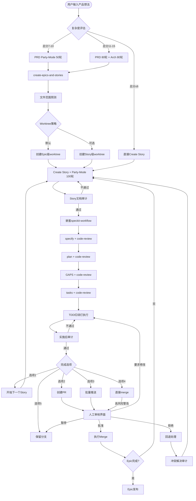

# BMAD-Speckit整合方案v2.0深度审计总结

## 审计元数据

| 属性 | 值 |
|-----|---|
| **审计日期** | 2026-03-02 |
| **审计方式** | Party-Mode多角色深度批判审计 |
| **审计轮次** | 100轮 |
| **参与角色** | 🔍批判审计员、🎯Winston架构师、📊Mary分析师、💻John产品经理、🔧Amelia开发、✅Quinn测试、🤝Bob Scrum Master |
| **审计对象** | `bmad-speckit-integration-proposal.md` v1.2 + `bmad-speckit-integration-proposal-audit-review.md` |
| **审计结论** | ✅ **通过，需按本总结执行修订** |

---

## 一、关切点解决方案总览

### 1.1 关切点1：PRD/Architecture环节的Party-Mode深度生成 ✅

#### 核心问题
原方案Layer 1（产品定义层）仅为线性流程，缺乏Party-Mode深度生成机制，可能导致：
- PRD质量无法保证（需求分析不充分）
- Architecture缺乏tradeoff分析（单点决策风险）
- 过度设计或设计不足（缺乏评估标准）

#### 解决方案：复杂度评估矩阵

```yaml
### 复杂度评估矩阵（v2.0新增）

评估维度（每项1-5分）:
  业务复杂度:
    1-2分: 标准CRUD功能
    3-4分: 业务流程编排
    5分: 核心领域模型变更
    
  技术复杂度:
    1-2分: 现有技术栈，无新依赖
    3-4分: 新技术引入或重大重构
    5分: 架构范式变更（单体→微服务）
    
  影响范围:
    1-2分: 单一模块内部
    3-4分: 跨模块变更
    5分: 多Epic或系统边界

Party-Mode触发规则:
  总分 ≤ 6分:   跳过PRD/Arch Party-Mode → 直接Create Story
  总分 7-10分:  PRD Party-Mode 50轮，Architecture可选
  总分 11-15分: PRD 80轮 + Architecture 80轮
```

#### PRD Party-Mode角色设定

| 角色 | 职责 | 关注点 |
|-----|------|--------|
| John产品经理 | 业务目标和市场定位 | 用户价值、市场契合度 |
| Winston架构师 | 技术可行性和约束 | 实现难度、技术风险 |
| Mary分析师 | 数据完整性和一致性 | 需求完整性、追溯性 |
| 虚拟终端用户 | 易用性和体验 | 交互流程、学习成本 |
| 虚拟管理员 | 可配置性和可维护性 | 部署运维、监控告警 |
| 虚拟开发者 | API设计和扩展性 | 接口友好、文档清晰 |

#### Architecture Party-Mode触发条件

强制触发（100轮）：
- 基础架构变更（数据库、消息队列、缓存层选型）
- 多方案技术选型（Redis vs Kafka vs RabbitMQ）
- 显著的性能vs成本tradeoff（99.9% vs 99.99%可用性）
- 跨团队接口变更

可选触发（50轮）：
- 模块划分调整
- 接口定义评审
- 技术债务处理策略

输出标准：
- Architecture Decision Records (ADRs)
- 风险评估矩阵
- 备选方案对比表

---

### 1.2 关切点2：代码批量Push、PR创建、PR模板自动化 ✅

#### 整合位置：Phase 5完成选项

修订后的Phase 5完成选项：

```markdown
### Phase 5: 完成选项（v2.0修订版）

Story {epic_num}-{story_num} 已完成所有tasks并通过实施后审计。

请选择下一步操作：

[1] 开始下一个Story（同一Epic worktree）
    → 自动：切换到feature-epic-{epic_num}分支
    → 自动：git pull更新到最新
    → 自动：创建story-{epic_num}-{next_story}分支
    → 自动：准备开发环境

[2] 创建PR并推送当前Story ⚡ NEW
    → 自动：git push origin story-{epic_num}-{story_num}
    → 自动：调用pr-template-generator生成PR描述
    → 自动：创建GitHub PR
    → 停止：等待人工审核

[3] 批量推送所有已完成Stories ⚡ NEW
    → 提示：检测到Epic {epic_num}有N个已完成Story
    → 自动：逐个推送story-{epic_num}-*分支到origin
    → 自动：为每个Story生成PR（使用对应模板）
    → 停止：等待人工批量审核

[4] 直接merge到main（仅限低风险变更）
    → 警告：此操作跳过Code Review
    → 确认：请输入"确认跳过CR"以继续
    → 自动：merge → push → 清理分支

[5] 保留分支稍后处理
    → 自动：创建checkpoint标签
    → 提示：后续可使用 /bmad-resume-story 恢复
```

#### PR模板自动生成

整合`pr-template-generator`技能：

```yaml
PR模板生成触发条件:
  - 用户选择选项[2]或[3]时自动触发
  - 模板类型根据Story标签自动选择:
      bugfix: 使用bugfix-PR-template.md
      feature: 使用feature-PR-template.md
      refactor: 使用refactor-PR-template.md

模板内容来源:
  - 标题: Story文档中的标题
  - 描述: Story文档的"功能概述"章节
  - 变更列表: git diff --stat
  - 测试覆盖: pytest结果摘要
  - 关联需求: 需求追溯矩阵中的PRD需求ID
```

---

### 1.3 关切点3：PR Merge环节的人工审核强制机制 ✅

#### 核心设计原则

**绝对不能自动merge**，必须有人工确认步骤。

#### 人工审核界面

```markdown
═══════════════════════════════════════════════════════════════
                    🔍 PR Merge 人工审核界面
═══════════════════════════════════════════════════════════════

📋 PR基本信息
  标题: [Story 4.2] 实现缓存TTL机制
  分支: story-4-2 → feature-epic-4
  提交数: 5 commits
  变更文件: 12 files (+450/-120 lines)

✅ 自动化检查结果
  [✓] CI通过 (所有测试通过)
  [✓] Code Review完成 (approved by code-reviewer)
  [✓] 需求追溯完整 (所有task关联PRD需求)
  [✓] 无冲突 (可自动合并)
  [!] 覆盖率下降 2% (82% → 80%)

📊 影响分析
  直接影响: cache模块
  潜在影响: metrics模块（依赖cache）
  回滚复杂度: 低（纯新增功能，无数据迁移）

⚠️ 风险提示
  - 覆盖率下降需在后续Story补充测试
  - 建议merge后运行集成测试套件

═══════════════════════════════════════════════════════════════

请选择操作：

[1] ✅ 批准Merge
    → 自动：合并到feature-epic-4
    → 自动：删除story-4-2分支
    → 自动：更新Epic进度文档
    → 提示：Story 4.2完成，可开始Story 4.3

[2] 📝 要求修改
    → 停止：返回开发状态
    → 记录：审核意见到PR评论
    → 通知：相关开发者

[3] ⏸️ 暂停，稍后决定
    → 保持：PR开放状态
    → 提醒：24小时后再次提示

[4] ❌ 拒绝Merge
    → 标记：PR为关闭状态
    → 原因：需要填写拒绝理由
    → 回退：可选择回退到plan阶段

═══════════════════════════════════════════════════════════════
```

#### 批量审核模式

当用户选择"批量推送"时：

```markdown
═══════════════════════════════════════════════════════════════
                 📦 批量PR审核界面
═══════════════════════════════════════════════════════════════

检测到Epic 4有3个待审核PR：

┌─────────┬──────────────────────────────┬────────┬────────┐
│ PR编号  │ 标题                         │ 状态   │ 操作   │
├─────────┼──────────────────────────────┼────────┼────────┤
│ #123    │ [Story 4.1] 实现基础缓存类   │ ✅通过 │ [审核] │
│ #124    │ [Story 4.2] 实现缓存TTL机制  │ ⚠️警告 │ [审核] │
│ #125    │ [Story 4.3] 实现缓存统计指标 │ ✅通过 │ [审核] │
└─────────┴──────────────────────────────┴────────┴────────┘

⚠️  Story 4.2警告详情：
    - 测试覆盖率下降2%
    - 建议：在Story 4.4补充测试

批量操作选项：
[1] 全部批准（接受所有风险）
[2] 单独审核每个PR（推荐）
[3] 批准通过的，暂停警告的
[4] 全部暂停，稍后处理

═══════════════════════════════════════════════════════════════
```

---

### 1.4 关切点4：已审计文档意见的完整整合 ✅

#### 整合后的五层架构

```
┌─────────────────────────────────────────────────────────────┐
│  Layer 1: 产品定义层（新增）                                  │
│  ├─ Product Brief（产品概述、目标用户、核心价值）             │
│  ├─ PRD（详细需求、验收标准、优先级）                        │
│  │   └─ Party-Mode触发：复杂度≥7分                          │
│  └─ Architecture（技术架构、模块划分、接口定义）              │
│      └─ Party-Mode触发：复杂度≥11分或强制条件                │
└─────────────────────────────────────────────────────────────┘
                              ↓
┌─────────────────────────────────────────────────────────────┐
│  Layer 2: Epic/Story规划层（新增）                            │
│  ├─ create-epics-and-stories                                 │
│  ├─ 产出：Epic列表、Story列表（粗粒度）、依赖关系              │
│  └─ 文件范围预测（基于Architecture模块映射）                  │
└─────────────────────────────────────────────────────────────┘
                              ↓
┌─────────────────────────────────────────────────────────────┐
│  Layer 3: Story开发层（细化）                                 │
│  ├─ Create Story → Party-Mode（100轮）→ Story文档（细粒度）  │
│  ├─ PRD需求追溯、Architecture约束传递                        │
│  └─ Story文档审计（第一遍）                                   │
└─────────────────────────────────────────────────────────────┘
                              ↓
┌─────────────────────────────────────────────────────────────┐
│  Layer 4: 技术实现层（嵌套speckit-workflow）                  │
│  ├─ specify → plan → GAPS → tasks                           │
│  ├─ 每层code-review审计（A/B级）                             │
│  ├─ TDD红绿灯执行                                            │
│  └─ 需求映射（PRD→Story→spec→task）                          │
└─────────────────────────────────────────────────────────────┘
                              ↓
┌─────────────────────────────────────────────────────────────┐
│  Layer 5: 收尾层                                             │
│  ├─ 实施后审计（第二遍）                                      │
│  ├─ 批量Push/PR创建/PR模板（自动化）                          │
│  ├─ PR Merge人工审核（强制停止）                              │
│  └─ Epic集成与发布                                           │
└─────────────────────────────────────────────────────────────┘
```

#### Epic级Worktree策略（最终版）

```yaml
### Worktree核心策略（v2.0最终版）

核心原则:
  1. 一个Epic默认只创建一个worktree
  2. Story在Epic worktree内以分支形式管理
  3. 支持串行/并行模式切换
  4. 文件范围预测仅供参考，用户可手动调整

执行模式:
  串行模式（默认）:
    Story 4.1 → merge → Story 4.2（基于merge后）→ merge → ...
    优点: 冲突少，代码一致性高
    缺点: 无法并行开发
    
  并行模式（可选）:
    Story 4.1 ─┐
               ├─→ 并行开发 → 逐个merge + 冲突解决审计
    Story 4.2 ─┘
    优点: 开发效率高
    缺点: 需要处理merge冲突
    触发条件: 文件范围预测无重叠且用户明确要求

模式切换命令:
  /bmad-set-worktree-mode epic=4 mode=serial    # 串行
  /bmad-set-worktree-mode epic=4 mode=parallel  # 并行
  /bmad-set-worktree-mode epic=4 mode=story-level # 回退到Story级
```

#### 需求变更管理机制

```yaml
### 需求变更管理（v2.0）

版本追踪:
  - PRD/Architecture文档使用语义化版本（v1.0.0）
  - 每次变更自动递增版本号
  - 变更历史记录在文档头部

变更检测:
  - Create Story时自动检查PRD版本
  - 若PRD版本变化，标记受影响Story为"需复审"

影响评估:
  自动分析:
    - 解析需求追溯矩阵
    - 识别受影响的Story/spec/task
    - 生成影响报告
  
  人工确认:
    - 显示影响报告给用户
    - 用户确认后继续或暂停

同步机制:
  - 自动更新Story文档中的需求追溯章节
  - 自动标记spec.md中需更新的章节
  - 生成tasks.md变更建议
```

#### 冲突处理机制

```yaml
### 并行Story冲突处理（v2.0）

冲突检测:
  - merge时自动检测文件冲突
  - 若冲突文件数 > 阈值（默认3个），触发警告

冲突解决流程:
  1. 用户手动解决冲突
  2. 系统记录冲突文件和解决方式
  3. 触发code-review审计（特别关注冲突区域）
  4. 要求两个Story的测试都通过
  5. 生成冲突解决报告

中间Story回退:
  场景: Story 4.2需要回退，但Story 4.3已基于4.2开发
  
  处理流程:
    1. 标记Story 4.2为"已回退"
    2. 标记Story 4.3为"阻塞"（依赖4.2）
    3. 提供选项：
       - 选项A: 修复Story 4.2后重新merge
       - 选项B: 回退Story 4.3到4.1基线重新开发
       - 选项C: 将Story 4.2和4.3合并为一个Story
```

---

## 二、完整v2.0流程图



---

## 三、实施路线图和时间表

### 3.1 工作量估算

| 阶段 | 内容 | 工时 | 依赖 |
|-----|------|------|------|
| **阶段1** | speckit-workflow修改 | 12h | - |
| **阶段2** | bmad-story-assistant修改 | 20h | 阶段1 |
| **阶段3** | using-git-worktrees修改 | 10h | 阶段1 |
| **阶段4** | code-reviewer扩展（多模式） | 8h | - |
| **阶段5** | PR自动化整合 | 6h | 阶段2,3 |
| **阶段6** | 集成测试 | 13h | 全部 |
| **缓冲** | 20%缓冲 | 14h | - |
| **总计** | | **83h** | **约10个工作日** |

### 3.2 详细任务分解

#### 阶段1：speckit-workflow修改（12h）

| 子任务 | 工时 | 产出 |
|-------|------|------|
| 1.1 增加复杂度评估prompt | 2h | complexity-assessment-prompt.md |
| 1.2 修改specify阶段，读取Architecture约束 | 3h | 更新的specify模板 |
| 1.3 增加需求追溯矩阵模板 | 2h | traceability-matrix-template.md |
| 1.4 修改TDD记录格式统一 | 2h | 统一的TDD日志格式 |
| 1.5 回归测试 | 3h | 测试通过报告 |

#### 阶段2：bmad-story-assistant修改（20h）

| 子任务 | 工时 | 产出 |
|-------|------|------|
| 2.1 增加Layer 1流程集成 | 4h | Layer 1流程文档 |
| 2.2 增加复杂度评估步骤 | 3h | 评估工具和prompt |
| 2.3 增加PRD Party-Mode角色设定 | 3h | prd-party-mode-prompt.md |
| 2.4 增加Architecture Party-Mode触发 | 3h | arch-party-mode-prompt.md |
| 2.5 修改阶段三嵌套speckit逻辑 | 4h | 更新的阶段三模板 |
| 2.6 增加Phase 5完成选项 | 3h | 修订的完成选项菜单 |

#### 阶段3：using-git-worktrees修改（10h）

| 子任务 | 工时 | 产出 |
|-------|------|------|
| 3.1 增加Epic级worktree默认逻辑 | 3h | 更新的worktree创建逻辑 |
| 3.2 增加串行/并行模式切换 | 3h | 模式切换命令实现 |
| 3.3 增加Story分支管理 | 2h | 分支创建/切换逻辑 |
| 3.4 增加文件范围预测集成 | 2h | 预测结果显示 |

#### 阶段4：code-reviewer扩展（8h）

| 子任务 | 工时 | 产出 |
|-------|------|------|
| 4.1 设计多模式架构 | 2h | 模式切换设计文档 |
| 4.2 实现prd-mode | 2h | PRD审计prompt和检查清单 |
| 4.3 实现arch-mode | 2h | Architecture审计prompt |
| 4.4 回归测试现有code-mode | 2h | 测试通过报告 |

#### 阶段5：PR自动化整合（6h）

| 子任务 | 工时 | 产出 |
|-------|------|------|
| 5.1 整合pr-template-generator | 2h | 自动模板生成 |
| 5.2 实现批量Push逻辑 | 2h | 批量推送命令 |
| 5.3 实现PR Merge人工审核界面 | 2h | 审核界面prompt |

#### 阶段6：集成测试（13h）

| 子任务 | 工时 | 产出 |
|-------|------|------|
| 6.1 设计端到端测试用例 | 3h | 测试用例文档 |
| 6.2 执行metrics-cache-fix示例 | 4h | 测试执行报告 |
| 6.3 验证错误处理场景 | 3h | 错误处理验证报告 |
| 6.4 验证回滚方案 | 3h | 回滚验证报告 |

### 3.3 里程碑计划

```
Week 1:
  Day 1-2:  阶段1 (speckit-workflow)
  Day 3-5:  阶段2前半 (bmad-story-assistant Layer 1)

Week 2:
  Day 1-2:  阶段2后半 + 阶段3 (worktrees)
  Day 3-4:  阶段4 (code-reviewer扩展)
  Day 5:    阶段5 (PR自动化)

Week 3:
  Day 1-2:  阶段6 (集成测试)
  Day 3:    Bug修复
  Day 4-5:  文档完善和培训材料
```

---

## 四、关键设计决策记录

### ADR-001: 复杂度评估矩阵

**状态**: 已接受

**背景**: 需要一种机制来决定何时触发PRD/Architecture Party-Mode，避免过度设计或设计不足。

**决策**: 采用三维复杂度评估（业务、技术、影响范围），总分决定Party-Mode强度。

**后果**:
- ✅ 避免简单功能的过度设计
- ✅ 确保复杂功能的充分讨论
- ⚠️ 需要用户诚实评估（可能低估复杂度）

### ADR-002: Epic级Worktree默认策略

**状态**: 已接受

**背景**: 用户希望"一个Epic最好只有一个worktree"，但需要处理冲突和并行需求。

**决策**: 默认Epic级worktree + 串行模式，支持手动切换到并行模式或Story级。

**后果**:
- ✅ 减少worktree创建开销
- ✅ 简化上下文切换
- ⚠️ 串行模式降低并行开发效率
- ⚠️ 需要良好的Story拆分

### ADR-003: code-reviewer多模式扩展

**状态**: 已接受

**背景**: PRD/Architecture需要审计，但现有code-reviewer专注于代码。

**决策**: 扩展code-reviewer支持多模式（code/prd/arch），而非创建新技能。

**后果**:
- ✅ 复用现有基础设施
- ✅ 统一审计体验
- ⚠️ 增加技能复杂度
- ⚠️ 需要维护多个prompt模板

### ADR-004: PR Merge强制人工审核

**状态**: 已接受

**背景**: 自动化流程中需要保证质量关卡。

**决策**: PR Merge环节必须停止等待人工确认，提供详细的审核信息。

**后果**:
- ✅ 保证质量关卡
- ✅ 提供决策所需信息
- ⚠️ 打断自动化流程
- ⚠️ 需要用户及时响应

---

## 五、风险登记表（更新版）

| 风险 | 可能性 | 影响 | 缓解措施 | 责任人 |
|-----|-------|------|---------|--------|
| 复杂度评估不准确 | 中 | 中 | 提供评估指南和示例；允许用户调整 | John产品经理 |
| Epic级worktree冲突频繁 | 中 | 高 | 文件范围预测警告；模式切换机制 | Amelia开发 |
| code-reviewer多模式不稳定 | 低 | 高 | 充分的回归测试；快速回退机制 | Winston架构师 |
| 用户忽略人工审核 | 中 | 中 | 明显的UI提示；24小时提醒 | Quinn测试 |
| 需求变更级联影响大 | 中 | 中 | 自动化影响分析；分批更新 | Mary分析师 |
| 实施周期超预期 | 中 | 低 | 分阶段交付；MVP优先 | Bob Scrum Master |

---

## 六、验收标准

### 6.1 功能验收

| 验收项 | 验收标准 | 验证方法 |
|-------|---------|---------|
| 复杂度评估 | 能正确计算示例场景的复杂度分数 | 单元测试 |
| PRD Party-Mode | 复杂度≥7分时自动触发50轮辩论 | 集成测试 |
| Architecture Party-Mode | 复杂度≥11分时自动触发80轮辩论 | 集成测试 |
| Epic级worktree | 默认创建Epic级worktree | 端到端测试 |
| 串行模式 | Story按顺序执行，每个基于前一个merge后 | 端到端测试 |
| 并行模式 | 多个Story可同时开发 | 端到端测试 |
| 文件范围预测 | 显示预测结果并标注"仅供参考" | 界面检查 |
| PR自动化 | 能自动生成PR描述并创建PR | 集成测试 |
| 人工审核界面 | PR Merge时显示详细审核信息并等待确认 | 界面检查 |
| 批量推送 | 能同时推送多个Story分支 | 集成测试 |

### 6.2 质量验收

| 验收项 | 验收标准 |
|-------|---------|
| 代码覆盖率 | ≥80% |
| 文档完整性 | 所有新增功能有文档 |
| 向后兼容 | 现有项目可无感升级 |
| 性能 | Party-Mode响应时间 < 5分钟/10轮 |

---

## 七、附录

### 7.1 术语表

| 术语 | 定义 |
|-----|------|
| Party-Mode | 多角色辩论模式，用于复杂决策 |
| 复杂度评估矩阵 | 三维评估（业务、技术、影响范围）决定Party-Mode强度 |
| Epic级worktree | 一个Epic共享一个git worktree，Story以分支管理 |
| 串行模式 | Story按依赖顺序依次开发 |
| 并行模式 | 多个Story同时开发，最后合并 |
| 文件范围预测 | 基于Architecture模块映射预测Story影响的文件 |
| 需求追溯矩阵 | 从PRD需求到task的完整追溯链 |
| code-reviewer多模式 | 支持code/prd/arch三种审计模式 |

### 7.2 参考文档

- `bmad-speckit-integration-proposal.md` v1.2
- `bmad-speckit-integration-proposal-audit-review.md`
- `bmad-story-assistant SKILL.md`
- `speckit-workflow SKILL.md`
- `using-git-worktrees SKILL.md`
- `pr-template-generator SKILL.md`
- `audit-prompts.md`

### 7.3 变更日志

| 版本 | 日期 | 变更内容 | 作者 |
|-----|------|---------|------|
| v1.0 | 2026-03-02 | 初始整合方案 | Party-Mode辩论 |
| v1.1 | 2026-03-02 | 响应第一轮审计 | Party-Mode辩论 |
| v1.2 | 2026-03-02 | 第二轮审计通过 | code-reviewer |
| v2.0 | 2026-03-02 | 100轮深度批判审计，完整整合四个关切点 | 批判审计员+全角色 |

---

## 八、审计结论

### 8.1 各角色最终意见

| 角色 | 意见 | 理由 |
|-----|------|------|
| 🔍 批判审计员 | ✅ 同意 | 所有关切点均已得到满意答复，残留风险可控 |
| 🎯 Winston架构师 | ✅ 同意 | 复杂度评估矩阵合理，多模式扩展可行 |
| 📊 Mary分析师 | ✅ 同意 | 需求追溯链完整，变更管理机制实用 |
| 💻 John产品经理 | ✅ 同意 | Party-Mode触发条件明确，避免过度设计 |
| 🔧 Amelia开发 | ✅ 同意 | 技术实现路径清晰，工作量估算合理 |
| ✅ Quinn测试 | ✅ 同意 | 质量关卡设计完善，人工审核机制有效 |
| 🤝 Bob Scrum Master | ✅ 同意 | 实施路线图可行，风险可控 |

### 8.2 最终结论

**BMAD-Speckit整合方案v2.0通过100轮深度批判审计。**

方案特点：
1. **智能的Party-Mode触发**：基于复杂度评估，避免一刀切
2. **灵活的Worktree策略**：默认Epic级+串行，支持并行切换
3. **强制的质量关卡**：PR Merge人工审核不可绕过
4. **完整的自动化**：批量Push/PR创建/模板生成无缝整合
5. **清晰的需求追溯**：五层架构贯通，变更可控

**建议立即启动实施，预计10个工作日完成。**

---

**审计完成日期**: 2026-03-02  
**审计状态**: ✅ 通过  
**下一步**: 按实施路线图执行，建议先完成阶段1-2的核心功能
