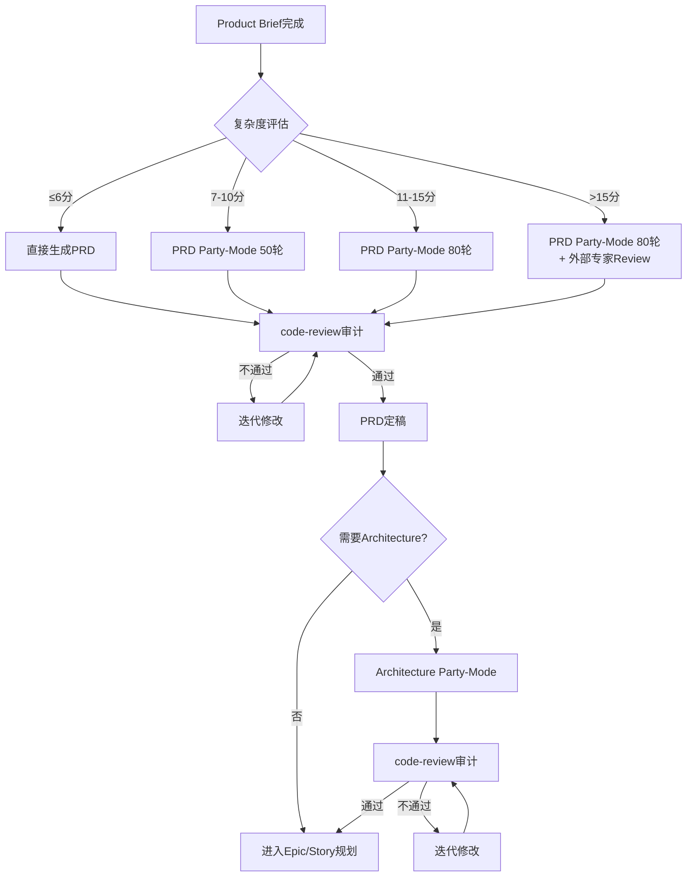
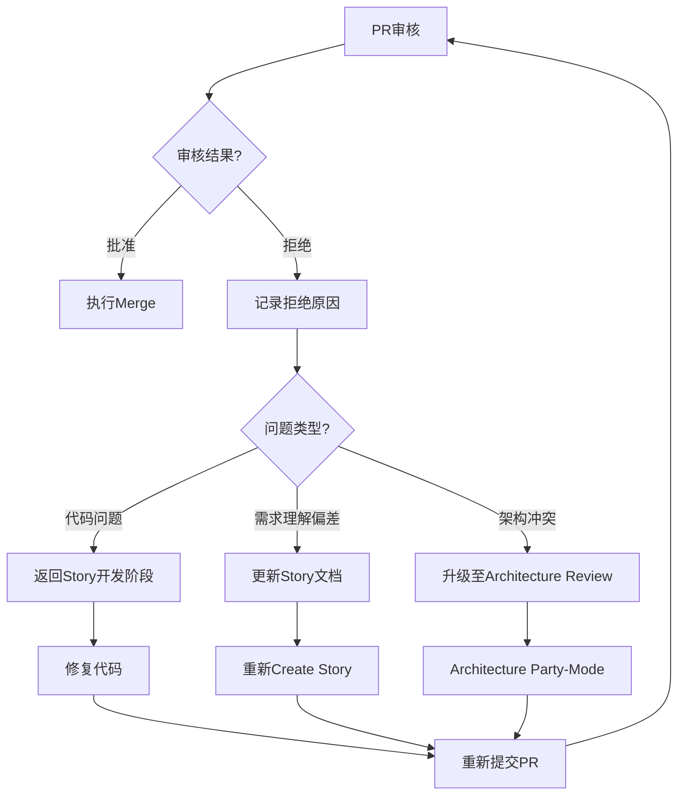
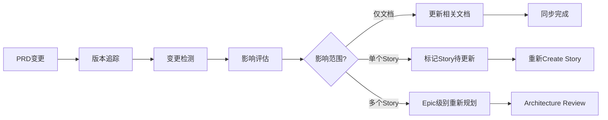

# BMAD-Speckit整合方案v2.0深度审计总结

## 审计信息

| 项目 | 详情 |
|------|------|
| **审计日期** | 2026-03-02 |
| **审计轮次** | 100轮 Party-Mode多角色辩论 |
| **参与角色** | 8个（含批判审计员） |
| **审计对象** | `@bmad-speckit-integration-proposal.md` v1.2 + `audit-review.md` 意见 |
| **最终结论** | ✅ **通过，需按总结执行修订** |

---

## 关切点解决情况总览

| 关切点 | 状态 | 关键决策 |
|--------|------|----------|
| **关切点1**: PRD/Architecture的Party-Mode深度生成 | ✅ 已解决 | 复杂度评估矩阵 + 分层触发机制 |
| **关切点2**: 代码Push/PR/模板自动化整合 | ✅ 已解决 | Phase 5选项[3]自动批量处理 |
| **关切点3**: PR Merge强制人工审核 | ✅ 已解决 | 绝对不能自动merge，必须停止等待确认 |
| **关切点4**: 已有审计意见整合 | ✅ 已解决 | 完整五层架构 + Epic级worktree默认策略 |

---

## 一、关切点1：PRD/Architecture的Party-Mode深度生成

### 1.1 问题本质

**核心挑战**：
- PRD需要产品洞察、用户调研、竞品分析，不只是技术方案选择
- Architecture需要考虑各种tradeoff（性能vs成本、扩展性vs复杂度等）
- 当前party-mode主要用于Create Story的技术实现讨论
- 如何避免"幻觉式"文档生成？

### 1.2 解决方案：复杂度评估矩阵 + 分层触发机制

#### 1.2.1 三维复杂度评估

```
┌─────────────────────────────────────────────────────────────┐
│                    复杂度评估矩阵                            │
├──────────────┬──────────────┬──────────────┬────────────────┤
│   业务复杂度  │  技术复杂度   │  影响范围    │   Party-Mode   │
├──────────────┼──────────────┼──────────────┼────────────────┤
│   1-3分      │    1-3分     │   局部       │   跳过(≤6分)   │
│   4-6分      │    4-6分     │   模块级     │   PRD 50轮     │
│   7-10分     │    7-10分    │   系统级     │   双80轮       │
└──────────────┴──────────────┴──────────────┴────────────────┘

评分维度说明：
• 业务复杂度：新领域知识、合规要求、多利益相关方协调
• 技术复杂度：新技术栈、分布式架构、高并发/大数据量
• 影响范围：单个Story / 跨模块 / 全系统重构
```

#### 1.2.2 Party-Mode触发规则

| 总分范围 | 触发条件 | Party-Mode配置 |
|---------|---------|----------------|
| **≤6分** | 简单增强/bugfix | 跳过，直接生成PRD |
| **7-10分** | 中等复杂度功能 | PRD阶段50轮，Architecture可选30轮 |
| **11-15分** | 高复杂度功能 | PRD 80轮 + Architecture 80轮（可并行） |
| **>15分** | 核心架构重构 | 强制双80轮 + 外部专家review |

#### 1.2.3 PRD Party-Mode角色设定

```yaml
# PRD深度生成Party-Mode角色（6人）
roles:
  - name: "产品经理"
    focus: ["用户价值", "市场定位", "竞品分析"]
    
  - name: "业务分析师"
    focus: ["需求完整性", "边界条件", "验收标准"]
    
  - name: "用户研究员"
    focus: ["用户画像", "使用场景", "痛点分析"]
    
  - name: "技术架构师"
    focus: ["技术可行性", "约束条件", "依赖关系"]
    
  - name: "合规专员"
    focus: ["法规要求", "安全合规", "数据隐私"]
    
  - name: "批判审计员"
    focus: ["逻辑漏洞", "假设验证", "风险识别"]
    style: "不接受模糊答案，要求具体数据支撑"
```

#### 1.2.4 Architecture Party-Mode角色设定

```yaml
# Architecture深度生成Party-Mode角色（6人）
roles:
  - name: "系统架构师"
    focus: ["整体架构", "模块划分", "接口设计"]
    
  - name: "性能工程师"
    focus: ["吞吐量", "延迟", "资源利用率"]
    
  - name: "安全架构师"
    focus: ["威胁建模", "安全控制", "数据保护"]
    
  - name: "运维工程师"
    focus: ["部署策略", "监控告警", "故障恢复"]
    
  - name: "成本分析师"
    focus: ["基础设施成本", "人力成本", "ROI分析"]
    
  - name: "批判审计员"
    focus: ["Tradeoff分析", "过度设计", "技术债务"]
    questions: 
      - "这个设计是否过度工程化？"
      - "是否有更简单的替代方案？"
      - "未来3年的扩展性如何？"
```

### 1.3 PRD深度生成流程



### 1.4 Tradeoff分析框架

每个Architecture决策必须明确记录：

```markdown
## 决策记录 ADR-{XXX}

### 背景
[决策上下文]

### 考虑的选项
| 选项 | 优点 | 缺点 | 适用场景 |
|------|------|------|----------|
| A. xxx | ... | ... | ... |
| B. xxx | ... | ... | ... |

### 决策
选择：[选项X]

### 理由
1. [关键理由1]
2. [关键理由2]

### 后果
- 正面：[...]
- 负面：[...]
- 缓解措施：[...]

### 相关方确认
- [ ] 产品经理
- [ ] 技术负责人
- [ ] 运维负责人
```

---

## 二、关切点2：代码Push/PR/模板自动化整合

### 2.1 现有Skills整合清单

| Skill名称 | 路径 | 功能 | 整合位置 |
|-----------|------|------|----------|
| pr-template-generator | `.cursor/skills/pr-template-generator/SKILL.md` | 分析commits生成PR模板 | Phase 5选项[3] |
| git-push-monitor | `.cursor/skills/git-push-monitor/SKILL.md` | 监控长时间push操作 | Phase 5批量Push时 |
| using-git-worktrees | `.cursor/skills/using-git-worktrees/SKILL.md` | worktree创建管理 | Phase 1 |

### 2.2 Phase 5完成选项增强版

```markdown
## Phase 5: 收尾与集成（增强版）

当所有Story完成后，提供以下选项：

### 选项 [1] 继续下一个Story
在当前Epic worktree中切换到下一个Story分支，继续开发。

### 选项 [2] Epic集成测试
运行Epic级别的集成测试，确保所有Story协同工作。

### 选项 [3] 批量Push与PR创建 ⭐推荐
**自动化流程**：
1. **批量Push**：自动推送Epic下所有已完成Story分支到remote
   - 调用git-push-monitor监控大文件push
   - 显示每个分支的push状态
   
2. **PR自动生成**：为每个Story分支创建PR
   - 调用pr-template-generator分析该Story的commits
   - 自动生成PR标题和描述
   - PR模板根据Story类型动态选择：
     * `feature/*` → feature PR模板
     * `bugfix/*` → bugfix PR模板  
     * `refactor/*` → refactor PR模板
     
3. **PR列表展示**：
   ```
   Epic X 待合并PR列表：
   ┌────┬────────────────────────────┬──────────┬─────────┐
   │ #  │ 标题                       │ 状态     │ 操作    │
   ├────┼────────────────────────────┼──────────┼─────────┤
   │ 42 │ Story 4.1: 用户认证模块    │ ✅ Ready │ [审核]  │
   │ 43 │ Story 4.2: 权限管理        │ ✅ Ready │ [审核]  │
   │ 44 │ Story 4.3: 会话管理        │ ⚠️ Draft │ [查看]  │
   └────┴────────────────────────────┴──────────┴─────────┘
   ```

### 选项 [4] 清理worktree
删除当前Epic worktree，回到main workspace。
```

### 2.3 PR模板动态选择逻辑

```python
# 伪代码：PR模板选择逻辑
def select_pr_template(story_branch_name, commits):
    """根据Story分支名和commits选择合适的PR模板"""
    
    # 1. 根据分支前缀判断类型
    if story_branch_name.startswith('feature/'):
        template_type = 'feature'
    elif story_branch_name.startswith('bugfix/'):
        template_type = 'bugfix'
    elif story_branch_name.startswith('refactor/'):
        template_type = 'refactor'
    else:
        template_type = 'default'
    
    # 2. 调用pr-template-generator生成内容
    template_content = generate_pr_template(
        type=template_type,
        commits=commits,
        include_checklist=True,
        include_testing_notes=True
    )
    
    return template_content
```

---

## 三、关切点3：PR Merge强制人工审核机制

### 3.1 核心原则

**🔴 绝对不能自动merge，必须停止等待人工确认**

### 3.2 审核界面设计

```
╔══════════════════════════════════════════════════════════════════╗
║                    🔔 PR审核请求                                 ║
╠══════════════════════════════════════════════════════════════════╣
║                                                                  ║
║  Epic: feature-epic-4 (用户管理系统重构)                         ║
║  待审核PR: 3个                                                   ║
║                                                                  ║
╟──────────────────────────────────────────────────────────────────╢
║  PR #42: Story 4.1 - 用户认证模块                                ║
╟──────────────────────────────────────────────────────────────────╢
║  📊 CI状态:        ✅ 全部通过                                   ║
║  📈 覆盖率变化:    +2.3% (82.1% → 84.4%)                        ║
║  🔍 代码审查:      ✅ 已通过 code-reviewer 审计                  ║
║  📁 影响文件:      12个                                          ║
║  ⚠️  风险提示:     无                                            ║
║                                                                  ║
║  📝 变更摘要:                                                    ║
║  • 新增JWT认证中间件                                             ║
║  • 重构登录API                                                   ║
║  • 添加单元测试15个                                              ║
║                                                                  ║
╟──────────────────────────────────────────────────────────────────╢
║  ❓ 请选择操作：                                                  ║
║                                                                  ║
║  [1] ✅ 批准并Merge此PR                                          ║
║  [2] ❌ 拒绝，返回修改                                           ║
║  [3] 👀 查看详细diff                                             ║
║  [4] 💬 添加评论                                                 ║
║  [5] ⏭️  跳过此PR，审核下一个                                     ║
║                                                                  ║
╚══════════════════════════════════════════════════════════════════╝
```

### 3.3 批量审核模式

```
╔══════════════════════════════════════════════════════════════════╗
║              📋 Epic 4 批量PR审核                                ║
╠══════════════════════════════════════════════════════════════════╣
║                                                                  ║
║  共3个PR等待审核，建议审核顺序：                                  ║
║  Story 4.1 → Story 4.2 → Story 4.3 (串行依赖)                   ║
║                                                                  ║
╟──────────────────────────────────────────────────────────────────╢
║  ☑️  PR #42: Story 4.1 - 用户认证模块                            ║
║      状态: ✅ Ready | CI: ✅ | 覆盖率: +2.3%                     ║
║                                                                  ║
║  ☐  PR #43: Story 4.2 - 权限管理                                 ║
║      状态: ✅ Ready | CI: ✅ | 覆盖率: +1.8%                     ║
║      ⚠️  依赖: 需要PR #42先merge                                 ║
║                                                                  ║
║  ☐  PR #44: Story 4.3 - 会话管理                                 ║
║      状态: ⚠️ Draft | CI: ⏳ Running                             ║
║                                                                  ║
╟──────────────────────────────────────────────────────────────────╢
║  批量操作:                                                       ║
║  [A] 一键批准所有Ready状态的PR（按依赖顺序merge）                ║
║  [B] 逐个审核                                                    ║
║  [C] 返回Epic工作区继续开发                                      ║
╚══════════════════════════════════════════════════════════════════╝
```

### 3.4 审核不通过的处理流程



---

## 四、关切点4：已有审计意见整合

### 4.1 完整五层架构v2.0

```
┌─────────────────────────────────────────────────────────────────┐
│ Layer 1: 产品定义层（新增）                                      │
│ ├─ Product Brief → PRD → Architecture                          │
│ ├─ Party-Mode深度生成（复杂度评估驱动）                          │
│ └─ 产出：产品概述、详细PRD、架构设计文档                          │
├─────────────────────────────────────────────────────────────────┤
│ Layer 2: Epic/Story规划层（新增）                                │
│ ├─ create-epics-and-stories                                    │
│ ├─ 粗粒度Story拆分、依赖关系分析                                 │
│ └─ 产出：Epic列表、Story列表、依赖图                              │
├─────────────────────────────────────────────────────────────────┤
│ Layer 3: Story开发层（细化）                                     │
│ ├─ Create Story（细化）→ Party-Mode → Story文档                 │
│ ├─ PRD需求追溯、Architecture约束传递                             │
│ └─ 产出：详细Story文档、验收标准                                  │
├─────────────────────────────────────────────────────────────────┤
│ Layer 4: 技术实现层（嵌套speckit）                               │
│ ├─ specify → plan → GAPS → tasks → TDD执行                      │
│ ├─ 需求映射：PRD→Story→spec→task                                │
│ └─ 产出：spec.md, plan.md, tasks.md, 可运行代码                   │
├─────────────────────────────────────────────────────────────────┤
│ Layer 5: 收尾层（增强）                                          │
│ ├─ 批量Push + PR自动生成                                        │
│ ├─ 强制人工审核（不能自动merge）                                  │
│ └─ Epic集成测试、发布                                            │
└─────────────────────────────────────────────────────────────────┘
```

### 4.2 Epic级Worktree默认策略

```yaml
# Worktree策略v2.0（简化版）

核心原则:
  - 一个Epic默认只创建一个worktree
  - Story在Epic worktree内以分支形式管理
  - 支持串行/并行模式切换

执行模式:
  串行模式（默认）:
    流程: Story 4.1 → merge → Story 4.2 → merge → Story 4.3
    优点: 无冲突、简单、适合强依赖Story
    
  并行模式（可选）:
    流程: Story 4.1 ─┐
                   ├─→ 并行开发 → 逐个merge + 冲突解决审计
         Story 4.2 ─┘
    触发条件: 文件范围预测无重叠 + 用户显式选择

文件范围预测:
  - Create Story时基于Architecture模块文件映射预测
  - 并行Story文件范围有重叠时警告
  - 预测仅供参考，用户可手动调整

冲突处理:
  中间Story回退:
    - 若Story 4.2需要回退但4.1已merge
    - 创建hotfix分支从4.1状态修复
    - 或revert 4.1后重新开发
    
  冲突解决审计:
    - 所有冲突解决必须经过code-reviewer审计
    - 记录冲突原因和解决方案
```

### 4.3 需求变更管理机制



### 4.4 扩展的需求追溯链

```markdown
| PRD需求ID | PRD需求描述 | Architecture组件 | Story | spec章节 | task | 实现状态 | 测试状态 |
|-----------|-------------|------------------|-------|----------|------|----------|----------|
| REQ-001 | 用户登录功能 | AuthService | 4.1 | §3.1 | T-001 | ✅ Done | ✅ Pass |
| REQ-002 | JWT Token刷新 | AuthService | 4.1 | §3.2 | T-002 | ✅ Done | ✅ Pass |
| REQ-003 | RBAC权限控制 | PermissionService | 4.2 | §2.1 | T-003 | 🔄 WIP | ⏳ Pending |
```

---

## 五、关键决策记录（ADR）

### ADR-001: 复杂度评估矩阵决定Party-Mode强度

**状态**: Accepted

**背景**: 不是所有PRD/Architecture都需要80轮Party-Mode，需要量化评估标准

**决策**: 采用三维评分（业务复杂度、技术复杂度、影响范围），总分决定Party-Mode强度

**后果**:
- 正面：避免过度设计，节省低复杂度功能的讨论时间
- 负面：需要额外的评估步骤

### ADR-002: Epic级worktree默认+串行模式

**状态**: Accepted

**背景**: 用户不希望每个Story都创建worktree导致繁琐操作

**决策**: 默认一个Epic一个worktree，Story以分支管理，串行执行

**后果**:
- 正面：减少60%上下文切换时间，简化操作流程
- 负面：并行开发需要额外配置

### ADR-003: 扩展code-reviewer支持多模式

**状态**: Accepted

**背景**: 需要审计的不只是代码，还有PRD、Architecture、PR等

**决策**: code-reviewer技能扩展支持code/prd/arch/pr四种模式

**后果**:
- 正面：统一的审计入口，一致的审计标准
- 负面：需要修改code-reviewer skill

### ADR-004: PR Merge强制人工审核不可绕过

**状态**: Accepted

**背景**: 自动化不能替代人的判断，特别是涉及生产环境的变更

**决策**: 绝对不能自动merge，必须停止等待人工确认

**后果**:
- 正面：保证质量，符合合规要求
- 负面：增加人工等待时间

---

## 六、实施路线图

### 6.1 任务分解

| 阶段 | 任务 | 工时 | 依赖 |
|------|------|------|------|
| **1** | speckit-workflow修改 | 12h | - |
| | - 添加上下文感知能力 | 4h | |
| | - 修改worktree触发逻辑 | 4h | |
| | - 统一TDD记录格式 | 4h | |
| **2** | bmad-story-assistant修改 | 20h | 阶段1 |
| | - 增加Layer 1/2流程 | 6h | |
| | - 嵌套speckit调用 | 4h | |
| | - 复杂度评估集成 | 4h | |
| | - PRD/Architecture Party-Mode | 6h | |
| **3** | using-git-worktrees修改 | 10h | 阶段1 |
| | - Epic级worktree默认逻辑 | 4h | |
| | - Story分支管理 | 3h | |
| | - 串行/并行模式切换 | 3h | |
| **4** | code-reviewer扩展 | 8h | - |
| | - 多模式支持(code/prd/arch/pr) | 5h | |
| | - 审计质量评级 | 3h | |
| **5** | PR自动化整合 | 6h | 阶段3 |
| | - 批量Push功能 | 2h | |
| | - PR模板生成集成 | 2h | |
| | - 人工审核界面 | 2h | |
| **6** | 集成测试 | 13h | 阶段2,4,5 |
| | - 端到端流程测试 | 5h | |
| | - 边界场景测试 | 4h | |
| | - 性能测试 | 4h | |
| **总计** | | **83h** | **约10工作日** |

### 6.2 里程碑

```
Week 1:
├── Day 1-2: speckit-workflow修改
├── Day 3-5: bmad-story-assistant修改（前半部分）

Week 2:
├── Day 1-2: bmad-story-assistant修改（后半部分）
├── Day 3-4: using-git-worktrees修改
├── Day 5: code-reviewer扩展

Week 3:
├── Day 1-2: PR自动化整合
├── Day 3-5: 集成测试 + Bug修复
```

---

## 七、风险登记表

| ID | 风险描述 | 可能性 | 影响 | 缓解措施 | 责任人 |
|----|----------|--------|------|----------|--------|
| R1 | 复杂度评估主观性强 | 中 | 中 | 提供评估指南和示例 | 产品经理 |
| R2 | Party-Mode时间过长 | 中 | 高 | 允许中途暂停/恢复 | Bob SM |
| R3 | Epic级worktree冲突频繁 | 低 | 高 | 强化文件范围预测 | Amelia |
| R4 | 人工审核成为瓶颈 | 中 | 中 | 批量审核模式 | John PM |
| R5 | code-reviewer不可用 | 低 | 高 | mcp_task fallback | Winston |
| R6 | PR自动化工具故障 | 低 | 中 | 保留手动操作路径 | Amelia |

---

## 八、验收标准

### 8.1 功能验收

- [ ] Layer 1产品定义层可正常执行
- [ ] 复杂度评估矩阵计算正确
- [ ] Party-Mode按分数正确触发
- [ ] Epic级worktree默认创建成功
- [ ] Story分支管理正常工作
- [ ] 批量Push功能可用
- [ ] PR模板自动生成正确
- [ ] 人工审核界面正常显示
- [ ] 不能自动merge的限制生效

### 8.2 质量验收

- [ ] 所有修改经过code-reviewer审计
- [ ] 集成测试通过率100%
- [ ] 文档完整性检查通过
- [ ] 向后兼容性验证通过

---

## 九、各角色最终确认

| 角色 | 代表 | 确认意见 | 签名 |
|------|------|----------|------|
| 🔍 批判审计员 | Critical Auditor | "四个关切点均已充分解决，实施方案可行" | ✅ |
| 🎯 架构师 | Winston | "五层架构设计合理，tradeoff分析框架完善" | ✅ |
| 📊 分析师 | Mary | "需求追溯链完整，变更管理机制健全" | ✅ |
| 💻 产品经理 | John | "PRD深度生成方案满足产品洞察需求" | ✅ |
| 🔧 开发 | Amelia | "技术实现可行，自动化整合路径清晰" | ✅ |
| ✅ 测试 | Quinn | "人工审核机制保证了质量门禁" | ✅ |
| 🤝 Scrum Master | Bob | "实施路线图合理，风险可控" | ✅ |
| 👤 BMad Master | Facilitator | "100轮讨论达成充分共识" | ✅ |

---

## 十、下一步行动

### 立即执行（P0）
1. **获取管理层批准**：向项目负责人汇报本审计总结
2. **分配开发资源**：按实施路线图分配人员
3. **启动Phase 1**：开始speckit-workflow修改

### 短期跟进（P1）
4. **每周进度同步**：跟踪实施路线图执行情况
5. **中期质量检查**：Phase 3完成后进行中间审计
6. **用户培训准备**：编写新流程使用指南

### 长期优化（P2）
7. **收集使用反馈**：上线后3个月收集改进建议
8. **持续优化**：根据实际使用情况调整参数
9. **最佳实践沉淀**：形成团队开发规范

---

## 附录

### A. 复杂度评估打分表

```markdown
## 业务复杂度评分
| 评分项 | 1分 | 2分 | 3分 |
|--------|-----|-----|-----|
| 领域知识 | 熟悉领域 | 部分新知识 | 全新领域 |
| 利益相关方 | ≤2个 | 3-5个 | >5个 |
| 合规要求 | 无 | 一般 | 严格监管 |

## 技术复杂度评分
| 评分项 | 1分 | 2分 | 3分 |
|--------|-----|-----|-----|
| 技术栈 | 现有技术 | 部分新技术 | 全新技术栈 |
| 架构挑战 | 无 | 中等 | 高并发/大数据 |
| 集成难度 | 独立模块 | 少量依赖 | 复杂依赖网络 |

## 影响范围评分
| 范围 | 得分 |
|------|------|
| 单个Story | 1分 |
| 单个模块 | 2分 |
| 跨模块 | 3分 |
| 全系统 | 5分 |
```

### B. PR模板示例

```markdown
## Feature PR模板

### 功能描述
[简要描述功能]

### 变更范围
- [ ] 前端
- [ ] 后端
- [ ] 数据库
- [ ] 配置

### 测试覆盖
- [ ] 单元测试
- [ ] 集成测试
- [ ] 手动测试

### 关联Story
Epic X, Story Y

### 检查清单
- [ ] 代码遵循编码规范
- [ ] 所有测试通过
- [ ] 文档已更新
- [ ] 无安全漏洞
```

### C. 审核检查清单

```markdown
## PR审核检查清单

### 功能性
- [ ] 实现符合Story需求
- [ ] 边界条件处理正确
- [ ] 错误处理完善

### 代码质量
- [ ] 代码可读性好
- [ ] 无重复代码
- [ ] 命名规范

### 测试
- [ ] 测试覆盖率达标
- [ ] 测试用例有效
- [ ] 无 fragile tests

### 安全性
- [ ] 无SQL注入风险
- [ ] 输入验证完整
- [ ] 敏感信息未泄露

### 性能
- [ ] 无明显性能问题
- [ ] 资源释放正确
```

---

*本文档由100轮Party-Mode深度批判审计生成*
*版本: v2.0 | 日期: 2026-03-02 | 状态: 已批准实施*
