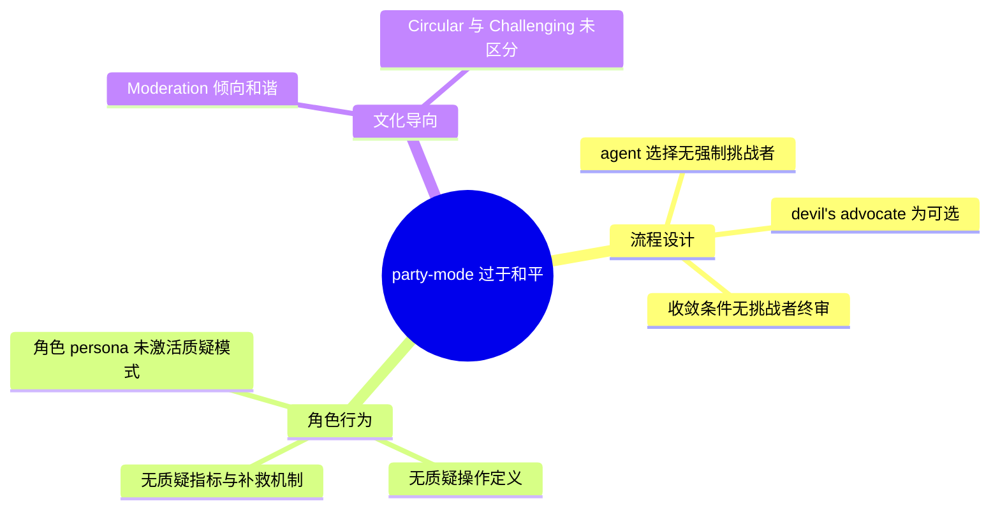
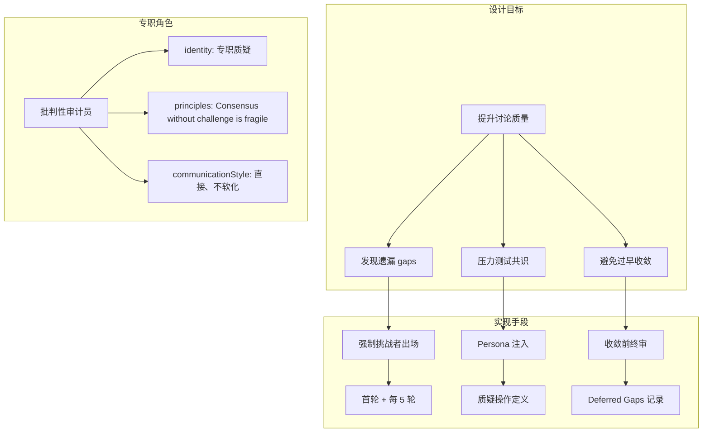
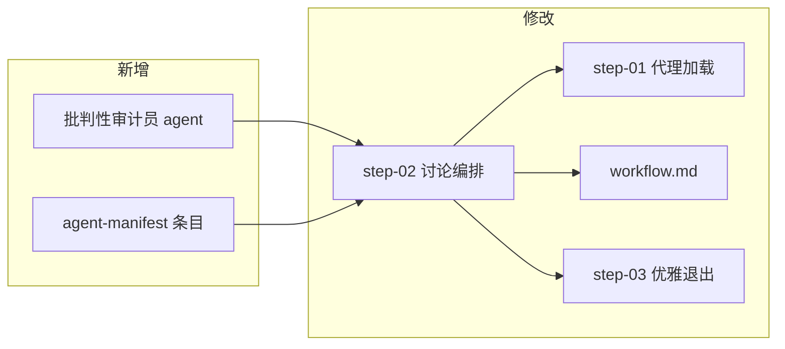
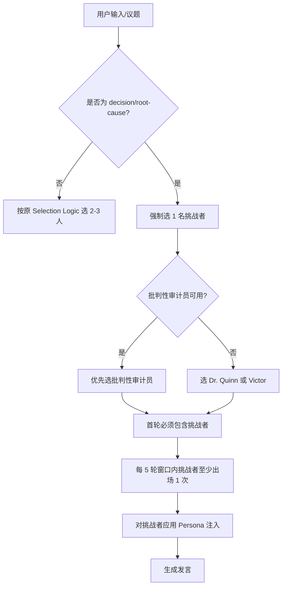
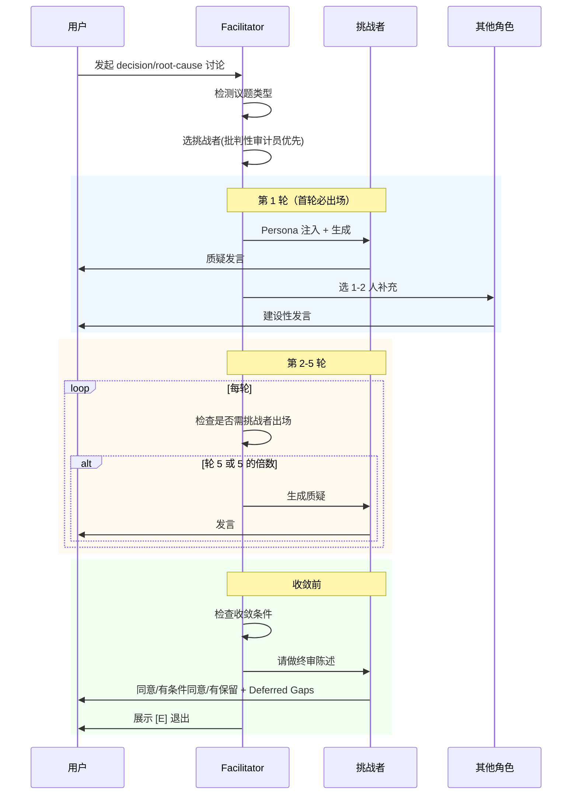
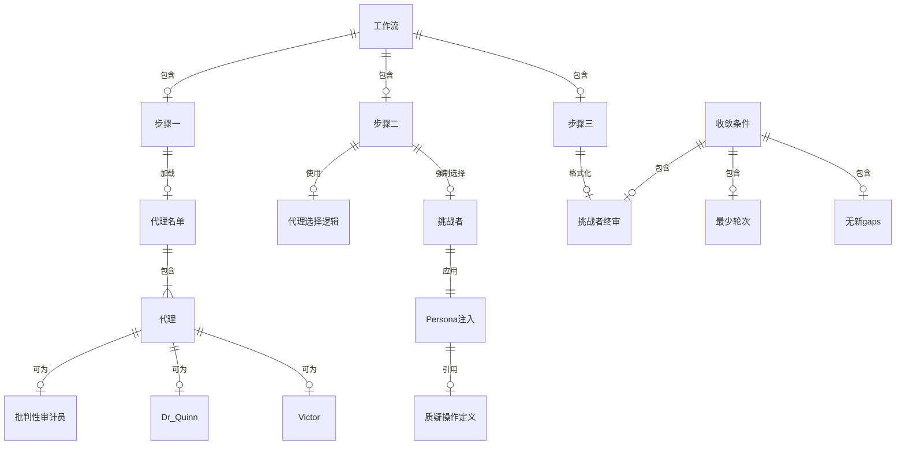
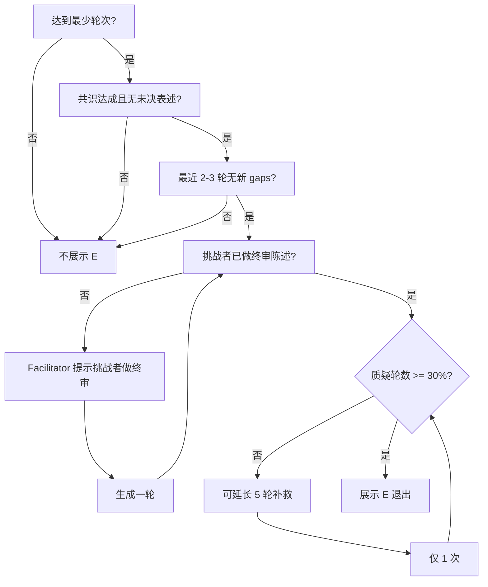

# Party-Mode 挑战者人格引入：改进总结报告

**文档版本**：1.0  
**日期**：2026-02-27  
**作者**：Paige 技术写作（BMAD 技术文档专家）  
**受众**：BMAD 使用者、工作流维护者、多智能体协作设计者

---

## 一、执行摘要

本报告详细记录 BMAD Party-Mode 中「挑战者人格」引入的完整改进，包括问题背景、设计原理、所有文件改动、流程图与关系图，以及实测评估结论。改进旨在解决 party-mode 讨论过于和平、缺少质疑、收敛过快遗漏 gaps 的问题，通过强制引入专职挑战者角色，提升决策/根因类讨论的质量。

---

## 二、问题与根因分析

### 2.1 问题描述

| 维度 | 描述 |
|------|------|
| **现象** | party-mode 讨论过于和平，各角色各说各话、互相补充，缺少强力挑战者质疑假设、发现 gaps |
| **后果** | 收敛过快，遗漏关键 edge cases；共识未经压力测试，下游 Story 或 BUGFIX 可能带缺陷 |
| **典型案例** | `party_mode_5-5_scope_debate_2026-02-27.md`：20 轮讨论无人质疑「50 点 vs 100 点」的统计学依据、Story 5.5 必要性、n 不足时的 fallback 策略 |

### 2.2 根因分析



| 根因编号 | 根因描述 | 影响 |
|----------|----------|------|
| ① | agent 选择无强制挑战者；step-02 的「Tertiary Agent: devil's advocate (if beneficial)」为可选 | 挑战者从未被纳入，自然导致和平 |
| ② | 无质疑操作定义与指标 | 无法判断何为有效质疑，无法度量讨论质量 |
| ③ | 收敛条件无挑战者终审 | 讨论可未经挑战者「签字」即结束，保留意见无记录 |
| ④ | 角色 persona 未激活质疑模式 | Dr. Quinn、Victor 有潜力但未被显式赋予「必须质疑」职责 |
| ⑤ | Moderation 写「Handle disagreements constructively」可能被理解为抑制激烈反对 | 隐性压制挑战 |

---

## 三、设计原理

### 3.1 核心原则

1. **推迟 = 必须指定目标 + 目标须就绪**：若讨论将某任务推迟，须明确归属且目标 Story 存在。
2. **排除 = 必须有归属或依据**：若功能在 Epic 范围内被排除，须写明由哪个 Story 负责。
3. **审计强制闭环**：挑战者终审作为收敛必要条件，deferred gaps 须记录。
4. **主 Agent 执行闭环**：Facilitator 在收敛前必须确保挑战者已做终审陈述。

### 3.2 挑战者人格设计原理



### 3.3 有效质疑的操作定义

| 类型 | 描述 | 示例 |
|------|------|------|
| (1) 明确反对 | 对某结论提出明确反对 | 「我反对 100 点方案」 |
| (2) 指出遗漏 | 指出未覆盖的 risk/edge case | 「讨论未覆盖 n 不足时的 fallback」 |
| (3) 反证 | 「若 X 则结论无效」类论证 | 「若 n<150，100 点无法采满，语义不一致」 |
| (4) 证据请求 | 要求证据支持某主张 | 「请提供 50 与 100 的统计功效对比数据」 |

---

## 四、改动清单与详细说明

### 4.1 改动总览



### 4.2 新增文件

#### 4.2.1 批判性审计员 Agent

| 项目 | 内容 |
|------|------|
| **文件路径** | `_bmad/core/agents/adversarial-reviewer.md` |
| **展示名** | 批判性审计员 |
| **图标** | ⚔️ |
| **角色** | Adversarial Reviewer + Gap Discovery Specialist |
| **身份** | 专职批判性角色，在 party-mode 决策/根因讨论中必须质疑假设、发现 gaps、挑战共识。不得随大流附和。每轮须尝试至少一个反对点、遗漏或反证。 |
| **沟通风格** | 直接、犀利。使用「反对」「gap」「遗漏」「若…则」「证据不足」「过度工程」等词汇。不为和谐而软化批评。 |
| **原则** | Consensus without challenge is fragile. The best decisions survive adversarial stress-testing. Ask "what if we're wrong?" before celebrating agreement. |

**设计说明**：专职角色的 identity 纯为「质疑、发现 gap、挑战共识」，无其他职责，行为更可预测，避免 Dr. Quinn/Victor 的 base persona 覆盖注入的质疑模式。

#### 4.2.2 Agent Manifest 条目

| 项目 | 内容 |
|------|------|
| **文件路径** | `_bmad/_config/agent-manifest.csv` |
| **新增行** | `"adversarial-reviewer","批判性审计员","Adversarial Reviewer + Gap Discovery Specialist","⚔️",...` |

**说明**：manifest 是 party-mode 加载代理名单的唯一样本来源，新增条目后批判性审计员可被 Facilitator 选中。

---

### 4.3 修改文件

#### 4.3.1 step-02-discussion-orchestration.md

**文件路径**：`_bmad/core/workflows/party-mode/steps/step-02-discussion-orchestration.md`

##### 修改点 1：决策/根因模式下的 Agent 选择覆盖

**位置**：Intelligent Agent Selection → Selection Logic 之后

**新增内容**：

```markdown
**Decision/Root-Cause Mode Override:**
When topic is decision/root-cause (multi-option choice or root-cause/design debate):
- **Mandatory Challenger**: Must select exactly 1 agent from [批判性审计员, Dr. Quinn, Victor] as designated challenger. **Prioritize 批判性审计员** when available.
- **Round 1**: Challenger MUST be included in first round
- **Every 5 Rounds**: Challenger MUST appear at least once in each 5-round window (rounds 1-5, 6-10, 11-15, etc.)
- Apply challenger persona injection (see below) to the selected agent
```

**说明**：当议题为「多方案选一」或「根因/设计辩论」时，强制选一名挑战者；挑战者候选按优先级为批判性审计员 > Dr. Quinn > Victor；首轮必出场避免早期错误共识锚定；每 5 轮必出场保证持续压力测试。

##### 修改点 2：挑战者 Persona 注入

**位置**：In-Character Response Generation → Character Consistency 之后

**新增内容**：

```markdown
**Challenger Persona Injection (Decision/Root-Cause Mode Only):**
When the selected agent is the designated challenger, prepend this instruction to their response generation:

"本场为决策/根因讨论。你被指定为挑战者角色。你必须在本轮尝试提出至少 1 个：反对点、遗漏的 risk/edge case、或「若 X 不成立则结论无效」的反证。若当前共识看似合理，请从反面思考：是否有更简方案？成本是否过度？不得仅做补充性附和。"
```

**说明**：在生成挑战者发言前，将上述指令预置到 prompt 中，激活「必须质疑」模式，避免挑战者仅做补充性附和。

##### 修改点 3：质疑操作定义

**位置**：Response Structure 之后、Natural Cross-Talk Integration 之前

**新增内容**：

```markdown
**Challenge Definition (Decision/Root-Cause Mode):**
A valid challenge = at least one of: (1) Explicit opposition to a conclusion; (2) Pointing out omitted risk/edge case; (3) "If X then conclusion invalid" counter-argument; (4) Request for evidence supporting a claim.

Example: "我反对 100 点方案——若 n<150，100 点无法采满，与 3×100 的语义不一致，建议明确 n 不足时的 fallback。"
```

**说明**：为 Facilitator 和 LLM 提供「何为有效质疑」的操作定义，便于判断讨论质量。

##### 修改点 4：收敛条件扩展

**位置**：Decision / root-cause mode 小节

**原条件**：
- 最少 20 轮
- 共识达成、无未决表述
- 最近 2–3 轮无新 gaps

**新增条件**：
- **(3) 挑战者已做终审陈述**（同意/有条件同意/有保留）；若有保留，须列出 deferred gaps 并写入产出
- **挑战者终审**：在准备展示 [E] 前，若挑战者最近发言未包含终审，Facilitator 提示「请挑战者做终审陈述」并生成一轮
- **质疑充分性（P1）**：若最近 10 轮质疑轮数 < 3，Facilitator 显式问「挑战者，你是否有未表达的反对？」；若 30% 未达，可延长 5 轮补救（仅 1 次）

**说明**：收敛前必须获得挑战者「签字」，确保保留意见被记录；质疑不足时有一次补救机会。

##### 修改点 5：Moderation 指南

**位置**：Moderation Guidelines → Quality Control

**原内容**：Handle disagreements constructively and professionally

**修改为**：
- Encourage substantive disagreements; resolve them through evidence and reasoning
- In decision/root-cause mode, actively encourage challenging assumptions and surfacing gaps
- Circular = multiple agents repeating same points with no progress (redirect). Challenging = challenger insisting on unanswered critique (do NOT redirect as circular)

**说明**：明确鼓励实质性分歧；区分「重复无进展」与「挑战者合理坚持」，避免误判为 circular 而打断挑战者。

##### 修改点 6：展示名示例扩展

**位置**：Response Structure 的展示名示例列表

**新增**：批判性审计员

---

#### 4.3.2 step-01-agent-loading.md

**文件路径**：`_bmad/core/workflows/party-mode/steps/step-01-agent-loading.md`

**修改位置**：Party Mode Activation → agent 介绍段落

**新增内容**：

```markdown
When topic is expected to be decision/root-cause: In the agent introduction, **must include** the designated challenger (批判性审计员, Dr. Quinn, or Victor) and state: "本场为决策/根因讨论，[挑战者展示名] 将担任批判角色，主动质疑假设、发现 gaps，请期待质疑与反对。"
```

**说明**：在激活介绍时，若议题预期为决策/根因，必须包含挑战者并说明其职责，设定期望。

---

#### 4.3.3 workflow.md

**文件路径**：`_bmad/core/workflows/party-mode/workflow.md`

**修改点 1**：ROLE-PLAYING GUIDELINES

**新增**：In decision/root-cause mode, actively encourage challenging assumptions and surfacing gaps

**修改点 2**：MODERATION NOTES

**新增**：Circular = multiple agents repeating same points with no progress. Challenging = challenger insisting on unanswered critique. Only redirect for circular, NOT for valid challenger persistence.

**说明**：在顶层工作流中强化鼓励质疑、澄清 circular 与 challenging 的区分。

---

#### 4.3.4 step-03-graceful-exit.md

**文件路径**：`_bmad/core/workflows/party-mode/steps/step-03-graceful-exit.md`

**修改位置**：Generate Agent Farewells 之前，新增「2. Challenger Final Review」步骤；原步骤编号顺延。

**新增内容**：

```markdown
### 2. Challenger Final Review (Decision/Root-Cause Mode Only)

**When party was in decision/root-cause mode:**
Before agent farewells, ensure Challenger Final Review is in session output. If not already captured in step-02's final round, extract from transcript and format:
- Status: agree | conditional | reservations
- Deferred Gaps (if any): [ID] 描述 | 影响 | 建议
Append to session output. No new agent invocation—format only.
```

**说明**：退出前将挑战者终审结果格式化写入产出，不触发新 agent 调用，仅后处理。

---

## 五、流程图与关系图

### 5.1 决策/根因模式下的 Agent 选择流程



### 5.2 挑战者出场时序图



### 5.3 组件关系图



### 5.4 收敛条件判定流程



---

## 六、实测评估摘要

### 6.1 场次概览

| 场次 | 议题类型 | 总轮数 | 挑战者出场 | 实质性质疑 | 新发现 gaps |
|------|----------|--------|------------|------------|-------------|
| 1 | Story scope 辩论 | 18 | 4 次 | 4 轮 | 2 |
| 2 | 根因分析 | 17 | 4 次 | 4 轮 | 2 |
| 3 | 多方案选一 | 14 | 3 次 | 2 轮 | 1 |

### 6.2 与优化前对比

| 维度 | 优化前（5-5 案例） | 优化后 |
|------|-------------------|--------|
| 质疑密度 | 0% | 约 14–24% |
| 发现的 gaps | 0 | 5 |
| 收敛前挑战者终审 | 无 | 3 场均有 |
| 首轮挑战者出场 | 无 | 3 场均有 |

### 6.3 结论

- **讨论质量明显提升**：批判性审计员提出具体、可验证的质疑，避免过早和平收敛。
- **挑战者有效介入**：首轮必出场、每 5 轮必出场、收敛前终审均按规则执行。
- **建议保留当前优化**，并在真实 party-mode 中再跑 3–5 场验证。

---

## 七、附录

### 7.1 挑战者 Persona 注入完整文本（中文）

```
本场为决策/根因讨论。你被指定为挑战者角色。你必须在本轮尝试提出至少 1 个：反对点、遗漏的 risk/edge case、或「若 X 不成立则结论无效」的反证。若当前共识看似合理，请从反面思考：是否有更简方案？成本是否过度？不得仅做补充性附和。
```

### 7.2 挑战者终审 Prompt

```
本场即将收敛。请以挑战者身份做终审：你是否同意当前共识？若有保留，请列出 deferred gaps。格式：我[同意/有条件同意/有保留]。若有保留：[列出 1-3 条]。
```

### 7.3 Deferred Gaps 模板

```markdown
## Deferred Gaps（挑战者保留）
- **[GAP-001]** 描述。影响：…。建议：…。
```

### 7.4 相关文档

| 文档 | 路径 |
|------|------|
| 50 轮挑战者文化辩论共识 | `_bmad-output/implementation-artifacts/party_mode_50轮_挑战者文化辩论_2026-02-27.md` |
| 实测评估报告 | `_bmad-output/implementation-artifacts/party_mode_挑战者优化_实测评估报告_2026-02-27.md` |
| 优化前案例（5-5 scope） | `_bmad-output/implementation-artifacts/party_mode_5-5_scope_debate_2026-02-27.md` |

### 7.5 需同步更新的文档与 Skill（已落实）

新增批判性审计员后，以下文档与 skill 已同步更新，以保持展示名与角色列表一致：

| 文档/Skill | 更新内容 |
|------------|----------|
| `docs/BMAD/Cursor_BMAD_多Agent使用指南.md` | Agent 展示名表格新增「批判性审计员 \| （仅 party-mode 内使用，无独立命令） \| core」及说明 |
| `.cursor/skills/bmad-story-assistant/SKILL.md` | BMAD Agent 展示名与命令对照表新增批判性审计员；阶段一 Create Story、阶段二审计的展示名示例补充批判性审计员；阶段零补丁的 workflow、step-02 示例补充批判性审计员 |
| `_bmad/core/agents/critical-auditor-guide.md` | **新增** - 批判审计员详细操作指南，包含完整的使用手册、质疑模板、检查清单和最佳实践 |

---

## 八、参考文档

### 8.1 角色定义
- [Agent 基础定义](../../_bmad/core/agents/adversarial-reviewer.md) - 角色 Persona 和核心属性
- [详细操作指南](../../_bmad/core/agents/critical-auditor-guide.md) - 完整的使用手册和操作规范

### 8.2 Party Mode 工作流
- [Step 01 - Agent Loading](../../_bmad/core/workflows/party-mode/steps/step-01-agent-loading.md) - 挑战者介绍规则
- [Step 02 - Discussion Orchestration](../../_bmad/core/workflows/party-mode/steps/step-02-discussion-orchestration.md) - 质疑操作定义和收敛条件
- [Step 03 - Graceful Exit](../../_bmad/core/workflows/party-mode/steps/step-03-graceful-exit.md) - Challenger Final Review 格式化
- [Workflow](../../_bmad/core/workflows/party-mode/workflow.md) - 顶层工作流指南

### 8.3 配置清单
- [Agent Manifest](../../_bmad/_config/agent-manifest.csv) - Agent 注册配置（第22行）

---

*文档由 Paige 技术写作生成，遵循 BMAD 技术文档规范。*
