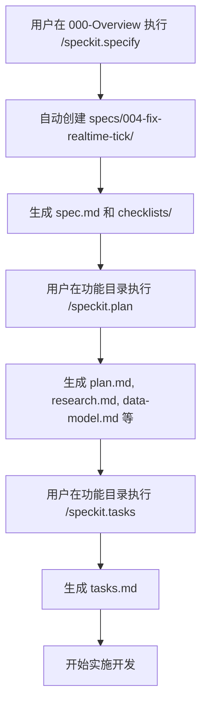

# Speckit 多模块开发最佳实践

## 📋 概述

本文档总结了在同一项目的不同模块中使用 Speckit 来开发不同功能的最佳实践。Speckit 是一个用于管理项目规范文档的工具，通过标准化的文档结构（`.speckit.*` 文件）来指导 AI 助手进行功能开发。

## ✅ 可行性确认

**完全可行！** 在同一项目的不同模块中使用 Speckit 开发不同功能不仅可行，而且是推荐的做法。

### 实际案例

当前项目中已有成功案例：
- `multi-timeframe-webapp/` 模块：使用完整的 Speckit 文件集（`.speckit.constitution`、`.speckit.specify`、`.speckit.plan`、`.speckit.clarify`）
- `specs/001-mhi-cta-backtest/` 目录：使用 Markdown 格式的规范文档

## 🏗️ 推荐的组织方式

### 方案 1：每个模块独立的 Speckit 文件集（推荐）⭐

适用于：独立的模块、子项目或功能完整的组件

```
vnpy/
├── multi-timeframe-webapp/          # 模块1：多周期Web应用
│   ├── .speckit.constitution        # 项目宪章（模块级）
│   ├── .speckit.specify             # 功能规格说明
│   ├── .speckit.plan                # 实施计划
│   ├── .speckit.clarify             # 决策和澄清文档
│   └── frontend/                    # 实际代码
│
├── vnpy_ctastrategy/                # 模块2：CTA策略模块
│   ├── .speckit.constitution
│   ├── .speckit.specify
│   ├── .speckit.plan
│   └── .speckit.clarify
│
├── vnpy_algotrading/                # 模块3：算法交易模块
│   ├── .speckit.constitution
│   ├── .speckit.specify
│   └── ...
│
└── vnpy_datamanager/                # 模块4：数据管理模块
    └── ...
```

**优点：**
- ✅ 模块完全独立，互不干扰
- ✅ AI 助手在模块目录工作时自动读取对应的 Speckit 文件
- ✅ 每个模块可以有自己的开发规范和标准
- ✅ 便于模块级别的版本管理和文档维护

### 方案 2：集中管理规范文档（适合大型功能）

适用于：跨模块的大型功能、需要统一管理的规范文档

```
vnpy/
├── specs/                            # 集中管理规范文档
│   ├── 001-mhi-cta-backtest/        # 功能1：MHI回测系统
│   │   ├── .speckit.constitution
│   │   ├── .speckit.specify
│   │   ├── .speckit.plan
│   │   └── .speckit.clarify
│   │
│   ├── 002-new-feature/             # 功能2：新功能
│   │   ├── .speckit.constitution
│   │   ├── .speckit.specify
│   │   └── ...
│   │
│   └── 003-another-feature/         # 功能3：另一个功能
│       └── ...
│
└── [实际代码模块]
```

**优点：**
- ✅ 所有规范文档集中管理，便于查找
- ✅ 适合跨多个模块的大型功能
- ✅ 便于项目级别的规划和协调

### 方案 3：混合方式（实际推荐）

结合方案 1 和方案 2，根据实际情况选择：

- **独立模块/子项目**：使用方案 1，在模块根目录放置 `.speckit.*` 文件
- **功能规范文档**：使用方案 2，在 `specs/` 目录下管理
- **项目级规范**：在项目根目录或 `docs/` 目录统一管理

## 📝 Speckit 文件说明

### `.speckit.constitution` - 项目宪章

定义模块的基本规则、技术栈、代码风格和开发标准。

**内容示例：**
```markdown
# Project Constitution

## Project Overview
This is a [模块名称] module.

## Technology Stack
- Framework: [使用的框架]
- Database: [数据库类型]
- Testing: [测试框架]

## Code Style and Standards
- Naming conventions
- Code organization patterns
- Import ordering preferences

## Development Practices
- Testing requirements
- Error handling patterns
- Git workflow
```

### `.speckit.specify` - 功能规格说明

详细描述功能需求、用户故事、技术规格和 API 设计。

**内容示例：**
```markdown
# Feature Specifications

## Feature 1: [功能名称]

### Overview
功能描述和业务价值

### User Stories
- 作为[角色]，我希望[目标]，以便[价值]

### Requirements
#### Functional Requirements
1. 系统应该...
2. 用户应该能够...

#### Non-Functional Requirements
- Performance: [性能要求]
- Scalability: [可扩展性要求]
```

### `.speckit.plan` - 实施计划

制定开发计划、任务分解、时间安排和里程碑。

**内容示例：**
```markdown
# Implementation Plan

## Phase 1: [阶段名称]
- Task 1: [任务描述]
- Task 2: [任务描述]

## Phase 2: [阶段名称]
- Task 1: [任务描述]
```

### `.speckit.clarify` - 决策和澄清文档

记录关键决策、技术选型理由、问题澄清和变更日志。

**内容示例：**
```markdown
# Clarifications and Decisions

## Q1: [问题描述]
**Decision:** [决策内容]
**Rationale:** [决策理由]

## D1: [决策编号] - [决策标题]
**Date:** [日期]
**Context:** [背景]
**Decision:** [决策内容]
**Impact:** [影响分析]
```

## 🎯 最佳实践建议

### 1. 模块独立性原则

- ✅ **每个模块的 Speckit 文件只管理该模块的功能**
- ✅ **模块之间通过接口和约定进行交互，而不是直接依赖**
- ✅ **`.speckit.constitution` 可以继承项目级规范，但可以添加模块特定的规则**

**示例：**
```markdown
# 在模块的 .speckit.constitution 中
## Project-Specific Rules
- 继承项目级代码风格规范
- 本模块特定要求：使用 TypeScript strict mode
- 本模块特定要求：所有组件必须包含单元测试
```

### 2. 命名和组织规范

**模块级 Speckit 文件：**
- 位置：放在模块根目录
- 命名：`.speckit.constitution`、`.speckit.specify` 等
- 示例：`multi-timeframe-webapp/.speckit.specify`

**功能级 Speckit 文件：**
- 位置：放在 `specs/` 目录下
- 命名：`specs/001-feature-name/.speckit.specify`
- 编号：使用三位数字前缀便于排序

### 3. 文档引用和继承

**项目级规范：**
- 在项目根目录或 `docs/` 目录定义通用规范
- 各模块的 `.speckit.constitution` 引用项目级规范

**跨模块依赖：**
- 在 `.speckit.clarify` 中明确记录跨模块依赖关系
- 使用接口和抽象层减少直接依赖

**示例：**
```markdown
# 在模块的 .speckit.clarify 中
## D5: 跨模块依赖设计
**Context:** 本模块需要调用 vnpy_ctastrategy 模块的功能
**Decision:** 通过事件总线（EventEngine）进行通信，不直接导入
**Rationale:** 保持模块解耦，便于独立测试和维护
```

### 4. 版本控制和变更管理

- ✅ **所有 `.speckit.*` 文件都应该纳入 Git 版本控制**
- ✅ **重要变更在 `.speckit.clarify` 中记录变更日志**
- ✅ **使用有意义的提交信息，便于追踪变更历史**

**变更日志示例：**
```markdown
# 在 .speckit.clarify 中
## Changelog

### 2025-01-15
- D10: 决定使用 ECharts 替代 TradingView（性能考虑）
- Q5: 澄清了4小时K线时间边界划分规则

### 2025-01-10
- D8: 选择 React + TypeScript 作为前端技术栈
- Q3: 确认数据格式使用 CSV
```

### 5. AI 助手上下文管理

**工作原理：**
- 当在模块目录工作时，AI 助手会优先读取该模块的 Speckit 文件
- 确保每个模块的 Speckit 文件完整且准确

**最佳实践：**
- ✅ 在开始开发前，确保 Speckit 文件已创建并完善
- ✅ 定期更新 `.speckit.clarify`，记录开发过程中的决策
- ✅ 在 `.speckit.specify` 中保持功能需求的准确性

## ⚠️ 注意事项

### 1. 避免冲突

**模块隔离：**
- 不同模块的 Speckit 文件互不影响
- 每个模块可以有自己的技术栈和开发规范

**跨模块协调：**
- 如果功能涉及多个模块，在 `.speckit.clarify` 中明确记录
- 使用统一的接口规范，避免模块间直接耦合

### 2. 保持一致性

**项目级标准：**
- 在项目根目录或 `docs/` 目录定义通用标准
- 各模块的 `.speckit.constitution` 应遵循项目级标准

**代码风格：**
- 使用统一的代码格式化工具（如 Prettier、Black）
- 在项目级配置文件中定义，各模块继承

### 3. 文档维护

**及时更新：**
- 功能变更时及时更新 `.speckit.specify`
- 技术决策变更时更新 `.speckit.clarify`
- 计划调整时更新 `.speckit.plan`

**文档同步：**
- 确保 Speckit 文件与实际代码保持一致
- 定期审查文档的准确性

## 📚 实际应用示例

### 示例 1：独立模块使用 Speckit

**场景：** `multi-timeframe-webapp` 是一个独立的 Web 应用模块

**文件结构：**
```
multi-timeframe-webapp/
├── .speckit.constitution    # 定义：React + TypeScript + ECharts
├── .speckit.specify         # 定义：多周期K线图功能需求
├── .speckit.plan           # 定义：分阶段实施计划
├── .speckit.clarify        # 记录：技术选型决策
└── frontend/               # 实际代码
```

**优势：**
- AI 助手在 `multi-timeframe-webapp/` 目录工作时，自动读取该模块的 Speckit 文件
- 模块完全独立，可以有自己的开发节奏和技术栈

### 示例 2：功能规范文档管理

**场景：** MHI CTA 回测系统是一个跨模块的大型功能

**文件结构：**
```
specs/
└── 001-mhi-cta-backtest/
    ├── specification.md    # 功能规格（Markdown格式）
    └── plan.md            # 实施计划（Markdown格式）

# 或者使用 Speckit 格式：
specs/
└── 001-mhi-cta-backtest/
    ├── .speckit.constitution
    ├── .speckit.specify
    ├── .speckit.plan
    └── .speckit.clarify
```

**优势：**
- 集中管理大型功能的规范文档
- 便于项目级别的规划和协调
- 可以跨多个模块进行功能开发

## ⚙️ Speckit 工作流程原理

### 概述

Speckit 通过一系列命令（`/speckit.*`）来管理功能开发的完整生命周期。这些命令在 `specs/000-Overview/.cursor/commands/` 目录下定义，通过 PowerShell 脚本自动创建文件夹结构、生成文档。

**重要说明**：Speckit 命令本身**不会创建 Git 分支或 worktree**，这些操作需要手动完成。

### 核心命令流程

#### 1. `/speckit.specify` - 创建功能规格说明

**执行位置：** 在 `specs/000-Overview/` 目录或项目根目录执行

**工作流程：**

1. **自动创建新功能文件夹**
   - 调用 `create-new-feature.ps1` 脚本
   - 自动检测下一个可用的功能编号（如 001, 002, 003...）
   - 从功能描述生成短名称（如 `fix-realtime-tick`）
   - **自动创建文件夹**：`specs/004-fix-realtime-tick/`
   - 创建并切换到新的 Git 分支（如果使用 Git）

2. **生成功能规格文档**
   - 创建 `spec.md` 文件（使用模板 `.specify/templates/spec-template.md`）
   - 根据用户描述填充功能规格内容
   - 生成用户场景、功能需求、成功标准等

3. **创建质量检查清单**
   - 自动创建 `checklists/requirements.md`
   - 验证规格说明的完整性和质量
   - 处理需要澄清的问题（最多 3 个）

**关键脚本：** `_bmad/scripts/bmad-speckit/powershell/create-new-feature.ps1`

**输出文件：**
- `specs/XXX-feature-name/spec.md` - 功能规格说明
- `specs/XXX-feature-name/checklists/requirements.md` - 质量检查清单

**示例：**
```bash
# 在 000-Overview 目录执行
/speckit.specify 修复 ChartWindow 实时 tick 数据刷新问题

# 自动创建：
# - specs/004-fix-realtime-tick/spec.md
# - specs/004-fix-realtime-tick/checklists/requirements.md
# - Git 分支：004-fix-realtime-tick
```

#### 2. `/speckit.plan` - 生成实施计划

**执行位置：** 在功能目录（如 `specs/004-fix-realtime-tick/`）执行

**工作流程：**

1. **读取功能规格**
   - 读取 `spec.md` 文件
   - 读取 `.specify/memory/constitution.md`（项目宪章）
   - 加载实施计划模板

2. **生成技术上下文**
   - 填写技术栈、依赖、约束条件
   - 执行 Constitution Check（规范检查）
   - 标记需要澄清的部分（NEEDS CLARIFICATION）

3. **Phase 0: 研究阶段**
   - 生成 `research.md` 文件
   - 研究技术选型、最佳实践
   - 解决所有 NEEDS CLARIFICATION 标记

4. **Phase 1: 设计阶段**
   - 生成 `data-model.md` - 数据模型设计
   - 生成 `contracts/` 目录 - API 契约定义
   - 生成 `quickstart.md` - 快速开始指南
   - 更新 AI 助手上下文文件

5. **Phase 2: 计划阶段**
   - 生成 `plan.md` - 完整的实施计划
   - 包含技术方案、阶段划分、任务分解

**关键脚本：** `_bmad/scripts/bmad-speckit/powershell/setup-plan.ps1`

**输出文件：**
- `plan.md` - 实施计划（由 `/speckit.plan` 命令生成）
- `research.md` - Phase 0 输出
- `data-model.md` - Phase 1 输出
- `quickstart.md` - Phase 1 输出
- `contracts/` - Phase 1 输出（API 契约）
- `tasks.md` - **不是**由 `/speckit.plan` 生成，而是由 `/speckit.tasks` 生成

**示例：**
```bash
# 在功能目录执行
/speckit.plan

# 自动生成：
# - plan.md
# - research.md
# - data-model.md
# - quickstart.md
# - contracts/
```

#### 3. `/speckit.tasks` - 生成任务清单

**执行位置：** 在功能目录执行

**工作流程：**

1. **读取设计文档**
   - 读取 `plan.md` 文件
   - 读取 `data-model.md`、`research.md` 等设计文档

2. **生成任务清单**
   - 根据用户故事分解任务
   - 为每个任务分配优先级和依赖关系
   - 生成 `tasks.md` 文件

**输出文件：**
- `tasks.md` - 详细的任务清单（由 `/speckit.tasks` 命令生成）

**示例：**
```bash
# 在功能目录执行
/speckit.tasks

# 自动生成：
# - tasks.md
```

### 完整工作流程示例

以下是一个完整的功能开发流程：



**步骤详解：**

1. **Specify 阶段**（创建功能文件夹）
   ```bash
   # 位置：specs/000-Overview/
   /speckit.specify 修复 ChartWindow 实时 tick 数据刷新问题
   
   # 结果：
   # ✅ 创建 specs/004-fix-realtime-tick/
   # ✅ 创建 spec.md
   # ✅ 创建 checklists/requirements.md
   # ✅ 创建 Git 分支 004-fix-realtime-tick
   ```

2. **Plan 阶段**（生成实施计划）
   ```bash
   # 位置：specs/004-fix-realtime-tick/
   /speckit.plan
   
   # 结果：
   # ✅ 生成 plan.md
   # ✅ 生成 research.md
   # ✅ 生成 data-model.md
   # ✅ 生成 quickstart.md
   # ✅ 生成 contracts/
   ```

3. **Tasks 阶段**（生成任务清单）
   ```bash
   # 位置：specs/004-fix-realtime-tick/
   /speckit.tasks
   
   # 结果：
   # ✅ 生成 tasks.md
   ```

### 关键机制说明

#### 1. 自动文件夹创建

`create-new-feature.ps1` 脚本的关键功能：

- **编号检测**：自动检测现有功能编号（从 Git 分支、本地分支、specs 目录）
- **短名称生成**：从功能描述中提取关键词，生成短名称（如 `fix-realtime-tick`）
- **文件夹创建**：自动创建 `specs/XXX-feature-name/` 目录结构
- **Git 分支**：如果使用 Git，自动创建并切换到新分支

**编号规则：**
- 检查远程分支：`git ls-remote --heads origin | grep "refs/heads/[0-9]+-"`
- 检查本地分支：`git branch | grep "^[0-9]+-"`
- 检查 specs 目录：`specs/[0-9]+-*/`
- 取最高编号 + 1

#### 2. 文档生成顺序

文档生成遵循严格的顺序依赖：

```
spec.md (specify)
    ↓
plan.md (plan)
    ↓
research.md (plan - Phase 0)
    ↓
data-model.md, contracts/, quickstart.md (plan - Phase 1)
    ↓
tasks.md (tasks)
```

**重要提示：**
- `tasks.md` **不是**由 `/speckit.plan` 生成
- `tasks.md` 由 `/speckit.tasks` 命令单独生成
- 必须先执行 `/speckit.plan`，再执行 `/speckit.tasks`

#### 3. 文件模板系统

Speckit 使用模板系统来生成文档：

- **模板位置**：`.specify/templates/`
- **模板文件**：
  - `spec-template.md` - 功能规格模板
  - `plan-template.md` - 实施计划模板
  - `tasks-template.md` - 任务清单模板
  - `checklist-template.md` - 检查清单模板

#### 4. AI 助手上下文更新

在 Phase 1 设计阶段，会自动更新 AI 助手上下文：

- 运行 `_bmad/scripts/bmad-speckit/powershell/update-agent-context.ps1`
- 检测使用的 AI 助手类型（Cursor、Claude 等）
- 更新对应的上下文文件
- 添加新技术栈信息，保留手动添加的内容

### 常见问题

**Q: 为什么文件夹是在 specify 阶段创建的，而不是 plan 阶段？**

A: 因为 `create-new-feature.ps1` 脚本在 `/speckit.specify` 命令中调用，它的职责就是创建新功能的基础结构（文件夹、spec.md、checklists/）。`/speckit.plan` 命令假设功能文件夹已经存在，只负责生成实施计划相关的文档。

**Q: 可以跳过某个阶段吗？**

A: 不建议跳过，因为每个阶段都有依赖关系：
- 必须先执行 `/speckit.specify` 创建基础结构
- 然后执行 `/speckit.plan` 生成设计文档
- 最后执行 `/speckit.tasks` 生成任务清单

**Q: 如何修改已创建的功能编号？**

A: 功能编号在创建时确定，不建议修改。如果需要调整，可以：
1. 手动重命名文件夹
2. 更新 Git 分支名称
3. 更新文档中的引用

**Q: Speckit 命令会创建 Git 分支吗？**

A: ❌ **不会** - Speckit 只创建文档，不涉及 Git 操作。Git 分支和 worktree 需要手动创建。

**Q: 应该在哪个阶段创建 feature branch？**

A: ✅ **在文档完成后，开始开发前** - 推荐在 `/speckit.tasks` 完成后创建。

**Q: 可以同时创建分支和 worktree 吗？**

A: ✅ **可以，推荐使用脚本自动化** - 详见下面的"Git 分支和 Worktree 创建时机"章节。

## 🔗 Git 分支和 Worktree 创建时机

### 核心问题

**Q: Speckit 命令会创建 Git 分支吗？**  
**A: ❌ 不会** - Speckit 只创建文档，不涉及 Git 操作

**Q: 应该在哪个阶段创建 feature branch？**  
**A: ✅ 在文档完成后，开始开发前**

**Q: 可以同时创建分支和 worktree 吗？**  
**A: ✅ 可以，推荐使用脚本自动化**

### Speckit 工作流程中的 Git 操作

#### Speckit 命令阶段（不创建分支）

```
阶段1: /speckit.specify
  - 创建文件夹: specs/{编号}-{功能}/
  - 创建文件: specification.md, .speckit.clarify
  - Git操作: ❌ 无（通常在dev分支）

阶段2: /speckit.plan
  - 创建文件: plan.md (+ 可选文档)
  - Git操作: ❌ 无（通常在dev分支）

阶段3: /speckit.tasks
  - 创建文件: tasks.md
  - Git操作: ❌ 无（通常在dev分支）
```

#### 开发准备阶段（创建分支和 worktree）⭐

```
阶段4: 准备开发环境
  - Git操作: ✅ 创建feature branch
  - Git操作: ✅ 创建worktree（推荐）
  - 位置: 在worktree中开始开发
```

### 推荐的完整流程

#### 流程1: 文档在dev分支，开发在feature branch（推荐）

```bash
# ===== 阶段1-3: 文档创建（在dev分支） =====
cd vnpy
git checkout dev
git pull origin dev

# 使用speckit创建文档
# /speckit.specify → specification.md
# /speckit.plan → plan.md
# /speckit.tasks → tasks.md

# 提交文档到dev分支（可选）
git add specs/005-multi-timeframe-overlay/
git commit -m "docs: add multi-timeframe overlay specification"

# ===== 阶段4: 创建feature branch和worktree =====
# 创建feature branch
git checkout -b 005-multi-timeframe-overlay dev

# 创建worktree（推荐）
git worktree add ../vnpy-005-multi-timeframe-overlay 005-multi-timeframe-overlay

# 切换到worktree开始开发
cd ../vnpy-005-multi-timeframe-overlay

# ===== 阶段5: 在worktree中开发 =====
# 开发代码...
# 提交到feature branch...
```

**优点**:
- ✅ 文档在dev分支，便于评审和共享
- ✅ 开发代码在feature branch，保持dev干净
- ✅ 使用worktree隔离，不影响其他工作

#### 流程2: 使用脚本自动化（最推荐）

```bash
# ===== 阶段1-3: 文档创建（在dev分支） =====
cd vnpy
git checkout dev

# 使用speckit创建文档...

# ===== 阶段4: 使用脚本创建分支和worktree =====
# Windows PowerShell
.\scripts\setup_worktree.ps1 create 005-multi-timeframe-overlay

# Linux/Mac Bash
./scripts/setup_worktree.sh create 005-multi-timeframe-overlay

# 脚本会自动:
# 1. 检查分支是否存在，不存在则从dev创建
# 2. 检查worktree是否存在，不存在则创建
# 3. 切换到worktree目录

# ===== 阶段5: 在worktree中开发 =====
# 已经在worktree目录中，直接开始开发
```

**优点**:
- ✅ 自动化，减少错误
- ✅ 自动处理分支和worktree的创建
- ✅ 自动处理已存在的情况

#### 流程3: 文档也在feature branch

```bash
# ===== 阶段1-2: 文档创建（在dev分支） =====
cd vnpy
git checkout dev

# /speckit.specify → specification.md
# /speckit.plan → plan.md

# ===== 阶段3: 创建feature branch =====
git checkout -b 005-multi-timeframe-overlay dev

# /speckit.tasks → tasks.md (在feature branch)

# ===== 阶段4: 创建worktree =====
git worktree add ../vnpy-005-multi-timeframe-overlay 005-multi-timeframe-overlay

# ===== 阶段5: 在worktree中开发 =====
cd ../vnpy-005-multi-timeframe-overlay
# 开发代码...
```

**优点**:
- ✅ 所有相关文件都在feature branch
- ✅ 便于功能完整管理

### 同时创建分支和 Worktree

#### 可以同时创建

**方式1: 手动操作**
```bash
# 一步完成：创建分支并创建worktree
git checkout -b 005-multi-timeframe-overlay dev
git worktree add ../vnpy-005-multi-timeframe-overlay 005-multi-timeframe-overlay
```

**方式2: 使用脚本（推荐）**
```bash
# 脚本会自动处理分支和worktree的创建
./scripts/setup_worktree.sh create 005-multi-timeframe-overlay
```

**脚本内部逻辑**:
```bash
# 1. 检查分支是否存在
if ! branch_exists "005-multi-timeframe-overlay"; then
    git checkout -b 005-multi-timeframe-overlay dev
fi

# 2. 检查worktree是否存在
if ! worktree_exists "005-multi-timeframe-overlay"; then
    git worktree add ../vnpy-005-multi-timeframe-overlay 005-multi-timeframe-overlay
fi

# 3. 切换到worktree
cd ../vnpy-005-multi-timeframe-overlay
```

### 时机对比表

| 阶段 | Speckit命令 | Git分支 | Worktree | 说明 |
|------|------------|---------|----------|------|
| 1. 需求分析 | `/speckit.specify` | ❌ 无 | ❌ 无 | 创建文档，通常在dev分支 |
| 2. 计划制定 | `/speckit.plan` | ❌ 无 | ❌ 无 | 创建文档，通常在dev分支 |
| 3. 任务分解 | `/speckit.tasks` | ❌ 无 | ❌ 无 | 创建文档，可在dev或feature branch |
| 4. 准备开发 | 手动操作 | ✅ **创建** | ✅ **创建** | **推荐此时创建** |
| 5. 开发过程 | 手动开发 | ✅ 使用 | ✅ 使用 | 在worktree中开发 |

### 关键要点总结

#### Speckit 命令
- ❌ **不创建 Git 分支**
- ❌ **不创建 worktree**
- ✅ **只创建文档文件**

#### Git 分支创建
- ✅ **手动创建** - 在文档完成后，开发开始前
- ✅ **推荐时机** - 在 `/speckit.tasks` 完成后
- ✅ **从 dev 分支创建** - `git checkout -b {编号}-{功能} dev`

#### Worktree 创建
- ✅ **手动创建** - 在 feature branch 创建后
- ✅ **推荐时机** - 与 feature branch 同时创建
- ✅ **使用脚本** - 自动化创建过程

#### 同时创建
- ✅ **可以同时创建** - 推荐使用脚本
- ✅ **脚本优势** - 自动检查、自动创建、自动切换

### 检查清单

#### 文档阶段完成后
- [ ] specification.md 已创建
- [ ] plan.md 已创建
- [ ] tasks.md 已创建
- [ ] .speckit.clarify 已初始化

#### 开发准备阶段
- [ ] 创建 feature branch: `git checkout -b {编号}-{功能} dev`
- [ ] 创建 worktree: `git worktree add ../vnpy-{编号} {编号}-{功能}`
- [ ] 切换到 worktree 目录
- [ ] 确认当前分支和路径

#### 开发阶段
- [ ] 在 worktree 中开发代码
- [ ] 提交到 feature branch
- [ ] 定期同步 dev 分支: `git fetch origin dev && git merge origin/dev`
- [ ] 保持 dev 分支干净

### 常见问题

#### Q1: 可以在 speckit 命令执行时自动创建分支吗？

**A**: 目前 speckit 不支持，需要手动创建。但可以使用脚本自动化：
```bash
# 创建脚本包装speckit + git操作
./scripts/setup_feature.sh 005-multi-timeframe-overlay
# 脚本内部:
# 1. 执行speckit命令（如果需要）
# 2. 创建feature branch
# 3. 创建worktree
```

#### Q2: 文档应该提交到 dev 还是 feature branch？

**A**: 两种方式都可以：
- **方式1（推荐）**: 文档在 dev 分支，便于评审和共享
- **方式2**: 文档在 feature branch，功能完整管理

#### Q3: 如果已经创建了 feature branch，还需要 worktree 吗？

**A**: 推荐使用 worktree，原因：
- 隔离开发环境
- 不影响其他工作
- 便于多 agent 协作

#### Q4: 可以多个 worktree 指向同一个分支吗？

**A**: ❌ **不可以** - Git 限制：一个分支只能检出一个 worktree
- 如果需要多个工作环境，使用不同分支
- 或者在不同时间使用同一个 worktree

## 🔄 工作流程建议

### 1. 新模块开发流程

1. **创建模块目录结构**
2. **创建 Speckit 文件集**
   - 复制项目级模板或参考现有模块
   - 根据模块特点定制 `.speckit.constitution`
3. **编写功能规格**
   - 在 `.speckit.specify` 中详细描述功能需求
4. **制定实施计划**
   - 在 `.speckit.plan` 中分解任务和阶段
5. **开始开发**
   - AI 助手会根据 Speckit 文件指导开发

### 2. 功能迭代流程

1. **更新功能规格**
   - 在 `.speckit.specify` 中更新需求
2. **记录决策**
   - 在 `.speckit.clarify` 中记录技术决策
3. **调整计划**
   - 在 `.speckit.plan` 中更新实施计划
4. **继续开发**
   - 保持文档与代码同步

## 📊 对比总结

| 特性 | 模块级 Speckit | 集中管理规范文档 |
|------|---------------|-----------------|
| **适用场景** | 独立模块/子项目 | 跨模块大型功能 |
| **文件位置** | 模块根目录 | `specs/` 目录 |
| **独立性** | 高 | 中 |
| **AI 上下文** | 自动识别 | 需要指定路径 |
| **维护成本** | 低 | 中 |
| **推荐度** | ⭐⭐⭐⭐⭐ | ⭐⭐⭐⭐ |

## 🎓 总结

在同一项目的不同模块中使用 Speckit 开发不同功能是完全可行的，而且是推荐的最佳实践。关键要点：

1. ✅ **模块独立性**：每个模块可以有自己的 Speckit 文件集
2. ✅ **灵活组织**：根据实际情况选择模块级或集中管理方式
3. ✅ **文档同步**：保持 Speckit 文件与实际代码的一致性
4. ✅ **决策记录**：在 `.speckit.clarify` 中记录重要决策
5. ✅ **版本控制**：所有 Speckit 文件纳入 Git 管理

通过遵循这些最佳实践，可以充分利用 Speckit 来管理多模块项目的开发，提高开发效率和代码质量。

---

**文档版本：** 1.2  
**最后更新：** 2025-01-27  
**维护者：** vnpy 开发团队

## 📝 更新日志

### v1.2 (2025-01-27)
- ✅ 整合 Git 分支和 Worktree 创建时机指南
- ✅ 新增"Git 分支和 Worktree 创建时机"章节
- ✅ 详细说明 Speckit 命令与 Git 操作的关系
- ✅ 添加三种推荐的完整工作流程
- ✅ 说明同时创建分支和 worktree 的方法
- ✅ 添加时机对比表和检查清单
- ✅ 补充常见问题解答

### v1.1 (2025-01-27)
- ✅ 新增"Speckit 工作流程原理"章节
- ✅ 详细说明 `/speckit.specify`、`/speckit.plan`、`/speckit.tasks` 命令的工作流程
- ✅ 说明自动文件夹创建机制和文档生成顺序
- ✅ 添加完整工作流程示例和常见问题解答

### v1.0 (2025-01-15)
- ✅ 初始版本
- ✅ 多模块开发最佳实践总结
- ✅ 组织方式推荐和最佳实践建议

