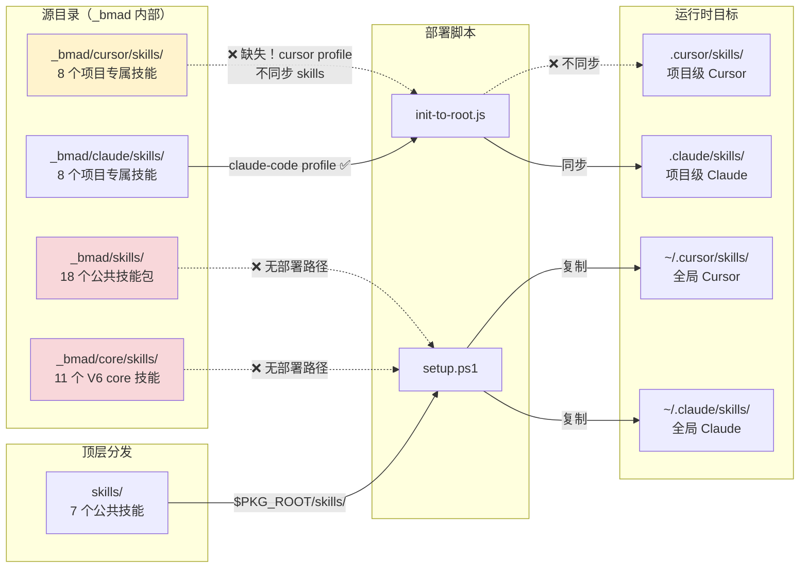
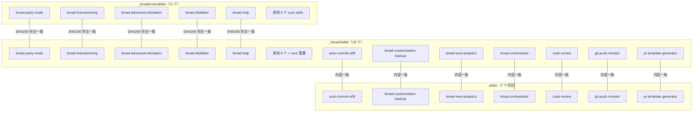
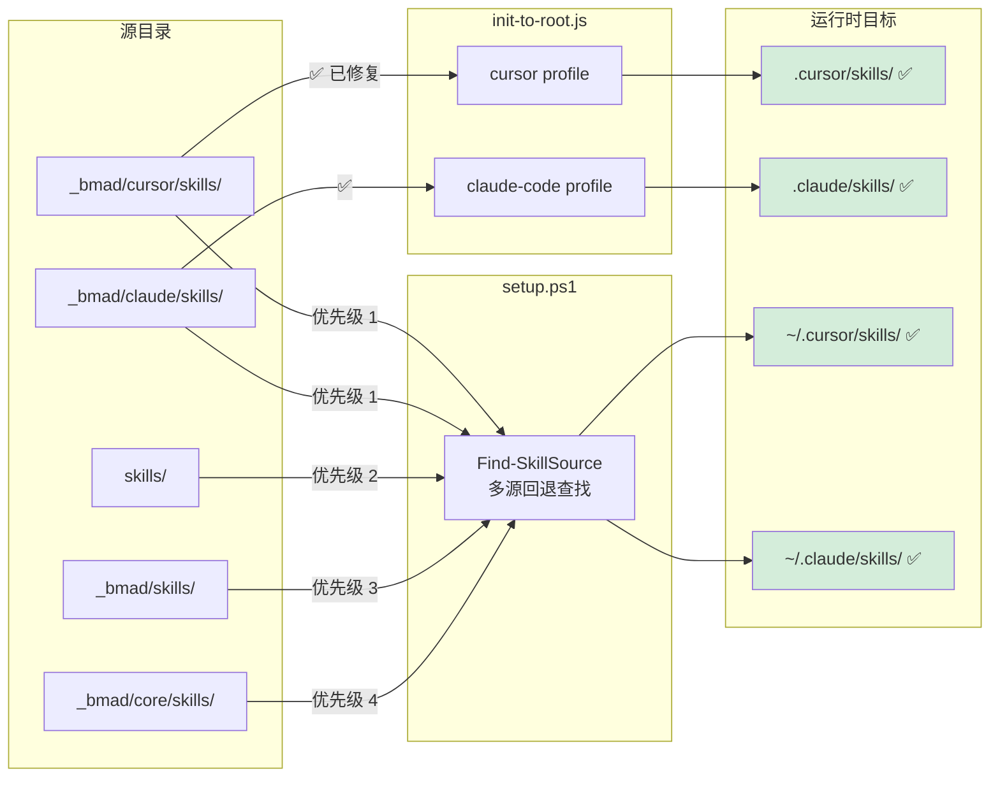
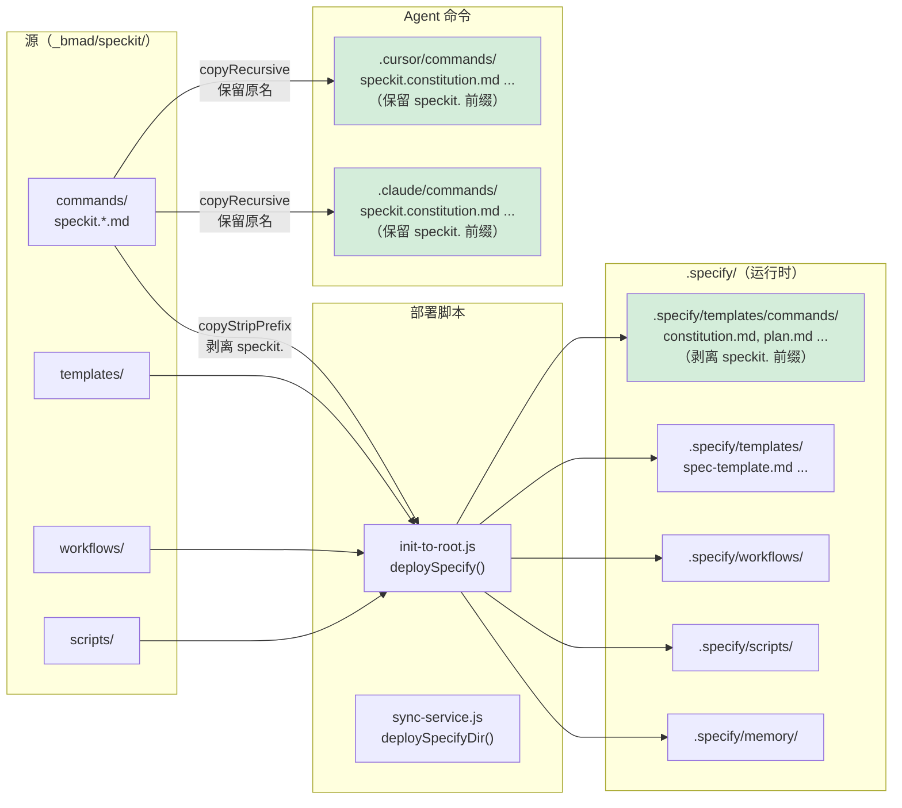
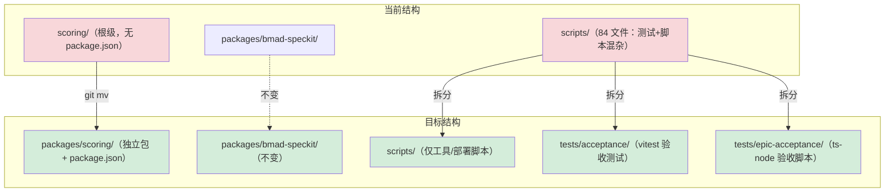

# 开源标准仓库整理方案 — 设计文档

> **日期**: 2026-03-16
> **状态**: 草案
> **关联文档**: [Runtime File Traceability Audit](../plans/2026-03-16-runtime-file-traceability-audit.md) · [UPSTREAM.md](../UPSTREAM.md)
> **范围**: 仓库清理、分发机制修复、文档重构、开源就绪

---

## 1. 背景与目标

BMAD-Speckit-SDD-Flow 是一个基于 BMAD Method + Spec-Driven Development 的 AI 辅助开发框架。项目已具备核心功能，但仓库中存在大量运行时部署产物被 git 跟踪、文档结构混乱、分发机制存在部署缺口等问题，距离"开源就绪"仍有差距。

**目标**：

1. 清除运行时/临时文件，让仓库只保留**源代码**
2. 修复分发部署机制中的缺口，确保新项目能完整获取所有技能
3. 按 Diataxis 框架重组文档结构
4. 为后续 Website 文档站点（Astro + Starlight）奠定内容基础

---

## 2. 上游 Website 架构分析

通过分析上游 BMAD-METHOD 仓库的 `astro.config.mjs`，其文档站点架构清晰：

| 维度 | 详情 |
|------|------|
| 框架 | Astro + Starlight（文档专用 SSG） |
| 内容来源 | 通过 symlink 复用 `docs/`：`website/src/content/docs → ../../docs` |
| 国际化 | 英文为 root（无 URL 前缀），中文在 `/zh-cn/` |
| 部署输出 | `build/site/` 静态 HTML |
| LLM 优化 | 自动生成 `llms.txt`、`llms-full.txt` 供 AI 消费 |
| 导航 | Sidebar 按 Diataxis 4 区块 autogenerate，无需手动维护 |
| 样式 | 自定义 CSS + 自定义 Header/MobileMenuFooter 组件 |

**关键发现**：网站与 `docs/` 是 **100% 内容复用**关系，不存在内容重复。写一份 `docs/`，网站自动渲染。

---

## 3. 当前仓库问题诊断

### 3.1 问题一：大量运行时/临时文件被 git 跟踪

以下文件/目录是运行时部署产物或会话临时数据，不应出现在开源仓库中：

| 分类 | 路径 | 说明 |
|------|------|------|
| 系统诊断 | `dxdiag_output.txt` | 系统硬件诊断，绝不应入库 |
| 会话状态 | `progress.txt` | 运行时临时文件 |
| OMC 运行时 | `.omc/project-memory.json`, `.omc/sessions/` | OMC 插件状态 |
| Agent 运行时 | `.agents/` | 本地 agent 缓存 |
| Claude 会话状态 | `.claude/state/handoffs/`, `.claude/state/locks/`, `.claude/state/stories/` | 20 个状态文件，全是开发会话产物 |
| 根 commands/ | `commands/`（90+ 文件） | `_bmad/` 的运行时部署副本 |
| 根 rules/ | `rules/` | `.cursor/rules/` 的部署副本 |
| 根 skills/ | `skills/` | `.cursor/skills/` 的部署副本 |
| Cursor 运行时 | `.cursor/commands/`, `.cursor/skills/`, `.cursor/agents/` | `bmad-speckit init` 的部署目标 |
| Claude 运行时 | `.claude/commands/`, `.claude/skills/`, `.claude/agents/` | `bmad-speckit init` 的部署目标 |

> **参考**: 此问题在 [Runtime File Traceability Audit](../plans/2026-03-16-runtime-file-traceability-audit.md) 中已系统审计（422+ 文件），确认 97% 以上文件有 `_bmad/` 源可追溯。

### 3.2 问题二：docs/ 结构混乱

当前 `docs/` 是扁平堆砌，与上游 Diataxis 结构差异巨大：

```text
docs/                                     # 当前结构
├── .gitkeep
├── INSTALLATION_AND_MIGRATION_GUIDE.md   # 教程内容，但无归类
├── MULTI-STORY.md                        # 操作指南，但无归类
├── PATH_CONVENTIONS.md                   # 概念说明，但无归类
├── QUICKSTART.md                         # 教程内容
├── SOURCE_CODE_LIST.md                   # 参考资料
├── UPSTREAM.md                           # 概念说明
├── WSL_SHELL_SCRIPTS.md                  # 操作指南
├── README.backup-20260310.md             # 备份文件，不应入库
├── speckit-cli-complete-mapping.md       # 参考资料
├── speckit-plan-waiting-for-review-解决方案.md  # 临时方案文件
├── guide/                                # 按平台分的指南
├── sample/                               # 示例文档
├── plans/                                # 已在 .gitignore 但仍被跟踪
├── design/                               # 已在 .gitignore 但仍被跟踪
├── PR/                                   # 已在 .gitignore 但仍被跟踪
└── assets/                               # 已在 .gitignore 但仍被跟踪
```

**问题**：`docs/plans/`、`docs/design/`、`docs/PR/`、`docs/assets/` 已写入 `.gitignore` 但之前提交过，仍在 git index 中。此问题已在 Traceability Audit GAP-10 中识别并由用户确认保留 gitignore、从 index 移除。

### 3.3 问题三：顶层目录过于扁平化

当前根目录有 35+ 个顶层条目，职责不清：

- `commands/`、`rules/`、`skills/`、`config/` 都是 speckit 运行时的部署目标（`templates/` 和 `workflows/` 已整合到 `_bmad/speckit/`，见 §4.6）
- `scoring/` 是核心包但未放在 `packages/` 下
- `specs/` 是 speckit 规格文件
- `test/` 只有一个测试文件

---

## 4. 分发机制完整分析

### 4.1 技能分发架构

BMAD-Speckit-SDD-Flow 中技能存在于 5 个源目录，通过 2 个部署脚本分发到 4 个运行时目标：



### 4.2 三个部署缺口

| 缺口编号 | 问题描述 | 影响 | 严重程度 |
|----------|----------|------|----------|
| **GAP-DEPLOY-01** | `init-to-root.js` cursor profile 不同步 `_bmad/cursor/skills/` → `.cursor/skills/` | 重装后 Cursor 项目级 8 个核心技能丢失 | **严重** |
| **GAP-DEPLOY-02** | `_bmad/core/skills/` 的 11 个 V6 core 技能没有任何部署脚本覆盖 | V6 新增的 brainstorming、distillator、editorial-review 等技能无法部署到新项目 | **中等** |
| **GAP-DEPLOY-03** | `setup.ps1` 的 `REQUIRED_SKILLS` 列表中有 4 个技能在 `skills/` 顶层目录不存在 | `speckit-workflow`、`bmad-story-assistant`、`bmad-bug-assistant`、`bmad-code-reviewer-lifecycle` 被列为必需但源目录不存在，静默跳过 | **中等** |

#### GAP-DEPLOY-01 详细分析

`init-to-root.js` 中 cursor profile 与 claude-code profile 的对比：

```javascript
// cursor profile — 只同步 commands 和 rules，缺少 skills
cursor: {
    sync(targetDir) {
      const cursorSync = [
        { src: path.join(bmadRoot, 'commands'), dest: '.cursor/commands' },
        { src: path.join(bmadRoot, 'cursor', 'rules'), dest: '.cursor/rules' },
        // ❌ 缺少: { src: path.join(bmadRoot, 'cursor', 'skills'), dest: '.cursor/skills' }
      ];
    }
}

// claude-code profile — 完整同步包括 skills
'claude-code': {
    sync(targetDir) {
      const claudeSync = [
        { src: path.join(bmadRoot, 'commands'), dest: '.claude/commands' },
        { src: path.join(bmadRoot, 'claude', 'rules'), dest: '.claude/rules' },
        { src: path.join(bmadRoot, 'claude', 'agents'), dest: '.claude/agents' },
        { src: path.join(bmadRoot, 'claude', 'skills'), dest: '.claude/skills' },  // ✅ 有
        // ...
      ];
    }
}
```

#### GAP-DEPLOY-02 详细分析

V6 核心技能位于 `_bmad/core/skills/` 和 `_bmad/skills/` 中，但没有任何脚本从这两个目录部署：

```text
_bmad/core/skills/ 中的 11 个技能（无部署路径）：
├── bmad-advanced-elicitation
├── bmad-brainstorming
├── bmad-distillator
├── bmad-editorial-review-prose
├── bmad-editorial-review-structure
├── bmad-help
├── bmad-index-docs
├── bmad-party-mode
├── bmad-review-adversarial-general
├── bmad-review-edge-case-hunter
└── bmad-shard-doc
```

`setup.ps1` 只从 `skills/`（顶层）目录查找，该目录仅含 7 个公共技能，不包含上述 11 个。

#### GAP-DEPLOY-03 详细分析

`setup.ps1` 中 `REQUIRED_SKILLS` 列表声明了 5 个必需技能，但其中 4 个在 `skills/` 顶层目录中不存在：

| 技能名 | `skills/` 中存在？ | 实际位置 | 结果 |
|--------|---------------------|----------|------|
| `speckit-workflow` | ❌ | `_bmad/cursor/skills/` | 静默跳过 |
| `bmad-story-assistant` | ❌ | `_bmad/cursor/skills/` | 静默跳过 |
| `bmad-bug-assistant` | ❌ | `_bmad/cursor/skills/` | 静默跳过 |
| `bmad-code-reviewer-lifecycle` | ❌ | `_bmad/cursor/skills/` | 静默跳过 |
| `code-review` | ✅ | `skills/code-review/` | 正常复制 |

### 4.3 技能源目录关系



**结论**：

- `_bmad/core/skills/`（11 个）⊂ `_bmad/skills/`（18 个）⊃ `skills/`（7 个）
- `_bmad/core/skills/` 与 `_bmad/skills/` 中的 11 个重叠技能 SHA256 完全一致
- `_bmad/skills/` 中的另外 7 个与 `skills/` 顶层目录内容一致
- **`_bmad/core/skills/` 是 `_bmad/skills/` 的真子集，属于架构冗余**

### 4.4 部署脚本修复方案

#### 修复 GAP-DEPLOY-01：`init-to-root.js`

在 cursor profile 的 `cursorSync` 数组中增加 skills 同步行：

```javascript
const cursorSync = [
    { src: path.join(bmadRoot, 'commands'), dest: '.cursor/commands' },
    { src: path.join(bmadRoot, 'cursor', 'rules'), dest: '.cursor/rules' },
    { src: path.join(bmadRoot, 'cursor', 'skills'), dest: '.cursor/skills' },  // 新增
];
```

#### 修复 GAP-DEPLOY-02 + GAP-DEPLOY-03：`setup.ps1`

1. 新增 `$V6_CORE_SKILLS` 列表，涵盖 11 个 V6 core 技能
2. 新增 `Find-SkillSource` 函数，按优先级从多个源目录查找技能：
   - 优先 IDE 适配层（`_bmad/cursor/skills/` 或 `_bmad/claude/skills/`）
   - 回退顶层 `skills/`
   - 再回退 `_bmad/skills/`
   - 最后回退 `_bmad/core/skills/`
3. 补充遗漏的 `OPTIONAL_SKILLS`（`bmad-standalone-tasks-doc-review`、`bmad-rca-helper`、`bmad-eval-analytics`）

### 4.5 修复后的部署链路



### 4.6 Speckit 源代码整合（已实施）

#### 问题诊断

Speckit 相关文件分散在 6 个不同目录，来源混乱且不便管理：

| 目录 | 内容 | 文件数 | 问题 |
|------|------|--------|------|
| `_bmad/commands/speckit.*.md` | 9 个 speckit 命令 | 9 | 与 bmad 命令混杂 |
| `templates/`（根目录） | speckit 模板文件 | 8 | 顶层目录属于运行时产物，却被 git 跟踪 |
| `workflows/`（根目录） | speckit 工作流文件 | 7 | 同上 |
| `_bmad/scripts/bmad-speckit/` | speckit 脚本 | ~20 | 深层嵌套，路径冗长 |
| `.speckit/config.yaml` | 审计收敛配置 | 1 | 非标准目录，已废弃 |
| `.speckit-state.yaml` | speckit 状态机 | 1 | 运行时状态，不应入库 |

#### 整合方案

**新增 `_bmad/speckit/` 作为 BMAD 的 speckit 子模块**，将所有 speckit 源文件归拢到统一位置：

```text
_bmad/speckit/                    # 新模块（唯一 speckit 源目录）
├── commands/                     # 9 个 speckit 命令（带 speckit. 前缀）
│   ├── speckit.constitution.md
│   ├── speckit.specify.md
│   ├── speckit.plan.md
│   ├── speckit.tasks.md
│   ├── speckit.implement.md
│   ├── speckit.analyze.md
│   ├── speckit.checklist.md
│   ├── speckit.clarify.md
│   └── speckit.taskstoissues.md
├── templates/                    # 模板文件
│   ├── spec-template.md
│   ├── plan-template.md
│   ├── tasks-template.md
│   ├── constitution-template.md
│   ├── checklist-template.md
│   ├── agent-file-template.md
│   ├── vscode-settings.json
│   └── memory/
│       └── constitution.md
├── workflows/                    # 工作流定义
│   ├── constitution.md
│   ├── specify.md
│   ├── plan.md
│   ├── tasks.md
│   ├── implement.md
│   ├── checklist.md
│   └── clarify.md
└── scripts/                      # speckit 脚本
    ├── shell/
    ├── powershell/
    └── python/
```

**迁移操作**（使用 `git mv` 保留历史）：

```bash
git mv _bmad/commands/speckit.*.md _bmad/speckit/commands/
git mv templates/* _bmad/speckit/templates/
git mv workflows/* _bmad/speckit/workflows/
git mv _bmad/scripts/bmad-speckit/* _bmad/speckit/scripts/
```

`.speckit/config.yaml` 已迁移至 `config/speckit.yaml`，`.speckit/` 目录已删除。

### 4.7 Speckit 运行时部署到 `.specify/`（已实施）

#### 上游 spec-kit 部署模型分析

通过分析 [github/spec-kit](https://github.com/github/spec-kit) 源码（`src/specify_cli/__init__.py`），确认上游 `specify init` 的最终部署结构：

```text
项目根/
├── .specify/                              # Speckit 运行时目录
│   ├── templates/                         # 模板文件
│   │   ├── spec-template.md
│   │   ├── plan-template.md
│   │   ├── constitution-template.md
│   │   ├── tasks-template.md
│   │   └── commands/                      # 命令定义（无 speckit. 前缀）
│   │       ├── constitution.md
│   │       ├── specify.md
│   │       ├── plan.md
│   │       ├── tasks.md
│   │       ├── implement.md
│   │       ├── analyze.md
│   │       ├── checklist.md
│   │       ├── clarify.md
│   │       └── taskstoissues.md
│   ├── workflows/                         # 工作流
│   ├── scripts/                           # 脚本
│   ├── memory/                            # constitution 实例
│   │   └── constitution.md
│   └── init-options.json                  # init 配置
│
├── .cursor/commands/                      # Agent 命令（有 speckit. 前缀）
│   ├── speckit.constitution.md
│   ├── speckit.specify.md
│   └── ...
│
├── .claude/commands/                      # Claude Agent 命令（有 speckit. 前缀）
│   └── ...
│
└── specs/                                 # 规格文件产出
```

#### 关键发现：命名惯例差异

上游在两个部署路径使用**不同的命名惯例**：

| 部署路径 | 命名惯例 | 用途 | 示例 |
|----------|---------|------|------|
| `.specify/templates/commands/` | **无** `speckit.` 前缀 | 内部交叉引用（constitution 一致性检查等） | `plan.md` |
| `.{agent}/commands/` | **有** `speckit.` 前缀 | Agent 命令发现与执行 | `speckit.plan.md` |

上游 `install_ai_skills()` 函数中有对应的前缀处理逻辑：

```python
source_name = command_file.name
if source_name.startswith("speckit."):
    source_name = source_name[len("speckit."):]
```

#### 部署实现

在 `init-to-root.js` 和 `sync-service.js` 中新增 `.specify/` 部署逻辑：



**前缀剥离函数**（`init-to-root.js` 中新增 `copyStripPrefix`，`sync-service.js` 中新增 `copyDirStripPrefix`）：

```javascript
function copyStripPrefix(src, dest, prefix) {
  if (!fs.existsSync(dest)) fs.mkdirSync(dest, { recursive: true });
  for (const name of fs.readdirSync(src)) {
    const srcPath = path.join(src, name);
    const stat = fs.statSync(srcPath);
    if (stat.isDirectory()) {
      copyRecursive(srcPath, path.join(dest, name));
    } else {
      const destName = name.startsWith(prefix) ? name.slice(prefix.length) : name;
      fs.copyFileSync(srcPath, path.join(dest, destName));
    }
  }
}
```

### 4.8 路径引用更新（已实施）

整合后，所有对旧路径的引用均已更新：

| 旧路径 | 新路径 | 影响文件数 |
|--------|--------|-----------|
| `_bmad/scripts/bmad-speckit/` | `_bmad/speckit/scripts/` | ~25 |
| `_bmad/commands/speckit.*.md` | `_bmad/speckit/commands/speckit.*.md` | 9（git mv） |
| 根 `templates/` | `_bmad/speckit/templates/` | 8（git mv） |
| 根 `workflows/` | `_bmad/speckit/workflows/` | 7（git mv） |
| `.speckit/config.yaml` | `config/speckit.yaml` | 1 |

**受影响的文件清单**（均已完成更新）：

| 分类 | 文件 | 修改内容 |
|------|------|---------|
| **部署脚本** | `scripts/init-to-root.js` | 新增 `deploySpecify()` + `copyStripPrefix()`；speckit commands 合并到 `.cursor/commands/` |
| **部署脚本** | `packages/bmad-speckit/src/services/sync-service.js` | 新增 `deploySpecifyDir()` + `copyDirStripPrefix()`；speckit commands 合并到 agent commands dir |
| **部署脚本** | `scripts/setup.ps1` | 更新验证路径 |
| **同步脚本** | `scripts/bmad-sync-from-v6.ps1` | 排除 `_bmad/speckit`，更新备份条目 |
| **同步脚本** | `scripts/bmad-sync-from-v6.sh` | 同上 |
| **代码生成** | `packages/bmad-speckit/src/commands/script-generator.js` | `SCRIPT_DIR_REL` 更新 |
| **Cursor 技能** | `_bmad/cursor/skills/speckit-workflow/SKILL.md` | 命令路径引用 |
| **Cursor 技能** | `_bmad/cursor/skills/speckit-workflow/references/audit-config-schema.md` | 校验脚本路径 |
| **Cursor 技能** | `_bmad/cursor/skills/bmad-story-assistant/SKILL.md` | 前置检查脚本路径 |
| **Claude 技能** | `_bmad/claude/skills/speckit-workflow/SKILL.md` | 同 Cursor 版本 |
| **Claude 技能** | `_bmad/claude/skills/speckit-workflow/references/audit-config-schema.md` | 同 Cursor 版本 |
| **Claude 技能** | `_bmad/claude/skills/bmad-story-assistant/SKILL.md` | 同 Cursor 版本 |
| **Claude Agent** | `_bmad/claude/agents/bmad-story-create.md` | sprint-ready 脚本路径 |
| **Speckit 内部** | `_bmad/speckit/commands/speckit.*.md`（9 个） | 内部引用路径 |
| **Speckit 内部** | `_bmad/speckit/scripts/shell/common.sh` | 内部引用路径 |
| **Speckit 内部** | `_bmad/speckit/scripts/python/validate_sync_manifest.py` | 内部引用路径 |
| **Speckit 内部** | `_bmad/speckit/templates/plan-template.md` | 回退到上游原始引用 `.specify/templates/plan-template.md` |
| **项目配置** | `package.json` | 移除 `files` 中的 `templates`、`workflows` |
| **项目配置** | `.gitignore` | 新增 `.specify/` 条目 |
| **文档** | `CLAUDE.md`、`docs/WSL_SHELL_SCRIPTS.md`、`docs/UPSTREAM.md` 等 | 路径引用更新 |
| **E2E 测试** | `packages/bmad-speckit/tests/e2e/init-e2e.test.js` | 脚本生成路径断言更新 |

### 4.9 上游一致性保障

为确保后续与上游 spec-kit 同步安全，遵循以下原则：

1. **不修改 speckit 命令定义中的引用路径**：
   - `speckit.constitution.md` 中引用 `.specify/templates/commands/*.md`（glob）→ 保持原样
   - `plan-template.md` 中引用 `.specify/templates/plan-template.md` → 回退到上游原始值
   - 通过部署脚本在运行时创建这些路径下的文件，而非修改定义

2. **部署时自动适配命名惯例**：
   - 源文件名始终为 `speckit.*.md`（便于识别和管理）
   - 部署到 `.specify/templates/commands/` 时自动剥离 `speckit.` 前缀（与上游一致）
   - 部署到 `.{agent}/commands/` 时保留 `speckit.` 前缀（Agent 命令发现依赖此前缀）

3. **`.specify/` 目录 gitignore**：
   - 作为运行时部署产物，已加入 `.gitignore`
   - 每次 `init-to-root.js` 或 `SyncService` 执行时重新生成

### 4.10 最终部署路径全景

```text
项目根/
│
├── _bmad/speckit/                         # 【源】唯一 speckit 源目录
│   ├── commands/speckit.*.md              #   9 个命令（有前缀）
│   ├── templates/                         #   模板文件
│   ├── workflows/                         #   工作流文件
│   └── scripts/                           #   shell/powershell/python 脚本
│
├── .specify/                              # 【运行时部署】Speckit 工作目录
│   ├── templates/
│   │   ├── spec-template.md               #   ← _bmad/speckit/templates/
│   │   ├── plan-template.md
│   │   ├── constitution-template.md
│   │   └── commands/                      #   ← _bmad/speckit/commands/（剥离 speckit. 前缀）
│   │       ├── constitution.md
│   │       ├── specify.md
│   │       ├── plan.md
│   │       └── ...
│   ├── workflows/                         #   ← _bmad/speckit/workflows/
│   ├── scripts/                           #   ← _bmad/speckit/scripts/shell + powershell
│   └── memory/                            #   constitution 实例
│
├── .cursor/commands/                      # 【运行时部署】Cursor Agent 命令
│   ├── speckit.constitution.md            #   ← _bmad/speckit/commands/（保留前缀）
│   ├── speckit.specify.md
│   └── ...                                #   + _bmad/commands/ 中的 bmad 命令
│
├── .claude/commands/                      # 【运行时部署】Claude Agent 命令
│   ├── speckit.constitution.md            #   ← _bmad/speckit/commands/（保留前缀）
│   └── ...
│
├── config/
│   └── speckit.yaml                       # 【源】审计收敛配置（从 .speckit/ 迁入）
│
└── specs/                                 # 【产出】Speckit 规格文件
    └── ...
```

**验证结果**：170 tests pass / 0 fail，所有引用路径在开发环境和用户部署运行时均可正确解析。

---

## 5. .gitignore 补充与 git index 清理

### 5.1 建议新增的 .gitignore 条目

```gitignore
# === Speckit 状态模板 ===
.speckit-state.yaml.template

# === 备份文件 ===
*.backup-*.md
```

### 5.2 需要保留的目录（属于项目源代码）

| 目录/文件 | 说明 |
|-----------|------|
| `_bmad/` | BMAD 内容库（核心资产、所有技能/工作流/命令的唯一源） |
| `packages/` | bmad-speckit CLI 包源代码 |
| `scripts/` | 部署脚本（init-to-root.js、setup.ps1 等） |
| `scoring/` | 评分系统源代码 |
| `specs/` | Speckit 规格文件（可讨论是否保留示例） |
| `CLAUDE.md` | Claude Code 项目说明（初始生成后成为项目配置） |
| `.claudeignore` | Claude 忽略配置 |

### 5.3 git index 清理命令

```bash
# 从 git index 移除运行时部署产物（文件保留在磁盘上）
git rm --cached -r commands/ rules/ skills/
git rm --cached -r .cursor/commands/ .cursor/skills/ .cursor/agents/ .cursor/rules/
git rm --cached -r .claude/commands/ .claude/skills/ .claude/agents/ .claude/hooks/
git rm --cached -r .claude/protocols/ .claude/state/ .claude/settings.json
git rm --cached -r .claude/settings.local.json .claude/mcp.json
git rm --cached -r .agents/ .omc/
git rm --cached progress.txt dxdiag_output.txt temp_commit_message.txt

# 从 git index 移除已 gitignore 的 docs 子目录
git rm --cached -r docs/plans/ docs/design/ docs/assets/ docs/PR/ docs/references/
```

---

## 6. docs/ Diataxis 重构方案

### 6.1 目标结构

参照上游 Starlight 站点的 Diataxis 分区，建议重组为：

```text
docs/
├── index.md                           # 欢迎页（参考上游 index.md 格式）
├── _STYLE_GUIDE.md                    # 文档风格指南（采用上游版本）
│
├── tutorials/                         # 教程（学习导向）
│   ├── getting-started.md             # ← QUICKSTART.md + INSTALLATION 合并
│   ├── first-story.md                 # ← 新：第一个 Story 端到端教程
│   └── speckit-workflow.md            # ← 新：Speckit 工作流教程
│
├── how-to/                            # 操作指南（任务导向）
│   ├── cursor-setup.md                # ← guide/cursor/README.md
│   ├── claude-code-setup.md           # ← guide/claudecode/README.md
│   ├── multi-story.md                 # ← MULTI-STORY.md
│   ├── bmad-story-assistant.md        # ← guide/*/bmad-story-assistant.md 合并
│   ├── wsl-shell-scripts.md           # ← WSL_SHELL_SCRIPTS.md
│   └── migration.md                   # ← INSTALLATION_AND_MIGRATION_GUIDE.md 迁移部分
│
├── explanation/                       # 概念说明（理解导向）
│   ├── architecture.md                # ← 新：整体架构说明
│   ├── path-conventions.md            # ← PATH_CONVENTIONS.md
│   ├── upstream-relationship.md       # ← UPSTREAM.md
│   ├── dual-agent-architecture.md     # ← 新：双 Agent 架构设计
│   └── scoring-system.md              # ← 新：评分系统说明
│
├── reference/                         # 参考资料（信息导向）
│   ├── speckit-cli.md                 # ← speckit-cli-complete-mapping.md
│   ├── source-code.md                 # ← SOURCE_CODE_LIST.md
│   ├── bmad-help-catalog.md           # ← 新：基于 bmad-help.csv 的工作流目录
│   └── changelog.md                   # ← 或链接到 CHANGELOG.md
│
├── zh-cn/                             # 中文翻译（跟随上游 i18n 方案）
│   └── ...                            # 镜像英文结构
│
└── sample/                            # 示例文档
    ├── prd.md
    └── 批判审计员复审示例报告.md
```

### 6.2 文件迁移映射

| 当前文件 | 目标位置 | 操作 |
|----------|----------|------|
| `QUICKSTART.md` | `tutorials/getting-started.md` | 迁移 + 合并安装内容 |
| `INSTALLATION_AND_MIGRATION_GUIDE.md` | `tutorials/getting-started.md` + `how-to/migration.md` | 拆分 |
| `MULTI-STORY.md` | `how-to/multi-story.md` | 迁移 |
| `PATH_CONVENTIONS.md` | `explanation/path-conventions.md` | 迁移 |
| `UPSTREAM.md` | `explanation/upstream-relationship.md` | 迁移 |
| `WSL_SHELL_SCRIPTS.md` | `how-to/wsl-shell-scripts.md` | 迁移 |
| `SOURCE_CODE_LIST.md` | `reference/source-code.md` | 迁移 |
| `speckit-cli-complete-mapping.md` | `reference/speckit-cli.md` | 迁移 |
| `guide/cursor/*.md` | `how-to/cursor-setup.md` | 合并 |
| `guide/claudecode/*.md` | `how-to/claude-code-setup.md` | 合并 |
| `README.backup-20260310.md` | 删除 | 备份文件不应入库 |
| `speckit-plan-waiting-for-review-解决方案.md` | 删除 | 临时方案文件 |

### 6.3 需删除/不再跟踪的文件

| 文件/目录 | 原因 |
|-----------|------|
| `docs/README.backup-20260310.md` | 备份文件 |
| `docs/speckit-plan-waiting-for-review-解决方案.md` | 临时方案文件 |
| `docs/plans/` | 已在 .gitignore，需从 index 移除 |
| `docs/design/` | 已在 .gitignore，需从 index 移除 |
| `docs/PR/` | 已在 .gitignore，需从 index 移除 |
| `docs/assets/` | 已在 .gitignore，需从 index 移除 |
| `docs/references/` | 只有 .gitkeep 和空 README |

---

## 7. 根目录结构优化

### 7.1 当前 vs 目标对比


---

## 8. Website 文档站点方案

### 8.1 是否需要 Website？

如果计划做开源文档站点，可以完全复用上游的 Astro + Starlight 方案：

1. 创建 `website/` 目录
2. 配置 `astro.config.mjs`（参考上游）
3. 用 symlink 指向 `docs/`：`website/src/content/docs → ../../docs`
4. 部署到 GitHub Pages / Vercel / Netlify
5. 自动获得 LLM-friendly `llms.txt` 输出

### 8.2 建议策略

**先做 docs 重构，后做 website 搭建**：

- 确保内容结构正确 → 后续搭 website 只需配置，不需改内容
- 一步到位虽然理想，但工作量大，且 docs 结构是前置依赖

---

## 9. 源代码与测试代码结构标准化

### 9.1 当前问题诊断

项目有 3 个代码域，但组织方式各不相同：

| 代码域 | 当前位置 | 语言 | 测试框架 | 测试位置 | 问题 |
|--------|---------|------|----------|----------|------|
| bmad-speckit CLI | `packages/bmad-speckit/` | JS | `node:test` | `packages/bmad-speckit/tests/` | ✅ 标准 |
| scoring 系统 | `scoring/`（根级） | TypeScript | vitest | 混合 `__tests__/` + 子模块 `__tests__/` | ❌ 不在 packages/ 下 |
| 脚本/工具 | `scripts/` | TypeScript | vitest | 测试与脚本混在 scripts/ | ❌ 严重混杂 |

**关键数据**:

- `scoring/`：59 个源文件、57 个测试文件、21 个子目录——是一个完整的包，却没有 `package.json`
- `scripts/`：84 个 .ts 文件中，32 个是 vitest 验收测试（`accept-*.test.ts`），13 个是 ts-node 验收脚本（`accept-*.ts`），39 个是工具/部署脚本
- `scoring/data/` 中有 40+ 个运行时评分数据文件（`dev-*.json`、`cli-*.json`）被 git 跟踪

### 9.2 目标结构



### 9.3 迁移影响范围

| 变更项 | 影响文件数 | 风险 |
|--------|-----------|------|
| `git mv scoring/ packages/scoring/` | 1 个 git mv 操作 | 低 |
| scripts/ 中 import 路径更新（`../scoring/` → `../packages/scoring/`） | 约 40 个 .ts 文件 | 中（机械性替换） |
| package.json npm scripts 路径更新 | 1 个文件，约 15 处修改 | 低 |
| tsconfig.json include 更新 | 1 处修改 | 低 |
| 验收测试迁移（45 个文件） | 45 个 git mv 操作 | 低 |
| 验收测试 import 路径更新 | 约 45 个文件 | 中（机械性替换） |

---

## 10. 执行优先级

| 优先级 | 任务 | 复杂度 | 影响 | 状态 |
|--------|------|--------|------|------|
| **P0** | .gitignore 补充 + `git rm --cached` 清理 index | 低 | 去除大量噪音文件 | ⬜ 待执行 |
| **P0** | 修复 `init-to-root.js` Cursor skills 同步缺口 | 低 | 新安装后 Cursor 技能完整 | ✅ 已修复 |
| **P0** | 修复 `setup.ps1` V6 core 技能 + 双源回退 | 中 | 全局技能完整部署 | ✅ 已修复 |
| **P0** | Speckit 源代码整合到 `_bmad/speckit/` | 中 | 消除 6 处分散、统一管理 | ✅ 已完成（§4.6） |
| **P0** | Speckit 运行时部署到 `.specify/` | 中 | 与上游 spec-kit 一致 | ✅ 已完成（§4.7） |
| **P0** | `.specify/templates/commands/` 前缀剥离 | 低 | 上游命名惯例一致 | ✅ 已完成（§4.7） |
| **P0** | 全量路径引用更新（25+ 文件） | 中 | 消除引用断裂 | ✅ 已完成（§4.8） |
| **P1** | 删除 `dxdiag_output.txt`、`progress.txt`、备份文件 | 低 | 消除敏感/无关内容 | ⬜ 待执行 |
| **P2** | `docs/` Diataxis 重构 | 中 | 开源文档专业度 | ⬜ 待执行 |
| **P3** | 根目录 `README.md` 更新 | 中 | 开源第一印象 | ⬜ 待执行 |
| **P2** | `scoring/` → `packages/scoring/` 迁移 | 中 | monorepo 标准化 | ⬜ 待执行 |
| **P2** | `scripts/` 验收测试 → `tests/` 分离 | 中 | 测试代码与脚本分离 | ⬜ 待执行 |
| **P4** | Website 搭建（Astro + Starlight） | 高 | 文档站点（可后续做） | ⬜ 待规划 |

---

## 11. 风险与注意事项

1. **`git rm --cached` 不可逆**：执行前必须确认 `.gitignore` 已正确配置，避免意外丢失文件追踪
2. **分发冗余**：`_bmad/core/skills/` 与 `_bmad/skills/` 存在 11 个完全一致的副本，长期应由上游统一管理
3. **docs 迁移需更新内部链接**：文件移动后，所有 markdown 内部引用需同步更新
4. **Website 部署**：symlink 在 Windows 上需要管理员权限或 Developer Mode，跨平台兼容性需考虑
5. **向后兼容**：已有使用者可能依赖当前路径，迁移需提供明确的 changelog 和迁移指南
6. **scoring 迁移的 import 路径**：40+ 个文件需要更新 import 路径，虽是机械性替换但数量大，需逐一验证
7. **npm workspace 兼容性**：根 `package.json` 已有 `"bmad-speckit": "file:packages/bmad-speckit"` 的 `file:` 链接，新增 `workspaces` 字段时需验证两者共存无冲突
8. **scoring/data/ 运行时数据**：40+ 个 JSON 文件需从 git index 移除，保留测试 fixture（`__fixtures-*`）
9. **speckit 上游同步**：`_bmad/speckit/commands/` 中的文件已与上游 spec-kit 的 `templates/commands/` 对齐，后续同步时需注意前缀差异（源文件带 `speckit.` 前缀，上游不带）——同步脚本 `bmad-sync-from-v6.ps1` 已将 `_bmad/speckit` 加入排除列表
10. **`.specify/` 运行时目录**：已加入 `.gitignore`，由 `init-to-root.js` 和 `SyncService` 在每次初始化/同步时重新生成；用户不应手动修改此目录下的文件
