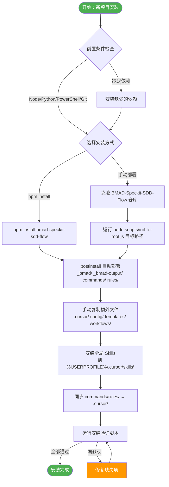
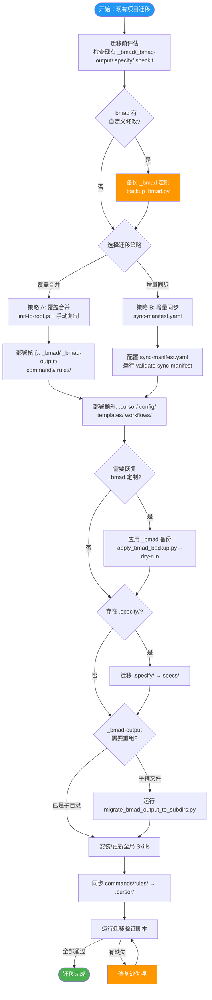
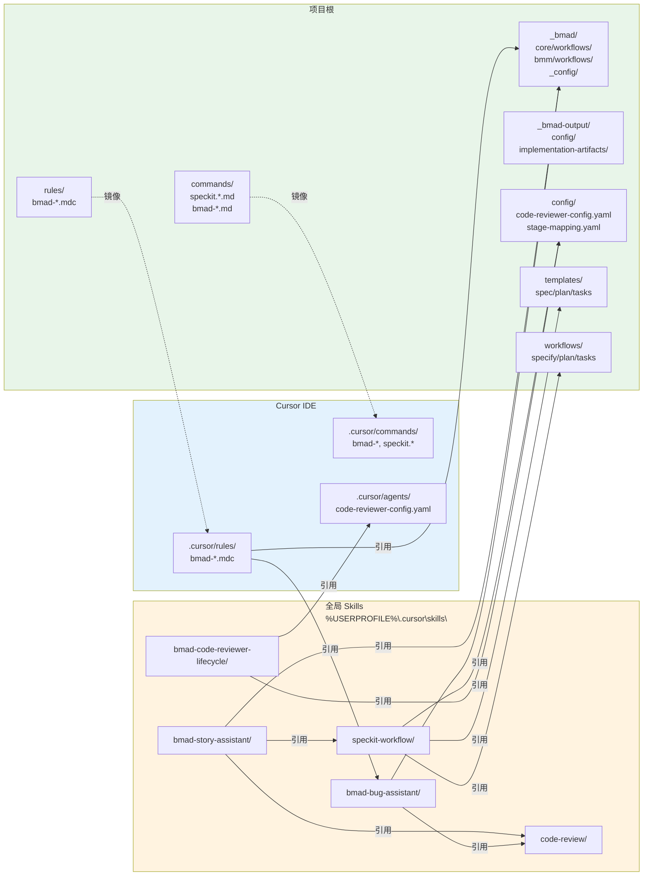
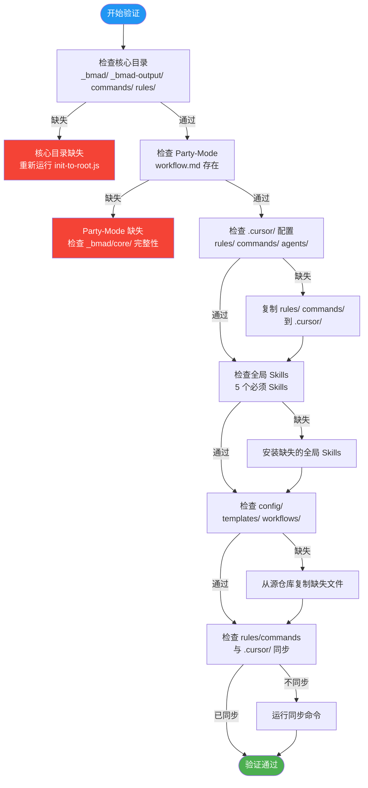

# BMAD-Speckit-SDD-Flow 安装与迁移完整指南

> **版本**：v1.0 | **最后更新**：2026-03-05 | **适用仓库**：[BMAD-Speckit-SDD-Flow](../README.md)

---

## 目录

- [1. 概述](#1-概述)
- [2. 仓库结构速查](#2-仓库结构速查)
- [3. 新项目安装流程](#3-新项目安装流程)
  - [3.1 前置条件](#31-前置条件)
  - [3.2 安装方式一：npm 安装（推荐）](#32-安装方式一npm-安装推荐)
  - [3.3 安装方式二：克隆后手动部署](#33-安装方式二克隆后手动部署)
  - [3.4 全局 Skills 安装](#34-全局-skills-安装)
  - [3.5 Cursor IDE 配置（rules / commands / agents）](#35-cursor-ide-配置rules--commands--agents)
  - [3.6 安装验证](#36-安装验证)
- [4. 现有项目迁移流程](#4-现有项目迁移流程)
  - [4.1 迁移前评估](#41-迁移前评估)
  - [4.2 迁移策略 A：覆盖合并](#42-迁移策略-a覆盖合并)
  - [4.3 迁移策略 B：增量同步](#43-迁移策略-b增量同步)
  - [4.4 _bmad 定制迁移](#44-_bmad-定制迁移)
  - [4.5 _bmad-output 迁移](#45-_bmad-output-迁移)
  - [4.6 迁移后路径修正](#46-迁移后路径修正)
  - [4.7 迁移验证](#47-迁移验证)
- [5. 引用路径完整映射表](#5-引用路径完整映射表)
  - [5.1 项目级路径（相对于项目根）](#51-项目级路径相对于项目根)
  - [5.2 全局路径（Cursor 全局 Skills）](#52-全局路径cursor-全局-skills)
  - [5.3 路径正确性自检清单](#53-路径正确性自检清单)
- [6. 流程图](#6-流程图)
  - [6.1 新项目安装流程图](#61-新项目安装流程图)
  - [6.2 现有项目迁移流程图](#62-现有项目迁移流程图)
  - [6.3 引用路径解析关系图](#63-引用路径解析关系图)
  - [6.4 安装后验证流程图](#64-安装后验证流程图)
- [7. 常见 Q&A](#7-常见-qa)
- [8. 故障排除](#8-故障排除)

---

## 1. 概述

**BMAD-Speckit-SDD-Flow** 是一套将 **BMAD Method**（多角色辩论驱动的产品/架构/Story 开发）与 **Speckit**（spec-driven 技术实现）融合的完整工作流框架。它提供：

- **五层架构**：产品定义 → Epic/Story 规划 → Story 开发 → 技术实现 → 收尾
- **审计闭环**：每个阶段通过 code-reviewer 多模式审计（prd/arch/code/pr）
- **Party-Mode 辩论**：关键决策点≥100 轮多角色辩论
- **TDD 红绿灯**：任务执行严格遵循测试驱动开发
- **Scoring 评分系统**：审计结果自动解析并评分

本指南覆盖两个场景：
1. **全新项目**：从零安装并配置全流程
2. **现有项目迁移**：已有部分 `_bmad`/`_bmad-output`/`.specify`/`.speckit` 等目录的项目，如何迁移到本全流程

---

## 2. 仓库结构速查

```
BMAD-Speckit-SDD-Flow/                 # 本仓库（安装源）
├── _bmad/                             # BMAD 核心框架（party-mode, agents, workflows）
│   ├── core/                          #   核心 agents/workflows（bmad-master, party-mode）
│   ├── bmm/                           #   BMAD Method workflows（create-prd, create-story 等）
│   ├── bmb/                           #   Module/Agent/Workflow builders
│   ├── tea/                           #   Test Architecture workflows
│   ├── cis/                           #   Creative Intelligence Suite
│   ├── _config/                       #   Manifest CSV, IDE 配置
│   ├── scoring/agents/                #   AI Coach agent 定义
│   └── scripts/bmad-speckit/          #   安装/迁移脚本（PowerShell + Python）
├── _bmad-output/                      # 实施产出与配置
│   ├── config/settings.json           #   worktree 粒度配置
│   └── implementation-artifacts/      #   Story 级产出、BUGFIX、sprint-status
├── commands/                          # Cursor/Claude 命令定义
│   ├── speckit.specify.md             #   Speckit: specify 命令
│   ├── speckit.plan.md                #   Speckit: plan 命令
│   ├── speckit.tasks.md               #   Speckit: tasks 命令
│   ├── speckit.implement.md           #   Speckit: implement 命令
│   ├── bmad-bmm-create-story.md       #   BMAD: Create Story
│   ├── bmad-bmm-dev-story.md          #   BMAD: Dev Story
│   └── ...                            #   ~70+ 命令文件
├── rules/                             # Cursor 规则文件
│   ├── bmad-bug-auto-party-mode.mdc   #   问题描述自动进入 party-mode
│   ├── bmad-story-assistant.mdc       #   Story 助手规则
│   └── bmad-bug-assistant.mdc         #   Bug 助手规则
├── config/                            # 项目配置
│   ├── code-reviewer-config.yaml      #   Code Reviewer 多模式配置
│   ├── stage-mapping.yaml             #   Stage 映射
│   ├── coach-trigger.yaml             #   AI Coach 触发配置
│   └── ...
├── skills/                            # 项目级 Skill 副本（克隆即用）
│   ├── speckit-workflow/              #   Speckit 工作流 skill
│   ├── bmad-story-assistant/          #   BMAD Story 助手 skill
│   ├── bmad-bug-assistant/            #   BMAD Bug 助手 skill
│   ├── bmad-code-reviewer-lifecycle/  #   全链路 Code Reviewer
│   ├── bmad-standalone-tasks/         #   独立任务执行
│   ├── bmad-customization-backup/     #   _bmad 定制备份
│   ├── bmad-orchestrator/             #   BMAD 流程编排
│   ├── using-git-worktrees/           #   Git Worktree 管理
│   ├── code-review/                   #   Code Review
│   ├── pr-template-generator/         #   PR 模板生成
│   ├── auto-commit-utf8/              #   UTF-8 中文提交
│   └── git-push-monitor/             #   Push 监控
├── scoring/                           # 评分系统
├── templates/                         # Speckit 模板
├── workflows/                         # Speckit 工作流定义
├── scripts/                           # 初始化与验收脚本
│   ├── init-to-root.js                #   核心：部署到项目根
│   └── accept-*.ts                    #   验收脚本
├── docs/                              # 文档
├── specs/                             # Epic/Story 规格文档
└── package.json                       # npm 包定义
```

**安装包包含的文件**（`package.json` 中的 `files` 字段）：
- `_bmad/` — BMAD 核心框架
- `_bmad-output/` — 产出目录骨架
- `commands/` — Cursor/Claude 命令
- `rules/` — Cursor 规则
- `scripts/` — 初始化脚本

> **未包含在 npm 包中但需单独处理**：`skills/`、`config/`、`scoring/`、`templates/`、`workflows/`、`.cursor/` 配置

---

## 3. 新项目安装流程

### 3.1 前置条件

| 条件 | 要求 | 说明 |
|------|------|------|
| Node.js | ≥18 | 运行 `init-to-root.js` 和 scoring 脚本 |
| Python | ≥3.8 | 运行迁移/备份脚本 |
| PowerShell | ≥7 | 运行 `check-prerequisites.ps1` 等脚本 |
| Cursor IDE | 最新版 | 使用 skills、commands、rules |
| Git | ≥2.x | worktree、分支管理 |

### 3.2 安装方式一：npm 安装（推荐）

> strict isolation：当前 `postinstall` / `npm run init` 默认走 `--agent cursor`。若需要 Claude Code，必须显式运行 `node scripts/init-to-root.js <targetDir> --agent claude-code`（或后续等价入口）。

```powershell
# 1. 进入目标项目根目录
cd D:\Dev\your-new-project

# 2. 安装 BMAD-Speckit-SDD-Flow（postinstall 默认以 --agent cursor 运行）
npm install --save-dev D:\Dev\BMAD-Speckit-SDD-Flow
# 或者使用本地路径 link
npm link D:\Dev\BMAD-Speckit-SDD-Flow

# 3. 若要生成 Claude Code 隔离运行时，显式执行
node D:\Dev\BMAD-Speckit-SDD-Flow\scripts\init-to-root.js D:\Dev\your-new-project --agent claude-code
```

#### 推荐：一键安装

```powershell
pwsh D:\Dev\BMAD-Speckit-SDD-Flow\scripts\setup.ps1 -Target D:\Dev\your-new-project
```

该脚本自动完成：核心目录部署 + `.cursor/` 同步 + 全局 Skills 安装 + 安装验证。

涉及 init / distribute / score / runtime 隔离改动时，发布前至少要执行 `npm run test:cursor-regression`，把 Cursor 零回退作为 release gate。

Claude Code 隔离入口验证使用 `npm run test:claude-isolation`。

Claude Code 运行时最少应验证以下路径存在：`.claude/agents`、`.claude/protocols`、`.claude/state`、`.claude/hooks`。
交叉安装后还应确认：Claude Code 安装不覆盖 `.cursor/**`，Cursor 安装不覆盖 `.claude/**`。

`postinstall` 脚本 (`scripts/init-to-root.js`) 将自动复制以下目录到项目根：
- `_bmad/` → `{项目根}/_bmad/`
- `_bmad-output/` → `{项目根}/_bmad-output/`
- `commands/` → `{项目根}/commands/`
- `rules/` → `{项目根}/rules/`

**若目标已存在同名目录，脚本会进行覆盖合并**（已有文件会被覆盖，新增文件会被添加）。

```powershell
# 3. 手动复制 npm 包中不含的目录
# （从 BMAD-Speckit-SDD-Flow 源仓库复制）

# 3a. Cursor IDE 配置
Copy-Item -Recurse -Force "D:\Dev\BMAD-Speckit-SDD-Flow\.cursor\commands" ".cursor\commands"
Copy-Item -Recurse -Force "D:\Dev\BMAD-Speckit-SDD-Flow\.cursor\rules" ".cursor\rules"
Copy-Item -Recurse -Force "D:\Dev\BMAD-Speckit-SDD-Flow\.cursor\agents" ".cursor\agents"

# 3b. 项目配置（code-reviewer、scoring 规则等）
Copy-Item -Recurse -Force "D:\Dev\BMAD-Speckit-SDD-Flow\config" "config"

# 3c. Speckit 模板和工作流定义
Copy-Item -Recurse -Force "D:\Dev\BMAD-Speckit-SDD-Flow\templates" "templates"
Copy-Item -Recurse -Force "D:\Dev\BMAD-Speckit-SDD-Flow\workflows" "workflows"

# 3d. 评分系统（若需要评分功能）
Copy-Item -Recurse -Force "D:\Dev\BMAD-Speckit-SDD-Flow\scoring" "scoring"
```

### 3.3 安装方式二：克隆后手动部署

```powershell
# 1. 克隆本仓库
git clone <BMAD-Speckit-SDD-Flow-repo-url> D:\Dev\BMAD-Speckit-SDD-Flow

# 2. 使用 init-to-root.js 部署到目标项目（默认 Cursor）
node D:\Dev\BMAD-Speckit-SDD-Flow\scripts\init-to-root.js D:\Dev\your-new-project --agent cursor

# 3. 如需 Claude Code，单独执行 claude-code 安装目标
node D:\Dev\BMAD-Speckit-SDD-Flow\scripts\init-to-root.js D:\Dev\your-new-project --agent claude-code

# 4. 同方式一的步骤 3：手动复制 .cursor/、config/、templates/、workflows/、scoring/
# 5. 验证交叉安装顺序（strict isolation）
#    - cursor->claude-code
#    - claude-code->cursor
```

### 3.4 全局 Skills 安装

全局 Skills 安装到 `%USERPROFILE%\.cursor\skills\`（Windows）或 `~/.cursor/skills/`（macOS/Linux）。

**必须安装的 Skills**（工作流核心依赖）：

| # | Skill | 安装命令 | 说明 |
|---|-------|----------|------|
| 1 | **speckit-workflow** | 见下方 | 核心：specify→plan→gaps→tasks→implement |
| 2 | **bmad-story-assistant** | 见下方 | Epic/Story 全流程 |
| 3 | **bmad-bug-assistant** | 见下方 | BUGFIX 全流程 |
| 4 | **bmad-code-reviewer-lifecycle** | 见下方 | 审计→解析→scoring 写入 |
| 5 | **code-review** | 见下方 | 审计执行引擎 |

**推荐安装的 Skills**（增强功能）：

| # | Skill | 说明 |
|---|-------|------|
| 6 | bmad-standalone-tasks | 按 TASKS/BUGFIX 文档执行任务 |
| 7 | bmad-customization-backup | _bmad 定制备份与迁移 |
| 8 | bmad-orchestrator | BMAD 流程编排 |
| 9 | using-git-worktrees | Epic 级 worktree 管理 |
| 10 | pr-template-generator | PR 模板生成 |
| 11 | auto-commit-utf8 | 中文提交 UTF-8 防乱码 |
| 12 | git-push-monitor | 长时间 push 监控 |
| 13 | ralph-method | 任务原子化分解 |
| 14 | speckit-workflow (附带 references/) | 审计 prompt 模板 |

**安装命令**：

```powershell
# 从本仓库 skills/ 目录复制到 Cursor 全局 skills 目录
$SKILLS_ROOT = "$env:USERPROFILE\.cursor\skills"

# 必须安装
$required = @(
    "speckit-workflow",
    "bmad-story-assistant",
    "bmad-bug-assistant",
    "bmad-code-reviewer-lifecycle",
    "code-review"
)

foreach ($skill in $required) {
    $src = "D:\Dev\BMAD-Speckit-SDD-Flow\skills\$skill"
    $dest = "$SKILLS_ROOT\$skill"
    if (Test-Path $src) {
        Copy-Item -Recurse -Force $src $dest
        Write-Host "[OK] $skill -> $dest"
    } else {
        Write-Warning "[SKIP] $skill not found in source"
    }
}

# 推荐安装
$optional = @(
    "bmad-standalone-tasks",
    "bmad-customization-backup",
    "bmad-orchestrator",
    "using-git-worktrees",
    "pr-template-generator",
    "auto-commit-utf8",
    "git-push-monitor"
)

foreach ($skill in $optional) {
    $src = "D:\Dev\BMAD-Speckit-SDD-Flow\skills\$skill"
    $dest = "$SKILLS_ROOT\$skill"
    if (Test-Path $src) {
        Copy-Item -Recurse -Force $src $dest
        Write-Host "[OK] $skill -> $dest"
    } else {
        Write-Warning "[SKIP] $skill not found in source"
    }
}
```

### 3.5 Cursor IDE 配置（rules / commands / agents）

安装后需确保以下 Cursor 配置正确放置：

```
{项目根}/
├── .cursor/
│   ├── rules/                           # Cursor 规则（always-applied）
│   │   ├── bmad-bug-auto-party-mode.mdc #   问题自动 party-mode
│   │   ├── bmad-story-assistant.mdc     #   Story 助手
│   │   └── bmad-bug-assistant.mdc       #   Bug 助手
│   ├── commands/                        # Cursor 命令（/bmad-*, /speckit.*）
│   │   ├── bmad-bmm-create-story.md
│   │   ├── bmad-bmm-dev-story.md
│   │   └── ...                          #   ~70+ 命令
│   └── agents/                          # Code Reviewer 配置
│       └── code-reviewer-config.yaml
├── commands/                            # 命令定义（通用，.cursor/commands/ 的镜像源）
├── rules/                               # 规则定义（通用，.cursor/rules/ 的镜像源）
```

> **重要**：`commands/` 和 `rules/` 分别在项目根和 `.cursor/` 下存在两份。项目根的版本是源文件，`.cursor/` 下的版本是 Cursor IDE 实际读取的。两者需保持同步。`init-to-root.js` 仅复制到项目根，需手动复制到 `.cursor/`。

```powershell
# 同步 commands/ 和 rules/ 到 .cursor/
Copy-Item -Recurse -Force "commands\*" ".cursor\commands\"
Copy-Item -Recurse -Force "rules\*" ".cursor\rules\"
```

### 3.6 安装验证

若使用 `setup.ps1` 安装，验证已内置。手动安装的验证步骤如下：

```powershell
# 1. 运行前置条件检查
pwsh _bmad\scripts\bmad-speckit\powershell\check-prerequisites.ps1 -PathsOnly

# 2. 验证目录存在
$checks = @(
    "_bmad",
    "_bmad\core\workflows\party-mode\workflow.md",
    "_bmad\bmm\workflows\4-implementation\create-story\workflow.yaml",
    "_bmad\_config\agent-manifest.csv",
    "_bmad-output\config\settings.json",
    "commands\speckit.specify.md",
    "commands\bmad-bmm-create-story.md",
    "rules\bmad-bug-auto-party-mode.mdc",
    ".cursor\rules\bmad-bug-auto-party-mode.mdc",
    ".cursor\commands\bmad-bmm-create-story.md",
    "config\code-reviewer-config.yaml",
    "templates\spec-template.md",
    "workflows\specify.md"
)
foreach ($path in $checks) {
    if (Test-Path $path) {
        Write-Host "[OK] $path" -ForegroundColor Green
    } else {
        Write-Host "[MISSING] $path" -ForegroundColor Red
    }
}

# 3. 验证全局 Skills
$SKILLS_ROOT = "$env:USERPROFILE\.cursor\skills"
$requiredSkills = @(
    "speckit-workflow\SKILL.md",
    "bmad-story-assistant\SKILL.md",
    "bmad-bug-assistant\SKILL.md",
    "bmad-code-reviewer-lifecycle\SKILL.md",
    "code-review\SKILL.md"
)
foreach ($skill in $requiredSkills) {
    $p = Join-Path $SKILLS_ROOT $skill
    if (Test-Path $p) {
        Write-Host "[OK] Global: $skill" -ForegroundColor Green
    } else {
        Write-Host "[MISSING] Global: $skill" -ForegroundColor Red
    }
}
```

---

## 4. 现有项目迁移流程

适用场景：项目已有 `_bmad/`、`_bmad-output/`、`.specify/`、`.speckit/` 等目录和文件（例如从早期同步方案获得），需迁移到本全流程。

### 4.1 迁移前评估

**迁移前必须回答的问题**：

| 检查项 | 命令/方法 | 目的 |
|--------|-----------|------|
| 现有 `_bmad/` 是否有自定义修改 | `git diff --stat _bmad/` 或人工检查 | 决定是否需要备份 |
| 现有 `_bmad-output/` 的产出 | `ls _bmad-output/implementation-artifacts/` | 确认现有产出不丢失 |
| 是否存在 `.specify/` | `Test-Path .specify` | 需迁移到 `specs/` |
| 是否存在 `.speckit/` | `Test-Path .speckit` | 需检查状态文件 |
| 现有 commands/rules 来源 | 对比文件内容 | 判断是否需要覆盖 |
| 全局 Skills 版本 | `ls $env:USERPROFILE\.cursor\skills\` | 确认是否需要更新 |

```powershell
# 迁移前评估脚本
$projectRoot = "D:\Dev\your-project"   # 替换为你的项目路径

Write-Host "=== 迁移前评估 ===" -ForegroundColor Cyan

# 检查各目录是否存在
$dirsToCheck = @("_bmad", "_bmad-output", ".specify", ".speckit", ".cursor", "commands", "rules", "specs", "config")
foreach ($d in $dirsToCheck) {
    $p = Join-Path $projectRoot $d
    if (Test-Path $p) {
        $count = (Get-ChildItem -Recurse -File $p -ErrorAction SilentlyContinue).Count
        Write-Host "[EXISTS] $d ($count files)" -ForegroundColor Yellow
    } else {
        Write-Host "[ABSENT] $d" -ForegroundColor Gray
    }
}
```

### 4.2 迁移策略 A：覆盖合并

> 适用于：现有 `_bmad/` 无重要自定义修改，或已做好备份。

```powershell
$SOURCE = "D:\Dev\BMAD-Speckit-SDD-Flow"
$TARGET = "D:\Dev\your-project"   # 替换为你的目标项目路径

# 步骤 1: 备份现有 _bmad 定制（若有修改）
python "$SOURCE\skills\bmad-customization-backup\scripts\backup_bmad.py" --project-root $TARGET

# 步骤 2: 使用 init-to-root.js 部署核心目录（覆盖合并）
node "$SOURCE\scripts\init-to-root.js" $TARGET

# 步骤 3: 部署 npm 包外的文件
Copy-Item -Recurse -Force "$SOURCE\.cursor\commands" "$TARGET\.cursor\commands"
Copy-Item -Recurse -Force "$SOURCE\.cursor\rules" "$TARGET\.cursor\rules"
Copy-Item -Recurse -Force "$SOURCE\.cursor\agents" "$TARGET\.cursor\agents"
Copy-Item -Recurse -Force "$SOURCE\config" "$TARGET\config"
Copy-Item -Recurse -Force "$SOURCE\templates" "$TARGET\templates"
Copy-Item -Recurse -Force "$SOURCE\workflows" "$TARGET\workflows"

# 步骤 4: 评分系统（按需）
# Copy-Item -Recurse -Force "$SOURCE\scoring" "$TARGET\scoring"

# 步骤 5: 应用之前的 _bmad 定制备份（若步骤 1 有备份）
# python "$SOURCE\skills\bmad-customization-backup\scripts\apply_bmad_backup.py" `
#     --backup-path "$TARGET\_bmad-output\bmad-customization-backups\<timestamp>_bmad" `
#     --project-root $TARGET `
#     --dry-run
```

### 4.3 迁移策略 B：增量同步

> 适用于：现有项目与本仓库有双仓库同步关系，需要增量更新。

使用 `sync-manifest.yaml` 进行路径映射同步：

```powershell
# 1. 创建 sync-manifest.yaml（从示例复制）
Copy-Item "$SOURCE\_bmad\scripts\bmad-speckit\sync-manifest.yaml.example" "$TARGET\sync-manifest.yaml"

# 2. 编辑 sync-manifest.yaml，调整路径映射
# path_a: 现有项目的相对路径
# path_b: 本仓库对应的相对路径

# 3. 验证映射
pwsh "$SOURCE\_bmad\scripts\bmad-speckit\powershell\validate-sync-manifest.ps1"
# 或
python "$SOURCE\_bmad\scripts\bmad-speckit\python\validate_sync_manifest.py"
```

`sync-manifest.yaml` 示例：

```yaml
paths:
  - path_a: "_bmad/"
    path_b: "_bmad/"
  - path_a: "_bmad-output/"
    path_b: "_bmad-output/"
  - path_a: ".cursor/agents/code-reviewer-config.yaml"
    path_b: "config/code-reviewer-config.yaml"
```

### 4.4 _bmad 定制迁移

若现有项目的 `_bmad/` 有自定义修改（如 party-mode 展示名优化、workflow 调整等）：

```powershell
# 1. 备份现有 _bmad 定制
python "$env:USERPROFILE\.cursor\skills\bmad-customization-backup\scripts\backup_bmad.py" `
    --project-root $TARGET

# 2. 覆盖为最新版本
node "$SOURCE\scripts\init-to-root.js" $TARGET

# 3. 应用备份中的定制（先 dry-run 确认）
$latestBackup = Get-ChildItem "$TARGET\_bmad-output\bmad-customization-backups" -Directory |
    Sort-Object Name -Descending | Select-Object -First 1
python "$env:USERPROFILE\.cursor\skills\bmad-customization-backup\scripts\apply_bmad_backup.py" `
    --backup-path $latestBackup.FullName `
    --project-root $TARGET `
    --dry-run

# 确认无误后去掉 --dry-run 执行
```

### 4.5 _bmad-output 迁移

现有项目的 `_bmad-output/implementation-artifacts/` 可能使用平铺结构（文件直接放在 `implementation-artifacts/` 下），需迁移到两级层级结构（`epic-{N}-{slug}/story-{N}-{slug}/`）。

```powershell
# 迁移平铺文件到 story 子目录（先 dry-run）
python "$SOURCE\_bmad\scripts\bmad-speckit\python\migrate_bmad_output_to_subdirs.py" `
    --project-root $TARGET `
    --dry-run

# 确认后执行
python "$SOURCE\_bmad\scripts\bmad-speckit\python\migrate_bmad_output_to_subdirs.py" `
    --project-root $TARGET
```

迁移规则：
- 文件名匹配 `{epic}-{story}-{slug}` 模式 → 移入对应子目录
- 无法解析的文件 → 移入 `_orphan/`
- `sprint-status.yaml` 保持原位
- `bmad-customization-backups/`、`speckit-scripts-backups/` 保持原位

### 4.6 迁移后路径修正

迁移后需检查并修正以下路径引用：

**1. `.specify/` → `specs/` 迁移**

若现有项目使用 `.specify/` 存放 spec 文件，需迁移到 `specs/` 目录：

```powershell
# 若存在 .specify/，将内容迁移到 specs/
if (Test-Path "$TARGET\.specify") {
    if (-not (Test-Path "$TARGET\specs")) {
        New-Item -ItemType Directory "$TARGET\specs"
    }
    # 复制 .specify/ 下内容到 specs/（保留原有内容）
    Copy-Item -Recurse -Force "$TARGET\.specify\*" "$TARGET\specs\"
    Write-Host "[MIGRATED] .specify/ -> specs/" -ForegroundColor Green
    # 确认后可删除 .specify/
    # Remove-Item -Recurse -Force "$TARGET\.specify"
}
```

**2. `.speckit/` 状态文件**

```powershell
# .speckit-state.yaml 模板（按需创建）
if (-not (Test-Path "$TARGET\.speckit-state.yaml")) {
    Copy-Item "$SOURCE\_bmad\scripts\bmad-speckit\templates\.speckit-state.yaml.template" `
        "$TARGET\.speckit-state.yaml"
    Write-Host "[CREATED] .speckit-state.yaml" -ForegroundColor Green
}
```

**3. `.cursor/rules/` 中的路径引用**

`.cursor/rules/bmad-bug-auto-party-mode.mdc` 引用 `{project-root}/_bmad/core/workflows/party-mode/workflow.md`。确保 `_bmad/core/workflows/party-mode/workflow.md` 存在：

```powershell
if (-not (Test-Path "$TARGET\_bmad\core\workflows\party-mode\workflow.md")) {
    Write-Host "[ERROR] party-mode workflow.md missing!" -ForegroundColor Red
}
```

### 4.7 迁移验证

```powershell
# 完整迁移验证
$TARGET = "D:\Dev\your-project"   # 替换为你的项目路径
Set-Location $TARGET

Write-Host "=== 迁移验证 ===" -ForegroundColor Cyan

# A. 核心目录
$coreDirs = @(
    @("_bmad", "BMAD 核心框架"),
    @("_bmad\core\workflows\party-mode", "Party-Mode 工作流"),
    @("_bmad\bmm\workflows\4-implementation\create-story", "Create Story 工作流"),
    @("_bmad\bmm\workflows\4-implementation\dev-story", "Dev Story 工作流"),
    @("_bmad\_config", "BMAD 配置"),
    @("_bmad-output", "产出目录"),
    @("_bmad-output\config", "产出配置"),
    @("commands", "命令定义"),
    @("rules", "规则定义"),
    @(".cursor\rules", "Cursor 规则"),
    @(".cursor\commands", "Cursor 命令"),
    @(".cursor\agents", "Cursor Agents"),
    @("config", "项目配置"),
    @("templates", "Speckit 模板"),
    @("workflows", "Speckit 工作流")
)

foreach ($item in $coreDirs) {
    if (Test-Path $item[0]) {
        Write-Host "[OK] $($item[1]): $($item[0])" -ForegroundColor Green
    } else {
        Write-Host "[MISSING] $($item[1]): $($item[0])" -ForegroundColor Red
    }
}

# B. 关键文件
$keyFiles = @(
    @("_bmad\core\workflows\party-mode\workflow.md", "Party-Mode workflow"),
    @("_bmad\_config\agent-manifest.csv", "Agent manifest"),
    @("commands\speckit.specify.md", "speckit.specify 命令"),
    @("commands\speckit.plan.md", "speckit.plan 命令"),
    @("commands\speckit.tasks.md", "speckit.tasks 命令"),
    @("commands\speckit.implement.md", "speckit.implement 命令"),
    @("commands\bmad-bmm-create-story.md", "Create Story 命令"),
    @("commands\bmad-bmm-dev-story.md", "Dev Story 命令"),
    @("rules\bmad-bug-auto-party-mode.mdc", "Bug auto party-mode 规则"),
    @(".cursor\rules\bmad-bug-auto-party-mode.mdc", "Cursor: Bug auto party-mode"),
    @("config\code-reviewer-config.yaml", "Code Reviewer 配置"),
    @("templates\spec-template.md", "Spec 模板"),
    @("workflows\specify.md", "Specify 工作流")
)

foreach ($item in $keyFiles) {
    if (Test-Path $item[0]) {
        Write-Host "[OK] $($item[1])" -ForegroundColor Green
    } else {
        Write-Host "[MISSING] $($item[1])" -ForegroundColor Red
    }
}

# C. 全局 Skills
$SKILLS_ROOT = "$env:USERPROFILE\.cursor\skills"
$requiredSkills = @(
    "speckit-workflow",
    "bmad-story-assistant",
    "bmad-bug-assistant",
    "bmad-code-reviewer-lifecycle",
    "code-review"
)
foreach ($skill in $requiredSkills) {
    $p = Join-Path $SKILLS_ROOT "$skill\SKILL.md"
    if (Test-Path $p) {
        Write-Host "[OK] Global Skill: $skill" -ForegroundColor Green
    } else {
        Write-Host "[MISSING] Global Skill: $skill" -ForegroundColor Red
    }
}
```

---

## 5. 引用路径完整映射表

### 5.1 项目级路径（相对于项目根）

| 组件 | 路径 | 引用者 |
|------|------|--------|
| Party-Mode workflow | `_bmad/core/workflows/party-mode/workflow.md` | bmad-story-assistant, bmad-bug-assistant, bmad-bug-auto-party-mode.mdc, bmad-master |
| Party-Mode step-01 | `_bmad/core/workflows/party-mode/steps/step-01-agent-loading.md` | bmad-story-assistant |
| Party-Mode step-02 | `_bmad/core/workflows/party-mode/steps/step-02-discussion-orchestration.md` | bmad-story-assistant |
| Core tasks workflow | `_bmad/core/tasks/workflow.xml` | bmad-story-assistant |
| Create Story workflow | `_bmad/bmm/workflows/4-implementation/create-story/workflow.yaml` | bmad-story-assistant |
| Dev Story workflow | `_bmad/bmm/workflows/4-implementation/dev-story/workflow.yaml` | bmad-story-assistant |
| Agent manifest | `_bmad/_config/agent-manifest.csv` | bmad-story-assistant, bmad-master |
| Task manifest | `_bmad/_config/task-manifest.csv` | bmad-master |
| Workflow manifest | `_bmad/_config/workflow-manifest.csv` | bmad-master |
| BMAD config | `_bmad/core/config.yaml` | bmad-master |
| Check prerequisites | `_bmad/speckit/scripts/python/check_speckit_prerequisites.py` | bmad-story-assistant |
| Check sprint ready | `_bmad/speckit/scripts/powershell/check-sprint-ready.ps1` | bmad-story-assistant |
| Code reviewer config | `config/code-reviewer-config.yaml` | bmad-code-reviewer-lifecycle, code-reviewer |
| Code reviewer (IDE) | `.cursor/agents/code-reviewer-config.yaml` | Cursor IDE |
| Stage mapping | `config/stage-mapping.yaml` | bmad-code-reviewer-lifecycle |
| Report paths | `config/eval-lifecycle-report-paths.yaml` | bmad-code-reviewer-lifecycle |
| Scoring rules | `scoring/rules/` | bmad-code-reviewer-lifecycle |
| Spec template | `templates/spec-template.md` | speckit-workflow (specify) |
| Plan template | `templates/plan-template.md` | speckit-workflow (plan) |
| Tasks template | `templates/tasks-template.md` | speckit-workflow (tasks) |
| Speckit workflows | `workflows/specify.md`, `plan.md`, `tasks.md`, `implement.md` | speckit-workflow |
| Sprint status | `_bmad-output/implementation-artifacts/sprint-status.yaml` | bmad-story-assistant |
| Implementation artifacts | `_bmad-output/implementation-artifacts/epic-{epic}-{epic-slug}/story-{story}-{slug}/` | bmad-story-assistant, speckit-workflow |
| Speckit commands | `commands/speckit.*.md` | Cursor 命令系统 |
| BMAD commands | `commands/bmad-*.md` | Cursor 命令系统 |
| Cursor rules | `.cursor/rules/bmad-*.mdc` | Cursor IDE 自动加载 |
| Cursor guide docs | `docs/how-to/bmad-story-assistant-cursor.md` | Cursor 使用说明与运行时差异说明 |

### 5.2 全局路径（Cursor 全局 Skills）

| Skill | 全局路径 | 引用者 |
|-------|----------|--------|
| speckit-workflow | `%USERPROFILE%\.cursor\skills\speckit-workflow\SKILL.md` | bmad-story-assistant (Layer 4) |
| bmad-story-assistant | `%USERPROFILE%\.cursor\skills\bmad-story-assistant\SKILL.md` | Cursor IDE 自动发现 |
| bmad-bug-assistant | `%USERPROFILE%\.cursor\skills\bmad-bug-assistant\SKILL.md` | Cursor IDE 自动发现 |
| bmad-code-reviewer-lifecycle | `%USERPROFILE%\.cursor\skills\bmad-code-reviewer-lifecycle\SKILL.md` | coach-trigger.yaml, scoring 系统 |
| code-review | `%USERPROFILE%\.cursor\skills\code-review\SKILL.md` | speckit-workflow, bmad-story-assistant |
| bmad-customization-backup | `%USERPROFILE%\.cursor\skills\bmad-customization-backup\scripts\` | 备份/迁移脚本 |
| audit-prompts (references) | `%USERPROFILE%\.cursor\skills\speckit-workflow\references\audit-prompts*.md` | bmad-story-assistant (fallback) |

### 5.3 路径正确性自检清单

| # | 检查项 | 验证方法 | 通过标准 |
|---|--------|----------|----------|
| 1 | Party-Mode workflow 存在 | `Test-Path _bmad\core\workflows\party-mode\workflow.md` | True |
| 2 | Create Story workflow 存在 | `Test-Path _bmad\bmm\workflows\4-implementation\create-story\workflow.yaml` | True |
| 3 | Agent manifest 存在 | `Test-Path _bmad\_config\agent-manifest.csv` | True |
| 4 | speckit 命令可用 | `Test-Path commands\speckit.specify.md` | True |
| 5 | Cursor rules 已就位 | `Test-Path .cursor\rules\bmad-bug-auto-party-mode.mdc` | True |
| 6 | Code reviewer config 存在 | `Test-Path config\code-reviewer-config.yaml` | True |
| 7 | 全局 speckit-workflow | `Test-Path "$env:USERPROFILE\.cursor\skills\speckit-workflow\SKILL.md"` | True |
| 8 | 全局 bmad-story-assistant | `Test-Path "$env:USERPROFILE\.cursor\skills\bmad-story-assistant\SKILL.md"` | True |
| 9 | 全局 bmad-code-reviewer-lifecycle | `Test-Path "$env:USERPROFILE\.cursor\skills\bmad-code-reviewer-lifecycle\SKILL.md"` | True |
| 10 | Speckit 模板存在 | `Test-Path templates\spec-template.md` | True |
| 11 | Speckit 工作流定义存在 | `Test-Path workflows\specify.md` | True |
| 12 | _bmad-output 配置存在 | `Test-Path _bmad-output\config\settings.json` | True |
| 13 | `.cursor/rules/` 与 `rules/` 内容一致 | 文件对比 | 一致 |
| 14 | `.cursor/commands/` 与 `commands/` 内容一致 | 文件对比 | 一致 |

---

## 6. 流程图

### 6.1 新项目安装流程图



### 6.2 现有项目迁移流程图



### 6.3 引用路径解析关系图



### 6.4 安装后验证流程图



---

## 7. 常见 Q&A

### 安装相关

**Q1: `init-to-root.js` 会覆盖我项目中已有的文件吗？**

A: 会。`init-to-root.js` 使用 `copyFileSync` 进行逐文件复制。如果目标路径已有同名文件，该文件会被覆盖。如果目标路径有本仓库中不存在的文件，这些文件会被保留（不会删除）。建议安装前先备份重要的自定义修改。

---

**Q2: 为什么 `package.json` 的 `files` 字段不包含 `skills/`、`config/`、`templates/`？**

A: 设计上，`skills/` 需要安装到 Cursor 全局目录 (`~/.cursor/skills/`) 而非项目根；`config/`、`templates/`、`workflows/` 等是项目级配置，不同项目可能有不同定制，因此不通过 `postinstall` 自动部署。这些需要手动复制或使用脚本批量部署。

---

**Q3: 全局 Skills 和项目内 `skills/` 目录有什么关系？**

A: 本仓库 `skills/` 目录包含了所有 Skill 的副本（clone-and-use）。实际运行时，Cursor IDE 从全局目录 `%USERPROFILE%\.cursor\skills\` 读取 Skills。因此：
- `skills/` = 分发源（版本化、可 git 管理）
- `%USERPROFILE%\.cursor\skills\` = 运行时目标（Cursor 实际读取）
- 安装时需要从 `skills/` 复制到全局目录

---

**Q4: 我的项目不使用 npm，能否安装？**

A: 可以。使用「安装方式二：克隆后手动部署」，直接运行 `node scripts/init-to-root.js <目标路径>` 即可。该脚本只需要 Node.js 标准库（`path`、`fs`），不依赖任何 npm 包。

---

**Q5: 安装后 Cursor 命令不显示怎么办？**

A: Cursor 从 `.cursor/commands/` 目录读取命令。请确认：
1. `commands/` 下的文件已复制到 `.cursor/commands/`
2. 重启 Cursor IDE
3. 使用 `Ctrl+Shift+P` 搜索命令名（如 `bmad-bmm-create-story`）

---

### 迁移相关

**Q6: 现有项目已有 `.specify/` 目录，迁移后会丢失数据吗？**

A: 不会。迁移步骤中会将 `.specify/` 下的内容复制到 `specs/` 目录。建议迁移后保留 `.specify/` 一段时间作为备份，确认无误后再删除。

---

**Q7: 现有项目的 `_bmad-output/implementation-artifacts/` 使用平铺结构，如何处理？**

A: 运行迁移脚本：
```powershell
python _bmad\scripts\bmad-speckit\python\migrate_bmad_output_to_subdirs.py --dry-run
```
脚本会自动识别文件名中的 `{epic}-{story}-{slug}` 模式，并将文件迁移到两级层级结构（`epic-{N}-{epic-slug}/story-{N}-{slug}/`）；脚本会自动从 `_bmad-output/planning-artifacts/{branch}/epics.md` 提取 epic slug。先用 `--dry-run` 确认迁移计划，无误后去掉 `--dry-run` 执行。

---

**Q8: 迁移后全局 Skills 指向旧版本怎么办？**

A: 重新从本仓库 `skills/` 目录复制到全局目录即可。覆盖安装不会丢失 Cursor 配置：
```powershell
Copy-Item -Recurse -Force "skills\speckit-workflow" "$env:USERPROFILE\.cursor\skills\speckit-workflow"
```

---

**Q9: 双仓库同步模式和本仓库安装模式有何区别？**

A: 
- **双仓库同步**（策略 B）：使用 `sync-manifest.yaml` 定义路径映射，通过脚本增量同步。适合：源仓库持续更新、需要定期拉取最新。
- **本仓库安装**（策略 A）：一次性覆盖部署。适合：明确切换到本仓库管理的全流程。

---

**Q10: `_bmad/` 的自定义修改（如 party-mode 展示名优化）会在覆盖安装时丢失吗？**

A: 会。这就是为什么迁移流程中第一步是运行 `backup_bmad.py` 备份。备份后覆盖安装新版本，再用 `apply_bmad_backup.py` 恢复定制。备份存放在 `_bmad-output/bmad-customization-backups/` 下。

---

### 路径与引用相关

**Q11: Skill 中的 `{project-root}` 占位符如何解析？**

A: Cursor IDE 运行 Skill 时，`{project-root}` 自动替换为当前打开的工作区根目录。例如，打开 `D:\Dev\my-project`，则 `{project-root}/_bmad/` = `D:\Dev\my-project/_bmad/`。确保目标项目根下有对应目录即可。

---

**Q12: `%USERPROFILE%` 和 `~` 有什么区别？**

A:
- `%USERPROFILE%`：Windows 环境变量，如 `C:\Users\milom`
- `~`：Unix/macOS 主目录缩写，如 `/Users/milom`
- 在 PowerShell 中，两者等价：`$env:USERPROFILE` = `~`

---

**Q13: `.cursor/agents/code-reviewer-config.yaml` 和 `config/code-reviewer-config.yaml` 是同一个文件吗？**

A: 内容相同，位置不同：
- `config/code-reviewer-config.yaml`：项目级配置源（版本化）
- `.cursor/agents/code-reviewer-config.yaml`：Cursor IDE 实际读取的位置
- 安装时需将前者复制到后者。部分 Skill 直接引用 `config/` 下的文件，因此两处都需要存在。

---

**Q14: 为什么 `commands/` 和 `.cursor/commands/` 都需要有命令文件？**

A: `commands/` 是通用命令定义（便于版本控制和分发），`.cursor/commands/` 是 Cursor IDE 的命令加载路径。某些 Skill 直接读取 `commands/` 下的文件作为参考，而 Cursor IDE 只读取 `.cursor/commands/`。两处保持同步确保两种场景都能正常工作。

---

**Q15: 如果我只需要 Speckit 流程而不需要 BMAD，可以只安装部分吗？**

A: 可以，但不推荐。最小 Speckit 安装需要：
- `commands/speckit.*.md` → `.cursor/commands/`
- `templates/` — spec/plan/tasks 模板
- `workflows/` — Speckit 工作流定义
- 全局 Skill：`speckit-workflow`、`code-review`

但 BMAD 的 party-mode、Story 管理、审计闭环等功能会缺失。

---

### 评分系统相关

**Q16: 评分系统 (`scoring/`) 是必须的吗？**

A: 非必须。评分系统是扩展功能，用于将审计报告自动解析为量化得分。如果不需要量化评分，可以不安装 `scoring/` 目录。核心工作流（specify→plan→tasks→implement）不依赖评分系统。

---

**Q17: `config/coach-trigger.yaml` 中的 `required_skill_path` 是什么？**

A: 该配置指向全局 Skill 路径：`%USERPROFILE%/.cursor/skills/bmad-code-reviewer-lifecycle/SKILL.md`。这是 AI Coach 功能的前置依赖。确保该 Skill 已安装到全局目录即可。

---

## 8. 故障排除

| 问题 | 可能原因 | 解决方案 |
|------|----------|----------|
| Cursor 命令不显示 | `.cursor/commands/` 缺失或未同步 | 从 `commands/` 复制到 `.cursor/commands/`，重启 Cursor |
| Party-Mode 无法启动 | `_bmad/core/workflows/party-mode/workflow.md` 缺失 | 重新运行 `init-to-root.js` |
| 审计找不到 prompt | `speckit-workflow/references/audit-prompts*.md` 缺失 | 检查全局 Skill 是否包含 `references/` 子目录 |
| check-prerequisites 报错 | `_bmad/speckit/scripts/powershell/common.ps1` 缺失 | 确保 `_bmad/scripts/` 完整部署 |
| speckit.specify 报找不到模板 | `templates/spec-template.md` 缺失 | 从源仓库复制 `templates/` 目录 |
| code-reviewer 配置找不到 | `config/code-reviewer-config.yaml` 或 `.cursor/agents/` 缺失 | 复制配置文件到两个位置 |
| 全局 Skill 读不到 | 未安装到 `%USERPROFILE%\.cursor\skills\` | 重新运行 Skill 安装脚本 |
| _bmad-output 结构不对 | 使用了旧的平铺结构 | 运行 `migrate_bmad_output_to_subdirs.py` |
| Windows 路径中文乱码 | PowerShell 编码问题 | 使用 `auto-commit-utf8` skill 或设置 `[Console]::OutputEncoding` |
| `init-to-root.js` 权限不足 | 目标目录只读 | 以管理员身份运行或检查目录权限 |

---

> **更多参考**：
> - [skills/README.md](../skills/README.md) — Skills 清单与安装方式
