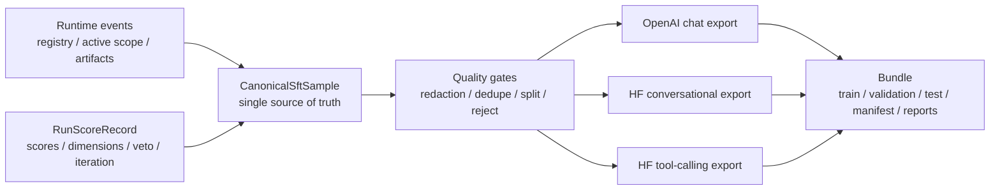

# 2026-03-28 SFT Canonical Schema and Export Contracts

## 1. Purpose

This document freezes the production contract for training-ready SFT data generation in this repository.

It defines five things:

1. the full `CanonicalSftSample` contract;
2. the `openai_chat` export contract;
3. the `hf_conversational` export contract;
4. the `hf_tool_calling` export contract;
5. the quality, rejection, redaction, and split policy matrix.

This document is normative for implementation under:

- [2026-03-27-runtime-dashboard-sft-requirements-analysis.md](/D:/Dev/BMAD-Speckit-SDD-Flow/docs/plans/2026-03-27-runtime-dashboard-sft-requirements-analysis.md)
- [2026-03-27-runtime-dashboard-sft-implementation-plan.md](/D:/Dev/BMAD-Speckit-SDD-Flow/docs/plans/2026-03-27-runtime-dashboard-sft-implementation-plan.md)

## 2. Scope And Principles

This contract targets supervised fine-tuning and tool-calling SFT exports for OpenAI and Hugging Face / TRL. It does not define preference data, DPO pairs, RFT graders, or multimodal image/audio columns.

The design principles are fixed:

- Internal schema must be richer than any export schema.
- Exporters are shallow adapters over `CanonicalSftSample`.
- Every accepted sample must be traceable back to run, stage, artifact, and hashes.
- Every rejected sample must carry machine-readable reasons.
- Preview, validation, and download must operate on target schema, not on an underspecified intermediate string format.
- Hugging Face is more flexible than OpenAI; where official docs are permissive, this document defines the repository's stricter production contract for reproducibility.[^hf-sft][^hf-chat]

## 3. Pipeline Overview



## 4. CanonicalSftSample Contract

### 4.1 Normative Shape

`CanonicalSftSample` is the only internal truth for all downstream SFT exports.

Top-level shape:

```ts
interface CanonicalSftSample {
  sample_id: string
  sample_version: "v1"
  source: CanonicalSourceRef
  messages: CanonicalMessage[]
  tools?: CanonicalTool[]
  metadata: CanonicalMetadata
  quality: CanonicalQuality
  provenance: CanonicalProvenance
  split: CanonicalSplit
  redaction: CanonicalRedaction
  export_compatibility: ExportCompatibility
}
```

### 4.2 Top-Level Fields

| Field | Type | Required | Description | Hard rule |
|---|---|---:|---|---|
| `sample_id` | `string` | Yes | Stable sample identifier | Must be deterministic from canonical content and source lineage |
| `sample_version` | `"v1"` | Yes | Schema version | Must change on breaking schema changes |
| `source` | object | Yes | Source run/stage/event identity | Missing immutable source identity is hard reject |
| `messages` | array | Yes | Role-aware chat transcript | Must not degrade to flat `instruction/input/output` |
| `tools` | array | No | Tool schemas available to the sample | Required for tool-calling exports |
| `metadata` | object | Yes | Non-training operational metadata | Must not contain secrets or raw PII |
| `quality` | object | Yes | Acceptance, risk, and scoring data | Must drive preview and rejection |
| `provenance` | object | Yes | Artifact and hash traceability | Must be sufficient to reconstruct origin |
| `split` | object | Yes | Dataset split assignment | Must be deterministic and reproducible |
| `redaction` | object | Yes | Sanitization result | Export is blocked on unhandled critical findings |
| `export_compatibility` | object | Yes | Target-by-target compatibility | Exporter must not infer compatibility ad hoc |

### 4.3 `source` Contract

| Field | Type | Required | Description |
|---|---|---:|---|
| `run_id` | `string` | Yes | Originating run id |
| `stage` | `string` | Yes | Originating stage |
| `flow` | `string` | Yes | Runtime flow |
| `epic_id` | `string` | No | Epic id when available |
| `story_id` | `string` | No | Story key when available |
| `story_slug` | `string` | No | Story slug when available |
| `event_ids` | `string[]` | Yes | Related runtime event ids |
| `score_record_id` | `string` | No | Associated score record id if materialized |
| `artifact_refs` | `ArtifactRef[]` | Yes | Source artifacts used to build the sample |

Hard rules:

- At least one `artifact_ref` must be immutable by hash.
- `event_ids` may be empty only for compatibility migration of legacy records; such samples are downgraded and cannot enter strict exports.

### 4.4 `messages` Contract

Each message must conform to:

```ts
interface CanonicalMessage {
  role: "system" | "user" | "assistant" | "tool"
  content: string | CanonicalContentPart[]
  name?: string
  tool_call_id?: string
  tool_calls?: CanonicalToolCall[]
  weight?: 0 | 1
  metadata?: Record<string, unknown>
}
```

Hard rules:

- `messages` must contain at least one `user` and one `assistant` message.
- Message order must match original chronology.
- `tool` messages require `tool_call_id`.
- `assistant.tool_calls` and downstream `tool` responses must preserve pairing.
- `weight` is only allowed on `assistant` messages. This is included to support OpenAI assistant-message weighting and future selective-loss workflows.[^openai-best]

### 4.5 `tools` Contract

Each tool must conform to a JSON-schema-like function declaration:

```ts
interface CanonicalTool {
  type: "function"
  function: {
    name: string
    description?: string
    parameters: Record<string, unknown>
  }
}
```

Hard rules:

- `tools` must be absent, not empty, when the sample is not tool-capable.
- Tool schemas must be sanitized before export.
- Tool names must be unique within a sample.

### 4.6 `metadata` Contract

`metadata` is for operational and analytics fields that should not be fed into training loss directly.

Minimum fields:

| Field | Type | Required | Description |
|---|---|---:|---|
| `schema_targets` | `string[]` | Yes | Candidate export targets |
| `host` | `string` | No | Runtime host type if known |
| `language` | `string` | No | Primary language hint |
| `tags` | `string[]` | No | Search and filtering tags |
| `notes` | `string[]` | No | Human-readable non-authoritative notes |

Hard rules:

- `metadata` must never be the source of acceptance or rejection logic; that belongs in `quality`.

### 4.7 `quality` Contract

Minimum fields:

| Field | Type | Required | Description |
|---|---|---:|---|
| `acceptance_decision` | `"accepted" \| "rejected" \| "downgraded"` | Yes | Final canonical decision |
| `phase_score` | `number \| null` | Yes | Final adjusted score |
| `raw_phase_score` | `number \| null` | Yes | Raw score before tier/veto adjustments |
| `dimension_scores` | `Record<string, number>` | No | Dimension-level scores |
| `dimension_floors` | `Record<string, number>` | No | Floor thresholds used in gating |
| `veto_triggered` | `boolean` | Yes | Veto signal |
| `iteration_count` | `number` | Yes | Iteration count |
| `has_code_pair` | `boolean` | Yes | Whether sample has stable code pair evidence |
| `token_estimate` | `number` | Yes | Pre-export token estimate |
| `dedupe_cluster_id` | `string \| null` | Yes | Near-duplicate grouping id |
| `safety_flags` | `string[]` | Yes | Security / PII / license / unsafe markers |
| `rejection_reasons` | `string[]` | Yes | Machine-readable reject reasons |
| `warnings` | `string[]` | Yes | Non-blocking quality warnings |

Hard rules:

- `accepted` samples must have empty `rejection_reasons`.
- `rejected` samples must have at least one `rejection_reason`.
- `downgraded` means the sample may appear in preview and diagnostics but not in strict target exports.

### 4.8 `provenance` Contract

Minimum fields:

| Field | Type | Required | Description |
|---|---|---:|---|
| `base_commit_hash` | `string \| null` | Yes | Source base commit if available |
| `content_hash` | `string \| null` | Yes | Hash of normalized content |
| `source_hash` | `string \| null` | Yes | Hash of source artifact |
| `source_path` | `string \| null` | Yes | Artifact path |
| `patch_ref` | `string \| null` | Yes | Immutable patch snapshot ref if available |
| `lineage` | `string[]` | Yes | Transformation lineage |
| `generated_at` | `string` | Yes | Canonical sample materialization timestamp |

Hard rules:

- `git diff base_commit_hash..HEAD` without immutable patch capture is not production-grade provenance.
- Samples built from unstable diff reconstruction must be marked with `warnings += ["unstable_diff_provenance"]` and default to `downgraded`.

### 4.9 `split` Contract

| Field | Type | Required | Description |
|---|---|---:|---|
| `assignment` | `"train" \| "validation" \| "test" \| "holdout"` | Yes | Split assignment |
| `seed` | `number` | Yes | Deterministic split seed |
| `strategy` | `string` | Yes | Split strategy id |
| `group_key` | `string \| null` | Yes | Grouping key used to avoid leakage |

Hard rules:

- Samples sharing a `group_key` must land in the same split.
- Split must be reproducible from manifest inputs alone.

### 4.10 `redaction` Contract

| Field | Type | Required | Description |
|---|---|---:|---|
| `status` | `"clean" \| "redacted" \| "blocked"` | Yes | Sanitization outcome |
| `applied_rules` | `string[]` | Yes | Rules applied |
| `findings` | `RedactionFinding[]` | Yes | Structured findings |
| `redacted_fields` | `string[]` | Yes | Field paths changed |

Hard rules:

- `blocked` samples cannot be exported.
- `redacted` samples remain exportable only if all findings are non-critical after transformation.

### 4.11 `export_compatibility` Contract

```ts
interface ExportCompatibility {
  openai_chat: ExportDecision
  hf_conversational: ExportDecision
  hf_tool_calling: ExportDecision
}
```

```ts
interface ExportDecision {
  compatible: boolean
  reasons: string[]
  warnings: string[]
}
```

Hard rules:

- Exporters must read `export_compatibility`.
- Exporters may add validation errors, but may not silently override a canonical `compatible: false`.

## 5. OpenAI Chat Export Contract

### 5.1 Target Definition

This target exists for OpenAI supervised fine-tuning. The official guidance requires JSONL with one JSON object per line, using chat-format examples; tool-calling examples may include assistant `tool_calls`, `tool` role responses, and `tools` definitions.[^openai-sft]

### 5.2 Output Artifact

Bundle files:

- `train.openai_chat.jsonl`
- `validation.openai_chat.jsonl`
- `test.openai_chat.jsonl` or omitted when disabled
- `validation-report.openai_chat.json`

Each line must be one JSON object.

### 5.3 Row Contract

```json
{
  "messages": [],
  "tools": [],
  "parallel_tool_calls": false
}
```

Rules:

- `messages` is required.
- `tools` is required only for tool-capable rows.
- `parallel_tool_calls` defaults to `false` unless canonical message data proves parallel execution intent.
- Assistant-message `weight` may be passed through when present and valid.[^openai-best]

### 5.4 Message Mapping Rules

| Canonical | OpenAI export |
|---|---|
| `system` message | `{role:"system", content}` |
| `user` message | `{role:"user", content}` |
| `assistant` text reply | `{role:"assistant", content}` |
| `assistant.tool_calls` | `{role:"assistant", tool_calls:[...]}` |
| `tool` response | `{role:"tool", tool_call_id, content}` |

Hard rules:

- Do not flatten tool interactions into plain assistant text.
- Do not emit unsupported message roles.
- Do not emit empty `messages`.
- Do not export rejected or blocked samples.

### 5.5 OpenAI-Specific Rejection Rules

Reject from `openai_chat` export when:

- `messages` contains no assistant supervision target;
- canonical compatibility says `openai_chat.compatible = false`;
- token estimate exceeds configured per-example limit after formatting;
- unresolved critical redaction finding remains;
- provenance is marked unstable and export mode is `strict`.

### 5.6 Team Production Standard

This repository standardizes stricter behavior than the bare OpenAI minimum:

- require explicit validation report per bundle;
- require split-aware exports;
- require provenance and rejection reporting;
- require deterministic bundle id and export hash.

## 6. Hugging Face Conversational Export Contract

### 6.1 Target Definition

TRL `SFTTrainer` supports conversational datasets and applies the model chat template automatically when given structured conversations.[^hf-sft] Transformers chat templating expects a list of dictionaries with `role` and `content` keys.[^hf-chat]

### 6.2 Output Artifact

Bundle files:

- `train.hf_conversational.jsonl`
- `validation.hf_conversational.jsonl`
- `test.hf_conversational.jsonl` or omitted when disabled
- `validation-report.hf_conversational.json`

Each row must conform to:

```json
{
  "messages": [],
  "metadata": {}
}
```

### 6.3 Row Contract

| Field | Required | Description |
|---|---:|---|
| `messages` | Yes | List of `{role, content}` dictionaries |
| `metadata` | Yes | Non-training helper metadata for bundle consumers |

Rules:

- `messages` must preserve role order exactly.
- Allowed roles are `system`, `user`, `assistant`, and `tool`.
- `content` remains structured text content from canonical messages.
- `tools` must not be included in this target; tool-capable samples without tool use may still export if `messages` alone remain valid.

### 6.4 HF Conversational Rejection Rules

Reject from `hf_conversational` export when:

- sample requires tool schema to be semantically correct;
- canonical compatibility says `hf_conversational.compatible = false`;
- message structure becomes ambiguous after redaction;
- sample is rejected, blocked, or strict-downgraded.

### 6.5 Assistant-Only Training Compatibility

Because TRL supports `assistant_only_loss=True` for conversational datasets, this export must preserve message roles cleanly enough for downstream masking.[^hf-assistant]

Repository standard:

- assistant target messages must remain identifiable without reconstructing roles from plain text;
- no exporter may collapse multiple assistant turns into one string.

## 7. Hugging Face Tool-Calling Export Contract

### 7.1 Target Definition

TRL supports tool-calling SFT when each example includes conversation messages with tool calls and tool responses, plus a `tools` column that typically carries JSON schemas.[^hf-tool]

### 7.2 Output Artifact

Bundle files:

- `train.hf_tool_calling.jsonl`
- `validation.hf_tool_calling.jsonl`
- `test.hf_tool_calling.jsonl` or omitted when disabled
- `validation-report.hf_tool_calling.json`

Each row must conform to:

```json
{
  "messages": [],
  "tools": [],
  "metadata": {}
}
```

### 7.3 Row Contract

| Field | Required | Description |
|---|---:|---|
| `messages` | Yes | Conversation messages including assistant `tool_calls` and `tool` messages |
| `tools` | Yes | Available tool schemas |
| `metadata` | Yes | Export metadata |

Hard rules:

- `tools` must be present and non-empty.
- Every assistant `tool_call` id must have a matching `tool` role response when the conversation includes execution results.
- Tool definitions must be sanitized JSON-schema-like objects.
- Exporter must not infer tool schemas from free-text content.

### 7.4 HF Tool-Calling Rejection Rules

Reject from `hf_tool_calling` export when:

- tool-capable sample lacks `tools`;
- assistant tool call ids and tool responses do not match;
- canonical compatibility says `hf_tool_calling.compatible = false`;
- sample was flattened from legacy `instruction/input/output` without preserved tool structure.

## 8. Quality, Rejection, Redaction, And Split Policy Matrix

### 8.1 Policy Matrix

| Policy area | Rule id | Level | Condition | Action | Preview surface | Export effect |
|---|---|---|---|---|---|---|
| Provenance | `prov_missing_hash` | Hard reject | Missing immutable artifact/hash lineage | Reject | Show reject reason | Exclude from all strict exports |
| Provenance | `prov_unstable_diff` | Soft reject by default | Built from `base_commit_hash..HEAD` only | Downgrade | Show warning + downgrade | Exclude unless compatibility mode allows |
| Score | `score_below_floor` | Configurable hard reject | `phase_score < min_score` | Reject | Show threshold mismatch | Exclude |
| Score | `veto_triggered` | Hard reject default | Veto is true | Reject | Show veto badge | Exclude |
| Iteration | `too_many_iterations` | Soft reject | Iteration above threshold | Downgrade or reject | Show iteration warning | Target-specific |
| Structure | `missing_messages` | Hard reject | No valid role-aware messages | Reject | Show parser error | Exclude |
| Structure | `missing_assistant_target` | Hard reject | No trainable assistant turn | Reject | Show role deficiency | Exclude |
| Tooling | `tool_schema_missing` | Hard reject for tool targets | Tool sample missing `tools` | Reject | Show target incompatibility | Exclude from tool targets |
| Tooling | `tool_call_mismatch` | Hard reject | Tool call ids do not pair with responses | Reject | Show mismatch details | Exclude |
| Security | `secret_detected` | Hard reject unless fully redacted | Secret/token found | Block or redact | Show finding summary | Exclude if unresolved |
| Privacy | `pii_detected` | Hard reject unless policy-approved redaction succeeds | PII found | Block or redact | Show finding summary | Exclude if unresolved |
| Safety | `unsafe_command` | Soft or hard reject | Destructive or policy-violating content | Flag or reject | Show safety flag | Configurable by target |
| License | `license_risk` | Hard reject default | Artifact lineage has incompatible license | Reject | Show license reason | Exclude |
| Duplication | `near_duplicate` | Soft reject | Same dedupe cluster already accepted | Keep best, reject rest | Show cluster id | Export only retained representative |
| Length | `token_over_limit` | Hard reject for strict bundles | Estimated tokens exceed target limit | Reject or trim then revalidate | Show token count | Exclude if still over limit |
| Split | `split_leakage_group` | Hard reject | Grouped examples would leak across splits | Reassign deterministically | Show group key | Block bundle finalization until fixed |

### 8.2 Redaction Policy

Redaction statuses:

| Status | Meaning | Exportable |
|---|---|---:|
| `clean` | No finding or no change needed | Yes |
| `redacted` | Sensitive content removed or masked, sample remains semantically valid | Yes |
| `blocked` | Sensitive content cannot be safely removed without corrupting training semantics | No |

Hard rules:

- Redaction must happen before token estimation for final export.
- Preview must show both the finding class and the action taken.
- Rejection report must preserve field paths, not raw secret values.

### 8.3 Split Policy

Split policy is deterministic and leakage-aware.

Rules:

- Default split set is `train / validation / test`.
- `holdout` may be produced as an optional fourth assignment for eval-only workflows.
- Split assignment uses configured seed plus stable `group_key`.
- Samples from the same conversation lineage, story, or dedupe cluster must share the same `group_key`.
- Bundle manifest must record split seed, strategy id, and counts.

### 8.4 Optimization Policy

`optimize` in this repository means data-level optimization only:

- dedupe and near-dedupe pruning;
- token-length trimming with revalidation;
- removal of low-quality or vetoed samples;
- balancing by target tags or scenario families;
- deterministic split generation;
- target-schema validation.

It does not mean rewriting model answers to make them sound nicer.

## 9. Bundle And Validation Requirements

Every export bundle must contain at least:

- target-specific `train`, `validation`, and optional `test` files;
- `manifest.json`;
- `stats.json`;
- `validation-report.json`;
- `validation-report.md`;
- `rejection-report.json`.

`manifest.json` must record:

- bundle id;
- export target;
- canonical schema version;
- filter settings;
- split seed and strategy;
- generation timestamp;
- exporter version;
- export hash.

## 10. Implementation Notes

The implementation must satisfy these direct consequences:

- `packages/scoring/analytics/schema/canonical-sft-sample.schema.json` must encode Section 4 exactly.
- `packages/scoring/analytics/candidate-builder.ts` must build `CanonicalSftSample`, not target payloads.
- `packages/scoring/analytics/quality-gates.ts` must implement Section 8 as machine-readable rules.
- each exporter under `packages/scoring/analytics/exporters/` must be a pure adapter from canonical sample to target rows.
- preview and validation UI/API must expose `quality`, `redaction`, `split`, and `export_compatibility` directly.

## 11. Open Questions Frozen For Later

These are deliberately not part of `v1`:

- multimodal message content beyond text-first chat;
- preference-pair exports for DPO / ORPO;
- per-message token masks beyond assistant weighting and downstream trainer support;
- model-specific chat-template rendering at bundle generation time.

## 12. Draft `canonical-sft-sample.schema.json`

This is the implementation draft for `packages/scoring/analytics/schema/canonical-sft-sample.schema.json`.

It is not a full final schema yet, but it is concrete enough to drive:

- AJV contract tests;
- builder implementation;
- exporter fixture validation;
- preview and rejection-report rendering.

```json
{
  "$schema": "https://json-schema.org/draft/2020-12/schema",
  "$id": "https://bmad-speckit.dev/schema/canonical-sft-sample.schema.json",
  "title": "CanonicalSftSample",
  "type": "object",
  "additionalProperties": false,
  "required": [
    "sample_id",
    "sample_version",
    "source",
    "messages",
    "metadata",
    "quality",
    "provenance",
    "split",
    "redaction",
    "export_compatibility"
  ],
  "properties": {
    "sample_id": { "type": "string", "minLength": 8 },
    "sample_version": { "const": "v1" },
    "source": { "$ref": "#/$defs/source" },
    "messages": {
      "type": "array",
      "minItems": 2,
      "items": { "$ref": "#/$defs/message" }
    },
    "tools": {
      "type": "array",
      "minItems": 1,
      "items": { "$ref": "#/$defs/tool" }
    },
    "metadata": { "$ref": "#/$defs/metadata" },
    "quality": { "$ref": "#/$defs/quality" },
    "provenance": { "$ref": "#/$defs/provenance" },
    "split": { "$ref": "#/$defs/split" },
    "redaction": { "$ref": "#/$defs/redaction" },
    "export_compatibility": { "$ref": "#/$defs/exportCompatibility" }
  },
  "$defs": {
    "source": {
      "type": "object",
      "additionalProperties": false,
      "required": ["run_id", "stage", "flow", "event_ids", "artifact_refs"],
      "properties": {
        "run_id": { "type": "string", "minLength": 1 },
        "stage": { "type": "string", "minLength": 1 },
        "flow": { "type": "string", "minLength": 1 },
        "epic_id": { "type": "string" },
        "story_id": { "type": "string" },
        "story_slug": { "type": "string" },
        "event_ids": {
          "type": "array",
          "items": { "type": "string", "minLength": 1 }
        },
        "score_record_id": { "type": "string" },
        "artifact_refs": {
          "type": "array",
          "minItems": 1,
          "items": { "$ref": "#/$defs/artifactRef" }
        }
      }
    },
    "artifactRef": {
      "type": "object",
      "additionalProperties": false,
      "required": ["path", "content_hash"],
      "properties": {
        "path": { "type": "string", "minLength": 1 },
        "content_hash": { "type": "string", "minLength": 8 },
        "source_hash": { "type": "string" },
        "kind": { "type": "string" }
      }
    },
    "message": {
      "type": "object",
      "additionalProperties": false,
      "required": ["role", "content"],
      "properties": {
        "role": {
          "type": "string",
          "enum": ["system", "user", "assistant", "tool"]
        },
        "content": {
          "oneOf": [
            { "type": "string" },
            {
              "type": "array",
              "items": { "$ref": "#/$defs/contentPart" }
            }
          ]
        },
        "name": { "type": "string" },
        "tool_call_id": { "type": "string" },
        "tool_calls": {
          "type": "array",
          "items": { "$ref": "#/$defs/toolCall" }
        },
        "weight": { "type": "integer", "enum": [0, 1] },
        "metadata": { "type": "object" }
      }
    },
    "contentPart": {
      "type": "object",
      "additionalProperties": false,
      "required": ["type", "text"],
      "properties": {
        "type": { "const": "text" },
        "text": { "type": "string" }
      }
    },
    "toolCall": {
      "type": "object",
      "additionalProperties": false,
      "required": ["id", "type", "function"],
      "properties": {
        "id": { "type": "string" },
        "type": { "const": "function" },
        "function": {
          "type": "object",
          "additionalProperties": false,
          "required": ["name", "arguments"],
          "properties": {
            "name": { "type": "string", "minLength": 1 },
            "arguments": { "type": "string" }
          }
        }
      }
    },
    "tool": {
      "type": "object",
      "additionalProperties": false,
      "required": ["type", "function"],
      "properties": {
        "type": { "const": "function" },
        "function": {
          "type": "object",
          "additionalProperties": false,
          "required": ["name", "parameters"],
          "properties": {
            "name": { "type": "string", "minLength": 1 },
            "description": { "type": "string" },
            "parameters": { "type": "object" }
          }
        }
      }
    },
    "metadata": {
      "type": "object",
      "additionalProperties": false,
      "required": ["schema_targets"],
      "properties": {
        "schema_targets": {
          "type": "array",
          "minItems": 1,
          "items": {
            "type": "string",
            "enum": ["openai_chat", "hf_conversational", "hf_tool_calling"]
          }
        },
        "host": { "type": "string" },
        "language": { "type": "string" },
        "tags": { "type": "array", "items": { "type": "string" } },
        "notes": { "type": "array", "items": { "type": "string" } }
      }
    },
    "quality": {
      "type": "object",
      "additionalProperties": false,
      "required": [
        "acceptance_decision",
        "phase_score",
        "raw_phase_score",
        "veto_triggered",
        "iteration_count",
        "has_code_pair",
        "token_estimate",
        "dedupe_cluster_id",
        "safety_flags",
        "rejection_reasons",
        "warnings"
      ],
      "properties": {
        "acceptance_decision": {
          "type": "string",
          "enum": ["accepted", "rejected", "downgraded"]
        },
        "phase_score": { "type": ["number", "null"] },
        "raw_phase_score": { "type": ["number", "null"] },
        "dimension_scores": {
          "type": "object",
          "additionalProperties": { "type": "number" }
        },
        "dimension_floors": {
          "type": "object",
          "additionalProperties": { "type": "number" }
        },
        "veto_triggered": { "type": "boolean" },
        "iteration_count": { "type": "integer", "minimum": 0 },
        "has_code_pair": { "type": "boolean" },
        "token_estimate": { "type": "integer", "minimum": 0 },
        "dedupe_cluster_id": { "type": ["string", "null"] },
        "safety_flags": { "type": "array", "items": { "type": "string" } },
        "rejection_reasons": {
          "type": "array",
          "items": { "type": "string" }
        },
        "warnings": { "type": "array", "items": { "type": "string" } }
      }
    },
    "provenance": {
      "type": "object",
      "additionalProperties": false,
      "required": [
        "base_commit_hash",
        "content_hash",
        "source_hash",
        "source_path",
        "patch_ref",
        "lineage",
        "generated_at"
      ],
      "properties": {
        "base_commit_hash": { "type": ["string", "null"] },
        "content_hash": { "type": ["string", "null"] },
        "source_hash": { "type": ["string", "null"] },
        "source_path": { "type": ["string", "null"] },
        "patch_ref": { "type": ["string", "null"] },
        "lineage": { "type": "array", "items": { "type": "string" } },
        "generated_at": { "type": "string", "format": "date-time" }
      }
    },
    "split": {
      "type": "object",
      "additionalProperties": false,
      "required": ["assignment", "seed", "strategy", "group_key"],
      "properties": {
        "assignment": {
          "type": "string",
          "enum": ["train", "validation", "test", "holdout"]
        },
        "seed": { "type": "integer" },
        "strategy": { "type": "string", "minLength": 1 },
        "group_key": { "type": ["string", "null"] }
      }
    },
    "redaction": {
      "type": "object",
      "additionalProperties": false,
      "required": ["status", "applied_rules", "findings", "redacted_fields"],
      "properties": {
        "status": {
          "type": "string",
          "enum": ["clean", "redacted", "blocked"]
        },
        "applied_rules": { "type": "array", "items": { "type": "string" } },
        "findings": {
          "type": "array",
          "items": { "$ref": "#/$defs/redactionFinding" }
        },
        "redacted_fields": {
          "type": "array",
          "items": { "type": "string" }
        }
      }
    },
    "redactionFinding": {
      "type": "object",
      "additionalProperties": false,
      "required": ["kind", "severity", "field_path"],
      "properties": {
        "kind": { "type": "string" },
        "severity": {
          "type": "string",
          "enum": ["low", "medium", "high", "critical"]
        },
        "field_path": { "type": "string" },
        "action": { "type": "string" }
      }
    },
    "exportDecision": {
      "type": "object",
      "additionalProperties": false,
      "required": ["compatible", "reasons", "warnings"],
      "properties": {
        "compatible": { "type": "boolean" },
        "reasons": { "type": "array", "items": { "type": "string" } },
        "warnings": { "type": "array", "items": { "type": "string" } }
      }
    },
    "exportCompatibility": {
      "type": "object",
      "additionalProperties": false,
      "required": ["openai_chat", "hf_conversational", "hf_tool_calling"],
      "properties": {
        "openai_chat": { "$ref": "#/$defs/exportDecision" },
        "hf_conversational": { "$ref": "#/$defs/exportDecision" },
        "hf_tool_calling": { "$ref": "#/$defs/exportDecision" }
      }
    }
  }
}
```

### 12.1 Validation Notes

- Add an additional semantic test beyond JSON schema to enforce "at least one `user` and one `assistant` message".
- Add an additional semantic test to ensure `accepted` samples have no rejection reasons.
- Add an additional semantic test to ensure `blocked` redaction status implies non-exportability.

## 13. Golden Fixture Samples

These are the seed fixtures for:

- exporter tests;
- validation-report golden tests;
- preview rendering tests.

### 13.1 `openai_chat` Golden Fixture

```json
{
  "messages": [
    {
      "role": "system",
      "content": "You are a code review assistant."
    },
    {
      "role": "user",
      "content": "Review the patch and list the highest-risk issues first."
    },
    {
      "role": "assistant",
      "content": "1. The fallback path skips score validation.\n2. The export path does not reject blocked samples."
    }
  ]
}
```

What this fixture proves:

- plain chat export stays in OpenAI `messages` JSONL shape;
- no tool schema is emitted when the sample is not tool-capable;
- no flattening to `instruction/input/output`.

### 13.2 `hf_conversational` Golden Fixture

```json
{
  "messages": [
    {
      "role": "system",
      "content": "You are a runtime observability expert."
    },
    {
      "role": "user",
      "content": "Summarize the current run and explain why it was downgraded."
    },
    {
      "role": "assistant",
      "content": "The run was downgraded because provenance relies on an unstable diff and no immutable patch snapshot was captured."
    }
  ],
  "metadata": {
    "sample_id": "fixture-hf-conv-001",
    "split": "validation",
    "schema_target": "hf_conversational"
  }
}
```

What this fixture proves:

- Hugging Face conversational output preserves `messages[{role, content}]`;
- optional operational metadata can ride alongside the conversation;
- downstream trainer can still apply chat templating cleanly.

### 13.3 `hf_tool_calling` Golden Fixture

```json
{
  "messages": [
    {
      "role": "system",
      "content": "You are a dataset export assistant."
    },
    {
      "role": "user",
      "content": "Check whether this sample is exportable to OpenAI chat."
    },
    {
      "role": "assistant",
      "content": "",
      "tool_calls": [
        {
          "id": "call_1",
          "type": "function",
          "function": {
            "name": "get_export_compatibility",
            "arguments": "{\"target\":\"openai_chat\",\"sample_id\":\"sample_123\"}"
          }
        }
      ]
    },
    {
      "role": "tool",
      "tool_call_id": "call_1",
      "content": "{\"compatible\":false,\"reasons\":[\"prov_unstable_diff\"]}"
    },
    {
      "role": "assistant",
      "content": "The sample is not exportable to strict OpenAI chat because provenance is unstable."
    }
  ],
  "tools": [
    {
      "type": "function",
      "function": {
        "name": "get_export_compatibility",
        "description": "Returns target compatibility for one sample.",
        "parameters": {
          "type": "object",
          "properties": {
            "target": { "type": "string" },
            "sample_id": { "type": "string" }
          },
          "required": ["target", "sample_id"]
        }
      }
    }
  ],
  "metadata": {
    "sample_id": "fixture-hf-tool-001",
    "split": "train",
    "schema_target": "hf_tool_calling"
  }
}
```

What this fixture proves:

- tool-calling rows keep `messages` and `tools`;
- assistant tool call ids remain paired with `tool` responses;
- exporter does not flatten tool execution to plain text.

### 13.4 Negative Fixture Requirements

Each exporter test suite should also include at least one negative fixture:

- `openai_chat.invalid.missing_assistant.json`
- `hf_conversational.invalid.redaction_blocked.json`
- `hf_tool_calling.invalid.tool_call_mismatch.json`

## 14. Rejection Reason Enum Catalog

These enums should be treated as the initial machine-readable catalog for:

- `quality.rejection_reasons[]`
- `export_compatibility.*.reasons[]`
- bundle rejection reports.

### 14.1 Hard Reject Reasons

| Enum | Meaning | Default action |
|---|---|---|
| `prov_missing_hash` | Immutable artifact/hash lineage is incomplete | Reject |
| `prov_missing_source_artifact` | Source artifact required for traceability is missing | Reject |
| `score_below_floor` | Adjusted score below configured threshold | Reject |
| `veto_triggered` | Veto condition fired | Reject |
| `missing_messages` | No valid role-aware message list could be built | Reject |
| `missing_assistant_target` | No assistant supervision target remains | Reject |
| `redaction_blocked` | Sensitive content could not be safely sanitized | Reject |
| `secret_detected_unresolved` | Secret finding remains unresolved after redaction | Reject |
| `pii_detected_unresolved` | PII finding remains unresolved after redaction | Reject |
| `tool_schema_missing` | Tool target requested but no valid `tools` present | Reject |
| `tool_call_mismatch` | Assistant tool calls and tool responses do not pair correctly | Reject |
| `license_risk` | Source lineage carries incompatible license risk | Reject |
| `token_over_limit` | Sample exceeds strict target token ceiling after trimming | Reject |
| `split_leakage_group` | Sample would leak across split groups | Reject until reassigned |

### 14.2 Downgrade Or Soft Reject Reasons

| Enum | Meaning | Default action |
|---|---|---|
| `prov_unstable_diff` | Built from unstable `base_commit_hash..HEAD` diff only | Downgrade |
| `too_many_iterations` | Iteration count above configured healthy range | Downgrade or reject |
| `near_duplicate` | Duplicate cluster contains a better accepted sample | Reject duplicate |
| `unsafe_command` | Content includes risky command behavior | Downgrade or reject by target policy |
| `target_incompatible_openai_chat` | Sample cannot be exported to OpenAI chat as-is | Exclude from OpenAI export |
| `target_incompatible_hf_conversational` | Sample cannot be exported to HF conversational as-is | Exclude from HF conversational export |
| `target_incompatible_hf_tool_calling` | Sample cannot be exported to HF tool-calling as-is | Exclude from HF tool-calling export |
| `legacy_instruction_io_only` | Sample was sourced from legacy flat format without full structure | Downgrade |
| `missing_code_pair` | Code-pair evidence unavailable for a target that expects it | Downgrade or reject |

### 14.3 Warning Enums

Warnings should not appear in `rejection_reasons[]`, but they should remain machine-readable in `quality.warnings[]`.

| Enum | Meaning |
|---|---|
| `warning_large_token_estimate` | Sample is large but still under the hard limit |
| `warning_redacted_noncritical` | Non-critical redaction was applied |
| `warning_sparse_provenance` | Provenance is valid but thinner than ideal |
| `warning_role_weight_present` | Assistant weighting field was preserved for downstream trainers |
| `warning_target_specific_loss_behavior` | Sample is valid, but downstream trainer configuration affects effective supervision |

### 14.4 Catalog Rules

- `rejection_reasons[]` must contain only enums from 14.1 or 14.2.
- Preview UI may render localized human text, but persisted reports must keep the enum code.
- Export validation reports may add target-specific reason codes prefixed with the target family, but core catalog reasons remain preferred.

## 15. References

[^openai-sft]: OpenAI, "Supervised fine-tuning", verified 2026-03-28, <https://developers.openai.com/api/docs/guides/supervised-fine-tuning>
[^openai-best]: OpenAI, "Fine-tuning best practices", verified 2026-03-28, <https://developers.openai.com/api/docs/guides/fine-tuning-best-practices>
[^hf-sft]: Hugging Face TRL, "SFT Trainer", verified 2026-03-28, <https://huggingface.co/docs/trl/v0.25.0/sft_trainer>
[^hf-tool]: Hugging Face TRL, "Tool Calling with SFT", verified 2026-03-28, <https://huggingface.co/docs/trl/v0.25.0/sft_trainer>
[^hf-chat]: Hugging Face Transformers, "Chat templates", verified 2026-03-28, <https://huggingface.co/docs/transformers/chat_templating>
[^hf-assistant]: Hugging Face TRL, `assistant_only_loss` for conversational datasets, verified 2026-03-28, <https://huggingface.co/docs/trl/v0.25.0/sft_trainer>
