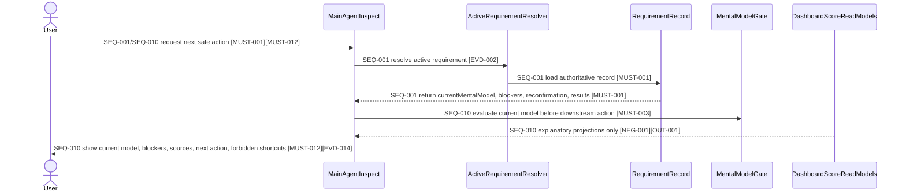
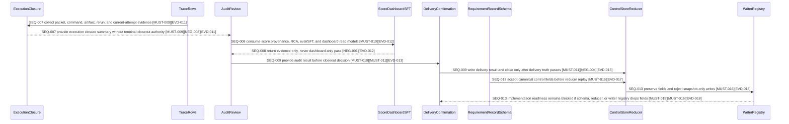
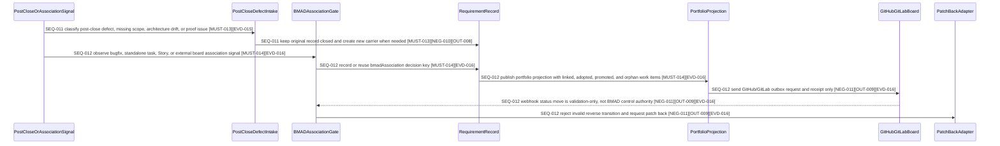

# Main Agent Six-Mental-Model Control Plane Completion

Date: 2026-05-24
Status: Draft
Source request: 将 Main Agent 六心智模型控制面补齐为可确认、可追踪、可验证的需求契约源文档。
Checkpoint: 8 - human-readable views, evidence overview, E2E overview, Reverse Audit Report, and Definition of Done
Checkpoint status: human-readable confirmation views drafted; confirmation language selection, HTML render, and controlled confirmation ingest pending

## 1. 结论

当前 Main Agent 已覆盖若干关键门禁，但还没有真正实现 6 个心智模型的统一编排状态机。当前实现更接近 `RequirementRecord + gate scripts + inspect projection + dashboard read model` 的组合，而不是由 `currentMentalModel` 驱动的主控控制面。

本需求目标是补齐一个真正的 Main Agent control plane：主 Agent 不再只从零散 gate、projection、score、dashboard 或 TaskReport 推导下一步，而是以 `RequirementRecord + currentMentalModel + sixModelResults + controlled blocker intake` 作为唯一编排依据。

完成后，Main Agent inspect、dispatch、readiness、execution closure、audit review、delivery closeout 和 record close 都必须回到同一条受控状态链；Dashboard、score、TaskReport、stdout、HTTP 返回和页面渲染都只能作为 evidence 或 read model，不能成为控制流权威。

### 1.1 通用 AI-TDD Contract Gate 前置硬门禁

本需求的反假阳性止血不再继续作为局部 `pre-rerun-anti-false-positive-gate.ts` 膨胀。通用能力定义在可追踪规范路径 `specs/ai-tdd-contract-gate/requirement.md`：任何已确认或待重新确认的 `implementationConfirmation` 在实施、重跑、迭代和 closeout 前必须能生成 `ContractExecutionManifest`、first-class acceptance/e2e test plan、negative control plan、target artifact plan、red/green matrix 和 closeout readiness report。

对本主控需求而言，`scripts/ai-tdd-contract-gate.ts --mode pre-implementation|pre-rerun|iteration|closeout` 是后续 rerun 和 delivery seal 的通用前置硬门禁。旧 `scripts/pre-rerun-anti-false-positive-gate.ts` 仅保留为兼容入口，并委托通用 gate 的 `pre-rerun` mode。任何 closeout 结论不得绕过通用 gate 对 acceptance/e2e coverage、missing test files、negative controls、reverse audit delivery readiness、strict proof、target artifact realization、current attempt binding、mock-only、exitCode-only、legacy proof 和 runtime closure packet self-certification 的阻断语义。

## 2. Checkpoint 1 Source Boundary

### 2.1 当前 checkpoint 目标

本 checkpoint 只负责把普通需求文档的头部、背景、范围、非目标和冻结决策整理为后续 `requirements-contract-authoring` 可继续扩展的源文档基础。

本 checkpoint 不生成 `implementationConfirmation`，不渲染确认 HTML，不请求用户确认，不进入 implementation readiness，也不声明需求已可实施。

### 2.2 本文档权威边界

本文档当前仍是需求源文档草稿。后续 checkpoint 会把需求语义逐步迁移到同一文件内的 `implementationConfirmation` 块中；在该块存在并通过确认前，本文档只能作为需求分析和契约化输入，不能作为已确认实施范围。

后续一旦引入 `implementationConfirmation`，需求语义权威必须以该块中的 `MUST-*`、`NEG-*`、`OUT-*`、`EVD-*`、`FAIL-*`、`EDGE-*`、`TRACE-*` 和 `CMD-*` ID 为准。正文、图、表和执行计划只能作为这些 ID 的解释视图，不得引入未编号的新范围。

### 2.3 业务范围

本需求的业务范围是 Main Agent 对消费用户暴露的主控行为：当用户通过 `$bmad-speckit`、`/bmad-speckit`、`bmad-speckit` 或等价宿主入口触发主控时，系统必须能基于受控 requirement record 和六心智模型状态给出下一步、阻断原因、恢复路径或完成状态。

业务范围内包括：

1. 用户可见 inspect 状态。
2. 当前 requirement 的下一步推荐。
3. 阻断、重跑、重新确认、审计、交付确认和完成态的可解释输出。
4. 防止 dashboard、score、TaskReport、stdout、HTTP 200、page render 或 mock-only 信号误导用户认为需求已完成。

### 2.4 治理范围

本需求的治理范围是 Main Agent 控制面内部的受控状态链、事件写入、blocker 归一化、reconfirmation router、模型评估结果、execution closure、audit review、delivery confirmation 和 record close。

治理范围内包括：

1. `currentMentalModel` 受控读写。
2. `mentalModelTransitions` 前后 hash 与 sourceRefs。
3. `sixModelResults` 的计算与持久化。
4. `controlled-blocker-intake` 对 raw signals 的归一化。
5. `controlled-reconfirmation-router` 对 scope/hash/architecture/evidence drift 的回退路由。
6. architecture confirmation 通过 main-agent action switch 接入。
7. execution closure、audit review、delivery confirmation 的模型级评估结果。
8. Dashboard、score、SFT、report、summary、hook receipt 作为 read model 或 evidence 的边界。

### 2.5 非目标

本需求不做以下事项：

1. 不把 dashboard projection 改成控制源。
2. 不把 score green、stdout PASS、TaskReport done、HTTP 200、页面渲染、mock calls 或 fixture-only replay 当作完成证据。
3. 不允许绕过 controlled writer 直接修改 `currentMentalModel`。
4. 不允许子代理直接写顶层权威 blocker。
5. 不重写整个 scoring framework。
6. 不改变 delivery closeout gate 的最终判定地位。
7. 不引入新的需求确认侧车文件或独立权威 contract 文件。
8. 不在本 checkpoint 中生成、确认或 ingest `implementationConfirmation`。

### 2.6 冻结决策

以下决策在后续 checkpoint 中默认保持不变，除非用户明确发起 scope change：

1. `RequirementRecord` 是 Main Agent 控制面的唯一控制记录源。
2. `currentMentalModel` 是 Main Agent 判断当前阶段的受控字段。
3. 六个评估模型固定为 `requirement_confirmation`、`architecture_confirmation`、`implementation_readiness`、`execution_closure`、`audit_review`、`delivery_confirmation`。
4. `record_closed` 是终态，不是六个评估模型之一。
5. 只有当前模型 `status=pass` 才允许推进到下一个模型。
6. 任一模型发现 scope、source hash、implementation hash、architecture hash 或 evidence semantic drift，必须进入 `controlled-reconfirmation-router`。
7. 子代理、dashboard、score projection、TaskReport、stdout、HTTP 返回和页面渲染不能直接推进模型状态。
8. unknown failure 必须转为 `blocker_unknown` 并 fail closed。
9. closeout gate 仍是最终交付判定，execution closure 只提供 closeout 前的模型级汇总。
10. 后续 confirmation-ready 文档必须在同一源文档内扩展，不创建新的独立权威需求契约文件。

### 2.7 后续 checkpoint 入口

Checkpoint 2 已从本边界继续，新增 `implementationConfirmation` core fields 和完整 `applicability.*` 声明，且未重写本 checkpoint 的范围、非目标或冻结决策。

Checkpoint 3 已继续填充 `must`、`notDone`、`mustNot` 和 `evidence` 数组。Checkpoint 3 未渲染 HTML，未设置 `status: user_confirmed`，也未把当前 ID 草稿解释为可确认范围。

Checkpoint 4 已继续填充 `failurePaths`、`edgeCases` 和 `traceRows` 数组，并把 Checkpoint 3 中引用的 `TRACE-*` 与 `FAIL-*` 补齐为可审计映射。

Checkpoint 5 已继续填充 `sequenceViews`、`flowViews`、`edgeCaseViews` 和 `boundaryViews`，并把本 checkpoint 中引用的 `SEQ-*`、`FLOW-*`、`EDGEVIEW-*` 和 `BOUNDARY-*` 补齐为可渲染视图。

Checkpoint 6 已继续填充 `artifactAutomationPlan`、`requiredCommands`、`suggestedCommands` 和 `closeoutReadinessPreview`，并把当前 evidence、traceRows 和 views 中引用的 `ART-*` 与 `CMD-*` 补齐为可执行计划。

Checkpoint 7 已继续填充 `applicability.*.applies=true` 对应的条件模块，尤其是 governance event registry、controlled ingest writer registry、runtime recovery registry、active requirement resolution、scoring/dashboard/SFT boundary、current-target map、scripts/hooks registry。

Checkpoint 8 已继续补充 human-readable Mermaid views、evidence overview、E2E acceptance overview、artifact automation plan view、Reverse Audit Report 和 Definition of Done，并为后续确认页渲染做准备。

Checkpoint 9 必须先让用户显式选择确认页语言；只有用户选择 zh-CN、en-US 或 bilingual 后，才能调用 skill-local confirmation HTML renderer。

Checkpoint 8A 已澄清 `record_closed` 边界：`currentMentalModel` 只允许六个评估模型值；`record_closed` 必须由 `status=closed`、`lastEventType=record_closed`、`requirementClosures` 或 terminal close event 派生表达，不得成为 `currentMentalModel` 的值，也不得要求新增顶层 `recordLifecycleState` 字段。

Checkpoint 8B 已补充 post-close defect 管理规则：`record_closed` 后发现真实实现缺陷时，原 record 保持 closed，并通过 linked bugfix requirement record 或新 requirement/version 承载后续工作；只有 closeout、gate、evidence、hash 或 provenance 本身有缺陷时，才进入 closure_integrity_incident，不走普通 reconfirm router，也不得自动 dispatch。

Checkpoint 8C 已补充 bugfix、standalone_tasks、story 与 BMAD Epic/Story 的受控关联方案：`entryFlow` 表达真实入口类型，`bmadAssociation` 表达 Story/Epic 归属、linked/adopted/promoted/orphan 状态、去重决策、sprint-status 更新候选资格和 GitHub/GitLab 外部看板投影边界。

Checkpoint 8D 已冻结 schema 演进决策：`currentMentalModel`、`mentalModelTransitions`、`sixModelResults`、`pendingBlockerIntake`、`blockerIntakeRuns`、`reconfirmationRequests`、`bmadAssociation`、`sprintStatusUpdateAuthorizations` 和 `externalBoardSyncReceipts` 必须成为 canonical RequirementRecord 顶层字段；RequirementRecord JSON schema、control-store reducer allowed top-level field set、normalizer、writer registry 和 schema tests 必须同步演进，否则本需求不得进入 implementation readiness。

Checkpoint 8E 已修正 BMAD sprint status 路径：所有 sprint status 授权、投影、webhook validation 和 patch-back 校验必须使用 `_bmad-output/implementation-artifacts/sprint-status.yaml`，与 BMAD workflow 配置一致；不得使用 `_bmad-output/sprint-status.yaml` 或 `docs/sprint-status.yaml` 作为目标态路径。

Checkpoint 8F 已冻结 controlled writer API 决策：普通 writer registry 不保留 `writeControlledPatch`；所有 canonical RequirementRecord 控制状态写入必须走 `appendControlEventAndReplay` 语义，即 append control event、canonical reducer replay、atomic snapshot commit。`writeControlledPatch`、direct snapshot patch、private updateRecord 和 snapshot-only overwrite 只能作为明确隔离的 migration/admin tooling 候选，不得成为本需求的普通控制写入 API。

Checkpoint 8G 已冻结 control event journal 决策：architecture confirmation 不允许使用独立的 `events/architecture-confirmation.jsonl` 作为控制事件源；`architecture_confirmation_recorded` 必须和其他控制事件一样写入 canonical `events/control-events.jsonl`，专用架构日志最多只能作为只读投影或诊断副本，不能参与 reducer replay、eventChainHead 或 closeout proof。

Checkpoint 8H 已冻结 architecture confirmation event type 决策：不新增 `architecture_confirmation_state_checked` 或 `architecture_confirmation_rejected` 作为 canonical control event；只保留 `architecture_confirmation_recorded`。state check 是 inspect/readiness diagnostic result；rejected/blocking architecture 状态必须归一化为 `controlled_blocker_recorded` 或 `reconfirmation_requested`。

Checkpoint 8I 已冻结 architecture state-check 迁移规则：现有 `architecture_confirmation_state_checked` schema/reducer/test 使用必须作为 breaking target cleanup 移除出 canonical control event；`architecture-state-check` action 可继续存在，但只能产出 diagnostic report/receipt，不写 `lastEventType`、不进入 control event journal；历史旧事件只能通过 migration/upcaster 转成 diagnostic artifact、controlled blocker 或 reconfirmation，不能继续作为 replay authority。

Checkpoint 8J 已冻结模型评估结果术语决策：不再使用 `verdict` 描述六模型或模型评估结果；人类可读文档统一使用“模型评估结果”，canonical RequirementRecord 顶层字段统一命名为 `sixModelResults`。旧字段名 `sixModelVerdicts` 只能作为迁移来源或兼容 upcaster 输入，不得成为目标态字段。Reverse Audit Report 的固定工具标签 `Verdict: FAIL` 是外部审计格式例外，不代表六模型术语。

Checkpoint 8K 已冻结模型评估结果事件命名：不使用 `*_evaluated` 作为 canonical control event；模型评估结果写入事件统一命名为 `*_result_recorded`。目标事件为 `six_model_results_recorded`、`implementation_readiness_result_recorded`、`execution_closure_result_recorded`、`audit_review_result_recorded` 和 `delivery_confirmation_result_recorded`。`delivery_confirmation_result_recorded` 仍是 `model_result`，只有 `record_closed` 是 terminal closeout event。

Checkpoint 8L 已冻结模型评估结果 payload 字段命名：`SixModelResult` 不使用 `evaluatedAt` 或 `evaluatedBy`；必须使用 `resultRecordedAt` 和 `resultRecordedBy`，表达模型评估结果被正式写入控制记录的时间和写入者。

Checkpoint 8M 已冻结评估过程词边界：`evaluation` / “评估” 可继续用于描述模型检查证据的运行过程；但 canonical control event、payload kind、payload 字段和 RequirementRecord 顶层字段必须使用 `result_recorded`、`model_result`、`resultRecordedAt`、`resultRecordedBy` 和 `sixModelResults` 等结果写入语义。

Checkpoint 8N 已冻结 canonical control event 粒度：不新增 `model_transition_blocked`、`delivery_confirmation_blocked`、`execution_closure_blocked`、`record_close_requested`、`record_close_rejected`、`mental_model_transition_requested`、`mental_model_transition_rejected`、`downstream_model_blocked`、`blocker_intake_enqueued`、`blocker_intake_completed`、`blocker_signal_normalized` 或 `blocker_unknown_recorded` 作为 canonical control event。阻断、拒绝、待处理、请求和 unknown blocker 只能表达为 `controlled_blocker_recorded` 的 reason/status、`reconfirmation_requested`、`mental_model_transition_recorded`、`*_result_recorded` 的模型评估结果状态，或最终 `record_closed` terminal close event。

Checkpoint 8O 已冻结 closeout 事件边界：不保留 `closeout_recorded` 作为本需求目标态 canonical control event。delivery closeout fail、blocked、missing evidence、open blocker 或 open reconfirmation 必须写入 `delivery_confirmation_result_recorded`，并用 `status=fail|blocked`、`blockingReasons` 和 `sourceRefs` 表达原因；需要阻断后续推进时额外写 `controlled_blocker_recorded`。只有 delivery confirmation pass 且 delivery truth、current attempt、无 open blocker、无 open reconfirmation 全部满足时，才允许写 `record_closed`。现有 `closeout_recorded` 只能作为 legacy event 通过 migration/upcaster 转为 `delivery_confirmation_result_recorded` 或 closeout diagnostic artifact，不继续作为 replay authority。`closeout_check_recorded` 可作为 closeout attempt diagnostic/sub-record 保留，但不能成为 canonical control event，不能写 `lastEventType` 驱动生命周期。

Checkpoint 8P 已冻结 implementation readiness 事件边界：不保留 `implementation_readiness_check_recorded` 作为本需求目标态 canonical control event；implementation readiness 的权威写入必须是 `implementation_readiness_result_recorded`。不保留 `readiness_baseline_activation_requested` 作为普通 canonical requested event；readiness baseline activation 必须表达在 `implementation_readiness_result_recorded` payload 和 `readinessBaselineMetadata` 内。只有未来证明 baseline activation 需要独立 durable lifecycle、重试和关闭语义时，才能另行引入 fact-like 事件名，例如 `readiness_baseline_activation_recorded`，但该事件不属于本需求目标态。现有 `implementation_readiness_check_recorded` 和 `readiness_baseline_activation_requested` 只能作为 legacy event 通过 migration/upcaster 转为 `implementation_readiness_result_recorded`、`readinessBaselineMetadata` 或 diagnostic artifact，不继续作为 replay authority、不得写 `lastEventType` 驱动控制流。

Checkpoint 8Q 已冻结事件分层：本需求新增和收紧的 `allowedEventTypes` 只定义六模型主控的 canonical control events，不删除既有 foundation record events。`confirmation_recorded`、`implementation_evidence_ingested`、`execution_iteration_recorded`、`subagent_evidence_envelope_recorded`、`requirement_closure_recorded`、`gate_check_recorded`、`contract_check_recorded`、`failure_recorded`、`rca_created` 和 `closeout_check_recorded` 可继续作为 RequirementRecord 的证据、诊断、检查、失败、RCA、执行或闭合子记录事件，但不得直接推进 `currentMentalModel`、写 `sixModelResults`、写 terminal `record_closed` 或替代 `controlled_blocker_recorded` / `*_result_recorded`。`gate_check_recorded`、`failure_recorded`、`rca_created` 和 `closeout_check_recorded` 可以作为 controlled-blocker-intake、audit review、delivery confirmation 的输入；成为权威控制状态前必须由 canonical control event 归一化和记录。

Checkpoint 8R 已冻结 `*_requested` 事件分层：`reconfirmation_requested` 是 BMAD-internal durable request event，可作为 canonical control event，但只能写 `reconfirmationRequests`，并必须具备 requestId、targetModel、blocking、sourceRefs、requestedAt/requestedBy 和 closure condition。`association_external_publish_requested` 与 `external_board_patch_back_requested` 是 external projection/outbox request event，只能写 `artifactIndex` 或 outbox evidence；`externalBoardSyncReceipts` 只由 receipt/validation 类 evidence event 写入，且不得成为 BMAD 控制权威字段。没有独立 durable lifecycle 的 requested 动作标记不得作为 canonical control event；必须并入 `*_result_recorded` payload、metadata、diagnostic artifact，或改为 fact-like `*_recorded`。`readiness_baseline_activation_requested` 已按该规则排除出目标态 canonical control event。

Checkpoint 8S 已冻结 BMAD association 事实化事件命名：`bmad_story_adoption_requested`、`bmad_story_promotion_requested` 和 `sprint_status_update_authorization_requested` 不作为目标态 canonical event 保留；它们必须分别改为 `bmad_story_adoption_recorded`、`bmad_story_promotion_recorded` 和 `sprint_status_update_authorization_recorded`。adoption、promotion 和 sprint-status authorization 一旦写入 RequirementRecord 就是受控关联决策或授权事实，不是 pending request。真正需要人工或 PO 确认、范围回退或阻断时，必须使用 `reconfirmation_requested`、`bmad_association_revalidation_recorded` 加 `controlled_blocker_recorded`，或单独的 `controlled_blocker_recorded` 表达。

Checkpoint 8T 已冻结 post-close bugfix 载体事件命名：`bugfix_requirement_record_requested` 不作为目标态 canonical event 保留；必须改为 `bugfix_requirement_record_linked`。post-close defect intake 的主控事实不是“请求创建 bugfix”，而是原 closed RequirementRecord 与新 bugfix carrier 之间的受控链接。实际新建文件、分配 ID 或创建 RequirementRecord 可以由 artifact、foundation event 或独立创建流程承载；控制面必须记录 link authority、originRecordId、targetCarrierRef、sourceRefs、hash 和禁止从 closed record dispatch 的边界。

Checkpoint 8U 已冻结 reconfirmation rollback 事件边界：`reconfirmation_requested` 只写 `reconfirmationRequests`，不得直接写 `currentMentalModel` 或 `mentalModelTransitions`。因 scope/hash/architecture/evidence drift、blocking reconfirmation 或 blocker 需要切回 `requirement_confirmation` 或 `architecture_confirmation` 时，必须另写 `mental_model_rollback_recorded`。`mental_model_rollback_recorded` 是异常安全回退事实，不是普通 forward transition，不要求 current model pass；但必须要求 open blocking reconfirmation 或 blocker、reasonCode、sourceRefs、previousModel、nextModel、recordHashBefore 和 recordHashAfter。普通前进仍只能由 `mental_model_transition_recorded` 表达，并继续要求当前模型 pass。

Checkpoint 8V 已冻结 BMAD association revalidation 事件边界：`bmad_association_revalidation_requested` 不作为目标态 canonical event 保留；必须改为 `bmad_association_revalidation_recorded`。它记录旧 association decision stale、`bmadAssociation.decisionStatus='revalidation_required'` 和重新关联评估要求的事实，不表达独立 pending request / outbox / receipt lifecycle。阻断 readiness、closeout 或 sprint-status 更新时，必须额外写 `controlled_blocker_recorded`。

Checkpoint 8W 已冻结 BMAD adoption/promotion 与 reconfirmation 的写入边界：`bmad_story_adoption_recorded` 和 `bmad_story_promotion_recorded` 只记录 association 事实，不得直接写 `reconfirmationRequests`。当 adoption 或 promotion 造成 Story scope、acceptance、traceRows、evidence、architecture 或 interface 语义变化时，必须另写 `reconfirmation_requested`；需要阻断时另写 `controlled_blocker_recorded`。

Checkpoint 8X 已冻结 sprint-status 授权 payload 边界：`sprint_status_update_authorization_recorded` 不得复用 `bmad_association` payload。它必须使用独立 `sprint_status_update_authorization` payload kind，显式记录 `targetSprintStatusPath`、`targetEpicRef`、`targetStoryRef`、`authorizedStatusTransition`、`associationDecisionKey`、`deliveryConfirmationResultRef`、`authorizationScope`、`authorizedAt`、`authorizedBy`、`recordHashBefore` 和 `recordHashAfter`。`bmadAssociation.sprintStatusUpdateCandidate=true` 只能表示候选项，不等于实际写入授权。

Checkpoint 8Y 已冻结 sprint-status 授权 snapshot 边界：`sprint_status_update_authorization_recorded` 是授权事实事件；canonical reducer replay 后必须写入 `sprintStatusUpdateAuthorizations` 顶层字段，作为 inspect、delivery closeout、`_bmad-output/implementation-artifacts/sprint-status.yaml` writer 和 GitHub/GitLab webhook validation 的可读授权来源。仅有事件、artifactIndex 或 `bmadAssociation.sprintStatusUpdateCandidate=true` 不足以授权更新 sprint status；缺少 current `sprintStatusUpdateAuthorizations` 条目时必须 fail closed。

Checkpoint 8Z 已冻结外部 Kanban 边界：BMAD 是 Epic、Story、Issue、sprint-status 和六心智模型推进的权威控制面；GitHub/GitLab Kanban 是外部镜像系统。BMAD 内部受控状态变化允许通过 outbound projection sync 主动更新外部 Kanban，即 build projection、create outbox、publish、record receipt。外部 Kanban webhook 只允许作为反向状态校验信号：状态与 BMAD 当前权威状态一致时记录 accepted validation receipt 并返回校验通过；状态领先、冲突或证据不足时必须记录 rejected validation、返回拒绝原因并 patch back 到 BMAD 允许状态。外部 Kanban 不得作为 intent intake、command intake 或六心智模型推进入口；拖卡到 Done 但 BMAD 未满足 delivery confirmation、record close 或 sprint-status authorization 时必须 rejected + patch back，不能解释为“用户想交付”。未来若要支持外部拖卡触发 BMAD 动作，必须另立 `external-command-intake` 需求。

Checkpoint 8AA 已冻结 closure integrity 返工边界：2026-05-24 的 `run-FINAL-REQUIRED-COMMANDS-20260524T182425Z` completion evidence packet 和其 `allTraceRowsClosed=true` 只能作为历史执行证据，不能作为 seal authority。独立 seal audit 已发现 required command 点名测试文件缺失但混合 Vitest 命令仍返回 0、canonical 字段未进入 schema/reducer、closeout gate 仍读取 legacy control flow、reverse audit `deliveryReadiness.ready=false` 未阻断、legacy events 仍驱动目标态控制流。当前 RequirementRecord 已写入 open `closure_integrity_incident`，因此本源文档必须进入 `reconfirm_required`，并且 rerun 前必须先实现反假阳性止血门禁：点名测试文件存在性门禁、canonical schema/reducer 字段门禁、canonical event registry 门禁、reverse-audit delivery-readiness 阻断门禁、closeout target-control-flow 门禁和独立 seal audit 门禁。

## 3. implementationConfirmation Core Draft

This checkpoint now includes the confirmation block shell, identity, rendering placeholders, applicability declarations, drafted `MUST-*`, `NEG-*`, `OUT-*`, and `EVD-*` rows, `FAIL-*`, `EDGE-*`, and `TRACE-*` mappings, ID-bound sequence, flow, edge-case, and boundary views, artifact automation and command plans, conditional governance/runtime/scoring/current-target/scripts modules, and human-readable confirmation views. It deliberately leaves confirmation language selection, rendered confirmation HTML, exact user confirmation, and controlled confirmation ingest for later checkpoints.

```yaml
implementationConfirmation:
  contractSchemaVersion: 1
  status: reconfirm_required
  reconfirmationReason:
    reasonCode: closure_integrity_incident_false_positive_closeout
    requiredBecause:
      - required_test_files_missing_but_command_passed
      - canonical_fields_missing_from_schema_reducer
      - closeout_gate_reads_legacy_control_flow
      - reverse_audit_delivery_not_ready_ignored
      - legacy_events_still_drive_control_flow
    closureIntegrityIncidentRef: closure-integrity-REQ-MAIN-AGENT-SIX-MENTAL-MODEL-CONTROL-PLANE-001
    previousCompletionEvidencePacketRef: run-FINAL-REQUIRED-COMMANDS-20260524T182425Z
    previousCompletionEvidenceAuthority: historical_evidence_only_not_seal_authority
    rerunPolicy: implement_anti_false_positive_gates_before_trace_rerun
  reconfirmationRequest:
    required: true
    requestId: reconfirm-closure-integrity-REQ-MAIN-AGENT-SIX-MENTAL-MODEL-CONTROL-PLANE-001
    targetModel: requirement_confirmation
    reasonCode: closure_integrity_incident_false_positive_closeout
    blocking: true
    previousSourceDocumentHash: sha256:95b3e798839f38e0fb02c06d811ce026fcdb0f893f256793c094c569a1015c7f
    currentSourceDocumentHash: sha256:bbca0e68658719e3bb1a2c8dac7d52d6721ed7f19527bc4b36a24de191a738b7
    previousImplementationConfirmationHash: sha256:e5d081626631fdf121c04a37bd947c87ea2dd9a6c68903f702d950d55cefddc3
    currentImplementationConfirmationHash: sha256:1a2864f75956e0d6342b5b5e249d4d8c8c13f7a833a40173a0609dfc1adb6f28
    diffSummary:
      - area: closure_integrity
        change: >-
          Source document changed from previously confirmed implementation scope to reconfirm_required after
          independent seal audit found false-positive closeout behavior.
      - area: required_commands
        change: >-
          CMD-DELIVERY-015 now requires a named-test-file existence and collection preflight before Vitest exitCode=0
          can satisfy closeout.
      - area: canonical_control_flow
        change: >-
          Delivery seal now explicitly requires canonical fields, schema/reducer coverage, target event registry,
          reverse-audit delivery readiness blocking, target closeout control-flow checks, and independent seal audit.
    impactedIds:
      - MUST-001
      - MUST-002
      - MUST-003
      - MUST-004
      - MUST-005
      - MUST-006
      - MUST-007
      - MUST-008
      - MUST-009
      - MUST-010
      - MUST-011
      - MUST-012
      - MUST-013
      - MUST-014
      - MUST-015
      - MUST-016
      - NEG-001
      - NEG-002
      - NEG-003
      - NEG-004
      - NEG-005
      - NEG-006
      - NEG-007
      - NEG-008
      - NEG-009
      - NEG-010
      - NEG-011
      - NEG-012
      - TRACE-001
      - TRACE-002
      - TRACE-003
      - TRACE-004
      - TRACE-005
      - TRACE-006
      - TRACE-007
      - TRACE-008
      - TRACE-009
      - TRACE-010
      - TRACE-011
      - TRACE-012
      - TRACE-013
      - TRACE-014
      - TRACE-015
      - TRACE-016
      - TRACE-017
      - TRACE-018
    allowedUserActions:
      - reconfirm_current_scope_after_review
      - request_contract_revision_before_reconfirm
      - keep_blocked_and_do_not_rerun
    requestedAt: '2026-05-24T20:34:13.654Z'
    requestedBy: codex-closure-integrity-stopgap
    sourceRefs:
      - sourceType: failure_record
        id: closure-integrity-REQ-MAIN-AGENT-SIX-MENTAL-MODEL-CONTROL-PLANE-001
      - sourceType: completion_evidence_packet
        id: run-FINAL-REQUIRED-COMMANDS-20260524T182425Z
      - sourceType: seal_audit
        id: independent-seal-audit-2026-05-25
    closureCondition: >-
      Regenerate confirmation render from the current source, obtain explicit user reconfirmation, ingest confirmation,
      implement anti-false-positive gates, and rerun traces only after the old completion packet is treated as
      historical evidence rather than seal authority.
  recordId: REQ-MAIN-AGENT-SIX-MENTAL-MODEL-CONTROL-PLANE
  requirementSetId: REQ-MAIN-AGENT-SIX-MENTAL-MODEL-CONTROL-PLANE
  entryFlow: standalone_tasks
  entryFlowClass: task_packet_entry
  workflowAdapter: bmad
  contractAuthoringRequired: true
  confirmationLanguage: zh-CN
  confirmationProfile: implementation_confirmation
  requiredViewPacks:
    - currentTargetMap
    - sixMentalModels
    - doubleGates
  optionalViewPacks:
    - scoringDashboardSft
  confirmedAt: null
  confirmedBy: null
  previousConfirmedAt: '2026-05-24T17:02:31.300Z'
  previousConfirmedBy: milom
  previousSourceDocumentHash: sha256:95b3e798839f38e0fb02c06d811ce026fcdb0f893f256793c094c569a1015c7f
  previousImplementationConfirmationHash: sha256:e5d081626631fdf121c04a37bd947c87ea2dd9a6c68903f702d950d55cefddc3
  previousConfirmationPageHash: sha256:960a54e000dd874501f3ab064aabda849049e164b39e180e6ac93a14efe91a17
  sourceDocumentHash: null
  implementationConfirmationHash: null
  confirmationRender:
    htmlPath: >-
      D:/Dev/BMAD-Speckit-SDD-Flow/_bmad-output/runtime/requirement-records/REQ-MAIN-AGENT-SIX-MENTAL-MODEL-CONTROL-PLANE/confirmation/confirmation.html
    summaryPath: >-
      D:/Dev/BMAD-Speckit-SDD-Flow/_bmad-output/runtime/requirement-records/REQ-MAIN-AGENT-SIX-MENTAL-MODEL-CONTROL-PLANE/confirmation/confirmation-summary.json
    reportPath: >-
      D:/Dev/BMAD-Speckit-SDD-Flow/_bmad-output/runtime/requirement-records/REQ-MAIN-AGENT-SIX-MENTAL-MODEL-CONTROL-PLANE/confirmation/confirmation-render-report.json
    htmlHash: sha256:af6bcbb674e985ad8b92c0ed23abcbfd7c124fab59dfc60536abdaa7521a2c76
    confirmationPhrase: |
      确认以上范围进入下一阶段
      sourceDocumentHash=sha256:bbca0e68658719e3bb1a2c8dac7d52d6721ed7f19527bc4b36a24de191a738b7
      implementationConfirmationHash=sha256:1a2864f75956e0d6342b5b5e249d4d8c8c13f7a833a40173a0609dfc1adb6f28
      confirmationPageHash=sha256:af6bcbb674e985ad8b92c0ed23abcbfd7c124fab59dfc60536abdaa7521a2c76
  applicability:
    governanceEvents:
      applies: true
      reasonCode: mental_model_control_plane_adds_control_events_transitions_blocker_intake_and_reconfirmation_router
    runtimeRecovery:
      applies: true
      reasonCode: >-
        model_transitions_blocker_intake_rerun_reconfirmation_execution_closure_audit_review_and_closeout_recovery_are_in_scope
      requiresFunctionalResumeFailureCaseRegistry: true
      activeRequirementResolutionRequired: true
      retiredContextSurfaceForbidden: true
    scoringDashboardSft:
      applies: true
      reasonCode: audit_review_and_dashboard_six_model_projection_boundaries_must_remain_read_model_only
    currentTargetMap:
      applies: true
      reasonCode: >-
        current_gate_projection_dashboard_taskreport_driven_flow_must_migrate_to_requirement_record_current_mental_model_control_plane
    scriptsAndHooks:
      applies: true
      reasonCode: main_agent_orchestration_gates_ingest_scripts_dashboard_projection_and_hook_receipts_are_in_scope
  must:
    - id: MUST-001
      text: >-
        Main Agent inspect 必须先解析 active RequirementRecord，并以 active record、currentMentalModel、unresolved blockers、
        reconfirmationRequests、当前模型评估结果和 sixModelResults 的顺序决定下一步。
      evidenceRefs:
        - EVD-001
        - EVD-002
      coveredByTraceRows:
        - TRACE-001
      coveredBySequenceViews:
        - SEQ-001
      riskLevel: critical
    - id: MUST-002
      text: >-
        currentMentalModel 必须只能通过 controlled writer 或 control-store event 更新；每次迁移必须同时写入 mentalModelTransitions，并记录
        previousModel、nextModel、reasonCode、sourceRefs、recordHashBefore、 recordHashAfter、writtenBy 和 writtenAt。
      evidenceRefs:
        - EVD-003
      coveredByTraceRows:
        - TRACE-002
      coveredBySequenceViews:
        - SEQ-002
      riskLevel: critical
    - id: MUST-003
      text: >-
        main-agent-mental-model-gate 必须计算 requirement_confirmation、architecture_confirmation、
        implementation_readiness、execution_closure、audit_review 和 delivery_confirmation 六个模型评估结果，并且只有当前模型 status=pass
        时才推荐推进到下一个模型。
      evidenceRefs:
        - EVD-004
      coveredByTraceRows:
        - TRACE-003
      coveredBySequenceViews:
        - SEQ-002
      riskLevel: critical
    - id: MUST-004
      text: >-
        controlled-blocker-intake 必须接收 TaskReport、SubagentEvidenceEnvelope.failureRecords、inspect diagnostics、 resolver
        projection、gate failures、drift results、audit/scoring failures 和 closeout blockers，并归一化为 NormalizedBlockerSignal。
      evidenceRefs:
        - EVD-005
        - EVD-006
      coveredByTraceRows:
        - TRACE-004
      coveredBySequenceViews:
        - SEQ-003
      riskLevel: critical
    - id: MUST-005
      text: >-
        模型迁移前和 delivery closeout 前必须运行或确认无 pending controlled-blocker-intake；存在 blocking normalized signal 时不得推进
        currentMentalModel。
      evidenceRefs:
        - EVD-006
        - EVD-007
      coveredByTraceRows:
        - TRACE-005
      coveredBySequenceViews:
        - SEQ-003
      riskLevel: critical
    - id: MUST-006
      text: >-
        controlled-reconfirmation-router 必须覆盖任一模型发现的 source hash、implementation hash、architecture hash、scope 或 evidence
        semantic drift，先写入 blocking reconfirmationRequests，再通过 mental_model_rollback_recorded 将 currentMentalModel 安全回退到
        requirement_confirmation 或 architecture_confirmation。
      evidenceRefs:
        - EVD-008
      coveredByTraceRows:
        - TRACE-006
      coveredBySequenceViews:
        - SEQ-004
      riskLevel: critical
    - id: MUST-007
      text: >-
        architecture-confirmation-ingest 和 architecture-state-check 必须作为 main-agent-orchestration 的统一 action 暴露；只有
        architecture-confirmation-ingest 可通过 architecture_confirmation_recorded 写入 canonical control event journal 并进入
        mental model gate 判定。architecture-state-check 只能产出 diagnostic report/receipt；发现 stale、mismatch 或 rejected
        状态时必须转为 controlled_blocker_recorded 或 reconfirmation_requested。
      evidenceRefs:
        - EVD-009
      coveredByTraceRows:
        - TRACE-007
      coveredBySequenceViews:
        - SEQ-005
      riskLevel: high
    - id: MUST-008
      text: >-
        implementation_readiness 模型评估结果必须只在需求确认、架构确认、blocking blocker、reconfirmationRequests、stale evidence 和 required
        readiness evidence 均满足当前 record/hash/attempt 时允许进入 dispatch 或 execution。
      evidenceRefs:
        - EVD-010
      coveredByTraceRows:
        - TRACE-008
      coveredBySequenceViews:
        - SEQ-006
      riskLevel: critical
    - id: MUST-009
      text: >-
        execution_closure 模型评估结果必须汇总 packet、traceRows、commandRunRefs、artifactIndex、SubagentEvidenceEnvelope、
        TaskReport、rerunLoops、current attempt 和 failureRecords，并在 closeout gate 前给 inspect 可读闭合状态。
      evidenceRefs:
        - EVD-011
      coveredByTraceRows:
        - TRACE-009
      coveredBySequenceViews:
        - SEQ-007
      riskLevel: critical
    - id: MUST-010
      text: >-
        audit_review 模型评估结果必须读取 readiness audit、RunScoreRecord、score provenance、RCA、data production、eval/SFT、 coach
        output、quality gate output 和 current hashes，并把 unresolved audit findings 同步到 blocker intake。
      evidenceRefs:
        - EVD-012
      coveredByTraceRows:
        - TRACE-010
      coveredBySequenceViews:
        - SEQ-008
      riskLevel: high
    - id: MUST-011
      text: >-
        delivery_confirmation 模型评估结果必须在 closeout gate、delivery truth gate、execution_closure、audit_review、current attempt
        evidence、failureRecords、rerunLoops 和 reconfirmationRequests 全部闭合后，才允许写入 record_closed 生命周期终态。
      evidenceRefs:
        - EVD-013
      coveredByTraceRows:
        - TRACE-011
      coveredBySequenceViews:
        - SEQ-009
      riskLevel: critical
    - id: MUST-012
      text: >-
        用户可见 inspect 输出必须显示 active requirement、currentMentalModel、current model status、six model summary、 blocking
        category、authoritative source checked、pending blocker intake status、open reconfirmation requests、next safe
        action 和 forbidden shortcuts。
      evidenceRefs:
        - EVD-014
      coveredByTraceRows:
        - TRACE-012
      coveredBySequenceViews:
        - SEQ-010
      riskLevel: high
    - id: MUST-013
      text: >-
        record_closed 后发现的问题必须进入 post_close_defect_intake 分类：原确认范围内实现缺陷必须创建 linked bugfix requirement
        record；原需求未覆盖的新能力或漏项必须创建新的 requirement record/version；架构假设失效必须创建新 record/version 并重新进入 architecture_confirmation
        或更早确认；closeout、gate、evidence、hash 或 provenance 本身错误必须创建 closure_integrity_incident。
      evidenceRefs:
        - EVD-015
      coveredByTraceRows:
        - TRACE-014
      coveredBySequenceViews:
        - SEQ-011
      riskLevel: critical
    - id: MUST-014
      text: >-
        bugfix、standalone_tasks 和 story 必须通过受控 bmadAssociation 关联 BMAD Epic/Story：story 是原生 BMAD Story；standalone_tasks
        默认 orphan；bugfix 默认 linked corrective record；只有 adopted_by_story 可影响未关闭目标 Story closeout；promoted_to_story
        必须创建或绑定新的 BMAD Story。所有 association 决策必须由 Main Agent 控制面写入、用 associationDecisionKey 去重，并生成只读 portfolio
        projection 供 GitHub/GitLab dashboard 或 kanban 同步；sprint-status 目标路径必须迁移并固定为
        `_bmad-output/implementation-artifacts/sprint-status.yaml`，不得继续使用 `_bmad-output/sprint-status.yaml` 或
        `docs/sprint-status.yaml` 作为写入目标。
      evidenceRefs:
        - EVD-016
      coveredByTraceRows:
        - TRACE-015
      coveredBySequenceViews:
        - SEQ-012
      riskLevel: critical
    - id: MUST-015
      text: >-
        RequirementRecord schema、control-store reducer、normalizer、writer registry 和 schema tests 必须同步演进， 使
        controlFieldVocabulary 中所有被 canonical event 写入的字段都被 schema 接受、被 reducer 保留、 被 writer registry 授权，并被 schema tests
        覆盖；至少包括 currentMentalModel、mentalModelTransitions、
        sixModelResults、failureRecords、rerunLoops、gateChecks、artifactIndex、reconfirmationRequests、
        architectureConfirmationState、readinessBaselineMetadata、commandRunRefs、status、lastEventType、
        requirementClosures、pendingBlockerIntake、blockerIntakeRuns、bmadAssociation、 sprintStatusUpdateAuthorizations 和
        externalBoardSyncReceipts。任何字段被 schema 拒绝或被 reducer 丢弃时，必须 fail closed，且不得进入 implementation readiness。
      evidenceRefs:
        - EVD-017
      coveredByTraceRows:
        - TRACE-016
      coveredBySequenceViews:
        - SEQ-013
      riskLevel: critical
    - id: MUST-016
      text: >-
        所有 canonical RequirementRecord 控制状态写入必须通过 appendControlEventAndReplay 语义执行： 先 append control event，再由 canonical
        reducer replay 生成下一版 snapshot，并以 atomic snapshot commit 写入 requirement-record.json；普通 writer registry 不得把
        writeControlledPatch、directSnapshotPatch、 privateUpdateRecord 或 buildRequirementRecordOverwrite 注册为合法对外写入 API。
      evidenceRefs:
        - EVD-018
      coveredByTraceRows:
        - TRACE-017
      coveredBySequenceViews:
        - SEQ-013
      riskLevel: critical
  notDone:
    - id: NEG-001
      text: >-
        Dashboard green、score green、SFT/report/summary/hook receipt 或 dashboard six-model projection 不得直接推进模型、写 gate
        decision、写 closeout 或关闭 record。
      evidenceRefs:
        - EVD-004
        - EVD-012
        - EVD-013
      whyItBlocksCompletion: Read models reverse-drive control flow would bypass the controlled RequirementRecord authority.
      negativeAssertionRequired: true
      coveredByFailurePath:
        - FAIL-001
    - id: NEG-002
      text: >-
        TaskReport done、SubagentEvidenceEnvelope success、stdout PASS、HTTP 200、page render、exit code only、mock calls 或
        fixture-only replay 不得直接推进 currentMentalModel 或 closeout。
      evidenceRefs:
        - EVD-005
        - EVD-011
        - EVD-013
      whyItBlocksCompletion: Smoke-only or candidate evidence can report false completion without current controlled proof.
      negativeAssertionRequired: true
      coveredByFailurePath:
        - FAIL-002
    - id: NEG-003
      text: >-
        子代理、dashboard、score projection、report、hook 或非注册脚本不得直接写顶层 authoritative
        blocker、currentMentalModel、sixModelResults、requirementClosures 或 terminal decision。
      evidenceRefs:
        - EVD-003
        - EVD-006
      whyItBlocksCompletion: Unauthorized writers would make the control plane non-auditable and non-recoverable.
      negativeAssertionRequired: true
      coveredByFailurePath:
        - FAIL-003
    - id: NEG-004
      text: >-
        存在 open blocking failureRecords、pending blockerIntakeRuns、open reconfirmationRequests、stale evidence、ambiguous
        evidence 或 unresolved rerunLoops 时，不得 dispatch、readiness pass、execution closure pass、audit pass、delivery
        confirmation pass 或 record close。
      evidenceRefs:
        - EVD-007
        - EVD-008
        - EVD-013
      whyItBlocksCompletion: Downstream progress with unresolved blockers would violate fail-closed model sequencing.
      negativeAssertionRequired: true
      coveredByFailurePath:
        - FAIL-004
    - id: NEG-005
      text: >-
        unknown failure、missing provenance、unrecognized raw signal 或 resolver ambiguity 不得被忽略；必须归一化为
        blocker_unknown、provenance_missing 或 resolver_ambiguous 并 fail closed。
      evidenceRefs:
        - EVD-006
      whyItBlocksCompletion: Unknown or unproven failures are unsafe to treat as non-blocking.
      negativeAssertionRequired: true
      coveredByFailurePath:
        - FAIL-005
    - id: NEG-006
      text: >-
        source hash、implementation hash、architecture hash、scope 或 evidence semantic drift 不得作为普通 rerun 静默处理；必须进入
        controlled-reconfirmation-router。
      evidenceRefs:
        - EVD-008
      whyItBlocksCompletion: Semantic drift changes confirmed scope or architecture binding and requires reconfirmation.
      negativeAssertionRequired: true
      coveredByFailurePath:
        - FAIL-006
    - id: NEG-007
      text: architecture confirmation 不得继续作为 main-agent action switch 不可见的孤立流程；底层脚本不得绕过主控状态检查。
      evidenceRefs:
        - EVD-009
      whyItBlocksCompletion: Architecture state outside the main control plane can become stale without blocking downstream work.
      negativeAssertionRequired: true
      coveredByFailurePath:
        - FAIL-007
    - id: NEG-008
      text: execution_closure pass 不得替代 delivery closeout gate 或 delivery truth gate；closeout gate 仍是最终交付判定。
      evidenceRefs:
        - EVD-011
        - EVD-013
      whyItBlocksCompletion: Execution closure is a model summary, not terminal delivery proof.
      negativeAssertionRequired: true
      coveredByFailurePath:
        - FAIL-008
    - id: NEG-009
      text: 本需求不得创建新的独立权威 requirements contract、sidecar confirmation 文件或 conversation-only implementation prompt。
      evidenceRefs:
        - EVD-001
      whyItBlocksCompletion: Requirement semantics must remain in this source document and later inline implementationConfirmation block.
      negativeAssertionRequired: true
      coveredByFailurePath:
        - FAIL-009
    - id: NEG-010
      text: >-
        record_closed 后的缺陷、遗漏、架构变化或后续回归不得自动 reopen 原 record、不得将 currentMentalModel 回滚到确认模型、不得从 closed record 继续
        dispatch，也不得把新缺陷修复完成状态写回原 record 当作重新完成证据。
      evidenceRefs:
        - EVD-015
        - EVD-013
      whyItBlocksCompletion: >-
        Closed records must remain immutable historical authority; post-close work needs a new execution carrier or a
        closure integrity incident.
      negativeAssertionRequired: true
      coveredByFailurePath:
        - FAIL-010
    - id: NEG-011
      text: >-
        GitHub/GitLab dashboard、kanban、external issue/card、external epic 或外部 API 回执不得直接改变
        bmadAssociation、currentMentalModel、closeout、record_closed 或 sprint-status；外部系统只能消费只读 projection 并回写同步 receipt。
      evidenceRefs:
        - EVD-016
        - EVD-014
      whyItBlocksCompletion: External boards are collaboration mirrors, not BMAD control sources.
      negativeAssertionRequired: true
      coveredByFailurePath:
        - FAIL-011
    - id: NEG-012
      text: >-
        architecture-state-check action 不得写 canonical control event、lastEventType、architectureConfirmationState 或任何
        confirmation/terminal 状态；它只能产出 diagnostic report 或 receipt，并把 stale、mismatch、rejected 路由为 blocker 或
        reconfirmation。
      evidenceRefs:
        - EVD-009
      whyItBlocksCompletion: >-
        A diagnostic architecture state check that mutates control state would bypass explicit architecture confirmation
        and create false readiness.
      negativeAssertionRequired: true
      coveredByFailurePath:
        - FAIL-007
  mustNot:
    - id: OUT-001
      text: 本需求不把 dashboard projection、score、SFT、report、summary 或 hook receipt 改成控制源。
      scopeBoundary: read models may explain state but must not control state.
      userApprovalRequiredIfChanged: true
      coveredByBoundaryView:
        - BOUNDARY-001
      evidenceRefs:
        - EVD-012
        - EVD-014
      coveredByTraceRows:
        - TRACE-003
        - TRACE-010
        - TRACE-012
      requiredCommandRefs:
        - CMD-DELIVERY-003
        - CMD-DELIVERY-011
        - CMD-DELIVERY-013
    - id: OUT-002
      text: 本需求不重写整个 scoring framework，也不改变 RunScoreRecord 的兼容 read-model 角色。
      scopeBoundary: scoring changes are limited to provenance and read-model boundary enforcement.
      userApprovalRequiredIfChanged: true
      coveredByBoundaryView:
        - BOUNDARY-001
      evidenceRefs:
        - EVD-012
      coveredByTraceRows:
        - TRACE-010
      requiredCommandRefs:
        - CMD-DELIVERY-011
    - id: OUT-003
      text: 本需求不改变 delivery closeout gate 的最终判定地位。
      scopeBoundary: delivery closeout remains terminal delivery proof.
      userApprovalRequiredIfChanged: true
      coveredByBoundaryView:
        - BOUNDARY-002
      evidenceRefs:
        - EVD-011
        - EVD-013
      coveredByTraceRows:
        - TRACE-009
        - TRACE-011
      requiredCommandRefs:
        - CMD-DELIVERY-010
        - CMD-DELIVERY-012
    - id: OUT-004
      text: >-
        本需求不允许绕过 controlled writer 直接修改 currentMentalModel、sixModelResults、failureRecords、reconfirmationRequests 或
        requirementClosures。
      scopeBoundary: all control writes must pass registered writer and before/after hash evidence.
      userApprovalRequiredIfChanged: true
      coveredByBoundaryView:
        - BOUNDARY-003
      evidenceRefs:
        - EVD-003
        - EVD-006
        - EVD-017
        - EVD-018
      coveredByTraceRows:
        - TRACE-002
        - TRACE-016
        - TRACE-017
      requiredCommandRefs:
        - CMD-DELIVERY-002
        - CMD-DELIVERY-005
        - CMD-DELIVERY-016
    - id: OUT-005
      text: 本需求不允许子代理直接写顶层权威 blocker 或 terminal decision。
      scopeBoundary: subagents produce candidate evidence only.
      userApprovalRequiredIfChanged: true
      coveredByBoundaryView:
        - BOUNDARY-003
      evidenceRefs:
        - EVD-005
        - EVD-006
      coveredByTraceRows:
        - TRACE-004
        - TRACE-005
      requiredCommandRefs:
        - CMD-DELIVERY-004
        - CMD-DELIVERY-005
    - id: OUT-006
      text: 本需求不在当前 checkpoint 渲染 confirmation HTML 或执行 controlled confirmation ingest。
      scopeBoundary: >-
        confirmation rendering and ingest are later checkpoints after views, trace rows, commands, and user language
        selection.
      userApprovalRequiredIfChanged: true
      coveredByBoundaryView:
        - BOUNDARY-004
      evidenceRefs:
        - EVD-001
      coveredByTraceRows:
        - TRACE-013
      requiredCommandRefs:
        - CMD-CONTRACT-001
    - id: OUT-007
      text: 本需求不把 current checkpoint commit 解释为 implementation ready、merge ready、launch ready 或 closeout ready。
      scopeBoundary: checkpoint commits preserve authoring progress only.
      userApprovalRequiredIfChanged: true
      coveredByBoundaryView:
        - BOUNDARY-004
      evidenceRefs:
        - EVD-001
        - EVD-014
      coveredByTraceRows:
        - TRACE-012
        - TRACE-013
      requiredCommandRefs:
        - CMD-CONTRACT-001
        - CMD-DELIVERY-013
    - id: OUT-008
      text: >-
        本需求不把 post-close defect、missing scope、architecture drift 或 regression 当作原 closed record 的普通 reconfirmation 或自动
        reopen。
      scopeBoundary: post-close work is carried by a linked bugfix record, new requirement/version, or closure_integrity_incident.
      userApprovalRequiredIfChanged: true
      coveredByBoundaryView:
        - BOUNDARY-005
      evidenceRefs:
        - EVD-015
      coveredByTraceRows:
        - TRACE-014
      requiredCommandRefs:
        - CMD-DELIVERY-014
    - id: OUT-009
      text: 本需求不要求 GitHub/GitLab 成为需求、Story、sprint-status 或 closeout 权威源，也不从外部看板状态反向推导完成。
      scopeBoundary: >-
        BMAD to Kanban is outbound projection sync; Kanban to BMAD is validation only, never six-model progression,
        intent intake, or command intake.
      userApprovalRequiredIfChanged: true
      coveredByBoundaryView:
        - BOUNDARY-006
      evidenceRefs:
        - EVD-016
        - EVD-014
      coveredByTraceRows:
        - TRACE-015
      requiredCommandRefs:
        - CMD-DELIVERY-015
        - CMD-DELIVERY-013
  evidence:
    - id: EVD-001
      text: >-
        Source document remains the single implementation source document and contains no sidecar authoritative
        contract.
      gate: source_document_contract_boundary_review
      oracle: repository scan finds this source document as the only authoritative requirement source for the new scope.
      requiredCommandRefs:
        - CMD-CONTRACT-001
      artifactRefs:
        - ART-SOURCE-001
      acceptanceType: contract_static
    - id: EVD-002
      text: Main Agent inspect resolves active RequirementRecord and orders decision inputs by controlled authority.
      gate: inspect_authority_order_acceptance
      oracle: >-
        inspect output and test fixture show active record, currentMentalModel, blockers, reconfirmationRequests,
        current result, and read-model-only projections in the required order.
      requiredCommandRefs:
        - CMD-DELIVERY-001
      artifactRefs:
        - ART-INSPECT-001
      acceptanceType: acceptance_integration
    - id: EVD-003
      text: currentMentalModel transition writes are controlled and include before/after hashes.
      gate: mental_model_transition_control_store_acceptance
      oracle: >-
        requirement record contains currentMentalModel and matching mentalModelTransitions with recordHashBefore and
        recordHashAfter.
      requiredCommandRefs:
        - CMD-DELIVERY-002
      artifactRefs:
        - ART-RECORD-001
        - ART-EVENT-001
      acceptanceType: acceptance_unit
    - id: EVD-004
      text: >-
        main-agent-mental-model-gate computes all six model evaluation results and refuses next-model progression unless
        current model is pass.
      gate: six_model_gate_acceptance
      oracle: tests cover pass, blocked, stale, skipped, and non-current precheck behavior for all six models.
      requiredCommandRefs:
        - CMD-DELIVERY-003
      artifactRefs:
        - ART-GATE-001
      acceptanceType: acceptance_unit
    - id: EVD-005
      text: >-
        Candidate signals from TaskReport and SubagentEvidenceEnvelope are evidence inputs only until
        controlled-blocker-intake processes them.
      gate: candidate_signal_boundary_acceptance
      oracle: >-
        TaskReport done and envelope success do not change currentMentalModel without main-agent intake and gate
        evaluation.
      requiredCommandRefs:
        - CMD-DELIVERY-004
      artifactRefs:
        - ART-SUBAGENT-001
      acceptanceType: adversarial_integration
    - id: EVD-006
      text: controlled-blocker-intake normalizes all required raw signal classes and writes authoritative blocker records.
      gate: controlled_blocker_intake_acceptance
      oracle: >-
        each raw signal class produces a NormalizedBlockerSignal or blocker_unknown with provenance, dedupeKey,
        mentalModel, and recommendedAction.
      requiredCommandRefs:
        - CMD-DELIVERY-005
      artifactRefs:
        - ART-BLOCKER-001
      acceptanceType: acceptance_integration
    - id: EVD-007
      text: Pending or blocking intake prevents model transition and delivery closeout.
      gate: blocker_transition_gate_acceptance
      oracle: >-
        model transition and closeout attempts fail closed while pendingBlockerIntake or unresolved blocking signals
        exist.
      requiredCommandRefs:
        - CMD-DELIVERY-006
      artifactRefs:
        - ART-BLOCKER-002
        - ART-GATE-002
      acceptanceType: adversarial_integration
    - id: EVD-008
      text: >-
        controlled-reconfirmation-router handles hash, scope, architecture, and evidence semantic drift across all
        models.
      gate: reconfirmation_router_acceptance
      oracle: >-
        drift cases write blocking reconfirmationRequests and then write mental_model_rollback_recorded with
        previousModel and nextModel requirement_confirmation or architecture_confirmation.
      requiredCommandRefs:
        - CMD-DELIVERY-007
      artifactRefs:
        - ART-RECONFIRM-001
      acceptanceType: adversarial_integration
    - id: EVD-009
      text: Architecture confirmation ingest and state check are exposed through main-agent-orchestration actions.
      gate: architecture_main_agent_action_acceptance
      oracle: >-
        architecture confirmation action updates architectureConfirmationState through
        architecture_confirmation_recorded in the canonical control event journal and is visible to mental model gate;
        state checks remain diagnostic/read results and do not write lastEventType or control events; rejected or
        blocking architecture states become controlled_blocker_recorded or reconfirmation_requested; legacy
        architecture_confirmation_state_checked events are migrated or upcast out of replay authority.
      requiredCommandRefs:
        - CMD-DELIVERY-008
      artifactRefs:
        - ART-ARCH-001
        - ART-EVENT-002
      acceptanceType: acceptance_integration
    - id: EVD-010
      text: >-
        implementation_readiness result blocks when required confirmation, architecture, blocker, reconfirmation, stale
        evidence, or readiness evidence prerequisites are missing.
      gate: implementation_readiness_model_acceptance
      oracle: readiness cases report explicit blocking reasons and do not dispatch when prerequisites are missing or stale.
      requiredCommandRefs:
        - CMD-DELIVERY-009
      artifactRefs:
        - ART-READINESS-001
      acceptanceType: adversarial_integration
    - id: EVD-011
      text: execution_closure result summarizes current attempt execution evidence before closeout.
      gate: execution_closure_acceptance
      oracle: >-
        packet, traceRows, commandRunRefs, artifactIndex, envelope, rerunLoops, current attempt, and failureRecords
        determine execution_closure status.
      requiredCommandRefs:
        - CMD-DELIVERY-010
      artifactRefs:
        - ART-EXECUTION-001
      acceptanceType: acceptance_integration
    - id: EVD-012
      text: >-
        audit_review result consumes audit, score provenance, RCA, data production, eval/SFT, coach, quality gate, and
        current hash evidence without allowing read-model reverse control.
      gate: audit_review_acceptance
      oracle: >-
        dashboard or score green alone cannot create audit_review pass; unresolved audit findings are routed to blocker
        intake.
      requiredCommandRefs:
        - CMD-DELIVERY-011
      artifactRefs:
        - ART-AUDIT-001
        - ART-SCORE-001
      acceptanceType: adversarial_integration
    - id: EVD-013
      text: >-
        delivery_confirmation and record_closed lifecycle closure require current closeout, delivery truth, execution
        closure, audit review, blockers, reruns, reconfirmation, and current attempt evidence to agree.
      gate: delivery_confirmation_closeout_acceptance
      oracle: >-
        record_closed lifecycle state is written only after delivery_confirmation pass and no open blockers, reruns, or
        reconfirmation requests remain; failed or blocked closeout attempts write delivery_confirmation_result_recorded
        and controlled_blocker_recorded rather than closeout_recorded.
      requiredCommandRefs:
        - CMD-DELIVERY-012
      artifactRefs:
        - ART-CLOSEOUT-001
        - ART-RECORD-002
      acceptanceType: acceptance_integration
    - id: EVD-014
      text: >-
        User-visible inspect output explains current model state, blockers, sources, next safe action, and forbidden
        shortcuts.
      gate: inspect_user_output_acceptance
      oracle: >-
        inspect output contains active requirement, currentMentalModel, six model summary, blocker category,
        authoritative source, pending intake, reconfirmation, next action, and forbidden shortcuts.
      requiredCommandRefs:
        - CMD-DELIVERY-013
      artifactRefs:
        - ART-INSPECT-002
      acceptanceType: acceptance_e2e
    - id: EVD-015
      text: >-
        Post-close problems are classified into bugfix record, new requirement/version, architecture reconfirmation
        through a new record/version, or closure_integrity_incident without reopening the closed record by default.
      gate: post_close_defect_intake_acceptance
      oracle: >-
        tests show closed records do not dispatch, post-close defects create linked bugfix records or new requirement
        records, and closure proof defects create closure_integrity_incident before any new execution.
      requiredCommandRefs:
        - CMD-DELIVERY-014
      artifactRefs:
        - ART-POSTCLOSE-001
        - ART-RECORD-002
      acceptanceType: adversarial_integration
    - id: EVD-016
      text: >-
        BMAD association decisions, sprint-status authorization snapshots, portfolio projections, outbound board sync
        plans, webhook validation, accepted/rejected validation receipts, and patch-back receipts show multiple linked
        bugfixes, adopted standalone tasks, orphan tasks, and promoted work items without allowing external boards or
        paths to become control authority.
      gate: bmad_association_projection_acceptance
      oracle: >-
        tests show associationDecisionKey deduplication, adoption/promotion/revalidation events, current
        sprintStatusUpdateAuthorizations as the readable authorization source, projection aggregation by Epic/Story,
        BMAD-to-Kanban outbound projection sync, GitHub/GitLab webhook validation accepted only when external state
        matches BMAD authority, illegal or premature board transition rejected and patched back, and outbox/receipt
        recording while orphan or linked bugfix records and missing current sprintStatusUpdateAuthorizations cannot
        update sprint-status or advance six-model control flow.
      requiredCommandRefs:
        - CMD-DELIVERY-015
      artifactRefs:
        - ART-ASSOCIATION-001
        - ART-BOARD-001
        - ART-RECORD-001
      acceptanceType: adversarial_integration
    - id: EVD-017
      text: RequirementRecord canonical schema and reducer preserve every new control-plane field.
      gate: requirement_record_schema_reducer_evolution_gate
      oracle: >-
        schema validation accepts currentMentalModel, mentalModelTransitions, sixModelResults, pendingBlockerIntake,
        blockerIntakeRuns, reconfirmationRequests, bmadAssociation, sprintStatusUpdateAuthorizations, and
        externalBoardSyncReceipts; control-store reducer preserves them; writer registry authorizes exactly the declared
        writers; each declared writer uses appendControlEventAndReplay semantics; unregistered control writes and
        snapshot-only patches fail closed.
      requiredCommandRefs:
        - CMD-DELIVERY-016
      artifactRefs:
        - ART-SCHEMA-001
        - ART-RECORD-001
        - ART-EVENT-001
      acceptanceType: adversarial_integration
    - id: EVD-018
      text: >-
        Controlled writer registry rejects snapshot-only patches and allows only append-event plus reducer replay plus
        atomic snapshot commit semantics.
      gate: requirement_record_control_event_write_gate
      oracle: >-
        tests prove allowedWriteApis excludes writeControlledPatch, directSnapshotPatch, privateUpdateRecord, and
        buildRequirementRecordOverwrite; control writers invoke appendControlEventAndReplay; every accepted write
        appends to events/control-events.jsonl, records before/after hashes, updates eventChainHead, and commits the
        snapshot atomically.
      requiredCommandRefs:
        - CMD-DELIVERY-016
      artifactRefs:
        - ART-SCHEMA-001
        - ART-RECORD-001
        - ART-EVENT-001
      acceptanceType: adversarial_integration
  openQuestions:
    - id: Q-001
      text: 用户尚未为本源文档选择确认页语言；渲染 confirmation HTML 前必须显式选择 zh-CN、en-US 或 bilingual。
      blocksImplementation: false
      requiredBefore: render_confirmation
  failurePaths:
    - id: FAIL-001
      title: Read model attempts to control workflow
      trigger: Dashboard, score, SFT/report/summary/hook receipt, or dashboard six-model projection reports green/pass.
      expectedBehavior: >-
        Treat the signal as evidence or read model only; require controlled RequirementRecord decision before
        progression.
      forbiddenBehavior: >-
        Do not write currentMentalModel, gate decision, closeout, requirementClosures, or record_closed from read
        models.
      blocksCompletionWhenViolated: true
      linkedNegIds:
        - NEG-001
      linkedEvidenceIds:
        - EVD-004
        - EVD-012
        - EVD-013
      requiredAssertions:
        - dashboard and score projections expose canAffectControlFlow=false
        - delivery confirmation remains blocked without controlled record evidence
    - id: FAIL-002
      title: Candidate or smoke-only evidence tries to close work
      trigger: >-
        TaskReport done, envelope success, stdout PASS, HTTP 200, page render, exit code only, mock call, or fixture
        replay appears.
      expectedBehavior: >-
        Preserve the signal as candidate evidence and require controlled intake, current attempt binding, and semantic
        assertions.
      forbiddenBehavior: Do not advance currentMentalModel or closeout directly from smoke-only or candidate evidence.
      blocksCompletionWhenViolated: true
      linkedNegIds:
        - NEG-002
      linkedEvidenceIds:
        - EVD-005
        - EVD-011
        - EVD-013
      requiredAssertions:
        - candidate evidence alone leaves currentMentalModel unchanged
        - current attempt evidence with independent oracle is required for closure
    - id: FAIL-003
      title: Unauthorized control writer
      trigger: Subagent, dashboard, score projection, report, hook, or unregistered script attempts top-level control writes.
      expectedBehavior: >-
        Reject the write, record blocker or gate failure, and keep record hash unchanged except for controlled rejection
        evidence.
      forbiddenBehavior: >-
        Do not allow unauthorized writes to authoritative blockers, currentMentalModel, sixModelResults, closures, or
        terminal decisions.
      blocksCompletionWhenViolated: true
      linkedNegIds:
        - NEG-003
      linkedEvidenceIds:
        - EVD-003
        - EVD-006
      requiredAssertions:
        - writer registry or control-store enforcement rejects unregistered writers
        - before/after hash proves protected fields were not changed
    - id: FAIL-003A
      title: Snapshot-only patch attempts to write canonical control state
      trigger: >-
        A registered or unregistered writer attempts writeControlledPatch, directSnapshotPatch, privateUpdateRecord,
        buildRequirementRecordOverwrite, or any equivalent snapshot-only write path.
      expectedBehavior: >-
        Reject the write, leave canonical control fields unchanged, and emit controlled blocker or schema/reducer gate
        evidence explaining the forbidden API.
      forbiddenBehavior: >-
        Do not mutate requirement-record.json control fields unless the write appended a control event, replayed the
        canonical reducer, and atomically committed the resulting snapshot.
      blocksCompletionWhenViolated: true
      linkedNegIds:
        - NEG-003
      linkedEvidenceIds:
        - EVD-017
        - EVD-018
      requiredAssertions:
        - allowedWriteApis contains appendControlEventAndReplay only for canonical control writes
        - events/control-events.jsonl contains the accepted write before the snapshot hash changes
        - snapshot-only patch attempts fail closed and produce no control-field mutation
    - id: FAIL-004
      title: Downstream progression with unresolved blockers
      trigger: >-
        Open failureRecords, pending blocker intake, open reconfirmation, stale or ambiguous evidence, or unresolved
        rerun loop exists.
      expectedBehavior: >-
        Fail closed before dispatch, readiness pass, execution closure pass, audit pass, delivery confirmation pass, or
        record close.
      forbiddenBehavior: Do not proceed downstream while unresolved blocking state exists.
      blocksCompletionWhenViolated: true
      linkedNegIds:
        - NEG-004
      linkedEvidenceIds:
        - EVD-007
        - EVD-008
        - EVD-013
      requiredAssertions:
        - pendingBlockerIntake blocks model transition
        - open reconfirmationRequests block delivery confirmation
    - id: FAIL-005
      title: Unknown or unproven signal ignored
      trigger: Unknown failure, missing provenance, unrecognized raw signal, or resolver ambiguity is observed.
      expectedBehavior: Normalize into blocker_unknown, provenance_missing, or resolver_ambiguous and fail closed.
      forbiddenBehavior: Do not drop, downgrade, or treat unknown signals as non-blocking.
      blocksCompletionWhenViolated: true
      linkedNegIds:
        - NEG-005
      linkedEvidenceIds:
        - EVD-006
      requiredAssertions:
        - unknown raw signals create blocking NormalizedBlockerSignal
        - resolver ambiguity produces actionable manual resolution output
    - id: FAIL-006
      title: Semantic drift handled as rerun only
      trigger: Source hash, implementation hash, architecture hash, scope, or evidence semantic drift is detected.
      expectedBehavior: >-
        Route through controlled-reconfirmation-router, write blocking reconfirmationRequests, and record rollback
        through mental_model_rollback_recorded when downstream progress is unsafe.
      forbiddenBehavior: Do not silently rerun, remediate, dispatch, or closeout without reconfirmation.
      blocksCompletionWhenViolated: true
      linkedNegIds:
        - NEG-006
      linkedEvidenceIds:
        - EVD-008
      requiredAssertions:
        - drift writes blocking reconfirmationRequests
        - downstream models are blocked until reconfirmation closes
    - id: FAIL-007
      title: Architecture confirmation remains outside main-agent switch
      trigger: Architecture confirmation is ingested or checked by isolated scripts without main-agent action visibility.
      expectedBehavior: >-
        Expose architecture-confirmation-ingest and architecture-state-check through main-agent-orchestration; only
        architecture-confirmation-ingest writes architecture_confirmation_recorded, while architecture-state-check
        remains diagnostic and routes blockers or reconfirmation when needed.
      forbiddenBehavior: Do not allow isolated architecture state to bypass current model progression or stale blocking.
      blocksCompletionWhenViolated: true
      linkedNegIds:
        - NEG-007
      linkedEvidenceIds:
        - EVD-009
      requiredAssertions:
        - >-
          main-agent architecture-confirmation-ingest writes architecture_confirmation_recorded to the canonical control
          event journal
        - >-
          architecture-state-check does not write lastEventType or architecture_confirmation_state_checked control
          events
        - stale architecture state blocks readiness, execution, and closeout
    - id: FAIL-008
      title: Execution closure replaces delivery closeout
      trigger: >-
        execution_closure result is pass while delivery closeout gate or delivery truth gate is missing, stale, or
        blocked.
      expectedBehavior: Show execution_closure pass as pre-closeout summary only and keep delivery_confirmation blocked.
      forbiddenBehavior: Do not mark delivery complete or record_closed from execution_closure alone.
      blocksCompletionWhenViolated: true
      linkedNegIds:
        - NEG-008
      linkedEvidenceIds:
        - EVD-011
        - EVD-013
      requiredAssertions:
        - delivery_confirmation requires closeout and delivery truth gate
        - record_closed is not written from execution_closure pass alone
        - failed or blocked delivery closeout does not write closeout_recorded
        - >-
          failed or blocked delivery closeout writes delivery_confirmation_result_recorded and
          controlled_blocker_recorded as needed
    - id: FAIL-009
      title: Sidecar contract becomes authoritative
      trigger: A separate contract, confirmation sidecar, or conversation-only prompt is treated as source of truth.
      expectedBehavior: Reject sidecar authority and keep semantics in this source document and inline implementationConfirmation block.
      forbiddenBehavior: Do not implement or confirm scope from a sidecar document that is not this source document.
      blocksCompletionWhenViolated: true
      linkedNegIds:
        - NEG-009
      linkedEvidenceIds:
        - EVD-001
      requiredAssertions:
        - no separate authoritative contract file is used for implementation readiness
        - prompts and generated views reference IDs from this source document
    - id: FAIL-010
      title: Post-close issue mutates or reuses closed record
      trigger: >-
        A defect, missing scope, architecture drift, regression, or closure proof issue is discovered after
        record_closed.
      expectedBehavior: >-
        Classify through post_close_defect_intake and create a linked bugfix record, new requirement/version,
        architecture reconfirmation path, or closure_integrity_incident.
      forbiddenBehavior: >-
        Do not automatically reopen the closed record, roll currentMentalModel back, dispatch from the closed record, or
        write the new fix completion back as the original record completion.
      blocksCompletionWhenViolated: true
      linkedNegIds:
        - NEG-010
      linkedEvidenceIds:
        - EVD-015
        - EVD-013
      requiredAssertions:
        - closed record remains terminal and non-dispatchable
        - post-close implementation defects produce linked bugfix requirement records
        - closeout proof defects produce closure_integrity_incident before any new execution
    - id: FAIL-011
      title: BMAD association or external board becomes uncontrolled authority
      trigger: >-
        A bugfix, standalone task, Story, GitHub/GitLab card, dashboard lane, filesystem path, or external receipt is
        used to infer association, Story closeout, sprint-status candidate status, or completion without a current
        bmadAssociation decision.
      expectedBehavior: >-
        Normalize the signal, resolve or reuse an associationDecisionKey, write bmad_association_decision_recorded or
        bmad_association_revalidation_recorded, and update only read-model portfolio projections or external sync
        receipts.
      forbiddenBehavior: >-
        Do not let external boards, path placement, issue status, card status, TaskReport, or dashboard projection
        update bmadAssociation, currentMentalModel, closeout, record_closed, or sprint-status directly.
      blocksCompletionWhenViolated: true
      linkedNegIds:
        - NEG-011
      linkedEvidenceIds:
        - EVD-016
        - EVD-014
      requiredAssertions:
        - external board sync writes outbox and receipt only
        - association decisions are deduped by associationDecisionKey
        - orphan standalone tasks and linked bugfix_of records cannot update sprint-status
  edgeCases:
    - id: EDGE-001
      category: stale_hash
      condition: >-
        Current source, implementation, architecture, target path, impact scan, or evidence hash differs from the
        recorded current value.
      expectedBehavior: Route to reconfirmation or stale blocker according to the affected model.
      forbiddenBehavior: Do not proceed as a normal rerun without reconfirmation.
      linkedFailurePathIds:
        - FAIL-006
      linkedEvidenceIds:
        - EVD-008
      blocksImplementation: false
    - id: EDGE-002
      category: missing_evidence
      condition: Required commandRunRefs, trace row proof, artifact hash, audit report, or delivery truth evidence is absent.
      expectedBehavior: Keep the relevant model evaluation result blocked and expose missing evidence in inspect.
      forbiddenBehavior: Do not infer pass from nearby read models or successful commands.
      linkedFailurePathIds:
        - FAIL-002
        - FAIL-004
        - FAIL-008
      linkedEvidenceIds:
        - EVD-011
        - EVD-013
        - EVD-014
      blocksImplementation: false
    - id: EDGE-003
      category: ambiguous_signal
      condition: >-
        Resolver, inspect, gate, or evidence intake reports multiple candidate records, ambiguous attempt, or ambiguous
        sourceRefs.
      expectedBehavior: Normalize resolver_ambiguous or ambiguous_evidence and require manual resolution or explicit requirement id.
      forbiddenBehavior: Do not guess from filesystem order, latest timestamp alone, dashboard output, or task report.
      linkedFailurePathIds:
        - FAIL-005
      linkedEvidenceIds:
        - EVD-006
        - EVD-014
      blocksImplementation: false
    - id: EDGE-004
      category: unauthorized_writer
      condition: >-
        A subagent, dashboard, score process, report renderer, hook, or unregistered script attempts a protected control
        write.
      expectedBehavior: Reject the write and keep protected control fields unchanged.
      forbiddenBehavior: Do not accept the write because the event type name is known.
      linkedFailurePathIds:
        - FAIL-003
      linkedEvidenceIds:
        - EVD-003
        - EVD-006
      blocksImplementation: false
    - id: EDGE-005
      category: duplicate_or_replayed_signal
      condition: The same raw signal, event, TaskReport, envelope, command result, or artifact is replayed across attempts.
      expectedBehavior: Deduplicate by stable dedupeKey and require current attempt binding for closure.
      forbiddenBehavior: Do not reuse stale attempt evidence as current pass evidence.
      linkedFailurePathIds:
        - FAIL-002
        - FAIL-004
      linkedEvidenceIds:
        - EVD-006
        - EVD-011
        - EVD-013
      blocksImplementation: false
    - id: EDGE-006
      category: partial_model_chain
      condition: A later model appears pass while an earlier current model is pending, blocked, stale, or unconfirmed.
      expectedBehavior: Preserve later result as precheck only and block progression at the current model.
      forbiddenBehavior: >-
        Do not skip requirement_confirmation, architecture_confirmation, implementation_readiness, execution_closure, or
        audit_review.
      linkedFailurePathIds:
        - FAIL-004
        - FAIL-008
      linkedEvidenceIds:
        - EVD-004
        - EVD-013
      blocksImplementation: false
    - id: EDGE-007
      category: read_model_conflict
      condition: >-
        Dashboard, score, SFT, report, summary, hook receipt, or projection disagrees with RequirementRecord control
        state.
      expectedBehavior: Use RequirementRecord as authority and surface the read-model conflict as diagnostic evidence.
      forbiddenBehavior: Do not let the read model override controlled record state.
      linkedFailurePathIds:
        - FAIL-001
      linkedEvidenceIds:
        - EVD-012
        - EVD-014
      blocksImplementation: false
    - id: EDGE-008
      category: interrupted_checkpoint_authoring
      condition: Contract authoring stops after a checkpoint with partial arrays, missing views, or missing command rows.
      expectedBehavior: Resume from the last checkpoint commit and keep status draft.
      forbiddenBehavior: Do not treat checkpoint commit as implementation readiness or confirmed scope.
      linkedFailurePathIds:
        - FAIL-009
      linkedEvidenceIds:
        - EVD-001
      blocksImplementation: false
    - id: EDGE-009
      category: post_close_problem
      condition: >-
        A real defect, missing feature, architecture assumption failure, production regression, or closeout proof defect
        is reported after record_closed.
      expectedBehavior: >-
        Classify through post_close_defect_intake and route to linked bugfix record, new requirement/version,
        architecture reconfirmation in the new record/version, or closure_integrity_incident.
      forbiddenBehavior: >-
        Do not treat post-close defects as ordinary reconfirmation on the closed record or continue dispatch from the
        closed record.
      linkedFailurePathIds:
        - FAIL-010
      linkedEvidenceIds:
        - EVD-015
      blocksImplementation: false
    - id: EDGE-010
      category: bmad_association_ambiguity
      condition: >-
        The same bugfix or standalone task could be orphan, linked to multiple Stories, adopted by an open Story,
        promoted to a new Story, or mirrored to multiple external board cards.
      expectedBehavior: >-
        Emit bmad_association_signal_observed, dedupe by associationDecisionKey, block readiness or closeout when the
        decision is missing or stale, and expose all candidate Epic/Story/card links in inspect.
      forbiddenBehavior: Do not choose a Story from path shape, latest timestamp, external card placement, or dashboard grouping alone.
      linkedFailurePathIds:
        - FAIL-011
      linkedEvidenceIds:
        - EVD-016
      blocksImplementation: false
  traceRows:
    - id: TRACE-001
      covers:
        - MUST-001
      taskRefs:
        - TASK-001
      evidenceRefs:
        - EVD-001
        - EVD-002
      contractValidationCommandRefs:
        - CMD-CONTRACT-001
      deliveryEvidenceCommandRefs:
        - CMD-DELIVERY-001
      sequenceViewRefs:
        - SEQ-001
      boundaryViewRefs:
        - BOUNDARY-001
      artifactRefs:
        - ART-SOURCE-001
        - ART-INSPECT-001
      status: PENDING
      blockingReason: commands_and_views_pending
    - id: TRACE-002
      covers:
        - MUST-002
        - NEG-003
      taskRefs:
        - TASK-002
      evidenceRefs:
        - EVD-003
        - EVD-006
      contractValidationCommandRefs:
        - CMD-CONTRACT-001
      deliveryEvidenceCommandRefs:
        - CMD-DELIVERY-002
        - CMD-DELIVERY-005
      sequenceViewRefs:
        - SEQ-002
        - SEQ-003
      boundaryViewRefs:
        - BOUNDARY-003
      artifactRefs:
        - ART-RECORD-001
        - ART-EVENT-001
        - ART-BLOCKER-001
      status: PENDING
      blockingReason: commands_and_writer_registry_pending
    - id: TRACE-003
      covers:
        - MUST-003
        - NEG-001
      taskRefs:
        - TASK-003
      evidenceRefs:
        - EVD-004
        - EVD-012
      contractValidationCommandRefs:
        - CMD-CONTRACT-001
      deliveryEvidenceCommandRefs:
        - CMD-DELIVERY-003
        - CMD-DELIVERY-011
      sequenceViewRefs:
        - SEQ-002
        - SEQ-008
      boundaryViewRefs:
        - BOUNDARY-001
      artifactRefs:
        - ART-GATE-001
        - ART-AUDIT-001
        - ART-SCORE-001
      status: PENDING
      blockingReason: commands_and_read_model_boundary_pending
    - id: TRACE-004
      covers:
        - MUST-004
        - NEG-002
        - NEG-005
      taskRefs:
        - TASK-004
      evidenceRefs:
        - EVD-005
        - EVD-006
      contractValidationCommandRefs:
        - CMD-CONTRACT-001
      deliveryEvidenceCommandRefs:
        - CMD-DELIVERY-004
        - CMD-DELIVERY-005
      sequenceViewRefs:
        - SEQ-003
      boundaryViewRefs:
        - BOUNDARY-003
      artifactRefs:
        - ART-SUBAGENT-001
        - ART-BLOCKER-001
      status: PENDING
      blockingReason: intake_coverage_commands_pending
    - id: TRACE-005
      covers:
        - MUST-005
        - NEG-004
        - NEG-005
      taskRefs:
        - TASK-005
      evidenceRefs:
        - EVD-006
        - EVD-007
        - EVD-013
      contractValidationCommandRefs:
        - CMD-CONTRACT-001
      deliveryEvidenceCommandRefs:
        - CMD-DELIVERY-005
        - CMD-DELIVERY-006
        - CMD-DELIVERY-012
      sequenceViewRefs:
        - SEQ-003
        - SEQ-009
      boundaryViewRefs:
        - BOUNDARY-003
      artifactRefs:
        - ART-BLOCKER-001
        - ART-BLOCKER-002
        - ART-GATE-002
      status: PENDING
      blockingReason: transition_blocking_tests_pending
    - id: TRACE-006
      covers:
        - MUST-006
        - NEG-006
      taskRefs:
        - TASK-006
      evidenceRefs:
        - EVD-008
      contractValidationCommandRefs:
        - CMD-CONTRACT-001
      deliveryEvidenceCommandRefs:
        - CMD-DELIVERY-007
      sequenceViewRefs:
        - SEQ-004
      boundaryViewRefs:
        - BOUNDARY-004
      artifactRefs:
        - ART-RECONFIRM-001
      status: PENDING
      blockingReason: reconfirmation_router_tests_pending
    - id: TRACE-007
      covers:
        - MUST-007
        - NEG-007
      taskRefs:
        - TASK-007
      evidenceRefs:
        - EVD-009
      contractValidationCommandRefs:
        - CMD-CONTRACT-001
      deliveryEvidenceCommandRefs:
        - CMD-DELIVERY-008
      sequenceViewRefs:
        - SEQ-005
      boundaryViewRefs:
        - BOUNDARY-003
      artifactRefs:
        - ART-ARCH-001
        - ART-EVENT-002
      status: PENDING
      blockingReason: architecture_action_tests_pending
    - id: TRACE-008
      covers:
        - MUST-008
        - NEG-004
      taskRefs:
        - TASK-008
      evidenceRefs:
        - EVD-010
        - EVD-007
        - EVD-008
      contractValidationCommandRefs:
        - CMD-CONTRACT-001
      deliveryEvidenceCommandRefs:
        - CMD-DELIVERY-009
        - CMD-DELIVERY-006
        - CMD-DELIVERY-007
      sequenceViewRefs:
        - SEQ-006
      boundaryViewRefs:
        - BOUNDARY-003
      artifactRefs:
        - ART-READINESS-001
        - ART-GATE-002
      status: PENDING
      blockingReason: readiness_model_tests_pending
    - id: TRACE-009
      covers:
        - MUST-009
        - NEG-002
        - NEG-008
      taskRefs:
        - TASK-009
      evidenceRefs:
        - EVD-011
        - EVD-013
      contractValidationCommandRefs:
        - CMD-CONTRACT-001
      deliveryEvidenceCommandRefs:
        - CMD-DELIVERY-010
        - CMD-DELIVERY-012
      sequenceViewRefs:
        - SEQ-007
        - SEQ-009
      boundaryViewRefs:
        - BOUNDARY-002
      artifactRefs:
        - ART-EXECUTION-001
        - ART-CLOSEOUT-001
      status: PENDING
      blockingReason: execution_closure_tests_pending
    - id: TRACE-010
      covers:
        - MUST-010
        - NEG-001
      taskRefs:
        - TASK-010
      evidenceRefs:
        - EVD-012
      contractValidationCommandRefs:
        - CMD-CONTRACT-001
      deliveryEvidenceCommandRefs:
        - CMD-DELIVERY-011
      sequenceViewRefs:
        - SEQ-008
      boundaryViewRefs:
        - BOUNDARY-001
      artifactRefs:
        - ART-AUDIT-001
        - ART-SCORE-001
      status: PENDING
      blockingReason: audit_review_tests_pending
    - id: TRACE-011
      covers:
        - MUST-011
        - NEG-004
        - NEG-008
      taskRefs:
        - TASK-011
      evidenceRefs:
        - EVD-013
        - EVD-007
        - EVD-011
      contractValidationCommandRefs:
        - CMD-CONTRACT-001
      deliveryEvidenceCommandRefs:
        - CMD-DELIVERY-012
        - CMD-DELIVERY-006
        - CMD-DELIVERY-010
      sequenceViewRefs:
        - SEQ-009
      boundaryViewRefs:
        - BOUNDARY-002
      artifactRefs:
        - ART-CLOSEOUT-001
        - ART-RECORD-002
      status: PENDING
      blockingReason: delivery_confirmation_tests_pending
    - id: TRACE-012
      covers:
        - MUST-012
      taskRefs:
        - TASK-012
      evidenceRefs:
        - EVD-014
      contractValidationCommandRefs:
        - CMD-CONTRACT-001
      deliveryEvidenceCommandRefs:
        - CMD-DELIVERY-013
      sequenceViewRefs:
        - SEQ-010
      boundaryViewRefs:
        - BOUNDARY-001
        - BOUNDARY-004
      artifactRefs:
        - ART-INSPECT-002
      status: PENDING
      blockingReason: inspect_output_tests_pending
    - id: TRACE-013
      covers:
        - NEG-009
      taskRefs:
        - TASK-013
      evidenceRefs:
        - EVD-001
      contractValidationCommandRefs:
        - CMD-CONTRACT-001
      deliveryEvidenceCommandRefs: []
      sequenceViewRefs:
        - SEQ-013
      boundaryViewRefs:
        - BOUNDARY-004
      artifactRefs:
        - ART-SOURCE-001
      status: PENDING
      blockingReason: source_boundary_review_pending
    - id: TRACE-014
      covers:
        - MUST-013
        - NEG-010
      taskRefs:
        - TASK-014
      evidenceRefs:
        - EVD-015
        - EVD-013
      contractValidationCommandRefs:
        - CMD-CONTRACT-001
      deliveryEvidenceCommandRefs:
        - CMD-DELIVERY-014
        - CMD-DELIVERY-012
      sequenceViewRefs:
        - SEQ-011
      boundaryViewRefs:
        - BOUNDARY-005
      artifactRefs:
        - ART-POSTCLOSE-001
        - ART-RECORD-002
      status: PENDING
      blockingReason: post_close_defect_intake_tests_pending
    - id: TRACE-015
      covers:
        - MUST-014
        - NEG-011
      taskRefs:
        - TASK-015
      evidenceRefs:
        - EVD-016
        - EVD-014
      contractValidationCommandRefs:
        - CMD-CONTRACT-001
      deliveryEvidenceCommandRefs:
        - CMD-DELIVERY-015
        - CMD-DELIVERY-013
      sequenceViewRefs:
        - SEQ-012
      boundaryViewRefs:
        - BOUNDARY-006
      artifactRefs:
        - ART-ASSOCIATION-001
        - ART-BOARD-001
      status: PENDING
      blockingReason: bmad_association_projection_and_external_board_sync_tests_pending
    - id: TRACE-016
      covers:
        - MUST-015
      taskRefs:
        - TASK-016
      evidenceRefs:
        - EVD-017
      contractValidationCommandRefs:
        - CMD-CONTRACT-001
      deliveryEvidenceCommandRefs:
        - CMD-DELIVERY-016
      sequenceViewRefs:
        - SEQ-013
      boundaryViewRefs:
        - BOUNDARY-002
      artifactRefs:
        - ART-SCHEMA-001
        - ART-RECORD-001
        - ART-EVENT-001
      status: PENDING
      blockingReason: canonical_requirement_record_schema_reducer_evolution_tests_pending
    - id: TRACE-017
      covers:
        - MUST-016
        - NEG-003
      taskRefs:
        - TASK-016
      evidenceRefs:
        - EVD-018
        - EVD-017
      contractValidationCommandRefs:
        - CMD-CONTRACT-001
      deliveryEvidenceCommandRefs:
        - CMD-DELIVERY-016
      sequenceViewRefs:
        - SEQ-013
      boundaryViewRefs:
        - BOUNDARY-002
      failurePathRefs:
        - FAIL-003A
      artifactRefs:
        - ART-SCHEMA-001
        - ART-RECORD-001
        - ART-EVENT-001
      status: PENDING
      blockingReason: append_control_event_and_replay_writer_registry_tests_pending
    - id: TRACE-018
      covers:
        - NEG-012
      taskRefs:
        - TASK-007
      evidenceRefs:
        - EVD-009
      contractValidationCommandRefs:
        - CMD-CONTRACT-001
      deliveryEvidenceCommandRefs:
        - CMD-DELIVERY-008
      sequenceViewRefs:
        - SEQ-005
      boundaryViewRefs:
        - BOUNDARY-003
      failurePathRefs:
        - FAIL-007
      artifactRefs:
        - ART-ARCH-001
        - ART-EVENT-002
      status: PENDING
      blockingReason: architecture_state_check_diagnostic_only_tests_pending
  requirementBoundary:
    business:
      description: 用户通过主控入口触发 inspect 后，系统给出可信下一步、阻断原因、恢复路径或完成态，并防止 read-model/smoke-only 信号误导为完成。
      requirementIds:
        - MUST-001
        - MUST-012
        - NEG-001
        - NEG-002
        - NEG-004
        - OUT-001
        - OUT-007
      viewRefs:
        - SEQ-001
        - SEQ-010
        - FLOW-001
        - EDGEVIEW-001
        - BOUNDARY-001
        - BOUNDARY-004
      diagramRefs:
        - SEQ-001
        - FLOW-001
        - EDGEVIEW-001
        - BOUNDARY-001
    governance:
      description: >-
        Main Agent 控制面内部的受控状态链、事件写入、blocker 归一化、reconfirmation router、模型评估结果、execution closure、audit review、delivery
        confirmation 和 record close。
      requirementIds:
        - MUST-002
        - MUST-003
        - MUST-004
        - MUST-005
        - MUST-006
        - MUST-007
        - MUST-008
        - MUST-009
        - MUST-010
        - MUST-011
        - MUST-013
        - MUST-014
        - MUST-015
        - MUST-016
        - NEG-003
        - NEG-005
        - NEG-006
        - NEG-007
        - NEG-008
        - NEG-009
        - NEG-010
        - NEG-011
        - NEG-012
        - OUT-002
        - OUT-003
        - OUT-004
        - OUT-005
        - OUT-006
        - OUT-008
        - OUT-009
      viewRefs:
        - SEQ-002
        - SEQ-003
        - SEQ-004
        - SEQ-005
        - SEQ-006
        - SEQ-007
        - SEQ-008
        - SEQ-009
        - SEQ-011
        - SEQ-012
        - SEQ-013
        - FLOW-002
        - FLOW-003
        - FLOW-004
        - FLOW-005
        - EDGEVIEW-002
        - EDGEVIEW-003
        - EDGEVIEW-004
        - BOUNDARY-002
        - BOUNDARY-003
        - BOUNDARY-004
        - BOUNDARY-005
        - BOUNDARY-006
      diagramRefs:
        - SEQ-002
        - SEQ-003
        - SEQ-004
        - SEQ-005
        - SEQ-006
        - SEQ-007
        - SEQ-008
        - SEQ-009
        - SEQ-011
        - SEQ-012
        - SEQ-013
        - FLOW-002
        - FLOW-003
        - FLOW-004
        - FLOW-005
        - EDGEVIEW-002
        - BOUNDARY-003
        - BOUNDARY-005
        - BOUNDARY-006
  sequenceViews:
    - id: SEQ-001
      title: Inspect authority order and source-document boundary
      scope: mixed
      covers:
        - MUST-001
        - EVD-001
        - EVD-002
        - OUT-001
      participants:
        - User
        - MainAgentInspect
        - RequirementRecord
        - ReadModels
      summary: >-
        Main Agent resolves active RequirementRecord, applies the controlled authority order, and treats read models as
        explanatory only.
    - id: SEQ-002
      title: Controlled currentMentalModel transition and six-model gate
      scope: governance
      covers:
        - MUST-002
        - MUST-003
        - EVD-003
        - EVD-004
      participants:
        - MainAgent
        - MentalModelGate
        - ControlStore
        - RequirementRecord
      summary: >-
        The gate evaluates the six models and only a controlled writer records currentMentalModel and
        mentalModelTransitions with before/after hashes.
    - id: SEQ-003
      title: Candidate signals enter controlled-blocker-intake
      scope: governance
      covers:
        - MUST-004
        - MUST-005
        - NEG-002
        - NEG-003
        - NEG-005
        - EVD-005
        - EVD-006
        - EVD-007
      participants:
        - Subagent
        - TaskReport
        - EvidenceEnvelope
        - BlockerIntake
        - RequirementRecord
      summary: >-
        Candidate signals are normalized before they can block or influence model transitions; unknown and unproven
        signals fail closed.
    - id: SEQ-004
      title: Reconfirmation router handles semantic drift
      scope: governance
      covers:
        - MUST-006
        - NEG-006
        - EVD-008
      participants:
        - AnyModel
        - ReconfirmationRouter
        - RequirementRecord
        - DownstreamModels
      summary: >-
        Hash, scope, architecture, and evidence semantic drift create blocking reconfirmationRequests; rollback to
        requirement or architecture confirmation is recorded separately through mental_model_rollback_recorded.
    - id: SEQ-005
      title: Architecture confirmation enters main-agent action switch
      scope: governance
      covers:
        - MUST-007
        - NEG-007
        - NEG-012
        - EVD-009
      participants:
        - MainAgentOrchestration
        - ArchitectureIngest
        - ArchitectureStateCheck
        - MentalModelGate
      summary: >-
        Architecture confirmation ingest and state check are visible through main-agent actions and participate in model
        gate decisions.
    - id: SEQ-006
      title: Implementation readiness model gate
      scope: governance
      covers:
        - MUST-008
        - NEG-004
        - EVD-010
      participants:
        - RequirementRecord
        - ReadinessResult
        - BlockerIntake
        - Dispatch
      summary: >-
        Implementation readiness blocks dispatch when confirmation, architecture, blockers, reconfirmation, stale
        evidence, or readiness evidence prerequisites are missing.
    - id: SEQ-007
      title: Execution closure summarizes current attempt
      scope: governance
      covers:
        - MUST-009
        - NEG-002
        - NEG-008
        - EVD-011
      participants:
        - Packet
        - TraceRows
        - CommandRuns
        - ArtifactIndex
        - ExecutionClosure
      summary: >-
        Execution closure summarizes packet, trace, command, artifact, envelope, rerun, attempt, and failure evidence
        without replacing closeout.
    - id: SEQ-008
      title: Audit review preserves read-model boundary
      scope: governance
      covers:
        - MUST-010
        - NEG-001
        - EVD-012
      participants:
        - AuditReview
        - RunScoreRecord
        - RCA
        - EvalSFT
        - Dashboard
      summary: >-
        Audit review consumes audit and score provenance but does not allow dashboard or score green to create a pass
        without controlled evidence.
    - id: SEQ-009
      title: Delivery confirmation and record close
      scope: governance
      covers:
        - MUST-011
        - NEG-004
        - NEG-008
        - EVD-013
      participants:
        - DeliveryCloseoutGate
        - DeliveryTruthGate
        - ExecutionClosure
        - AuditReview
        - RequirementRecord
      summary: >-
        record_closed is written only after closeout, delivery truth, execution closure, audit review, blockers, reruns,
        reconfirmation, and current attempt evidence agree.
    - id: SEQ-010
      title: User-visible inspect explanation
      scope: business
      covers:
        - MUST-012
        - EVD-014
        - OUT-007
      participants:
        - User
        - MainAgentInspect
        - RequirementRecord
        - Diagnostics
      summary: >-
        Inspect output shows current model state, blockers, authoritative sources, next safe action, and forbidden
        shortcuts.
    - id: SEQ-011
      title: Post-close defect intake and new execution carrier
      scope: governance
      covers:
        - MUST-013
        - NEG-010
        - OUT-008
        - EVD-015
      participants:
        - PostCloseSignal
        - PostCloseDefectIntake
        - ClosedRequirementRecord
        - LinkedBugfixRecord
        - ClosureIntegrityIncident
      summary: >-
        Problems discovered after record_closed are classified without reopening or dispatching from the closed record
        by default.
    - id: SEQ-012
      title: BMAD association decision, outbound projection sync, and Kanban validation
      scope: governance
      covers:
        - MUST-014
        - NEG-011
        - OUT-009
        - EVD-016
      participants:
        - AssociationSignal
        - AssociationGate
        - RequirementRecord
        - PortfolioProjection
        - Outbox
        - GitHubGitLabBoard
        - WebhookValidation
      summary: >-
        Bugfix, standalone task, and Story relationships are decided once by Main Agent, deduped by
        associationDecisionKey, projected outward to GitHub/GitLab through outbox receipts, and reverse Kanban changes
        are accepted only when they match BMAD authority or rejected and patched back.
    - id: SEQ-013
      title: Canonical RequirementRecord schema and reducer evolution
      scope: governance
      covers:
        - MUST-015
        - MUST-016
        - EVD-017
        - EVD-018
      participants:
        - RequirementRecordSchema
        - ControlStoreReducer
        - WriterRegistry
        - SchemaTests
        - ImplementationReadinessGate
      summary: >-
        New control-plane fields must be accepted by schema, preserved by reducer, authorized by writer registry, and
        verified before implementation readiness.
  flowViews:
    - id: FLOW-001
      title: Business-facing inspect decision flow
      scope: business
      covers:
        - MUST-001
        - MUST-012
        - NEG-001
        - NEG-002
        - NEG-004
        - EVD-002
        - EVD-014
      states:
        - resolve_active_requirement
        - read_current_model
        - check_blockers
        - evaluate_current_model
        - show_next_safe_action
        - show_completed_record_closed
      summary: The user-visible flow starts from inspect and ends in a safe next action, explicit blocker, or completed state.
    - id: FLOW-002
      title: Six-model governance chain plus terminal lifecycle
      scope: governance
      covers:
        - MUST-002
        - MUST-003
        - MUST-008
        - MUST-009
        - MUST-010
        - MUST-011
        - EVD-003
        - EVD-004
        - EVD-010
        - EVD-011
        - EVD-012
        - EVD-013
      states:
        - requirement_confirmation
        - architecture_confirmation
        - implementation_readiness
        - execution_closure
        - audit_review
        - delivery_confirmation
        - derived_record_lifecycle:record_closed
      summary: >-
        Only the current model can advance across the six-model chain; record_closed is a terminal record lifecycle
        state written after delivery confirmation.
    - id: FLOW-003
      title: Blocker and reconfirmation fail-closed loop
      scope: governance
      covers:
        - MUST-004
        - MUST-005
        - MUST-006
        - NEG-004
        - NEG-005
        - NEG-006
        - EVD-006
        - EVD-007
        - EVD-008
      states:
        - raw_signal
        - normalized_blocker_signal
        - authoritative_record_write
        - rerun_or_remediate_or_reconfirm
        - inspect_reread_record
      summary: Raw signals become authoritative blockers or reconfirmation requests before any downstream decision can proceed.
    - id: FLOW-004
      title: Post-close defect classification
      scope: governance
      covers:
        - MUST-013
        - NEG-010
        - OUT-008
        - EVD-015
      states:
        - post_close_signal
        - post_close_defect_intake
        - bugfix_record_or_new_requirement_or_closure_incident
        - new_confirmation_chain
        - original_record_stays_closed
      summary: >-
        Closed records remain terminal; subsequent defects or scope changes get a new carrier, while closeout proof
        defects become incidents.
    - id: FLOW-005
      title: BMAD association dedupe, outbound sync, and Kanban validation
      scope: governance
      covers:
        - MUST-014
        - NEG-011
        - OUT-009
        - EVD-016
      states:
        - association_signal_observed
        - associationDecisionKey
        - decision_recorded_or_reused_or_revalidation_recorded
        - portfolio_projection_built
        - external_board_outbox_published
        - receipt_recorded
        - webhook_transition_validated
        - accepted_or_rejected_patch_back
      summary: >-
        Multiple trigger points converge on one association decision; external GitHub/GitLab cards are updated from BMAD
        projection, while reverse card moves are validation-only and never drive model progression.
  edgeCaseViews:
    - id: EDGEVIEW-001
      title: Business-facing false completion edge cases
      scope: business
      covers:
        - EDGE-002
        - EDGE-005
        - EDGE-007
        - EDGE-008
        - NEG-001
        - NEG-002
        - NEG-009
        - OUT-007
      cases:
        - missing_evidence
        - duplicate_or_replayed_signal
        - read_model_conflict
        - interrupted_checkpoint_authoring
        - sidecar_contract_authority
      summary: >-
        User-facing completion claims remain blocked when evidence is missing, stale, replayed, read-model-only,
        checkpoint-only, or based on a sidecar authority.
    - id: EDGEVIEW-002
      title: Governance drift and ambiguity edge cases
      scope: governance
      covers:
        - EDGE-001
        - EDGE-003
        - EDGE-006
        - NEG-004
        - NEG-005
        - NEG-006
      cases:
        - stale_hash
        - ambiguous_signal
        - partial_model_chain
      summary: Hash drift, ambiguity, and partial model chains fail closed through blocker intake or reconfirmation.
    - id: EDGEVIEW-003
      title: Unauthorized writer edge cases
      scope: governance
      covers:
        - EDGE-004
        - NEG-003
        - OUT-004
        - OUT-005
      cases:
        - unauthorized_writer
        - registered_event_unowned_by_writer
        - subagent_direct_control_write
        - hook_control_write
      summary: Only registered controlled writers may mutate protected control fields.
    - id: EDGEVIEW-004
      title: BMAD association and external board ambiguity
      scope: governance
      covers:
        - EDGE-010
        - NEG-011
        - OUT-009
        - MUST-014
      cases:
        - multiple_candidate_stories
        - multiple_linked_bugfixes
        - multiple_adopted_tasks
        - orphan_task
        - promoted_work_item
        - external_card_drift
      summary: >-
        Ambiguous association and external board drift are signals for controlled resolution, not authority to infer
        Story completion.
  boundaryViews:
    - id: BOUNDARY-001
      title: Read-model boundary
      scope: mixed
      covers:
        - OUT-001
        - OUT-002
        - NEG-001
        - MUST-001
        - MUST-010
        - MUST-012
      inScope:
        - read models explain state
        - score and dashboard provide provenance
        - inspect may display diagnostics
      outOfScope:
        - read models write control state
        - score green closes requirements
        - dashboard green advances models
      summary: Dashboard, score, SFT, reports, summaries, and hooks may inform but never control Main Agent state.
    - id: BOUNDARY-002
      title: Closeout authority boundary
      scope: governance
      covers:
        - OUT-003
        - NEG-008
        - MUST-009
        - MUST-011
      inScope:
        - execution_closure as pre-closeout summary
        - delivery_confirmation as final model evaluation result
        - delivery closeout gate as terminal proof
      outOfScope:
        - execution_closure replaces closeout
        - record_closed without delivery truth
        - current attempt evidence bypass
      summary: Execution closure cannot replace delivery closeout or delivery truth.
    - id: BOUNDARY-003
      title: Controlled writer boundary
      scope: governance
      covers:
        - OUT-004
        - OUT-005
        - NEG-003
        - NEG-012
        - MUST-002
        - MUST-004
        - MUST-005
        - MUST-007
        - MUST-008
      inScope:
        - registered writer updates
        - before/after hash evidence
        - controlled blocker intake
        - main-agent architecture actions
      outOfScope:
        - subagent direct blocker write
        - dashboard control write
        - unregistered script mutation
      summary: Protected control fields must only be changed by registered controlled writers through the control store.
    - id: BOUNDARY-004
      title: Authoring and confirmation boundary
      scope: mixed
      covers:
        - OUT-006
        - OUT-007
        - NEG-006
        - NEG-009
        - MUST-006
        - EVD-001
      inScope:
        - checkpoint commits
        - inline implementationConfirmation
        - future HTML confirmation
        - controlled confirmation ingest
      outOfScope:
        - sidecar authoritative contract
        - checkpoint equals readiness
        - HTML render before language selection
        - silent semantic drift
      summary: Checkpoint commits preserve authoring progress only; confirmation and readiness require later controlled steps.
    - id: BOUNDARY-005
      title: Post-close work boundary
      scope: governance
      covers:
        - MUST-013
        - NEG-010
        - OUT-008
        - EVD-015
      inScope:
        - post_close_defect_intake
        - linked bugfix requirement record
        - new requirement/version
        - closure_integrity_incident
        - trace link to original closed record
      outOfScope:
        - automatic reopen of original record
        - ordinary reconfirmation on closed record
        - dispatch from closed record
        - writing new fix completion into original record
      summary: >-
        Closed records are historical authority; post-close work requires a new execution carrier or a closure integrity
        incident.
    - id: BOUNDARY-006
      title: BMAD association and external board boundary
      scope: governance
      covers:
        - MUST-014
        - NEG-011
        - OUT-009
        - EVD-016
      inScope:
        - bmadAssociation
        - associationDecisionKey
        - sprintStatusUpdateAuthorizations
        - portfolio projection
        - GitHub/GitLab outbox
        - sync receipts
        - association revalidation signals
      outOfScope:
        - external board as source of truth
        - external card move as intent intake
        - external card move as command intake
        - external card move driving six-model progression
        - path-only Story inference
        - orphan task sprint-status update
        - linked bugfix updates original Story done state
      summary: >-
        BMAD association is a controlled decision, sprint-status authorization is a readable controlled snapshot,
        BMAD-to-Kanban sync is outbound projection, and Kanban-to-BMAD webhook input is validation-only with accepted or
        rejected_patch_back outcomes.
  artifactAutomationPlan:
    - id: ART-SOURCE-001
      title: Inline implementation source document
      artifactType: source_document
      retention: requirement_lifetime
      cleanupPolicy: follow_declared_cleanupRule
      producer: requirements_contract_authoring_checkpoint_flow
      consumer:
        - confirmation_renderer
        - reverse_audit
        - main_agent_readiness_prompt
      path: docs/requirements/2026-05-24-main-agent-six-mental-model-control-plane-completion.md
      ownerModel: requirement_confirmation
      sourceOfTruthRole: implementation_source_document
      inputArtifacts: []
      outputArtifacts:
        - implementationConfirmation
        - confirmation_html_after_later_checkpoint
      recordEventTypes: []
      canAffectControlFlow: false
      controlFlowPolicy: Scope semantics become actionable only after rendered HTML confirmation and controlled confirm-scope ingest.
      retentionRule: Keep under docs/requirements and force-add while ignored until final index cleanup.
      cleanupRule: Do not delete during checkpoint authoring; later final commit may move index state but not content.
      orphanRisk: high_if_sidecar_contract_or_conversation_prompt_is_treated_as_authority
      linkedEvidenceIds:
        - EVD-001
    - id: ART-INSPECT-001
      title: Inspect authority-order evidence
      artifactType: projection
      retention: requirement_lifetime
      cleanupPolicy: follow_declared_cleanupRule
      producer: main-agent-orchestration --action inspect
      consumer:
        - User
        - MainAgentInspect
        - readiness_gate
      path: _bmad-output/runtime/requirement-records/<requirement-set-id>/inspect/inspect-authority-order-<run-id>.json
      ownerModel: requirement_confirmation
      sourceOfTruthRole: evidence_projection
      inputArtifacts:
        - ART-RECORD-001
        - ART-SCORE-001
      outputArtifacts:
        - inspect_authority_order_report
      recordEventTypes: []
      canAffectControlFlow: false
      controlFlowPolicy: Inspect output explains the decision but does not mutate RequirementRecord.
      retentionRule: Retain per run until requirement record closure evidence is archived.
      cleanupRule: Old inspect outputs may be pruned only after current attempt evidence is preserved in artifactIndex.
      orphanRisk: medium_if_latest_inspect_output_is_read_without_matching_record_hash
      linkedEvidenceIds:
        - EVD-002
    - id: ART-RECORD-001
      title: Canonical RequirementRecord control snapshot
      artifactType: control_record
      retention: requirement_lifetime
      cleanupPolicy: follow_declared_cleanupRule
      producer: requirement-record-control-store
      consumer:
        - MainAgentInspect
        - MentalModelGate
        - BlockerIntake
        - DeliveryCloseoutGate
        - SprintStatusWriter
        - ExternalBoardWebhookHandler
        - SchemaEvolutionAudit
        - User
      path: _bmad-output/runtime/requirement-records/<requirement-set-id>/requirement-record.json
      ownerModel: governance_control_plane
      sourceOfTruthRole: authoritative_control_record
      inputArtifacts:
        - ART-EVENT-001
        - ART-BLOCKER-001
        - ART-RECONFIRM-001
        - ART-ARCH-001
        - ART-CLOSEOUT-001
        - ART-POSTCLOSE-001
        - ART-ASSOCIATION-001
        - ART-BOARD-001
      outputArtifacts:
        - currentMentalModel
        - mentalModelTransitions
        - sixModelResults
        - pendingBlockerIntake
        - blockerIntakeRuns
        - failureRecords
        - rerunLoops
        - gateChecks
        - artifactIndex
        - reconfirmationRequests
        - architectureConfirmationState
        - readinessBaselineMetadata
        - commandRunRefs
        - status
        - lastEventType
        - requirementClosures
        - bmadAssociation
        - sprintStatusUpdateAuthorizations
        - externalBoardSyncReceipts
      recordEventTypes:
        - mental_model_transition_recorded
        - mental_model_rollback_recorded
        - six_model_results_recorded
        - controlled_blocker_recorded
        - reconfirmation_requested
        - architecture_confirmation_recorded
        - implementation_readiness_result_recorded
        - execution_closure_result_recorded
        - audit_review_result_recorded
        - delivery_confirmation_result_recorded
        - record_closed
        - post_close_defect_intake_recorded
        - bugfix_requirement_record_linked
        - closure_integrity_incident_recorded
        - bmad_association_signal_observed
        - bmad_association_decision_recorded
        - bmad_association_decision_reused
        - bmad_association_revalidation_recorded
        - bmad_story_adoption_recorded
        - bmad_story_promotion_recorded
        - sprint_status_update_authorization_recorded
        - association_external_publish_requested
        - association_external_publish_receipt_recorded
        - external_board_signal_observed
        - external_board_transition_validated
        - external_board_patch_back_requested
        - external_board_patch_back_receipt_recorded
      canAffectControlFlow: true
      controlFlowPolicy: >-
        Canonical fields are readable authority only after appendControlEventAndReplay writes, reducer replay,
        before/after hashes, and atomic snapshot commit.
      retentionRule: Retain as the durable control record for the requirement set.
      cleanupRule: Never prune or rewrite outside controlled store APIs.
      orphanRisk: critical_if_any_runtime_uses_context_surface_or_latest_file_heuristic_instead
      linkedEvidenceIds:
        - EVD-003
        - EVD-006
        - EVD-008
        - EVD-013
        - EVD-015
        - EVD-016
        - EVD-017
        - EVD-018
    - id: ART-EVENT-001
      title: Mental model transition event log
      artifactType: control_event_log
      retention: requirement_lifetime
      cleanupPolicy: follow_declared_cleanupRule
      producer: controlled_mental_model_transition_writer
      consumer:
        - RequirementRecordReducer
        - MainAgentInspect
        - audit_review
      path: >-
        _bmad-output/runtime/requirement-records/<requirement-set-id>/events/control-events.jsonl#mental_model_transition_recorded
      ownerModel: governance_control_plane
      sourceOfTruthRole: control_event_log
      inputArtifacts:
        - ART-RECORD-001
        - ART-GATE-001
      outputArtifacts:
        - mentalModelTransitions
      recordEventTypes:
        - mental_model_transition_recorded
      canAffectControlFlow: true
      controlFlowPolicy: Event reducer must reject missing sourceRefs, missing reasonCode, or missing before/after hashes.
      retentionRule: Append-only for the lifetime of the requirement.
      cleanupRule: Do not compact until a hash-preserving archive manifest exists.
      orphanRisk: high_if_transition_event_is_not_reduced_into_requirement_record
      linkedEvidenceIds:
        - EVD-003
    - id: ART-GATE-001
      title: Six-model evaluation result control fields
      artifactType: control_evidence
      retention: requirement_lifetime
      cleanupPolicy: follow_declared_cleanupRule
      producer: main-agent-mental-model-gate
      consumer:
        - MainAgentInspect
        - MainAgentDispatch
        - DeliveryCloseoutGate
      path: _bmad-output/runtime/requirement-records/<requirement-set-id>/requirement-record.json#sixModelResults
      ownerModel: governance_control_plane
      sourceOfTruthRole: controlled_gate_decision
      inputArtifacts:
        - ART-RECORD-001
        - ART-READINESS-001
        - ART-EXECUTION-001
        - ART-AUDIT-001
      outputArtifacts:
        - sixModelResults
        - nextRecommendedModel
        - nextAction
      recordEventTypes:
        - six_model_results_recorded
        - mental_model_transition_recorded
      canAffectControlFlow: true
      controlFlowPolicy: Only the current model with status pass may recommend next-model progression.
      retentionRule: Persist latest model evaluation result set and append event history.
      cleanupRule: Stale results must be marked stale instead of deleted.
      orphanRisk: high_if_dashboard_six_model_projection_is_used_instead
      linkedEvidenceIds:
        - EVD-004
    - id: ART-AUDIT-001
      title: audit_review model evaluation result and audit review report
      artifactType: control_evidence
      retention: requirement_lifetime
      cleanupPolicy: follow_declared_cleanupRule
      producer: main-agent-orchestration --action audit-review
      consumer:
        - MentalModelGate
        - DeliveryCloseoutGate
        - DashboardProjection
      path: _bmad-output/runtime/requirement-records/<requirement-set-id>/audit/audit-review-<run-id>.json
      ownerModel: audit_review
      sourceOfTruthRole: controlled_model_result
      inputArtifacts:
        - ART-READINESS-001
        - ART-SCORE-001
        - ART-EXECUTION-001
        - ART-BLOCKER-001
      outputArtifacts:
        - audit_review_result
        - audit_findings_for_intake
      recordEventTypes:
        - audit_review_result_recorded
        - controlled_blocker_recorded
      canAffectControlFlow: true
      controlFlowPolicy: Audit result affects control flow only after controlled write into RequirementRecord.
      retentionRule: Retain current-attempt report and source hash binding.
      cleanupRule: Archive stale audit reports but keep artifactIndex references.
      orphanRisk: high_if_score_green_is_treated_as_audit_pass
      linkedEvidenceIds:
        - EVD-012
    - id: ART-SCORE-001
      title: RunScoreRecord and dashboard six-model read-model projection
      artifactType: read_model
      retention: requirement_lifetime
      cleanupPolicy: follow_declared_cleanupRule
      producer: scoring_dashboard_and_score_writers
      consumer:
        - AuditReview
        - Dashboard
        - User
      path: packages/scoring/data/<requirement-id>-*.json and packages/scoring/dashboard/six-model-projection.ts
      ownerModel: audit_review
      sourceOfTruthRole: read_model_or_evidence_only
      inputArtifacts:
        - ART-AUDIT-001
        - ART-RECORD-001
      outputArtifacts:
        - RunScoreRecord
        - dashboard_six_model_projection
      recordEventTypes: []
      canAffectControlFlow: false
      controlFlowPolicy: Score and dashboard outputs can be consumed as provenance but cannot write decisions or advance models.
      retentionRule: Retain according to scoring data retention and artifactIndex references.
      cleanupRule: Stale score projections must be ignored for delivery readiness.
      orphanRisk: critical_if_dashboard_or_score_green_is_treated_as_control_authority
      linkedEvidenceIds:
        - EVD-012
    - id: ART-SUBAGENT-001
      title: TaskReport and SubagentEvidenceEnvelope candidate evidence
      artifactType: candidate_evidence
      retention: requirement_lifetime
      cleanupPolicy: follow_declared_cleanupRule
      producer: subagent_runtime_and_evidence_envelope_writer
      consumer:
        - ControlledBlockerIntake
        - ExecutionClosure
        - AuditReview
      path: _bmad-output/runtime/requirement-records/<requirement-set-id>/subagents/<run-id>/*.json
      ownerModel: execution_closure
      sourceOfTruthRole: candidate_evidence
      inputArtifacts: []
      outputArtifacts:
        - TaskReport
        - SubagentEvidenceEnvelope
        - failureRecords_candidate
      recordEventTypes: []
      canAffectControlFlow: false
      controlFlowPolicy: Candidate evidence must be normalized before it can block or support a control decision.
      retentionRule: Retain current attempt envelope and raw signal refs.
      cleanupRule: Older envelopes may be archived only after dedupeKey and artifactIndex capture.
      orphanRisk: high_if_taskreport_done_advances_currentMentalModel_directly
      linkedEvidenceIds:
        - EVD-005
    - id: ART-BLOCKER-001
      title: NormalizedBlockerSignal and authoritative failureRecords
      artifactType: control_evidence
      retention: requirement_lifetime
      cleanupPolicy: follow_declared_cleanupRule
      producer: main-agent-orchestration --action controlled-blocker-intake
      consumer:
        - MainAgentInspect
        - MentalModelGate
        - DeliveryCloseoutGate
      path: _bmad-output/runtime/requirement-records/<requirement-set-id>/blockers/blocker-intake-<run-id>.json
      ownerModel: governance_control_plane
      sourceOfTruthRole: controlled_blocker_record
      inputArtifacts:
        - ART-SUBAGENT-001
        - ART-INSPECT-001
        - ART-GATE-002
      outputArtifacts:
        - NormalizedBlockerSignal
        - failureRecords
        - rerunLoops
        - gateChecks
      recordEventTypes:
        - controlled_blocker_recorded
      canAffectControlFlow: true
      controlFlowPolicy: Blocking signals halt downstream models until resolved or superseded by controlled revalidation.
      retentionRule: Retain normalized runs and rawSignalRefs for audit.
      cleanupRule: Do not delete unresolved or fatal blockers.
      orphanRisk: critical_if_raw_signal_is_dropped_or_bypasses_intake
      linkedEvidenceIds:
        - EVD-006
    - id: ART-BLOCKER-002
      title: Pending blocker intake and transition blocker state
      artifactType: control_evidence
      retention: requirement_lifetime
      cleanupPolicy: follow_declared_cleanupRule
      producer: blocker_intake_scheduler_and_model_transition_guard
      consumer:
        - MentalModelGate
        - DeliveryCloseoutGate
        - MainAgentInspect
      path: _bmad-output/runtime/requirement-records/<requirement-set-id>/requirement-record.json#pendingBlockerIntake
      ownerModel: governance_control_plane
      sourceOfTruthRole: controlled_transition_blocker
      inputArtifacts:
        - ART-BLOCKER-001
        - ART-GATE-002
      outputArtifacts:
        - pendingBlockerIntake
        - blockerIntakeRuns
        - transitionBlockers
      recordEventTypes:
        - controlled_blocker_recorded
      canAffectControlFlow: true
      controlFlowPolicy: Pending or blocking intake prevents transition, dispatch, delivery confirmation, and record close.
      retentionRule: Retain run status until all linked blockers are resolved or superseded.
      cleanupRule: Completed non-blocking intake runs may be archived after artifactIndex records hashes.
      orphanRisk: high_if_pending_intake_is_not_checked_before_transition
      linkedEvidenceIds:
        - EVD-007
    - id: ART-GATE-002
      title: Transition and closeout blocker gate receipt
      artifactType: control_evidence
      retention: requirement_lifetime
      cleanupPolicy: follow_declared_cleanupRule
      producer: mental_model_transition_guard_and_closeout_precheck
      consumer:
        - MentalModelGate
        - DeliveryCloseoutGate
        - AuditReview
      path: _bmad-output/runtime/requirement-records/<requirement-set-id>/gates/transition-closeout-blockers-<run-id>.json
      ownerModel: governance_control_plane
      sourceOfTruthRole: controlled_gate_receipt
      inputArtifacts:
        - ART-BLOCKER-001
        - ART-BLOCKER-002
        - ART-RECONFIRM-001
        - ART-READINESS-001
      outputArtifacts:
        - transition_gate_receipt
        - closeout_blocker_receipt
      recordEventTypes:
        - controlled_blocker_recorded
      canAffectControlFlow: true
      controlFlowPolicy: >-
        Gate receipt must fail closed on pending blocker intake, unresolved blockers, stale evidence, or open
        reconfirmation.
      retentionRule: Retain per current attempt.
      cleanupRule: Stale receipts must not satisfy current attempt closeout.
      orphanRisk: high_if_closeout_reads_old_gate_receipt
      linkedEvidenceIds:
        - EVD-007
        - EVD-013
    - id: ART-RECONFIRM-001
      title: Blocking reconfirmationRequests
      artifactType: control_evidence
      retention: requirement_lifetime
      cleanupPolicy: follow_declared_cleanupRule
      producer: controlled-reconfirmation-router
      consumer:
        - RequirementConfirmation
        - ArchitectureConfirmation
        - MentalModelGate
        - MainAgentInspect
      path: _bmad-output/runtime/requirement-records/<requirement-set-id>/requirement-record.json#reconfirmationRequests
      ownerModel: requirement_confirmation
      sourceOfTruthRole: controlled_reconfirmation_blocker
      inputArtifacts:
        - ART-SOURCE-001
        - ART-ARCH-001
        - ART-EXECUTION-001
        - ART-AUDIT-001
      outputArtifacts:
        - reconfirmationRequests
        - mental_model_rollback_recorded
      recordEventTypes:
        - reconfirmation_requested
        - mental_model_rollback_recorded
        - controlled_blocker_recorded
      canAffectControlFlow: true
      controlFlowPolicy: Any open blocking reconfirmation request forces fail-closed downstream behavior.
      retentionRule: Retain until exact reconfirmation closes the request.
      cleanupRule: Do not silently resolve because a rerun passed.
      orphanRisk: critical_if_semantic_drift_is_treated_as_rerun_only
      linkedEvidenceIds:
        - EVD-008
    - id: ART-ARCH-001
      title: architectureConfirmationState
      artifactType: control_evidence
      retention: requirement_lifetime
      cleanupPolicy: follow_declared_cleanupRule
      producer: main-agent-orchestration --action architecture-confirmation-ingest
      consumer:
        - ArchitectureConfirmationModel
        - ImplementationReadiness
        - ReconfirmationRouter
      path: >-
        _bmad-output/runtime/requirement-records/<requirement-set-id>/requirement-record.json#architectureConfirmationState
      ownerModel: architecture_confirmation
      sourceOfTruthRole: controlled_architecture_state
      inputArtifacts:
        - ART-SOURCE-001
        - ART-EVENT-002
      outputArtifacts:
        - architectureConfirmationState
        - architecture_confirmation_result_input
      recordEventTypes:
        - architecture_confirmation_recorded
      canAffectControlFlow: true
      controlFlowPolicy: Architecture state affects readiness only through main-agent action switch and controlled record write.
      retentionRule: Retain current architecture hash, target paths, impact scan, and confirmation receipt.
      cleanupRule: Stale architecture confirmations must route to reconfirmation instead of being overwritten.
      orphanRisk: high_if_ingest_architecture_confirmation_remains_isolated
      linkedEvidenceIds:
        - EVD-009
    - id: ART-EVENT-002
      title: Architecture confirmation events in canonical control journal
      artifactType: control_event_log
      retention: requirement_lifetime
      cleanupPolicy: follow_declared_cleanupRule
      producer: architecture_confirmation_ingest_writer
      consumer:
        - RequirementRecordReducer
        - ArchitectureConfirmationModel
        - AuditReview
      path: >-
        _bmad-output/runtime/requirement-records/<requirement-set-id>/events/control-events.jsonl#architecture_confirmation_recorded
      ownerModel: architecture_confirmation
      sourceOfTruthRole: control_event_log
      inputArtifacts:
        - ART-ARCH-001
        - ART-SOURCE-001
      outputArtifacts:
        - architectureConfirmationState
      recordEventTypes:
        - architecture_confirmation_recorded
      canAffectControlFlow: true
      controlFlowPolicy: >-
        Only registered architecture ingest writer may append architecture confirmation events to the canonical control
        event journal; per-model architecture confirmation logs are read-only diagnostics and cannot be control event
        sources.
      retentionRule: Append-only with artifact hashes.
      cleanupRule: Do not compact until archived with hash manifest.
      orphanRisk: high_if_architecture_state_is_written_outside_control_events_journal
      linkedEvidenceIds:
        - EVD-009
    - id: ART-READINESS-001
      title: implementation_readiness model evaluation result
      artifactType: control_evidence
      retention: requirement_lifetime
      cleanupPolicy: follow_declared_cleanupRule
      producer: main-agent-implementation-readiness-gate
      consumer:
        - MainAgentDispatch
        - MentalModelGate
        - DeliveryCloseoutGate
      path: _bmad-output/runtime/requirement-records/<requirement-set-id>/gates/implementation-readiness-<run-id>.json
      ownerModel: implementation_readiness
      sourceOfTruthRole: controlled_model_result
      inputArtifacts:
        - ART-RECORD-001
        - ART-ARCH-001
        - ART-BLOCKER-002
        - ART-RECONFIRM-001
      outputArtifacts:
        - implementation_readiness_result
        - readiness_blocking_reasons
      recordEventTypes:
        - implementation_readiness_result_recorded
        - controlled_blocker_recorded
      canAffectControlFlow: true
      controlFlowPolicy: Dispatch requires implementation_readiness pass on current hashes and no open blocking state.
      retentionRule: Retain current readiness report and stale baseline metadata.
      cleanupRule: Stale readiness evidence must remain visible but cannot satisfy current attempt.
      orphanRisk: high_if_readiness_pass_is_reused_after_scope_or_hash_change
      linkedEvidenceIds:
        - EVD-010
    - id: ART-EXECUTION-001
      title: execution_closure model evaluation result
      artifactType: control_evidence
      retention: requirement_lifetime
      cleanupPolicy: follow_declared_cleanupRule
      producer: main-agent-orchestration --action execution-closure
      consumer:
        - MainAgentInspect
        - AuditReview
        - DeliveryCloseoutGate
      path: _bmad-output/runtime/requirement-records/<requirement-set-id>/execution/execution-closure-<run-id>.json
      ownerModel: execution_closure
      sourceOfTruthRole: controlled_model_result
      inputArtifacts:
        - ART-SUBAGENT-001
        - ART-BLOCKER-001
        - ART-READINESS-001
      outputArtifacts:
        - execution_closure_result
        - traceRows_status
        - commandRunRefs
        - artifactIndex_refs
      recordEventTypes:
        - execution_closure_result_recorded
        - controlled_blocker_recorded
      canAffectControlFlow: true
      controlFlowPolicy: execution_closure may unlock audit_review but cannot replace delivery closeout.
      retentionRule: Retain per current attempt with command and artifact hashes.
      cleanupRule: Do not reuse prior attempt closure as current pass.
      orphanRisk: critical_if_execution_closure_pass_marks_delivery_complete
      linkedEvidenceIds:
        - EVD-011
    - id: ART-CLOSEOUT-001
      title: Delivery closeout and delivery truth gate report
      artifactType: control_evidence
      retention: requirement_lifetime
      cleanupPolicy: follow_declared_cleanupRule
      producer: main-agent-delivery-closeout-gate and main-agent-delivery-truth-gate
      consumer:
        - DeliveryConfirmationModel
        - RequirementRecordReducer
        - User
      path: _bmad-output/runtime/requirement-records/<requirement-set-id>/closeout/delivery-closeout-<run-id>.json
      ownerModel: delivery_confirmation
      sourceOfTruthRole: terminal_delivery_gate_receipt
      inputArtifacts:
        - ART-EXECUTION-001
        - ART-AUDIT-001
        - ART-BLOCKER-002
        - ART-RECONFIRM-001
      outputArtifacts:
        - delivery_confirmation_result
        - delivery_truth_gate_receipt
      recordEventTypes:
        - delivery_confirmation_result_recorded
        - controlled_blocker_recorded
      canAffectControlFlow: true
      controlFlowPolicy: >-
        record_closed requires current closeout, delivery truth, no blockers, no open reconfirmation, and current
        attempt evidence.
      retentionRule: Retain terminal attempt report and all current evidence hashes.
      cleanupRule: Older closeout reports are historical only and must not satisfy current closeout.
      orphanRisk: critical_if_closeout_reads_stale_attempt_or_read_model_green
      linkedEvidenceIds:
        - EVD-013
    - id: ART-RECORD-002
      title: record_closed and requirement closure event
      artifactType: control_record
      retention: requirement_lifetime
      cleanupPolicy: follow_declared_cleanupRule
      producer: controlled_record_close_writer
      consumer:
        - MainAgentInspect
        - DashboardProjection
        - User
      path: _bmad-output/runtime/requirement-records/<requirement-set-id>/requirement-record.json#requirementClosures
      ownerModel: delivery_confirmation
      sourceOfTruthRole: terminal_control_record
      inputArtifacts:
        - ART-CLOSEOUT-001
        - ART-RECORD-001
        - ART-GATE-002
      outputArtifacts:
        - record_closed
        - requirementClosures
        - closedAt
        - closedBy
        - finalCloseoutSummaryRef
        - finalRecordHash
      recordEventTypes:
        - record_closed
        - controlled_blocker_recorded
      canAffectControlFlow: true
      controlFlowPolicy: >-
        Only delivery_confirmation pass with current evidence, finalCloseoutSummaryRef, and finalRecordHash may write
        record_closed.
      retentionRule: Retain forever as terminal requirement state.
      cleanupRule: Never delete or rewrite; corrections require new controlled event.
      orphanRisk: critical_if_record_closed_written_without_closeout_truth
      linkedEvidenceIds:
        - EVD-013
    - id: ART-POSTCLOSE-001
      title: Post-close defect intake and linked work carrier
      artifactType: control_evidence
      retention: requirement_lifetime
      cleanupPolicy: follow_declared_cleanupRule
      producer: main-agent-orchestration --action post-close-defect-intake
      consumer:
        - MainAgentInspect
        - BugfixRequirementRecordCreator
        - ClosureIntegrityIncidentRCA
        - User
      path: _bmad-output/runtime/requirement-records/<requirement-set-id>/post-close/post-close-defect-intake-<run-id>.json
      ownerModel: delivery_confirmation
      sourceOfTruthRole: post_close_governance_record
      inputArtifacts:
        - ART-RECORD-002
        - ART-CLOSEOUT-001
        - ART-INSPECT-002
      outputArtifacts:
        - post_close_classification
        - linked_bugfix_record_ref
        - new_requirement_record_ref
        - closure_integrity_incident_ref
      recordEventTypes:
        - post_close_defect_intake_recorded
        - bugfix_requirement_record_linked
        - closure_integrity_incident_recorded
      canAffectControlFlow: true
      controlFlowPolicy: >-
        Post-close intake may create a new work carrier or incident but must not reopen or dispatch from the closed
        record by default.
      retentionRule: Retain with the closed original record and the linked new record or incident forever.
      cleanupRule: Never delete while original record, linked bugfix, or closure integrity incident exists.
      orphanRisk: critical_if_post_close_defect_mutates_or_reuses_closed_record
      linkedEvidenceIds:
        - EVD-015
    - id: ART-INSPECT-002
      title: User-visible inspect explanation
      artifactType: projection
      retention: requirement_lifetime
      cleanupPolicy: follow_declared_cleanupRule
      producer: main-agent-orchestration --action inspect
      consumer:
        - User
        - Support
        - AuditReview
      path: _bmad-output/runtime/requirement-records/<requirement-set-id>/inspect/user-visible-inspect-<run-id>.md
      ownerModel: requirement_confirmation
      sourceOfTruthRole: user_explanation_projection
      inputArtifacts:
        - ART-RECORD-001
        - ART-BLOCKER-002
        - ART-RECONFIRM-001
        - ART-GATE-001
      outputArtifacts:
        - current_model_summary
        - blocking_reasons
        - next_safe_action
        - forbidden_shortcuts
      recordEventTypes: []
      canAffectControlFlow: false
      controlFlowPolicy: Human-readable inspect output explains but never writes control state.
      retentionRule: Retain current inspect explanation and artifact hash while requirement is active.
      cleanupRule: Stale inspect explanations may be archived after a newer current-hash report exists.
      orphanRisk: medium_if_user_reads_stale_inspect_without_record_hash_context
      linkedEvidenceIds:
        - EVD-014
    - id: ART-ASSOCIATION-001
      title: BMAD association decision, sprint-status authorization snapshot, and portfolio projection
      artifactType: read_model
      retention: requirement_lifetime
      cleanupPolicy: follow_declared_cleanupRule
      producer: main-agent-orchestration --action build-bmad-portfolio-projection
      consumer:
        - MainAgentInspect
        - DashboardProjection
        - ExternalBoardSyncPlanner
        - DeliveryCloseoutGate
        - SprintStatusWriter
        - ExternalBoardWebhookHandler
        - User
      path: _bmad-output/runtime/association/bmad-portfolio-projection.json
      ownerModel: governance_control_plane
      sourceOfTruthRole: read_model
      inputArtifacts:
        - ART-RECORD-001
        - ART-POSTCLOSE-001
        - RequirementRecord.sprintStatusUpdateAuthorizations
        - _bmad-output/implementation-artifacts/sprint-status.yaml
        - epics.md
        - story documents
      outputArtifacts:
        - bmadAssociationSummary
        - sprintStatusUpdateAuthorizationSummary
        - epicStoryLinkedWorkItems
        - associationStats
      recordEventTypes:
        - bmad_association_signal_observed
        - bmad_association_decision_recorded
        - bmad_association_decision_reused
        - bmad_association_revalidation_recorded
        - bmad_story_adoption_recorded
        - bmad_story_promotion_recorded
        - sprint_status_update_authorization_recorded
      canAffectControlFlow: false
      controlFlowPolicy: >-
        Projection displays controlled association decisions and current sprint-status authorization snapshots but never
        decides association, closeout, or sprint-status.
      retentionRule: Retain current and historical projection hashes with requirement records.
      cleanupRule: Regenerate from controlled events; do not edit by hand.
      orphanRisk: high_if_external_board_sync_uses_stale_projection
      linkedEvidenceIds:
        - EVD-016
    - id: ART-BOARD-001
      title: External GitHub/GitLab board sync, webhook validation, and patch-back receipts
      artifactType: projection
      retention: requirement_lifetime
      cleanupPolicy: follow_declared_cleanupRule
      producer: main-agent-orchestration --action plan-external-board-sync
      consumer:
        - GitHubBoardAdapter
        - GitLabBoardAdapter
        - ExternalBoardWebhookHandler
        - ExternalBoardSyncAudit
        - User
      path: _bmad-output/runtime/association/external-board-sync-index.json
      ownerModel: governance_control_plane
      sourceOfTruthRole: projection
      inputArtifacts:
        - ART-ASSOCIATION-001
      outputArtifacts:
        - bmad-board-sync-plan.json
        - webhooks/*.json
        - validations/*.json
        - outbox/*.json
        - patch-back/*.json
        - receipts/*.json
      recordEventTypes:
        - association_external_publish_requested
        - association_external_publish_receipt_recorded
        - external_board_signal_observed
        - external_board_transition_validated
        - external_board_patch_back_requested
        - external_board_patch_back_receipt_recorded
      canAffectControlFlow: false
      controlFlowPolicy: >-
        External API publishing and webhook handling mirror or validate portfolio projection only; receipts and
        patch-back results are evidence, not control authority.
      retentionRule: >-
        Retain sync index, webhook payloads, validation results, outbox payloads, patch-back payloads, and receipts for
        idempotency and audit.
      cleanupRule: Never delete receipts while external IDs exist; supersede with new projection hash.
      orphanRisk: critical_if_external_card_status_is_treated_as_bmad_completion
      linkedEvidenceIds:
        - EVD-016
    - id: ART-SCHEMA-001
      title: RequirementRecord schema and reducer evolution proof
      artifactType: control_evidence
      retention: requirement_lifetime
      cleanupPolicy: follow_declared_cleanupRule
      producer: requirement-record-control-store and schema validation tests
      consumer:
        - MainAgentInspect
        - ImplementationReadinessGate
        - DeliveryCloseoutGate
        - SchemaEvolutionAudit
        - User
      path: _bmad-output/runtime/requirement-records/<requirement-set-id>/schema-evolution-proof.json
      ownerModel: governance_control_plane
      sourceOfTruthRole: control_schema_evidence
      inputArtifacts:
        - _bmad/_schemas/requirement-record.schema.json
        - scripts/requirement-record-control-store.ts
        - controlledIngestWriterRegistry
      outputArtifacts:
        - schemaValidationReport
        - reducerPreservationReport
        - writerRegistryAuthorizationReport
      recordEventTypes:
        - controlled_blocker_recorded
        - implementation_readiness_result_recorded
      canAffectControlFlow: true
      controlFlowPolicy: >-
        Missing schema, reducer preservation, appendControlEventAndReplay writer-registry proof, or snapshot-only patch
        rejection proof blocks implementation_readiness.
      retentionRule: Retain with requirement record and schema evolution artifacts.
      cleanupRule: Supersede only with a newer schema evolution proof for the same requirementSetId.
      orphanRisk: critical_if_new_control_fields_are_projection_only_or_reducer_dropped
      linkedEvidenceIds:
        - EVD-017
        - EVD-018
  requiredCommandCurrentPassCriteria:
    appliesTo:
      - CMD-CONTRACT-001
      - CMD-DELIVERY-001
      - CMD-DELIVERY-002
      - CMD-DELIVERY-003
      - CMD-DELIVERY-004
      - CMD-DELIVERY-005
      - CMD-DELIVERY-006
      - CMD-DELIVERY-007
      - CMD-DELIVERY-008
      - CMD-DELIVERY-009
      - CMD-DELIVERY-010
      - CMD-DELIVERY-011
      - CMD-DELIVERY-012
      - CMD-DELIVERY-013
      - CMD-DELIVERY-014
      - CMD-DELIVERY-015
      - CMD-DELIVERY-016
    requiredBindings:
      - requirementSetId
      - recordId
      - runId
      - currentAttemptId
      - sourceDocumentHash
      - implementationConfirmationHash
      - commandRunRef
      - artifactHashes
      - producedAt
    commandRunRefSchema:
      requiredFields:
        - commandId
        - command
        - exitCode
        - startedAt
        - completedAt
        - runId
        - currentAttemptId
        - sourceDocumentHash
        - implementationConfirmationHash
        - artifactRefs
        - artifactHashes
        - assertionResults
      forbiddenFields:
        - staleAttempt
        - hashMismatchIgnored
        - exitCodeOnlyPass
    hashChecks:
      - sourceDocumentHash equals current source
      - implementationConfirmationHash equals current implementationConfirmation
      - artifactHashes match artifactIndex
      - runId and currentAttemptId match RequirementRecord current attempt
    traceRule: >-
      TRACE rows may become current_pass only when every evidenceRefs[].requiredCommandRefs command has a matching
      current commandRunRef satisfying this criteria.
  requiredCommands:
    - id: CMD-CONTRACT-001
      phase: contract_validation
      command: >-
        node _bmad/skills/requirements-contract-authoring/scripts/reverse_audit_contract.js
        docs/requirements/2026-05-24-main-agent-six-mental-model-control-plane-completion.md
      expectedExitCodeAfterCheckpoint6: nonzero_until_confirmation_render_reverse_audit_and_dod_are_added
      expectedExitCodeForCloseout: 0
      proves: >-
        Source document contains implementationConfirmation, ID-bound views, artifact plan rows, trace rows, and later
        confirmation render metadata.
      evidenceRefs:
        - EVD-001
      artifactRefs:
        - ART-SOURCE-001
      traceRows:
        - TRACE-001
        - TRACE-013
      requiredBefore: render_confirmation
    - id: CMD-DELIVERY-001
      phase: delivery_evidence
      command: >-
        npx vitest run tests/acceptance/main-agent-orchestration-consumer.test.ts
        tests/acceptance/main-agent-unified-ingress-e2e.test.ts
      expectedExitCodeForCloseout: 0
      proves: Inspect resolves active RequirementRecord and orders authoritative record state before read-model projections.
      evidenceRefs:
        - EVD-002
      artifactRefs:
        - ART-INSPECT-001
        - ART-RECORD-001
      traceRows:
        - TRACE-001
      requiredBefore: implementation_readiness_pass
    - id: CMD-DELIVERY-002
      phase: delivery_evidence
      command: >-
        npx vitest run tests/acceptance/requirement-record-control-store-enforcement.test.ts
        tests/acceptance/requirement-record-schema.test.ts
      expectedExitCodeForCloseout: 0
      proves: >-
        Protected RequirementRecord fields and currentMentalModel transitions are enforced by the control store with
        before/after hashes.
      evidenceRefs:
        - EVD-003
      artifactRefs:
        - ART-RECORD-001
        - ART-EVENT-001
      traceRows:
        - TRACE-002
      requiredBefore: architecture_confirmation_pass
    - id: CMD-DELIVERY-003
      phase: delivery_evidence
      command: >-
        npx vitest run tests/unit/main-agent-implementation-readiness-gate.test.ts
        tests/acceptance/main-agent-implementation-readiness-gate-record.test.ts
        packages/scoring/dashboard/__tests__/compute.test.ts
      expectedExitCodeForCloseout: 0
      proves: >-
        The six-model gate and readiness-related gate logic refuse next-model progression unless the current model is
        pass.
      evidenceRefs:
        - EVD-004
      artifactRefs:
        - ART-GATE-001
      traceRows:
        - TRACE-003
      requiredBefore: model_transition
    - id: CMD-DELIVERY-004
      phase: delivery_evidence
      command: >-
        npx vitest run tests/acceptance/subagent-evidence-envelope.test.ts
        tests/acceptance/subagent-current-attempt-revalidation.test.ts
      expectedExitCodeForCloseout: 0
      proves: >-
        TaskReport and SubagentEvidenceEnvelope remain candidate evidence until processed by controlled blocker intake
        and current-attempt validation.
      evidenceRefs:
        - EVD-005
      artifactRefs:
        - ART-SUBAGENT-001
      traceRows:
        - TRACE-004
      requiredBefore: execution_closure_pass
    - id: CMD-DELIVERY-005
      phase: delivery_evidence
      command: >-
        npx vitest run tests/acceptance/main-agent-gates-loop-e2e.test.ts
        tests/acceptance/requirement-record-control-store-enforcement.test.ts
      expectedExitCodeForCloseout: 0
      proves: >-
        controlled-blocker-intake normalizes raw signals into authoritative blockers and rejects unknown or unproven
        signals fail-closed.
      evidenceRefs:
        - EVD-006
      artifactRefs:
        - ART-BLOCKER-001
      traceRows:
        - TRACE-002
        - TRACE-004
        - TRACE-005
      requiredBefore: any_model_transition
    - id: CMD-DELIVERY-006
      phase: delivery_evidence
      command: >-
        npx vitest run tests/acceptance/main-agent-functional-resume-check.test.ts
        tests/acceptance/main-agent-delivery-closeout-gate-record.test.ts
        tests/acceptance/strict-closeout-proof-gate.test.ts
      expectedExitCodeForCloseout: 0
      proves: >-
        Pending blocker intake, unresolved blockers, and stale current-attempt proof block model transition and
        closeout.
      evidenceRefs:
        - EVD-007
      artifactRefs:
        - ART-BLOCKER-002
        - ART-GATE-002
      traceRows:
        - TRACE-005
        - TRACE-008
      requiredBefore: delivery_confirmation_pass
    - id: CMD-DELIVERY-007
      phase: delivery_evidence
      command: >-
        npx vitest run tests/acceptance/readiness-drift-closeout-proof.test.ts tests/unit/readiness-drift.test.ts
        tests/acceptance/architecture-drift-guard.test.ts
      expectedExitCodeForCloseout: 0
      proves: >-
        controlled-reconfirmation-router writes blocking reconfirmationRequests and records
        mental_model_rollback_recorded on source, implementation, architecture, scope, or evidence drift when downstream
        progress is unsafe.
      evidenceRefs:
        - EVD-008
      artifactRefs:
        - ART-RECONFIRM-001
      traceRows:
        - TRACE-006
      requiredBefore: downstream_model_progression
    - id: CMD-DELIVERY-008
      phase: delivery_evidence
      command: >-
        npx vitest run tests/acceptance/architecture-confirmation-ingest.test.ts
        tests/acceptance/architecture-state-check-diagnostic-only.test.ts
        tests/acceptance/prepare-architecture-confirmation-page.test.ts
        tests/acceptance/generate-architecture-confirmation-artifact.test.ts
      expectedExitCodeForCloseout: 0
      proves: >-
        Architecture confirmation ingest writes only architecture_confirmation_recorded to the canonical control event
        journal; architecture-state-check is exposed through main-agent orchestration as diagnostic report/receipt only,
        does not write lastEventType or architecture_confirmation_state_checked control events, and
        stale/mismatch/rejected states become controlled blockers or reconfirmation.
      evidenceRefs:
        - EVD-009
      artifactRefs:
        - ART-ARCH-001
        - ART-EVENT-002
      traceRows:
        - TRACE-007
        - TRACE-018
      requiredBefore: implementation_readiness_pass
    - id: CMD-DELIVERY-009
      phase: delivery_evidence
      command: >-
        npx vitest run tests/acceptance/main-agent-implementation-readiness-gate-record.test.ts
        tests/acceptance/main-agent-functional-resume-check.test.ts
      expectedExitCodeForCloseout: 0
      proves: >-
        implementation_readiness blocks dispatch when confirmation, architecture, blockers, reconfirmation, stale
        evidence, or readiness evidence are missing.
      evidenceRefs:
        - EVD-010
      artifactRefs:
        - ART-READINESS-001
      traceRows:
        - TRACE-008
      requiredBefore: dispatch_plan
    - id: CMD-DELIVERY-010
      phase: delivery_evidence
      command: >-
        npx vitest run tests/acceptance/main-agent-execution-audit-ledger.test.ts
        tests/acceptance/main-agent-delivery-evidence-run.test.ts
        tests/acceptance/subagent-current-attempt-revalidation.test.ts
      expectedExitCodeForCloseout: 0
      proves: >-
        execution_closure summarizes packet, traceRows, commandRunRefs, artifactIndex, envelope, rerun loops, current
        attempt, and failures before closeout.
      evidenceRefs:
        - EVD-011
      artifactRefs:
        - ART-EXECUTION-001
      traceRows:
        - TRACE-009
      requiredBefore: audit_review_pass
    - id: CMD-DELIVERY-011
      phase: delivery_evidence
      command: >-
        npx vitest run tests/acceptance/main-agent-scoring-gates-check.test.ts
        tests/unit/readiness-score-writer-boundary.test.ts
        packages/scoring/__tests__/integration/dashboard-governance-routing.test.ts
      expectedExitCodeForCloseout: 0
      proves: >-
        audit_review consumes audit and score provenance while preserving dashboard and score as read-model-only
        evidence.
      evidenceRefs:
        - EVD-012
      artifactRefs:
        - ART-AUDIT-001
        - ART-SCORE-001
      traceRows:
        - TRACE-003
        - TRACE-010
      requiredBefore: delivery_confirmation_pass
    - id: CMD-DELIVERY-012
      phase: delivery_evidence
      command: >-
        npx vitest run tests/acceptance/main-agent-delivery-closeout-gate-record.test.ts
        tests/acceptance/main-agent-delivery-truth-gate.test.ts tests/acceptance/strict-closeout-proof-gate.test.ts
        tests/acceptance/readiness-drift-closeout-proof.test.ts
      expectedExitCodeForCloseout: 0
      proves: >-
        delivery_confirmation and record_closed lifecycle closure require current closeout, delivery truth, no blockers,
        no reruns, no reconfirmation, and current attempt proof.
      evidenceRefs:
        - EVD-013
      artifactRefs:
        - ART-CLOSEOUT-001
        - ART-RECORD-002
      traceRows:
        - TRACE-005
        - TRACE-009
        - TRACE-011
      requiredBefore: derived_record_lifecycle_closed
    - id: CMD-DELIVERY-013
      phase: delivery_evidence
      command: >-
        npx vitest run tests/acceptance/main-agent-orchestration-consumer.test.ts
        tests/acceptance/main-agent-unified-ingress-e2e.test.ts tests/acceptance/main-agent-doc-surfaces.test.ts
      expectedExitCodeForCloseout: 0
      proves: >-
        User-visible inspect output exposes current model, blockers, sources, pending intake, reconfirmation, next
        action, and forbidden shortcuts.
      evidenceRefs:
        - EVD-014
      artifactRefs:
        - ART-INSPECT-002
      traceRows:
        - TRACE-012
      requiredBefore: user_visible_completion_claim
    - id: CMD-DELIVERY-014
      phase: delivery_evidence
      command: >-
        npx vitest run tests/acceptance/main-agent-orchestration-consumer.test.ts
        tests/acceptance/main-agent-delivery-closeout-gate-record.test.ts
        tests/acceptance/requirement-record-schema.test.ts
      expectedExitCodeForCloseout: 0
      proves: >-
        Closed records remain non-dispatchable, post-close defects create linked work carriers, and closeout proof
        defects route to closure_integrity_incident.
      evidenceRefs:
        - EVD-015
      artifactRefs:
        - ART-POSTCLOSE-001
        - ART-RECORD-002
      traceRows:
        - TRACE-014
      requiredBefore: post_close_defect_management_claim
    - id: CMD-DELIVERY-015
      phase: delivery_evidence
      command: >-
        node scripts/required-command-file-existence-gate.ts --command-id CMD-DELIVERY-015 --
        tests/acceptance/requirement-record-schema.test.ts
        tests/acceptance/main-agent-orchestration-consumer.test.ts
        tests/acceptance/main-agent-release-gate-contract.test.ts
        tests/acceptance/sprint-status-authorized-update.test.ts
        tests/acceptance/sprint-status-unauthorized-write-deny.test.ts
        tests/acceptance/external-board-sync-projection.test.ts
        tests/acceptance/external-board-webhook-validation.test.ts
        tests/acceptance/external-board-patch-back.test.ts && npx vitest run tests/acceptance/requirement-record-schema.test.ts
        tests/acceptance/main-agent-orchestration-consumer.test.ts
        tests/acceptance/main-agent-release-gate-contract.test.ts
        tests/acceptance/sprint-status-authorized-update.test.ts
        tests/acceptance/sprint-status-unauthorized-write-deny.test.ts
        tests/acceptance/external-board-sync-projection.test.ts
        tests/acceptance/external-board-webhook-validation.test.ts tests/acceptance/external-board-patch-back.test.ts
      expectedExitCodeForCloseout: 0
      proves: >-
        BMAD association decisions are deduped, multiple linked bugfixes/adopted tasks/promoted items aggregate into
        portfolio projection, orphan or linked bugfix records cannot update sprint-status, current
        sprintStatusUpdateAuthorizations are required before sprint-status writes, accepted/rejected webhook validation
        receipts are written to canonical externalBoardSyncReceipts, and patch-back receipts remain evidence-only while
        external board sync emits outbox/receipts only. The preflight must fail if any named test file is missing,
        skipped by test collection, or not reported in the command output.
      evidenceRefs:
        - EVD-016
      artifactRefs:
        - ART-ASSOCIATION-001
        - ART-BOARD-001
        - ART-RECORD-001
      traceRows:
        - TRACE-015
      requiredBefore: external_board_sync_or_association_completion_claim
    - id: CMD-DELIVERY-016
      phase: delivery_evidence
      command: >-
        npx vitest run tests/acceptance/requirement-record-schema.test.ts
        tests/acceptance/requirement-record-control-store-enforcement.test.ts
        tests/acceptance/main-agent-orchestration-consumer.test.ts
      expectedExitCodeForCloseout: 0
      proves: >-
        RequirementRecord schema accepts new canonical control fields, control-store reducer preserves them, writer
        registry authorizes declared writers only through appendControlEventAndReplay semantics, snapshot-only patch
        APIs are forbidden, and unregistered writes fail closed.
      evidenceRefs:
        - EVD-017
        - EVD-018
      artifactRefs:
        - ART-SCHEMA-001
        - ART-RECORD-001
        - ART-EVENT-001
      traceRows:
        - TRACE-016
        - TRACE-017
      requiredBefore: implementation_readiness_for_new_control_fields
  suggestedCommands:
    - id: CMD-SUGGESTED-001
      phase: quality_sanity
      command: npm run format:check
      reason: Catch broad TypeScript and script formatting drift after implementation.
      requiredForCloseout: false
    - id: CMD-SUGGESTED-002
      phase: quality_sanity
      command: npm run lint
      reason: Catch style, unused code, and unsafe TypeScript/JavaScript patterns after implementation.
      requiredForCloseout: false
    - id: CMD-SUGGESTED-003
      phase: governance_fixture_sanity
      command: npm run test:governance-fixtures
      reason: Verify governance fixtures still exist before running larger Main Agent suites.
      requiredForCloseout: false
    - id: CMD-SUGGESTED-004
      phase: full_regression
      command: npm run test:ci:codex
      reason: Optional broad host and Main Agent regression after targeted commands pass.
      requiredForCloseout: false
  closeoutReadinessPreview:
    deliveryReady: false
    readinessState: reconfirm_required_blocked_by_closure_integrity_incident
    requiredCommands:
      - CMD-CONTRACT-001
      - CMD-DELIVERY-001
      - CMD-DELIVERY-002
      - CMD-DELIVERY-003
      - CMD-DELIVERY-004
      - CMD-DELIVERY-005
      - CMD-DELIVERY-006
      - CMD-DELIVERY-007
      - CMD-DELIVERY-008
      - CMD-DELIVERY-009
      - CMD-DELIVERY-010
      - CMD-DELIVERY-011
      - CMD-DELIVERY-012
      - CMD-DELIVERY-013
      - CMD-DELIVERY-014
      - CMD-DELIVERY-015
      - CMD-DELIVERY-016
    suggestedCommands:
      - CMD-SUGGESTED-001
      - CMD-SUGGESTED-002
      - CMD-SUGGESTED-003
      - CMD-SUGGESTED-004
    blockingReasons:
      - implementationConfirmation.status is reconfirm_required after closure_integrity_incident.
      - previous run-FINAL-REQUIRED-COMMANDS-20260524T182425Z is historical evidence only and not seal authority.
      - closure_integrity_incident remains open until anti-false-positive gates pass.
      - confirmationRender htmlPath, reportPath, and htmlHash must be regenerated from the current source.
      - traceRows remain PENDING and have no current-pass commandRunRefs.
      - RequirementRecord schema and control-store reducer have not proven preservation of new canonical control fields.
      - Required command runner has not proven that every named test file exists and was collected.
      - Reverse audit deliveryReadiness.ready=false has not been promoted to closeout blocking.
      - Closeout gate has not proven it reads target currentMentalModel, sixModelResults, reconfirmationRequests, sprintStatusUpdateAuthorizations, and externalBoardSyncReceipts instead of legacy-only gateChecks/closeout fields.
      - current attempt evidence does not exist because implementation has not started.
      - Reverse Audit Report result remains FAIL until user reconfirmation and HTML render exist.
      - Definition of Done remains unchecked until controlled confirmation and current implementation evidence exist.
    orphanPolicy: >-
      Read-model, score, dashboard, hook, report, old inspect, old closeout, and orphan command artifacts are evidence
      or projections only; they must not drive control flow unless their hashes are bound into the current
      RequirementRecord by a registered controlled writer.
    currentAttemptPolicy: >-
      Delivery evidence must bind requirementSetId, runId, sourceDocumentHash, implementationConfirmationHash,
      commandRunRefs, artifact hashes, and current attempt id; previous attempt evidence may be displayed but cannot
      satisfy current closeout.
    staleEvidencePolicy: >-
      Any stale source, implementation, architecture, target path, impact scan, score, audit, readiness, execution, or
      closeout hash blocks delivery confirmation and routes through blocker intake or reconfirmation.
    readModelPolicy: >-
      Dashboard green, score green, SFT/report/summary output, hook receipt, stdout PASS, HTTP 200, page render, and
      mock calls are forbidden completion signals unless backed by the required controlled record and command evidence.
    closeoutEntryCriteria:
      - all required commands have current-pass commandRunRefs for the current hashes.
      - all TRACE rows are current_pass.
      - controlled-blocker-intake has no pending or unresolved blocking signals.
      - reconfirmationRequests has no open blocking request.
      - currentMentalModel is delivery_confirmation with pass result before record close.
      - >-
        status=closed, lastEventType=record_closed, requirementClosures, or terminal close event derives record_closed;
        currentMentalModel remains delivery_confirmation.
      - execution_closure and audit_review results are pass for the current attempt.
      - delivery closeout gate and delivery truth gate pass for current attempt evidence.
      - controlled record close writer writes record_closed lifecycle state with before/after hash evidence.
    forbiddenCloseoutShortcuts:
      - dashboard_green
      - score_green
      - taskreport_done
      - stdout_pass
      - http_200
      - page_render
      - mock_call_only
      - fixture_replay_only
      - checkpoint_commit_only
      - execution_closure_pass_without_delivery_truth
      - post_close_bugfix_reuses_closed_record
      - external_board_card_done
  governanceEventTypeRegistryPolicy:
    policyId: GOV-EVENT-POLICY-001
    appliesTo:
      - MUST-002
      - MUST-004
      - MUST-005
      - MUST-006
      - MUST-007
      - MUST-008
      - MUST-009
      - MUST-010
      - MUST-011
      - MUST-013
      - MUST-014
      - NEG-003
      - NEG-004
      - NEG-005
      - NEG-006
      - NEG-007
      - NEG-008
      - NEG-010
      - NEG-011
      - NEG-012
    eventAuthorityLayers:
      - layer: canonical_control_event
        purpose: >-
          Drive six-model control flow, controlled blockers, reconfirmation, association decisions, delivery
          confirmation, sprint-status authorization, and terminal close.
        eventTypes:
          - mental_model_transition_recorded
          - mental_model_rollback_recorded
          - six_model_results_recorded
          - controlled_blocker_recorded
          - reconfirmation_requested
          - architecture_confirmation_recorded
          - implementation_readiness_result_recorded
          - execution_closure_result_recorded
          - audit_review_result_recorded
          - delivery_confirmation_result_recorded
          - record_closed
          - post_close_defect_intake_recorded
          - bugfix_requirement_record_linked
          - closure_integrity_incident_recorded
          - bmad_association_signal_observed
          - bmad_association_decision_recorded
          - bmad_association_decision_reused
          - bmad_association_revalidation_recorded
          - bmad_story_adoption_recorded
          - bmad_story_promotion_recorded
          - sprint_status_update_authorization_recorded
        mayWriteControlAuthority: true
      - layer: durable_request_event
        purpose: >-
          Allow requested-named canonical control events only for BMAD-internal reconfirmation requests that persist
          blocking request state on RequirementRecord.
        eventTypes:
          - reconfirmation_requested
        requiredLifecycleFields:
          - requestId
          - targetModel
          - reasonCode
          - blocking
          - sourceRefs
          - requestedAt
          - requestedBy
          - closureCondition
        forbiddenWhenMissingLifecycle:
          - readiness_baseline_activation_requested
          - record_close_requested
          - mental_model_transition_requested
          - blocker_intake_enqueued
      - layer: external_outbox_request_event
        purpose: >-
          Record outbound projection requests and patch-back requests as outbox evidence only; request events are not
          receipts.
        eventTypes:
          - association_external_publish_requested
          - external_board_patch_back_requested
        mayWriteControlAuthority: false
        allowedControlFields:
          - artifactIndex
        forbiddenDirectEffects:
          - appendExternalBoardSyncReceipts
          - advanceCurrentMentalModel
          - writeSixModelResults
          - writeRecordClosed
          - writeRequirementClosures
          - writeBmadAssociation
          - writeSprintStatusUpdateAuthorizations
          - writeSprintStatusYaml
      - layer: external_receipt_or_validation_event
        purpose: >-
          Record publish receipts, webhook validation receipts, and patch-back receipts as evidence-only integration
          events.
        eventTypes:
          - association_external_publish_receipt_recorded
          - external_board_signal_observed
          - external_board_transition_validated
          - external_board_patch_back_receipt_recorded
        mayWriteControlAuthority: false
        allowedControlFields:
          - externalBoardSyncReceipts
          - artifactIndex
        forbiddenDirectEffects:
          - advanceCurrentMentalModel
          - writeSixModelResults
          - writeRecordClosed
          - writeRequirementClosures
          - writeBmadAssociation
          - writeSprintStatusUpdateAuthorizations
          - writeSprintStatusYaml
      - layer: foundation_record_event
        purpose: >-
          Preserve existing RequirementRecord evidence, diagnostic, check, failure, RCA, execution, and closure
          sub-records.
        eventTypes:
          - confirmation_recorded
          - implementation_evidence_ingested
          - execution_iteration_recorded
          - subagent_evidence_envelope_recorded
          - requirement_closure_recorded
          - gate_check_recorded
          - contract_check_recorded
          - failure_recorded
          - rca_created
          - closeout_check_recorded
        mayWriteControlAuthority: false
        allowedAsInputTo:
          - controlled-blocker-intake
          - execution_closure_result_recorded
          - audit_review_result_recorded
          - delivery_confirmation_result_recorded
        forbiddenDirectEffects:
          - advanceCurrentMentalModel
          - writeSixModelResults
          - writeRecordClosed
          - bypassControlledBlockerRecorded
          - bypassModelResultRecorded
    controlFieldVocabulary:
      - currentMentalModel
      - mentalModelTransitions
      - sixModelResults
      - failureRecords
      - rerunLoops
      - gateChecks
      - artifactIndex
      - reconfirmationRequests
      - architectureConfirmationState
      - readinessBaselineMetadata
      - commandRunRefs
      - status
      - lastEventType
      - requirementClosures
      - pendingBlockerIntake
      - blockerIntakeRuns
      - bmadAssociation
      - sprintStatusUpdateAuthorizations
      - externalBoardSyncReceipts
    payloadKindContracts:
      - payloadKind: transition
        requiredFields:
          - previousModel
          - nextModel
          - reasonCode
          - sourceRefs
          - recordHashBefore
          - recordHashAfter
          - writtenBy
          - writtenAt
        forbiddenFields:
          - dashboardDecision
          - scoreDecision
          - stdoutDecision
        allowedControlWriteModes:
          - append_only_event_then_reduce
        linkedEvidenceIds:
          - EVD-003
          - EVD-004
      - payloadKind: blocker
        requiredFields:
          - signalId
          - requirementId
          - mentalModel
          - category
          - reasonCode
          - severity
          - blocking
          - sourceRefs
          - dedupeKey
          - observedAt
          - observedBy
          - provenanceVerified
        forbiddenFields:
          - unverifiedPass
          - implicitResolution
          - readModelOverride
        allowedControlWriteModes:
          - enqueue_then_complete
        linkedEvidenceIds:
          - EVD-006
          - EVD-007
      - payloadKind: reconfirmation
        requiredFields:
          - requestId
          - targetModel
          - reasonCode
          - blocking
          - sourceRefs
          - requestedAt
          - requestedBy
          - closureCondition
        forbiddenFields:
          - nonBlockingSemanticDrift
          - silentRerunOnly
          - implicitClosureWithoutConfirmationEvidence
        allowedControlWriteModes:
          - append_only_event_then_reduce
        linkedEvidenceIds:
          - EVD-008
      - payloadKind: model_result
        requiredFields:
          - model
          - status
          - blockingReasons
          - sourceRefs
          - nextAction
          - resultRecordedAt
          - resultRecordedBy
        conditionallyRequiredFields:
          - >-
            nextRecommendedModel required only when nextAction advances to another mental model; omit or set null when
            nextAction is none, manual_resolution_required, remediate, or delivery_confirmation terminal result
        forbiddenFields:
          - dashboardOnlyPass
          - scoreOnlyPass
          - smokeOnlyPass
        allowedControlWriteModes:
          - replace_latest_result_with_history
        linkedEvidenceIds:
          - EVD-004
          - EVD-010
          - EVD-011
          - EVD-012
          - EVD-013
      - payloadKind: architecture_confirmation
        requiredFields:
          - architectureConfirmationId
          - architectureConfirmationState
          - currentArchitectureConfirmationHash
          - targetPathsHash
          - impactScanHash
          - confirmationArtifactRef
          - sourceRefs
          - recordHashBefore
          - recordHashAfter
          - writtenAt
          - writtenBy
        forbiddenFields:
          - stateCheckOnlyConfirmation
          - missingImpactScan
          - manualHashOverride
          - architectureRendererMutation
        allowedControlWriteModes:
          - append_only_event_then_reduce
        linkedEvidenceIds:
          - EVD-009
      - payloadKind: terminal_closeout
        requiredFields:
          - deliveryConfirmationResult
          - deliveryTruthGate
          - currentAttemptId
          - commandRunRefs
          - artifactRefs
          - finalCloseoutSummaryRef
          - finalRecordHash
          - recordHashBefore
          - recordHashAfter
        forbiddenFields:
          - executionClosureOnlyClose
          - staleAttemptClose
          - readModelClose
        allowedControlWriteModes:
          - append_only_event_then_reduce
        linkedEvidenceIds:
          - EVD-013
      - payloadKind: post_close_defect_intake
        requiredFields:
          - originRecordId
          - originRequirementSetId
          - classification
          - relationship
          - affectedRequirementIds
          - affectedTraceRows
          - defectCategory
          - severity
          - reproductionEvidence
          - sourceRefs
          - targetCarrierRef
          - recordHashBefore
          - recordHashAfter
        forbiddenFields:
          - reopenOriginalRecord
          - rollbackCurrentMentalModel
          - dispatchFromClosedRecord
          - writeBugfixCompletionToOrigin
        allowedControlWriteModes:
          - append_only_event_then_reduce
        linkedEvidenceIds:
          - EVD-015
      - payloadKind: bmad_association_signal
        requiredFields:
          - recordId
          - requirementSetId
          - entryFlow
          - decisionPurpose
          - sourceRefs
          - observedHashInputs
          - candidateEpicRefs
          - candidateStoryRefs
          - candidateExternalBoardRefs
          - observedAt
          - observedBy
        forbiddenFields:
          - associationStatus
          - relationshipType
          - affectsStoryCompletion
          - sprintStatusUpdateCandidate
          - finalDecision
        allowedControlWriteModes:
          - append_only_event_then_reduce
        linkedEvidenceIds:
          - EVD-016
          - EVD-014
      - payloadKind: bmad_association_decision
        requiredFields:
          - associationDecisionKey
          - recordId
          - requirementSetId
          - entryFlow
          - associationStatus
          - relationshipType
          - decisionPurpose
          - decisionStatus
          - sourceRefs
          - observedHashInputs
          - affectsStoryCompletion
          - sprintStatusUpdateCandidate
          - recordHashBefore
          - recordHashAfter
        forbiddenFields:
          - pathOnlyDecision
          - externalBoardDecision
          - implicitSprintStatusUpdate
          - unconfirmedStoryScopeChange
        allowedControlWriteModes:
          - append_only_event_then_reduce
        linkedEvidenceIds:
          - EVD-016
      - payloadKind: bmad_association_reuse
        requiredFields:
          - associationDecisionKey
          - recordId
          - requirementSetId
          - previousDecisionRef
          - sourceRefs
          - observedHashInputs
          - reusedAt
          - reusedBy
        forbiddenFields:
          - changedHashReuse
          - implicitNewDecision
          - externalBoardDecision
        allowedControlWriteModes:
          - append_only_event_then_reduce
        linkedEvidenceIds:
          - EVD-016
      - payloadKind: bmad_association_revalidation
        requiredFields:
          - associationDecisionKey
          - recordId
          - requirementSetId
          - previousDecisionRef
          - revalidationReasonCode
          - sourceRefs
          - observedHashInputs
          - recordHashBefore
          - recordHashAfter
        forbiddenFields:
          - silentReuseAfterHashChange
          - missingPreviousDecision
          - externalBoardDecision
        allowedControlWriteModes:
          - append_only_event_then_reduce
        linkedEvidenceIds:
          - EVD-016
          - EVD-006
      - payloadKind: bmad_story_adoption
        requiredFields:
          - associationDecisionKey
          - recordId
          - requirementSetId
          - targetStoryRef
          - affectedTraceRows
          - affectedEvidenceRefs
          - sourceRefs
          - recordHashBefore
          - recordHashAfter
        forbiddenFields:
          - closedStoryAdoption
          - missingTraceImpact
          - implicitStoryScopeChange
        allowedControlWriteModes:
          - append_only_event_then_reduce
        linkedEvidenceIds:
          - EVD-016
          - EVD-008
      - payloadKind: bmad_story_promotion
        requiredFields:
          - associationDecisionKey
          - recordId
          - requirementSetId
          - promotionReasonCode
          - newStoryCarrierRef
          - sourceRefs
          - recordHashBefore
          - recordHashAfter
        forbiddenFields:
          - continuesAsStandaloneAfterPromotion
          - missingNewStoryCarrier
          - implicitPromotion
        allowedControlWriteModes:
          - append_only_event_then_reduce
        linkedEvidenceIds:
          - EVD-016
          - EVD-008
      - payloadKind: sprint_status_update_authorization
        requiredFields:
          - targetSprintStatusPath
          - targetEpicRef
          - targetStoryRef
          - authorizedStatusTransition
          - associationDecisionKey
          - deliveryConfirmationResultRef
          - authorizationScope
          - authorizedAt
          - authorizedBy
          - sourceRefs
          - recordHashBefore
          - recordHashAfter
        forbiddenFields:
          - pathOnlyDecision
          - externalBoardDecision
          - implicitSprintStatusUpdate
          - associationEligibilityOnly
          - missingDeliveryConfirmation
        allowedControlWriteModes:
          - append_authorization_fact_then_reduce_current_list
        linkedEvidenceIds:
          - EVD-016
          - EVD-013
      - payloadKind: external_board_outbox_request
        requiredFields:
          - requestId
          - requestType
          - idempotencyKey
          - targetApi
          - projectionHash
          - payloadRef
          - externalSyncKey
          - correlatesToEventId
          - receiptCondition
          - failureHandling
          - requestedAt
          - requestedBy
          - authority
        forbiddenFields:
          - receiptType
          - resultStatus
          - recordedAt
          - recordedBy
          - controlDecision
          - currentMentalModelUpdate
          - closeoutDecision
          - sprintStatusWrite
        allowedControlWriteModes:
          - append_projection_receipt_only
        linkedEvidenceIds:
          - EVD-016
      - payloadKind: external_board_signal
        requiredFields:
          - signalId
          - webhookId
          - targetApi
          - externalSyncKey
          - externalObjectRef
          - requestedTransition
          - signatureVerified
          - idempotencyKey
          - receivedAt
          - sourceRefs
          - authority
        forbiddenFields:
          - receiptType
          - resultStatus
          - controlDecision
          - currentMentalModelUpdate
          - closeoutDecision
          - sprintStatusWrite
        allowedControlWriteModes:
          - append_projection_receipt_only
        linkedEvidenceIds:
          - EVD-016
          - EVD-014
      - payloadKind: external_board_publish_receipt
        requiredFields:
          - receiptType
          - resultStatus
          - idempotencyKey
          - targetApi
          - projectionHash
          - payloadRef
          - externalSyncKey
          - correlatesToEventId
          - recordedAt
          - recordedBy
          - authority
        forbiddenFields:
          - controlDecision
          - currentMentalModelUpdate
          - closeoutDecision
          - sprintStatusWrite
        allowedControlWriteModes:
          - append_projection_receipt_only
        linkedEvidenceIds:
          - EVD-016
      - payloadKind: external_board_webhook
        requiredFields:
          - receiptType
          - resultStatus
          - webhookId
          - targetApi
          - externalSyncKey
          - externalObjectRef
          - requestedTransition
          - signatureVerified
          - idempotencyKey
          - correlatesToEventId
          - receivedAt
          - sourceRefs
          - projectionHash
          - bmadAssociationDecisionKey
          - validationReasonCode
          - authority
        conditionallyRequiredFields:
          - >-
            deliveryConfirmationResultRef and sprintStatusAuthorizationRef required when resultStatus=accepted and
            requestedTransition implies Done or sprint-status completion
          - patchBackRef or noPatchBackReason required when resultStatus=rejected
        forbiddenFields:
          - controlDecision
          - currentMentalModelUpdate
          - closeoutDecision
          - sprintStatusWrite
          - implicitAssociationDecision
        allowedControlWriteModes:
          - append_projection_receipt_only
        linkedEvidenceIds:
          - EVD-016
      - payloadKind: external_board_patch_back
        requiredFields:
          - receiptType
          - resultStatus
          - patchBackId
          - targetApi
          - externalSyncKey
          - invalidTransitionRef
          - desiredExternalState
          - reasonCode
          - payloadRef
          - idempotencyKey
          - correlatesToEventId
          - recordedAt
          - recordedBy
          - authority
        forbiddenFields:
          - controlDecision
          - currentMentalModelUpdate
          - recordClosedWrite
          - sprintStatusWrite
          - associationDecisionWrite
        allowedControlWriteModes:
          - append_projection_receipt_only
        linkedEvidenceIds:
          - EVD-016
    controlWriteModePolicies:
      - allowedControlWriteMode: append_only_event_then_reduce
        allowedWritesControlFields:
          - currentMentalModel
          - mentalModelTransitions
          - failureRecords
          - rerunLoops
          - gateChecks
          - artifactIndex
          - reconfirmationRequests
          - architectureConfirmationState
          - status
          - lastEventType
          - requirementClosures
          - pendingBlockerIntake
          - blockerIntakeRuns
          - bmadAssociation
        beforeAfterHashRequired: true
        rejectsUnknownFields: true
      - allowedControlWriteMode: replace_latest_result_with_history
        allowedWritesControlFields:
          - sixModelResults
          - gateChecks
          - readinessBaselineMetadata
          - commandRunRefs
          - artifactIndex
          - failureRecords
        beforeAfterHashRequired: true
        stalePreviousValueMustRemainAuditable: true
      - allowedControlWriteMode: enqueue_then_complete
        allowedWritesControlFields:
          - failureRecords
          - rerunLoops
          - gateChecks
          - pendingBlockerIntake
          - blockerIntakeRuns
        beforeAfterHashRequired: true
        unresolvedItemsBlockDownstream: true
      - allowedControlWriteMode: append_projection_receipt_only
        allowedWritesControlFields:
          - artifactIndex
          - externalBoardSyncReceipts
        beforeAfterHashRequired: false
        unresolvedItemsBlockDownstream: false
      - allowedControlWriteMode: append_authorization_fact_then_reduce_current_list
        allowedWritesControlFields:
          - sprintStatusUpdateAuthorizations
          - artifactIndex
        beforeAfterHashRequired: true
        unresolvedItemsBlockDownstream: true
    eventSpecificRequirements:
      - eventType: mental_model_transition_recorded
        payloadKind: transition
        writesControlFields:
          - currentMentalModel
          - mentalModelTransitions
        requiresCurrentModelPass: true
        failClosedWhen:
          - pendingBlockerIntake
          - openReconfirmationRequest
          - missingSourceRefs
          - hashMismatch
      - eventType: mental_model_rollback_recorded
        payloadKind: transition
        writesControlFields:
          - currentMentalModel
          - mentalModelTransitions
        requiresCurrentModelPass: false
        failClosedWhen:
          - missingBlockingReconfirmationOrBlocker
          - targetModelNotConfirmation
          - reasonCodeMissing
          - sourceRefsMissing
          - recordHashMismatch
      - eventType: controlled_blocker_recorded
        payloadKind: blocker
        writesControlFields:
          - failureRecords
          - rerunLoops
          - gateChecks
          - pendingBlockerIntake
          - blockerIntakeRuns
        requiresCurrentModelPass: false
        failClosedWhen:
          - missingProvenance
          - unknownRawSignalWithoutBlockerUnknown
          - dedupeKeyMissing
      - eventType: reconfirmation_requested
        payloadKind: reconfirmation
        writesControlFields:
          - reconfirmationRequests
        requiresCurrentModelPass: false
        failClosedWhen:
          - targetModelMissing
          - reasonCodeMissing
          - closureConditionMissing
          - blockingFalseForSemanticDrift
      - eventType: architecture_confirmation_recorded
        payloadKind: architecture_confirmation
        writesControlFields:
          - architectureConfirmationState
          - gateChecks
          - artifactIndex
        requiresCurrentModelPass: false
        failClosedWhen:
          - staleArchitectureHash
          - missingImpactScan
          - missingTargetPathsHash
          - missingConfirmationArtifactRef
          - unregisteredWriter
      - eventType: six_model_results_recorded
        payloadKind: model_result
        writesControlFields:
          - sixModelResults
          - gateChecks
        requiresCurrentModelPass: false
        failClosedWhen:
          - missingModelResult
          - unknownModel
          - unregisteredWriter
          - missingSourceRefs
      - eventType: implementation_readiness_result_recorded
        payloadKind: model_result
        writesControlFields:
          - sixModelResults
          - gateChecks
          - readinessBaselineMetadata
        requiresCurrentModelPass: false
        failClosedWhen:
          - unconfirmedScope
          - openBlocker
          - openReconfirmation
          - staleArchitecture
      - eventType: execution_closure_result_recorded
        payloadKind: model_result
        writesControlFields:
          - sixModelResults
          - commandRunRefs
          - artifactIndex
          - failureRecords
        requiresCurrentModelPass: false
        failClosedWhen:
          - missingCurrentAttempt
          - staleCommandRun
          - traceRowsNotCurrentPass
      - eventType: audit_review_result_recorded
        payloadKind: model_result
        writesControlFields:
          - sixModelResults
          - gateChecks
          - failureRecords
        requiresCurrentModelPass: false
        failClosedWhen:
          - scoreOnlyPass
          - dashboardOnlyPass
          - unresolvedAuditFinding
      - eventType: delivery_confirmation_result_recorded
        payloadKind: model_result
        writesControlFields:
          - sixModelResults
          - gateChecks
        requiresCurrentModelPass: false
        failClosedWhen:
          - missingDeliveryTruth
          - openBlocker
          - openReconfirmation
          - staleAttempt
      - eventType: record_closed
        payloadKind: terminal_closeout
        writesControlFields:
          - status
          - lastEventType
          - requirementClosures
        requiresCurrentModelPass: true
        failClosedWhen:
          - deliveryConfirmationNotPass
          - recordHashMismatch
          - unregisteredWriter
          - finalCloseoutSummaryMissing
          - finalRecordHashMissing
      - eventType: post_close_defect_intake_recorded
        payloadKind: post_close_defect_intake
        writesControlFields:
          - failureRecords
          - artifactIndex
        requiresCurrentModelPass: false
        failClosedWhen:
          - originRecordNotClosed
          - missingClassification
          - targetCarrierMissing
          - attemptsToMutateClosedRecord
      - eventType: bugfix_requirement_record_linked
        payloadKind: post_close_defect_intake
        writesControlFields:
          - failureRecords
          - artifactIndex
        requiresCurrentModelPass: false
        failClosedWhen:
          - originRecordNotClosed
          - bugfixLinkMissing
          - affectedTraceRowsMissing
          - dispatchFromClosedRecord
      - eventType: closure_integrity_incident_recorded
        payloadKind: post_close_defect_intake
        writesControlFields:
          - failureRecords
          - artifactIndex
        requiresCurrentModelPass: false
        failClosedWhen:
          - originRecordNotClosed
          - closureProofSourceRefsMissing
          - incidentRcaMissing
          - automaticDispatchRequested
      - eventType: bmad_association_signal_observed
        payloadKind: bmad_association_signal
        writesControlFields:
          - artifactIndex
        requiresCurrentModelPass: false
        failClosedWhen:
          - missingSourceRefs
          - missingObservedHashInputs
          - ambiguousRecordWithoutExplicitIds
      - eventType: bmad_association_decision_recorded
        payloadKind: bmad_association_decision
        writesControlFields:
          - bmadAssociation
          - artifactIndex
        requiresCurrentModelPass: false
        failClosedWhen:
          - associationDecisionKeyMissing
          - associationDecisionKeyDuplicateWithHashMismatch
          - unconfirmedStoryScopeChange
      - eventType: bmad_association_decision_reused
        payloadKind: bmad_association_reuse
        writesControlFields:
          - artifactIndex
        requiresCurrentModelPass: false
        failClosedWhen:
          - previousDecisionMissing
          - sourceHashesChanged
          - targetStoryHashChanged
      - eventType: bmad_association_revalidation_recorded
        payloadKind: bmad_association_revalidation
        writesControlFields:
          - bmadAssociation
          - failureRecords
          - artifactIndex
        requiresCurrentModelPass: false
        failClosedWhen:
          - reasonCodeMissing
          - previousAssociationDecisionKeyMissing
      - eventType: bmad_story_adoption_recorded
        payloadKind: bmad_story_adoption
        writesControlFields:
          - bmadAssociation
          - artifactIndex
        requiresCurrentModelPass: false
        failClosedWhen:
          - targetStoryRefMissing
          - traceRowsMissing
          - storyClosed
      - eventType: bmad_story_promotion_recorded
        payloadKind: bmad_story_promotion
        writesControlFields:
          - bmadAssociation
          - artifactIndex
        requiresCurrentModelPass: false
        failClosedWhen:
          - promotionReasonMissing
          - newStoryCarrierMissing
          - continuesAsStandaloneAfterPromotion
      - eventType: sprint_status_update_authorization_recorded
        payloadKind: sprint_status_update_authorization
        writesControlFields:
          - sprintStatusUpdateAuthorizations
          - artifactIndex
        requiresCurrentModelPass: false
        failClosedWhen:
          - orphanStandaloneTask
          - linkedBugfixOfClosedStory
          - missingReleaseGateIntent
          - associationDecisionNotCurrent
          - targetSprintStatusPathMissing
          - targetStoryRefMissing
          - authorizedStatusTransitionMissing
          - deliveryConfirmationResultRefMissing
          - deliveryConfirmationResultNotPass
          - authorizationBeforeDeliveryConfirmationPass
          - authorizationScopeMissing
      - eventType: association_external_publish_requested
        payloadKind: external_board_outbox_request
        writesControlFields:
          - artifactIndex
        authority: evidence_only
        requiresCurrentModelPass: false
        failClosedWhen:
          - projectionHashMissing
          - idempotencyKeyMissing
          - targetApiUnsupported
      - eventType: association_external_publish_receipt_recorded
        payloadKind: external_board_publish_receipt
        writesControlFields:
          - externalBoardSyncReceipts
          - artifactIndex
        authority: evidence_only
        requiresCurrentModelPass: false
        failClosedWhen:
          - payloadHashMismatch
          - idempotencyKeyMismatch
          - attemptsControlWrite
      - eventType: external_board_signal_observed
        payloadKind: external_board_signal
        writesControlFields:
          - artifactIndex
        authority: evidence_only
        requiresCurrentModelPass: false
        failClosedWhen:
          - signalAttemptsDirectControlMutation
          - missingExternalSyncKey
      - eventType: external_board_transition_validated
        payloadKind: external_board_webhook
        writesControlFields:
          - externalBoardSyncReceipts
          - artifactIndex
        authority: evidence_only
        requiresCurrentModelPass: false
        failClosedWhen:
          - signatureNotVerified
          - missingExternalSyncKey
          - missingRequirementRecord
          - validationAttemptsControlWrite
      - eventType: external_board_patch_back_requested
        payloadKind: external_board_outbox_request
        writesControlFields:
          - artifactIndex
        authority: evidence_only
        requiresCurrentModelPass: false
        failClosedWhen:
          - invalidTransitionRefMissing
          - desiredExternalStateMissing
          - reasonCodeMissing
          - patchBackAttemptsControlWrite
      - eventType: external_board_patch_back_receipt_recorded
        payloadKind: external_board_patch_back
        writesControlFields:
          - externalBoardSyncReceipts
          - artifactIndex
        authority: evidence_only
        requiresCurrentModelPass: false
        failClosedWhen:
          - idempotencyKeyMismatch
          - payloadHashMismatch
          - receiptAttemptsControlWrite
  governanceEventTypeRegistry:
    - eventType: mental_model_transition_recorded
      payloadKind: transition
      canAffectControlFlow: true
      payloadContract:
        requiredFields:
          - previousModel
          - nextModel
          - reasonCode
          - sourceRefs
          - recordHashBefore
          - recordHashAfter
          - writtenBy
          - writtenAt
        forbiddenFields:
          - dashboardDecision
          - scoreDecision
          - stdoutDecision
        requiredSourceRefs: true
        allowedControlWriteMode: append_only_event_then_reduce
      payloadContractRef: payloadKindContracts.transition
      ownerModel: governance_control_plane
      writesControlFields:
        - currentMentalModel
        - mentalModelTransitions
      allowedWriterRefs:
        - WRITER-MAIN-AGENT-ORCHESTRATION
        - WRITER-REQUIREMENT-RECORD-CONTROL-STORE
      linkedRequirementIds:
        - MUST-002
        - MUST-003
        - NEG-003
        - NEG-004
      linkedEvidenceIds:
        - EVD-003
        - EVD-004
      linkedArtifactIds:
        - ART-RECORD-001
        - ART-EVENT-001
        - ART-GATE-001
    - eventType: mental_model_rollback_recorded
      payloadKind: transition
      canAffectControlFlow: true
      payloadContract:
        requiredFields:
          - previousModel
          - nextModel
          - reasonCode
          - sourceRefs
          - recordHashBefore
          - recordHashAfter
          - writtenBy
          - writtenAt
        forbiddenFields:
          - dashboardDecision
          - scoreDecision
          - stdoutDecision
        requiredSourceRefs: true
        allowedControlWriteMode: append_only_event_then_reduce
      payloadContractRef: payloadKindContracts.transition
      ownerModel: governance_control_plane
      writesControlFields:
        - currentMentalModel
        - mentalModelTransitions
      allowedWriterRefs:
        - WRITER-MAIN-AGENT-ORCHESTRATION
        - WRITER-REQUIREMENT-RECORD-CONTROL-STORE
      linkedRequirementIds:
        - MUST-002
        - MUST-006
        - NEG-006
      linkedEvidenceIds:
        - EVD-003
        - EVD-008
      linkedArtifactIds:
        - ART-RECORD-001
        - ART-EVENT-001
        - ART-RECONFIRM-001
    - eventType: controlled_blocker_recorded
      payloadKind: blocker
      canAffectControlFlow: true
      payloadContract:
        requiredFields:
          - signalId
          - requirementId
          - mentalModel
          - category
          - reasonCode
          - severity
          - blocking
          - sourceRefs
          - dedupeKey
          - observedAt
          - observedBy
          - provenanceVerified
        forbiddenFields:
          - unverifiedPass
          - implicitResolution
          - readModelOverride
        requiredSourceRefs: true
        allowedControlWriteMode: enqueue_then_complete
      payloadContractRef: payloadKindContracts.blocker
      ownerModel: governance_control_plane
      writesControlFields:
        - failureRecords
        - rerunLoops
        - gateChecks
        - pendingBlockerIntake
        - blockerIntakeRuns
      allowedWriterRefs:
        - WRITER-MAIN-AGENT-ORCHESTRATION
        - WRITER-REQUIREMENT-RECORD-CONTROL-STORE
      linkedRequirementIds:
        - MUST-004
        - MUST-005
        - NEG-002
        - NEG-003
        - NEG-005
      linkedEvidenceIds:
        - EVD-005
        - EVD-006
        - EVD-007
      linkedArtifactIds:
        - ART-BLOCKER-001
        - ART-BLOCKER-002
        - ART-GATE-002
    - eventType: reconfirmation_requested
      payloadKind: reconfirmation
      canAffectControlFlow: true
      payloadContract:
        requiredFields:
          - requestId
          - targetModel
          - reasonCode
          - blocking
          - sourceRefs
          - requestedAt
          - requestedBy
          - closureCondition
        forbiddenFields:
          - nonBlockingSemanticDrift
          - silentRerunOnly
          - implicitClosureWithoutConfirmationEvidence
        requiredSourceRefs: true
        allowedControlWriteMode: append_only_event_then_reduce
      payloadContractRef: payloadKindContracts.reconfirmation
      ownerModel: requirement_confirmation
      writesControlFields:
        - reconfirmationRequests
      allowedWriterRefs:
        - WRITER-MAIN-AGENT-ORCHESTRATION
        - WRITER-REQUIREMENT-RECORD-CONTROL-STORE
      failClosedWhen:
        - closureConditionMissing
        - closureEvidenceMissingForConfirmedStatus
      linkedRequirementIds:
        - MUST-006
        - NEG-006
      linkedEvidenceIds:
        - EVD-008
      linkedArtifactIds:
        - ART-RECONFIRM-001
    - eventType: architecture_confirmation_recorded
      payloadKind: architecture_confirmation
      canAffectControlFlow: true
      payloadContract:
        requiredFields:
          - architectureConfirmationId
          - architectureConfirmationState
          - currentArchitectureConfirmationHash
          - targetPathsHash
          - impactScanHash
          - confirmationArtifactRef
          - sourceRefs
          - recordHashBefore
          - recordHashAfter
          - writtenAt
          - writtenBy
        forbiddenFields:
          - stateCheckOnlyConfirmation
          - missingImpactScan
          - manualHashOverride
          - architectureRendererMutation
        requiredSourceRefs: true
        allowedControlWriteMode: append_only_event_then_reduce
      payloadContractRef: payloadKindContracts.architecture_confirmation
      ownerModel: architecture_confirmation
      writesControlFields:
        - architectureConfirmationState
        - gateChecks
        - artifactIndex
      allowedWriterRefs:
        - WRITER-ARCHITECTURE-CONFIRMATION-INGEST
        - WRITER-MAIN-AGENT-ORCHESTRATION
      linkedRequirementIds:
        - MUST-007
        - NEG-007
      linkedEvidenceIds:
        - EVD-009
      linkedArtifactIds:
        - ART-ARCH-001
        - ART-EVENT-002
    - eventType: six_model_results_recorded
      payloadKind: model_result
      canAffectControlFlow: true
      payloadContract:
        requiredFields:
          - model
          - status
          - blockingReasons
          - sourceRefs
          - nextAction
          - resultRecordedAt
          - resultRecordedBy
        forbiddenFields:
          - dashboardOnlyPass
          - scoreOnlyPass
          - smokeOnlyPass
        requiredSourceRefs: true
        allowedControlWriteMode: replace_latest_result_with_history
      payloadContractRef: payloadKindContracts.model_result
      ownerModel: governance_control_plane
      writesControlFields:
        - sixModelResults
        - gateChecks
      allowedWriterRefs:
        - WRITER-MAIN-AGENT-ORCHESTRATION
      linkedRequirementIds:
        - MUST-003
        - MUST-008
        - MUST-009
        - MUST-010
        - MUST-011
        - NEG-004
      linkedEvidenceIds:
        - EVD-004
        - EVD-010
        - EVD-011
        - EVD-012
        - EVD-013
      linkedArtifactIds:
        - ART-GATE-001
        - ART-RECORD-001
    - eventType: implementation_readiness_result_recorded
      payloadKind: model_result
      canAffectControlFlow: true
      payloadContract:
        requiredFields:
          - model
          - status
          - blockingReasons
          - sourceRefs
          - nextAction
          - resultRecordedAt
          - resultRecordedBy
        forbiddenFields:
          - dashboardOnlyPass
          - scoreOnlyPass
          - smokeOnlyPass
        requiredSourceRefs: true
        allowedControlWriteMode: replace_latest_result_with_history
      payloadContractRef: payloadKindContracts.model_result
      ownerModel: implementation_readiness
      writesControlFields:
        - sixModelResults
        - gateChecks
        - readinessBaselineMetadata
      allowedWriterRefs:
        - WRITER-MAIN-AGENT-ORCHESTRATION
      linkedRequirementIds:
        - MUST-008
        - NEG-004
      linkedEvidenceIds:
        - EVD-010
      linkedArtifactIds:
        - ART-READINESS-001
    - eventType: execution_closure_result_recorded
      payloadKind: model_result
      canAffectControlFlow: true
      payloadContract:
        requiredFields:
          - model
          - status
          - blockingReasons
          - sourceRefs
          - nextAction
          - resultRecordedAt
          - resultRecordedBy
        forbiddenFields:
          - dashboardOnlyPass
          - scoreOnlyPass
          - smokeOnlyPass
        requiredSourceRefs: true
        allowedControlWriteMode: replace_latest_result_with_history
      payloadContractRef: payloadKindContracts.model_result
      ownerModel: execution_closure
      writesControlFields:
        - sixModelResults
        - commandRunRefs
        - artifactIndex
        - failureRecords
      allowedWriterRefs:
        - WRITER-MAIN-AGENT-ORCHESTRATION
      linkedRequirementIds:
        - MUST-009
        - NEG-002
        - NEG-008
      linkedEvidenceIds:
        - EVD-011
      linkedArtifactIds:
        - ART-EXECUTION-001
    - eventType: audit_review_result_recorded
      payloadKind: model_result
      canAffectControlFlow: true
      payloadContract:
        requiredFields:
          - model
          - status
          - blockingReasons
          - sourceRefs
          - nextAction
          - resultRecordedAt
          - resultRecordedBy
        forbiddenFields:
          - dashboardOnlyPass
          - scoreOnlyPass
          - smokeOnlyPass
        requiredSourceRefs: true
        allowedControlWriteMode: replace_latest_result_with_history
      payloadContractRef: payloadKindContracts.model_result
      ownerModel: audit_review
      writesControlFields:
        - sixModelResults
        - gateChecks
        - failureRecords
      allowedWriterRefs:
        - WRITER-MAIN-AGENT-ORCHESTRATION
      linkedRequirementIds:
        - MUST-010
        - NEG-001
      linkedEvidenceIds:
        - EVD-012
      linkedArtifactIds:
        - ART-AUDIT-001
        - ART-SCORE-001
    - eventType: delivery_confirmation_result_recorded
      payloadKind: model_result
      canAffectControlFlow: true
      payloadContract:
        requiredFields:
          - model
          - status
          - blockingReasons
          - sourceRefs
          - nextAction
          - resultRecordedAt
          - resultRecordedBy
        forbiddenFields:
          - dashboardOnlyPass
          - scoreOnlyPass
          - smokeOnlyPass
        requiredSourceRefs: true
        allowedControlWriteMode: replace_latest_result_with_history
      payloadContractRef: payloadKindContracts.model_result
      ownerModel: delivery_confirmation
      writesControlFields:
        - sixModelResults
        - gateChecks
      allowedWriterRefs:
        - WRITER-MAIN-AGENT-ORCHESTRATION
      linkedRequirementIds:
        - MUST-011
        - NEG-004
        - NEG-008
      linkedEvidenceIds:
        - EVD-013
      linkedArtifactIds:
        - ART-CLOSEOUT-001
        - ART-RECORD-002
    - eventType: record_closed
      payloadKind: terminal_closeout
      canAffectControlFlow: true
      payloadContract:
        requiredFields:
          - deliveryConfirmationResult
          - deliveryTruthGate
          - currentAttemptId
          - commandRunRefs
          - artifactRefs
          - finalCloseoutSummaryRef
          - finalRecordHash
          - recordHashBefore
          - recordHashAfter
        forbiddenFields:
          - executionClosureOnlyClose
          - staleAttemptClose
          - readModelClose
        requiredSourceRefs: false
        allowedControlWriteMode: append_only_event_then_reduce
      payloadContractRef: payloadKindContracts.terminal_closeout
      ownerModel: delivery_confirmation
      writesControlFields:
        - status
        - lastEventType
        - requirementClosures
      allowedWriterRefs:
        - WRITER-MAIN-AGENT-ORCHESTRATION
        - WRITER-REQUIREMENT-RECORD-CONTROL-STORE
      linkedRequirementIds:
        - MUST-011
        - NEG-004
        - NEG-008
      linkedEvidenceIds:
        - EVD-013
      linkedArtifactIds:
        - ART-RECORD-002
        - ART-EVENT-001
      eventSpecificRequiredFields:
        - finalCloseoutSummaryRef
        - finalRecordHash
    - eventType: post_close_defect_intake_recorded
      payloadKind: post_close_defect_intake
      canAffectControlFlow: true
      payloadContract:
        requiredFields:
          - originRecordId
          - originRequirementSetId
          - classification
          - relationship
          - affectedRequirementIds
          - affectedTraceRows
          - defectCategory
          - severity
          - reproductionEvidence
          - sourceRefs
          - targetCarrierRef
          - recordHashBefore
          - recordHashAfter
        forbiddenFields:
          - reopenOriginalRecord
          - rollbackCurrentMentalModel
          - dispatchFromClosedRecord
          - writeBugfixCompletionToOrigin
        requiredSourceRefs: true
        allowedControlWriteMode: append_only_event_then_reduce
      payloadContractRef: payloadKindContracts.post_close_defect_intake
      ownerModel: delivery_confirmation
      writesControlFields:
        - failureRecords
        - artifactIndex
      allowedWriterRefs:
        - WRITER-MAIN-AGENT-ORCHESTRATION
      linkedRequirementIds:
        - MUST-013
        - NEG-010
        - OUT-008
      linkedEvidenceIds:
        - EVD-015
        - EVD-013
      linkedArtifactIds:
        - ART-POSTCLOSE-001
        - ART-RECORD-002
    - eventType: bugfix_requirement_record_linked
      payloadKind: post_close_defect_intake
      canAffectControlFlow: true
      payloadContract:
        requiredFields:
          - originRecordId
          - originRequirementSetId
          - classification
          - relationship
          - affectedRequirementIds
          - affectedTraceRows
          - defectCategory
          - severity
          - reproductionEvidence
          - sourceRefs
          - targetCarrierRef
          - recordHashBefore
          - recordHashAfter
        forbiddenFields:
          - reopenOriginalRecord
          - rollbackCurrentMentalModel
          - dispatchFromClosedRecord
          - writeBugfixCompletionToOrigin
        requiredSourceRefs: true
        allowedControlWriteMode: append_only_event_then_reduce
      payloadContractRef: payloadKindContracts.post_close_defect_intake
      ownerModel: delivery_confirmation
      writesControlFields:
        - failureRecords
        - artifactIndex
      allowedWriterRefs:
        - WRITER-MAIN-AGENT-ORCHESTRATION
      linkedRequirementIds:
        - MUST-013
        - NEG-010
        - OUT-008
      linkedEvidenceIds:
        - EVD-015
      linkedArtifactIds:
        - ART-POSTCLOSE-001
    - eventType: closure_integrity_incident_recorded
      payloadKind: post_close_defect_intake
      canAffectControlFlow: true
      payloadContract:
        requiredFields:
          - originRecordId
          - originRequirementSetId
          - classification
          - relationship
          - affectedRequirementIds
          - affectedTraceRows
          - defectCategory
          - severity
          - reproductionEvidence
          - sourceRefs
          - targetCarrierRef
          - recordHashBefore
          - recordHashAfter
        forbiddenFields:
          - reopenOriginalRecord
          - rollbackCurrentMentalModel
          - dispatchFromClosedRecord
          - writeBugfixCompletionToOrigin
        requiredSourceRefs: true
        allowedControlWriteMode: append_only_event_then_reduce
      payloadContractRef: payloadKindContracts.post_close_defect_intake
      ownerModel: delivery_confirmation
      writesControlFields:
        - failureRecords
        - artifactIndex
      allowedWriterRefs:
        - WRITER-MAIN-AGENT-ORCHESTRATION
      linkedRequirementIds:
        - MUST-013
        - NEG-010
        - OUT-008
      linkedEvidenceIds:
        - EVD-015
        - EVD-013
      linkedArtifactIds:
        - ART-POSTCLOSE-001
        - ART-CLOSEOUT-001
    - eventType: bmad_association_signal_observed
      payloadKind: bmad_association_signal
      canAffectControlFlow: true
      payloadContract:
        requiredFields:
          - recordId
          - requirementSetId
          - entryFlow
          - decisionPurpose
          - sourceRefs
          - observedHashInputs
          - candidateEpicRefs
          - candidateStoryRefs
          - candidateExternalBoardRefs
          - observedAt
          - observedBy
        forbiddenFields:
          - associationStatus
          - relationshipType
          - affectsStoryCompletion
          - sprintStatusUpdateCandidate
          - finalDecision
        requiredSourceRefs: true
        allowedControlWriteMode: append_only_event_then_reduce
      payloadContractRef: payloadKindContracts.bmad_association_signal
      ownerModel: governance_control_plane
      writesControlFields:
        - artifactIndex
      allowedWriterRefs:
        - WRITER-MAIN-AGENT-ORCHESTRATION
      linkedRequirementIds:
        - MUST-014
        - NEG-011
        - OUT-009
      linkedEvidenceIds:
        - EVD-016
        - EVD-014
      linkedArtifactIds:
        - ART-ASSOCIATION-001
        - ART-RECORD-001
    - eventType: bmad_association_decision_recorded
      payloadKind: bmad_association_decision
      canAffectControlFlow: true
      payloadContract:
        requiredFields:
          - associationDecisionKey
          - recordId
          - requirementSetId
          - entryFlow
          - associationStatus
          - relationshipType
          - decisionPurpose
          - decisionStatus
          - sourceRefs
          - observedHashInputs
          - affectsStoryCompletion
          - sprintStatusUpdateCandidate
          - recordHashBefore
          - recordHashAfter
        forbiddenFields:
          - pathOnlyDecision
          - externalBoardDecision
          - implicitSprintStatusUpdate
          - unconfirmedStoryScopeChange
        requiredSourceRefs: true
        allowedControlWriteMode: append_only_event_then_reduce
      payloadContractRef: payloadKindContracts.bmad_association_decision
      ownerModel: governance_control_plane
      writesControlFields:
        - bmadAssociation
        - artifactIndex
      allowedWriterRefs:
        - WRITER-MAIN-AGENT-ORCHESTRATION
      linkedRequirementIds:
        - MUST-014
        - NEG-011
        - OUT-009
      linkedEvidenceIds:
        - EVD-016
      linkedArtifactIds:
        - ART-ASSOCIATION-001
        - ART-RECORD-001
    - eventType: bmad_association_decision_reused
      payloadKind: bmad_association_reuse
      canAffectControlFlow: true
      payloadContract:
        requiredFields:
          - associationDecisionKey
          - recordId
          - requirementSetId
          - previousDecisionRef
          - sourceRefs
          - observedHashInputs
          - reusedAt
          - reusedBy
        forbiddenFields:
          - changedHashReuse
          - implicitNewDecision
          - externalBoardDecision
        requiredSourceRefs: true
        allowedControlWriteMode: append_only_event_then_reduce
      payloadContractRef: payloadKindContracts.bmad_association_reuse
      ownerModel: governance_control_plane
      writesControlFields:
        - artifactIndex
      allowedWriterRefs:
        - WRITER-MAIN-AGENT-ORCHESTRATION
      linkedRequirementIds:
        - MUST-014
        - NEG-011
      linkedEvidenceIds:
        - EVD-016
      linkedArtifactIds:
        - ART-ASSOCIATION-001
    - eventType: bmad_association_revalidation_recorded
      payloadKind: bmad_association_revalidation
      canAffectControlFlow: true
      payloadContract:
        requiredFields:
          - associationDecisionKey
          - recordId
          - requirementSetId
          - previousDecisionRef
          - revalidationReasonCode
          - sourceRefs
          - observedHashInputs
          - recordHashBefore
          - recordHashAfter
        forbiddenFields:
          - silentReuseAfterHashChange
          - missingPreviousDecision
          - externalBoardDecision
        requiredSourceRefs: true
        allowedControlWriteMode: append_only_event_then_reduce
      payloadContractRef: payloadKindContracts.bmad_association_revalidation
      ownerModel: governance_control_plane
      writesControlFields:
        - bmadAssociation
        - failureRecords
        - artifactIndex
      allowedWriterRefs:
        - WRITER-MAIN-AGENT-ORCHESTRATION
      linkedRequirementIds:
        - MUST-014
        - NEG-011
      linkedEvidenceIds:
        - EVD-016
        - EVD-006
      linkedArtifactIds:
        - ART-ASSOCIATION-001
        - ART-BLOCKER-001
    - eventType: bmad_story_adoption_recorded
      payloadKind: bmad_story_adoption
      canAffectControlFlow: true
      payloadContract:
        requiredFields:
          - associationDecisionKey
          - recordId
          - requirementSetId
          - targetStoryRef
          - affectedTraceRows
          - affectedEvidenceRefs
          - sourceRefs
          - recordHashBefore
          - recordHashAfter
        forbiddenFields:
          - closedStoryAdoption
          - missingTraceImpact
          - implicitStoryScopeChange
        requiredSourceRefs: true
        allowedControlWriteMode: append_only_event_then_reduce
      payloadContractRef: payloadKindContracts.bmad_story_adoption
      ownerModel: requirement_confirmation
      writesControlFields:
        - bmadAssociation
        - artifactIndex
      allowedWriterRefs:
        - WRITER-MAIN-AGENT-ORCHESTRATION
      linkedRequirementIds:
        - MUST-014
        - MUST-006
        - NEG-011
      linkedEvidenceIds:
        - EVD-016
        - EVD-008
      linkedArtifactIds:
        - ART-ASSOCIATION-001
        - ART-RECONFIRM-001
    - eventType: bmad_story_promotion_recorded
      payloadKind: bmad_story_promotion
      canAffectControlFlow: true
      payloadContract:
        requiredFields:
          - associationDecisionKey
          - recordId
          - requirementSetId
          - promotionReasonCode
          - newStoryCarrierRef
          - sourceRefs
          - recordHashBefore
          - recordHashAfter
        forbiddenFields:
          - continuesAsStandaloneAfterPromotion
          - missingNewStoryCarrier
          - implicitPromotion
        requiredSourceRefs: true
        allowedControlWriteMode: append_only_event_then_reduce
      payloadContractRef: payloadKindContracts.bmad_story_promotion
      ownerModel: requirement_confirmation
      writesControlFields:
        - bmadAssociation
        - artifactIndex
      allowedWriterRefs:
        - WRITER-MAIN-AGENT-ORCHESTRATION
      linkedRequirementIds:
        - MUST-014
        - MUST-006
        - NEG-011
      linkedEvidenceIds:
        - EVD-016
        - EVD-008
      linkedArtifactIds:
        - ART-ASSOCIATION-001
        - ART-RECONFIRM-001
    - eventType: sprint_status_update_authorization_recorded
      payloadKind: sprint_status_update_authorization
      canAffectControlFlow: true
      payloadContract:
        requiredFields:
          - targetSprintStatusPath
          - targetEpicRef
          - targetStoryRef
          - authorizedStatusTransition
          - associationDecisionKey
          - deliveryConfirmationResultRef
          - authorizationScope
          - authorizedAt
          - authorizedBy
          - sourceRefs
          - recordHashBefore
          - recordHashAfter
        forbiddenFields:
          - pathOnlyDecision
          - externalBoardDecision
          - implicitSprintStatusUpdate
          - associationEligibilityOnly
          - missingDeliveryConfirmation
        requiredSourceRefs: true
        allowedControlWriteMode: append_authorization_fact_then_reduce_current_list
      payloadContractRef: payloadKindContracts.sprint_status_update_authorization
      ownerModel: delivery_confirmation
      writesControlFields:
        - sprintStatusUpdateAuthorizations
        - artifactIndex
      allowedWriterRefs:
        - WRITER-MAIN-AGENT-ORCHESTRATION
      failClosedWhen:
        - orphanStandaloneTask
        - linkedBugfixOfClosedStory
        - missingReleaseGateIntent
        - associationDecisionNotCurrent
        - targetSprintStatusPathMissing
        - targetStoryRefMissing
        - authorizedStatusTransitionMissing
        - deliveryConfirmationResultRefMissing
        - deliveryConfirmationResultNotPass
        - authorizationBeforeDeliveryConfirmationPass
        - authorizationScopeMissing
      linkedRequirementIds:
        - MUST-014
        - NEG-011
        - OUT-009
      linkedEvidenceIds:
        - EVD-016
        - EVD-013
      linkedArtifactIds:
        - ART-ASSOCIATION-001
        - ART-CLOSEOUT-001
    - eventType: association_external_publish_requested
      payloadKind: external_board_outbox_request
      canAffectControlFlow: false
      payloadContract:
        requiredFields:
          - requestId
          - requestType
          - idempotencyKey
          - targetApi
          - projectionHash
          - payloadRef
          - externalSyncKey
          - correlatesToEventId
          - receiptCondition
          - failureHandling
          - requestedAt
          - requestedBy
          - authority
        forbiddenFields:
          - receiptType
          - resultStatus
          - recordedAt
          - recordedBy
          - controlDecision
          - currentMentalModelUpdate
          - closeoutDecision
          - sprintStatusWrite
        requiredSourceRefs: false
        allowedControlWriteMode: append_projection_receipt_only
      payloadContractRef: payloadKindContracts.external_board_outbox_request
      ownerModel: governance_control_plane
      writesControlFields:
        - artifactIndex
      authority: evidence_only
      allowedWriterRefs:
        - WRITER-MAIN-AGENT-ORCHESTRATION
      linkedRequirementIds:
        - MUST-014
        - NEG-011
        - OUT-009
      linkedEvidenceIds:
        - EVD-016
      linkedArtifactIds:
        - ART-ASSOCIATION-001
        - ART-BOARD-001
    - eventType: association_external_publish_receipt_recorded
      payloadKind: external_board_publish_receipt
      canAffectControlFlow: false
      payloadContract:
        requiredFields:
          - receiptType
          - resultStatus
          - idempotencyKey
          - targetApi
          - projectionHash
          - payloadRef
          - externalSyncKey
          - correlatesToEventId
          - recordedAt
          - recordedBy
          - authority
        forbiddenFields:
          - controlDecision
          - currentMentalModelUpdate
          - closeoutDecision
          - sprintStatusWrite
        requiredSourceRefs: false
        allowedControlWriteMode: append_projection_receipt_only
      payloadContractRef: payloadKindContracts.external_board_publish_receipt
      ownerModel: governance_control_plane
      writesControlFields:
        - externalBoardSyncReceipts
        - artifactIndex
      authority: evidence_only
      allowedWriterRefs:
        - WRITER-MAIN-AGENT-ORCHESTRATION
      linkedRequirementIds:
        - MUST-014
        - NEG-011
        - OUT-009
      linkedEvidenceIds:
        - EVD-016
      linkedArtifactIds:
        - ART-BOARD-001
    - eventType: external_board_signal_observed
      payloadKind: external_board_signal
      canAffectControlFlow: false
      payloadContract:
        requiredFields:
          - signalId
          - webhookId
          - targetApi
          - externalSyncKey
          - externalObjectRef
          - requestedTransition
          - signatureVerified
          - idempotencyKey
          - receivedAt
          - sourceRefs
          - authority
        forbiddenFields:
          - receiptType
          - resultStatus
          - controlDecision
          - currentMentalModelUpdate
          - closeoutDecision
          - sprintStatusWrite
        requiredSourceRefs: true
        allowedControlWriteMode: append_projection_receipt_only
      payloadContractRef: payloadKindContracts.external_board_signal
      ownerModel: governance_control_plane
      writesControlFields:
        - artifactIndex
      authority: evidence_only
      allowedWriterRefs:
        - WRITER-MAIN-AGENT-ORCHESTRATION
      linkedRequirementIds:
        - NEG-011
        - OUT-009
      linkedEvidenceIds:
        - EVD-016
        - EVD-014
      linkedArtifactIds:
        - ART-BOARD-001
    - eventType: external_board_transition_validated
      payloadKind: external_board_webhook
      canAffectControlFlow: false
      payloadContract:
        requiredFields:
          - receiptType
          - resultStatus
          - webhookId
          - targetApi
          - externalSyncKey
          - externalObjectRef
          - requestedTransition
          - signatureVerified
          - idempotencyKey
          - correlatesToEventId
          - receivedAt
          - sourceRefs
          - projectionHash
          - bmadAssociationDecisionKey
          - validationReasonCode
          - authority
        forbiddenFields:
          - controlDecision
          - currentMentalModelUpdate
          - closeoutDecision
          - sprintStatusWrite
          - implicitAssociationDecision
        requiredSourceRefs: true
        allowedControlWriteMode: append_projection_receipt_only
      payloadContractRef: payloadKindContracts.external_board_webhook
      ownerModel: governance_control_plane
      writesControlFields:
        - externalBoardSyncReceipts
        - artifactIndex
      authority: evidence_only
      allowedWriterRefs:
        - WRITER-MAIN-AGENT-ORCHESTRATION
      linkedRequirementIds:
        - MUST-014
        - NEG-011
        - OUT-009
      linkedEvidenceIds:
        - EVD-016
        - EVD-014
      linkedArtifactIds:
        - ART-BOARD-001
        - ART-RECORD-001
    - eventType: external_board_patch_back_requested
      payloadKind: external_board_outbox_request
      canAffectControlFlow: false
      payloadContract:
        requiredFields:
          - requestId
          - requestType
          - idempotencyKey
          - targetApi
          - projectionHash
          - payloadRef
          - externalSyncKey
          - correlatesToEventId
          - receiptCondition
          - failureHandling
          - requestedAt
          - requestedBy
          - authority
        forbiddenFields:
          - receiptType
          - resultStatus
          - recordedAt
          - recordedBy
          - controlDecision
          - currentMentalModelUpdate
          - closeoutDecision
          - sprintStatusWrite
        requiredSourceRefs: false
        allowedControlWriteMode: append_projection_receipt_only
      payloadContractRef: payloadKindContracts.external_board_outbox_request
      ownerModel: governance_control_plane
      writesControlFields:
        - artifactIndex
      authority: evidence_only
      allowedWriterRefs:
        - WRITER-MAIN-AGENT-ORCHESTRATION
      linkedRequirementIds:
        - MUST-014
        - NEG-011
        - OUT-009
      linkedEvidenceIds:
        - EVD-016
        - EVD-014
      linkedArtifactIds:
        - ART-BOARD-001
    - eventType: external_board_patch_back_receipt_recorded
      payloadKind: external_board_patch_back
      canAffectControlFlow: false
      payloadContract:
        requiredFields:
          - receiptType
          - resultStatus
          - patchBackId
          - targetApi
          - externalSyncKey
          - invalidTransitionRef
          - desiredExternalState
          - reasonCode
          - payloadRef
          - idempotencyKey
          - correlatesToEventId
          - recordedAt
          - recordedBy
          - authority
        forbiddenFields:
          - controlDecision
          - currentMentalModelUpdate
          - recordClosedWrite
          - sprintStatusWrite
          - associationDecisionWrite
        requiredSourceRefs: false
        allowedControlWriteMode: append_projection_receipt_only
      payloadContractRef: payloadKindContracts.external_board_patch_back
      ownerModel: governance_control_plane
      writesControlFields:
        - externalBoardSyncReceipts
        - artifactIndex
      authority: evidence_only
      allowedWriterRefs:
        - WRITER-MAIN-AGENT-ORCHESTRATION
      linkedRequirementIds:
        - MUST-014
        - NEG-011
        - OUT-009
      linkedEvidenceIds:
        - EVD-016
        - EVD-014
      linkedArtifactIds:
        - ART-BOARD-001
  controlledIngestWriterRegistry:
    - writerId: WRITER-MAIN-AGENT-ORCHESTRATION
      scriptPath: scripts/main-agent-orchestration.ts
      scriptContentHash: 46720C9B74BA6C06E688544FDF9EF916745FB37C57F076B426EC1F1835F5CCA3
      scriptContentHashStatus: current_repository_hash_before_checkpoint7_target_implementation
      ownerModel: governance_control_plane
      allowedWriteApis:
        - requirement-record-control-store.appendControlEventAndReplay
      forbiddenWriteApis:
        - requirement-record-control-store.writeControlledPatch
        - writeControlledPatch
        - directSnapshotPatch
        - privateUpdateRecord
        - buildRequirementRecordOverwrite
      allowedPaths:
        - _bmad-output/runtime/requirement-records/<requirement-set-id>/requirement-record.json
        - _bmad-output/runtime/requirement-records/<requirement-set-id>/events/*.jsonl
        - _bmad-output/runtime/requirement-records/<requirement-set-id>/receipts/*.json
        - _bmad-output/runtime/requirement-records/<requirement-set-id>/blockers/*.json
        - _bmad-output/runtime/requirement-records/<requirement-set-id>/architecture/*.json
        - _bmad-output/runtime/requirement-records/<requirement-set-id>/closeout/*.json
        - _bmad-output/runtime/requirement-records/<requirement-set-id>/post-close/*.json
        - _bmad-output/runtime/association/*.json
      allowedCanonicalControlEventTypes:
        - mental_model_transition_recorded
        - mental_model_rollback_recorded
        - six_model_results_recorded
        - controlled_blocker_recorded
        - reconfirmation_requested
        - architecture_confirmation_recorded
        - implementation_readiness_result_recorded
        - execution_closure_result_recorded
        - audit_review_result_recorded
        - delivery_confirmation_result_recorded
        - record_closed
        - post_close_defect_intake_recorded
        - bugfix_requirement_record_linked
        - closure_integrity_incident_recorded
        - bmad_association_signal_observed
        - bmad_association_decision_recorded
        - bmad_association_decision_reused
        - bmad_association_revalidation_recorded
        - bmad_story_adoption_recorded
        - bmad_story_promotion_recorded
        - sprint_status_update_authorization_recorded
      allowedEvidenceEventTypes:
        - association_external_publish_requested
        - association_external_publish_receipt_recorded
        - external_board_signal_observed
        - external_board_transition_validated
        - external_board_patch_back_requested
        - external_board_patch_back_receipt_recorded
      allowedEventTypes:
        - mental_model_transition_recorded
        - mental_model_rollback_recorded
        - controlled_blocker_recorded
        - reconfirmation_requested
        - architecture_confirmation_recorded
        - six_model_results_recorded
        - implementation_readiness_result_recorded
        - execution_closure_result_recorded
        - audit_review_result_recorded
        - delivery_confirmation_result_recorded
        - record_closed
        - post_close_defect_intake_recorded
        - bugfix_requirement_record_linked
        - closure_integrity_incident_recorded
        - bmad_association_signal_observed
        - bmad_association_decision_recorded
        - bmad_association_decision_reused
        - bmad_association_revalidation_recorded
        - bmad_story_adoption_recorded
        - bmad_story_promotion_recorded
        - sprint_status_update_authorization_recorded
        - association_external_publish_requested
        - association_external_publish_receipt_recorded
        - external_board_signal_observed
        - external_board_transition_validated
        - external_board_patch_back_requested
        - external_board_patch_back_receipt_recorded
      payloadContractRefs:
        - mental_model_transition_recorded
        - mental_model_rollback_recorded
        - controlled_blocker_recorded
        - reconfirmation_requested
        - architecture_confirmation_recorded
        - six_model_results_recorded
        - implementation_readiness_result_recorded
        - execution_closure_result_recorded
        - audit_review_result_recorded
        - delivery_confirmation_result_recorded
        - record_closed
        - post_close_defect_intake_recorded
        - bugfix_requirement_record_linked
        - closure_integrity_incident_recorded
        - bmad_association_signal_observed
        - bmad_association_decision_recorded
        - bmad_association_decision_reused
        - bmad_association_revalidation_recorded
        - bmad_story_adoption_recorded
        - bmad_story_promotion_recorded
        - sprint_status_update_authorization_recorded
        - association_external_publish_requested
        - association_external_publish_receipt_recorded
        - external_board_signal_observed
        - external_board_transition_validated
        - external_board_patch_back_requested
        - external_board_patch_back_receipt_recorded
      writesControlFields:
        - currentMentalModel
        - mentalModelTransitions
        - sixModelResults
        - failureRecords
        - rerunLoops
        - gateChecks
        - artifactIndex
        - reconfirmationRequests
        - architectureConfirmationState
        - readinessBaselineMetadata
        - commandRunRefs
        - status
        - lastEventType
        - requirementClosures
        - pendingBlockerIntake
        - blockerIntakeRuns
        - bmadAssociation
        - sprintStatusUpdateAuthorizations
        - externalBoardSyncReceipts
      evidenceEventWritesControlFields:
        outboxRequestEvents:
          - artifactIndex
        receiptOrValidationEvents:
          - artifactIndex
          - externalBoardSyncReceipts
        requestedEventsForbiddenFields:
          - externalBoardSyncReceipts
      eventAuthorityLayerRequired: true
      failClosedWhenEvidenceEventWritesControlAuthority: true
      receiptPath: _bmad-output/runtime/requirement-records/<requirement-set-id>/receipts/main-agent-orchestration-<run-id>.json
      beforeAfterHashRequired: true
      canModifyWriterRegistry: false
      registryHash: pending_registry_hash_after_checkpoint7_confirmation_render
      architectureConfirmationHash: pending_architecture_confirmation_hash_until_confirmed
      failClosedOnUnownedEventType: true
      linkedArtifactIds:
        - ART-RECORD-001
        - ART-EVENT-001
        - ART-BLOCKER-001
        - ART-RECONFIRM-001
        - ART-CLOSEOUT-001
        - ART-POSTCLOSE-001
        - ART-ASSOCIATION-001
        - ART-BOARD-001
    - writerId: WRITER-REQUIREMENT-RECORD-CONTROL-STORE
      scriptPath: scripts/requirement-record-control-store.ts
      scriptContentHash: AD9409CF8301428CD19ACA6C393714851E2E688CAAB147C8AAACE46F5FB88559
      scriptContentHashStatus: current_repository_hash_before_checkpoint7_target_implementation
      ownerModel: governance_control_plane
      allowedWriteApis:
        - appendControlEventAndReplay
      forbiddenWriteApis:
        - writeControlledPatch
        - directSnapshotPatch
        - privateUpdateRecord
        - buildRequirementRecordOverwrite
      allowedPaths:
        - _bmad-output/runtime/requirement-records/<requirement-set-id>/requirement-record.json
        - _bmad-output/runtime/requirement-records/<requirement-set-id>/events/*.jsonl
      allowedEventTypes:
        - mental_model_transition_recorded
        - mental_model_rollback_recorded
        - controlled_blocker_recorded
        - reconfirmation_requested
        - record_closed
      payloadContractRefs:
        - mental_model_transition_recorded
        - mental_model_rollback_recorded
        - controlled_blocker_recorded
        - reconfirmation_requested
        - record_closed
      writesControlFields:
        - currentMentalModel
        - mentalModelTransitions
        - failureRecords
        - rerunLoops
        - gateChecks
        - reconfirmationRequests
        - status
        - lastEventType
        - requirementClosures
        - pendingBlockerIntake
        - blockerIntakeRuns
      receiptPath: _bmad-output/runtime/requirement-records/<requirement-set-id>/receipts/control-store-<run-id>.json
      beforeAfterHashRequired: true
      canModifyWriterRegistry: false
      registryHash: pending_registry_hash_after_checkpoint7_confirmation_render
      architectureConfirmationHash: pending_architecture_confirmation_hash_until_confirmed
      failClosedOnUnownedEventType: true
      linkedArtifactIds:
        - ART-RECORD-001
        - ART-EVENT-001
    - writerId: WRITER-ARCHITECTURE-CONFIRMATION-INGEST
      scriptPath: scripts/ingest-architecture-confirmation.ts
      scriptContentHash: 499859731E04F9F79F4342901DE71C49E1DF977C5E392DF9280524CC435CFEA0
      scriptContentHashStatus: current_repository_hash_before_checkpoint7_target_implementation
      ownerModel: architecture_confirmation
      allowedWriteApis:
        - requirement-record-control-store.appendControlEventAndReplay
      forbiddenWriteApis:
        - requirement-record-control-store.writeControlledPatch
        - writeControlledPatch
        - directSnapshotPatch
        - privateUpdateRecord
        - buildRequirementRecordOverwrite
      allowedPaths:
        - _bmad-output/runtime/requirement-records/<requirement-set-id>/requirement-record.json
        - _bmad-output/runtime/requirement-records/<requirement-set-id>/events/control-events.jsonl
        - _bmad-output/runtime/requirement-records/<requirement-set-id>/architecture/**
      allowedEventTypes:
        - architecture_confirmation_recorded
      payloadContractRefs:
        - architecture_confirmation_recorded
      writesControlFields:
        - architectureConfirmationState
        - gateChecks
        - artifactIndex
      receiptPath: >-
        _bmad-output/runtime/requirement-records/<requirement-set-id>/receipts/architecture-confirmation-ingest-<run-id>.json
      beforeAfterHashRequired: true
      canModifyWriterRegistry: false
      registryHash: pending_registry_hash_after_checkpoint7_confirmation_render
      architectureConfirmationHash: pending_architecture_confirmation_hash_until_confirmed
      failClosedOnUnownedEventType: true
      linkedArtifactIds:
        - ART-ARCH-001
        - ART-EVENT-002
  functionalResumeFailureCaseRegistry:
    - groupId: RESUME-GROUP-001
      title: Active requirement and record resolution recovery
      ownerModel: requirement_confirmation
      linkedEdgeCaseIds:
        - EDGE-003
        - EDGE-008
      actions:
        - inspect
        - controlled-blocker-intake
        - controlled-reconfirmation-router
      failureCases:
        - caseId: RESUME-001
          trigger: Active requirement index is missing, ambiguous, or points to a missing record.
          expectedRecoveryAction: >-
            Stop before reading read models, emit resolver_ambiguous blocker, and require explicit recordId or repaired
            index.
          recordEventTypes:
            - controlled_blocker_recorded
          linkedEvidenceIds:
            - EVD-006
            - EVD-014
        - caseId: RESUME-002
          trigger: RequirementRecord hash differs from the index projection or inspect input.
          expectedRecoveryAction: Route through reconfirmation or stale blocker and re-read RequirementRecord after repair.
          recordEventTypes:
            - reconfirmation_requested
            - controlled_blocker_recorded
          linkedEvidenceIds:
            - EVD-008
            - EVD-014
    - groupId: RESUME-GROUP-002
      title: Blocker intake and rerun loop recovery
      ownerModel: governance_control_plane
      linkedEdgeCaseIds:
        - EDGE-002
        - EDGE-003
        - EDGE-005
      actions:
        - controlled-blocker-intake
        - rerun
        - remediate
        - manual_resolution_required
      failureCases:
        - caseId: RESUME-003
          trigger: Raw signal is unknown, missing provenance, duplicated, replayed, or ambiguous.
          expectedRecoveryAction: >-
            Normalize as blocker_unknown, provenance_missing, duplicate_or_replayed_signal, or ambiguous_evidence and
            block downstream models.
          recordEventTypes:
            - controlled_blocker_recorded
          linkedEvidenceIds:
            - EVD-006
            - EVD-007
        - caseId: RESUME-004
          trigger: Rerun completes but current attempt binding or source hash does not match.
          expectedRecoveryAction: Preserve rerun output as stale evidence and keep transition and closeout blocked.
          recordEventTypes:
            - controlled_blocker_recorded
            - execution_closure_result_recorded
          linkedEvidenceIds:
            - EVD-007
            - EVD-011
            - EVD-013
    - groupId: RESUME-GROUP-003
      title: Reconfirmation and semantic drift recovery
      ownerModel: requirement_confirmation
      linkedEdgeCaseIds:
        - EDGE-001
        - EDGE-006
      actions:
        - request_requirement_reconfirmation
        - request_architecture_reconfirmation
        - block_downstream
      failureCases:
        - caseId: RESUME-005
          trigger: Source, implementation, architecture, scope, target path, impact scan, or evidence semantic hash drifts.
          expectedRecoveryAction: >-
            Create blocking reconfirmationRequests; if downstream progress is unsafe, record the model rollback through
            mental_model_rollback_recorded to requirement_confirmation or architecture_confirmation.
          recordEventTypes:
            - reconfirmation_requested
            - mental_model_rollback_recorded
          linkedEvidenceIds:
            - EVD-008
        - caseId: RESUME-006
          trigger: Later model has pass result while an earlier model is blocked, stale, pending, or unconfirmed.
          expectedRecoveryAction: Keep later result as precheck only and block at the current model.
          recordEventTypes:
            - controlled_blocker_recorded
          linkedEvidenceIds:
            - EVD-004
            - EVD-013
    - groupId: RESUME-GROUP-004
      title: Closeout and record close recovery
      ownerModel: delivery_confirmation
      linkedEdgeCaseIds:
        - EDGE-002
        - EDGE-005
        - EDGE-007
      actions:
        - execution_closure
        - audit_review
        - delivery_confirmation
        - record_close
      failureCases:
        - caseId: RESUME-007
          trigger: execution_closure passes but closeout, delivery truth, current attempt evidence, or audit review is missing.
          expectedRecoveryAction: Keep execution_closure as pre-closeout summary and block delivery_confirmation.
          recordEventTypes:
            - delivery_confirmation_result_recorded
          linkedEvidenceIds:
            - EVD-011
            - EVD-013
        - caseId: RESUME-008
          trigger: >-
            Dashboard, score, report, hook, stdout, HTTP, page render, or mock-only signal conflicts with
            RequirementRecord.
          expectedRecoveryAction: Treat as read-model conflict, use RequirementRecord authority, and require current controlled evidence.
          recordEventTypes:
            - audit_review_result_recorded
            - delivery_confirmation_result_recorded
          linkedEvidenceIds:
            - EVD-012
            - EVD-014
    - groupId: RESUME-GROUP-005
      title: BMAD association and external board recovery
      ownerModel: governance_control_plane
      linkedEdgeCaseIds:
        - EDGE-010
      actions:
        - resolve-bmad-association
        - bmad-association-gate
        - build-bmad-portfolio-projection
        - plan-external-board-sync
      failureCases:
        - caseId: RESUME-009
          trigger: >-
            A bugfix or standalone task has no current bmadAssociation decision before implementation_readiness or
            closeout.
          expectedRecoveryAction: >-
            Emit bmad_association_signal_observed, block readiness or closeout, compute associationDecisionKey, and
            request user/PO decision when adoption or promotion changes business scope.
          recordEventTypes:
            - bmad_association_signal_observed
            - bmad_association_decision_recorded
            - bmad_story_adoption_recorded
            - bmad_story_promotion_recorded
          linkedEvidenceIds:
            - EVD-016
        - caseId: RESUME-010
          trigger: >-
            associationDecisionKey matches a previous decision but sourceScopeHash, targetStoryHash,
            affectedTraceRowsHash, architectureHash, or decisionPurpose changed.
          expectedRecoveryAction: >-
            Write bmad_association_revalidation_recorded, keep the previous decision visible as stale, and block
            sprint-status updates until a current decision is recorded.
          recordEventTypes:
            - bmad_association_revalidation_recorded
            - controlled_blocker_recorded
          linkedEvidenceIds:
            - EVD-016
            - EVD-006
        - caseId: RESUME-011
          trigger: >-
            GitHub/GitLab card status, external Epic placement, kanban lane, or external API payload conflicts with BMAD
            association or closeout state.
          expectedRecoveryAction: >-
            Treat the external input as external_board_signal_observed, never as a BMAD decision, and publish a
            corrected projection/outbox only after controlled association is current.
          recordEventTypes:
            - external_board_signal_observed
            - association_external_publish_requested
            - association_external_publish_receipt_recorded
          linkedEvidenceIds:
            - EVD-016
            - EVD-014
        - caseId: RESUME-012
          trigger: >-
            A GitHub/GitLab webhook reports a user dragging a card into a status that is ahead of BMAD control state,
            such as Done before delivery_confirmation or Done for an orphan standalone task.
          expectedRecoveryAction: >-
            Verify webhook signature, dedupe by idempotencyKey, write external_board_transition_validated as rejected,
            enqueue external_board_patch_back_requested, and record external_board_patch_back_receipt_recorded after the
            adapter restores the allowed external state.
          recordEventTypes:
            - external_board_signal_observed
            - external_board_transition_validated
            - external_board_patch_back_requested
            - external_board_patch_back_receipt_recorded
          linkedEvidenceIds:
            - EVD-016
            - EVD-014
  activeRequirementResolution:
    resolverId: ACTIVE-REQ-RESOLUTION-001
    resolverScriptPath: scripts/resolve-active-requirement.ts
    resolverScriptContentHash: 64598024A491B9235B6A44CC4D04781ABE4A9126A4E71D10B6770ADF24B50504
    explicitIdsRequiredForAmbiguity: true
    recordId: REQ-MAIN-AGENT-SIX-MENTAL-MODEL-CONTROL-PLANE
    requirementSetId: REQ-MAIN-AGENT-SIX-MENTAL-MODEL-CONTROL-PLANE
    runIdSource: explicit_run_id_or_current_requirement_record_attempt
    locatorProjectionPath: _bmad-output/runtime/requirement-records/index.json
    locatorProjectionRole: locator_projection_only
    controlRecordPath: _bmad-output/runtime/requirement-records/<requirement-set-id>/requirement-record.json
    requiredReloadChecks:
      - requirement-record.json exists and matches recordId and requirementSetId.
      - runtimePolicySnapshotRef exists and its hash matches the current record.
      - recoveryContextRef exists and its hash matches the current record.
      - trace checkpoint or commandRunRefs are bound to current attempt id.
      - bmad workflow projection hash is current or marked stale with blocker.
    forbiddenFallbacks:
      - _bmad-output/runtime/context/project.json
      - _bmad-output/runtime/context/**
      - latest_file_timestamp
      - dashboard_selected_record
      - score_selected_record
    failClosedWhen:
      - indexMissing
      - indexAmbiguous
      - recordMissing
      - recordHashMismatch
      - retiredContextSurfaceRead
    linkedRequirementIds:
      - MUST-001
      - MUST-012
      - NEG-004
      - NEG-005
    linkedEvidenceIds:
      - EVD-002
      - EVD-006
      - EVD-014
  scoringDashboardSftBoundary:
    boundaryId: SCORE-DASHBOARD-SFT-001
    ownerModel: audit_review
    appliesTo:
      - MUST-010
      - NEG-001
      - OUT-001
      - OUT-002
    readModelSurfaces:
      - surface: RunScoreRecord
        role: score_provenance_only
        canAffectControlFlow: false
        acceptedAsEvidenceOnlyWhen: controlled audit_review consumes it and records sourceRefs.
      - surface: dashboard_six_model_projection
        role: display_projection_only
        canAffectControlFlow: false
        acceptedAsEvidenceOnlyWhen: values match RequirementRecord hashes and are labeled read-model.
      - surface: SFT_or_eval_output
        role: audit_training_or_evaluation_context_only
        canAffectControlFlow: false
        acceptedAsEvidenceOnlyWhen: audit_review maps findings to EVD-012 and blocker intake.
      - surface: report_summary_hook_receipt
        role: diagnostic_projection_only
        canAffectControlFlow: false
        acceptedAsEvidenceOnlyWhen: artifact hash is indexed under current attempt.
    forbiddenReverseControl:
      - dashboard_green_advances_currentMentalModel
      - score_green_marks_audit_review_pass
      - sft_output_closes_requirement
      - report_summary_writes_gate_decision
      - hook_receipt_writes_record_closed
    requiredLabelsInUserOutput:
      - read_model_only
      - evidence_only
      - cannot_close_requirement
    linkedEvidenceIds:
      - EVD-012
      - EVD-014
    linkedBoundaryViews:
      - BOUNDARY-001
  bmadAssociationPolicy:
    policyId: BMAD-ASSOCIATION-POLICY-001
    appliesTo:
      - MUST-014
      - NEG-011
      - OUT-009
      - EVD-016
    sourceOfTruth:
      entryFlowRole: true_entry_carrier_type
      associationRole: bmad_epic_story_association_and_sprint_status_candidate
      authoritativeControlRecord: RequirementRecord.bmadAssociation
      projectionRole: display_statistics_and_external_board_payload_source
      forbiddenAuthority:
        - filesystem_path
        - latest_timestamp
        - dashboard_grouping
        - GitHub_card_state
        - GitLab_issue_state
        - external_epic_lane
    allowedAssociationStatuses:
      - status: story
        meaning: >-
          Native BMAD Story record already belongs to a BMAD Story and may update sprint-status only through normal
          Story closeout authorization.
        sprintStatusUpdateCandidateDefault: true
        requiresUserOrPoDecision: false
      - status: orphan
        meaning: Default standalone_tasks record with no Story adoption.
        sprintStatusUpdateCandidateDefault: false
        requiresUserOrPoDecision: false
      - status: linked
        meaning: >-
          Corrective bugfix record linked to an existing Story or closed requirement for traceability without reopening
          or mutating original Story completion state by default.
        sprintStatusUpdateCandidateDefault: false
        requiresUserOrPoDecision: false
      - status: adopted_by_story
        meaning: >-
          Bugfix or standalone task is explicitly accepted by an open Story and may affect that Story traceRows,
          evidence, acceptance, closeout, or sprint-status authorization.
        sprintStatusUpdateCandidateDefault: true
        requiresUserOrPoDecision: true
      - status: promoted_to_story
        meaning: >-
          Bugfix or standalone task has become new scope, new capability, high-complexity, cross Story/Epic, or
          architecture-changing work and must create or bind a new BMAD Story.
        sprintStatusUpdateCandidateDefault: true_after_new_story_confirmation
        requiresUserOrPoDecision: true
    relationshipTypes:
      - native_story
      - bugfix_of
      - task_orphan
      - adopted_by_story
      - promoted_to_story
      - follows_up
      - supersedes
      - closure_integrity_incident_of
    decisionAuthority:
      finalWriter: WRITER-MAIN-AGENT-ORCHESTRATION
      recommendingGate: bmad-association-gate
      readOnlyResolver: resolve-bmad-association
      businessDecisionOwner: user_or_product_owner
      consumers:
        - MainAgentInspect
        - ImplementationReadinessGate
        - DeliveryCloseoutGate
        - SprintStatusWriter
        - PortfolioProjection
        - ExternalBoardSyncPlanner
      forbiddenDeciders:
        - subagent
        - dashboard
        - score
        - TaskReport
        - external_board
        - path_inference
        - GitHub
        - GitLab
    triggerPolicy:
      signalFirstNotDecision: true
      triggerPoints:
        - triggerId: ASSOCIATION-TRIGGER-001
          when: Creating or confirming a bugfix or standalone_tasks source document.
          emittedEvents:
            - bmad_association_signal_observed
          requiredResponder: bmad-association-gate
        - triggerId: ASSOCIATION-TRIGGER-002
          when: Before implementation_readiness.
          emittedEvents:
            - bmad_association_signal_observed
            - bmad_association_decision_recorded
            - bmad_association_decision_reused
            - bmad_association_revalidation_recorded
          requiredResponder: ImplementationReadinessGate
        - triggerId: ASSOCIATION-TRIGGER-003
          when: A task affects existing Story traceRows, acceptance, evidence, or sprint-status candidate status.
          emittedEvents:
            - bmad_story_adoption_recorded
            - bmad_association_revalidation_recorded
          requiredResponder: controlled-reconfirmation-router
        - triggerId: ASSOCIATION-TRIGGER-004
          when: post_close_defect_intake creates or classifies a bugfix or new requirement carrier.
          emittedEvents:
            - bmad_association_signal_observed
            - bmad_association_decision_recorded
          requiredResponder: post-close-defect-intake
        - triggerId: ASSOCIATION-TRIGGER-005
          when: >-
            After `delivery_confirmation_result_recorded(status=pass)` and before the
            `_bmad-output/implementation-artifacts/sprint-status.yaml` writer runs.
          emittedEvents:
            - sprint_status_update_authorization_recorded
          requiredResponder: DeliveryCloseoutGate
        - triggerId: ASSOCIATION-TRIGGER-006
          when: >-
            Scope drift, complexity upgrade, cross Epic/Story impact, architecture change, or external board drift is
            detected in any model.
          emittedEvents:
            - bmad_association_revalidation_recorded
            - bmad_story_promotion_recorded
            - external_board_signal_observed
          requiredResponder: controlled-reconfirmation-router
          closedRecordPriority: >-
            If the origin record is already record_closed, route first to post_close_defect_intake; only the new linked
            bugfix, new requirement/version, or closure_integrity_incident carrier may enter reconfirmation or
            architecture confirmation. External-board-only drift on a closed record may only validate or patch back the
            mirror and must not trigger reconfirmation on the closed origin record.
    dedupePolicy:
      keyName: associationDecisionKey
      recipe: >-
        hash(recordId + requirementSetId + entryFlow + sourceScopeHash + targetStoryKey + relationshipType +
        affectedTraceRowsHash + architectureHash + decisionPurpose)
      sameKeySameHashes: reuse_previous_decision_and_emit_bmad_association_decision_reused
      sameKeyChangedHashes: mark_previous_decision_stale_and_emit_bmad_association_revalidation_recorded
      missingKey: block_readiness_or_closeout_until_decision_recorded
      idempotencyScope: requirementSetId_plus_decisionPurpose
    reconfirmationPolicy:
      adoptedByStoryTriggersReconfirmationWhen:
        - target_story_scope_changes
        - target_story_acceptance_changes
        - target_story_traceRows_change
        - target_story_evidence_changes
        - architecture_or_interface_changes
      adoptedByStoryDoesNotTriggerReconfirmationWhen:
        - trace_only_reference_without_scope_change
        - diagnostic_link_only
        - closed_origin_bugfix_traceback_only
      promotedToStoryBehavior: create_or_bind_new_bmad_story_and_start_new_confirmation_chain
      closedOriginBehavior: do_not_rollback_closed_origin_currentMentalModel
    sprintStatusPolicy:
      sprintStatusPath: _bmad-output/implementation-artifacts/sprint-status.yaml
      legacySprintStatusPathsForbidden:
        - _bmad-output/sprint-status.yaml
        - docs/sprint-status.yaml
      preCloseoutChecksOnly:
        - native_story_closeout_candidate
        - adopted_by_open_story_current_decision
        - promoted_story_confirmed_and_current
      authorizationRecordedOnlyWhen:
        - delivery_confirmation_result_recorded_status_pass
        - current_bmadAssociation
        - sprintStatusUpdateCandidate_true
        - targetSprintStatusPath_verified
      updateAllowedOnlyWhen:
        - current_sprintStatusUpdateAuthorization
        - delivery_confirmation_pass
        - associationDecisionCurrent
        - targetSprintStatusPath_verified
      updateForbiddenWhen:
        - orphan_standalone_task
        - linked_bugfix_without_story_adoption
        - external_board_done_only
        - associationDecisionStale
        - closed_origin_record_only
      requiredEventBeforeWrite: sprint_status_update_authorization_recorded
      requiredSnapshotFieldBeforeWrite: sprintStatusUpdateAuthorizations
      requiredSnapshotStatus: current
    externalBoardPolicy:
      supportedTargets:
        - github_project
        - github_issue
        - gitlab_board
        - gitlab_issue
        - gitlab_epic
      exportPipeline:
        - build-bmad-portfolio-projection
        - plan-external-board-sync
        - publish-external-board-sync
        - record-receipt
      webhookPipeline:
        - receive-external-board-webhook
        - validate-external-board-transition
        - request-external-board-patch-back
        - publish-external-board-patch-back
        - record-patch-back-receipt
      outboxRequired: true
      receiptRequired: true
      receiptAuthority: evidence_only
      reverseSignalHandling: external_board_signal_observed
      externalDoneMeans: display_only_not_bmad_completion
      reservedWebhookApis:
        - route: POST /api/integrations/external-board/webhook
          role: >-
            Receive GitHub/GitLab webhook payloads, verify signature, normalize the user card transition, and emit
            external_board_signal_observed.
          writesControlFields: []
        - route: POST /api/integrations/external-board/validate-transition
          role: >-
            Validate requested external status against RequirementRecord.bmadAssociation, delivery_confirmation,
            sprint-status authorization, and current blockers.
          writesControlFields: []
        - route: POST /api/integrations/external-board/patch-back
          role: >-
            Enqueue and execute a patch-back payload that restores the external card to the BMAD-allowed state after a
            rejected transition.
          writesControlFields: []
      webhookValidationRules:
        - condition: card_moved_to_done_before_delivery_confirmation_pass
          decision: reject_and_patch_back
          reasonCode: external_done_ahead_of_bmad_delivery_confirmation
        - condition: orphan_standalone_task_moved_to_story_done_lane
          decision: reject_and_patch_back
          reasonCode: orphan_task_cannot_close_story
        - condition: linked_bugfix_without_adoption_moves_story_to_done
          decision: reject_and_patch_back
          reasonCode: linked_bugfix_not_adopted_by_story
        - condition: external_state_lags_current_bmad_projection
          decision: allow_patch_forward
          reasonCode: external_board_lagging_projection
        - condition: external_state_leads_current_bmad_control_record
          decision: reject_and_patch_back
          reasonCode: external_board_cannot_lead_control_record
      patchBackPolicy:
        requiredWhen:
          - webhook_transition_rejected
          - external_state_leads_bmad
          - external_done_without_delivery_confirmation
          - orphan_or_linked_item_attempts_story_done
        patchBackPayloadMustInclude:
          - externalSyncKey
          - desiredExternalState
          - reasonCode
          - projectionHash
          - idempotencyKey
          - commentOrLabelMessage
        patchBackReceiptAuthority: evidence_only
        maxRetryPolicy: bounded_retry_then_manual_resolution_required
        forbiddenEffects:
          - currentMentalModelUpdate
          - bmadAssociationWrite
          - recordClosedWrite
          - sprintStatusWrite
          - closeoutDecision
    projectionExamples:
      - exampleId: ASSOCIATION-EXAMPLE-001
        title: One Story with multiple linked bugfixes and adopted tasks
        epicId: EPIC-MAIN-AGENT-CONTROL
        storyId: STORY-CP-001
        nativeStories:
          - STORY-CP-001
        linkedBugfixes:
          - REQ-BUGFIX-101
          - REQ-BUGFIX-102
          - REQ-BUGFIX-103
        adoptedStandaloneTasks:
          - REQ-TASK-201
          - REQ-TASK-202
        orphanStandaloneTasks:
          - REQ-TASK-301
          - REQ-TASK-302
        promotedWorkItems:
          - REQ-TASK-401 -> STORY-CP-004
          - REQ-BUGFIX-104 -> STORY-CP-005
        externalBoardCards:
          - GH-ISSUE-501
          - GH-ISSUE-502
          - GL-ISSUE-601
        expectedProjection: >-
          Story summary lists all same-type links separately and marks only adopted/promoted/native items as
          sprint-status eligible.
      - exampleId: ASSOCIATION-EXAMPLE-002
        title: Multiple bugfix records linked to one closed origin without reopening it
        originRecordId: REQ-STORY-CLOSED-010
        linkedBugfixes:
          - REQ-BUGFIX-210
          - REQ-BUGFIX-211
        closureIntegrityIncidents:
          - REQ-INCIDENT-310
        expectedProjection: >-
          Original record remains closed; bugfix records show bugfix_of links and cannot rewrite original closeout
          evidence.
      - exampleId: ASSOCIATION-EXAMPLE-003
        title: One promoted standalone task split into a new Story while siblings remain orphan
        standaloneTasks:
          - REQ-TASK-501
          - REQ-TASK-502
          - REQ-TASK-503
        promotedWorkItems:
          - REQ-TASK-501 -> STORY-CP-020
        orphanStandaloneTasks:
          - REQ-TASK-502
          - REQ-TASK-503
        expectedProjection: New Story starts its own confirmation chain; orphan siblings stay out of sprint-status closeout.
  currentTargetMap:
    schemaVersion: current-target-map/v1
    displayProfile: closed_loop_current_target_map
    mapId: CURRENT-TARGET-MAP-001
    ownerModel: governance_control_plane
    sourceDriven: true
    rendererHardcodedRowsForbidden: true
    currentTitle: Current scattered gates and read-model projections
    targetTitle: Closed-loop six-model control plane
    introduction: >-
      This section is required acceptance evidence. It maps the current false-positive-prone implementation surface to
      the target six-mental-model control plane, and every row names the target proof surface that must exist before
      implementation readiness, delivery readiness, or seal can pass.
    sourceReferences:
      - path: docs/requirements/2026-05-24-main-agent-six-mental-model-control-plane-completion.md#implementationConfirmation
        description: Authoritative confirmed-scope source for all current-vs-target rows.
        sourceOfTruthRole: semantic_contract
      - path: _bmad-output/runtime/requirement-records/REQ-MAIN-AGENT-SIX-MENTAL-MODEL-CONTROL-PLANE/requirement-record.json
        description: Runtime control-store snapshot that must expose canonical fields after reducer replay.
        sourceOfTruthRole: control_snapshot
      - path: _bmad-output/runtime/requirement-records/REQ-MAIN-AGENT-SIX-MENTAL-MODEL-CONTROL-PLANE/events/control-events.jsonl
        description: Canonical control event journal used for append event, reducer replay, and atomic snapshot commit.
        sourceOfTruthRole: event_journal
      - path: _bmad-output/runtime/requirement-records/REQ-MAIN-AGENT-SIX-MENTAL-MODEL-CONTROL-PLANE/confirmation/confirmation-render-report.json
        description: Read-only confirmation projection; deliveryReadiness.ready=false must block closeout.
        sourceOfTruthRole: projection_evidence
    metrics:
      - value: 18
        label: Confirmed traceRows that must be rerun after anti-false-positive gates exist.
        tone: red
      - value: 46
        label: Historical proof entries currently stale and not acceptable as seal authority.
        tone: red
      - value: 6
        label: Allowed currentMentalModel values; record_closed is lifecycle terminal state, not a mental model.
        tone: green
      - value: 1
        label: Canonical control journal path, events/control-events.jsonl.
        tone: green
    currentSummary:
      - title: Inspect decision source
        detail: >-
          Inspect still has legacy paths that can infer next action from status, gateChecks, closeout, dashboard,
          scoring, readiness metadata, or task reports.
        tone: red
      - title: Runtime schema/reducer
        detail: >-
          Required canonical fields such as currentMentalModel, sixModelResults, reconfirmationRequests,
          bmadAssociation, sprintStatusUpdateAuthorizations, and externalBoardSyncReceipts are not yet guaranteed by
          RequirementRecord schema plus reducer replay.
        tone: red
      - title: Evidence closure
        detail: >-
          Previous trace closure accepted command exitCode=0 and runtime closure packets even when named test files
          were missing or reverse audit reported delivery_not_ready.
        tone: red
      - title: External boards
        detail: >-
          GitHub/GitLab card transitions are not yet visibly bounded as validation-and-patch-back signals only.
        tone: red
    targetSummary:
      - title: Six-model authority
        detail: >-
          Main Agent reads currentMentalModel, sixModelResults, unresolved blockers, reconfirmationRequests, and
          delivery truth from the controlled record before any projection or dashboard.
        tone: green
      - title: Event-sourced writes
        detail: >-
          Canonical control writes use appendControlEventAndReplay only: append event, replay canonical reducer, then
          atomically commit the RequirementRecord snapshot.
        tone: green
      - title: Anti-false-positive proof
        detail: >-
          Required-command file existence, canonical schema/reducer fields, canonical event registry, reverse-audit
          delivery readiness blocking, target closeout control-flow, and independent seal audit must all pass.
        tone: green
      - title: External board boundary
        detail: >-
          BMAD publishes projection updates outward; inbound webhook moves can only be accepted as matching state or
          rejected with patch-back, never as a six-model control command.
        tone: green
    diffRows:
      - dimension: Inspect authority source
        currentState: >-
          status, architectureConfirmationState, gateChecks, closeout, dashboard, score, or TaskReport can influence
          next action.
        targetState: >-
          active RequirementRecord plus currentMentalModel, sixModelResults, open blockers, and reconfirmationRequests
          are the only orchestration authority. Proof: MUST-001, MUST-012, EVD-001, EVD-014, TRACE-001, TRACE-012.
        action: replace_legacy_inference
      - dimension: Mental model state
        currentState: Six-model state is mostly a dashboard/read-model projection and not a durable control-state chain.
        targetState: >-
          currentMentalModel has only six allowed values and moves through mentalModelTransitions with sourceRefs and
          before/after hashes. Proof: MUST-002, MUST-003, EVD-003, EVD-004, TRACE-002, TRACE-003.
        action: canonicalize_state_machine
      - dimension: Blocker intake
        currentState: >-
          TaskReport failures, SubagentEvidenceEnvelope.failureRecords, diagnostics, resolver ambiguity, gate failure,
          drift, audit, and closeout blockers can remain scattered.
        targetState: >-
          controlled-blocker-intake normalizes raw signals into controlled_blocker_recorded inputs and authoritative
          record fields before any model transition. Proof: MUST-004, MUST-005, EVD-006, EVD-007, TRACE-004, TRACE-005.
        action: normalize_before_authority
      - dimension: Reconfirmation routing
        currentState: Requirement and architecture confirmation exist, but drift routing is not uniform across all models.
        targetState: >-
          Any model may create blocking reconfirmationRequests, and rollback to requirement_confirmation or
          architecture_confirmation is recorded separately through mental_model_rollback_recorded. Proof: MUST-006,
          NEG-006, EVD-008, TRACE-006.
        action: route_fail_closed
      - dimension: Architecture confirmation
        currentState: Architecture ingest/state check can be treated as isolated scripts or diagnostic-only outputs.
        targetState: >-
          architecture_confirmation_recorded is the canonical architecture control event in events/control-events.jsonl;
          state checks are diagnostic and cannot replay authority. Proof: MUST-007, NEG-007, EVD-009, TRACE-007,
          TRACE-018.
        action: merge_into_control_plane
      - dimension: Implementation readiness
        currentState: implementation_readiness_check_recorded and readiness_baseline_activation_requested can still be legacy pass paths.
        targetState: >-
          implementation_readiness_result_recorded is the target model result event; schema/reducer/writer registry
          gaps and open closure_integrity_incident block readiness. Proof: MUST-008, EVD-010, TRACE-008.
        action: replace_legacy_event_path
      - dimension: Execution and audit closure
        currentState: Execution, scoring, dashboard, RCA, and audit outputs can be split across scripts and projections.
        targetState: >-
          execution_closure_result_recorded and audit_review_result_recorded summarize current attempt evidence and
          audit provenance before delivery confirmation. Proof: MUST-009, MUST-010, EVD-011, EVD-012, TRACE-009,
          TRACE-010.
        action: require_model_results
      - dimension: Delivery closeout
        currentState: closeout_recorded, command exitCode=0, and completion packets can appear to close work without target control fields.
        targetState: >-
          delivery_confirmation_result_recorded plus delivery truth and no open blocker/reconfirmation are required
          before record_closed; closeout_recorded is legacy only. Proof: MUST-011, NEG-008, EVD-013, TRACE-011.
        action: block_false_closeout
      - dimension: BMAD story association
        currentState: >-
          Basic story links may exist, but orphan/adopted/promoted task status and sprint-status authorization are not
          consistently controlled.
        targetState: >-
          bmadAssociation and sprintStatusUpdateAuthorizations govern Story/Epic association, update eligibility, and
          actual sprint-status authorization. Proof: MUST-014, NEG-011, EVD-016, TRACE-015.
        action: canonicalize_association
      - dimension: External Kanban boundary
        currentState: External board transitions risk being interpreted as user intent to advance BMAD state.
        targetState: >-
          external_board_signal_observed and external_board_transition_validated are validation receipts only; rejected
          transitions require patch-back and cannot write currentMentalModel, record_closed, or sprint status. Proof:
          MUST-014, MUST-015, MUST-016, EVD-016, EVD-017, EVD-018, TRACE-015, TRACE-016, TRACE-017.
        action: enforce_projection_boundary
      - dimension: Seal audit
        currentState: Completion packet can self-certify all traceRows closed while reverse audit deliveryReadiness.ready=false.
        targetState: >-
          Independent seal audit is required after TRACE rerun; previous packet run-FINAL-REQUIRED-COMMANDS-20260524T182425Z
          is historical evidence only. Proof: NEG-012, EVD-009, TRACE-018.
        action: require_independent_seal
    targetFlow:
      - stepTitle: Resolve active record
        description: >-
          Inspect loads the active RequirementRecord through explicit recordId/requirementSetId or index projection, then
          reloads canonical snapshot fields.
        output: currentMentalModel;sixModelResults;reconfirmationRequests
        ownerModel: requirement_confirmation
      - stepTitle: Intake blockers first
        description: >-
          Raw signals from task reports, envelopes, diagnostics, gates, drift, audit, closeout, and external validation
          are normalized before model transition.
        output: controlled_blocker_recorded;failureRecords;blockerIntakeRuns
        ownerModel: governance_control_plane
      - stepTitle: Route reconfirmation
        description: >-
          Scope/hash/architecture/evidence drift writes reconfirmation_requested and, when blocking, separately records
          mental_model_rollback_recorded.
        output: reconfirmationRequests;mentalModelTransitions
        ownerModel: requirement_confirmation
      - stepTitle: Record model results
        description: >-
          Each model records target-state *_result_recorded events; only current model pass can advance through
          mental_model_transition_recorded.
        output: sixModelResults;mentalModelTransitions
        ownerModel: governance_control_plane
      - stepTitle: Confirm delivery
        description: >-
          delivery_confirmation_result_recorded must prove current attempt delivery truth, no open blockers, no open
          reconfirmation, and valid sprint-status authorization before record_closed.
        output: delivery_confirmation_result_recorded;record_closed
        ownerModel: delivery_confirmation
      - stepTitle: Publish projections outward
        description: >-
          BMAD state changes may publish GitHub/GitLab board updates through outbox and receipts; inbound board moves
          can only validate or patch back.
        output: association_external_publish_requested;external_board_patch_back_receipt_recorded
        ownerModel: governance_control_plane
    canonicalArtifacts:
      - targetPathOrField: RequirementRecord.currentMentalModel
        functionDescription: Six allowed model values only; record_closed is excluded from this field.
        controlPlaneRole: canonical_state
      - targetPathOrField: RequirementRecord.mentalModelTransitions
        functionDescription: Forward transition and rollback facts with sourceRefs, previous/next model, before/after hashes.
        controlPlaneRole: canonical_state
      - targetPathOrField: RequirementRecord.sixModelResults
        functionDescription: Current model result records for requirement, architecture, readiness, execution, audit, and delivery.
        controlPlaneRole: canonical_state
      - targetPathOrField: RequirementRecord.reconfirmationRequests
        functionDescription: Blocking reconfirmation requests targeting requirement_confirmation or architecture_confirmation.
        controlPlaneRole: canonical_state
      - targetPathOrField: RequirementRecord.bmadAssociation
        functionDescription: Epic/Story association, orphan/adopted/promoted state, and sprintStatusUpdateCandidate.
        controlPlaneRole: canonical_state
      - targetPathOrField: RequirementRecord.sprintStatusUpdateAuthorizations
        functionDescription: Actual authorization facts required before writing implementation-artifacts sprint status.
        controlPlaneRole: canonical_authority
      - targetPathOrField: RequirementRecord.externalBoardSyncReceipts
        functionDescription: External board publish, validation, and patch-back receipts as evidence/projection only.
        controlPlaneRole: evidence_projection
      - targetPathOrField: events/control-events.jsonl
        functionDescription: Single canonical event journal for appendControlEventAndReplay.
        controlPlaneRole: event_source
    pathRegistry:
      - category: control_event_journal
        fixedPath: _bmad-output/runtime/requirement-records/<requirement-set-id>/events/control-events.jsonl
        sourceOfTruthRole: event_source
        description: Canonical append-only control events; architecture confirmation writes here too.
      - category: control_snapshot
        fixedPath: _bmad-output/runtime/requirement-records/<requirement-set-id>/requirement-record.json
        sourceOfTruthRole: canonical_snapshot
        description: Atomic reducer snapshot used by inspect, readiness, closeout, and external validation.
      - category: sprint_status
        fixedPath: _bmad-output/implementation-artifacts/sprint-status.yaml
        sourceOfTruthRole: governed_output
        description: BMAD-aligned sprint status target; writes require sprintStatusUpdateAuthorizations.
      - category: confirmation_projection
        fixedPath: _bmad-output/runtime/requirement-records/<requirement-set-id>/confirmation/confirmation-render-report.json
        sourceOfTruthRole: projection_evidence
        description: Read-only confirmation and delivery readiness report; delivery_ready=false blocks closeout.
      - category: seal_audit
        fixedPath: _bmad-output/runtime/requirement-records/<requirement-set-id>/seal-audit/<run-id>.json
        sourceOfTruthRole: independent_evidence
        description: Independent seal audit output, not completion packet self-certification.
    existingArtifacts:
      - currentPath: run-FINAL-REQUIRED-COMMANDS-20260524T182425Z
        currentFunction: Prior completion evidence packet claimed all traceRows closed.
        targetTreatment: Historical evidence only; cannot be seal authority while closure_integrity_incident is open.
        completionProofPolicy: not_completion_proof
      - currentPath: tests/acceptance/external-board-sync-projection.test.ts
        currentFunction: Named in CMD-DELIVERY-015 but missing during false-positive closeout.
        targetTreatment: Required-command file existence and collection gate must fail before Vitest can satisfy closeout.
        completionProofPolicy: required_current_proof
      - currentPath: implementation_readiness_check_recorded
        currentFunction: Legacy readiness event can still appear in existing tests and receipts.
        targetTreatment: Migrate/upcast to implementation_readiness_result_recorded or diagnostic artifact; not replay authority.
        completionProofPolicy: legacy_only
      - currentPath: readiness_baseline_activation_requested
        currentFunction: Legacy requested event for baseline activation.
        targetTreatment: Express baseline activation in implementation_readiness_result_recorded payload and readinessBaselineMetadata.
        completionProofPolicy: legacy_only
      - currentPath: architecture_confirmation_state_checked
        currentFunction: Legacy architecture state-check event.
        targetTreatment: Diagnostic report only; canonical control event is architecture_confirmation_recorded.
        completionProofPolicy: legacy_only
      - currentPath: closeout_recorded
        currentFunction: Legacy closeout event can represent blocked/pass closeout.
        targetTreatment: Replace target closeout authority with delivery_confirmation_result_recorded and record_closed only.
        completionProofPolicy: legacy_only
      - currentPath: reverse_audit_contract.js exitCode=0
        currentFunction: Reverse audit could output deliveryReadiness.ready=false while outer runner treated exitCode=0 as pass.
        targetTreatment: Readiness/delivery/seal runners must parse deliveryReadiness and fail closed when false.
        completionProofPolicy: required_current_proof
    scriptConvergence:
      - scriptOrConfigPath: scripts/requirement-record-control-store.ts
        currentFunction: Reducer/allowed field set does not yet prove all new canonical fields are accepted and replayed.
        targetOwnerModel: governance_control_plane
        targetWritesOrOutputs: currentMentalModel;sixModelResults;reconfirmationRequests;bmadAssociation;sprintStatusUpdateAuthorizations
        completionAuthority: required_for_readiness
      - scriptOrConfigPath: _bmad/_schemas/requirement-record.schema.json
        currentFunction: Schema may reject or drop target canonical fields.
        targetOwnerModel: governance_control_plane
        targetWritesOrOutputs: canonical_requirement_record_schema
        completionAuthority: required_for_readiness
      - scriptOrConfigPath: scripts/main-agent-orchestration.ts
        currentFunction: Main-agent inspect/dispatch can still rely on legacy gates, status, closeout, and projections.
        targetOwnerModel: governance_control_plane
        targetWritesOrOutputs: inspect;dispatch-plan;controlled-blocker-intake;model-result-actions
        completionAuthority: required_for_delivery
      - scriptOrConfigPath: _bmad/skills/requirements-contract-authoring/scripts/reverse_audit_contract.js
        currentFunction: Reverse audit reports delivery readiness but outer completion can ignore it.
        targetOwnerModel: audit_review
        targetWritesOrOutputs: delivery_readiness_blocking_signal
        completionAuthority: required_for_seal
      - scriptOrConfigPath: scripts/required-command-file-existence-gate.ts
        currentFunction: Missing or not yet authoritative for every named test command.
        targetOwnerModel: delivery_confirmation
        targetWritesOrOutputs: named_test_file_collection_receipt
        completionAuthority: required_for_delivery
      - scriptOrConfigPath: scripts/external-board-*.ts
        currentFunction: External board integration is reserved but not target-governed.
        targetOwnerModel: governance_control_plane
        targetWritesOrOutputs: outbox_projection;validation_receipt;patch_back_receipt
        completionAuthority: evidence_only
    requirementGeneration:
      - dimension: Confirmation source
        currentState: Prior confirmed source allowed old proof paths to masquerade as closed traceRows.
        targetState: Reconfirmed implementationConfirmation binds every TRACE to anti-false-positive proof and target fields/events.
      - dimension: Evidence meaning
        currentState: Command exitCode=0 or completion packet can be mistaken for semantic completion.
        targetState: Evidence must show target-state field/event existence, reducer replay, current attempt, and independent seal.
      - dimension: Scope change
        currentState: Contract edits could move through without showing concrete current-vs-target gaps.
        targetState: Confirmation page must display currentTargetMap as a first-class acceptance evidence surface.
    facts:
      - currentState: currentPassTraceRows=0/18 and staleProofCount=46 in the confirmation render report.
        targetState: All 18 traceRows must be current_pass for current hashes and current closeout attempt after rerun.
      - currentState: deliveryReadiness.ready=false is visible in renderer authority.
        targetState: deliveryReadiness.ready=false blocks implementation readiness completion language and delivery seal.
      - currentState: Open closure_integrity_incident exists on the runtime record.
        targetState: It remains blocking until anti-false-positive gates pass and independent seal audit succeeds.
    process:
      - phase: Stopgap
        currentState: Previous packet downgraded to historical evidence and open incident blocks closeout.
        targetState: No closeout or TRACE rerun until user reconfirms the revised contract.
      - phase: Reconfirmation
        currentState: Source is reconfirm_required and reverse audit must fail on confirmation_not_user_confirmed.
        targetState: Exact confirmation phrase plus current hashes are ingested through controlled confirm-scope.
      - phase: Red gates first
        currentState: Old implementation can still pass legacy happy paths.
        targetState: Anti-false-positive tests and gates fail old implementation before feature implementation proceeds.
      - phase: TRACE rerun
        currentState: Historical trace closures are stale.
        targetState: TRACE-001 through TRACE-018 close only with current target-state proof.
      - phase: Seal
        currentState: Completion packet self-certification is insufficient.
        targetState: Independent seal audit confirms no seal-blocking gaps remain.
    artifactPaths:
      - path: _bmad-output/runtime/requirement-records/<requirement-set-id>/events/control-events.jsonl
        targetRole: event_source
      - path: _bmad-output/runtime/requirement-records/<requirement-set-id>/requirement-record.json
        targetRole: canonical_snapshot
      - path: _bmad-output/implementation-artifacts/sprint-status.yaml
        targetRole: governed_bmad_output
      - path: _bmad-output/runtime/requirement-records/<requirement-set-id>/confirmation/confirmation-render-report.json
        targetRole: projection_evidence
      - path: _bmad-output/runtime/requirement-records/<requirement-set-id>/seal-audit/<run-id>.json
        targetRole: independent_seal_evidence
    architecture:
      - dimension: Control state ownership
        currentState: Multiple scripts and projections can produce pass-looking evidence.
        targetState: RequirementRecord reducer replay owns control state; projections remain read-only.
      - dimension: Event taxonomy
        currentState: Legacy checked/requested/closeout events still appear as authority-like records.
        targetState: Canonical events are fact-like *_recorded or explicit reconfirmation_requested with bounded writes.
      - dimension: External integration
        currentState: Board state may look like workflow state.
        targetState: External board state is mirrored projection; BMAD record remains the only control authority.
    artifactIndexClarification: >-
      artifactIndex entries can prove artifact existence and provenance, but cannot by themselves update currentMentalModel,
      sixModelResults, reconfirmationRequests, bmadAssociation, sprintStatusUpdateAuthorizations, record_closed, or delivery seal.
    sampleRoutesClarification: >-
      Reserved GitHub/GitLab webhook routes are validation surfaces only. A card moved to Done before BMAD delivery
      confirmation must be rejected and patched back; it is not a user command to advance the six mental models.
    mentalModels:
      - name: requirement_confirmation
        question: Is confirmed requirement scope current and authoritative?
        status: target_control_model
      - name: architecture_confirmation
        question: Is architecture confirmation current for affected paths and hashes?
        status: target_control_model
      - name: implementation_readiness
        question: Are blockers, reconfirmation, schema, writer registry, and evidence prerequisites closed before dispatch?
        status: target_control_model
      - name: execution_closure
        question: Is current attempt execution evidence complete before closeout?
        status: target_control_model
      - name: audit_review
        question: >-
          Are audit, scoring provenance, RCA, data production, eval/SFT, and coach outputs closed without read-model
          shortcuts?
        status: target_control_model
      - name: delivery_confirmation
        question: Is delivery truth proven for the current attempt before record closure and sprint-status authorization?
        status: target_control_model
    mentalModelSequence:
      lanes:
        - title: Six mental model progression
          events:
            - title: requirement_confirmation
              meta: MUST-003
            - title: architecture_confirmation
              meta: MUST-007
            - title: implementation_readiness
              meta: MUST-008
            - title: execution_closure
              meta: MUST-009
            - title: audit_review
              meta: MUST-010
            - title: delivery_confirmation
              meta: MUST-011
        - title: Fail-closed routing
          events:
            - title: controlled-blocker-intake
              meta: MUST-004
            - title: controlled-reconfirmation-router
              meta: MUST-006
            - title: downstream blocked until confirmation evidence closes
              meta: NEG-004
      legend:
        - text: Controlled results advance models only when current evidence passes.
          tone: green
        - text: Read models and external boards are evidence or projections only.
          tone: red
    doubleGates:
      gates:
        - gate: Active requirement authority
          uniqueness: single_active_record
          inputs: requirement-records/index.json plus explicit recordId/requirementSetId
          outputs: ART-INSPECT-001
        - gate: Controlled event write
          uniqueness: append_event_replay_snapshot
          inputs: events/control-events.jsonl plus governanceEventTypeRegistryPolicy plus controlledIngestWriterRegistry
          outputs: ART-RECORD-001
        - gate: Delivery closeout authority
          uniqueness: current_attempt_delivery_truth
          inputs: sixModelResults, commandRunRefs, artifactIndex, delivery truth gate
          outputs: ART-CLOSEOUT-001
      envelopeRules:
        - title: Candidate evidence cannot write control fields
          text: >-
            TaskReport, SubagentEvidenceEnvelope, dashboard, score, stdout, HTTP 200, page render, mocks, and external
            board receipts remain evidence or projections until controlled intake records authority.
        - title: External board reverse signals validate only
          text: >-
            GitHub/GitLab webhook moves emit validation and accepted/rejected patch-back receipts, but never advance
            currentMentalModel, closeout, bmadAssociation, record_closed, or sprint-status.
    rows:
      - rowId: CTM-001
        topic: inspect authority source
        currentState: Inspect can infer next action from status, gates, projections, dashboard, closeout, and readiness metadata.
        targetState: >-
          Inspect resolves active RequirementRecord and uses currentMentalModel, blockers, reconfirmation, and current
          result as authority before read models.
        linkedIds:
          - MUST-001
          - MUST-012
          - NEG-001
          - EVD-002
          - EVD-014
      - rowId: CTM-002
        topic: mental model transitions
        currentState: Six-model state is visible mainly as dashboard/read-model target state or scattered gates.
        targetState: currentMentalModel and mentalModelTransitions are controlled record fields with before/after hash evidence.
        linkedIds:
          - MUST-002
          - MUST-003
          - EVD-003
          - EVD-004
      - rowId: CTM-003
        topic: blocker intake
        currentState: >-
          TaskReport, envelope failureRecords, diagnostics, resolver projections, gates, drift, audit, and closeout can
          remain scattered.
        targetState: controlled-blocker-intake normalizes all raw signals before authoritative record writes.
        linkedIds:
          - MUST-004
          - MUST-005
          - NEG-002
          - NEG-005
          - EVD-006
          - EVD-007
      - rowId: CTM-004
        topic: reconfirmation routing
        currentState: Requirement and architecture confirmation exist but drift routing is not uniform across every model.
        targetState: >-
          Any model can create blocking reconfirmationRequests; rollback to requirement or architecture confirmation is
          recorded separately through mental_model_rollback_recorded.
        linkedIds:
          - MUST-006
          - NEG-006
          - EVD-008
      - rowId: CTM-005
        topic: architecture confirmation
        currentState: Architecture ingest may be executed as an isolated controlled script.
        targetState: Architecture ingest and state check enter through main-agent orchestration action switch and event chain.
        linkedIds:
          - MUST-007
          - NEG-007
          - EVD-009
      - rowId: CTM-006
        topic: execution, audit, and delivery closeout
        currentState: >-
          Execution evidence, audit/scoring, and closeout can be evaluated by separate scripts and projections; failed
          closeout can currently be represented by closeout_recorded.
        targetState: >-
          execution_closure, audit_review, and delivery_confirmation are controlled model evaluation results, with
          closeout and delivery truth as terminal proof; closeout_recorded is migrated out of replay authority.
        linkedIds:
          - MUST-009
          - MUST-010
          - MUST-011
          - NEG-008
          - EVD-011
          - EVD-012
          - EVD-013
      - rowId: CTM-007
        topic: post-close defect handling
        currentState: >-
          Problems found after close can be confused with ordinary reconfirmation, reopen, or dispatch from the closed
          record.
        targetState: >-
          post_close_defect_intake classifies the signal and creates a linked bugfix record, new requirement/version, or
          closure_integrity_incident while the original record remains closed.
        linkedIds:
          - MUST-013
          - NEG-010
          - OUT-008
          - EVD-015
          - TRACE-014
      - rowId: CTM-008
        topic: BMAD association and external board projection
        currentState: >-
          Basic epicId/storyId/storySlug links may exist, but bugfix and standalone task adoption, promotion, orphan
          status, sprint-status candidate status, current sprint-status authorization, and external board mirrors are
          not governed by controlled record fields.
        targetState: >-
          entryFlow remains the true carrier type, bmadAssociation records controlled Story/Epic association and
          sprint-status candidate status, sprintStatusUpdateAuthorizations records current sprint-status authorization,
          portfolio projection aggregates many linked/adopted/promoted items, and GitHub/GitLab boards receive outbox
          updates with receipts only.
        linkedIds:
          - MUST-014
          - NEG-011
          - OUT-009
          - EVD-016
          - TRACE-015
  scriptsAndHooksRegistry:
    - id: SCRIPT-001
      path: scripts/resolve-active-requirement.ts
      ownerModel: requirement_confirmation
      role: startup_locator
      inputArtifacts:
        - _bmad-output/runtime/requirement-records/index.json
      outputArtifacts:
        - active_requirement_resolution_result
      eventTypes: []
      fallbackPolicy: retired_context_surface_forbidden
      controlOrEvidenceRole: resolver_input_only
      canAffectControlFlow: false
      linkedEvidenceIds:
        - EVD-002
        - EVD-014
    - id: SCRIPT-002
      path: scripts/main-agent-orchestration.ts
      ownerModel: governance_control_plane
      role: main_action_switch
      inputArtifacts:
        - ART-RECORD-001
        - ART-BLOCKER-001
        - ART-RECONFIRM-001
        - ART-ARCH-001
        - ART-CLOSEOUT-001
        - ART-POSTCLOSE-001
        - ART-ASSOCIATION-001
        - ART-BOARD-001
      outputArtifacts:
        - ART-INSPECT-001
        - ART-INSPECT-002
        - ART-GATE-001
        - ART-CLOSEOUT-001
        - ART-POSTCLOSE-001
        - ART-ASSOCIATION-001
        - ART-BOARD-001
      eventTypes:
        - mental_model_transition_recorded
        - mental_model_rollback_recorded
        - six_model_results_recorded
        - controlled_blocker_recorded
        - reconfirmation_requested
        - architecture_confirmation_recorded
        - implementation_readiness_result_recorded
        - execution_closure_result_recorded
        - audit_review_result_recorded
        - delivery_confirmation_result_recorded
        - record_closed
        - post_close_defect_intake_recorded
        - bugfix_requirement_record_linked
        - closure_integrity_incident_recorded
        - bmad_association_signal_observed
        - bmad_association_decision_recorded
        - bmad_association_decision_reused
        - bmad_association_revalidation_recorded
        - bmad_story_adoption_recorded
        - bmad_story_promotion_recorded
        - sprint_status_update_authorization_recorded
        - association_external_publish_requested
        - association_external_publish_receipt_recorded
        - external_board_signal_observed
        - external_board_transition_validated
        - external_board_patch_back_requested
        - external_board_patch_back_receipt_recorded
      fallbackPolicy: fail_closed_on_missing_active_record_or_unowned_event_type
      controlOrEvidenceRole: registered_control_writer
      canAffectControlFlow: true
      linkedEvidenceIds:
        - EVD-002
        - EVD-004
        - EVD-006
        - EVD-008
        - EVD-013
        - EVD-015
        - EVD-016
    - id: SCRIPT-003
      path: scripts/requirement-record-control-store.ts
      ownerModel: governance_control_plane
      role: controlled_record_store
      inputArtifacts:
        - governanceEventTypeRegistryPolicy
        - controlledIngestWriterRegistry
      outputArtifacts:
        - ART-RECORD-001
        - ART-EVENT-001
      eventTypes:
        - mental_model_transition_recorded
        - mental_model_rollback_recorded
        - controlled_blocker_recorded
        - reconfirmation_requested
        - record_closed
      fallbackPolicy: reject_unregistered_writer_and_unknown_control_field
      controlOrEvidenceRole: authoritative_control_write_api
      canAffectControlFlow: true
      linkedEvidenceIds:
        - EVD-003
        - EVD-006
    - id: SCRIPT-004
      path: scripts/ingest-architecture-confirmation.ts
      ownerModel: architecture_confirmation
      role: architecture_confirmation_compat_writer
      inputArtifacts:
        - architecture_confirmation_html_report
        - target_paths
        - impact_scan
      outputArtifacts:
        - ART-ARCH-001
        - ART-EVENT-002
      eventTypes:
        - architecture_confirmation_recorded
      fallbackPolicy: must_be_called_through_main_agent_orchestration_action_or_registered_writer
      controlOrEvidenceRole: registered_control_writer
      canAffectControlFlow: true
      linkedEvidenceIds:
        - EVD-009
    - id: SCRIPT-005
      path: scripts/main-agent-implementation-readiness-gate.ts
      ownerModel: implementation_readiness
      role: readiness_model_gate
      inputArtifacts:
        - ART-RECORD-001
        - ART-ARCH-001
        - ART-BLOCKER-002
        - ART-RECONFIRM-001
      outputArtifacts:
        - ART-READINESS-001
      eventTypes:
        - implementation_readiness_result_recorded
      fallbackPolicy: fail_closed_on_unconfirmed_scope_or_stale_architecture
      controlOrEvidenceRole: controlled_gate_receipt
      canAffectControlFlow: true
      linkedEvidenceIds:
        - EVD-010
    - id: SCRIPT-006
      path: scripts/subagent-evidence-envelope.ts
      ownerModel: execution_closure
      role: candidate_evidence_writer
      inputArtifacts:
        - subagent_task_result
      outputArtifacts:
        - ART-SUBAGENT-001
      eventTypes: []
      fallbackPolicy: cannot_write_top_level_control_fields
      controlOrEvidenceRole: candidate_evidence_only
      canAffectControlFlow: false
      linkedEvidenceIds:
        - EVD-005
    - id: SCRIPT-007
      path: scripts/main-agent-delivery-closeout-gate.ts
      ownerModel: delivery_confirmation
      role: delivery_closeout_gate
      inputArtifacts:
        - ART-EXECUTION-001
        - ART-AUDIT-001
        - ART-BLOCKER-002
        - ART-RECONFIRM-001
      outputArtifacts:
        - ART-CLOSEOUT-001
      eventTypes:
        - delivery_confirmation_result_recorded
      fallbackPolicy: fail_closed_on_stale_or_missing_current_attempt_evidence_and_never_emit_closeout_recorded
      controlOrEvidenceRole: terminal_delivery_gate_receipt
      canAffectControlFlow: true
      linkedEvidenceIds:
        - EVD-013
    - id: SCRIPT-008
      path: packages/scoring/dashboard/six-model-projection.ts
      ownerModel: audit_review
      role: dashboard_read_model_projection
      inputArtifacts:
        - ART-RECORD-001
        - ART-SCORE-001
      outputArtifacts:
        - dashboard_six_model_projection
      eventTypes: []
      fallbackPolicy: canAffectControlFlow_false
      controlOrEvidenceRole: read_model_only
      canAffectControlFlow: false
      linkedEvidenceIds:
        - EVD-012
        - EVD-014
    - id: SCRIPT-009
      path: scripts/build-bmad-portfolio-projection.ts
      ownerModel: governance_control_plane
      role: association_portfolio_projection_builder
      inputArtifacts:
        - ART-RECORD-001
        - RequirementRecord.bmadAssociation
        - RequirementRecord.sprintStatusUpdateAuthorizations
        - ART-ASSOCIATION-001
        - _bmad-output/implementation-artifacts/sprint-status.yaml
        - epics.md
        - story documents
      outputArtifacts:
        - ART-ASSOCIATION-001
      eventTypes: []
      fallbackPolicy: >-
        projection_only_diagnostic_on_missing_current_bmadAssociation_or_sprintStatusUpdateAuthorizations_for_closeout_or_sprint_status_claims
      controlOrEvidenceRole: read_model_projection_from_canonical_record_snapshot
      canAffectControlFlow: false
      linkedEvidenceIds:
        - EVD-016
    - id: SCRIPT-010
      path: scripts/plan-external-board-sync.ts
      ownerModel: governance_control_plane
      role: external_board_sync_outbox_planner
      inputArtifacts:
        - ART-ASSOCIATION-001
      outputArtifacts:
        - ART-BOARD-001
      eventTypes:
        - association_external_publish_requested
      fallbackPolicy: no_publish_without_current_projection_hash_and_idempotency_key
      controlOrEvidenceRole: projection_outbox_only
      canAffectControlFlow: false
      linkedEvidenceIds:
        - EVD-016
    - id: SCRIPT-011
      path: scripts/publish-external-board-sync.ts
      ownerModel: governance_control_plane
      role: external_board_sync_adapter
      inputArtifacts:
        - ART-BOARD-001
      outputArtifacts:
        - ART-BOARD-001
      eventTypes:
        - association_external_publish_receipt_recorded
        - external_board_signal_observed
      fallbackPolicy: external_api_receipts_are_evidence_only_and_must_not_write_control_fields
      controlOrEvidenceRole: external_receipt_only
      canAffectControlFlow: false
      linkedEvidenceIds:
        - EVD-016
        - EVD-014
    - id: SCRIPT-012
      path: scripts/external-board-webhook-handler.ts
      ownerModel: governance_control_plane
      role: external_board_reverse_signal_handler
      inputArtifacts:
        - github_webhook_payload
        - gitlab_webhook_payload
        - ART-ASSOCIATION-001
        - ART-RECORD-001
        - RequirementRecord.bmadAssociation
        - RequirementRecord.sprintStatusUpdateAuthorizations
      outputArtifacts:
        - ART-BOARD-001
      eventTypes:
        - external_board_signal_observed
        - external_board_transition_validated
      fallbackPolicy: >-
        reject_unverified_signature_missing_current_bmadAssociation_missing_current_sprintStatusUpdateAuthorizations_and_never_write_control_fields
      controlOrEvidenceRole: reverse_signal_validation_only
      canAffectControlFlow: false
      linkedEvidenceIds:
        - EVD-016
        - EVD-014
    - id: SCRIPT-013
      path: scripts/patch-back-external-board.ts
      ownerModel: governance_control_plane
      role: external_board_patch_back_adapter
      inputArtifacts:
        - ART-BOARD-001
        - external_board_validation_result
      outputArtifacts:
        - ART-BOARD-001
      eventTypes:
        - external_board_patch_back_requested
        - external_board_patch_back_receipt_recorded
      fallbackPolicy: bounded_retry_then_manual_resolution_required_without_control_write
      controlOrEvidenceRole: external_patch_back_receipt_only
      canAffectControlFlow: false
      linkedEvidenceIds:
        - EVD-016
        - EVD-014
    - id: HOOK-001
      path: _bmad/**/hooks/*
      ownerModel: governance_control_plane
      role: host_hook_or_receipt_surface
      inputArtifacts:
        - host_runtime_event
      outputArtifacts:
        - hook_receipt
        - diagnostic_summary
      eventTypes: []
      fallbackPolicy: hooks_may_emit_evidence_or_diagnostics_but_must_not_write_control_fields
      controlOrEvidenceRole: evidence_or_diagnostic_only
      canAffectControlFlow: false
      linkedEvidenceIds:
        - EVD-012
        - EVD-014
  requiredContractChecks: []
```

Checkpoint 9 must ask the user to choose the confirmation page language before rendering HTML. Until confirmation language, rendered HTML, matching render report hashes, exact user confirmation, and controlled confirmation ingest exist, this source document is not implementation-ready scope.

## Checkpoint 8 Human-Readable Confirmation Views

This section is a human-readable view over the `implementationConfirmation` IDs above. It does not introduce additional scope. If any diagram, table, or checklist conflicts with an ID-bound row in `implementationConfirmation`, the ID-bound row remains authoritative.

Sequence view coverage policy for confirmation: `SEQ-*` rows are machine-readable trace/view entries. The confirmation page must not imply that a `SEQ-*` row is fully visualized unless it is shown in an actual Mermaid diagram below or explicitly listed as table-only coverage. This source uses grouped Mermaid sequence diagrams for related governance chains and keeps each grouped message bound to existing `MUST-*`, `NEG-*`, `OUT-*`, or `EVD-*` IDs.

| Sequence view | Confirmation rendering policy | Mermaid coverage |
|---|---|---|
| SEQ-001 | Explicit scenario diagram | Business Inspect View |
| SEQ-002, SEQ-003, SEQ-004, SEQ-005, SEQ-006 | Grouped governance sequence diagram | Control Plane Intake, Reconfirmation, Architecture, and Readiness Sequence |
| SEQ-007, SEQ-008, SEQ-009, SEQ-013 | Grouped governance sequence diagram | Execution, Audit, Delivery, and Schema Readiness Sequence |
| SEQ-010 | Explicit scenario diagram | Business Inspect View |
| SEQ-011, SEQ-012 | Grouped governance sequence diagram | Post-Close and BMAD Association Sequence |

### Business Inspect View



This business view covers the user-visible inspect path. It confirms that read models may explain state but cannot drive progression [NEG-001][OUT-001], and that inspect must show the safe next action rather than infer completion from dashboard, score, stdout, HTTP 200, page render, or mock calls [NEG-002][OUT-007].

### Control Plane Intake, Reconfirmation, Architecture, and Readiness Sequence

```mermaid
sequenceDiagram
  participant Main as MainAgent
  participant Gate as MentalModelGate
  participant Intake as ControlledBlockerIntake
  participant Router as ReconfirmationRouter
  participant Req as RequirementConfirmation
  participant Arch as ArchitectureConfirmation
  participant Store as ControlStore
  participant Ready as ImplementationReadinessGate

  Main->>Gate: SEQ-002 evaluate currentMentalModel and six-model result [MUST-002][MUST-003][EVD-004]
  Gate->>Store: SEQ-002 append transition event and replay snapshot [MUST-002][EVD-003]
  Main->>Intake: SEQ-003 submit candidate TaskReport/envelope/diagnostic signal [MUST-004][EVD-005]
  Intake->>Store: SEQ-003 record normalized blocker or fail closed [MUST-005][NEG-005][EVD-006]
  Gate->>Router: SEQ-004 detect scope/hash/architecture/evidence drift [MUST-006][NEG-006][EVD-008]
  Router->>Req: SEQ-004 route requirement text, scope, acceptance, trace, or evidence semantic drift [MUST-006][NEG-006][EVD-008]
  Router->>Arch: SEQ-004 route architecture path, impact scan, architecture hash, or stale architecture decision drift [MUST-006][NEG-006][EVD-008]
  Req-->>Arch: SEQ-004 when both requirement and architecture changed, requirement confirmation closes first [MUST-006][EVD-008]
  Router->>Store: SEQ-004 write blocking reconfirmation request and rollback target model [MUST-006][EVD-008]
  Main->>Arch: SEQ-005 run architecture-confirmation ingest or state check action [MUST-007][EVD-009]
  Arch->>Store: SEQ-005 record architecture confirmation state through registered writer [MUST-007][NEG-007][EVD-009]
  Store->>Ready: SEQ-006 reload confirmed record, blockers, architecture, and reconfirmation state [MUST-008][NEG-004][EVD-010]
  Ready-->>Main: SEQ-006 allow dispatch only when prerequisites pass [MUST-008][EVD-010]
```



This grouped sequence covers the core pre-dispatch governance path. It prevents the confirmation page from listing `SEQ-002` through `SEQ-006` only as table rows without visualizing their control handoffs.

### Execution, Audit, Delivery, and Schema Readiness Sequence



This grouped sequence covers the post-dispatch proof chain plus the schema/reducer/writer-registry hard prerequisite. `execution_closure` and `audit_review` remain model results; they do not replace delivery confirmation or terminal closeout.

### Post-Close and BMAD Association Sequence



This grouped sequence covers post-close carrier selection and external board synchronization. External cards remain mirrors; they cannot reverse-drive `currentMentalModel`, closeout, `record_closed`, `bmadAssociation`, or sprint-status.

### Governance State Chain View

```mermaid
flowchart TD
  A["requirement_confirmation [MUST-003]"] -->|pass by controlled result [MUST-003]| B["architecture_confirmation [MUST-007]"]
  B -->|pass by controlled result [MUST-007]| C["implementation_readiness [MUST-008]"]
  C -->|pass by controlled result [MUST-008]| D["execution_closure [MUST-009]"]
  D -->|pass by controlled result [MUST-009]| E["audit_review [MUST-010]"]
  E -->|pass by controlled result [MUST-010]| F["delivery_confirmation [MUST-011]"]
  F -->|delivery truth and closeout pass [MUST-011][EVD-013]| G["record_closed [MUST-011]"]

  X["pending blocker, stale evidence, ambiguity, or drift [NEG-004][NEG-005][NEG-006]"] -->|rollback or block [NEG-004][NEG-006]| A
  R["reconfirmationRequests [MUST-006]"] -->|route to confirmation [MUST-006]| A
```

The state chain is governance scope. Only the current model may advance when its result is pass [MUST-003]. Any blocker, stale evidence, ambiguity, unknown failure, provenance gap, or reconfirmation request blocks downstream progression [NEG-004][NEG-005][NEG-006].

### Failure And Reconfirmation View

```mermaid
flowchart LR
  Raw["Raw signal: TaskReport, envelope, inspect, resolver, gate, drift, audit, closeout [MUST-004]"]
  Normalize["controlled-blocker-intake normalizes signal [MUST-004][EVD-006]"]
  RecordWrite["Authoritative record write [MUST-005]"]
  Reconfirm["controlled-reconfirmation-router [MUST-006]"]
  Block["Fail closed until resolved [NEG-004][FAIL-004]"]
  Downstream["Downstream models blocked [NEG-006]"]

  Raw -->|candidate signal [MUST-004]| Normalize
  Normalize -->|normalized blocker [MUST-004][EVD-006]| RecordWrite
  RecordWrite -->|authoritative blocker [MUST-005]| Block
  Normalize -->|scope/hash/architecture/evidence drift [MUST-006][NEG-006]| Reconfirm
  Reconfirm -->|blocking request [MUST-006][NEG-006]| Downstream
```

This failure view makes the negative path explicit. Candidate signals cannot directly close work [NEG-002], unknown or unproven signals cannot be dropped [NEG-005], and semantic drift cannot be handled as rerun-only [FAIL-006].

### Closeout Boundary View

```mermaid
flowchart TD
  Exec["execution_closure result [MUST-009][EVD-011]"]
  Audit["audit_review result [MUST-010][EVD-012]"]
  Closeout["delivery closeout and delivery truth [MUST-011][EVD-013]"]
  Closed["record_closed control write [MUST-011]"]
  Shortcut["Forbidden shortcuts: dashboard green, score green, TaskReport done, stdout PASS, HTTP 200, page render, mock calls [NEG-001][NEG-002]"]

  Exec -->|current attempt evidence summary [MUST-009][EVD-011]| Audit
  Audit -->|audit result without read-model shortcut [MUST-010][EVD-012]| Closeout
  Closeout -->|delivery truth pass [MUST-011][EVD-013]| Closed
  Shortcut -. must not close [NEG-001][NEG-002] .-> Closed
```

Execution closure is a pre-closeout summary only; it cannot replace delivery closeout or delivery truth [NEG-008][OUT-003]. The final close requires controlled evidence for the current attempt [EVD-013].

### Post-Close Defect Management View

```mermaid
flowchart TD
  Signal["Post-close signal after record_closed [EDGE-009]"]
  Intake["post_close_defect_intake classification [MUST-013][EVD-015]"]
  Closed["Original record stays closed and non-dispatchable [NEG-010]"]
  Bugfix["Linked bugfix requirement record [MUST-013]"]
  NewReq["New requirement record or version [OUT-008]"]
  Incident["closure_integrity_incident [FAIL-010]"]
  Carrier["New carrier enters confirmation/readiness chain [SEQ-011][FLOW-004]"]

  Signal -->|post-close signal [MUST-013]| Intake
  Intake -->|closed record stays terminal [NEG-010]| Closed
  Intake -->|original confirmed scope defect [MUST-013]| Bugfix
  Intake -->|missing or new scope [OUT-008]| NewReq
  Intake -->|closeout proof defect [NEG-010][EVD-015]| Incident
  Bugfix -->|new carrier confirmation chain [MUST-013]| Carrier
  NewReq -->|new requirement confirmation chain [OUT-008]| Carrier
  Incident -->|after RCA and human decision [NEG-010][EVD-015]| Carrier
```

Post-close management is not ordinary reconfirmation on the closed record. The original record remains historical authority; any implementation work must use a linked bugfix record, a new requirement/version, or an incident-driven follow-up carrier [MUST-013][NEG-010][OUT-008].

### BMAD Association And External Board Projection View

```mermaid
flowchart TD
  Signal["bugfix / standalone_tasks / story signal [MUST-014]"]
  Resolve["resolve-bmad-association reads candidate Epic/Story links [EVD-016]"]
  Gate["bmad-association-gate recommends orphan / linked / adopted / promoted [MUST-014]"]
  Decision["Main Agent records bmadAssociation decision [MUST-014]"]
  Reconfirm["controlled-reconfirmation-router when adoption/promotion changes scope [MUST-006][MUST-014]"]
  Projection["portfolio projection aggregates Story links and stats [EVD-016]"]
  Board["GitHub/GitLab outbox and receipts only [NEG-011][OUT-009]"]
  Candidate["sprint-status update candidate only [EVD-016]"]
  Delivery["delivery_confirmation_result_recorded status=pass [EVD-013]"]
  Sprint["current sprintStatusUpdateAuthorization [EVD-016]"]

  Signal -->|association signal observed [MUST-014]| Resolve
  Resolve -->|candidate Epic/Story links [EVD-016]| Gate
  Gate -->|association recommendation [MUST-014]| Decision
  Decision -->|portfolio read projection [EVD-016]| Projection
  Decision -->|sprint-status candidate only [EVD-016]| Candidate
  Candidate -->|not enough to write sprint-status [NEG-011][OUT-009]| Delivery
  Delivery -->|delivery confirmation pass [EVD-013]| Sprint
  Decision -->|scope, acceptance, trace, evidence, architecture changed [MUST-006][MUST-014]| Reconfirm
  Projection -->|outbox projection [EVD-016]| Board
  Board -. cannot decide BMAD state [NEG-011][OUT-009] .-> Decision
```

This view covers how existing bugfixes, standalone task packets, and native BMAD Stories are associated without flattening them into one type [MUST-014]. `entryFlow` remains the real carrier type, while `bmadAssociation` records the controlled Epic/Story association, decision key, relationship status, sprint-status candidate status, and external-board projection state [EVD-016]. A sprint-status candidate is only a pre-closeout possibility; the `_bmad-output/implementation-artifacts/sprint-status.yaml` writer still requires current `sprintStatusUpdateAuthorizations` produced after delivery confirmation pass. External GitHub/GitLab cards are mirrors only and cannot drive `currentMentalModel`, closeout, `record_closed`, `bmadAssociation`, or sprint-status [NEG-011][OUT-009].

Same-type association examples required by this source document:

| Portfolio shape | Example links | Expected behavior |
|---|---|---|
| One Story with multiple linked bugfixes | `STORY-CP-001` has `REQ-BUGFIX-101`, `REQ-BUGFIX-102`, `REQ-BUGFIX-103` | The Story projection lists all linked bugfixes separately; linked bugfixes do not mutate original Story closeout unless adopted. |
| One Story with multiple adopted standalone tasks | `STORY-CP-001` adopts `REQ-TASK-201`, `REQ-TASK-202` | Adopted tasks must write Story traceRows/evidence and may affect Story closeout only after controlled adoption and reconfirmation when scope changes. |
| Multiple orphan standalone tasks | `REQ-TASK-301`, `REQ-TASK-302`, `REQ-TASK-303` | Orphan tasks remain standalone packets and cannot update `_bmad-output/implementation-artifacts/sprint-status.yaml`. |
| Multiple promoted work items | `REQ-TASK-401 -> STORY-CP-004`, `REQ-BUGFIX-104 -> STORY-CP-005` | Promoted items create or bind new BMAD Stories and start their own confirmation chain. |
| Multiple external cards for one Story | `GH-ISSUE-501`, `GH-ISSUE-502`, `GL-ISSUE-601` | External cards receive projection payloads and receipts only; card status is not BMAD completion. |

### Evidence Overview

| Evidence ID | Purpose | Required command refs | Artifact refs | Completion meaning |
|---|---|---|---|---|
| EVD-001 | Source document remains the single implementation source document. | CMD-CONTRACT-001 | ART-SOURCE-001 | Contract boundary evidence only. |
| EVD-002 | Inspect resolves active RequirementRecord and authority order. | CMD-DELIVERY-001 | ART-INSPECT-001 | Supports requirement confirmation inspect behavior. |
| EVD-003 | currentMentalModel writes are controlled and hash-bound. | CMD-DELIVERY-002 | ART-RECORD-001, ART-EVENT-001 | Supports model transition control. |
| EVD-004 | Six-model gate computes results and blocks non-current pass shortcuts. | CMD-DELIVERY-003 | ART-GATE-001 | Supports six-model state chain. |
| EVD-005 | Subagent TaskReport and envelope are candidate evidence only. | CMD-DELIVERY-004 | ART-SUBAGENT-001 | Prevents candidate evidence from controlling state. |
| EVD-006 | controlled-blocker-intake normalizes raw signals. | CMD-DELIVERY-005 | ART-BLOCKER-001 | Supports authoritative blocker writes. |
| EVD-007 | Pending/blocking intake blocks transitions and closeout. | CMD-DELIVERY-006 | ART-BLOCKER-002, ART-GATE-002 | Supports fail-closed transition behavior. |
| EVD-008 | Reconfirmation router handles semantic drift. | CMD-DELIVERY-007 | ART-RECONFIRM-001 | Supports requirement or architecture reconfirmation routing. |
| EVD-009 | Architecture confirmation enters main-agent actions. | CMD-DELIVERY-008 | ART-ARCH-001, ART-EVENT-002 | Supports architecture model control. |
| EVD-010 | implementation_readiness blocks missing prerequisites. | CMD-DELIVERY-009 | ART-READINESS-001 | Supports dispatch readiness. |
| EVD-011 | execution_closure summarizes current attempt evidence. | CMD-DELIVERY-010 | ART-EXECUTION-001 | Supports pre-closeout execution closure. |
| EVD-012 | audit_review preserves read-model boundary. | CMD-DELIVERY-011 | ART-AUDIT-001, ART-SCORE-001 | Supports audit review without score/dashboard reverse control. |
| EVD-013 | delivery_confirmation and record_closed require current closeout proof. | CMD-DELIVERY-012 | ART-CLOSEOUT-001, ART-RECORD-002 | Supports terminal delivery proof. |
| EVD-014 | User-visible inspect explains state, blockers, sources, and shortcuts. | CMD-DELIVERY-013 | ART-INSPECT-002 | Supports user-facing explanation. |
| EVD-015 | Post-close problems are classified without reopening the closed record. | CMD-DELIVERY-014 | ART-POSTCLOSE-001, ART-RECORD-002 | Supports linked bugfix/new requirement/closure integrity routing. |
| EVD-016 | BMAD association, portfolio projection, and external board sync are controlled and auditable. | CMD-DELIVERY-015 | ART-ASSOCIATION-001, ART-BOARD-001, ART-RECORD-001 | Supports Story/Epic association, dedupe, sprint-status authorization, and external board mirror receipts. |
| EVD-017 | RequirementRecord schema and reducer preserve new canonical fields. | CMD-DELIVERY-016 | ART-SCHEMA-001, ART-RECORD-001, ART-EVENT-001 | Blocks implementation when schema/reducer would drop target fields. |
| EVD-018 | Writer registry only allows append event, reducer replay, and atomic snapshot commit. | CMD-DELIVERY-016 | ART-SCHEMA-001, ART-RECORD-001, ART-EVENT-001 | Blocks snapshot-only or unregistered control writes. |

No evidence item above permits completion from exit code only, stdout PASS, HTTP 200, page render, mock calls, dashboard green, score green, TaskReport done, or fixture-only replay [NEG-001][NEG-002][OUT-007].

### E2E Acceptance Overview

The E2E acceptance path is intentionally staged. It starts with contract validation [TRACE-001][TRACE-013], then validates controlled record transitions [TRACE-002][TRACE-003], then candidate evidence and blocker intake [TRACE-004][TRACE-005], then reconfirmation and architecture confirmation [TRACE-006][TRACE-007], then architecture-state-check diagnostic-only behavior [TRACE-018], then readiness, execution, audit, and delivery closeout [TRACE-008][TRACE-009][TRACE-010][TRACE-011], then user-visible inspect output [TRACE-012], then post-close defect routing [TRACE-014], then BMAD association plus external board projection checks [TRACE-015], and finally schema/reducer/writer-registry evolution checks [TRACE-016][TRACE-017].

The delivery evidence command chain is:

1. Run CMD-CONTRACT-001 before confirmation rendering.
2. Run CMD-DELIVERY-001 through CMD-DELIVERY-016 after implementation exists and current attempt evidence can be produced.
3. Treat every required command result as insufficient unless it is bound to current source hash, implementationConfirmation hash, requirementSetId, runId, commandRunRefs, artifact hashes, and current attempt id.
4. Keep every TRACE row PENDING until its required evidence is current_pass for the current attempt.
5. Do not use dashboard green, score green, TaskReport done, stdout PASS, HTTP 200, page render, mock calls, or fixture-only replay as E2E acceptance evidence [NEG-001][NEG-002][FAIL-002].

### Artifact Automation Plan View

The artifact plan separates control records from projections and candidate evidence:

| Role | Artifact refs | Control-flow authority |
|---|---|---|
| Source and confirmation context | ART-SOURCE-001 | No direct control; actionable only after HTML confirmation and controlled ingest. |
| Authoritative control record and events | ART-RECORD-001, ART-EVENT-001, ART-RECORD-002 | Control-flow authority only through registered writers and before/after hashes. |
| Gate and blocker state | ART-GATE-001, ART-BLOCKER-001, ART-BLOCKER-002, ART-GATE-002 | Can block or permit progression only after controlled writes. |
| Reconfirmation and architecture state | ART-RECONFIRM-001, ART-ARCH-001, ART-EVENT-002 | Can reroute currentMentalModel and block downstream models. |
| Readiness, execution, audit, and closeout reports | ART-READINESS-001, ART-EXECUTION-001, ART-AUDIT-001, ART-CLOSEOUT-001 | Can affect control only when reduced into RequirementRecord by registered writers. |
| Post-close defect routing | ART-POSTCLOSE-001 | Can create a linked work carrier or closure integrity incident; cannot reopen or dispatch from the closed record by default. |
| BMAD association and external board projection | ART-ASSOCIATION-001, ART-BOARD-001 | Projection and receipt only; can expose association state, statistics, and external sync evidence, but cannot decide completion. |
| Subagent, inspect, score, and dashboard projections | ART-SUBAGENT-001, ART-INSPECT-001, ART-INSPECT-002, ART-SCORE-001 | Candidate evidence or read-model only; cannot directly advance or close. |

Any orphan artifact not present in the current artifactIndex with current hashes is diagnostic context only and cannot satisfy delivery readiness [NEG-004][EVD-013].

### Reverse Audit Report

Verdict: FAIL

This checkpoint intentionally keeps the tool-level reverse audit result as FAIL because the source document is now `reconfirm_required` after a closure integrity incident and has not been reconfirmed by the user. The expected tool-level blocker at this stage is `confirmation_not_user_confirmed` plus the open `closure_integrity_incident` until anti-false-positive gates are implemented. If the local reverse-audit tool reports missing IDs, unbound diagrams, invalid trace command split, missing conditional modules, non-current sprint-status path rules, missing named test files, canonical field gaps, or deliveryReadiness.ready=false during closeout, those are blocking defects and must be fixed before implementation readiness or delivery seal.

Source confirmation readiness:

1. `implementationConfirmation` exists.
2. `contractAuthoringRequired: true` exists.
3. `sequenceViews`, `flowViews`, `edgeCaseViews`, `boundaryViews`, `artifactAutomationPlan`, `failurePaths`, `edgeCases`, and `traceRows` exist.
4. Human-readable Mermaid diagrams reference declared IDs.
5. Smoke-only and read-model-only completion warnings are visible [NEG-001][NEG-002].
6. E2E overview, Definition of Done, traceRows, and evidence overview include CMD-DELIVERY-016, TRACE-016, TRACE-017, EVD-017, and EVD-018.
7. AC-001 through AC-014 plus AC-006A and test requirements are explicitly bound to `MUST/NEG/OUT/EVD/TRACE/CMD` IDs.
8. The source document remains `reconfirm_required` until exact user reconfirmation with matching source and HTML hashes is ingested through the controlled confirmation path.

Implementation readiness:

1. User has explicitly selected the confirmation page language.
2. The skill-local confirmation HTML renderer has produced HTML, summary, and render report from the current source hash.
3. The user has confirmed the exact phrase with current source and HTML hashes.
4. Controlled confirm-scope ingest has written confirmation evidence to the RequirementRecord.
5. Reverse audit passes after confirmation render and controlled ingest, with no blocker beyond `confirmation_not_user_confirmed` and the documented open closure integrity incident before reconfirmation and no structural blocker after reconfirmation.
6. Implementation may start only after scope confirmation is ingested; CMD-DELIVERY-* results are not required to start implementation because they are produced by implementation.
7. Anti-false-positive stopgap gates must exist before rerunning trace execution: named test file existence/collection, canonical schema/reducer field coverage, canonical event registry coverage, reverse-audit delivery readiness blocking, closeout target-control-flow coverage, and independent seal audit.

Delivery readiness:

1. Implementation evidence commands CMD-DELIVERY-001 through CMD-DELIVERY-016 pass against current attempt evidence.
2. TRACE-016, TRACE-017, and TRACE-018 are `current_pass`, proving RequirementRecord schema/reducer, appendControlEventAndReplay writer registry enforcement, and architecture-state-check diagnostic-only behavior.
3. EVD-017 and EVD-018 are `current_pass` and attached to ART-SCHEMA-001, ART-RECORD-001, and ART-EVENT-001.
4. Delivery readiness is true only after all TRACE rows are `current_pass` and no blockers, stale evidence, unresolved reruns, open reconfirmation requests, missing current commandRunRefs, or forbidden sprint-status path writes remain.
5. Delivery readiness must remain false while any open `closure_integrity_incident`, open RCA, missing named test file, canonical schema/reducer gap, legacy-only closeout path, or reverse-audit `deliveryReadiness.ready=false` signal exists.

### Definition of Done

Source confirmation readiness:

- [x] `implementationConfirmation` exists in this source document.
- [x] `MUST-*`, `NEG-*`, `OUT-*`, `EVD-*`, `FAIL-*`, `EDGE-*`, `TRACE-*`, `SEQ-*`, `FLOW-*`, `EDGEVIEW-*`, `BOUNDARY-*`, `ART-*`, and `CMD-*` rows are present and ID-bound.
- [x] Conditional governance/runtime/scoring/current-target/scripts modules are declared for every `applicability.*.applies=true` domain.
- [x] Business and governance human-readable views exist and reference declared IDs.
- [x] Evidence overview, E2E acceptance overview, artifact automation plan view, Reverse Audit Report, and Definition of Done are present.
- [x] AC-001 through AC-014 plus AC-006A and test requirements are bound to `MUST/NEG/OUT/EVD/TRACE/CMD` IDs.
- [x] User has explicitly selected confirmation page language.
- [ ] Skill-local confirmation HTML renderer has produced HTML, summary, and render report from the current source hash.
- [ ] User has reconfirmed the exact phrase with current source and HTML hashes after closure integrity changes.
- [ ] Controlled confirm-scope ingest has written reconfirmation evidence to the RequirementRecord.
- [ ] Reverse audit passes after confirmation render and controlled ingest.

Implementation readiness:

- [ ] `status=user_confirmed` is restored only after controlled reconfirmation ingest, not hand-edited source text.
- [ ] Current RequirementRecord exists and resolves by explicit requirementSetId/recordId/runId, not retired runtime context fallback.
- [ ] Open `closure_integrity_incident` has a remediation plan and remains blocking until anti-false-positive gates pass.
- [ ] Required command runner fails closed when any named test file is missing or not collected.
- [ ] Canonical field list is enforced across source document, JSON schema, control-store reducer, normalizer, writer registry, and schema tests.
- [ ] Closeout gate proves target control flow reads `currentMentalModel`, `sixModelResults`, open `reconfirmationRequests`, `sprintStatusUpdateAuthorizations`, and `externalBoardSyncReceipts`.
- [ ] No blocking open questions, reconfirmation requests, stale architecture confirmation, or schema/reducer/writer-registry mismatch remain.
- [ ] Implementation plan binds every task to existing `MUST`, `NEG`, `OUT`, `EVD`, `TRACE`, and `CMD` IDs before code changes.

Delivery readiness:

- [ ] Implementation evidence commands CMD-DELIVERY-001 through CMD-DELIVERY-016 pass against current attempt evidence.
- [ ] TRACE-001 through TRACE-018 are `current_pass` for the current source hash, implementationConfirmation hash, requirementSetId, runId, commandRunRefs, artifact hashes, and current attempt id.
- [ ] EVD-017 and EVD-018 are `current_pass` and attached to ART-SCHEMA-001, ART-RECORD-001, and ART-EVENT-001.
- [ ] Delivery readiness is true only after all TRACE rows are `current_pass` and no blockers, stale evidence, unresolved reruns, or open reconfirmation requests remain.

## 4. 背景与当前遗漏

### 4.1 缺少 `currentMentalModel` 的真实读写闭环

README 和文档说主控要读取 `currentMentalModel`，但当前代码主要从 `record.status`、`architectureConfirmationState`、`gateChecks`、`rerunLoops`、`closeout`、`readinessBaselineMetadata` 推导 next action，没有稳定维护模型状态。

目标态要求：

1. `currentMentalModel` 是 Main Agent 选择下一步的首要受控字段。
2. `currentMentalModel` 只能由受控 writer 或 control-store event 更新。
3. 每次迁移都必须写入 `mentalModelTransitions`，并绑定前后 hash、reasonCode、sourceRefs、writer 与 timestamp。
4. 子模型、dashboard、score projection、TaskReport、stdout 不能直接推进 `currentMentalModel`。

### 4.2 缺少 6 模型级显式状态机

当前没有受控状态链：

```text
requirement_confirmation
-> architecture_confirmation
-> implementation_readiness
-> execution_closure
-> audit_review
-> delivery_confirmation
-> derived record lifecycle: record_closed
```

各阶段靠独立 action 和 gate 拼接，容易出现某个 gate 已 pass，但模型状态没有迁移的不一致；record close 还容易被误建模成第七个 mental model。

目标态要求：

1. 每个模型都必须有独立 result。
2. 只有当前模型评估结果为 `pass` 时，才能推进到下一个模型。
3. 任何模型发现 blocker、stale、missing、ambiguous、drift 或未闭合 evidence，必须阻断下游推进。
4. `record_closed` 是终态，不属于 6 个评估模型，但必须由 6 模型链路和 delivery confirmation 共同导出。

### 4.3 缺少统一 `controlled-blocker-intake`

`TaskReport`、`SubagentEvidenceEnvelope.failureRecords`、inspect diagnostics、resolver projection、gate failures、drift results 中的 `blocker`、`stale`、`missing`、`ambiguous` 目前没有统一归一化并提升为 record 内权威 blocker。

目标态要求：

1. 子代理和脚本只能产生 candidate signal。
2. Main Agent 是唯一把 candidate signal 升级为 authoritative blocker 的入口。
3. provenance 缺失必须转为 `provenance_missing` blocker。
4. unknown failure 不能吞掉，必须映射为 `blocker_unknown` 并 fail closed。
5. blocker 只能通过修复后重新 intake 和 revalidation 标记为 `resolved` 或 `superseded`。

### 4.4 reconfirm 路由不完整

现在有 `confirm-scope`、architecture ingest、readiness audit，但没有统一机制表达：

```text
任何模型发现 scope/hash/architecture/evidence 语义变化
-> request_reconfirmation
-> route to requirement_confirmation or architecture_confirmation
-> block downstream until confirmed
```

目标态要求：

1. 任一模型都可请求重新确认。
2. 需求语义、source hash、implementation hash、architecture hash、evidence semantic drift 变化都必须进入 reconfirm router。
3. router 必须写入 blocking `reconfirmationRequests`。
4. router 必须通过 `mental_model_rollback_recorded` 把 `currentMentalModel` 切回 `requirement_confirmation` 或 `architecture_confirmation`。
5. 下游 readiness、execution、audit、delivery closeout 必须 fail closed。

### 4.5 Architecture Confirmation 没有完全接入 main-agent action switch

`ingest-architecture-confirmation.ts` 是独立受控脚本。主控能读 `architectureConfirmationState`，但架构确认写入不是 `main-agent-orchestration` 的统一动作。

目标态要求：

1. 在 `main-agent-orchestration` 中增加统一 action。
2. architecture confirmation 仍可由现有 skill-local 或脚本实现。
3. 所有写入必须通过主控 action 进入统一状态机和 record event 链。
4. `architecture_confirmation` 模型评估结果必须消费该状态，而不是另行推断。

### 4.6 Audit Review 没有统一主控模型入口

controlled readiness audit 已有入口，但更广义的 RCA、score provenance、data production、eval/SFT、coach 输出仍偏分散脚本或 dashboard projection。主 Agent 缺少统一 `audit_review` model action 来判断审计复核是否闭合。

目标态要求：

1. 增加统一 `audit-review` action。
2. `audit_review` result 读取 readiness audit、RunScoreRecord、score provenance、RCA、data production、eval/SFT、coach 输出。
3. Dashboard projection 继续只读，不能影响控制流。
4. score green 不能替代 `audit_review` result。

### 4.7 Execution Closure 与 closeout 之间缺少模型级汇总

`dispatch-plan`、run-loop、`ingest-implementation-evidence` 能产生 packet 和 evidence，但没有明确的 `execution_closure` result 汇总 trace、command、artifact、subagent envelope、rerun 是否全部闭合。closeout gate 会最终检查，但 inspect 阶段缺少可读模型状态。

目标态要求：

1. 增加 `execution_closure` result。
2. result 汇总 packet、traceRows、commandRunRefs、artifactIndex、SubagentEvidenceEnvelope、rerun loops、current attempt。
3. inspect 必须提前显示 execution closure 是否闭合。
4. closeout gate 仍是最终交付判定，不被 execution closure 替代。

### 4.8 Dashboard 的 6 模型只是 read model

`packages/scoring/dashboard/six-model-projection.ts` 明确 `canAffectControlFlow: false`。它可以展示 6 模型，但不能成为主控决策源。因此 README 图中的 6 模型目前更接近目标态或展示态，不是完整控制态。

目标态要求：

1. Dashboard 继续展示 6 模型结果。
2. Dashboard 不写 `currentMentalModel`。
3. Dashboard 不写 gate decision。
4. Dashboard green 不推进 dispatch、readiness、closeout 或 record close。

## 5. 目标态主流程

### 5.1 inspect 主流程

```text
main-agent inspect
-> resolve active requirement
-> read RequirementRecord.currentMentalModel
-> run controlled-blocker-intake when pending or before transition
-> evaluate six model states
-> write controlled blocker / reconfirm / model-transition events
-> choose next action
```

### 5.2 标准推进链

```text
requirement_confirmation
-> architecture_confirmation
-> implementation_readiness
-> execution_closure
-> audit_review
-> delivery_confirmation
-> derived record lifecycle: record_closed
```

### 5.3 异常闭环

```text
raw signal
-> controlled-blocker-intake
-> normalized blocker signal
-> authoritative record write
-> rerun / remediation / reconfirmation / audit / fail closed
-> inspect re-read RequirementRecord
```

### 5.4 主控权威顺序

Main Agent 选择下一步时，必须按以下顺序读取和判断：

1. active `RequirementRecord`
2. `currentMentalModel`
3. pending and unresolved authoritative blockers
4. `reconfirmationRequests`
5. current model evaluation result
6. six model evaluation result chain
7. gate decision and evidence state
8. packet/run/attempt state
9. read model projections for explanation only

任何低优先级 read model 与高优先级控制记录冲突时，必须以控制记录为准并产出 blocker 或 diagnostic。

## 6. 核心数据契约

### 6.1 `currentMentalModel`

新增或标准化字段：

```ts
type MentalModel =
  | 'requirement_confirmation'
  | 'architecture_confirmation'
  | 'implementation_readiness'
  | 'execution_closure'
  | 'audit_review'
  | 'delivery_confirmation';

type CurrentMentalModelState = {
  currentMentalModel: MentalModel;
  modelStatus: 'pending' | 'blocked' | 'pass' | 'skipped';
  reasonCode: string;
  sourceRefs: SourceRef[];
  updatedAt: string;
  updatedBy: string;
};
```

规则：

1. `currentMentalModel` 只允许六个 `MentalModel` 值，不允许写入 `record_closed`。
2. `record_closed` 只能由 `status=closed`、`lastEventType=record_closed`、`requirementClosures` 或 terminal close event 派生表达；不得新增顶层 `recordLifecycleState` 字段来表达。
3. `record_closed` 之后不能自动回退；如需后续修复或变更，必须通过 `post_close_defect_intake` 创建 linked bugfix record、新 requirement/version 或 `closure_integrity_incident`。
4. `currentMentalModel` 不能从 dashboard、score、stdout、HTTP 200 或 TaskReport done 直接推导。

### 6.2 `mentalModelTransitions`

每次模型迁移必须追加：

```ts
type MentalModelTransition = {
  transitionId: string;
  requirementSetId: string;
  previousModel: MentalModel;
  nextModel: MentalModel;
  previousStatus: string;
  nextStatus: string;
  reasonCode: string;
  sourceRefs: SourceRef[];
  recordHashBefore: string;
  recordHashAfter: string;
  writtenBy: string;
  writtenAt: string;
  controlledEventId: string;
};
```

规则：

1. `recordHashBefore` 和 `recordHashAfter` 必须存在。
2. transition event 与 record 写入必须原子一致。
3. transition 失败时不能只更新 `currentMentalModel`。
4. transition 的 `sourceRefs` 必须能追溯到 gate、evidence、confirmation、audit 或 blocker intake run。
5. `mentalModelTransitions.previousModel` 和 `mentalModelTransitions.nextModel` 只能引用六个 `MentalModel` 值，不能引用 `record_closed`。

### 6.3 `sixModelResults`

每次 inspect 或 gate evaluation 应输出：

```ts
type SixModelResult = {
  model:
    | 'requirement_confirmation'
    | 'architecture_confirmation'
    | 'implementation_readiness'
    | 'execution_closure'
    | 'audit_review'
    | 'delivery_confirmation';
  status: 'not_started' | 'pending' | 'pass' | 'blocked' | 'stale' | 'skipped' | 'fail';
  blockingReasons: string[];
  sourceRefs: SourceRef[];
  nextRecommendedModel?: MentalModel;
  nextAction:
    | 'confirm_scope'
    | 'confirm_architecture'
    | 'run_readiness_gate'
    | 'dispatch_plan'
    | 'run_execution_closure'
    | 'run_audit_review'
    | 'run_delivery_closeout'
    | 'request_reconfirmation'
    | 'remediate'
    | 'manual_resolution_required'
    | 'none';
  resultRecordedAt: string;
  resultRecordedBy: string;
};
```

`fail` 表示当前 attempt 的模型评估已经得到明确负向结果，不能靠等待更多证据自动恢复；`blocked` 表示存在可修复前置阻断，`stale` 表示证据或 hash 过期，三者都不得推进下游模型。

External board receipts are typed evidence records only:

```ts
type ExternalBoardSyncReceipt =
  | {
      receiptType: 'publish_sync';
      resultStatus: 'accepted' | 'failed' | 'retried';
      externalSyncKey: string;
      correlatesToEventId: string;
      targetApi: 'github_project' | 'github_issue' | 'gitlab_board' | 'gitlab_issue' | 'gitlab_epic';
      idempotencyKey: string;
      projectionHash: string;
      payloadRef: string;
      authority: 'evidence_only';
      recordedAt: string;
      recordedBy: string;
    }
  | {
      receiptType: 'webhook_validation';
      resultStatus: 'accepted' | 'rejected';
      webhookId: string;
      targetApi: 'github_project' | 'github_issue' | 'gitlab_board' | 'gitlab_issue' | 'gitlab_epic';
      externalSyncKey: string;
      externalObjectRef: string;
      correlatesToEventId: string;
      requestedTransition: string;
      signatureVerified: true;
      idempotencyKey: string;
      receivedAt: string;
      sourceRefs: SourceRef[];
      projectionHash: string;
      bmadAssociationDecisionKey: string;
      deliveryConfirmationResultRef: string | null;
      sprintStatusAuthorizationRef: string | null;
      validationReasonCode: string;
      desiredExternalState?: string;
      patchBackRef?: string;
      noPatchBackReason?: string;
      authority: 'evidence_only';
      recordedAt: string;
      recordedBy: string;
    }
  | {
      receiptType: 'patch_back';
      resultStatus: 'accepted' | 'failed' | 'retried';
      patchBackId: string;
      targetApi: 'github_project' | 'github_issue' | 'gitlab_board' | 'gitlab_issue' | 'gitlab_epic';
      externalSyncKey: string;
      correlatesToEventId: string;
      invalidTransitionRef: string;
      desiredExternalState: string;
      reasonCode: string;
      payloadRef: string;
      idempotencyKey: string;
      authority: 'evidence_only';
      recordedAt: string;
      recordedBy: string;
    };
```

规则：

1. 当前模型 `status=pass` 是推进下一模型的必要条件。
2. 非当前模型可以预检，但不能越过当前模型推进。
3. `skipped` 只允许在明确范围不适用且有 sourceRefs 时出现。
4. `blocked` 或 `stale` 必须绑定 authoritative blocker 或 reconfirm request。
5. `externalBoardSyncReceipts[*].authority` 必须固定为 `evidence_only`；accepted 或 rejected receipt 都不能证明 BMAD completion、closeout、six-model progression 或 sprint-status write。
6. `association_external_publish_requested` 和 `external_board_patch_back_requested` 只能写 outbox/artifact evidence；只有 `association_external_publish_receipt_recorded`、`external_board_transition_validated` 和 `external_board_patch_back_receipt_recorded` 可追加 `externalBoardSyncReceipts`，且 receipt 仍为 `evidence_only`。
7. `webhook_validation.resultStatus='accepted'` 且外部状态表示 Done 或 sprint completion 时，`deliveryConfirmationResultRef` 与 `sprintStatusAuthorizationRef` 必须指向 current BMAD authority；`resultStatus='rejected'` 时必须提供 `patchBackRef` 或 `noPatchBackReason`。

### 6.4 `pendingBlockerIntake`

新增或标准化：

```ts
type PendingBlockerIntake = {
  pending: boolean;
  reasonCode: string;
  rawSignalRefs: string[];
  requiredBefore:
    | 'inspect_decision'
    | 'model_transition'
    | 'dispatch'
    | 'readiness'
    | 'execution_closure'
    | 'audit_review'
    | 'delivery_closeout';
  enqueuedAt: string;
  enqueuedBy: string;
};
```

规则：

1. `pending=true` 时不能推进模型。
2. model transition 前必须检查 pending intake。
3. closeout 前必须运行 intake。
4. intake 失败或 unknown raw signal 必须 fail closed。

### 6.5 `blockerIntakeRuns`

每次归一化运行必须记录：

```ts
type BlockerIntakeRun = {
  intakeRunId: string;
  requirementSetId: string;
  rawSignalRefs: string[];
  normalizedSignalIds: string[];
  authoritativeWriteRefs: string[];
  dedupedSignalIds: string[];
  unresolvedSignalIds: string[];
  decision: 'pass' | 'blocked' | 'failed_closed';
  reasonCode: string;
  recordHashBefore: string;
  recordHashAfter: string;
  startedAt: string;
  completedAt: string;
  writtenBy: string;
};
```

规则：

1. 每个 raw signal 要么归一化，要么记录为 unknown blocker。
2. dedupe 不能删除未解决 blocker，只能标记为重复并指向 canonical blocker。
3. resolved 或 superseded 必须有新的验证 sourceRefs。

### 6.6 `reconfirmationRequests`

统一结构：

```ts
type ReconfirmationRequest = {
  requestId: string;
  requirementSetId: string;
  targetModel: 'requirement_confirmation' | 'architecture_confirmation';
  reasonCode:
    | 'source_hash_changed'
    | 'implementation_hash_changed'
    | 'architecture_hash_changed'
    | 'scope_semantic_drift'
    | 'evidence_semantic_drift'
    | 'architecture_decision_stale'
    | 'user_scope_change_required';
  blocking: true;
  sourceRefs: SourceRef[];
  affectedIds: string[];
  closureCondition: {
    requiredConfirmationEventType: 'confirmation_recorded' | 'architecture_confirmation_recorded';
    requiredEvidenceRefs: string[];
    requiredHashFields: string[];
    requiredTargetModel: 'requirement_confirmation' | 'architecture_confirmation';
  };
  requestedAt: string;
  requestedBy: string;
  status: 'open' | 'confirmed' | 'superseded' | 'cancelled';
};
```

规则：

1. `blocking=true` 是默认且必须。
2. open reconfirmation request 阻断所有下游模型。
3. request 只能通过对应确认流程闭合。
4. request 不得由 dashboard、score 或 report 直接关闭。
5. `status=confirmed|superseded|cancelled` 必须满足 `closureCondition` 并引用对应确认、替代或取消证据；缺失 closure evidence 时必须保持 open 或写入 blocker。
6. `closureCondition.requiredHashFields` 必须覆盖触发 request 的 source、implementation、architecture、scope 或 evidence hash，不得用人工备注替代 hash 绑定。

## 7. controlled-blocker-intake 详细机制

### 7.1 三层模型

```text
Raw Signal
TaskReport / SubagentEvidenceEnvelope.failureRecords / inspect diagnostics / resolver projection / gate failure / drift result

-> NormalizedBlockerSignal
统一 reasonCode、severity、mentalModel、sourceRefs、affectedIds、dedupeKey、provenance

-> Authoritative Record Write
failureRecords / gateChecks / rerunLoops / artifactIndex / reconfirmationRequests / mentalModelTransitions / sixModelResults
```

### 7.2 `NormalizedBlockerSignal`

建议结构：

```ts
type NormalizedBlockerSignal = {
  signalId: string;
  requirementId: string;
  mentalModel:
    | 'requirement_confirmation'
    | 'architecture_confirmation'
    | 'implementation_readiness'
    | 'execution_closure'
    | 'audit_review'
    | 'delivery_confirmation';
  category:
    | 'blocker'
    | 'missing_evidence'
    | 'stale_evidence'
    | 'ambiguous_evidence'
    | 'gate_failed'
    | 'scope_drift'
    | 'hash_drift'
    | 'provenance_missing'
    | 'resolver_ambiguous'
    | 'audit_failed'
    | 'closeout_blocked'
    | 'blocker_unknown';
  reasonCode: string;
  severity: 'info' | 'warning' | 'blocking' | 'fatal';
  blocking: boolean;
  affectedIds: string[];
  sourceRefs: SourceRef[];
  rawSignalRefs: string[];
  recommendedAction:
    | 'rerun'
    | 'remediate'
    | 'request_requirement_reconfirmation'
    | 'request_architecture_reconfirmation'
    | 'run_audit'
    | 'block_closeout'
    | 'manual_resolution_required';
  targetModel?: 'requirement_confirmation' | 'architecture_confirmation';
  dedupeKey: string;
  observedAt: string;
  observedBy: string;
  provenanceVerified: boolean;
};
```

### 7.3 Raw signal 来源

必须支持以下来源：

1. `TaskReport`
2. `SubagentEvidenceEnvelope.failureRecords`
3. inspect diagnostics
4. resolver projection
5. gate failures
6. drift results
7. audit/scoring failures
8. closeout blockers
9. command run failures
10. stale attempt or stale hash diagnostics
11. missing artifact diagnostics
12. ambiguous active requirement diagnostics

### 7.4 触发点

必须在以下位置触发或 enqueue blocker intake：

1. 子代理写 `TaskReport` 后 enqueue intake。
2. 子代理写 `SubagentEvidenceEnvelope.failureRecords` 后 enqueue intake。
3. inspect 产生 diagnostics 后立即 intake。
4. resolver 产生 ambiguity、index repair projection、fallback failure 后立即 intake。
5. gate 写入 failed、missing、stale、ambiguous 后 enqueue intake。
6. drift checker 发现 stale baseline、hash mismatch、semantic drift 后 enqueue intake。
7. `currentMentalModel` 迁移前必须 intake。
8. delivery closeout 前必须 intake。

建议新增显式 action：

```text
main-agent-orchestration --action controlled-blocker-intake
```

用于重放、修复和诊断。

### 7.5 归一化规则

1. 子代理只能产生 candidate signal，不能直接写顶层权威 blocker。
2. Main Agent 是唯一把 candidate signal 升级为 authoritative blocker 的入口。
3. provenance 缺失不能静默忽略，应归一化为 `provenance_missing`。
4. unknown failure 不能吞掉，应映射为 `blocker_unknown` 并 fail closed。
5. blocker 只能通过修复后重新 intake 和 revalidation 标记为 resolved 或 superseded。
6. dedupe 必须保留所有 rawSignalRefs。
7. normalized signal 必须绑定 `mentalModel`。
8. blocking signal 必须阻断 model transition。

## 8. main-agent-mental-model-gate

### 8.1 目标

新增 `main-agent-mental-model-gate`，统一计算 6 个模型状态：

1. `requirement_confirmation`
2. `architecture_confirmation`
3. `implementation_readiness`
4. `execution_closure`
5. `audit_review`
6. `delivery_confirmation`

每个模型输出：

1. `status`
2. `blockingReasons`
3. `sourceRefs`
4. `nextRecommendedModel`
5. `nextAction`

### 8.2 输入

gate 必须读取：

1. active requirement record
2. `currentMentalModel`
3. confirmation status and hashes
4. architecture confirmation state
5. gate checks
6. traceRows and commandRunRefs
7. artifactIndex
8. subagent evidence envelopes
9. rerun loops
10. failureRecords
11. reconfirmationRequests
12. readiness audit and score provenance
13. closeout state

### 8.3 输出

gate 必须输出：

1. `sixModelResults`
2. current model evaluation result
3. next safe action
4. model transition candidate
5. blocker intake requirement, if any
6. reconfirmation request candidate, if any
7. user-visible inspect summary

### 8.4 推进规则

1. 只有当前模型 `status=pass` 才允许推进到下一个模型。
2. 有 blocking normalized signal 时，不能推进 `currentMentalModel`。
3. scope、hash、architecture、semantic drift 必须进入 reconfirm router。
4. missing、stale、ambiguous evidence 必须进入 rerun、remediation、reconfirmation 或 audit。
5. gate failed 不能 closeout。
6. Dashboard green、score green、TaskReport done、stdout PASS、HTTP 200、页面渲染、mock calls 都不能直接推进模型。
7. 所有推进、阻断、重跑、重新确认、审计、关闭都必须写入 controlled RequirementRecord store。

## 9. controlled-reconfirmation-router

### 9.1 触发条件

任一模型发现以下情况时，必须进入 reconfirm router：

1. source document hash changed
2. implementation confirmation hash changed
3. architecture confirmation hash changed
4. target paths hash changed
5. consumer impact scan hash changed
6. governance impact scan hash changed
7. scope semantic drift
8. evidence semantic drift
9. architecture decision stale
10. user requested scope change

### 9.2 路由规则

1. 需求文本、范围、验收、trace、evidence 语义变化，路由到 `requirement_confirmation`。
2. 架构目标路径、影响扫描、架构决策、架构 hash 变化，路由到 `architecture_confirmation`。
3. 两者同时变化时，先回到 `requirement_confirmation`，再进入 `architecture_confirmation`。
4. router 必须写入 `reconfirmationRequests`。
5. router 必须在需要回退时写入 `mental_model_rollback_recorded`，由该事件把 `currentMentalModel` 切回目标确认模型。
6. 下游模型必须 blocked，直到确认闭合。

### 9.3 禁止行为

1. 不允许靠 dashboard 或 score 自动关闭 reconfirmation。
2. 不允许只更新 hash 而不更新 confirmation history。
3. 不允许把 scope drift 当作普通 rerun。
4. 不允许在 open reconfirmation request 存在时 dispatch 或 closeout。

## 10. Architecture Confirmation 接入主控

### 10.1 新增 action

在 `main-agent-orchestration` 增加统一 action：

```text
architecture-confirmation-ingest
architecture-state-check
```

### 10.2 行为要求

1. 架构确认仍可由现有 `ingest-architecture-confirmation.ts` 执行底层受控写入。
2. Main Agent action switch 必须包装该能力，并把结果写回统一状态机。
3. `architecture_confirmation` result 必须读取主控 action 的结果。
4. state check 必须成为模型 gate 的输入。
5. 架构确认 stale、missing、hash mismatch 必须触发 reconfirm router 或 blocker intake。

### 10.3 验收要求

1. 通过 main-agent action ingest architecture confirmation 后，`architectureConfirmationState` 被受控更新。
2. `mentalModelTransitions` 记录从 `architecture_confirmation` 到 `implementation_readiness` 的迁移。
3. 直接运行底层脚本不能绕过主控状态检查。
4. stale architecture state 阻断 readiness、execution 和 closeout。

## 11. Execution Closure 模型

### 11.1 目标

新增 `execution_closure` result，使 inspect 在 closeout gate 之前就能读到执行闭合状态。

### 11.2 输入

`execution_closure` 必须汇总：

1. dispatch packet
2. traceRows
3. commandRunRefs
4. artifactIndex
5. SubagentEvidenceEnvelope
6. TaskReport
7. rerun loops
8. current attempt
9. failureRecords
10. pending blocker intake

### 11.3 判定

`execution_closure.status=pass` 需要满足：

1. 所有必需 trace row 均有当前 attempt evidence。
2. 所有 required command 均有 current pass evidence。
3. 所有 required artifacts 均存在、hash 当前、归属当前 attempt。
4. subagent envelope 无 unresolved failure。
5. rerun loops closed。
6. blocker intake 没有 unresolved blocking signal。
7. 没有 open reconfirmation request。

### 11.4 禁止行为

1. TaskReport done 不能直接让 execution closure pass。
2. command exit code 0 不能单独作为 evidence。
3. artifact exists 不能单独作为 closure proof。
4. previous attempt evidence 不能用于 current attempt closure。

## 12. Audit Review 模型

### 12.1 目标

新增 `audit_review` action 和 result，把 readiness audit、RunScoreRecord、score provenance、RCA、data production、eval/SFT、coach 输出纳入统一审计复核。

### 12.2 输入

`audit_review` 必须读取：

1. readiness audit report
2. RunScoreRecord
3. score provenance
4. RCA output
5. data production records
6. eval/SFT reports
7. coach output
8. quality gate output
9. current requirement record hashes
10. current attempt evidence

### 12.3 判定

`audit_review.status=pass` 需要满足：

1. 所有审计输入 hash 当前。
2. score provenance 完整。
3. read models 没有 reverse-drive control flow。
4. RCA 中没有 unresolved high severity issue。
5. eval/SFT 输出若存在，必须标明 read model 或 evidence 角色。
6. audit finding 与 blocker intake 同步。

### 12.4 禁止行为

1. Dashboard green 不能替代 audit review。
2. score green 不能替代 audit review。
3. report says pass 不能直接 closeout。
4. coach 输出只能作为 evidence/read model，不能写 control decision。

## 13. Delivery Confirmation 模型

### 13.1 目标

`delivery_confirmation` 是 record close 前最后一个模型，负责确认 delivery truth、closeout gate、current attempt、blocker intake 与审计结果一致。

### 13.2 输入

1. delivery closeout gate result
2. delivery truth gate result
3. execution closure result
4. audit review result
5. current attempt evidence
6. failureRecords
7. rerunLoops
8. reconfirmationRequests
9. requirement closures
10. record hash and source hash

### 13.3 判定

`delivery_confirmation.status=pass` 需要满足：

1. closeout gate pass。
2. delivery truth gate pass。
3. execution closure pass。
4. audit review pass。
5. no open blocking failureRecords。
6. no open rerun loops。
7. no open reconfirmationRequests。
8. evidence belongs to current attempt。

### 13.4 终态关闭

`delivery_confirmation.status=pass` 后，Main Agent 可写入 record lifecycle 终态：

```text
currentMentalModel: delivery_confirmation
status: closed
lastEventType: record_closed
```

终态关闭必须写入：

1. `status=closed` 与 `lastEventType=record_closed`，或等价 terminal close event。
2. `currentMentalModel` 保持 `delivery_confirmation`。
3. terminal requirement closure。
4. final closeout summary。
5. final record hash。

## 14. Post-Close Defect Intake

### 14.1 核心原则

`record_closed` 后，原 record 默认不可作为新的执行载体。它只保留为历史权威、审计证据和追溯来源。

关闭后发现的问题必须先进入 `post_close_defect_intake`，不得直接走普通 `controlled-reconfirmation-router`，不得自动 reopen 原 record，不得把 `currentMentalModel` 切回确认模型，也不得继续从 closed record dispatch implementation packet。

### 14.2 分类规则

post-close signal 必须被分类为以下之一：

1. 原确认范围内的实现缺陷：创建新的 `bugfix` requirement record，并链接原 record。
2. 原需求未覆盖的新能力或漏项：创建新的 requirement record 或 requirement version，并从 `requirement_confirmation` 重新开始。
3. 架构假设失效或架构绑定变化：创建新的 requirement record/version，并从 `architecture_confirmation` 或更早阶段重新确认。
4. closeout、gate、evidence、hash 或 provenance 本身错误：创建 `closure_integrity_incident`，执行 RCA 和显式治理事件。
5. 生产环境或后续测试发现回归：若违反原契约，创建 bugfix record；若暴露新需求，创建新 requirement/version。

### 14.3 新 record 最小字段

linked bugfix 或新 requirement record 至少必须包含：

```text
originRecordId
originRequirementSetId
affectedRequirementIds
affectedTraceRows
defectCategory
severity
reproductionEvidence
sourceRefs
relationship: bugfix_of | supersedes | follows_up | closure_integrity_incident_of
```

### 14.4 禁止行为

1. 不允许 ordinary drift router 自动 reopen closed record。
2. 不允许关闭后缺陷把原 record 的 `currentMentalModel` 切回 `requirement_confirmation` 或 `architecture_confirmation`。
3. 不允许在原 closed record 上继续 dispatch。
4. 不允许把 bugfix 完成状态写回原 record 当作原需求重新完成证据。
5. 不允许用 TaskReport、stdout PASS、dashboard green、score green、HTTP 200 或页面渲染覆盖原 closeout 结论。

### 14.5 标准流转

```text
post-close signal
-> post_close_defect_intake
-> classify defect / missing scope / architecture drift / closure integrity incident
-> create linked bugfix or new requirement record, or closure_integrity_incident
-> run confirmation / architecture / readiness as needed on the new carrier
-> implement and close the new record
-> keep original record closed
```

### 14.6 closure_integrity_incident

只有当 closeout 真实性本身被证明有问题时，才允许创建 `closure_integrity_incident`。包括但不限于错误证据、错误 gate、伪通过、hash/provenance 损坏或 terminal close event 链不可信。

`closure_integrity_incident` 不得自动 dispatch。系统必须先写入 incident、RCA 和受控治理事件，再由人工确认是否需要新 bugfix record、重新确认需求，或标记原 closeout 为审计异常。

## 15. BMAD Association 与外部看板投影

### 15.1 核心结论

`bugfix`、`standalone_tasks` 和 `story` 都必须进入 RequirementRecord 控制面，但不能被强行归并成同一种类型。

正确建模方式是：

1. `entryFlow` 表达真实入口类型：`story`、`bugfix` 或 `standalone_tasks`。
2. `bmadAssociation` 表达 BMAD Epic/Story 归属、关联状态、决策来源、去重 key、Story closeout 影响、sprint-status 更新候选资格和外部看板同步状态。
3. `sprintStatusUpdateAuthorizations` 表达当前 sprint-status 写入授权。
4. `story` 是原生 BMAD Story。
5. `standalone_tasks` 默认是 `orphan` 独立任务包，不自动归属 Story，也不自动更新 `_bmad-output/implementation-artifacts/sprint-status.yaml`。
6. `bugfix` 默认是 `linked` corrective record，可链接原 Story 或原 closed requirement，但默认不 reopen、不改原 Story done 状态、不改原 closeout 证据。
7. `adopted_by_story` 表示 bugfix 或 standalone task 被某个未关闭 Story 明确接收，允许影响该 Story closeout，但必须写入该 Story traceRows/evidence。
8. `promoted_to_story` 表示 bugfix 或 standalone task 已变成新范围、新能力、高复杂度、跨 Story/Epic 或架构变化工作，必须创建或绑定新的 BMAD Story。

### 15.2 `bmadAssociation` 建议结构

```ts
type BmadAssociation = {
  associationDecisionKey: string;
  recordId: string;
  requirementSetId: string;
  entryFlow: 'story' | 'bugfix' | 'standalone_tasks';
  associationStatus:
    | 'story'
    | 'orphan'
    | 'linked'
    | 'adopted_by_story'
    | 'promoted_to_story';
  relationshipType:
    | 'native_story'
    | 'bugfix_of'
    | 'task_orphan'
    | 'adopted_by_story'
    | 'promoted_to_story'
    | 'follows_up'
    | 'supersedes'
    | 'closure_integrity_incident_of';
  epicRefs: string[];
  storyRefs: string[];
  originRecordRefs: string[];
  linkedBugfixRefs: string[];
  adoptedTaskRefs: string[];
  orphanTaskRefs: string[];
  promotedStoryRefs: string[];
  externalBoardRefs: ExternalBoardRef[];
  associationStats: {
    linkedBugfixCount: number;
    adoptedTaskCount: number;
    orphanTaskCount: number;
    promotedStoryCount: number;
    promotedTaskCount: number;
    promotedBugfixCount: number;
    externalBoardCardCount: number;
    externalBoardCardCountsByProvider: {
      githubProjectCount: number;
      githubIssueCount: number;
      gitlabBoardCount: number;
      gitlabIssueCount: number;
      gitlabEpicCount: number;
    };
    groupedByEpicStoryEntryFlowAndProvider: Array<{
      targetEpicRef: string;
      targetStoryRef: string;
      entryFlow: 'story' | 'bugfix' | 'standalone_tasks';
      relationshipType: BmadAssociation['relationshipType'];
      provider?: 'github' | 'gitlab' | 'internal_bmad';
      recordRefs: string[];
      count: number;
    }>;
  };
  affectedTraceRows: string[];
  affectsStoryCompletion: boolean;
  sprintStatusUpdateCandidate: boolean;
  decisionPurpose:
    | 'creation'
    | 'implementation_readiness'
    | 'trace_impact'
    | 'post_close_defect_intake'
    | 'closeout'
    | 'scope_or_architecture_drift'
    | 'external_board_sync';
  observedHashInputs: {
    sourceScopeHash: string;
    targetStoryHash?: string;
    affectedTraceRowsHash?: string;
    architectureHash?: string;
    externalProjectionHash?: string;
  };
  decisionStatus: 'current' | 'stale' | 'revalidation_required';
  decidedBy: 'main_agent_control_plane';
  decidedAt: string;
  sourceRefs: SourceRef[];
};
```

### 15.2A `sprintStatusUpdateAuthorizations` 建议结构

`sprintStatusUpdateAuthorizations` 是 canonical RequirementRecord 顶层字段。它由 `sprint_status_update_authorization_recorded` 事件 replay 得出，供 inspect、delivery closeout、sprint-status writer 和 external board webhook validation 直接读取；消费者不得通过扫描 event journal、artifactIndex 或 `bmadAssociation.sprintStatusUpdateCandidate` 自行推断当前授权。目标态唯一实际 sprint-status 路径是 `_bmad-output/implementation-artifacts/sprint-status.yaml`；`_bmad-output/sprint-status.yaml` 和 `docs/sprint-status.yaml` 必须作为 legacy/forbidden path 被迁移或拒绝。

```ts
type SprintStatusUpdateAuthorization = {
  authorizationId: string;
  requirementSetId: string;
  targetSprintStatusPath: "_bmad-output/implementation-artifacts/sprint-status.yaml";
  targetEpicRef: string;
  targetStoryRef: string;
  authorizedStatusTransition: {
    from: string;
    to: string;
  };
  associationDecisionKey: string;
  deliveryConfirmationResultRef: string;
  authorizationScope:
    | 'native_story_closeout'
    | 'adopted_by_story_closeout'
    | 'promoted_to_story_closeout';
  authorizationStatus: 'current' | 'consumed' | 'superseded' | 'revoked';
  sourceRefs: SourceRef[];
  authorizedAt: string;
  authorizedBy: string;
  recordHashBefore: string;
  recordHashAfter: string;
};
```

规则：

1. 只有 `authorizationStatus='current'` 的条目可作为 sprint-status 写入授权。
2. 授权必须绑定当前 `bmadAssociation.associationDecisionKey` 和当前 `delivery_confirmation` pass 结果。
3. `targetSprintStatusPath` 必须固定为 `_bmad-output/implementation-artifacts/sprint-status.yaml`；`_bmad-output/sprint-status.yaml` 与 `docs/sprint-status.yaml` 不得作为目标态写入路径。
4. pre-closeout 阶段只能输出 candidate 或 diagnostic，不得写 `sprint_status_update_authorization_recorded`。
5. `sprint_status_update_authorization_recorded` 只能在 `delivery_confirmation_result_recorded(status=pass)` 之后、`_bmad-output/implementation-artifacts/sprint-status.yaml` writer 之前写入。
6. 授权被消费、撤销或 superseded 后必须保留可审计历史，不能从 record 中静默删除。
7. 缺少 current authorization snapshot 时，closeout、sprint writer 和 external board validation 必须 fail closed。

### 15.3 谁决策

最终决策方必须是 Main Agent control plane，并通过受控 writer 写入 RequirementRecord。

职责边界如下：

| 角色 | 职责 | 是否可决策 |
|---|---|---|
| `resolve-bmad-association` | 读取候选 Epic/Story、existing links、path hints、sprint-status、external board refs | 否，只读解析 |
| `bmad-association-gate` | 根据规则给出 `orphan`、`linked`、`adopted_by_story`、`promoted_to_story` 推荐 | 否，只能推荐 |
| User / PO | 确认业务范围变化、Story adoption、Story promotion、跨 Epic/Story 影响 | 是，业务范围确认 |
| Main Agent control plane | 写入最终 `bmadAssociation` 决策、事件、hash、sourceRefs | 是，唯一控制写入方 |
| Subagent / dashboard / score / external board | 提供 evidence、read model、receipt 或 signal | 否 |

### 15.4 何时触发

以下时机必须触发 association signal，而不是直接作出最终决策：

1. 创建或确认 `bugfix` / `standalone_tasks` 需求文档时。
2. `implementation_readiness` 前，防止 orphan 任务误进入 Story closeout。
3. 发现任务影响已有 Story traceRows、acceptance、evidence 或 `_bmad-output/implementation-artifacts/sprint-status.yaml` 时。
4. `post-close-defect-intake` 创建或分类 bugfix / new requirement carrier 后。
5. closeout 前，只能做是否可能更新 `_bmad-output/implementation-artifacts/sprint-status.yaml` 的 preflight/candidate 检查；实际授权必须等 `delivery_confirmation_result_recorded(status=pass)` 后写入。
6. 任一阶段发现 scope drift、complexity 升级、跨 Epic/Story 影响、架构变化或 external board drift 时。

### 15.5 如何去重

所有触发点先产出 signal，再通过同一条 key 去重：

```text
associationDecisionKey =
hash(
  recordId
  + requirementSetId
  + entryFlow
  + sourceScopeHash
  + targetStoryKey
  + relationshipType
  + affectedTraceRowsHash
  + architectureHash
  + decisionPurpose
)
```

去重规则：

1. same key + same hashes：复用已有 decision，写 `bmad_association_decision_reused`。
2. same key + changed hashes：旧 decision 标记 stale，写 `bmad_association_revalidation_recorded`。
3. missing key：阻断 readiness 或 closeout，直到写入 `bmad_association_decision_recorded`。
4. external board card 变化：只能写 `external_board_signal_observed`，不得反向改变 `bmadAssociation`。

### 15.6 与 reconfirmation router 的关系

`adopted_by_story` 不一定触发 reconfirmation，只有当它改变目标 Story 的 scope、acceptance、traceRows、evidence 或 architecture/interface 时才触发。

`promoted_to_story` 必须触发新的 Story 确认链，通常是创建或绑定新 BMAD Story，然后从 `requirement_confirmation` 或 `architecture_confirmation` 开始，而不是回滚原 bugfix/task 的闭合状态。

关闭后的原 record 不因 bugfix/adoption/promotion 自动回滚 `currentMentalModel`，也不进入普通 reconfirm router。原 record 保持 closed；新工作由新 carrier 承载。

### 15.7 closeout 与 `_bmad-output/implementation-artifacts/sprint-status.yaml`

`_bmad-output/implementation-artifacts/sprint-status.yaml` 更新必须满足：

1. 当前 record 有 current `bmadAssociation` 决策。
2. association 状态是 native story、confirmed `adopted_by_story`，或 confirmed `promoted_to_story`。
3. `delivery_confirmation_result_recorded(status=pass)` 已写入当前 attempt 的模型评估结果。
4. 在 delivery confirmation pass 之后存在 `sprint_status_update_authorization_recorded` 事件，且该事件使用 `sprint_status_update_authorization` payload kind。
5. canonical reducer 已把该事件 replay 到 `sprintStatusUpdateAuthorizations` 顶层字段。
6. `sprintStatusUpdateAuthorizations` 中存在 `authorizationStatus='current'` 的条目，且明确绑定 `_bmad-output/implementation-artifacts/sprint-status.yaml`、目标 Epic、目标 Story、允许的状态迁移、当前 associationDecisionKey 和 `deliveryConfirmationResultRef`。
7. 没有 stale association decision、open reconfirmation request、open blocker 或 external-board-only done signal。

以下情况不得更新 `_bmad-output/implementation-artifacts/sprint-status.yaml`：

1. `standalone_tasks + orphan`。
2. `bugfix + linked` 且未被 open Story 明确 adoption。
3. GitHub/GitLab card moved to done。
4. external board receipt exists but no BMAD closeout。
5. linked bugfix pass 被写回原 closed Story 当作原 Story 重新完成。
6. 只有 `bmadAssociation.sprintStatusUpdateCandidate=true`、`sprint_status_update_authorization_recorded` 事件或 artifactIndex 记录，但没有 current `sprintStatusUpdateAuthorizations` snapshot 条目。
7. `sprint_status_update_authorization_recorded` 写入早于当前 attempt 的 `delivery_confirmation_result_recorded(status=pass)`。
8. 任何写入目标是 `_bmad-output/sprint-status.yaml` 或 `docs/sprint-status.yaml`。

### 15.8 多同类型关联示例

| 场景 | 示例 | 结果 |
|---|---|---|
| 一个 Story 有多个 linked bugfix | `STORY-CP-001` 链接 `REQ-BUGFIX-101`、`REQ-BUGFIX-102`、`REQ-BUGFIX-103` | 三个 bugfix 都显示在 Story portfolio projection，但默认不改变 Story closeout。 |
| 一个 Story 接收多个 standalone tasks | `STORY-CP-001` adoption `REQ-TASK-201`、`REQ-TASK-202` | 两个 task 必须写入 Story traceRows/evidence；如改变范围，触发 reconfirmation。 |
| 多个 standalone tasks 保持 orphan | `REQ-TASK-301`、`REQ-TASK-302`、`REQ-TASK-303` | 继续作为独立任务包，不更新 sprint-status。 |
| 多个工作项 promotion | `REQ-TASK-401 -> STORY-CP-004`，`REQ-BUGFIX-104 -> STORY-CP-005` | 分别创建或绑定新 Story，各自进入确认链。 |
| 一个 Story 对应多个外部卡片 | `GH-ISSUE-501`、`GH-ISSUE-502`、`GL-ISSUE-601` | 外部卡片仅接收 projection payload；receipt 只作 evidence。 |

### 15.9 GitHub/GitLab Dashboard 与 Kanban 同步

外部 API 的正确模型是 BMAD authority -> projection -> outbox -> adapter -> receipt：

1. BMAD 是 Epic、Story、Issue、sprint-status 和六心智模型推进的权威控制面，GitHub/GitLab Kanban 只是外部镜像。
2. `build-bmad-portfolio-projection` 从 RequirementRecord、`bmadAssociation`、BMAD epics/stories 和 sprint-status 生成只读组合视图。
3. BMAD 内部受控状态变化后，系统可以主动执行 outbound projection sync，把 GitHub/GitLab 卡片更新到 BMAD 允许状态。
4. `plan-external-board-sync` 生成 GitHub/GitLab outbox payload 和 idempotency key。
5. `publish-external-board-sync` 调用 GitHub/GitLab API 并记录 receipt。
6. receipt 只能证明同步尝试、外部对象 ID、外部响应和镜像状态，不能改变 BMAD 状态。
7. 外部看板上的 done、closed、label、lane、milestone、epic 变化只能作为 validation input，不能作为 intent intake、command intake 或六心智模型推进入口。

### 15.10 Webhook 回调校验与失败 patch-back 预留

GitHub/GitLab Kanban webhook 可以预留，但它必须是反向状态校验、transition validation 和 patch-back loop，不能成为 BMAD 控制写入口、intent intake 或 command intake。

预留接口如下：

```text
POST /api/integrations/external-board/webhook
POST /api/integrations/external-board/validate-transition
POST /api/integrations/external-board/patch-back
```

处理流程：

```text
GitHub/GitLab card moved by user
-> webhook received and signature verified
-> external_board_signal_observed
-> validate against RequirementRecord.bmadAssociation + delivery_confirmation + sprint-status authorization
-> external_board_transition_validated
-> if accepted: record accepted validation receipt and notify external system
-> if rejected: external_board_patch_back_requested
-> publish patch-back to GitHub/GitLab
-> external_board_patch_back_receipt_recorded
```

校验规则：

1. card moved to Done，但 BMAD `delivery_confirmation` 未 pass：拒绝并 patch back。
2. orphan `standalone_tasks` 被拖入 Story Done lane：拒绝并 patch back。
3. linked bugfix 未 `adopted_by_story` 却影响 Story Done：拒绝并 patch back。
4. external board 状态落后于 BMAD projection：允许 patch forward。
5. external board 状态领先于 BMAD control record：拒绝并 patch back。
6. external board 状态与 BMAD 当前权威状态一致：允许 accepted validation receipt，并向外部系统返回或发送校验通过。
7. external board 拖卡不得被解释为“用户想交付”的 signal_only 意图；证据不足或状态不满足时一律 rejected + patch back。

未来若要允许外部拖卡触发 BMAD 动作，必须另立 `external-command-intake` 需求，并定义认证用户、权限、命令映射、幂等、确认、审计、失败处理和可撤销语义。

patch-back payload 必须包含 `externalSyncKey`、`desiredExternalState`、`reasonCode`、`projectionHash`、`idempotencyKey` 和面向用户的 comment/label message。

patch-back receipt 只能作为 evidence，不能写 `currentMentalModel`、`bmadAssociation`、`record_closed`、Story closeout 或 `_bmad-output/implementation-artifacts/sprint-status.yaml`。

## 16. 主控 action 清单

### 16.1 必须新增或标准化的 actions

```text
inspect
controlled-blocker-intake
main-agent-mental-model-gate
controlled-reconfirmation-router
resolve-bmad-association
bmad-association-gate
architecture-confirmation-ingest
architecture-state-check
implementation-readiness-gate
dispatch-plan
execution-closure
audit-review
delivery-confirmation
record-close
post-close-defect-intake
build-bmad-portfolio-projection
plan-external-board-sync
publish-external-board-sync
receive-external-board-webhook
validate-external-board-transition
patch-back-external-board
```

### 16.2 action 职责

| Action | 职责 | 是否可写控制记录 |
|---|---|---|
| `inspect` | 解析 active requirement、读当前模型、输出下一步 | 仅可触发受控 intake 或 transition |
| `controlled-blocker-intake` | raw signal 归一化并写 authoritative blocker | 是 |
| `main-agent-mental-model-gate` | 计算 sixModelResults 和 nextAction | 可写模型评估结果，不直接 closeout |
| `controlled-reconfirmation-router` | 写 reconfirmation request；需要回退时写 `mental_model_rollback_recorded` | 是 |
| `resolve-bmad-association` | 读取候选 Epic/Story、existing links、sprint-status 和 external refs | 否，只读解析 |
| `bmad-association-gate` | 推荐 orphan、linked、adopted_by_story 或 promoted_to_story | 可写 recommendation artifact，不写最终决策 |
| `architecture-confirmation-ingest` | 受控记录架构确认 | 是 |
| `architecture-state-check` | 检测架构状态 stale/mismatch，并产出 diagnostic report/receipt；阻断必须路由为 blocker 或 reconfirmation | 否，不直接写 canonical control event |
| `implementation-readiness-gate` | 实施准备门禁 | 是 |
| `dispatch-plan` | 生成 bounded packet | 可写 packet/evidence，不可 closeout |
| `execution-closure` | 汇总执行闭合模型评估结果 | 是 |
| `audit-review` | 汇总审计复核模型评估结果 | 是 |
| `delivery-confirmation` | 交付确认模型评估结果 | 是 |
| `record-close` | 关闭 record | 是 |
| `post-close-defect-intake` | 对 record_closed 后的问题分类，并创建 linked bugfix/new requirement/closure_integrity_incident 载体 | 是，但不得 reopen 或 dispatch 原 closed record |
| `build-bmad-portfolio-projection` | 汇总 Epic/Story、bugfix、standalone task、association 和统计投影 | 否，只读 projection |
| `plan-external-board-sync` | 生成 GitHub/GitLab outbox payload 和 idempotency key | 否，只写 projection/outbox |
| `publish-external-board-sync` | 调用外部 API 并记录 receipt | 否，receipt 只能作为 evidence |
| `receive-external-board-webhook` | 接收 GitHub/GitLab webhook、校验签名、归一化外部状态变化 | 否，只写 signal/validation evidence |
| `validate-external-board-transition` | 根据 RequirementRecord 和 bmadAssociation 校验外部拖卡状态是否合法 | 否，只写 validation receipt |
| `patch-back-external-board` | 对非法外部状态生成并执行 patch-back，恢复为 BMAD 允许状态 | 否，只写 patch-back receipt |

## 17. 用户可见 inspect 输出

inspect 输出必须包含：

1. active requirement id
2. currentMentalModel
3. current model status
4. six model summary
5. blocking category
6. authoritative source checked
7. pending blocker intake status
8. open reconfirmation requests
9. next safe action
10. forbidden shortcuts

建议状态码：

```text
ready_for_requirement_confirmation
ready_for_architecture_confirmation
ready_for_implementation_readiness
ready_for_dispatch
ready_for_execution_closure
ready_for_audit_review
ready_for_delivery_confirmation
completed_record_closed
blocked_pending_blocker_intake
blocked_open_reconfirmation_request
blocked_current_model_failed
blocked_stale_architecture_confirmation
blocked_missing_execution_evidence
blocked_audit_review_failed
blocked_delivery_confirmation_failed
manual_resolution_required
```

## 18. 非目标

本需求不做以下事项：

1. 不把 dashboard projection 改成控制源。
2. 不允许 score green、stdout PASS、TaskReport done、HTTP 200 或页面渲染直接关闭需求。
3. 不绕过 controlled writer 直接修改 `currentMentalModel`。
4. 不让子代理直接写顶层权威 blocker。
5. 不把 architecture confirmation 继续保留为主控不可见的孤立流程。
6. 不重写整个 scoring framework。
7. 不改变 delivery closeout gate 的最终判定地位。
8. 不用 mock-only、fixture-only 或 smoke-only 结果作为验收证据。
9. 不把 post-close 缺陷、遗漏、架构变化或回归当作原 closed record 的普通 reconfirmation 或自动 reopen。
10. 不让 GitHub/GitLab dashboard、kanban、issue、epic 或 receipt 成为 BMAD 控制权威。
11. 不让 orphan standalone task 或未 adoption 的 linked bugfix 自动更新 Story closeout 或 `_bmad-output/implementation-artifacts/sprint-status.yaml`。

## 19. 最优实施顺序

1. 定义并同步 schema/reducer/writer registry 的 canonical record 契约字段：`currentMentalModel`、`mentalModelTransitions`、`sixModelResults`、`pendingBlockerIntake`、`blockerIntakeRuns`、`reconfirmationRequests`、`bmadAssociation`、`sprintStatusUpdateAuthorizations`、`externalBoardSyncReceipts`。
2. 实现 `controlled-blocker-intake` normalizer，覆盖 TaskReport、Envelope、inspect、resolver、gate、drift、audit、closeout。
3. 在 Main Agent inspect/action wrapper 中加入 `maybeRunControlledBlockerIntake()`。
4. 实现 `main-agent-mental-model-gate`，统一计算 6 模型状态和 next action。
5. 实现 `controlled-reconfirmation-router`，支持任一模型请求需求或架构重新确认。
6. 将 architecture confirmation ingest/state check 接入 `main-agent-orchestration`。
7. 增加 `execution_closure` result。
8. 增加 `audit_review` result。
9. 增加 `delivery_confirmation` result 和 `record_closed` 生命周期终态关闭。
10. 增加 `post-close-defect-intake`，覆盖 bugfix record、新 requirement/version、architecture drift 和 closure_integrity_incident。
11. 增加 `resolve-bmad-association` 和 `bmad-association-gate`，覆盖 bugfix、standalone_tasks、story 与 Epic/Story 的 controlled association。
12. 增加 `build-bmad-portfolio-projection`、`plan-external-board-sync`、`publish-external-board-sync`，只读同步 GitHub/GitLab dashboard 或 kanban。
13. 保持 dashboard 只读，用它展示控制面结果，而不是参与控制流。
14. 更新 README、reference docs、dashboard docs，使图示表达实际控制态，而不是仅展示目标态。

## 20. 功能需求

### FR-001 `currentMentalModel` 受控维护

系统必须在 `RequirementRecord` 中维护 `currentMentalModel`，并只允许受控 writer 或 control-store event 更新。

每次迁移必须记录：

1. `previousModel`
2. `nextModel`
3. `reasonCode`
4. `sourceRefs`
5. `recordHashBefore`
6. `recordHashAfter`
7. `writtenBy`
8. `writtenAt`

### FR-002 6 模型状态机可计算

系统必须提供 `main-agent-mental-model-gate`，能够对 6 个模型输出模型评估结果，并给出 next action。

只有当前模型 `status=pass` 时，才允许推荐推进到下一个模型。

### FR-003 blocker intake 统一归一化

系统必须提供 `controlled-blocker-intake`，统一接收并归一化以下 raw signals：

1. `TaskReport`
2. `SubagentEvidenceEnvelope.failureRecords`
3. inspect diagnostics
4. resolver projection
5. gate failures
6. drift results
7. audit/scoring failures
8. closeout blockers

归一化后必须写入受控 record 字段：

1. `failureRecords`
2. `rerunLoops`
3. `gateChecks`
4. `artifactIndex`
5. `reconfirmationRequests`
6. `mentalModelTransitions`
7. `sixModelResults`

### FR-004 子代理不能直接推进主控状态

子代理返回 `TaskReport done` 或 evidence envelope 后，只能作为 candidate evidence input。Main Agent 必须重新读取 record，运行 blocker intake 和 mental model gate 后，才能决定是否推进。

### FR-005 reconfirm router 覆盖所有模型

任一模型发现 source hash、implementation hash、architecture hash、scope 或 evidence semantic drift 时，必须写入 blocking `reconfirmationRequests`，并通过 `mental_model_rollback_recorded` 将 `currentMentalModel` 切回 `requirement_confirmation` 或 `architecture_confirmation`。

### FR-006 Architecture Confirmation 通过主控 action 接入

架构确认 ingest 和 state check 必须通过 `main-agent-orchestration` action 暴露，并进入统一 record event 链。

### FR-007 Audit Review 产生模型评估结果

系统必须新增 `audit-review` action，读取 readiness audit、RunScoreRecord、RCA、data production、eval/SFT、coach 输出，并生成 `audit_review` result。

Dashboard 或 score green 不能直接替代该 result。

### FR-008 Execution Closure 可被 inspect 提前读取

系统必须新增 `execution_closure` result。inspect 必须显示 packet、traceRows、commandRunRefs、artifactIndex、subagent envelope、rerun loops 和 current attempt 的闭合状态。

### FR-009 Dashboard 仍为只读投影

Dashboard six-model projection 可以展示模型状态，但不得影响 control flow。控制权威仍为 requirement record。

### FR-010 Delivery Confirmation 与 record close

系统必须新增 `delivery_confirmation` result。只有 delivery confirmation pass 后，Main Agent 才能写入 `status=closed`、`lastEventType=record_closed` 或等价 terminal close event。

### FR-011 stale/missing/ambiguous 统一 fail closed

任何 stale hash、missing evidence、ambiguous evidence、resolver ambiguity、unknown failure 或 provenance missing 都必须进入 blocker intake，并在未解决前阻断模型推进。

### FR-012 read model 不能反向驱动控制流

score、dashboard、SFT、report、summary、hook receipt、stdout、HTTP 200、page render 都不能直接写 `currentMentalModel`、`sixModelResults`、`closeout`、`requirementClosures` 或 terminal decision。

### FR-013 Post-Close Defect Intake

`record_closed` 后发现真实实现缺陷、功能漏项、架构假设失效、生产回归或 closeout 证明缺陷时，系统必须通过 `post-close-defect-intake` 分类。

分类后必须创建 linked bugfix requirement record、新 requirement/version，或 `closure_integrity_incident`。原 closed record 必须保持 closed，不能自动 reopen，不能继续 dispatch。

### FR-014 BMAD Association 与外部看板投影

系统必须为 `bugfix`、`standalone_tasks` 和 `story` 提供受控 BMAD association 关联能力。

`entryFlow` 必须保留真实入口类型；`bmadAssociation` 必须记录 `orphan`、`linked`、`adopted_by_story`、`promoted_to_story` 或 native `story` 状态、associationDecisionKey、sourceRefs、hash inputs、Story closeout 影响和 `_bmad-output/implementation-artifacts/sprint-status.yaml` 更新候选资格。实际 sprint-status 写入授权必须由 `sprintStatusUpdateAuthorizations` 中的 current 条目表达。

GitHub/GitLab dashboard、kanban、issue、epic 和外部 API receipt 只能消费 portfolio projection 或回写 evidence receipt，不得直接改变 RequirementRecord、Story closeout、`currentMentalModel`、`record_closed` 或 `_bmad-output/implementation-artifacts/sprint-status.yaml`。

GitHub/GitLab webhook 回调必须先校验签名和 idempotency，再把用户拖动卡片产生的状态变化归一化为外部信号。非法状态变化必须触发 patch-back outbox 和 receipt，而不是反向改变 BMAD 控制记录。

## 21. 验收标准

### AC-001 `currentMentalModel` 受控维护

Covers: MUST-002, EVD-003, TRACE-002, CMD-DELIVERY-002

GIVEN Main Agent 完成任一模型迁移
WHEN requirement record 被更新
THEN `currentMentalModel` 和 `mentalModelTransitions` 必须同时更新
AND transition 必须包含 before/after hash、reasonCode 和 sourceRefs。

### AC-002 6 模型状态机可计算

Covers: MUST-003, EVD-004, TRACE-003, CMD-DELIVERY-003

GIVEN 一个受控 requirement record
WHEN 运行 main-agent mental model gate
THEN 输出 6 个模型评估结果
AND 只有当前模型 pass 时才推荐推进到下一个模型。

### AC-003 blocker intake 统一归一化

Covers: MUST-004, MUST-005, EVD-006, TRACE-004, TRACE-005, CMD-DELIVERY-005

GIVEN TaskReport、SubagentEvidenceEnvelope、inspect diagnostics、resolver projection、gate failure 或 drift result 产生 failure signal
WHEN controlled-blocker-intake 运行
THEN 生成 NormalizedBlockerSignal
AND 写入受控 failureRecords、rerunLoops、gateChecks、artifactIndex 或 reconfirmationRequests。

### AC-004 子代理不能直接推进主控状态

Covers: NEG-002, OUT-005, EVD-005, TRACE-004, CMD-DELIVERY-004

GIVEN 子代理返回 TaskReport done 或 envelope
WHEN Main Agent inspect 重新读取 record
THEN TaskReport done 只能作为 evidence input
AND 不能直接推进 `currentMentalModel` 或 closeout。

### AC-005 reconfirm router 覆盖所有模型

Covers: MUST-006, NEG-006, EVD-008, TRACE-006, CMD-DELIVERY-007

GIVEN 任一模型发现 source hash、implementation hash、architecture hash、scope 或 evidence semantic drift
WHEN reconfirm router 运行
THEN 写入 blocking `reconfirmationRequests`
AND 需要回退时通过 `mental_model_rollback_recorded` 将 `currentMentalModel` 切回 `requirement_confirmation` 或 `architecture_confirmation`
AND 阻断下游模型推进。

### AC-006 Architecture Confirmation 通过主控 action 接入

Covers: MUST-007, NEG-007, EVD-009, TRACE-007, CMD-DELIVERY-008

GIVEN 用户或系统需要 ingest architecture confirmation
WHEN 通过 main-agent orchestration action 执行
THEN 只允许通过 `architecture_confirmation_recorded` 受控写入 `architectureConfirmationState`
AND mental model gate 能读取该状态并推进或阻断。

### AC-006A Architecture State Check 只读诊断

Covers: NEG-012, EVD-009, TRACE-018, CMD-DELIVERY-008

GIVEN 用户或系统需要检查 architecture state 是否 stale、mismatch 或 rejected
WHEN 通过 `architecture-state-check` action 执行
THEN 只产出 diagnostic report 或 receipt
AND 不得写 `architecture_confirmation_state_checked`、`architecture_confirmation_rejected`、`lastEventType` 或 canonical control event
AND stale、mismatch 或 rejected 必须路由为 `controlled_blocker_recorded` 或 `reconfirmation_requested`。

### AC-007 Audit Review 产生模型评估结果

Covers: MUST-010, NEG-001, EVD-012, TRACE-010, CMD-DELIVERY-011

GIVEN readiness audit、RunScoreRecord、RCA、data production、eval/SFT 或 coach 输出存在
WHEN audit-review action 运行
THEN 生成 `audit_review` 模型评估结果
AND dashboard 或 score green 不能直接替代该模型评估结果。

### AC-008 Execution Closure 可被 inspect 提前读取

Covers: MUST-009, NEG-008, EVD-011, TRACE-009, CMD-DELIVERY-010

GIVEN packet、traceRows、commandRunRefs、artifactIndex、subagent envelope、rerun loops 已产生
WHEN inspect 运行
THEN 输出 `execution_closure` 模型评估结果
AND closeout gate 继续作为最终交付判定。

### AC-009 Dashboard 仍为只读投影

Covers: NEG-001, OUT-001, EVD-012, TRACE-010, CMD-DELIVERY-011

GIVEN dashboard six-model projection 显示 green 或 pass
WHEN Main Agent 判断下一步
THEN dashboard projection 不得影响 control flow
AND 控制权威仍为 requirement record。

### AC-010 Delivery Confirmation 后才能 record close

Covers: MUST-011, EVD-013, TRACE-011, CMD-DELIVERY-012

GIVEN execution closure 与 audit review 均 pass
WHEN delivery closeout gate 与 delivery truth gate pass
THEN delivery confirmation 模型评估结果为 pass
AND Main Agent 可写入 `status=closed`、`lastEventType=record_closed` 或等价 terminal close event
AND `currentMentalModel` 仍为 `delivery_confirmation`。

### AC-011 stale evidence 阻断推进

Covers: NEG-004, EVD-007, TRACE-005, CMD-DELIVERY-006

GIVEN evidence 属于旧 attempt 或旧 hash
WHEN mental model gate 评估当前模型
THEN 模型评估结果必须为 blocked 或 stale
AND 不能推进到下一个模型。

### AC-012 unknown failure fail closed

Covers: NEG-005, EVD-006, TRACE-004, CMD-DELIVERY-005

GIVEN blocker intake 遇到无法识别的 failure signal
WHEN 归一化运行完成
THEN 必须写入 `blocker_unknown`
AND 阻断模型推进直到人工或修复流程解决。

### AC-013 Post-Close Defect Intake

Covers: MUST-013, NEG-010, OUT-008, EVD-015, TRACE-014, CMD-DELIVERY-014

GIVEN 原 requirement record 已经 `record_closed`
WHEN 关闭后发现原确认范围内实现缺陷、功能漏项、架构假设失效、生产回归或 closeout proof defect
THEN 系统必须进入 `post_close_defect_intake` 并分类
AND 原 record 保持 closed 且不得继续 dispatch
AND 实现缺陷必须创建 linked bugfix requirement record
AND 新能力或漏项必须创建新 requirement record/version
AND closeout proof defect 必须创建 `closure_integrity_incident`。

### AC-014 BMAD Association 与外部看板投影

Covers: MUST-014, NEG-011, OUT-009, EVD-016, TRACE-015, CMD-DELIVERY-015

GIVEN 多个 bugfix、standalone tasks、native Stories 和 GitHub/GitLab external board refs 同时存在
WHEN `resolve-bmad-association`、`bmad-association-gate`、portfolio projection 和 external board sync 运行
THEN 系统必须按 associationDecisionKey 去重并写入 current `bmadAssociation`
AND 一个 Story 可显示多个 linked bugfix、多个 adopted tasks 和多个 external board cards
AND orphan standalone task 和未 adoption 的 linked bugfix 不得更新 `_bmad-output/implementation-artifacts/sprint-status.yaml`
AND `adopted_by_story` 仅在改变 Story scope、acceptance、traceRows、evidence 或 architecture 时触发 reconfirmation
AND `promoted_to_story` 必须创建或绑定新 BMAD Story 并进入新的确认链
AND BMAD 内部受控状态变化允许通过 outbound projection sync 主动更新 GitHub/GitLab Kanban
AND GitHub/GitLab done、closed、lane、label 或 receipt 不得直接驱动 BMAD closeout 或六心智模型推进。
AND GitHub/GitLab webhook 中合法拖卡状态必须被验证为 accepted 并产生 accepted validation receipt
AND GitHub/GitLab webhook 中非法拖卡状态必须被拒绝并产生 patch-back receipt
AND GitHub/GitLab webhook 中证据不足或状态领先 BMAD 时必须 rejected + patch back，不得记录为 signal_only 或交付意图
AND patch-back receipt 不得写入 `currentMentalModel`、`bmadAssociation`、`record_closed` 或 `_bmad-output/implementation-artifacts/sprint-status.yaml`。

## 22. 测试要求

必须新增或更新测试覆盖：

1. `currentMentalModel` transition 写入 before/after hash。
2. mental model gate 输出 6 个模型评估结果。
3. 当前模型未 pass 时不推荐推进。
4. TaskReport done 不能直接推进状态。
5. SubagentEvidenceEnvelope failureRecords 进入 blocker intake。
6. inspect diagnostics 进入 blocker intake。
7. resolver ambiguity 进入 blocker intake。
8. gate failure 进入 blocker intake。
9. drift stale/hash mismatch 进入 reconfirm router。
10. reconfirm router 通过 `mental_model_rollback_recorded` 切回 requirement confirmation。
11. reconfirm router 通过 `mental_model_rollback_recorded` 切回 architecture confirmation。
12. architecture confirmation ingest 通过 main-agent action 接入。
13. architecture state check stale 阻断 readiness。
14. execution closure 汇总 traceRows、commandRunRefs、artifactIndex、envelope、rerun loops。
15. audit review 汇总 readiness audit、RunScoreRecord、RCA、eval/SFT、coach 输出。
16. dashboard six-model projection 仍为 read model。
17. score green 不能直接 closeout。
18. delivery confirmation pass 后才能 record close。
19. unknown failure 映射为 `blocker_unknown`。
20. stale attempt evidence 不能作为 current evidence。
21. post-close implementation defect 创建 linked bugfix requirement record。
22. post-close missing scope 创建新 requirement/version。
23. post-close closeout proof defect 创建 `closure_integrity_incident`。
24. closed record 不会因 post-close defect 自动 reopen、回滚 currentMentalModel 或 dispatch。
25. `resolve-bmad-association` 能枚举多个同类型 linked bugfix、adopted tasks、orphan tasks、promoted items 和 external cards。
26. `bmad-association-gate` 能推荐 `orphan`、`linked`、`adopted_by_story`、`promoted_to_story`，但不能直接写最终决策。
27. associationDecisionKey same key + same hashes 复用已有决策。
28. associationDecisionKey same key + changed hashes 触发 revalidation。
29. orphan standalone task 不得更新 `_bmad-output/implementation-artifacts/sprint-status.yaml`。
30. linked bugfix 未被 open Story adoption 时不得影响 Story closeout。
31. adopted task 改变 Story traceRows/evidence 时触发 reconfirmation。
32. promoted task 或 promoted bugfix 创建或绑定新 BMAD Story。
33. portfolio projection 按 Epic/Story 汇总多个同类型关联，并输出统计数据。
34. GitHub/GitLab outbox 生成 idempotency key、payload hash 和 target API。
35. GitHub/GitLab receipt 只能作为 evidence，不能改变 closeout、association 或 sprint-status。
36. GitHub/GitLab webhook 校验签名、idempotency 和 externalSyncKey。
37. card moved to Done 但 BMAD delivery_confirmation 未 pass 时，webhook validation 拒绝并生成 patch-back outbox。
38. orphan standalone task 被拖入 Story Done lane 时，webhook validation 拒绝并 patch back。
39. linked bugfix 未 adopted_by_story 却影响 Story Done 时，webhook validation 拒绝并 patch back。
40. external board 状态落后于 BMAD projection 时，系统允许 patch forward。
41. patch-back receipt 只能作为 evidence，不能改变 closeout、association、currentMentalModel 或 sprint-status。
42. BMAD 内部受控状态变化后，系统能生成 outbound projection sync outbox 并更新 GitHub/GitLab Kanban mirror。
43. GitHub/GitLab webhook 状态与 BMAD 当前权威状态一致时，系统记录 accepted validation receipt 但不推进六心智模型。
44. GitHub/GitLab webhook 状态证据不足、领先或冲突时，系统一律 rejected + patch back，不得记录为 signal_only、intent intake 或 command intake。
45. `implementation_readiness_check_recorded` 不得作为目标态 canonical event 写入 `events/control-events.jsonl`、`lastEventType` 或 reducer replay authority。
46. `readiness_baseline_activation_requested` 不得作为目标态 canonical requested event 写入 `events/control-events.jsonl`、`lastEventType` 或 reducer replay authority。
47. Migration/upcaster 能把 legacy `implementation_readiness_check_recorded` 转为 `implementation_readiness_result_recorded` 或 diagnostic artifact。
48. Migration/upcaster 能把 legacy `readiness_baseline_activation_requested` 转为 `implementation_readiness_result_recorded` / `readinessBaselineMetadata` 或 diagnostic artifact。
49. Foundation record events 继续被 schema/reducer 接受为 evidence、diagnostic、check、failure、RCA、execution 或 closure sub-record。
50. Foundation record events 不得直接推进 `currentMentalModel`、写 `sixModelResults`、写 `record_closed` 或绕过 `controlled_blocker_recorded` / `*_result_recorded`。
51. `gate_check_recorded`、`failure_recorded`、`rca_created` 和 `closeout_check_recorded` 作为输入时，必须经 controlled-blocker-intake、audit review 或 delivery confirmation 归一化后才能影响控制流。
52. BMAD-internal `reconfirmation_requested` 必须有 requestId、targetModel、blocking、sourceRefs、requestedAt、requestedBy 和 closure condition，并且只写 `reconfirmationRequests`。
53. 外部 outbox requested 事件 `association_external_publish_requested` 和 `external_board_patch_back_requested` 必须有 idempotency key、externalSyncKey、payloadRef、receipt condition 和 failure handling，但只能写 `artifactIndex` 或 projection/outbox evidence；`externalBoardSyncReceipts` 只能由 receipt/validation 类 evidence event 追加，且不得成为 BMAD 控制权威字段。
54. 没有 durable lifecycle 的 requested 动作标记必须被拒绝为 canonical control event，并迁移为 `*_result_recorded` payload、metadata、diagnostic artifact 或 fact-like `*_recorded`。
55. `reconfirmation_requested` 不得直接写 `currentMentalModel` 或 `mentalModelTransitions`。
56. reconfirmation、blocker 或 drift 导致的确认模型回退必须写 `mental_model_rollback_recorded`，且不要求 current model pass。
57. 普通前进迁移仍只能由 `mental_model_transition_recorded` 表达，并必须要求 current model pass。
58. `sprint_status_update_authorization_recorded` 必须 replay 到 `sprintStatusUpdateAuthorizations`，并保留 current、consumed、superseded 或 revoked 授权历史。
59. event-only、artifactIndex-only、`bmadAssociation.sprintStatusUpdateCandidate=true` 或 non-current `sprintStatusUpdateAuthorizations` 不得更新 `_bmad-output/implementation-artifacts/sprint-status.yaml`。
60. encoding integrity scan pass。

### 22.1 测试覆盖绑定

| Test range | Acceptance binding | Trace binding | Command binding |
|---|---|---|---|
| 1-3 | AC-001, AC-002 | TRACE-002, TRACE-003 | CMD-DELIVERY-002, CMD-DELIVERY-003 |
| 4-8 | AC-003, AC-004 | TRACE-004, TRACE-005 | CMD-DELIVERY-004, CMD-DELIVERY-005 |
| 9-11 | AC-005 | TRACE-006 | CMD-DELIVERY-007 |
| 12-13 | AC-006, AC-006A | TRACE-007, TRACE-018 | CMD-DELIVERY-008 |
| 14 | AC-008 | TRACE-009 | CMD-DELIVERY-010 |
| 15-17 | AC-007, AC-009 | TRACE-010 | CMD-DELIVERY-011 |
| 18 | AC-010 | TRACE-011 | CMD-DELIVERY-012 |
| 19-20 | AC-003, AC-011, AC-012 | TRACE-004, TRACE-005 | CMD-DELIVERY-005, CMD-DELIVERY-006 |
| 21-24 | AC-013 | TRACE-014 | CMD-DELIVERY-014 |
| 25-44 | AC-014 | TRACE-015 | CMD-DELIVERY-015 |
| 45-51 | AC-001, AC-002, AC-010 | TRACE-016, TRACE-017 | CMD-DELIVERY-016 |
| 52-59 | AC-005, AC-014 | TRACE-006, TRACE-015 | CMD-DELIVERY-007, CMD-DELIVERY-015 |
| 60 | Encoding integrity gate | Source document encoding scan | `node _bmad/skills/encoding-integrity-guardian/scripts/check-encoding-integrity.js` |

Every test above must also bind produced artifacts to the corresponding `EVD-*` records and current commandRunRefs before its trace row can become `current_pass`.

## 23. Rollout Gate

没有以下 evidence，不得宣称本需求完成：

1. Unit tests for `currentMentalModel` transitions。
2. Unit tests for `main-agent-mental-model-gate`。
3. Acceptance tests for `controlled-blocker-intake` covering TaskReport、Envelope、inspect、resolver、gate、drift。
4. Acceptance tests for reconfirm router across requirement and architecture confirmation。
5. Acceptance tests for architecture confirmation main-agent action switch。
6. Acceptance tests for execution closure result。
7. Acceptance tests for audit review result。
8. Acceptance tests proving dashboard/score/read model cannot affect control flow。
9. Acceptance tests for delivery confirmation and record close。
10. Acceptance tests proving failed or blocked delivery closeout writes `delivery_confirmation_result_recorded` and blocker records, never target-state `closeout_recorded`。
11. Migration/upcaster tests proving legacy `closeout_recorded` is converted to `delivery_confirmation_result_recorded` or closeout diagnostic artifact and removed from replay authority。
12. Acceptance tests for post-close defect intake and linked bugfix/new requirement/closure integrity incident routing。
13. Acceptance tests for BMAD association dedupe, adoption, promotion, orphan sprint-status denial, and multi same-type projection aggregation。
14. Acceptance tests proving GitHub/GitLab external board sync writes outbox/receipts only and cannot affect BMAD control flow。
15. Acceptance tests proving GitHub/GitLab webhook drag events are validated against BMAD control state and illegal transitions are patched back.
16. Acceptance tests proving patch-back receipts are evidence only and cannot mutate RequirementRecord control fields or `_bmad-output/implementation-artifacts/sprint-status.yaml`.
17. Acceptance tests proving target-state implementation readiness writes `implementation_readiness_result_recorded`, not `implementation_readiness_check_recorded`.
18. Acceptance tests proving readiness baseline activation is captured in `implementation_readiness_result_recorded` / `readinessBaselineMetadata`, not target-state `readiness_baseline_activation_requested`.
19. Migration/upcaster tests proving legacy `implementation_readiness_check_recorded` and `readiness_baseline_activation_requested` are removed from replay authority.
20. Schema/reducer compatibility tests proving foundation record events remain accepted and preserved as non-authoritative sub-record inputs.
21. Negative control-flow tests proving foundation record events alone cannot advance `currentMentalModel`, write `sixModelResults`, write `record_closed`, or bypass canonical blocker/model result events.
22. Durable reconfirmation request tests proving `reconfirmation_requested` has requestId, targetModel, blocking state, sourceRefs, requestedAt/requestedBy, closure condition, and writes only `reconfirmationRequests`.
23. External outbox request tests proving `association_external_publish_requested` and `external_board_patch_back_requested` have idempotency key, externalSyncKey, payloadRef, receipt condition, and failure handling while remaining evidence-only.
24. Negative registry tests proving requested-named events without durable lifecycle are rejected or migrated out of canonical replay authority.
25. Tests proving `reconfirmation_requested` cannot directly mutate `currentMentalModel` or `mentalModelTransitions`.
26. Tests proving `mental_model_rollback_recorded` writes rollback transitions without requiring current model pass, but only with an open blocking reconfirmation or blocker.
27. Tests proving `mental_model_transition_recorded` remains the only forward transition event and still requires current model pass.
28. Tests proving `sprint_status_update_authorization_recorded` uses `sprint_status_update_authorization` payload kind and includes target path, target Epic/Story, authorized transition, association decision, delivery confirmation result, scope, author, and before/after hashes.
29. Schema/reducer tests proving `sprint_status_update_authorization_recorded` replays into canonical `sprintStatusUpdateAuthorizations` and preserves current, consumed, superseded, or revoked authorization history.
30. Negative tests proving `bmadAssociation.sprintStatusUpdateCandidate=true` alone cannot update `_bmad-output/implementation-artifacts/sprint-status.yaml`.
31. Negative tests proving event-only, artifactIndex-only, or non-current `sprintStatusUpdateAuthorizations` entries cannot update `_bmad-output/implementation-artifacts/sprint-status.yaml`.
32. Required-command preflight tests proving every named test file exists, is collected by the runner, and appears in command output before an exitCode=0 can satisfy closeout.
33. Reverse-audit delivery readiness tests proving `deliveryReadiness.ready=false`, `missing_controlled_record`, non-current trace rows, or missing evidence force implementation closeout failure.
34. Closeout integrity tests proving an open `closure_integrity_incident` or open RCA blocks `record_closed` and prevents previous completion evidence packets from being reused as seal authority.
35. Independent seal audit tests proving completion packets cannot self-certify seal; they must be checked against schema/reducer/event/test coverage in a separate audit step.
36. Encoding integrity scan pass。
37. No unrelated source changes in implementation path。

## 24. Must Not Count As Completion

以下信号不得作为完成证据：

1. Dashboard green。
2. Score green。
3. TaskReport done。
4. stdout PASS。
5. command exit code 0 without semantic assertions。
6. HTTP 200。
7. 页面渲染成功。
8. mock calls。
9. fixture-only replay。
10. artifact exists but hash/attempt/provenance missing。
11. closeout report exists but requirement record 未写 terminal control state。
12. post-close bugfix pass 被写回原 closed record 当作原需求重新完成。
13. GitHub/GitLab card moved to done。
14. external board receipt exists。
15. orphan standalone task path appears under a Story folder。
16. linked bugfix has original Story ID but lacks `adopted_by_story` decision。
17. portfolio projection shows green without current `bmadAssociation` decision。
18. GitHub/GitLab webhook reports a card in Done。
19. patch-back API returns success。
20. external board validation receipt exists without BMAD delivery confirmation。

## 25. 预期最终用户体验

完成后，用户运行 `$bmad-speckit` 或等价主控入口时，输出应类似：

```text
Active requirement: REQ-...
Current mental model: execution_closure
Current model status: blocked
Blocking reason: stale_evidence
Authoritative source: requirement-record.json / blockerIntakeRuns / traceRows
Next safe action: rerun implementation evidence for current attempt
Forbidden shortcuts: dashboard green, score green, TaskReport done
```

若全部闭合，输出应类似：

```text
Active requirement: REQ-...
Current mental model: delivery_confirmation
Record lifecycle: record_closed
Six model chain: pass
Delivery confirmation: pass
Next safe action: none
Status: completed_record_closed
```

关闭后发现缺陷时，输出应类似：

```text
Original requirement: REQ-...
Record lifecycle: record_closed
Post-close classification: bugfix_of
New work carrier: REQ-BUGFIX-...
Original record action: keep_closed_no_dispatch
Next safe action: confirm bugfix scope
```

当存在 BMAD association 关联时，输出应类似：

```text
Active requirement: REQ-TASK-201
Entry flow: standalone_tasks
BMAD association: adopted_by_story
Target Story: STORY-CP-001
Linked work summary: linkedBugfixes=3 adoptedTasks=2 orphanTasks=3 promotedItems=2
Sprint status update: candidate_only_until_delivery_confirmation_pass_and_current_authorization
External board sync: projection_only receipts=3
Forbidden authority: GitHub/GitLab done cannot close BMAD Story
Next safe action: run implementation_readiness after reconfirmation if Story trace changed
```

当用户在外部看板拖动非法状态时，输出应类似：

```text
External board webhook: GitHub Project card moved to Done
Validation result: rejected
Reason: external_done_ahead_of_bmad_delivery_confirmation
BMAD authority: RequirementRecord delivery_confirmation is not pass
Patch-back: requested
Desired external state: In Progress
Receipt role: evidence_only
Forbidden authority: webhook cannot update currentMentalModel or sprint-status
```

## 26. 最终效果

完成后，README 图、6 心智模型、16 子系统、RequirementRecord、closeout gate、audit/scoring、reconfirmation、inspect 行为会统一到同一个 Main Agent 控制面。

所有模型都可以发现问题，但只有 Main Agent 可以把问题权威化、路由化、闭合化。Dashboard、score、TaskReport、stdout、HTTP 返回和页面渲染都只能作为 evidence 或 read model，不能成为控制流权威。

bugfix、standalone_tasks 和 story 会通过 `bmadAssociation` 与 BMAD Epic/Story 显式关联。多个 linked bugfix、多个 adopted tasks、多个 orphan tasks、多个 promoted items 和多个 GitHub/GitLab cards 都能被显示、统计和导出，但只有 RequirementRecord 中的受控 association 决策、delivery confirmation 和 current `sprintStatusUpdateAuthorizations` 能影响 Story closeout 与 `_bmad-output/implementation-artifacts/sprint-status.yaml`。
