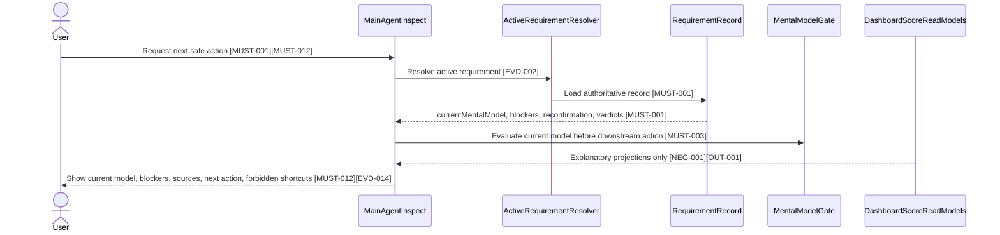
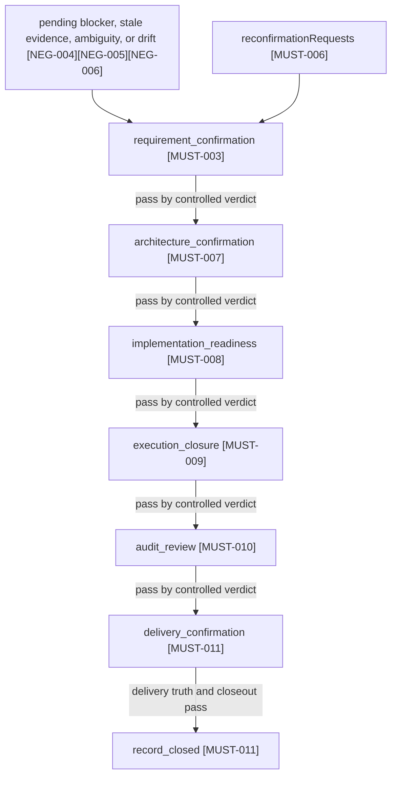
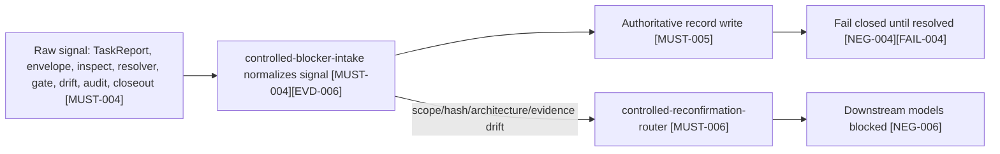
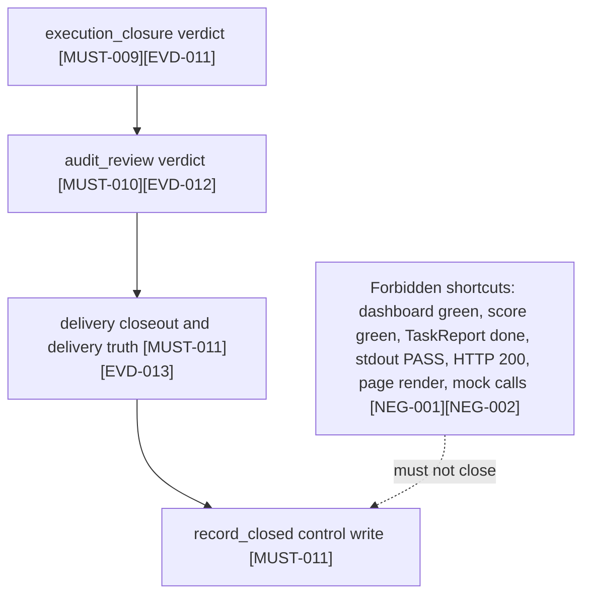
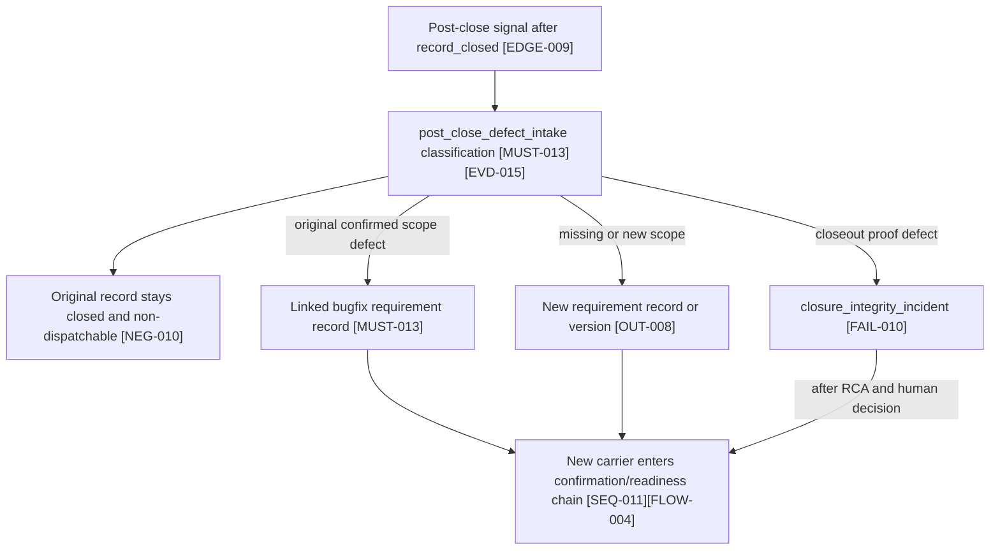

# Main Agent Six-Mental-Model Control Plane Completion

Date: 2026-05-24
Status: Draft
Source request: 将 Main Agent 六心智模型控制面补齐为可确认、可追踪、可验证的需求契约源文档。
Checkpoint: 8 - human-readable views, evidence overview, E2E overview, Reverse Audit Report, and Definition of Done
Checkpoint status: human-readable confirmation views drafted; confirmation language selection, HTML render, and controlled confirmation ingest pending

## 1. 结论

当前 Main Agent 已覆盖若干关键门禁，但还没有真正实现 6 个心智模型的统一编排状态机。当前实现更接近 `RequirementRecord + gate scripts + inspect projection + dashboard read model` 的组合，而不是由 `currentMentalModel` 驱动的主控控制面。

本需求目标是补齐一个真正的 Main Agent control plane：主 Agent 不再只从零散 gate、projection、score、dashboard 或 TaskReport 推导下一步，而是以 `RequirementRecord + currentMentalModel + sixModelVerdicts + controlled blocker intake` 作为唯一编排依据。

完成后，Main Agent inspect、dispatch、readiness、execution closure、audit review、delivery closeout 和 record close 都必须回到同一条受控状态链；Dashboard、score、TaskReport、stdout、HTTP 返回和页面渲染都只能作为 evidence 或 read model，不能成为控制流权威。

## 2. Checkpoint 1 Source Boundary

### 2.1 当前 checkpoint 目标

本 checkpoint 只负责把普通需求文档的头部、背景、范围、非目标和冻结决策整理为后续 `requirements-contract-authoring` 可继续扩展的源文档基础。

本 checkpoint 不生成 `implementationConfirmation`，不渲染确认 HTML，不请求用户确认，不进入 implementation readiness，也不声明需求已可实施。

### 2.2 本文档权威边界

本文档当前仍是需求源文档草稿。后续 checkpoint 会把需求语义逐步迁移到同一文件内的 `implementationConfirmation` 块中；在该块存在并通过确认前，本文档只能作为需求分析和契约化输入，不能作为已确认实施范围。

后续一旦引入 `implementationConfirmation`，需求语义权威必须以该块中的 `MUST-*`、`NEG-*`、`OUT-*`、`EVD-*`、`FAIL-*`、`EDGE-*`、`TRACE-*` 和 `CMD-*` ID 为准。正文、图、表和执行计划只能作为这些 ID 的解释视图，不得引入未编号的新范围。

### 2.3 业务范围

本需求的业务范围是 Main Agent 对消费用户暴露的主控行为：当用户通过 `$bmad-speckit`、`/bmad-speckit`、`bmad-speckit` 或等价宿主入口触发主控时，系统必须能基于受控 requirement record 和六心智模型状态给出下一步、阻断原因、恢复路径或完成状态。

业务范围内包括：

1. 用户可见 inspect 状态。
2. 当前 requirement 的下一步推荐。
3. 阻断、重跑、重新确认、审计、交付确认和完成态的可解释输出。
4. 防止 dashboard、score、TaskReport、stdout、HTTP 200、page render 或 mock-only 信号误导用户认为需求已完成。

### 2.4 治理范围

本需求的治理范围是 Main Agent 控制面内部的受控状态链、事件写入、blocker 归一化、reconfirmation router、模型 verdict、execution closure、audit review、delivery confirmation 和 record close。

治理范围内包括：

1. `currentMentalModel` 受控读写。
2. `mentalModelTransitions` 前后 hash 与 sourceRefs。
3. `sixModelVerdicts` 的计算与持久化。
4. `controlled-blocker-intake` 对 raw signals 的归一化。
5. `controlled-reconfirmation-router` 对 scope/hash/architecture/evidence drift 的回退路由。
6. architecture confirmation 通过 main-agent action switch 接入。
7. execution closure、audit review、delivery confirmation 的模型级 verdict。
8. Dashboard、score、SFT、report、summary、hook receipt 作为 read model 或 evidence 的边界。

### 2.5 非目标

本需求不做以下事项：

1. 不把 dashboard projection 改成控制源。
2. 不把 score green、stdout PASS、TaskReport done、HTTP 200、页面渲染、mock calls 或 fixture-only replay 当作完成证据。
3. 不允许绕过 controlled writer 直接修改 `currentMentalModel`。
4. 不允许子代理直接写顶层权威 blocker。
5. 不重写整个 scoring framework。
6. 不改变 delivery closeout gate 的最终判定地位。
7. 不引入新的需求确认侧车文件或独立权威 contract 文件。
8. 不在本 checkpoint 中生成、确认或 ingest `implementationConfirmation`。

### 2.6 冻结决策

以下决策在后续 checkpoint 中默认保持不变，除非用户明确发起 scope change：

1. `RequirementRecord` 是 Main Agent 控制面的唯一控制记录源。
2. `currentMentalModel` 是 Main Agent 判断当前阶段的受控字段。
3. 六个评估模型固定为 `requirement_confirmation`、`architecture_confirmation`、`implementation_readiness`、`execution_closure`、`audit_review`、`delivery_confirmation`。
4. `record_closed` 是终态，不是六个评估模型之一。
5. 只有当前模型 `status=pass` 才允许推进到下一个模型。
6. 任一模型发现 scope、source hash、implementation hash、architecture hash 或 evidence semantic drift，必须进入 `controlled-reconfirmation-router`。
7. 子代理、dashboard、score projection、TaskReport、stdout、HTTP 返回和页面渲染不能直接推进模型状态。
8. unknown failure 必须转为 `blocker_unknown` 并 fail closed。
9. closeout gate 仍是最终交付判定，execution closure 只提供 closeout 前的模型级汇总。
10. 后续 confirmation-ready 文档必须在同一源文档内扩展，不创建新的独立权威需求契约文件。

### 2.7 后续 checkpoint 入口

Checkpoint 2 已从本边界继续，新增 `implementationConfirmation` core fields 和完整 `applicability.*` 声明，且未重写本 checkpoint 的范围、非目标或冻结决策。

Checkpoint 3 已继续填充 `must`、`notDone`、`mustNot` 和 `evidence` 数组。Checkpoint 3 未渲染 HTML，未设置 `status: user_confirmed`，也未把当前 ID 草稿解释为可确认范围。

Checkpoint 4 已继续填充 `failurePaths`、`edgeCases` 和 `traceRows` 数组，并把 Checkpoint 3 中引用的 `TRACE-*` 与 `FAIL-*` 补齐为可审计映射。

Checkpoint 5 已继续填充 `sequenceViews`、`flowViews`、`edgeCaseViews` 和 `boundaryViews`，并把本 checkpoint 中引用的 `SEQ-*`、`FLOW-*`、`EDGEVIEW-*` 和 `BOUNDARY-*` 补齐为可渲染视图。

Checkpoint 6 已继续填充 `artifactAutomationPlan`、`requiredCommands`、`suggestedCommands` 和 `closeoutReadinessPreview`，并把当前 evidence、traceRows 和 views 中引用的 `ART-*` 与 `CMD-*` 补齐为可执行计划。

Checkpoint 7 已继续填充 `applicability.*.applies=true` 对应的条件模块，尤其是 governance event registry、controlled ingest writer registry、runtime recovery registry、active requirement resolution、scoring/dashboard/SFT boundary、current-target map、scripts/hooks registry。

Checkpoint 8 已继续补充 human-readable Mermaid views、evidence overview、E2E acceptance overview、artifact automation plan view、Reverse Audit Report 和 Definition of Done，并为后续确认页渲染做准备。

Checkpoint 9 必须先让用户显式选择确认页语言；只有用户选择 zh-CN、en-US 或 bilingual 后，才能调用 skill-local confirmation HTML renderer。

Checkpoint 8A 已澄清 `record_closed` 边界：`currentMentalModel` 只允许六个评估模型值；`record_closed` 必须由 `status=closed`、`lastEventType=record_closed`、`requirementClosures` 或 terminal close event 派生表达，不得成为 `currentMentalModel` 的值，也不得要求新增顶层 `recordLifecycleState` 字段。

Checkpoint 8B 已补充 post-close defect 管理规则：`record_closed` 后发现真实实现缺陷时，原 record 保持 closed，并通过 linked bugfix requirement record 或新 requirement/version 承载后续工作；只有 closeout、gate、evidence、hash 或 provenance 本身有缺陷时，才进入 closure_integrity_incident，不走普通 reconfirm router，也不得自动 dispatch。

## 3. implementationConfirmation Core Draft

This checkpoint now includes the confirmation block shell, identity, rendering placeholders, applicability declarations, drafted `MUST-*`, `NEG-*`, `OUT-*`, and `EVD-*` rows, `FAIL-*`, `EDGE-*`, and `TRACE-*` mappings, ID-bound sequence, flow, edge-case, and boundary views, artifact automation and command plans, conditional governance/runtime/scoring/current-target/scripts modules, and human-readable confirmation views. It deliberately leaves confirmation language selection, rendered confirmation HTML, exact user confirmation, and controlled confirmation ingest for later checkpoints.

```yaml
implementationConfirmation:
  contractSchemaVersion: 1
  status: draft
  recordId: REQ-MAIN-AGENT-SIX-MENTAL-MODEL-CONTROL-PLANE
  requirementSetId: REQ-MAIN-AGENT-SIX-MENTAL-MODEL-CONTROL-PLANE
  entryFlow: standalone_tasks
  entryFlowClass: task_packet_entry
  workflowAdapter: bmad
  contractAuthoringRequired: true
  confirmationLanguage: null
  confirmationProfile: implementation_confirmation
  requiredViewPacks:
    - business_scope
    - governance_scope
    - failure_paths
    - traceability_matrix
    - artifact_automation
    - current_target_map
  optionalViewPacks:
    - architecture_confirmation
    - scoring_dashboard_sft
  confirmedAt: null
  confirmedBy: null
  sourceDocumentHash: null
  implementationConfirmationHash: null
  confirmationRender:
    htmlPath: null
    summaryPath: null
    reportPath: null
    htmlHash: null
    confirmationPhrase: null
  applicability:
    governanceEvents:
      applies: true
      reasonCode: mental_model_control_plane_adds_control_events_transitions_blocker_intake_and_reconfirmation_router
    runtimeRecovery:
      applies: true
      reasonCode: model_transitions_blocker_intake_rerun_reconfirmation_execution_closure_audit_review_and_closeout_recovery_are_in_scope
      requiresFunctionalResumeFailureCaseRegistry: true
      activeRequirementResolutionRequired: true
      retiredContextSurfaceForbidden: true
    scoringDashboardSft:
      applies: true
      reasonCode: audit_review_and_dashboard_six_model_projection_boundaries_must_remain_read_model_only
    currentTargetMap:
      applies: true
      reasonCode: current_gate_projection_dashboard_taskreport_driven_flow_must_migrate_to_requirement_record_current_mental_model_control_plane
    scriptsAndHooks:
      applies: true
      reasonCode: main_agent_orchestration_gates_ingest_scripts_dashboard_projection_and_hook_receipts_are_in_scope
  must:
    - id: MUST-001
      text: >-
        Main Agent inspect 必须先解析 active RequirementRecord，并以 active record、currentMentalModel、unresolved blockers、
        reconfirmationRequests、current model verdict 和 sixModelVerdicts 的顺序决定下一步。
      evidenceRefs: ["EVD-001", "EVD-002"]
      coveredByTraceRows: ["TRACE-001"]
      coveredBySequenceViews: ["SEQ-001"]
      riskLevel: critical
    - id: MUST-002
      text: >-
        currentMentalModel 必须只能通过 controlled writer 或 control-store event 更新；每次迁移必须同时写入
        mentalModelTransitions，并记录 previousModel、nextModel、reasonCode、sourceRefs、recordHashBefore、
        recordHashAfter、writtenBy 和 writtenAt。
      evidenceRefs: ["EVD-003"]
      coveredByTraceRows: ["TRACE-002"]
      coveredBySequenceViews: ["SEQ-002"]
      riskLevel: critical
    - id: MUST-003
      text: >-
        main-agent-mental-model-gate 必须计算 requirement_confirmation、architecture_confirmation、
        implementation_readiness、execution_closure、audit_review 和 delivery_confirmation 六个模型 verdict，并且只有当前模型
        status=pass 时才推荐推进到下一个模型。
      evidenceRefs: ["EVD-004"]
      coveredByTraceRows: ["TRACE-003"]
      coveredBySequenceViews: ["SEQ-002"]
      riskLevel: critical
    - id: MUST-004
      text: >-
        controlled-blocker-intake 必须接收 TaskReport、SubagentEvidenceEnvelope.failureRecords、inspect diagnostics、
        resolver projection、gate failures、drift results、audit/scoring failures 和 closeout blockers，并归一化为
        NormalizedBlockerSignal。
      evidenceRefs: ["EVD-005", "EVD-006"]
      coveredByTraceRows: ["TRACE-004"]
      coveredBySequenceViews: ["SEQ-003"]
      riskLevel: critical
    - id: MUST-005
      text: >-
        模型迁移前和 delivery closeout 前必须运行或确认无 pending controlled-blocker-intake；存在 blocking normalized
        signal 时不得推进 currentMentalModel。
      evidenceRefs: ["EVD-006", "EVD-007"]
      coveredByTraceRows: ["TRACE-005"]
      coveredBySequenceViews: ["SEQ-003"]
      riskLevel: critical
    - id: MUST-006
      text: >-
        controlled-reconfirmation-router 必须覆盖任一模型发现的 source hash、implementation hash、architecture hash、scope
        或 evidence semantic drift，写入 blocking reconfirmationRequests，并将 currentMentalModel 切回
        requirement_confirmation 或 architecture_confirmation。
      evidenceRefs: ["EVD-008"]
      coveredByTraceRows: ["TRACE-006"]
      coveredBySequenceViews: ["SEQ-004"]
      riskLevel: critical
    - id: MUST-007
      text: >-
        architecture-confirmation-ingest 和 architecture-state-check 必须作为 main-agent-orchestration 的统一 action
        暴露，并进入同一 record event 链和 mental model gate 判定。
      evidenceRefs: ["EVD-009"]
      coveredByTraceRows: ["TRACE-007"]
      coveredBySequenceViews: ["SEQ-005"]
      riskLevel: high
    - id: MUST-008
      text: >-
        implementation_readiness verdict 必须只在需求确认、架构确认、blocking blocker、reconfirmationRequests、stale evidence
        和 required readiness evidence 均满足当前 record/hash/attempt 时允许进入 dispatch 或 execution。
      evidenceRefs: ["EVD-010"]
      coveredByTraceRows: ["TRACE-008"]
      coveredBySequenceViews: ["SEQ-006"]
      riskLevel: critical
    - id: MUST-009
      text: >-
        execution_closure verdict 必须汇总 packet、traceRows、commandRunRefs、artifactIndex、SubagentEvidenceEnvelope、
        TaskReport、rerunLoops、current attempt 和 failureRecords，并在 closeout gate 前给 inspect 可读闭合状态。
      evidenceRefs: ["EVD-011"]
      coveredByTraceRows: ["TRACE-009"]
      coveredBySequenceViews: ["SEQ-007"]
      riskLevel: critical
    - id: MUST-010
      text: >-
        audit_review verdict 必须读取 readiness audit、RunScoreRecord、score provenance、RCA、data production、eval/SFT、
        coach output、quality gate output 和 current hashes，并把 unresolved audit findings 同步到 blocker intake。
      evidenceRefs: ["EVD-012"]
      coveredByTraceRows: ["TRACE-010"]
      coveredBySequenceViews: ["SEQ-008"]
      riskLevel: high
    - id: MUST-011
      text: >-
        delivery_confirmation verdict 必须在 closeout gate、delivery truth gate、execution_closure、audit_review、current
        attempt evidence、failureRecords、rerunLoops 和 reconfirmationRequests 全部闭合后，才允许写入 record_closed
        生命周期终态。
      evidenceRefs: ["EVD-013"]
      coveredByTraceRows: ["TRACE-011"]
      coveredBySequenceViews: ["SEQ-009"]
      riskLevel: critical
    - id: MUST-012
      text: >-
        用户可见 inspect 输出必须显示 active requirement、currentMentalModel、current model status、six model summary、
        blocking category、authoritative source checked、pending blocker intake status、open reconfirmation requests、next safe
        action 和 forbidden shortcuts。
      evidenceRefs: ["EVD-014"]
      coveredByTraceRows: ["TRACE-012"]
      coveredBySequenceViews: ["SEQ-010"]
      riskLevel: high
    - id: MUST-013
      text: >-
        record_closed 后发现的问题必须进入 post_close_defect_intake 分类：原确认范围内实现缺陷必须创建 linked bugfix
        requirement record；原需求未覆盖的新能力或漏项必须创建新的 requirement record/version；架构假设失效必须创建新
        record/version 并重新进入 architecture_confirmation 或更早确认；closeout、gate、evidence、hash 或 provenance 本身错误必须创建
        closure_integrity_incident。
      evidenceRefs: ["EVD-015"]
      coveredByTraceRows: ["TRACE-014"]
      coveredBySequenceViews: ["SEQ-011"]
      riskLevel: critical
  notDone:
    - id: NEG-001
      text: Dashboard green、score green、SFT/report/summary/hook receipt 或 dashboard six-model projection 不得直接推进模型、写 gate decision、写 closeout 或关闭 record。
      evidenceRefs: ["EVD-004", "EVD-012", "EVD-013"]
      whyItBlocksCompletion: Read models reverse-drive control flow would bypass the controlled RequirementRecord authority.
      negativeAssertionRequired: true
      coveredByFailurePath: ["FAIL-001"]
    - id: NEG-002
      text: TaskReport done、SubagentEvidenceEnvelope success、stdout PASS、HTTP 200、page render、exit code only、mock calls 或 fixture-only replay 不得直接推进 currentMentalModel 或 closeout。
      evidenceRefs: ["EVD-005", "EVD-011", "EVD-013"]
      whyItBlocksCompletion: Smoke-only or candidate evidence can report false completion without current controlled proof.
      negativeAssertionRequired: true
      coveredByFailurePath: ["FAIL-002"]
    - id: NEG-003
      text: 子代理、dashboard、score projection、report、hook 或非注册脚本不得直接写顶层 authoritative blocker、currentMentalModel、sixModelVerdicts、requirementClosures 或 terminal decision。
      evidenceRefs: ["EVD-003", "EVD-006"]
      whyItBlocksCompletion: Unauthorized writers would make the control plane non-auditable and non-recoverable.
      negativeAssertionRequired: true
      coveredByFailurePath: ["FAIL-003"]
    - id: NEG-004
      text: 存在 open blocking failureRecords、pending blockerIntakeRuns、open reconfirmationRequests、stale evidence、ambiguous evidence 或 unresolved rerunLoops 时，不得 dispatch、readiness pass、execution closure pass、audit pass、delivery confirmation pass 或 record close。
      evidenceRefs: ["EVD-007", "EVD-008", "EVD-013"]
      whyItBlocksCompletion: Downstream progress with unresolved blockers would violate fail-closed model sequencing.
      negativeAssertionRequired: true
      coveredByFailurePath: ["FAIL-004"]
    - id: NEG-005
      text: unknown failure、missing provenance、unrecognized raw signal 或 resolver ambiguity 不得被忽略；必须归一化为 blocker_unknown、provenance_missing 或 resolver_ambiguous 并 fail closed。
      evidenceRefs: ["EVD-006"]
      whyItBlocksCompletion: Unknown or unproven failures are unsafe to treat as non-blocking.
      negativeAssertionRequired: true
      coveredByFailurePath: ["FAIL-005"]
    - id: NEG-006
      text: source hash、implementation hash、architecture hash、scope 或 evidence semantic drift 不得作为普通 rerun 静默处理；必须进入 controlled-reconfirmation-router。
      evidenceRefs: ["EVD-008"]
      whyItBlocksCompletion: Semantic drift changes confirmed scope or architecture binding and requires reconfirmation.
      negativeAssertionRequired: true
      coveredByFailurePath: ["FAIL-006"]
    - id: NEG-007
      text: architecture confirmation 不得继续作为 main-agent action switch 不可见的孤立流程；底层脚本不得绕过主控状态检查。
      evidenceRefs: ["EVD-009"]
      whyItBlocksCompletion: Architecture state outside the main control plane can become stale without blocking downstream work.
      negativeAssertionRequired: true
      coveredByFailurePath: ["FAIL-007"]
    - id: NEG-008
      text: execution_closure pass 不得替代 delivery closeout gate 或 delivery truth gate；closeout gate 仍是最终交付判定。
      evidenceRefs: ["EVD-011", "EVD-013"]
      whyItBlocksCompletion: Execution closure is a model summary, not terminal delivery proof.
      negativeAssertionRequired: true
      coveredByFailurePath: ["FAIL-008"]
    - id: NEG-009
      text: 本需求不得创建新的独立权威 requirements contract、sidecar confirmation 文件或 conversation-only implementation prompt。
      evidenceRefs: ["EVD-001"]
      whyItBlocksCompletion: Requirement semantics must remain in this source document and later inline implementationConfirmation block.
      negativeAssertionRequired: true
      coveredByFailurePath: ["FAIL-009"]
    - id: NEG-010
      text: record_closed 后的缺陷、遗漏、架构变化或后续回归不得自动 reopen 原 record、不得将 currentMentalModel 回滚到确认模型、不得从 closed record 继续 dispatch，也不得把新缺陷修复完成状态写回原 record 当作重新完成证据。
      evidenceRefs: ["EVD-015", "EVD-013"]
      whyItBlocksCompletion: Closed records must remain immutable historical authority; post-close work needs a new execution carrier or a closure integrity incident.
      negativeAssertionRequired: true
      coveredByFailurePath: ["FAIL-010"]
  mustNot:
    - id: OUT-001
      text: 本需求不把 dashboard projection、score、SFT、report、summary 或 hook receipt 改成控制源。
      scopeBoundary: read models may explain state but must not control state.
      userApprovalRequiredIfChanged: true
      coveredByBoundaryView: ["BOUNDARY-001"]
    - id: OUT-002
      text: 本需求不重写整个 scoring framework，也不改变 RunScoreRecord 的兼容 read-model 角色。
      scopeBoundary: scoring changes are limited to provenance and read-model boundary enforcement.
      userApprovalRequiredIfChanged: true
      coveredByBoundaryView: ["BOUNDARY-001"]
    - id: OUT-003
      text: 本需求不改变 delivery closeout gate 的最终判定地位。
      scopeBoundary: delivery closeout remains terminal delivery proof.
      userApprovalRequiredIfChanged: true
      coveredByBoundaryView: ["BOUNDARY-002"]
    - id: OUT-004
      text: 本需求不允许绕过 controlled writer 直接修改 currentMentalModel、sixModelVerdicts、failureRecords、reconfirmationRequests 或 requirementClosures。
      scopeBoundary: all control writes must pass registered writer and before/after hash evidence.
      userApprovalRequiredIfChanged: true
      coveredByBoundaryView: ["BOUNDARY-003"]
    - id: OUT-005
      text: 本需求不允许子代理直接写顶层权威 blocker 或 terminal decision。
      scopeBoundary: subagents produce candidate evidence only.
      userApprovalRequiredIfChanged: true
      coveredByBoundaryView: ["BOUNDARY-003"]
    - id: OUT-006
      text: 本需求不在当前 checkpoint 渲染 confirmation HTML 或执行 controlled confirmation ingest。
      scopeBoundary: confirmation rendering and ingest are later checkpoints after views, trace rows, commands, and user language selection.
      userApprovalRequiredIfChanged: true
      coveredByBoundaryView: ["BOUNDARY-004"]
    - id: OUT-007
      text: 本需求不把 current checkpoint commit 解释为 implementation ready、merge ready、launch ready 或 closeout ready。
      scopeBoundary: checkpoint commits preserve authoring progress only.
      userApprovalRequiredIfChanged: true
      coveredByBoundaryView: ["BOUNDARY-004"]
    - id: OUT-008
      text: 本需求不把 post-close defect、missing scope、architecture drift 或 regression 当作原 closed record 的普通 reconfirmation 或自动 reopen。
      scopeBoundary: post-close work is carried by a linked bugfix record, new requirement/version, or closure_integrity_incident.
      userApprovalRequiredIfChanged: true
      coveredByBoundaryView: ["BOUNDARY-005"]
  evidence:
    - id: EVD-001
      text: Source document remains the single implementation source document and contains no sidecar authoritative contract.
      gate: source_document_contract_boundary_review
      oracle: repository scan finds this source document as the only authoritative requirement source for the new scope.
      requiredCommandRefs: ["CMD-CONTRACT-001"]
      artifactRefs: ["ART-SOURCE-001"]
      acceptanceType: contract_static
    - id: EVD-002
      text: Main Agent inspect resolves active RequirementRecord and orders decision inputs by controlled authority.
      gate: inspect_authority_order_acceptance
      oracle: inspect output and test fixture show active record, currentMentalModel, blockers, reconfirmationRequests, current verdict, and read-model-only projections in the required order.
      requiredCommandRefs: ["CMD-DELIVERY-001"]
      artifactRefs: ["ART-INSPECT-001"]
      acceptanceType: acceptance_integration
    - id: EVD-003
      text: currentMentalModel transition writes are controlled and include before/after hashes.
      gate: mental_model_transition_control_store_acceptance
      oracle: requirement record contains currentMentalModel and matching mentalModelTransitions with recordHashBefore and recordHashAfter.
      requiredCommandRefs: ["CMD-DELIVERY-002"]
      artifactRefs: ["ART-RECORD-001", "ART-EVENT-001"]
      acceptanceType: acceptance_unit
    - id: EVD-004
      text: main-agent-mental-model-gate computes all six model verdicts and refuses next-model progression unless current model is pass.
      gate: six_model_gate_acceptance
      oracle: tests cover pass, blocked, stale, skipped, and non-current precheck behavior for all six models.
      requiredCommandRefs: ["CMD-DELIVERY-003"]
      artifactRefs: ["ART-GATE-001"]
      acceptanceType: acceptance_unit
    - id: EVD-005
      text: Candidate signals from TaskReport and SubagentEvidenceEnvelope are evidence inputs only until controlled-blocker-intake processes them.
      gate: candidate_signal_boundary_acceptance
      oracle: TaskReport done and envelope success do not change currentMentalModel without main-agent intake and gate evaluation.
      requiredCommandRefs: ["CMD-DELIVERY-004"]
      artifactRefs: ["ART-SUBAGENT-001"]
      acceptanceType: adversarial_integration
    - id: EVD-006
      text: controlled-blocker-intake normalizes all required raw signal classes and writes authoritative blocker records.
      gate: controlled_blocker_intake_acceptance
      oracle: each raw signal class produces a NormalizedBlockerSignal or blocker_unknown with provenance, dedupeKey, mentalModel, and recommendedAction.
      requiredCommandRefs: ["CMD-DELIVERY-005"]
      artifactRefs: ["ART-BLOCKER-001"]
      acceptanceType: acceptance_integration
    - id: EVD-007
      text: Pending or blocking intake prevents model transition and delivery closeout.
      gate: blocker_transition_gate_acceptance
      oracle: model transition and closeout attempts fail closed while pendingBlockerIntake or unresolved blocking signals exist.
      requiredCommandRefs: ["CMD-DELIVERY-006"]
      artifactRefs: ["ART-BLOCKER-002", "ART-GATE-002"]
      acceptanceType: adversarial_integration
    - id: EVD-008
      text: controlled-reconfirmation-router handles hash, scope, architecture, and evidence semantic drift across all models.
      gate: reconfirmation_router_acceptance
      oracle: drift cases write blocking reconfirmationRequests and move currentMentalModel to requirement_confirmation or architecture_confirmation.
      requiredCommandRefs: ["CMD-DELIVERY-007"]
      artifactRefs: ["ART-RECONFIRM-001"]
      acceptanceType: adversarial_integration
    - id: EVD-009
      text: Architecture confirmation ingest and state check are exposed through main-agent-orchestration actions.
      gate: architecture_main_agent_action_acceptance
      oracle: architecture confirmation action updates architectureConfirmationState through controlled event chain and is visible to mental model gate.
      requiredCommandRefs: ["CMD-DELIVERY-008"]
      artifactRefs: ["ART-ARCH-001", "ART-EVENT-002"]
      acceptanceType: acceptance_integration
    - id: EVD-010
      text: implementation_readiness verdict blocks when required confirmation, architecture, blocker, reconfirmation, stale evidence, or readiness evidence prerequisites are missing.
      gate: implementation_readiness_model_acceptance
      oracle: readiness cases report explicit blocking reasons and do not dispatch when prerequisites are missing or stale.
      requiredCommandRefs: ["CMD-DELIVERY-009"]
      artifactRefs: ["ART-READINESS-001"]
      acceptanceType: adversarial_integration
    - id: EVD-011
      text: execution_closure verdict summarizes current attempt execution evidence before closeout.
      gate: execution_closure_acceptance
      oracle: packet, traceRows, commandRunRefs, artifactIndex, envelope, rerunLoops, current attempt, and failureRecords determine execution_closure status.
      requiredCommandRefs: ["CMD-DELIVERY-010"]
      artifactRefs: ["ART-EXECUTION-001"]
      acceptanceType: acceptance_integration
    - id: EVD-012
      text: audit_review verdict consumes audit, score provenance, RCA, data production, eval/SFT, coach, quality gate, and current hash evidence without allowing read-model reverse control.
      gate: audit_review_acceptance
      oracle: dashboard or score green alone cannot create audit_review pass; unresolved audit findings are routed to blocker intake.
      requiredCommandRefs: ["CMD-DELIVERY-011"]
      artifactRefs: ["ART-AUDIT-001", "ART-SCORE-001"]
      acceptanceType: adversarial_integration
    - id: EVD-013
      text: delivery_confirmation and record_closed lifecycle closure require current closeout, delivery truth, execution closure, audit review, blockers, reruns, reconfirmation, and current attempt evidence to agree.
      gate: delivery_confirmation_closeout_acceptance
      oracle: record_closed lifecycle state is written only after delivery_confirmation pass and no open blockers, reruns, or reconfirmation requests remain.
      requiredCommandRefs: ["CMD-DELIVERY-012"]
      artifactRefs: ["ART-CLOSEOUT-001", "ART-RECORD-002"]
      acceptanceType: acceptance_integration
    - id: EVD-014
      text: User-visible inspect output explains current model state, blockers, sources, next safe action, and forbidden shortcuts.
      gate: inspect_user_output_acceptance
      oracle: inspect output contains active requirement, currentMentalModel, six model summary, blocker category, authoritative source, pending intake, reconfirmation, next action, and forbidden shortcuts.
      requiredCommandRefs: ["CMD-DELIVERY-013"]
      artifactRefs: ["ART-INSPECT-002"]
      acceptanceType: acceptance_e2e
    - id: EVD-015
      text: Post-close problems are classified into bugfix record, new requirement/version, architecture reconfirmation through a new record/version, or closure_integrity_incident without reopening the closed record by default.
      gate: post_close_defect_intake_acceptance
      oracle: tests show closed records do not dispatch, post-close defects create linked bugfix records or new requirement records, and closure proof defects create closure_integrity_incident before any new execution.
      requiredCommandRefs: ["CMD-DELIVERY-014"]
      artifactRefs: ["ART-POSTCLOSE-001", "ART-RECORD-002"]
      acceptanceType: adversarial_integration
  openQuestions:
    - id: Q-001
      text: 用户尚未为本源文档选择确认页语言；渲染 confirmation HTML 前必须显式选择 zh-CN、en-US 或 bilingual。
      blocksImplementation: false
      requiredBefore: render_confirmation
  failurePaths:
    - id: FAIL-001
      title: Read model attempts to control workflow
      trigger: Dashboard, score, SFT/report/summary/hook receipt, or dashboard six-model projection reports green/pass.
      expectedBehavior: Treat the signal as evidence or read model only; require controlled RequirementRecord decision before progression.
      forbiddenBehavior: Do not write currentMentalModel, gate decision, closeout, requirementClosures, or record_closed from read models.
      blocksCompletionWhenViolated: true
      linkedNegIds: ["NEG-001"]
      linkedEvidenceIds: ["EVD-004", "EVD-012", "EVD-013"]
      requiredAssertions:
        - dashboard and score projections expose canAffectControlFlow=false
        - delivery confirmation remains blocked without controlled record evidence
    - id: FAIL-002
      title: Candidate or smoke-only evidence tries to close work
      trigger: TaskReport done, envelope success, stdout PASS, HTTP 200, page render, exit code only, mock call, or fixture replay appears.
      expectedBehavior: Preserve the signal as candidate evidence and require controlled intake, current attempt binding, and semantic assertions.
      forbiddenBehavior: Do not advance currentMentalModel or closeout directly from smoke-only or candidate evidence.
      blocksCompletionWhenViolated: true
      linkedNegIds: ["NEG-002"]
      linkedEvidenceIds: ["EVD-005", "EVD-011", "EVD-013"]
      requiredAssertions:
        - candidate evidence alone leaves currentMentalModel unchanged
        - current attempt evidence with independent oracle is required for closure
    - id: FAIL-003
      title: Unauthorized control writer
      trigger: Subagent, dashboard, score projection, report, hook, or unregistered script attempts top-level control writes.
      expectedBehavior: Reject the write, record blocker or gate failure, and keep record hash unchanged except for controlled rejection evidence.
      forbiddenBehavior: Do not allow unauthorized writes to authoritative blockers, currentMentalModel, sixModelVerdicts, closures, or terminal decisions.
      blocksCompletionWhenViolated: true
      linkedNegIds: ["NEG-003"]
      linkedEvidenceIds: ["EVD-003", "EVD-006"]
      requiredAssertions:
        - writer registry or control-store enforcement rejects unregistered writers
        - before/after hash proves protected fields were not changed
    - id: FAIL-004
      title: Downstream progression with unresolved blockers
      trigger: Open failureRecords, pending blocker intake, open reconfirmation, stale or ambiguous evidence, or unresolved rerun loop exists.
      expectedBehavior: Fail closed before dispatch, readiness pass, execution closure pass, audit pass, delivery confirmation pass, or record close.
      forbiddenBehavior: Do not proceed downstream while unresolved blocking state exists.
      blocksCompletionWhenViolated: true
      linkedNegIds: ["NEG-004"]
      linkedEvidenceIds: ["EVD-007", "EVD-008", "EVD-013"]
      requiredAssertions:
        - pendingBlockerIntake blocks model transition
        - open reconfirmationRequests block delivery confirmation
    - id: FAIL-005
      title: Unknown or unproven signal ignored
      trigger: Unknown failure, missing provenance, unrecognized raw signal, or resolver ambiguity is observed.
      expectedBehavior: Normalize into blocker_unknown, provenance_missing, or resolver_ambiguous and fail closed.
      forbiddenBehavior: Do not drop, downgrade, or treat unknown signals as non-blocking.
      blocksCompletionWhenViolated: true
      linkedNegIds: ["NEG-005"]
      linkedEvidenceIds: ["EVD-006"]
      requiredAssertions:
        - unknown raw signals create blocking NormalizedBlockerSignal
        - resolver ambiguity produces actionable manual resolution output
    - id: FAIL-006
      title: Semantic drift handled as rerun only
      trigger: Source hash, implementation hash, architecture hash, scope, or evidence semantic drift is detected.
      expectedBehavior: Route through controlled-reconfirmation-router and set currentMentalModel to requirement_confirmation or architecture_confirmation.
      forbiddenBehavior: Do not silently rerun, remediate, dispatch, or closeout without reconfirmation.
      blocksCompletionWhenViolated: true
      linkedNegIds: ["NEG-006"]
      linkedEvidenceIds: ["EVD-008"]
      requiredAssertions:
        - drift writes blocking reconfirmationRequests
        - downstream models are blocked until reconfirmation closes
    - id: FAIL-007
      title: Architecture confirmation remains outside main-agent switch
      trigger: Architecture confirmation is ingested or checked by isolated scripts without main-agent action visibility.
      expectedBehavior: Expose architecture-confirmation-ingest and architecture-state-check through main-agent-orchestration and feed mental model gate.
      forbiddenBehavior: Do not allow isolated architecture state to bypass current model progression or stale blocking.
      blocksCompletionWhenViolated: true
      linkedNegIds: ["NEG-007"]
      linkedEvidenceIds: ["EVD-009"]
      requiredAssertions:
        - main-agent action writes or observes the controlled architecture event chain
        - stale architecture state blocks readiness, execution, and closeout
    - id: FAIL-008
      title: Execution closure replaces delivery closeout
      trigger: execution_closure verdict is pass while delivery closeout gate or delivery truth gate is missing, stale, or blocked.
      expectedBehavior: Show execution_closure pass as pre-closeout summary only and keep delivery_confirmation blocked.
      forbiddenBehavior: Do not mark delivery complete or record_closed from execution_closure alone.
      blocksCompletionWhenViolated: true
      linkedNegIds: ["NEG-008"]
      linkedEvidenceIds: ["EVD-011", "EVD-013"]
      requiredAssertions:
        - delivery_confirmation requires closeout and delivery truth gate
        - record_closed is not written from execution_closure pass alone
    - id: FAIL-009
      title: Sidecar contract becomes authoritative
      trigger: A separate contract, confirmation sidecar, or conversation-only prompt is treated as source of truth.
      expectedBehavior: Reject sidecar authority and keep semantics in this source document and inline implementationConfirmation block.
      forbiddenBehavior: Do not implement or confirm scope from a sidecar document that is not this source document.
      blocksCompletionWhenViolated: true
      linkedNegIds: ["NEG-009"]
      linkedEvidenceIds: ["EVD-001"]
      requiredAssertions:
        - no separate authoritative contract file is used for implementation readiness
        - prompts and generated views reference IDs from this source document
    - id: FAIL-010
      title: Post-close issue mutates or reuses closed record
      trigger: A defect, missing scope, architecture drift, regression, or closure proof issue is discovered after record_closed.
      expectedBehavior: Classify through post_close_defect_intake and create a linked bugfix record, new requirement/version, architecture reconfirmation path, or closure_integrity_incident.
      forbiddenBehavior: Do not automatically reopen the closed record, roll currentMentalModel back, dispatch from the closed record, or write the new fix completion back as the original record completion.
      blocksCompletionWhenViolated: true
      linkedNegIds: ["NEG-010"]
      linkedEvidenceIds: ["EVD-015", "EVD-013"]
      requiredAssertions:
        - closed record remains terminal and non-dispatchable
        - post-close implementation defects produce linked bugfix requirement records
        - closeout proof defects produce closure_integrity_incident before any new execution
  edgeCases:
    - id: EDGE-001
      category: stale_hash
      condition: Current source, implementation, architecture, target path, impact scan, or evidence hash differs from the recorded current value.
      expectedBehavior: Route to reconfirmation or stale blocker according to the affected model.
      forbiddenBehavior: Do not proceed as a normal rerun without reconfirmation.
      linkedFailurePathIds: ["FAIL-006"]
      linkedEvidenceIds: ["EVD-008"]
      blocksImplementation: false
    - id: EDGE-002
      category: missing_evidence
      condition: Required commandRunRefs, trace row proof, artifact hash, audit report, or delivery truth evidence is absent.
      expectedBehavior: Keep the relevant model verdict blocked and expose missing evidence in inspect.
      forbiddenBehavior: Do not infer pass from nearby read models or successful commands.
      linkedFailurePathIds: ["FAIL-002", "FAIL-004", "FAIL-008"]
      linkedEvidenceIds: ["EVD-011", "EVD-013", "EVD-014"]
      blocksImplementation: false
    - id: EDGE-003
      category: ambiguous_signal
      condition: Resolver, inspect, gate, or evidence intake reports multiple candidate records, ambiguous attempt, or ambiguous sourceRefs.
      expectedBehavior: Normalize resolver_ambiguous or ambiguous_evidence and require manual resolution or explicit requirement id.
      forbiddenBehavior: Do not guess from filesystem order, latest timestamp alone, dashboard output, or task report.
      linkedFailurePathIds: ["FAIL-005"]
      linkedEvidenceIds: ["EVD-006", "EVD-014"]
      blocksImplementation: false
    - id: EDGE-004
      category: unauthorized_writer
      condition: A subagent, dashboard, score process, report renderer, hook, or unregistered script attempts a protected control write.
      expectedBehavior: Reject the write and keep protected control fields unchanged.
      forbiddenBehavior: Do not accept the write because the event type name is known.
      linkedFailurePathIds: ["FAIL-003"]
      linkedEvidenceIds: ["EVD-003", "EVD-006"]
      blocksImplementation: false
    - id: EDGE-005
      category: duplicate_or_replayed_signal
      condition: The same raw signal, event, TaskReport, envelope, command result, or artifact is replayed across attempts.
      expectedBehavior: Deduplicate by stable dedupeKey and require current attempt binding for closure.
      forbiddenBehavior: Do not reuse stale attempt evidence as current pass evidence.
      linkedFailurePathIds: ["FAIL-002", "FAIL-004"]
      linkedEvidenceIds: ["EVD-006", "EVD-011", "EVD-013"]
      blocksImplementation: false
    - id: EDGE-006
      category: partial_model_chain
      condition: A later model appears pass while an earlier current model is pending, blocked, stale, or unconfirmed.
      expectedBehavior: Preserve later result as precheck only and block progression at the current model.
      forbiddenBehavior: Do not skip requirement_confirmation, architecture_confirmation, implementation_readiness, execution_closure, or audit_review.
      linkedFailurePathIds: ["FAIL-004", "FAIL-008"]
      linkedEvidenceIds: ["EVD-004", "EVD-013"]
      blocksImplementation: false
    - id: EDGE-007
      category: read_model_conflict
      condition: Dashboard, score, SFT, report, summary, hook receipt, or projection disagrees with RequirementRecord control state.
      expectedBehavior: Use RequirementRecord as authority and surface the read-model conflict as diagnostic evidence.
      forbiddenBehavior: Do not let the read model override controlled record state.
      linkedFailurePathIds: ["FAIL-001"]
      linkedEvidenceIds: ["EVD-012", "EVD-014"]
      blocksImplementation: false
    - id: EDGE-008
      category: interrupted_checkpoint_authoring
      condition: Contract authoring stops after a checkpoint with partial arrays, missing views, or missing command rows.
      expectedBehavior: Resume from the last checkpoint commit and keep status draft.
      forbiddenBehavior: Do not treat checkpoint commit as implementation readiness or confirmed scope.
      linkedFailurePathIds: ["FAIL-009"]
      linkedEvidenceIds: ["EVD-001"]
      blocksImplementation: false
    - id: EDGE-009
      category: post_close_problem
      condition: A real defect, missing feature, architecture assumption failure, production regression, or closeout proof defect is reported after record_closed.
      expectedBehavior: Classify through post_close_defect_intake and route to linked bugfix record, new requirement/version, architecture reconfirmation in the new record/version, or closure_integrity_incident.
      forbiddenBehavior: Do not treat post-close defects as ordinary reconfirmation on the closed record or continue dispatch from the closed record.
      linkedFailurePathIds: ["FAIL-010"]
      linkedEvidenceIds: ["EVD-015"]
      blocksImplementation: false
  traceRows:
    - id: TRACE-001
      covers: ["MUST-001"]
      taskRefs: ["TASK-001"]
      evidenceRefs: ["EVD-001", "EVD-002"]
      contractValidationCommandRefs: ["CMD-CONTRACT-001"]
      deliveryEvidenceCommandRefs: ["CMD-DELIVERY-001"]
      sequenceViewRefs: ["SEQ-001"]
      boundaryViewRefs: ["BOUNDARY-001"]
      artifactRefs: ["ART-SOURCE-001", "ART-INSPECT-001"]
      status: PENDING
      blockingReason: commands_and_views_pending
    - id: TRACE-002
      covers: ["MUST-002", "NEG-003"]
      taskRefs: ["TASK-002"]
      evidenceRefs: ["EVD-003", "EVD-006"]
      contractValidationCommandRefs: ["CMD-CONTRACT-001"]
      deliveryEvidenceCommandRefs: ["CMD-DELIVERY-002", "CMD-DELIVERY-005"]
      sequenceViewRefs: ["SEQ-002", "SEQ-003"]
      boundaryViewRefs: ["BOUNDARY-003"]
      artifactRefs: ["ART-RECORD-001", "ART-EVENT-001", "ART-BLOCKER-001"]
      status: PENDING
      blockingReason: commands_and_writer_registry_pending
    - id: TRACE-003
      covers: ["MUST-003", "NEG-001"]
      taskRefs: ["TASK-003"]
      evidenceRefs: ["EVD-004", "EVD-012"]
      contractValidationCommandRefs: ["CMD-CONTRACT-001"]
      deliveryEvidenceCommandRefs: ["CMD-DELIVERY-003", "CMD-DELIVERY-011"]
      sequenceViewRefs: ["SEQ-002", "SEQ-008"]
      boundaryViewRefs: ["BOUNDARY-001"]
      artifactRefs: ["ART-GATE-001", "ART-AUDIT-001", "ART-SCORE-001"]
      status: PENDING
      blockingReason: commands_and_read_model_boundary_pending
    - id: TRACE-004
      covers: ["MUST-004", "NEG-002", "NEG-005"]
      taskRefs: ["TASK-004"]
      evidenceRefs: ["EVD-005", "EVD-006"]
      contractValidationCommandRefs: ["CMD-CONTRACT-001"]
      deliveryEvidenceCommandRefs: ["CMD-DELIVERY-004", "CMD-DELIVERY-005"]
      sequenceViewRefs: ["SEQ-003"]
      boundaryViewRefs: ["BOUNDARY-003"]
      artifactRefs: ["ART-SUBAGENT-001", "ART-BLOCKER-001"]
      status: PENDING
      blockingReason: intake_coverage_commands_pending
    - id: TRACE-005
      covers: ["MUST-005", "NEG-004", "NEG-005"]
      taskRefs: ["TASK-005"]
      evidenceRefs: ["EVD-006", "EVD-007", "EVD-013"]
      contractValidationCommandRefs: ["CMD-CONTRACT-001"]
      deliveryEvidenceCommandRefs: ["CMD-DELIVERY-005", "CMD-DELIVERY-006", "CMD-DELIVERY-012"]
      sequenceViewRefs: ["SEQ-003", "SEQ-009"]
      boundaryViewRefs: ["BOUNDARY-003"]
      artifactRefs: ["ART-BLOCKER-001", "ART-BLOCKER-002", "ART-GATE-002"]
      status: PENDING
      blockingReason: transition_blocking_tests_pending
    - id: TRACE-006
      covers: ["MUST-006", "NEG-006"]
      taskRefs: ["TASK-006"]
      evidenceRefs: ["EVD-008"]
      contractValidationCommandRefs: ["CMD-CONTRACT-001"]
      deliveryEvidenceCommandRefs: ["CMD-DELIVERY-007"]
      sequenceViewRefs: ["SEQ-004"]
      boundaryViewRefs: ["BOUNDARY-004"]
      artifactRefs: ["ART-RECONFIRM-001"]
      status: PENDING
      blockingReason: reconfirmation_router_tests_pending
    - id: TRACE-007
      covers: ["MUST-007", "NEG-007"]
      taskRefs: ["TASK-007"]
      evidenceRefs: ["EVD-009"]
      contractValidationCommandRefs: ["CMD-CONTRACT-001"]
      deliveryEvidenceCommandRefs: ["CMD-DELIVERY-008"]
      sequenceViewRefs: ["SEQ-005"]
      boundaryViewRefs: ["BOUNDARY-003"]
      artifactRefs: ["ART-ARCH-001", "ART-EVENT-002"]
      status: PENDING
      blockingReason: architecture_action_tests_pending
    - id: TRACE-008
      covers: ["MUST-008", "NEG-004"]
      taskRefs: ["TASK-008"]
      evidenceRefs: ["EVD-010", "EVD-007", "EVD-008"]
      contractValidationCommandRefs: ["CMD-CONTRACT-001"]
      deliveryEvidenceCommandRefs: ["CMD-DELIVERY-009"]
      sequenceViewRefs: ["SEQ-006"]
      boundaryViewRefs: ["BOUNDARY-003"]
      artifactRefs: ["ART-READINESS-001", "ART-GATE-002"]
      status: PENDING
      blockingReason: readiness_model_tests_pending
    - id: TRACE-009
      covers: ["MUST-009", "NEG-002", "NEG-008"]
      taskRefs: ["TASK-009"]
      evidenceRefs: ["EVD-011", "EVD-013"]
      contractValidationCommandRefs: ["CMD-CONTRACT-001"]
      deliveryEvidenceCommandRefs: ["CMD-DELIVERY-010", "CMD-DELIVERY-012"]
      sequenceViewRefs: ["SEQ-007", "SEQ-009"]
      boundaryViewRefs: ["BOUNDARY-002"]
      artifactRefs: ["ART-EXECUTION-001", "ART-CLOSEOUT-001"]
      status: PENDING
      blockingReason: execution_closure_tests_pending
    - id: TRACE-010
      covers: ["MUST-010", "NEG-001"]
      taskRefs: ["TASK-010"]
      evidenceRefs: ["EVD-012"]
      contractValidationCommandRefs: ["CMD-CONTRACT-001"]
      deliveryEvidenceCommandRefs: ["CMD-DELIVERY-011"]
      sequenceViewRefs: ["SEQ-008"]
      boundaryViewRefs: ["BOUNDARY-001"]
      artifactRefs: ["ART-AUDIT-001", "ART-SCORE-001"]
      status: PENDING
      blockingReason: audit_review_tests_pending
    - id: TRACE-011
      covers: ["MUST-011", "NEG-004", "NEG-008"]
      taskRefs: ["TASK-011"]
      evidenceRefs: ["EVD-013", "EVD-007", "EVD-011"]
      contractValidationCommandRefs: ["CMD-CONTRACT-001"]
      deliveryEvidenceCommandRefs: ["CMD-DELIVERY-012"]
      sequenceViewRefs: ["SEQ-009"]
      boundaryViewRefs: ["BOUNDARY-002"]
      artifactRefs: ["ART-CLOSEOUT-001", "ART-RECORD-002"]
      status: PENDING
      blockingReason: delivery_confirmation_tests_pending
    - id: TRACE-012
      covers: ["MUST-012"]
      taskRefs: ["TASK-012"]
      evidenceRefs: ["EVD-014"]
      contractValidationCommandRefs: ["CMD-CONTRACT-001"]
      deliveryEvidenceCommandRefs: ["CMD-DELIVERY-013"]
      sequenceViewRefs: ["SEQ-010"]
      boundaryViewRefs: ["BOUNDARY-001", "BOUNDARY-004"]
      artifactRefs: ["ART-INSPECT-002"]
      status: PENDING
      blockingReason: inspect_output_tests_pending
    - id: TRACE-013
      covers: ["NEG-009"]
      taskRefs: ["TASK-013"]
      evidenceRefs: ["EVD-001"]
      contractValidationCommandRefs: ["CMD-CONTRACT-001"]
      deliveryEvidenceCommandRefs: []
      sequenceViewRefs: []
      boundaryViewRefs: ["BOUNDARY-004"]
      artifactRefs: ["ART-SOURCE-001"]
      status: PENDING
      blockingReason: source_boundary_review_pending
    - id: TRACE-014
      covers: ["MUST-013", "NEG-010"]
      taskRefs: ["TASK-014"]
      evidenceRefs: ["EVD-015", "EVD-013"]
      contractValidationCommandRefs: ["CMD-CONTRACT-001"]
      deliveryEvidenceCommandRefs: ["CMD-DELIVERY-014"]
      sequenceViewRefs: ["SEQ-011"]
      boundaryViewRefs: ["BOUNDARY-005"]
      artifactRefs: ["ART-POSTCLOSE-001", "ART-RECORD-002"]
      status: PENDING
      blockingReason: post_close_defect_intake_tests_pending
  requirementBoundary:
    business:
      description: 用户通过主控入口触发 inspect 后，系统给出可信下一步、阻断原因、恢复路径或完成态，并防止 read-model/smoke-only 信号误导为完成。
      requirementIds: ["MUST-001", "MUST-012", "NEG-001", "NEG-002", "NEG-004", "OUT-001", "OUT-007"]
      viewRefs: ["SEQ-001", "SEQ-010", "FLOW-001", "EDGEVIEW-001", "BOUNDARY-001", "BOUNDARY-004"]
      diagramRefs: ["SEQ-001", "FLOW-001", "EDGEVIEW-001", "BOUNDARY-001"]
    governance:
      description: Main Agent 控制面内部的受控状态链、事件写入、blocker 归一化、reconfirmation router、模型 verdict、execution closure、audit review、delivery confirmation 和 record close。
      requirementIds: ["MUST-002", "MUST-003", "MUST-004", "MUST-005", "MUST-006", "MUST-007", "MUST-008", "MUST-009", "MUST-010", "MUST-011", "MUST-013", "NEG-003", "NEG-005", "NEG-006", "NEG-007", "NEG-008", "NEG-009", "NEG-010", "OUT-002", "OUT-003", "OUT-004", "OUT-005", "OUT-006", "OUT-008"]
      viewRefs: ["SEQ-002", "SEQ-003", "SEQ-004", "SEQ-005", "SEQ-006", "SEQ-007", "SEQ-008", "SEQ-009", "SEQ-011", "FLOW-002", "FLOW-003", "FLOW-004", "EDGEVIEW-002", "EDGEVIEW-003", "BOUNDARY-002", "BOUNDARY-003", "BOUNDARY-004", "BOUNDARY-005"]
      diagramRefs: ["SEQ-002", "SEQ-003", "SEQ-004", "SEQ-005", "SEQ-006", "SEQ-007", "SEQ-008", "SEQ-009", "SEQ-011", "FLOW-002", "FLOW-003", "FLOW-004", "EDGEVIEW-002", "BOUNDARY-003", "BOUNDARY-005"]
  sequenceViews:
    - id: SEQ-001
      title: Inspect authority order and source-document boundary
      scope: mixed
      covers: ["MUST-001", "EVD-001", "EVD-002", "OUT-001"]
      participants: ["User", "MainAgentInspect", "RequirementRecord", "ReadModels"]
      summary: Main Agent resolves active RequirementRecord, applies the controlled authority order, and treats read models as explanatory only.
    - id: SEQ-002
      title: Controlled currentMentalModel transition and six-model gate
      scope: governance
      covers: ["MUST-002", "MUST-003", "EVD-003", "EVD-004"]
      participants: ["MainAgent", "MentalModelGate", "ControlStore", "RequirementRecord"]
      summary: The gate evaluates the six models and only a controlled writer records currentMentalModel and mentalModelTransitions with before/after hashes.
    - id: SEQ-003
      title: Candidate signals enter controlled-blocker-intake
      scope: governance
      covers: ["MUST-004", "MUST-005", "NEG-002", "NEG-003", "NEG-005", "EVD-005", "EVD-006", "EVD-007"]
      participants: ["Subagent", "TaskReport", "EvidenceEnvelope", "BlockerIntake", "RequirementRecord"]
      summary: Candidate signals are normalized before they can block or influence model transitions; unknown and unproven signals fail closed.
    - id: SEQ-004
      title: Reconfirmation router handles semantic drift
      scope: governance
      covers: ["MUST-006", "NEG-006", "EVD-008"]
      participants: ["AnyModel", "ReconfirmationRouter", "RequirementRecord", "DownstreamModels"]
      summary: Hash, scope, architecture, and evidence semantic drift create blocking reconfirmationRequests and route back to requirement or architecture confirmation.
    - id: SEQ-005
      title: Architecture confirmation enters main-agent action switch
      scope: governance
      covers: ["MUST-007", "NEG-007", "EVD-009"]
      participants: ["MainAgentOrchestration", "ArchitectureIngest", "ArchitectureStateCheck", "MentalModelGate"]
      summary: Architecture confirmation ingest and state check are visible through main-agent actions and participate in model gate decisions.
    - id: SEQ-006
      title: Implementation readiness model gate
      scope: governance
      covers: ["MUST-008", "NEG-004", "EVD-010"]
      participants: ["RequirementRecord", "ReadinessVerdict", "BlockerIntake", "Dispatch"]
      summary: Implementation readiness blocks dispatch when confirmation, architecture, blockers, reconfirmation, stale evidence, or readiness evidence prerequisites are missing.
    - id: SEQ-007
      title: Execution closure summarizes current attempt
      scope: governance
      covers: ["MUST-009", "NEG-002", "NEG-008", "EVD-011"]
      participants: ["Packet", "TraceRows", "CommandRuns", "ArtifactIndex", "ExecutionClosure"]
      summary: Execution closure summarizes packet, trace, command, artifact, envelope, rerun, attempt, and failure evidence without replacing closeout.
    - id: SEQ-008
      title: Audit review preserves read-model boundary
      scope: governance
      covers: ["MUST-010", "NEG-001", "EVD-012"]
      participants: ["AuditReview", "RunScoreRecord", "RCA", "EvalSFT", "Dashboard"]
      summary: Audit review consumes audit and score provenance but does not allow dashboard or score green to create a pass without controlled evidence.
    - id: SEQ-009
      title: Delivery confirmation and record close
      scope: governance
      covers: ["MUST-011", "NEG-004", "NEG-008", "EVD-013"]
      participants: ["DeliveryCloseoutGate", "DeliveryTruthGate", "ExecutionClosure", "AuditReview", "RequirementRecord"]
      summary: record_closed is written only after closeout, delivery truth, execution closure, audit review, blockers, reruns, reconfirmation, and current attempt evidence agree.
    - id: SEQ-010
      title: User-visible inspect explanation
      scope: business
      covers: ["MUST-012", "EVD-014", "OUT-007"]
      participants: ["User", "MainAgentInspect", "RequirementRecord", "Diagnostics"]
      summary: Inspect output shows current model state, blockers, authoritative sources, next safe action, and forbidden shortcuts.
    - id: SEQ-011
      title: Post-close defect intake and new execution carrier
      scope: governance
      covers: ["MUST-013", "NEG-010", "OUT-008", "EVD-015"]
      participants: ["PostCloseSignal", "PostCloseDefectIntake", "ClosedRequirementRecord", "LinkedBugfixRecord", "ClosureIntegrityIncident"]
      summary: Problems discovered after record_closed are classified without reopening or dispatching from the closed record by default.
  flowViews:
    - id: FLOW-001
      title: Business-facing inspect decision flow
      scope: business
      covers: ["MUST-001", "MUST-012", "NEG-001", "NEG-002", "NEG-004", "EVD-002", "EVD-014"]
      states: ["resolve_active_requirement", "read_current_model", "check_blockers", "evaluate_current_model", "show_next_safe_action", "show_completed_record_closed"]
      summary: The user-visible flow starts from inspect and ends in a safe next action, explicit blocker, or completed state.
    - id: FLOW-002
      title: Six-model governance chain plus terminal lifecycle
      scope: governance
      covers: ["MUST-002", "MUST-003", "MUST-008", "MUST-009", "MUST-010", "MUST-011", "EVD-003", "EVD-004", "EVD-010", "EVD-011", "EVD-012", "EVD-013"]
      states: ["requirement_confirmation", "architecture_confirmation", "implementation_readiness", "execution_closure", "audit_review", "delivery_confirmation", "derived_record_lifecycle:record_closed"]
      summary: Only the current model can advance across the six-model chain; record_closed is a terminal record lifecycle state written after delivery confirmation.
    - id: FLOW-003
      title: Blocker and reconfirmation fail-closed loop
      scope: governance
      covers: ["MUST-004", "MUST-005", "MUST-006", "NEG-004", "NEG-005", "NEG-006", "EVD-006", "EVD-007", "EVD-008"]
      states: ["raw_signal", "normalized_blocker_signal", "authoritative_record_write", "rerun_or_remediate_or_reconfirm", "inspect_reread_record"]
      summary: Raw signals become authoritative blockers or reconfirmation requests before any downstream decision can proceed.
    - id: FLOW-004
      title: Post-close defect classification
      scope: governance
      covers: ["MUST-013", "NEG-010", "OUT-008", "EVD-015"]
      states: ["post_close_signal", "post_close_defect_intake", "bugfix_record_or_new_requirement_or_closure_incident", "new_confirmation_chain", "original_record_stays_closed"]
      summary: Closed records remain terminal; subsequent defects or scope changes get a new carrier, while closeout proof defects become incidents.
  edgeCaseViews:
    - id: EDGEVIEW-001
      title: Business-facing false completion edge cases
      scope: business
      covers: ["EDGE-002", "EDGE-005", "EDGE-007", "EDGE-008", "NEG-001", "NEG-002", "OUT-007"]
      cases: ["missing_evidence", "duplicate_or_replayed_signal", "read_model_conflict", "interrupted_checkpoint_authoring"]
      summary: User-facing completion claims remain blocked when evidence is missing, stale, replayed, read-model-only, or checkpoint-only.
    - id: EDGEVIEW-002
      title: Governance drift and ambiguity edge cases
      scope: governance
      covers: ["EDGE-001", "EDGE-003", "EDGE-006", "NEG-004", "NEG-005", "NEG-006"]
      cases: ["stale_hash", "ambiguous_signal", "partial_model_chain"]
      summary: Hash drift, ambiguity, and partial model chains fail closed through blocker intake or reconfirmation.
    - id: EDGEVIEW-003
      title: Unauthorized writer edge cases
      scope: governance
      covers: ["EDGE-004", "NEG-003", "OUT-004", "OUT-005"]
      cases: ["unauthorized_writer", "registered_event_unowned_by_writer", "subagent_direct_control_write", "hook_control_write"]
      summary: Only registered controlled writers may mutate protected control fields.
  boundaryViews:
    - id: BOUNDARY-001
      title: Read-model boundary
      scope: mixed
      covers: ["OUT-001", "OUT-002", "NEG-001", "MUST-001", "MUST-010", "MUST-012"]
      inScope: ["read models explain state", "score and dashboard provide provenance", "inspect may display diagnostics"]
      outOfScope: ["read models write control state", "score green closes requirements", "dashboard green advances models"]
      summary: Dashboard, score, SFT, reports, summaries, and hooks may inform but never control Main Agent state.
    - id: BOUNDARY-002
      title: Closeout authority boundary
      scope: governance
      covers: ["OUT-003", "NEG-008", "MUST-009", "MUST-011"]
      inScope: ["execution_closure as pre-closeout summary", "delivery_confirmation as final model verdict", "delivery closeout gate as terminal proof"]
      outOfScope: ["execution_closure replaces closeout", "record_closed without delivery truth", "current attempt evidence bypass"]
      summary: Execution closure cannot replace delivery closeout or delivery truth.
    - id: BOUNDARY-003
      title: Controlled writer boundary
      scope: governance
      covers: ["OUT-004", "OUT-005", "NEG-003", "MUST-002", "MUST-004", "MUST-005", "MUST-007", "MUST-008"]
      inScope: ["registered writer updates", "before/after hash evidence", "controlled blocker intake", "main-agent architecture actions"]
      outOfScope: ["subagent direct blocker write", "dashboard control write", "unregistered script mutation"]
      summary: Protected control fields must only be changed by registered controlled writers through the control store.
    - id: BOUNDARY-004
      title: Authoring and confirmation boundary
      scope: mixed
      covers: ["OUT-006", "OUT-007", "NEG-006", "NEG-009", "MUST-006", "EVD-001"]
      inScope: ["checkpoint commits", "inline implementationConfirmation", "future HTML confirmation", "controlled confirmation ingest"]
      outOfScope: ["sidecar authoritative contract", "checkpoint equals readiness", "HTML render before language selection", "silent semantic drift"]
      summary: Checkpoint commits preserve authoring progress only; confirmation and readiness require later controlled steps.
    - id: BOUNDARY-005
      title: Post-close work boundary
      scope: governance
      covers: ["MUST-013", "NEG-010", "OUT-008", "EVD-015"]
      inScope: ["post_close_defect_intake", "linked bugfix requirement record", "new requirement/version", "closure_integrity_incident", "trace link to original closed record"]
      outOfScope: ["automatic reopen of original record", "ordinary reconfirmation on closed record", "dispatch from closed record", "writing new fix completion into original record"]
      summary: Closed records are historical authority; post-close work requires a new execution carrier or a closure integrity incident.
  artifactAutomationPlan:
    - id: ART-SOURCE-001
      title: Inline implementation source document
      producer: requirements_contract_authoring_checkpoint_flow
      consumer: ["confirmation_renderer", "reverse_audit", "main_agent_readiness_prompt"]
      path: docs/requirements/2026-05-24-main-agent-six-mental-model-control-plane-completion.md
      ownerModel: requirement_confirmation
      sourceOfTruthRole: implementation_source_document
      inputArtifacts: []
      outputArtifacts: ["implementationConfirmation", "confirmation_html_after_later_checkpoint"]
      recordEventTypes: []
      canAffectControlFlow: false
      controlFlowPolicy: Scope semantics become actionable only after rendered HTML confirmation and controlled confirm-scope ingest.
      retentionRule: Keep under docs/requirements and force-add while ignored until final index cleanup.
      cleanupRule: Do not delete during checkpoint authoring; later final commit may move index state but not content.
      orphanRisk: high_if_sidecar_contract_or_conversation_prompt_is_treated_as_authority
      linkedEvidenceIds: ["EVD-001"]
    - id: ART-INSPECT-001
      title: Inspect authority-order evidence
      producer: main-agent-orchestration --action inspect
      consumer: ["User", "MainAgentInspect", "readiness_gate"]
      path: _bmad-output/runtime/requirement-records/<requirement-set-id>/inspect/inspect-authority-order-<run-id>.json
      ownerModel: requirement_confirmation
      sourceOfTruthRole: evidence_projection
      inputArtifacts: ["ART-RECORD-001", "ART-SCORE-001"]
      outputArtifacts: ["inspect_authority_order_report"]
      recordEventTypes: []
      canAffectControlFlow: false
      controlFlowPolicy: Inspect output explains the decision but does not mutate RequirementRecord.
      retentionRule: Retain per run until requirement record closure evidence is archived.
      cleanupRule: Old inspect outputs may be pruned only after current attempt evidence is preserved in artifactIndex.
      orphanRisk: medium_if_latest_inspect_output_is_read_without_matching_record_hash
      linkedEvidenceIds: ["EVD-002"]
    - id: ART-RECORD-001
      title: Controlled RequirementRecord with currentMentalModel
      producer: requirement-record-control-store
      consumer: ["MainAgentInspect", "MentalModelGate", "BlockerIntake", "DeliveryCloseoutGate"]
      path: _bmad-output/runtime/requirement-records/<requirement-set-id>/requirement-record.json
      ownerModel: governance_control_plane
      sourceOfTruthRole: authoritative_control_record
      inputArtifacts: ["ART-EVENT-001", "ART-BLOCKER-001", "ART-RECONFIRM-001"]
      outputArtifacts: ["currentMentalModel", "mentalModelTransitions", "sixModelVerdicts", "failureRecords"]
      recordEventTypes: ["mental_model_transition_recorded", "controlled_blocker_recorded"]
      canAffectControlFlow: true
      controlFlowPolicy: Only registered controlled writers may mutate protected fields with before/after hashes.
      retentionRule: Retain as the durable control record for the requirement set.
      cleanupRule: Never prune or rewrite outside controlled store APIs.
      orphanRisk: critical_if_any_runtime_uses_context_surface_or_latest_file_heuristic_instead
      linkedEvidenceIds: ["EVD-003", "EVD-006"]
    - id: ART-EVENT-001
      title: Mental model transition event log
      producer: controlled_mental_model_transition_writer
      consumer: ["RequirementRecordReducer", "MainAgentInspect", "audit_review"]
      path: _bmad-output/runtime/requirement-records/<requirement-set-id>/events/mental-model-transitions.jsonl
      ownerModel: governance_control_plane
      sourceOfTruthRole: control_event_log
      inputArtifacts: ["ART-RECORD-001", "ART-GATE-001"]
      outputArtifacts: ["mentalModelTransitions"]
      recordEventTypes: ["mental_model_transition_requested", "mental_model_transition_recorded", "mental_model_transition_rejected"]
      canAffectControlFlow: true
      controlFlowPolicy: Event reducer must reject missing sourceRefs, missing reasonCode, or missing before/after hashes.
      retentionRule: Append-only for the lifetime of the requirement.
      cleanupRule: Do not compact until a hash-preserving archive manifest exists.
      orphanRisk: high_if_transition_event_is_not_reduced_into_requirement_record
      linkedEvidenceIds: ["EVD-003"]
    - id: ART-GATE-001
      title: Six-model verdict control fields
      producer: main-agent-mental-model-gate
      consumer: ["MainAgentInspect", "MainAgentDispatch", "DeliveryCloseoutGate"]
      path: "_bmad-output/runtime/requirement-records/<requirement-set-id>/requirement-record.json#sixModelVerdicts"
      ownerModel: governance_control_plane
      sourceOfTruthRole: controlled_gate_decision
      inputArtifacts: ["ART-RECORD-001", "ART-READINESS-001", "ART-EXECUTION-001", "ART-AUDIT-001"]
      outputArtifacts: ["sixModelVerdicts", "nextRecommendedModel", "nextAction"]
      recordEventTypes: ["six_model_verdicts_evaluated", "mental_model_transition_recorded"]
      canAffectControlFlow: true
      controlFlowPolicy: Only the current model with status pass may recommend next-model progression.
      retentionRule: Persist latest verdict set and append event history.
      cleanupRule: Stale verdicts must be marked stale instead of deleted.
      orphanRisk: high_if_dashboard_six_model_projection_is_used_instead
      linkedEvidenceIds: ["EVD-004"]
    - id: ART-AUDIT-001
      title: audit_review verdict and audit review report
      producer: main-agent-orchestration --action audit-review
      consumer: ["MentalModelGate", "DeliveryCloseoutGate", "DashboardProjection"]
      path: _bmad-output/runtime/requirement-records/<requirement-set-id>/audit/audit-review-<run-id>.json
      ownerModel: audit_review
      sourceOfTruthRole: controlled_model_verdict
      inputArtifacts: ["ART-READINESS-001", "ART-SCORE-001", "ART-EXECUTION-001", "ART-BLOCKER-001"]
      outputArtifacts: ["audit_review_verdict", "audit_findings_for_intake"]
      recordEventTypes: ["audit_review_evaluated", "controlled_blocker_recorded"]
      canAffectControlFlow: true
      controlFlowPolicy: Audit verdict affects control flow only after controlled write into RequirementRecord.
      retentionRule: Retain current-attempt report and source hash binding.
      cleanupRule: Archive stale audit reports but keep artifactIndex references.
      orphanRisk: high_if_score_green_is_treated_as_audit_pass
      linkedEvidenceIds: ["EVD-012"]
    - id: ART-SCORE-001
      title: RunScoreRecord and dashboard six-model read-model projection
      producer: scoring_dashboard_and_score_writers
      consumer: ["AuditReview", "Dashboard", "User"]
      path: packages/scoring/data/<requirement-id>-*.json and packages/scoring/dashboard/six-model-projection.ts
      ownerModel: audit_review
      sourceOfTruthRole: read_model_or_evidence_only
      inputArtifacts: ["ART-AUDIT-001", "ART-RECORD-001"]
      outputArtifacts: ["RunScoreRecord", "dashboard_six_model_projection"]
      recordEventTypes: []
      canAffectControlFlow: false
      controlFlowPolicy: Score and dashboard outputs can be consumed as provenance but cannot write decisions or advance models.
      retentionRule: Retain according to scoring data retention and artifactIndex references.
      cleanupRule: Stale score projections must be ignored for delivery readiness.
      orphanRisk: critical_if_dashboard_or_score_green_is_treated_as_control_authority
      linkedEvidenceIds: ["EVD-012"]
    - id: ART-SUBAGENT-001
      title: TaskReport and SubagentEvidenceEnvelope candidate evidence
      producer: subagent_runtime_and_evidence_envelope_writer
      consumer: ["ControlledBlockerIntake", "ExecutionClosure", "AuditReview"]
      path: _bmad-output/runtime/requirement-records/<requirement-set-id>/subagents/<run-id>/*.json
      ownerModel: execution_closure
      sourceOfTruthRole: candidate_evidence
      inputArtifacts: []
      outputArtifacts: ["TaskReport", "SubagentEvidenceEnvelope", "failureRecords_candidate"]
      recordEventTypes: []
      canAffectControlFlow: false
      controlFlowPolicy: Candidate evidence must be normalized before it can block or support a control decision.
      retentionRule: Retain current attempt envelope and raw signal refs.
      cleanupRule: Older envelopes may be archived only after dedupeKey and artifactIndex capture.
      orphanRisk: high_if_taskreport_done_advances_currentMentalModel_directly
      linkedEvidenceIds: ["EVD-005"]
    - id: ART-BLOCKER-001
      title: NormalizedBlockerSignal and authoritative failureRecords
      producer: main-agent-orchestration --action controlled-blocker-intake
      consumer: ["MainAgentInspect", "MentalModelGate", "DeliveryCloseoutGate"]
      path: _bmad-output/runtime/requirement-records/<requirement-set-id>/blockers/blocker-intake-<run-id>.json
      ownerModel: governance_control_plane
      sourceOfTruthRole: controlled_blocker_record
      inputArtifacts: ["ART-SUBAGENT-001", "ART-INSPECT-001", "ART-GATE-002"]
      outputArtifacts: ["NormalizedBlockerSignal", "failureRecords", "rerunLoops", "gateChecks"]
      recordEventTypes: ["blocker_signal_normalized", "controlled_blocker_recorded", "blocker_unknown_recorded"]
      canAffectControlFlow: true
      controlFlowPolicy: Blocking signals halt downstream models until resolved or superseded by controlled revalidation.
      retentionRule: Retain normalized runs and rawSignalRefs for audit.
      cleanupRule: Do not delete unresolved or fatal blockers.
      orphanRisk: critical_if_raw_signal_is_dropped_or_bypasses_intake
      linkedEvidenceIds: ["EVD-006"]
    - id: ART-BLOCKER-002
      title: Pending blocker intake and transition blocker state
      producer: blocker_intake_scheduler_and_model_transition_guard
      consumer: ["MentalModelGate", "DeliveryCloseoutGate", "MainAgentInspect"]
      path: "_bmad-output/runtime/requirement-records/<requirement-set-id>/requirement-record.json#pendingBlockerIntake"
      ownerModel: governance_control_plane
      sourceOfTruthRole: controlled_transition_blocker
      inputArtifacts: ["ART-BLOCKER-001", "ART-GATE-002"]
      outputArtifacts: ["pendingBlockerIntake", "blockerIntakeRuns", "transitionBlockers"]
      recordEventTypes: ["blocker_intake_enqueued", "blocker_intake_completed", "model_transition_blocked"]
      canAffectControlFlow: true
      controlFlowPolicy: Pending or blocking intake prevents transition, dispatch, delivery confirmation, and record close.
      retentionRule: Retain run status until all linked blockers are resolved or superseded.
      cleanupRule: Completed non-blocking intake runs may be archived after artifactIndex records hashes.
      orphanRisk: high_if_pending_intake_is_not_checked_before_transition
      linkedEvidenceIds: ["EVD-007"]
    - id: ART-GATE-002
      title: Transition and closeout blocker gate receipt
      producer: mental_model_transition_guard_and_closeout_precheck
      consumer: ["MentalModelGate", "DeliveryCloseoutGate", "AuditReview"]
      path: _bmad-output/runtime/requirement-records/<requirement-set-id>/gates/transition-closeout-blockers-<run-id>.json
      ownerModel: governance_control_plane
      sourceOfTruthRole: controlled_gate_receipt
      inputArtifacts: ["ART-BLOCKER-001", "ART-BLOCKER-002", "ART-RECONFIRM-001", "ART-READINESS-001"]
      outputArtifacts: ["transition_gate_receipt", "closeout_blocker_receipt"]
      recordEventTypes: ["model_transition_blocked", "delivery_confirmation_blocked"]
      canAffectControlFlow: true
      controlFlowPolicy: Gate receipt must fail closed on pending blocker intake, unresolved blockers, stale evidence, or open reconfirmation.
      retentionRule: Retain per current attempt.
      cleanupRule: Stale receipts must not satisfy current attempt closeout.
      orphanRisk: high_if_closeout_reads_old_gate_receipt
      linkedEvidenceIds: ["EVD-007", "EVD-013"]
    - id: ART-RECONFIRM-001
      title: Blocking reconfirmationRequests
      producer: controlled-reconfirmation-router
      consumer: ["RequirementConfirmation", "ArchitectureConfirmation", "MentalModelGate", "MainAgentInspect"]
      path: "_bmad-output/runtime/requirement-records/<requirement-set-id>/requirement-record.json#reconfirmationRequests"
      ownerModel: requirement_confirmation
      sourceOfTruthRole: controlled_reconfirmation_blocker
      inputArtifacts: ["ART-SOURCE-001", "ART-ARCH-001", "ART-EXECUTION-001", "ART-AUDIT-001"]
      outputArtifacts: ["reconfirmationRequests", "currentMentalModel_rollback"]
      recordEventTypes: ["reconfirmation_requested", "mental_model_transition_recorded", "downstream_model_blocked"]
      canAffectControlFlow: true
      controlFlowPolicy: Any open blocking reconfirmation request forces fail-closed downstream behavior.
      retentionRule: Retain until exact reconfirmation closes the request.
      cleanupRule: Do not silently resolve because a rerun passed.
      orphanRisk: critical_if_semantic_drift_is_treated_as_rerun_only
      linkedEvidenceIds: ["EVD-008"]
    - id: ART-ARCH-001
      title: architectureConfirmationState
      producer: main-agent-orchestration --action architecture-confirmation-ingest
      consumer: ["ArchitectureConfirmationModel", "ImplementationReadiness", "ReconfirmationRouter"]
      path: "_bmad-output/runtime/requirement-records/<requirement-set-id>/requirement-record.json#architectureConfirmationState"
      ownerModel: architecture_confirmation
      sourceOfTruthRole: controlled_architecture_state
      inputArtifacts: ["ART-SOURCE-001", "ART-EVENT-002"]
      outputArtifacts: ["architectureConfirmationState", "architecture_confirmation_verdict_input"]
      recordEventTypes: ["architecture_confirmation_state_checked", "architecture_confirmation_recorded"]
      canAffectControlFlow: true
      controlFlowPolicy: Architecture state affects readiness only through main-agent action switch and controlled record write.
      retentionRule: Retain current architecture hash, target paths, impact scan, and confirmation receipt.
      cleanupRule: Stale architecture confirmations must route to reconfirmation instead of being overwritten.
      orphanRisk: high_if_ingest_architecture_confirmation_remains_isolated
      linkedEvidenceIds: ["EVD-009"]
    - id: ART-EVENT-002
      title: Architecture confirmation controlled event chain
      producer: architecture_confirmation_ingest_writer
      consumer: ["RequirementRecordReducer", "ArchitectureConfirmationModel", "AuditReview"]
      path: _bmad-output/runtime/requirement-records/<requirement-set-id>/events/architecture-confirmation.jsonl
      ownerModel: architecture_confirmation
      sourceOfTruthRole: control_event_log
      inputArtifacts: ["ART-ARCH-001", "ART-SOURCE-001"]
      outputArtifacts: ["architectureConfirmationState"]
      recordEventTypes: ["architecture_confirmation_state_checked", "architecture_confirmation_recorded", "architecture_confirmation_rejected"]
      canAffectControlFlow: true
      controlFlowPolicy: Only registered architecture ingest writer may emit architecture confirmation control events.
      retentionRule: Append-only with artifact hashes.
      cleanupRule: Do not compact until archived with hash manifest.
      orphanRisk: high_if_architecture_state_is_written_without_event_chain
      linkedEvidenceIds: ["EVD-009"]
    - id: ART-READINESS-001
      title: implementation_readiness model verdict
      producer: main-agent-implementation-readiness-gate
      consumer: ["MainAgentDispatch", "MentalModelGate", "DeliveryCloseoutGate"]
      path: _bmad-output/runtime/requirement-records/<requirement-set-id>/gates/implementation-readiness-<run-id>.json
      ownerModel: implementation_readiness
      sourceOfTruthRole: controlled_model_verdict
      inputArtifacts: ["ART-RECORD-001", "ART-ARCH-001", "ART-BLOCKER-002", "ART-RECONFIRM-001"]
      outputArtifacts: ["implementation_readiness_verdict", "readiness_blocking_reasons"]
      recordEventTypes: ["implementation_readiness_evaluated", "model_transition_blocked"]
      canAffectControlFlow: true
      controlFlowPolicy: Dispatch requires implementation_readiness pass on current hashes and no open blocking state.
      retentionRule: Retain current readiness report and stale baseline metadata.
      cleanupRule: Stale readiness evidence must remain visible but cannot satisfy current attempt.
      orphanRisk: high_if_readiness_pass_is_reused_after_scope_or_hash_change
      linkedEvidenceIds: ["EVD-010"]
    - id: ART-EXECUTION-001
      title: execution_closure model verdict
      producer: main-agent-orchestration --action execution-closure
      consumer: ["MainAgentInspect", "AuditReview", "DeliveryCloseoutGate"]
      path: _bmad-output/runtime/requirement-records/<requirement-set-id>/execution/execution-closure-<run-id>.json
      ownerModel: execution_closure
      sourceOfTruthRole: controlled_model_verdict
      inputArtifacts: ["ART-SUBAGENT-001", "ART-BLOCKER-001", "ART-READINESS-001"]
      outputArtifacts: ["execution_closure_verdict", "traceRows_status", "commandRunRefs", "artifactIndex_refs"]
      recordEventTypes: ["execution_closure_evaluated", "execution_closure_blocked"]
      canAffectControlFlow: true
      controlFlowPolicy: execution_closure may unlock audit_review but cannot replace delivery closeout.
      retentionRule: Retain per current attempt with command and artifact hashes.
      cleanupRule: Do not reuse prior attempt closure as current pass.
      orphanRisk: critical_if_execution_closure_pass_marks_delivery_complete
      linkedEvidenceIds: ["EVD-011"]
    - id: ART-CLOSEOUT-001
      title: Delivery closeout and delivery truth gate report
      producer: main-agent-delivery-closeout-gate and main-agent-delivery-truth-gate
      consumer: ["DeliveryConfirmationModel", "RequirementRecordReducer", "User"]
      path: _bmad-output/runtime/requirement-records/<requirement-set-id>/closeout/delivery-closeout-<run-id>.json
      ownerModel: delivery_confirmation
      sourceOfTruthRole: terminal_delivery_gate_receipt
      inputArtifacts: ["ART-EXECUTION-001", "ART-AUDIT-001", "ART-BLOCKER-002", "ART-RECONFIRM-001"]
      outputArtifacts: ["delivery_confirmation_verdict", "delivery_truth_gate_receipt"]
      recordEventTypes: ["delivery_confirmation_evaluated", "delivery_confirmation_blocked", "record_close_requested"]
      canAffectControlFlow: true
      controlFlowPolicy: record_closed requires current closeout, delivery truth, no blockers, no open reconfirmation, and current attempt evidence.
      retentionRule: Retain terminal attempt report and all current evidence hashes.
      cleanupRule: Older closeout reports are historical only and must not satisfy current closeout.
      orphanRisk: critical_if_closeout_reads_stale_attempt_or_read_model_green
      linkedEvidenceIds: ["EVD-013"]
    - id: ART-RECORD-002
      title: record_closed and requirement closure event
      producer: controlled_record_close_writer
      consumer: ["MainAgentInspect", "DashboardProjection", "User"]
      path: "_bmad-output/runtime/requirement-records/<requirement-set-id>/requirement-record.json#requirementClosures"
      ownerModel: delivery_confirmation
      sourceOfTruthRole: terminal_control_record
      inputArtifacts: ["ART-CLOSEOUT-001", "ART-RECORD-001", "ART-GATE-002"]
      outputArtifacts: ["record_closed", "requirementClosures", "closedAt", "closedBy"]
      recordEventTypes: ["record_close_requested", "record_closed", "record_close_rejected"]
      canAffectControlFlow: true
      controlFlowPolicy: Only delivery_confirmation pass with current evidence may write record_closed.
      retentionRule: Retain forever as terminal requirement state.
      cleanupRule: Never delete or rewrite; corrections require new controlled event.
      orphanRisk: critical_if_record_closed_written_without_closeout_truth
      linkedEvidenceIds: ["EVD-013"]
    - id: ART-POSTCLOSE-001
      title: Post-close defect intake and linked work carrier
      producer: main-agent-orchestration --action post-close-defect-intake
      consumer: ["MainAgentInspect", "BugfixRequirementRecordCreator", "ClosureIntegrityIncidentRCA", "User"]
      path: _bmad-output/runtime/requirement-records/<requirement-set-id>/post-close/post-close-defect-intake-<run-id>.json
      ownerModel: delivery_confirmation
      sourceOfTruthRole: post_close_governance_record
      inputArtifacts: ["ART-RECORD-002", "ART-CLOSEOUT-001", "ART-INSPECT-002"]
      outputArtifacts: ["post_close_classification", "linked_bugfix_record_ref", "new_requirement_record_ref", "closure_integrity_incident_ref"]
      recordEventTypes: ["post_close_defect_intake_recorded", "bugfix_requirement_record_requested", "closure_integrity_incident_recorded"]
      canAffectControlFlow: true
      controlFlowPolicy: Post-close intake may create a new work carrier or incident but must not reopen or dispatch from the closed record by default.
      retentionRule: Retain with the closed original record and the linked new record or incident forever.
      cleanupRule: Never delete while original record, linked bugfix, or closure integrity incident exists.
      orphanRisk: critical_if_post_close_defect_mutates_or_reuses_closed_record
      linkedEvidenceIds: ["EVD-015"]
    - id: ART-INSPECT-002
      title: User-visible inspect explanation
      producer: main-agent-orchestration --action inspect
      consumer: ["User", "Support", "AuditReview"]
      path: _bmad-output/runtime/requirement-records/<requirement-set-id>/inspect/user-visible-inspect-<run-id>.md
      ownerModel: requirement_confirmation
      sourceOfTruthRole: user_explanation_projection
      inputArtifacts: ["ART-RECORD-001", "ART-BLOCKER-002", "ART-RECONFIRM-001", "ART-GATE-001"]
      outputArtifacts: ["current_model_summary", "blocking_reasons", "next_safe_action", "forbidden_shortcuts"]
      recordEventTypes: []
      canAffectControlFlow: false
      controlFlowPolicy: Human-readable inspect output explains but never writes control state.
      retentionRule: Retain current inspect explanation and artifact hash while requirement is active.
      cleanupRule: Stale inspect explanations may be archived after a newer current-hash report exists.
      orphanRisk: medium_if_user_reads_stale_inspect_without_record_hash_context
      linkedEvidenceIds: ["EVD-014"]
  requiredCommands:
    - id: CMD-CONTRACT-001
      phase: contract_validation
      command: node _bmad/skills/requirements-contract-authoring/scripts/reverse_audit_contract.js docs/requirements/2026-05-24-main-agent-six-mental-model-control-plane-completion.md
      expectedExitCodeAfterCheckpoint6: nonzero_until_confirmation_render_reverse_audit_and_dod_are_added
      expectedExitCodeForCloseout: 0
      proves: Source document contains implementationConfirmation, ID-bound views, artifact plan rows, trace rows, and later confirmation render metadata.
      evidenceRefs: ["EVD-001"]
      artifactRefs: ["ART-SOURCE-001"]
      traceRows: ["TRACE-001", "TRACE-013"]
      requiredBefore: render_confirmation
    - id: CMD-DELIVERY-001
      phase: delivery_evidence
      command: npx vitest run tests/acceptance/main-agent-orchestration-consumer.test.ts tests/acceptance/main-agent-unified-ingress-e2e.test.ts
      expectedExitCodeForCloseout: 0
      proves: Inspect resolves active RequirementRecord and orders authoritative record state before read-model projections.
      evidenceRefs: ["EVD-002"]
      artifactRefs: ["ART-INSPECT-001", "ART-RECORD-001"]
      traceRows: ["TRACE-001"]
      requiredBefore: implementation_readiness_pass
    - id: CMD-DELIVERY-002
      phase: delivery_evidence
      command: npx vitest run tests/acceptance/requirement-record-control-store-enforcement.test.ts tests/acceptance/requirement-record-schema.test.ts
      expectedExitCodeForCloseout: 0
      proves: Protected RequirementRecord fields and currentMentalModel transitions are enforced by the control store with before/after hashes.
      evidenceRefs: ["EVD-003"]
      artifactRefs: ["ART-RECORD-001", "ART-EVENT-001"]
      traceRows: ["TRACE-002"]
      requiredBefore: architecture_confirmation_pass
    - id: CMD-DELIVERY-003
      phase: delivery_evidence
      command: npx vitest run tests/unit/main-agent-implementation-readiness-gate.test.ts tests/acceptance/main-agent-implementation-readiness-gate-record.test.ts packages/scoring/dashboard/__tests__/compute.test.ts
      expectedExitCodeForCloseout: 0
      proves: The six-model gate and readiness-related gate logic refuse next-model progression unless the current model is pass.
      evidenceRefs: ["EVD-004"]
      artifactRefs: ["ART-GATE-001"]
      traceRows: ["TRACE-003"]
      requiredBefore: model_transition
    - id: CMD-DELIVERY-004
      phase: delivery_evidence
      command: npx vitest run tests/acceptance/subagent-evidence-envelope.test.ts tests/acceptance/subagent-current-attempt-revalidation.test.ts
      expectedExitCodeForCloseout: 0
      proves: TaskReport and SubagentEvidenceEnvelope remain candidate evidence until processed by controlled blocker intake and current-attempt validation.
      evidenceRefs: ["EVD-005"]
      artifactRefs: ["ART-SUBAGENT-001"]
      traceRows: ["TRACE-004"]
      requiredBefore: execution_closure_pass
    - id: CMD-DELIVERY-005
      phase: delivery_evidence
      command: npx vitest run tests/acceptance/main-agent-gates-loop-e2e.test.ts tests/acceptance/requirement-record-control-store-enforcement.test.ts
      expectedExitCodeForCloseout: 0
      proves: controlled-blocker-intake normalizes raw signals into authoritative blockers and rejects unknown or unproven signals fail-closed.
      evidenceRefs: ["EVD-006"]
      artifactRefs: ["ART-BLOCKER-001"]
      traceRows: ["TRACE-002", "TRACE-004", "TRACE-005"]
      requiredBefore: any_model_transition
    - id: CMD-DELIVERY-006
      phase: delivery_evidence
      command: npx vitest run tests/acceptance/main-agent-functional-resume-check.test.ts tests/acceptance/main-agent-delivery-closeout-gate-record.test.ts tests/acceptance/strict-closeout-proof-gate.test.ts
      expectedExitCodeForCloseout: 0
      proves: Pending blocker intake, unresolved blockers, and stale current-attempt proof block model transition and closeout.
      evidenceRefs: ["EVD-007"]
      artifactRefs: ["ART-BLOCKER-002", "ART-GATE-002"]
      traceRows: ["TRACE-005", "TRACE-008"]
      requiredBefore: delivery_confirmation_pass
    - id: CMD-DELIVERY-007
      phase: delivery_evidence
      command: npx vitest run tests/acceptance/readiness-drift-closeout-proof.test.ts tests/unit/readiness-drift.test.ts tests/acceptance/architecture-drift-guard.test.ts
      expectedExitCodeForCloseout: 0
      proves: controlled-reconfirmation-router writes blocking reconfirmationRequests and rolls currentMentalModel back on source, implementation, architecture, scope, or evidence drift.
      evidenceRefs: ["EVD-008"]
      artifactRefs: ["ART-RECONFIRM-001"]
      traceRows: ["TRACE-006"]
      requiredBefore: downstream_model_progression
    - id: CMD-DELIVERY-008
      phase: delivery_evidence
      command: npx vitest run tests/acceptance/architecture-confirmation-ingest.test.ts tests/acceptance/prepare-architecture-confirmation-page.test.ts tests/acceptance/generate-architecture-confirmation-artifact.test.ts
      expectedExitCodeForCloseout: 0
      proves: Architecture confirmation ingest and state check are exposed through main-agent orchestration and controlled event chain.
      evidenceRefs: ["EVD-009"]
      artifactRefs: ["ART-ARCH-001", "ART-EVENT-002"]
      traceRows: ["TRACE-007"]
      requiredBefore: implementation_readiness_pass
    - id: CMD-DELIVERY-009
      phase: delivery_evidence
      command: npx vitest run tests/acceptance/main-agent-implementation-readiness-gate-record.test.ts tests/acceptance/main-agent-functional-resume-check.test.ts
      expectedExitCodeForCloseout: 0
      proves: implementation_readiness blocks dispatch when confirmation, architecture, blockers, reconfirmation, stale evidence, or readiness evidence are missing.
      evidenceRefs: ["EVD-010"]
      artifactRefs: ["ART-READINESS-001"]
      traceRows: ["TRACE-008"]
      requiredBefore: dispatch_plan
    - id: CMD-DELIVERY-010
      phase: delivery_evidence
      command: npx vitest run tests/acceptance/main-agent-execution-audit-ledger.test.ts tests/acceptance/main-agent-delivery-evidence-run.test.ts tests/acceptance/subagent-current-attempt-revalidation.test.ts
      expectedExitCodeForCloseout: 0
      proves: execution_closure summarizes packet, traceRows, commandRunRefs, artifactIndex, envelope, rerun loops, current attempt, and failures before closeout.
      evidenceRefs: ["EVD-011"]
      artifactRefs: ["ART-EXECUTION-001"]
      traceRows: ["TRACE-009"]
      requiredBefore: audit_review_pass
    - id: CMD-DELIVERY-011
      phase: delivery_evidence
      command: npx vitest run tests/acceptance/main-agent-scoring-gates-check.test.ts tests/unit/readiness-score-writer-boundary.test.ts packages/scoring/__tests__/integration/dashboard-governance-routing.test.ts
      expectedExitCodeForCloseout: 0
      proves: audit_review consumes audit and score provenance while preserving dashboard and score as read-model-only evidence.
      evidenceRefs: ["EVD-012"]
      artifactRefs: ["ART-AUDIT-001", "ART-SCORE-001"]
      traceRows: ["TRACE-003", "TRACE-010"]
      requiredBefore: delivery_confirmation_pass
    - id: CMD-DELIVERY-012
      phase: delivery_evidence
      command: npx vitest run tests/acceptance/main-agent-delivery-closeout-gate-record.test.ts tests/acceptance/main-agent-delivery-truth-gate.test.ts tests/acceptance/strict-closeout-proof-gate.test.ts tests/acceptance/readiness-drift-closeout-proof.test.ts
      expectedExitCodeForCloseout: 0
      proves: delivery_confirmation and record_closed lifecycle closure require current closeout, delivery truth, no blockers, no reruns, no reconfirmation, and current attempt proof.
      evidenceRefs: ["EVD-013"]
      artifactRefs: ["ART-CLOSEOUT-001", "ART-RECORD-002"]
      traceRows: ["TRACE-005", "TRACE-009", "TRACE-011"]
      requiredBefore: derived_record_lifecycle_closed
    - id: CMD-DELIVERY-013
      phase: delivery_evidence
      command: npx vitest run tests/acceptance/main-agent-orchestration-consumer.test.ts tests/acceptance/main-agent-unified-ingress-e2e.test.ts tests/acceptance/main-agent-doc-surfaces.test.ts
      expectedExitCodeForCloseout: 0
      proves: User-visible inspect output exposes current model, blockers, sources, pending intake, reconfirmation, next action, and forbidden shortcuts.
      evidenceRefs: ["EVD-014"]
      artifactRefs: ["ART-INSPECT-002"]
      traceRows: ["TRACE-012"]
      requiredBefore: user_visible_completion_claim
    - id: CMD-DELIVERY-014
      phase: delivery_evidence
      command: npx vitest run tests/acceptance/main-agent-orchestration-consumer.test.ts tests/acceptance/main-agent-delivery-closeout-gate-record.test.ts tests/acceptance/requirement-record-schema.test.ts
      expectedExitCodeForCloseout: 0
      proves: Closed records remain non-dispatchable, post-close defects create linked work carriers, and closeout proof defects route to closure_integrity_incident.
      evidenceRefs: ["EVD-015"]
      artifactRefs: ["ART-POSTCLOSE-001", "ART-RECORD-002"]
      traceRows: ["TRACE-014"]
      requiredBefore: post_close_defect_management_claim
  suggestedCommands:
    - id: CMD-SUGGESTED-001
      phase: quality_sanity
      command: npm run format:check
      reason: Catch broad TypeScript and script formatting drift after implementation.
      requiredForCloseout: false
    - id: CMD-SUGGESTED-002
      phase: quality_sanity
      command: npm run lint
      reason: Catch style, unused code, and unsafe TypeScript/JavaScript patterns after implementation.
      requiredForCloseout: false
    - id: CMD-SUGGESTED-003
      phase: governance_fixture_sanity
      command: npm run test:governance-fixtures
      reason: Verify governance fixtures still exist before running larger Main Agent suites.
      requiredForCloseout: false
    - id: CMD-SUGGESTED-004
      phase: full_regression
      command: npm run test:ci:codex
      reason: Optional broad host and Main Agent regression after targeted commands pass.
      requiredForCloseout: false
  closeoutReadinessPreview:
    deliveryReady: false
    readinessState: draft_blocked
    requiredCommands: ["CMD-CONTRACT-001", "CMD-DELIVERY-001", "CMD-DELIVERY-002", "CMD-DELIVERY-003", "CMD-DELIVERY-004", "CMD-DELIVERY-005", "CMD-DELIVERY-006", "CMD-DELIVERY-007", "CMD-DELIVERY-008", "CMD-DELIVERY-009", "CMD-DELIVERY-010", "CMD-DELIVERY-011", "CMD-DELIVERY-012", "CMD-DELIVERY-013", "CMD-DELIVERY-014"]
    suggestedCommands: ["CMD-SUGGESTED-001", "CMD-SUGGESTED-002", "CMD-SUGGESTED-003", "CMD-SUGGESTED-004"]
    blockingReasons:
      - implementationConfirmation.status is draft.
      - confirmationLanguage has not been selected by the user.
      - confirmationRender htmlPath, reportPath, and htmlHash are not populated.
      - applicability domains with applies=true have not yet been expanded into conditional registries.
      - traceRows remain PENDING and have no current-pass commandRunRefs.
      - no controlled RequirementRecord exists for this new requirement scope yet.
      - current attempt evidence does not exist because implementation has not started.
      - Reverse Audit Report verdict remains FAIL until user confirmation and HTML render exist.
      - Definition of Done remains unchecked until controlled confirmation and current implementation evidence exist.
    orphanPolicy: Read-model, score, dashboard, hook, report, old inspect, old closeout, and orphan command artifacts are evidence or projections only; they must not drive control flow unless their hashes are bound into the current RequirementRecord by a registered controlled writer.
    currentAttemptPolicy: Delivery evidence must bind requirementSetId, runId, sourceDocumentHash, implementationConfirmationHash, commandRunRefs, artifact hashes, and current attempt id; previous attempt evidence may be displayed but cannot satisfy current closeout.
    staleEvidencePolicy: Any stale source, implementation, architecture, target path, impact scan, score, audit, readiness, execution, or closeout hash blocks delivery confirmation and routes through blocker intake or reconfirmation.
    readModelPolicy: Dashboard green, score green, SFT/report/summary output, hook receipt, stdout PASS, HTTP 200, page render, and mock calls are forbidden completion signals unless backed by the required controlled record and command evidence.
    closeoutEntryCriteria:
      - all required commands have current-pass commandRunRefs for the current hashes.
      - all TRACE rows are current_pass.
      - controlled-blocker-intake has no pending or unresolved blocking signals.
      - reconfirmationRequests has no open blocking request.
      - currentMentalModel is delivery_confirmation with pass verdict before record close.
      - status=closed, lastEventType=record_closed, requirementClosures, or terminal close event derives record_closed; currentMentalModel remains delivery_confirmation.
      - execution_closure and audit_review verdicts are pass for the current attempt.
      - delivery closeout gate and delivery truth gate pass for current attempt evidence.
      - controlled record close writer writes record_closed lifecycle state with before/after hash evidence.
    forbiddenCloseoutShortcuts:
      - dashboard_green
      - score_green
      - taskreport_done
      - stdout_pass
      - http_200
      - page_render
      - mock_call_only
      - fixture_replay_only
      - checkpoint_commit_only
      - execution_closure_pass_without_delivery_truth
      - post_close_bugfix_reuses_closed_record
  governanceEventTypeRegistryPolicy:
    policyId: GOV-EVENT-POLICY-001
    appliesTo: ["MUST-002", "MUST-004", "MUST-005", "MUST-006", "MUST-007", "MUST-008", "MUST-009", "MUST-010", "MUST-011", "MUST-013", "NEG-003", "NEG-004", "NEG-005", "NEG-006", "NEG-007", "NEG-008", "NEG-010"]
    controlFieldVocabulary:
      - currentMentalModel
      - mentalModelTransitions
      - sixModelVerdicts
      - failureRecords
      - rerunLoops
      - gateChecks
      - artifactIndex
      - reconfirmationRequests
      - architectureConfirmationState
      - readinessBaselineMetadata
      - commandRunRefs
      - requirementClosures
      - pendingBlockerIntake
      - blockerIntakeRuns
    payloadKindContracts:
      - kind: transition
        requiredFields: ["previousModel", "nextModel", "reasonCode", "sourceRefs", "recordHashBefore", "recordHashAfter", "writtenBy", "writtenAt"]
        forbiddenFields: ["dashboardDecision", "scoreDecision", "stdoutDecision"]
        linkedEvidenceIds: ["EVD-003", "EVD-004"]
      - kind: blocker
        requiredFields: ["signalId", "requirementId", "mentalModel", "category", "reasonCode", "severity", "blocking", "sourceRefs", "dedupeKey", "observedAt", "observedBy", "provenanceVerified"]
        forbiddenFields: ["unverifiedPass", "implicitResolution", "readModelOverride"]
        linkedEvidenceIds: ["EVD-006", "EVD-007"]
      - kind: reconfirmation
        requiredFields: ["requestId", "targetModel", "reasonCode", "blocking", "sourceRefs", "requestedAt", "requestedBy"]
        forbiddenFields: ["nonBlockingSemanticDrift", "silentRerunOnly"]
        linkedEvidenceIds: ["EVD-008"]
      - kind: model_verdict
        requiredFields: ["model", "status", "blockingReasons", "sourceRefs", "nextRecommendedModel", "nextAction"]
        forbiddenFields: ["dashboardOnlyPass", "scoreOnlyPass", "smokeOnlyPass"]
        linkedEvidenceIds: ["EVD-004", "EVD-010", "EVD-011", "EVD-012", "EVD-013"]
      - kind: terminal_closeout
        requiredFields: ["deliveryConfirmationVerdict", "deliveryTruthGate", "currentAttemptId", "commandRunRefs", "artifactRefs", "recordHashBefore", "recordHashAfter"]
        forbiddenFields: ["executionClosureOnlyClose", "staleAttemptClose", "readModelClose"]
        linkedEvidenceIds: ["EVD-013"]
      - kind: post_close_defect_intake
        requiredFields: ["originRecordId", "originRequirementSetId", "classification", "relationship", "affectedRequirementIds", "affectedTraceRows", "defectCategory", "severity", "reproductionEvidence", "sourceRefs", "targetCarrierRef", "recordHashBefore", "recordHashAfter"]
        forbiddenFields: ["reopenOriginalRecord", "rollbackCurrentMentalModel", "dispatchFromClosedRecord", "writeBugfixCompletionToOrigin"]
        linkedEvidenceIds: ["EVD-015"]
    controlWriteModePolicies:
      - mode: append_only_event_then_reduce
        allowedFor: ["mentalModelTransitions", "failureRecords", "reconfirmationRequests", "requirementClosures"]
        beforeAfterHashRequired: true
        rejectsUnknownFields: true
      - mode: replace_latest_verdict_with_history
        allowedFor: ["sixModelVerdicts", "gateChecks", "readinessBaselineMetadata"]
        beforeAfterHashRequired: true
        stalePreviousValueMustRemainAuditable: true
      - mode: enqueue_then_complete
        allowedFor: ["pendingBlockerIntake", "blockerIntakeRuns", "rerunLoops"]
        beforeAfterHashRequired: true
        unresolvedItemsBlockDownstream: true
    eventSpecificRequirements:
      - eventType: mental_model_transition_recorded
        payloadKind: transition
        writesControlFields: ["currentMentalModel", "mentalModelTransitions"]
        requiresCurrentModelPass: true
        failClosedWhen: ["pendingBlockerIntake", "openReconfirmationRequest", "missingSourceRefs", "hashMismatch"]
      - eventType: controlled_blocker_recorded
        payloadKind: blocker
        writesControlFields: ["failureRecords", "rerunLoops", "gateChecks", "pendingBlockerIntake", "blockerIntakeRuns"]
        requiresCurrentModelPass: false
        failClosedWhen: ["missingProvenance", "unknownRawSignalWithoutBlockerUnknown", "dedupeKeyMissing"]
      - eventType: reconfirmation_requested
        payloadKind: reconfirmation
        writesControlFields: ["reconfirmationRequests", "currentMentalModel", "mentalModelTransitions"]
        requiresCurrentModelPass: false
        failClosedWhen: ["targetModelMissing", "reasonCodeMissing", "blockingFalseForSemanticDrift"]
      - eventType: architecture_confirmation_recorded
        payloadKind: model_verdict
        writesControlFields: ["architectureConfirmationState", "gateChecks", "artifactIndex"]
        requiresCurrentModelPass: false
        failClosedWhen: ["staleArchitectureHash", "missingImpactScan", "unregisteredWriter"]
      - eventType: implementation_readiness_evaluated
        payloadKind: model_verdict
        writesControlFields: ["sixModelVerdicts", "gateChecks", "readinessBaselineMetadata"]
        requiresCurrentModelPass: false
        failClosedWhen: ["unconfirmedScope", "openBlocker", "openReconfirmation", "staleArchitecture"]
      - eventType: execution_closure_evaluated
        payloadKind: model_verdict
        writesControlFields: ["sixModelVerdicts", "commandRunRefs", "artifactIndex", "failureRecords"]
        requiresCurrentModelPass: false
        failClosedWhen: ["missingCurrentAttempt", "staleCommandRun", "traceRowsNotCurrentPass"]
      - eventType: audit_review_evaluated
        payloadKind: model_verdict
        writesControlFields: ["sixModelVerdicts", "gateChecks", "failureRecords"]
        requiresCurrentModelPass: false
        failClosedWhen: ["scoreOnlyPass", "dashboardOnlyPass", "unresolvedAuditFinding"]
      - eventType: delivery_confirmation_evaluated
        payloadKind: terminal_closeout
        writesControlFields: ["sixModelVerdicts", "gateChecks", "requirementClosures"]
        requiresCurrentModelPass: false
        failClosedWhen: ["missingDeliveryTruth", "openBlocker", "openReconfirmation", "staleAttempt"]
      - eventType: record_closed
        payloadKind: terminal_closeout
        writesControlFields: ["status", "lastEventType", "requirementClosures"]
        requiresCurrentModelPass: true
        failClosedWhen: ["deliveryConfirmationNotPass", "recordHashMismatch", "unregisteredWriter"]
      - eventType: post_close_defect_intake_recorded
        payloadKind: post_close_defect_intake
        writesControlFields: ["failureRecords", "artifactIndex"]
        requiresCurrentModelPass: false
        failClosedWhen: ["originRecordNotClosed", "missingClassification", "targetCarrierMissing", "attemptsToMutateClosedRecord"]
      - eventType: bugfix_requirement_record_requested
        payloadKind: post_close_defect_intake
        writesControlFields: ["failureRecords", "artifactIndex"]
        requiresCurrentModelPass: false
        failClosedWhen: ["originRecordNotClosed", "bugfixLinkMissing", "affectedTraceRowsMissing", "dispatchFromClosedRecord"]
      - eventType: closure_integrity_incident_recorded
        payloadKind: post_close_defect_intake
        writesControlFields: ["failureRecords", "artifactIndex"]
        requiresCurrentModelPass: false
        failClosedWhen: ["originRecordNotClosed", "closureProofSourceRefsMissing", "incidentRcaMissing", "automaticDispatchRequested"]
  governanceEventTypeRegistry:
    - eventType: mental_model_transition_recorded
      payloadKind: transition
      payloadContractRef: payloadKindContracts.transition
      ownerModel: governance_control_plane
      writesControlFields: ["currentMentalModel", "mentalModelTransitions"]
      allowedWriterRefs: ["WRITER-MAIN-AGENT-ORCHESTRATION", "WRITER-REQUIREMENT-RECORD-CONTROL-STORE"]
      linkedRequirementIds: ["MUST-002", "MUST-003", "NEG-003", "NEG-004"]
      linkedEvidenceIds: ["EVD-003", "EVD-004"]
      linkedArtifactIds: ["ART-RECORD-001", "ART-EVENT-001", "ART-GATE-001"]
    - eventType: controlled_blocker_recorded
      payloadKind: blocker
      payloadContractRef: payloadKindContracts.blocker
      ownerModel: governance_control_plane
      writesControlFields: ["failureRecords", "rerunLoops", "gateChecks", "pendingBlockerIntake", "blockerIntakeRuns"]
      allowedWriterRefs: ["WRITER-MAIN-AGENT-ORCHESTRATION", "WRITER-REQUIREMENT-RECORD-CONTROL-STORE"]
      linkedRequirementIds: ["MUST-004", "MUST-005", "NEG-002", "NEG-003", "NEG-005"]
      linkedEvidenceIds: ["EVD-005", "EVD-006", "EVD-007"]
      linkedArtifactIds: ["ART-BLOCKER-001", "ART-BLOCKER-002", "ART-GATE-002"]
    - eventType: reconfirmation_requested
      payloadKind: reconfirmation
      payloadContractRef: payloadKindContracts.reconfirmation
      ownerModel: requirement_confirmation
      writesControlFields: ["reconfirmationRequests", "currentMentalModel", "mentalModelTransitions"]
      allowedWriterRefs: ["WRITER-MAIN-AGENT-ORCHESTRATION", "WRITER-REQUIREMENT-RECORD-CONTROL-STORE"]
      linkedRequirementIds: ["MUST-006", "NEG-006"]
      linkedEvidenceIds: ["EVD-008"]
      linkedArtifactIds: ["ART-RECONFIRM-001"]
    - eventType: architecture_confirmation_recorded
      payloadKind: model_verdict
      payloadContractRef: payloadKindContracts.model_verdict
      ownerModel: architecture_confirmation
      writesControlFields: ["architectureConfirmationState", "gateChecks", "artifactIndex"]
      allowedWriterRefs: ["WRITER-ARCHITECTURE-CONFIRMATION-INGEST", "WRITER-MAIN-AGENT-ORCHESTRATION"]
      linkedRequirementIds: ["MUST-007", "NEG-007"]
      linkedEvidenceIds: ["EVD-009"]
      linkedArtifactIds: ["ART-ARCH-001", "ART-EVENT-002"]
    - eventType: implementation_readiness_evaluated
      payloadKind: model_verdict
      payloadContractRef: payloadKindContracts.model_verdict
      ownerModel: implementation_readiness
      writesControlFields: ["sixModelVerdicts", "gateChecks", "readinessBaselineMetadata"]
      allowedWriterRefs: ["WRITER-MAIN-AGENT-ORCHESTRATION"]
      linkedRequirementIds: ["MUST-008", "NEG-004"]
      linkedEvidenceIds: ["EVD-010"]
      linkedArtifactIds: ["ART-READINESS-001"]
    - eventType: execution_closure_evaluated
      payloadKind: model_verdict
      payloadContractRef: payloadKindContracts.model_verdict
      ownerModel: execution_closure
      writesControlFields: ["sixModelVerdicts", "commandRunRefs", "artifactIndex", "failureRecords"]
      allowedWriterRefs: ["WRITER-MAIN-AGENT-ORCHESTRATION"]
      linkedRequirementIds: ["MUST-009", "NEG-002", "NEG-008"]
      linkedEvidenceIds: ["EVD-011"]
      linkedArtifactIds: ["ART-EXECUTION-001"]
    - eventType: audit_review_evaluated
      payloadKind: model_verdict
      payloadContractRef: payloadKindContracts.model_verdict
      ownerModel: audit_review
      writesControlFields: ["sixModelVerdicts", "gateChecks", "failureRecords"]
      allowedWriterRefs: ["WRITER-MAIN-AGENT-ORCHESTRATION"]
      linkedRequirementIds: ["MUST-010", "NEG-001"]
      linkedEvidenceIds: ["EVD-012"]
      linkedArtifactIds: ["ART-AUDIT-001", "ART-SCORE-001"]
    - eventType: delivery_confirmation_evaluated
      payloadKind: terminal_closeout
      payloadContractRef: payloadKindContracts.terminal_closeout
      ownerModel: delivery_confirmation
      writesControlFields: ["sixModelVerdicts", "gateChecks", "requirementClosures"]
      allowedWriterRefs: ["WRITER-MAIN-AGENT-ORCHESTRATION"]
      linkedRequirementIds: ["MUST-011", "NEG-004", "NEG-008"]
      linkedEvidenceIds: ["EVD-013"]
      linkedArtifactIds: ["ART-CLOSEOUT-001", "ART-RECORD-002"]
    - eventType: record_closed
      payloadKind: terminal_closeout
      payloadContractRef: payloadKindContracts.terminal_closeout
      ownerModel: delivery_confirmation
      writesControlFields: ["status", "lastEventType", "requirementClosures"]
      allowedWriterRefs: ["WRITER-MAIN-AGENT-ORCHESTRATION", "WRITER-REQUIREMENT-RECORD-CONTROL-STORE"]
      linkedRequirementIds: ["MUST-011", "NEG-004", "NEG-008"]
      linkedEvidenceIds: ["EVD-013"]
      linkedArtifactIds: ["ART-RECORD-002", "ART-EVENT-001"]
    - eventType: post_close_defect_intake_recorded
      payloadKind: post_close_defect_intake
      payloadContractRef: payloadKindContracts.post_close_defect_intake
      ownerModel: delivery_confirmation
      writesControlFields: ["failureRecords", "artifactIndex"]
      allowedWriterRefs: ["WRITER-MAIN-AGENT-ORCHESTRATION"]
      linkedRequirementIds: ["MUST-013", "NEG-010", "OUT-008"]
      linkedEvidenceIds: ["EVD-015", "EVD-013"]
      linkedArtifactIds: ["ART-POSTCLOSE-001", "ART-RECORD-002"]
    - eventType: bugfix_requirement_record_requested
      payloadKind: post_close_defect_intake
      payloadContractRef: payloadKindContracts.post_close_defect_intake
      ownerModel: delivery_confirmation
      writesControlFields: ["failureRecords", "artifactIndex"]
      allowedWriterRefs: ["WRITER-MAIN-AGENT-ORCHESTRATION"]
      linkedRequirementIds: ["MUST-013", "NEG-010", "OUT-008"]
      linkedEvidenceIds: ["EVD-015"]
      linkedArtifactIds: ["ART-POSTCLOSE-001"]
    - eventType: closure_integrity_incident_recorded
      payloadKind: post_close_defect_intake
      payloadContractRef: payloadKindContracts.post_close_defect_intake
      ownerModel: delivery_confirmation
      writesControlFields: ["failureRecords", "artifactIndex"]
      allowedWriterRefs: ["WRITER-MAIN-AGENT-ORCHESTRATION"]
      linkedRequirementIds: ["MUST-013", "NEG-010", "OUT-008"]
      linkedEvidenceIds: ["EVD-015", "EVD-013"]
      linkedArtifactIds: ["ART-POSTCLOSE-001", "ART-CLOSEOUT-001"]
  controlledIngestWriterRegistry:
    - writerId: WRITER-MAIN-AGENT-ORCHESTRATION
      scriptPath: scripts/main-agent-orchestration.ts
      scriptContentHash: 46720C9B74BA6C06E688544FDF9EF916745FB37C57F076B426EC1F1835F5CCA3
      scriptContentHashStatus: current_repository_hash_before_checkpoint7_target_implementation
      allowedWriteApis: ["requirement-record-control-store.appendEvent", "requirement-record-control-store.reduceEvent", "requirement-record-control-store.writeControlledPatch"]
      allowedPaths: ["_bmad-output/runtime/requirement-records/<requirement-set-id>/requirement-record.json", "_bmad-output/runtime/requirement-records/<requirement-set-id>/events/*.jsonl", "_bmad-output/runtime/requirement-records/<requirement-set-id>/**"]
      allowedEventTypes: ["mental_model_transition_recorded", "controlled_blocker_recorded", "reconfirmation_requested", "architecture_confirmation_recorded", "implementation_readiness_evaluated", "execution_closure_evaluated", "audit_review_evaluated", "delivery_confirmation_evaluated", "record_closed", "post_close_defect_intake_recorded", "bugfix_requirement_record_requested", "closure_integrity_incident_recorded"]
      payloadContractRefs: ["payloadKindContracts.transition", "payloadKindContracts.blocker", "payloadKindContracts.reconfirmation", "payloadKindContracts.model_verdict", "payloadKindContracts.terminal_closeout", "payloadKindContracts.post_close_defect_intake"]
      writesControlFields: ["currentMentalModel", "mentalModelTransitions", "sixModelVerdicts", "failureRecords", "rerunLoops", "gateChecks", "artifactIndex", "reconfirmationRequests", "architectureConfirmationState", "readinessBaselineMetadata", "commandRunRefs", "status", "lastEventType", "requirementClosures", "pendingBlockerIntake", "blockerIntakeRuns"]
      receiptPath: _bmad-output/runtime/requirement-records/<requirement-set-id>/receipts/main-agent-orchestration-<run-id>.json
      beforeAfterHashRequired: true
      canModifyWriterRegistry: false
      registryHash: pending_registry_hash_after_checkpoint7_confirmation_render
      architectureConfirmationHash: pending_architecture_confirmation_hash_until_confirmed
      failClosedOnUnownedEventType: true
      linkedArtifactIds: ["ART-RECORD-001", "ART-EVENT-001", "ART-BLOCKER-001", "ART-RECONFIRM-001", "ART-CLOSEOUT-001", "ART-POSTCLOSE-001"]
    - writerId: WRITER-REQUIREMENT-RECORD-CONTROL-STORE
      scriptPath: scripts/requirement-record-control-store.ts
      scriptContentHash: AD9409CF8301428CD19ACA6C393714851E2E688CAAB147C8AAACE46F5FB88559
      scriptContentHashStatus: current_repository_hash_before_checkpoint7_target_implementation
      allowedWriteApis: ["appendEvent", "reduceEvent", "writeControlledPatch"]
      allowedPaths: ["_bmad-output/runtime/requirement-records/<requirement-set-id>/requirement-record.json", "_bmad-output/runtime/requirement-records/<requirement-set-id>/events/*.jsonl"]
      allowedEventTypes: ["mental_model_transition_recorded", "controlled_blocker_recorded", "reconfirmation_requested", "record_closed"]
      payloadContractRefs: ["payloadKindContracts.transition", "payloadKindContracts.blocker", "payloadKindContracts.reconfirmation", "payloadKindContracts.terminal_closeout"]
      writesControlFields: ["currentMentalModel", "mentalModelTransitions", "failureRecords", "rerunLoops", "gateChecks", "reconfirmationRequests", "status", "lastEventType", "requirementClosures", "pendingBlockerIntake", "blockerIntakeRuns"]
      receiptPath: _bmad-output/runtime/requirement-records/<requirement-set-id>/receipts/control-store-<run-id>.json
      beforeAfterHashRequired: true
      canModifyWriterRegistry: false
      registryHash: pending_registry_hash_after_checkpoint7_confirmation_render
      architectureConfirmationHash: pending_architecture_confirmation_hash_until_confirmed
      failClosedOnUnownedEventType: true
      linkedArtifactIds: ["ART-RECORD-001", "ART-EVENT-001"]
    - writerId: WRITER-ARCHITECTURE-CONFIRMATION-INGEST
      scriptPath: scripts/ingest-architecture-confirmation.ts
      scriptContentHash: 499859731E04F9F79F4342901DE71C49E1DF977C5E392DF9280524CC435CFEA0
      scriptContentHashStatus: current_repository_hash_before_checkpoint7_target_implementation
      allowedWriteApis: ["requirement-record-control-store.appendEvent", "requirement-record-control-store.reduceEvent"]
      allowedPaths: ["_bmad-output/runtime/requirement-records/<requirement-set-id>/requirement-record.json", "_bmad-output/runtime/requirement-records/<requirement-set-id>/events/architecture-confirmation.jsonl", "_bmad-output/runtime/requirement-records/<requirement-set-id>/architecture/**"]
      allowedEventTypes: ["architecture_confirmation_recorded"]
      payloadContractRefs: ["payloadKindContracts.model_verdict"]
      writesControlFields: ["architectureConfirmationState", "gateChecks", "artifactIndex"]
      receiptPath: _bmad-output/runtime/requirement-records/<requirement-set-id>/receipts/architecture-confirmation-ingest-<run-id>.json
      beforeAfterHashRequired: true
      canModifyWriterRegistry: false
      registryHash: pending_registry_hash_after_checkpoint7_confirmation_render
      architectureConfirmationHash: pending_architecture_confirmation_hash_until_confirmed
      failClosedOnUnownedEventType: true
      linkedArtifactIds: ["ART-ARCH-001", "ART-EVENT-002"]
  functionalResumeFailureCaseRegistry:
    - groupId: RESUME-GROUP-001
      title: Active requirement and record resolution recovery
      ownerModel: requirement_confirmation
      linkedEdgeCaseIds: ["EDGE-003", "EDGE-008"]
      actions: ["inspect", "controlled-blocker-intake", "controlled-reconfirmation-router"]
      failureCases:
        - caseId: RESUME-001
          trigger: Active requirement index is missing, ambiguous, or points to a missing record.
          expectedRecoveryAction: Stop before reading read models, emit resolver_ambiguous blocker, and require explicit recordId or repaired index.
          recordEventTypes: ["controlled_blocker_recorded"]
          linkedEvidenceIds: ["EVD-006", "EVD-014"]
        - caseId: RESUME-002
          trigger: RequirementRecord hash differs from the index projection or inspect input.
          expectedRecoveryAction: Route through reconfirmation or stale blocker and re-read RequirementRecord after repair.
          recordEventTypes: ["reconfirmation_requested", "controlled_blocker_recorded"]
          linkedEvidenceIds: ["EVD-008", "EVD-014"]
    - groupId: RESUME-GROUP-002
      title: Blocker intake and rerun loop recovery
      ownerModel: governance_control_plane
      linkedEdgeCaseIds: ["EDGE-002", "EDGE-003", "EDGE-005"]
      actions: ["controlled-blocker-intake", "rerun", "remediate", "manual_resolution_required"]
      failureCases:
        - caseId: RESUME-003
          trigger: Raw signal is unknown, missing provenance, duplicated, replayed, or ambiguous.
          expectedRecoveryAction: Normalize as blocker_unknown, provenance_missing, duplicate_or_replayed_signal, or ambiguous_evidence and block downstream models.
          recordEventTypes: ["controlled_blocker_recorded"]
          linkedEvidenceIds: ["EVD-006", "EVD-007"]
        - caseId: RESUME-004
          trigger: Rerun completes but current attempt binding or source hash does not match.
          expectedRecoveryAction: Preserve rerun output as stale evidence and keep transition and closeout blocked.
          recordEventTypes: ["controlled_blocker_recorded", "execution_closure_evaluated"]
          linkedEvidenceIds: ["EVD-007", "EVD-011", "EVD-013"]
    - groupId: RESUME-GROUP-003
      title: Reconfirmation and semantic drift recovery
      ownerModel: requirement_confirmation
      linkedEdgeCaseIds: ["EDGE-001", "EDGE-006"]
      actions: ["request_requirement_reconfirmation", "request_architecture_reconfirmation", "block_downstream"]
      failureCases:
        - caseId: RESUME-005
          trigger: Source, implementation, architecture, scope, target path, impact scan, or evidence semantic hash drifts.
          expectedRecoveryAction: Create blocking reconfirmationRequests and roll currentMentalModel back to requirement_confirmation or architecture_confirmation.
          recordEventTypes: ["reconfirmation_requested", "mental_model_transition_recorded"]
          linkedEvidenceIds: ["EVD-008"]
        - caseId: RESUME-006
          trigger: Later model has pass verdict while an earlier model is blocked, stale, pending, or unconfirmed.
          expectedRecoveryAction: Keep later verdict as precheck only and block at the current model.
          recordEventTypes: ["model_transition_blocked", "controlled_blocker_recorded"]
          linkedEvidenceIds: ["EVD-004", "EVD-013"]
    - groupId: RESUME-GROUP-004
      title: Closeout and record close recovery
      ownerModel: delivery_confirmation
      linkedEdgeCaseIds: ["EDGE-002", "EDGE-005", "EDGE-007"]
      actions: ["execution_closure", "audit_review", "delivery_confirmation", "record_close"]
      failureCases:
        - caseId: RESUME-007
          trigger: execution_closure passes but closeout, delivery truth, current attempt evidence, or audit review is missing.
          expectedRecoveryAction: Keep execution_closure as pre-closeout summary and block delivery_confirmation.
          recordEventTypes: ["delivery_confirmation_evaluated"]
          linkedEvidenceIds: ["EVD-011", "EVD-013"]
        - caseId: RESUME-008
          trigger: Dashboard, score, report, hook, stdout, HTTP, page render, or mock-only signal conflicts with RequirementRecord.
          expectedRecoveryAction: Treat as read-model conflict, use RequirementRecord authority, and require current controlled evidence.
          recordEventTypes: ["audit_review_evaluated", "delivery_confirmation_evaluated"]
          linkedEvidenceIds: ["EVD-012", "EVD-014"]
  activeRequirementResolution:
    resolverId: ACTIVE-REQ-RESOLUTION-001
    resolverScriptPath: scripts/resolve-active-requirement.ts
    resolverScriptContentHash: 64598024A491B9235B6A44CC4D04781ABE4A9126A4E71D10B6770ADF24B50504
    explicitIdsRequiredForAmbiguity: true
    recordId: REQ-MAIN-AGENT-SIX-MENTAL-MODEL-CONTROL-PLANE
    requirementSetId: REQ-MAIN-AGENT-SIX-MENTAL-MODEL-CONTROL-PLANE
    runIdSource: explicit_run_id_or_current_requirement_record_attempt
    locatorProjectionPath: _bmad-output/runtime/requirement-records/index.json
    locatorProjectionRole: locator_projection_only
    controlRecordPath: _bmad-output/runtime/requirement-records/<requirement-set-id>/requirement-record.json
    requiredReloadChecks:
      - requirement-record.json exists and matches recordId and requirementSetId.
      - runtimePolicySnapshotRef exists and its hash matches the current record.
      - recoveryContextRef exists and its hash matches the current record.
      - trace checkpoint or commandRunRefs are bound to current attempt id.
      - bmad workflow projection hash is current or marked stale with blocker.
    forbiddenFallbacks:
      - _bmad-output/runtime/context/project.json
      - _bmad-output/runtime/context/**
      - latest_file_timestamp
      - dashboard_selected_record
      - score_selected_record
    failClosedWhen: ["indexMissing", "indexAmbiguous", "recordMissing", "recordHashMismatch", "retiredContextSurfaceRead"]
    linkedRequirementIds: ["MUST-001", "MUST-012", "NEG-004", "NEG-005"]
    linkedEvidenceIds: ["EVD-002", "EVD-006", "EVD-014"]
  scoringDashboardSftBoundary:
    boundaryId: SCORE-DASHBOARD-SFT-001
    ownerModel: audit_review
    appliesTo: ["MUST-010", "NEG-001", "OUT-001", "OUT-002"]
    readModelSurfaces:
      - surface: RunScoreRecord
        role: score_provenance_only
        canAffectControlFlow: false
        acceptedAsEvidenceOnlyWhen: controlled audit_review consumes it and records sourceRefs.
      - surface: dashboard_six_model_projection
        role: display_projection_only
        canAffectControlFlow: false
        acceptedAsEvidenceOnlyWhen: values match RequirementRecord hashes and are labeled read-model.
      - surface: SFT_or_eval_output
        role: audit_training_or_evaluation_context_only
        canAffectControlFlow: false
        acceptedAsEvidenceOnlyWhen: audit_review maps findings to EVD-012 and blocker intake.
      - surface: report_summary_hook_receipt
        role: diagnostic_projection_only
        canAffectControlFlow: false
        acceptedAsEvidenceOnlyWhen: artifact hash is indexed under current attempt.
    forbiddenReverseControl:
      - dashboard_green_advances_currentMentalModel
      - score_green_marks_audit_review_pass
      - sft_output_closes_requirement
      - report_summary_writes_gate_decision
      - hook_receipt_writes_record_closed
    requiredLabelsInUserOutput: ["read_model_only", "evidence_only", "cannot_close_requirement"]
    linkedEvidenceIds: ["EVD-012", "EVD-014"]
    linkedBoundaryViews: ["BOUNDARY-001"]
  currentTargetMap:
    mapId: CURRENT-TARGET-MAP-001
    ownerModel: governance_control_plane
    sourceDriven: true
    rendererHardcodedRowsForbidden: true
    rows:
      - rowId: CTM-001
        topic: inspect authority source
        currentState: Inspect can infer next action from status, gates, projections, dashboard, closeout, and readiness metadata.
        targetState: Inspect resolves active RequirementRecord and uses currentMentalModel, blockers, reconfirmation, and current verdict as authority before read models.
        linkedIds: ["MUST-001", "MUST-012", "NEG-001", "EVD-002", "EVD-014"]
      - rowId: CTM-002
        topic: mental model transitions
        currentState: Six-model state is visible mainly as dashboard/read-model target state or scattered gates.
        targetState: currentMentalModel and mentalModelTransitions are controlled record fields with before/after hash evidence.
        linkedIds: ["MUST-002", "MUST-003", "EVD-003", "EVD-004"]
      - rowId: CTM-003
        topic: blocker intake
        currentState: TaskReport, envelope failureRecords, diagnostics, resolver projections, gates, drift, audit, and closeout can remain scattered.
        targetState: controlled-blocker-intake normalizes all raw signals before authoritative record writes.
        linkedIds: ["MUST-004", "MUST-005", "NEG-002", "NEG-005", "EVD-006", "EVD-007"]
      - rowId: CTM-004
        topic: reconfirmation routing
        currentState: Requirement and architecture confirmation exist but drift routing is not uniform across every model.
        targetState: Any model can create blocking reconfirmationRequests and route back to requirement or architecture confirmation.
        linkedIds: ["MUST-006", "NEG-006", "EVD-008"]
      - rowId: CTM-005
        topic: architecture confirmation
        currentState: Architecture ingest may be executed as an isolated controlled script.
        targetState: Architecture ingest and state check enter through main-agent orchestration action switch and event chain.
        linkedIds: ["MUST-007", "NEG-007", "EVD-009"]
      - rowId: CTM-006
        topic: execution, audit, and delivery closeout
        currentState: Execution evidence, audit/scoring, and closeout can be evaluated by separate scripts and projections.
        targetState: execution_closure, audit_review, and delivery_confirmation are controlled model verdicts, with closeout and delivery truth as terminal proof.
        linkedIds: ["MUST-009", "MUST-010", "MUST-011", "NEG-008", "EVD-011", "EVD-012", "EVD-013"]
      - rowId: CTM-007
        topic: post-close defect handling
        currentState: Problems found after close can be confused with ordinary reconfirmation, reopen, or dispatch from the closed record.
        targetState: post_close_defect_intake classifies the signal and creates a linked bugfix record, new requirement/version, or closure_integrity_incident while the original record remains closed.
        linkedIds: ["MUST-013", "NEG-010", "OUT-008", "EVD-015", "TRACE-014"]
  scriptsAndHooksRegistry:
    - id: SCRIPT-001
      path: scripts/resolve-active-requirement.ts
      ownerModel: requirement_confirmation
      role: startup_locator
      inputArtifacts: ["_bmad-output/runtime/requirement-records/index.json"]
      outputArtifacts: ["active_requirement_resolution_result"]
      eventTypes: []
      fallbackPolicy: retired_context_surface_forbidden
      controlOrEvidenceRole: resolver_input_only
      canAffectControlFlow: false
      linkedEvidenceIds: ["EVD-002", "EVD-014"]
    - id: SCRIPT-002
      path: scripts/main-agent-orchestration.ts
      ownerModel: governance_control_plane
      role: main_action_switch
      inputArtifacts: ["ART-RECORD-001", "ART-BLOCKER-001", "ART-RECONFIRM-001", "ART-ARCH-001", "ART-CLOSEOUT-001"]
      outputArtifacts: ["ART-INSPECT-001", "ART-INSPECT-002", "ART-GATE-001", "ART-CLOSEOUT-001", "ART-POSTCLOSE-001"]
      eventTypes: ["mental_model_transition_recorded", "controlled_blocker_recorded", "reconfirmation_requested", "architecture_confirmation_recorded", "implementation_readiness_evaluated", "execution_closure_evaluated", "audit_review_evaluated", "delivery_confirmation_evaluated", "record_closed", "post_close_defect_intake_recorded", "bugfix_requirement_record_requested", "closure_integrity_incident_recorded"]
      fallbackPolicy: fail_closed_on_missing_active_record_or_unowned_event_type
      controlOrEvidenceRole: registered_control_writer
      canAffectControlFlow: true
      linkedEvidenceIds: ["EVD-002", "EVD-004", "EVD-006", "EVD-008", "EVD-013", "EVD-015"]
    - id: SCRIPT-003
      path: scripts/requirement-record-control-store.ts
      ownerModel: governance_control_plane
      role: controlled_record_store
      inputArtifacts: ["governanceEventTypeRegistryPolicy", "controlledIngestWriterRegistry"]
      outputArtifacts: ["ART-RECORD-001", "ART-EVENT-001"]
      eventTypes: ["mental_model_transition_recorded", "controlled_blocker_recorded", "reconfirmation_requested", "record_closed"]
      fallbackPolicy: reject_unregistered_writer_and_unknown_control_field
      controlOrEvidenceRole: authoritative_control_write_api
      canAffectControlFlow: true
      linkedEvidenceIds: ["EVD-003", "EVD-006"]
    - id: SCRIPT-004
      path: scripts/ingest-architecture-confirmation.ts
      ownerModel: architecture_confirmation
      role: architecture_confirmation_compat_writer
      inputArtifacts: ["architecture_confirmation_html_report", "target_paths", "impact_scan"]
      outputArtifacts: ["ART-ARCH-001", "ART-EVENT-002"]
      eventTypes: ["architecture_confirmation_recorded"]
      fallbackPolicy: must_be_called_through_main_agent_orchestration_action_or_registered_writer
      controlOrEvidenceRole: registered_control_writer
      canAffectControlFlow: true
      linkedEvidenceIds: ["EVD-009"]
    - id: SCRIPT-005
      path: scripts/main-agent-implementation-readiness-gate.ts
      ownerModel: implementation_readiness
      role: readiness_model_gate
      inputArtifacts: ["ART-RECORD-001", "ART-ARCH-001", "ART-BLOCKER-002", "ART-RECONFIRM-001"]
      outputArtifacts: ["ART-READINESS-001"]
      eventTypes: ["implementation_readiness_evaluated"]
      fallbackPolicy: fail_closed_on_unconfirmed_scope_or_stale_architecture
      controlOrEvidenceRole: controlled_gate_receipt
      canAffectControlFlow: true
      linkedEvidenceIds: ["EVD-010"]
    - id: SCRIPT-006
      path: scripts/subagent-evidence-envelope.ts
      ownerModel: execution_closure
      role: candidate_evidence_writer
      inputArtifacts: ["subagent_task_result"]
      outputArtifacts: ["ART-SUBAGENT-001"]
      eventTypes: []
      fallbackPolicy: cannot_write_top_level_control_fields
      controlOrEvidenceRole: candidate_evidence_only
      canAffectControlFlow: false
      linkedEvidenceIds: ["EVD-005"]
    - id: SCRIPT-007
      path: scripts/main-agent-delivery-closeout-gate.ts
      ownerModel: delivery_confirmation
      role: delivery_closeout_gate
      inputArtifacts: ["ART-EXECUTION-001", "ART-AUDIT-001", "ART-BLOCKER-002", "ART-RECONFIRM-001"]
      outputArtifacts: ["ART-CLOSEOUT-001"]
      eventTypes: ["delivery_confirmation_evaluated"]
      fallbackPolicy: fail_closed_on_stale_or_missing_current_attempt_evidence
      controlOrEvidenceRole: terminal_delivery_gate_receipt
      canAffectControlFlow: true
      linkedEvidenceIds: ["EVD-013"]
    - id: SCRIPT-008
      path: packages/scoring/dashboard/six-model-projection.ts
      ownerModel: audit_review
      role: dashboard_read_model_projection
      inputArtifacts: ["ART-RECORD-001", "ART-SCORE-001"]
      outputArtifacts: ["dashboard_six_model_projection"]
      eventTypes: []
      fallbackPolicy: canAffectControlFlow_false
      controlOrEvidenceRole: read_model_only
      canAffectControlFlow: false
      linkedEvidenceIds: ["EVD-012", "EVD-014"]
    - id: HOOK-001
      path: _bmad/**/hooks/*
      ownerModel: governance_control_plane
      role: host_hook_or_receipt_surface
      inputArtifacts: ["host_runtime_event"]
      outputArtifacts: ["hook_receipt", "diagnostic_summary"]
      eventTypes: []
      fallbackPolicy: hooks_may_emit_evidence_or_diagnostics_but_must_not_write_control_fields
      controlOrEvidenceRole: evidence_or_diagnostic_only
      canAffectControlFlow: false
      linkedEvidenceIds: ["EVD-012", "EVD-014"]
  requiredContractChecks: []
  reconfirmationRequest: null
```

Checkpoint 9 must ask the user to choose the confirmation page language before rendering HTML. Until confirmation language, rendered HTML, matching render report hashes, exact user confirmation, and controlled confirmation ingest exist, this source document is not implementation-ready scope.

## Checkpoint 8 Human-Readable Confirmation Views

This section is a human-readable view over the `implementationConfirmation` IDs above. It does not introduce additional scope. If any diagram, table, or checklist conflicts with an ID-bound row in `implementationConfirmation`, the ID-bound row remains authoritative.

### Business Inspect View



This business view covers the user-visible inspect path. It confirms that read models may explain state but cannot drive progression [NEG-001][OUT-001], and that inspect must show the safe next action rather than infer completion from dashboard, score, stdout, HTTP 200, page render, or mock calls [NEG-002][OUT-007].

### Governance State Chain View



The state chain is governance scope. Only the current model may advance when its verdict is pass [MUST-003]. Any blocker, stale evidence, ambiguity, unknown failure, provenance gap, or reconfirmation request blocks downstream progression [NEG-004][NEG-005][NEG-006].

### Failure And Reconfirmation View



This failure view makes the negative path explicit. Candidate signals cannot directly close work [NEG-002], unknown or unproven signals cannot be dropped [NEG-005], and semantic drift cannot be handled as rerun-only [FAIL-006].

### Closeout Boundary View



Execution closure is a pre-closeout summary only; it cannot replace delivery closeout or delivery truth [NEG-008][OUT-003]. The final close requires controlled evidence for the current attempt [EVD-013].

### Post-Close Defect Management View



Post-close management is not ordinary reconfirmation on the closed record. The original record remains historical authority; any implementation work must use a linked bugfix record, a new requirement/version, or an incident-driven follow-up carrier [MUST-013][NEG-010][OUT-008].

### Evidence Overview

| Evidence ID | Purpose | Required command refs | Artifact refs | Completion meaning |
|---|---|---|---|---|
| EVD-001 | Source document remains the single implementation source document. | CMD-CONTRACT-001 | ART-SOURCE-001 | Contract boundary evidence only. |
| EVD-002 | Inspect resolves active RequirementRecord and authority order. | CMD-DELIVERY-001 | ART-INSPECT-001 | Supports requirement confirmation inspect behavior. |
| EVD-003 | currentMentalModel writes are controlled and hash-bound. | CMD-DELIVERY-002 | ART-RECORD-001, ART-EVENT-001 | Supports model transition control. |
| EVD-004 | Six-model gate computes verdicts and blocks non-current pass shortcuts. | CMD-DELIVERY-003 | ART-GATE-001 | Supports six-model state chain. |
| EVD-005 | Subagent TaskReport and envelope are candidate evidence only. | CMD-DELIVERY-004 | ART-SUBAGENT-001 | Prevents candidate evidence from controlling state. |
| EVD-006 | controlled-blocker-intake normalizes raw signals. | CMD-DELIVERY-005 | ART-BLOCKER-001 | Supports authoritative blocker writes. |
| EVD-007 | Pending/blocking intake blocks transitions and closeout. | CMD-DELIVERY-006 | ART-BLOCKER-002, ART-GATE-002 | Supports fail-closed transition behavior. |
| EVD-008 | Reconfirmation router handles semantic drift. | CMD-DELIVERY-007 | ART-RECONFIRM-001 | Supports requirement or architecture reconfirmation routing. |
| EVD-009 | Architecture confirmation enters main-agent actions. | CMD-DELIVERY-008 | ART-ARCH-001, ART-EVENT-002 | Supports architecture model control. |
| EVD-010 | implementation_readiness blocks missing prerequisites. | CMD-DELIVERY-009 | ART-READINESS-001 | Supports dispatch readiness. |
| EVD-011 | execution_closure summarizes current attempt evidence. | CMD-DELIVERY-010 | ART-EXECUTION-001 | Supports pre-closeout execution closure. |
| EVD-012 | audit_review preserves read-model boundary. | CMD-DELIVERY-011 | ART-AUDIT-001, ART-SCORE-001 | Supports audit review without score/dashboard reverse control. |
| EVD-013 | delivery_confirmation and record_closed require current closeout proof. | CMD-DELIVERY-012 | ART-CLOSEOUT-001, ART-RECORD-002 | Supports terminal delivery proof. |
| EVD-014 | User-visible inspect explains state, blockers, sources, and shortcuts. | CMD-DELIVERY-013 | ART-INSPECT-002 | Supports user-facing explanation. |
| EVD-015 | Post-close problems are classified without reopening the closed record. | CMD-DELIVERY-014 | ART-POSTCLOSE-001, ART-RECORD-002 | Supports linked bugfix/new requirement/closure integrity routing. |

No evidence item above permits completion from exit code only, stdout PASS, HTTP 200, page render, mock calls, dashboard green, score green, TaskReport done, or fixture-only replay [NEG-001][NEG-002][OUT-007].

### E2E Acceptance Overview

The E2E acceptance path is intentionally staged. It starts with contract validation [TRACE-001][TRACE-013], then validates controlled record transitions [TRACE-002][TRACE-003], then candidate evidence and blocker intake [TRACE-004][TRACE-005], then reconfirmation and architecture confirmation [TRACE-006][TRACE-007], then readiness, execution, audit, and delivery closeout [TRACE-008][TRACE-009][TRACE-010][TRACE-011], then user-visible inspect output [TRACE-012], and finally post-close defect routing [TRACE-014].

The delivery evidence command chain is:

1. Run CMD-CONTRACT-001 before confirmation rendering.
2. Run CMD-DELIVERY-001 through CMD-DELIVERY-014 after implementation exists and current attempt evidence can be produced.
3. Treat every required command result as insufficient unless it is bound to current source hash, implementationConfirmation hash, requirementSetId, runId, commandRunRefs, artifact hashes, and current attempt id.
4. Keep every TRACE row PENDING until its required evidence is current_pass for the current attempt.
5. Do not use dashboard green, score green, TaskReport done, stdout PASS, HTTP 200, page render, mock calls, or fixture-only replay as E2E acceptance evidence [NEG-001][NEG-002][FAIL-002].

### Artifact Automation Plan View

The artifact plan separates control records from projections and candidate evidence:

| Role | Artifact refs | Control-flow authority |
|---|---|---|
| Source and confirmation context | ART-SOURCE-001 | No direct control; actionable only after HTML confirmation and controlled ingest. |
| Authoritative control record and events | ART-RECORD-001, ART-EVENT-001, ART-RECORD-002 | Control-flow authority only through registered writers and before/after hashes. |
| Gate and blocker state | ART-GATE-001, ART-BLOCKER-001, ART-BLOCKER-002, ART-GATE-002 | Can block or permit progression only after controlled writes. |
| Reconfirmation and architecture state | ART-RECONFIRM-001, ART-ARCH-001, ART-EVENT-002 | Can reroute currentMentalModel and block downstream models. |
| Readiness, execution, audit, and closeout reports | ART-READINESS-001, ART-EXECUTION-001, ART-AUDIT-001, ART-CLOSEOUT-001 | Can affect control only when reduced into RequirementRecord by registered writers. |
| Post-close defect routing | ART-POSTCLOSE-001 | Can create a linked work carrier or closure integrity incident; cannot reopen or dispatch from the closed record by default. |
| Subagent, inspect, score, and dashboard projections | ART-SUBAGENT-001, ART-INSPECT-001, ART-INSPECT-002, ART-SCORE-001 | Candidate evidence or read-model only; cannot directly advance or close. |

Any orphan artifact not present in the current artifactIndex with current hashes is diagnostic context only and cannot satisfy delivery readiness [NEG-004][EVD-013].

### Reverse Audit Report

Verdict: FAIL

This checkpoint intentionally keeps the reverse audit verdict as FAIL because the source document is still a draft and has not been rendered or confirmed by the user. Checkpoint 8 resolves the previous missing human-readable surfaces, Reverse Audit Report, and Definition of Done sections, but it must not claim implementation readiness.

Current reverse-audit status expected after Checkpoint 8:

1. `implementationConfirmation` exists.
2. `contractAuthoringRequired: true` exists.
3. `sequenceViews`, `flowViews`, `edgeCaseViews`, `boundaryViews`, `artifactAutomationPlan`, `failurePaths`, `edgeCases`, and `traceRows` exist.
4. Human-readable Mermaid diagrams reference declared IDs.
5. Smoke-only and read-model-only completion warnings are visible [NEG-001][NEG-002].
6. Remaining expected blockers are `confirmation_not_user_confirmed` and missing rendered confirmation artifacts until Checkpoint 9+.

The source document must remain draft until exact user confirmation with matching source and HTML hashes is ingested through the controlled confirmation path.

### Definition of Done

Source-document confirmation readiness requires all of the following before implementation can start:

- [x] `implementationConfirmation` exists in this source document.
- [x] `MUST-*`, `NEG-*`, `OUT-*`, `EVD-*`, `FAIL-*`, `EDGE-*`, `TRACE-*`, `SEQ-*`, `FLOW-*`, `EDGEVIEW-*`, `BOUNDARY-*`, `ART-*`, and `CMD-*` rows are present and ID-bound.
- [x] Conditional governance/runtime/scoring/current-target/scripts modules are declared for every `applicability.*.applies=true` domain.
- [x] Business and governance human-readable views exist and reference declared IDs.
- [x] Evidence overview, E2E acceptance overview, artifact automation plan view, Reverse Audit Report, and Definition of Done are present.
- [ ] User has explicitly selected confirmation page language.
- [ ] Skill-local confirmation HTML renderer has produced HTML, summary, and render report from the current source hash.
- [ ] User has confirmed the exact phrase with current source and HTML hashes.
- [ ] Controlled confirm-scope ingest has written confirmation evidence to the RequirementRecord.
- [ ] Reverse audit passes after confirmation render and controlled ingest.
- [ ] Implementation evidence commands CMD-DELIVERY-001 through CMD-DELIVERY-014 pass against current attempt evidence.
- [ ] Delivery readiness is true only after all TRACE rows are current_pass and no blockers, stale evidence, unresolved reruns, or open reconfirmation requests remain.

## 4. 背景与当前遗漏

### 4.1 缺少 `currentMentalModel` 的真实读写闭环

README 和文档说主控要读取 `currentMentalModel`，但当前代码主要从 `record.status`、`architectureConfirmationState`、`gateChecks`、`rerunLoops`、`closeout`、`readinessBaselineMetadata` 推导 next action，没有稳定维护模型状态。

目标态要求：

1. `currentMentalModel` 是 Main Agent 选择下一步的首要受控字段。
2. `currentMentalModel` 只能由受控 writer 或 control-store event 更新。
3. 每次迁移都必须写入 `mentalModelTransitions`，并绑定前后 hash、reasonCode、sourceRefs、writer 与 timestamp。
4. 子模型、dashboard、score projection、TaskReport、stdout 不能直接推进 `currentMentalModel`。

### 4.2 缺少 6 模型级显式状态机

当前没有受控状态链：

```text
requirement_confirmation
-> architecture_confirmation
-> implementation_readiness
-> execution_closure
-> audit_review
-> delivery_confirmation
-> derived record lifecycle: record_closed
```

各阶段靠独立 action 和 gate 拼接，容易出现某个 gate 已 pass，但模型状态没有迁移的不一致；record close 还容易被误建模成第七个 mental model。

目标态要求：

1. 每个模型都必须有独立 verdict。
2. 只有当前模型 verdict 为 `pass` 时，才能推进到下一个模型。
3. 任何模型发现 blocker、stale、missing、ambiguous、drift 或未闭合 evidence，必须阻断下游推进。
4. `record_closed` 是终态，不属于 6 个评估模型，但必须由 6 模型链路和 delivery confirmation 共同导出。

### 4.3 缺少统一 `controlled-blocker-intake`

`TaskReport`、`SubagentEvidenceEnvelope.failureRecords`、inspect diagnostics、resolver projection、gate failures、drift results 中的 `blocker`、`stale`、`missing`、`ambiguous` 目前没有统一归一化并提升为 record 内权威 blocker。

目标态要求：

1. 子代理和脚本只能产生 candidate signal。
2. Main Agent 是唯一把 candidate signal 升级为 authoritative blocker 的入口。
3. provenance 缺失必须转为 `provenance_missing` blocker。
4. unknown failure 不能吞掉，必须映射为 `blocker_unknown` 并 fail closed。
5. blocker 只能通过修复后重新 intake 和 revalidation 标记为 `resolved` 或 `superseded`。

### 4.4 reconfirm 路由不完整

现在有 `confirm-scope`、architecture ingest、readiness audit，但没有统一机制表达：

```text
任何模型发现 scope/hash/architecture/evidence 语义变化
-> request_reconfirmation
-> route to requirement_confirmation or architecture_confirmation
-> block downstream until confirmed
```

目标态要求：

1. 任一模型都可请求重新确认。
2. 需求语义、source hash、implementation hash、architecture hash、evidence semantic drift 变化都必须进入 reconfirm router。
3. router 必须写入 blocking `reconfirmationRequests`。
4. router 必须把 `currentMentalModel` 切回 `requirement_confirmation` 或 `architecture_confirmation`。
5. 下游 readiness、execution、audit、delivery closeout 必须 fail closed。

### 4.5 Architecture Confirmation 没有完全接入 main-agent action switch

`ingest-architecture-confirmation.ts` 是独立受控脚本。主控能读 `architectureConfirmationState`，但架构确认写入不是 `main-agent-orchestration` 的统一动作。

目标态要求：

1. 在 `main-agent-orchestration` 中增加统一 action。
2. architecture confirmation 仍可由现有 skill-local 或脚本实现。
3. 所有写入必须通过主控 action 进入统一状态机和 record event 链。
4. `architecture_confirmation` 模型 verdict 必须消费该状态，而不是另行推断。

### 4.6 Audit Review 没有统一主控模型入口

controlled readiness audit 已有入口，但更广义的 RCA、score provenance、data production、eval/SFT、coach 输出仍偏分散脚本或 dashboard projection。主 Agent 缺少统一 `audit_review` model action 来判断审计复核是否闭合。

目标态要求：

1. 增加统一 `audit-review` action。
2. `audit_review` verdict 读取 readiness audit、RunScoreRecord、score provenance、RCA、data production、eval/SFT、coach 输出。
3. Dashboard projection 继续只读，不能影响控制流。
4. score green 不能替代 `audit_review` verdict。

### 4.7 Execution Closure 与 closeout 之间缺少模型级汇总

`dispatch-plan`、run-loop、`ingest-implementation-evidence` 能产生 packet 和 evidence，但没有明确的 `execution_closure` verdict 汇总 trace、command、artifact、subagent envelope、rerun 是否全部闭合。closeout gate 会最终检查，但 inspect 阶段缺少可读模型状态。

目标态要求：

1. 增加 `execution_closure` verdict。
2. verdict 汇总 packet、traceRows、commandRunRefs、artifactIndex、SubagentEvidenceEnvelope、rerun loops、current attempt。
3. inspect 必须提前显示 execution closure 是否闭合。
4. closeout gate 仍是最终交付判定，不被 execution closure 替代。

### 4.8 Dashboard 的 6 模型只是 read model

`packages/scoring/dashboard/six-model-projection.ts` 明确 `canAffectControlFlow: false`。它可以展示 6 模型，但不能成为主控决策源。因此 README 图中的 6 模型目前更接近目标态或展示态，不是完整控制态。

目标态要求：

1. Dashboard 继续展示 6 模型结果。
2. Dashboard 不写 `currentMentalModel`。
3. Dashboard 不写 gate decision。
4. Dashboard green 不推进 dispatch、readiness、closeout 或 record close。

## 5. 目标态主流程

### 5.1 inspect 主流程

```text
main-agent inspect
-> resolve active requirement
-> read RequirementRecord.currentMentalModel
-> run controlled-blocker-intake when pending or before transition
-> evaluate six model states
-> write controlled blocker / reconfirm / model-transition events
-> choose next action
```

### 5.2 标准推进链

```text
requirement_confirmation
-> architecture_confirmation
-> implementation_readiness
-> execution_closure
-> audit_review
-> delivery_confirmation
-> derived record lifecycle: record_closed
```

### 5.3 异常闭环

```text
raw signal
-> controlled-blocker-intake
-> normalized blocker signal
-> authoritative record write
-> rerun / remediation / reconfirmation / audit / fail closed
-> inspect re-read RequirementRecord
```

### 5.4 主控权威顺序

Main Agent 选择下一步时，必须按以下顺序读取和判断：

1. active `RequirementRecord`
2. `currentMentalModel`
3. pending and unresolved authoritative blockers
4. `reconfirmationRequests`
5. current model verdict
6. six model verdict chain
7. gate decision and evidence state
8. packet/run/attempt state
9. read model projections for explanation only

任何低优先级 read model 与高优先级控制记录冲突时，必须以控制记录为准并产出 blocker 或 diagnostic。

## 6. 核心数据契约

### 6.1 `currentMentalModel`

新增或标准化字段：

```ts
type MentalModel =
  | 'requirement_confirmation'
  | 'architecture_confirmation'
  | 'implementation_readiness'
  | 'execution_closure'
  | 'audit_review'
  | 'delivery_confirmation';

type CurrentMentalModelState = {
  currentMentalModel: MentalModel;
  modelStatus: 'pending' | 'blocked' | 'pass' | 'skipped';
  reasonCode: string;
  sourceRefs: SourceRef[];
  updatedAt: string;
  updatedBy: string;
};
```

规则：

1. `currentMentalModel` 只允许六个 `MentalModel` 值，不允许写入 `record_closed`。
2. `record_closed` 只能由 `status=closed`、`lastEventType=record_closed`、`requirementClosures` 或 terminal close event 派生表达；不得新增顶层 `recordLifecycleState` 字段来表达。
3. `record_closed` 之后不能自动回退；如需后续修复或变更，必须通过 `post_close_defect_intake` 创建 linked bugfix record、新 requirement/version 或 `closure_integrity_incident`。
4. `currentMentalModel` 不能从 dashboard、score、stdout、HTTP 200 或 TaskReport done 直接推导。

### 6.2 `mentalModelTransitions`

每次模型迁移必须追加：

```ts
type MentalModelTransition = {
  transitionId: string;
  requirementSetId: string;
  previousModel: MentalModel;
  nextModel: MentalModel;
  previousStatus: string;
  nextStatus: string;
  reasonCode: string;
  sourceRefs: SourceRef[];
  recordHashBefore: string;
  recordHashAfter: string;
  writtenBy: string;
  writtenAt: string;
  controlledEventId: string;
};
```

规则：

1. `recordHashBefore` 和 `recordHashAfter` 必须存在。
2. transition event 与 record 写入必须原子一致。
3. transition 失败时不能只更新 `currentMentalModel`。
4. transition 的 `sourceRefs` 必须能追溯到 gate、evidence、confirmation、audit 或 blocker intake run。
5. `mentalModelTransitions.previousModel` 和 `mentalModelTransitions.nextModel` 只能引用六个 `MentalModel` 值，不能引用 `record_closed`。

### 6.3 `sixModelVerdicts`

每次 inspect 或 gate evaluation 应输出：

```ts
type SixModelVerdict = {
  model:
    | 'requirement_confirmation'
    | 'architecture_confirmation'
    | 'implementation_readiness'
    | 'execution_closure'
    | 'audit_review'
    | 'delivery_confirmation';
  status: 'not_started' | 'pending' | 'pass' | 'blocked' | 'stale' | 'skipped';
  blockingReasons: string[];
  sourceRefs: SourceRef[];
  nextRecommendedModel?: MentalModel;
  nextAction:
    | 'confirm_scope'
    | 'confirm_architecture'
    | 'run_readiness_gate'
    | 'dispatch_plan'
    | 'run_execution_closure'
    | 'run_audit_review'
    | 'run_delivery_closeout'
    | 'request_reconfirmation'
    | 'remediate'
    | 'manual_resolution_required'
    | 'none';
  evaluatedAt: string;
  evaluatedBy: string;
};
```

规则：

1. 当前模型 `status=pass` 是推进下一模型的必要条件。
2. 非当前模型可以预检，但不能越过当前模型推进。
3. `skipped` 只允许在明确范围不适用且有 sourceRefs 时出现。
4. `blocked` 或 `stale` 必须绑定 authoritative blocker 或 reconfirm request。

### 6.4 `pendingBlockerIntake`

新增或标准化：

```ts
type PendingBlockerIntake = {
  pending: boolean;
  reasonCode: string;
  rawSignalRefs: string[];
  requiredBefore:
    | 'inspect_decision'
    | 'model_transition'
    | 'dispatch'
    | 'readiness'
    | 'execution_closure'
    | 'audit_review'
    | 'delivery_closeout';
  enqueuedAt: string;
  enqueuedBy: string;
};
```

规则：

1. `pending=true` 时不能推进模型。
2. model transition 前必须检查 pending intake。
3. closeout 前必须运行 intake。
4. intake 失败或 unknown raw signal 必须 fail closed。

### 6.5 `blockerIntakeRuns`

每次归一化运行必须记录：

```ts
type BlockerIntakeRun = {
  intakeRunId: string;
  requirementSetId: string;
  rawSignalRefs: string[];
  normalizedSignalIds: string[];
  authoritativeWriteRefs: string[];
  dedupedSignalIds: string[];
  unresolvedSignalIds: string[];
  decision: 'pass' | 'blocked' | 'failed_closed';
  reasonCode: string;
  recordHashBefore: string;
  recordHashAfter: string;
  startedAt: string;
  completedAt: string;
  writtenBy: string;
};
```

规则：

1. 每个 raw signal 要么归一化，要么记录为 unknown blocker。
2. dedupe 不能删除未解决 blocker，只能标记为重复并指向 canonical blocker。
3. resolved 或 superseded 必须有新的验证 sourceRefs。

### 6.6 `reconfirmationRequests`

统一结构：

```ts
type ReconfirmationRequest = {
  requestId: string;
  requirementSetId: string;
  targetModel: 'requirement_confirmation' | 'architecture_confirmation';
  reasonCode:
    | 'source_hash_changed'
    | 'implementation_hash_changed'
    | 'architecture_hash_changed'
    | 'scope_semantic_drift'
    | 'evidence_semantic_drift'
    | 'architecture_decision_stale'
    | 'user_scope_change_required';
  blocking: true;
  sourceRefs: SourceRef[];
  affectedIds: string[];
  requestedAt: string;
  requestedBy: string;
  status: 'open' | 'confirmed' | 'superseded' | 'cancelled';
};
```

规则：

1. `blocking=true` 是默认且必须。
2. open reconfirmation request 阻断所有下游模型。
3. request 只能通过对应确认流程闭合。
4. request 不得由 dashboard、score 或 report 直接关闭。

## 7. controlled-blocker-intake 详细机制

### 7.1 三层模型

```text
Raw Signal
TaskReport / SubagentEvidenceEnvelope.failureRecords / inspect diagnostics / resolver projection / gate failure / drift result

-> NormalizedBlockerSignal
统一 reasonCode、severity、mentalModel、sourceRefs、affectedIds、dedupeKey、provenance

-> Authoritative Record Write
failureRecords / gateChecks / rerunLoops / artifactIndex / reconfirmationRequests / mentalModelTransitions / sixModelVerdicts
```

### 7.2 `NormalizedBlockerSignal`

建议结构：

```ts
type NormalizedBlockerSignal = {
  signalId: string;
  requirementId: string;
  mentalModel:
    | 'requirement_confirmation'
    | 'architecture_confirmation'
    | 'implementation_readiness'
    | 'execution_closure'
    | 'audit_review'
    | 'delivery_confirmation';
  category:
    | 'blocker'
    | 'missing_evidence'
    | 'stale_evidence'
    | 'ambiguous_evidence'
    | 'gate_failed'
    | 'scope_drift'
    | 'hash_drift'
    | 'provenance_missing'
    | 'resolver_ambiguous'
    | 'audit_failed'
    | 'closeout_blocked'
    | 'blocker_unknown';
  reasonCode: string;
  severity: 'info' | 'warning' | 'blocking' | 'fatal';
  blocking: boolean;
  affectedIds: string[];
  sourceRefs: SourceRef[];
  rawSignalRefs: string[];
  recommendedAction:
    | 'rerun'
    | 'remediate'
    | 'request_requirement_reconfirmation'
    | 'request_architecture_reconfirmation'
    | 'run_audit'
    | 'block_closeout'
    | 'manual_resolution_required';
  targetModel?: 'requirement_confirmation' | 'architecture_confirmation';
  dedupeKey: string;
  observedAt: string;
  observedBy: string;
  provenanceVerified: boolean;
};
```

### 7.3 Raw signal 来源

必须支持以下来源：

1. `TaskReport`
2. `SubagentEvidenceEnvelope.failureRecords`
3. inspect diagnostics
4. resolver projection
5. gate failures
6. drift results
7. audit/scoring failures
8. closeout blockers
9. command run failures
10. stale attempt or stale hash diagnostics
11. missing artifact diagnostics
12. ambiguous active requirement diagnostics

### 7.4 触发点

必须在以下位置触发或 enqueue blocker intake：

1. 子代理写 `TaskReport` 后 enqueue intake。
2. 子代理写 `SubagentEvidenceEnvelope.failureRecords` 后 enqueue intake。
3. inspect 产生 diagnostics 后立即 intake。
4. resolver 产生 ambiguity、index repair projection、fallback failure 后立即 intake。
5. gate 写入 failed、missing、stale、ambiguous 后 enqueue intake。
6. drift checker 发现 stale baseline、hash mismatch、semantic drift 后 enqueue intake。
7. `currentMentalModel` 迁移前必须 intake。
8. delivery closeout 前必须 intake。

建议新增显式 action：

```text
main-agent-orchestration --action controlled-blocker-intake
```

用于重放、修复和诊断。

### 7.5 归一化规则

1. 子代理只能产生 candidate signal，不能直接写顶层权威 blocker。
2. Main Agent 是唯一把 candidate signal 升级为 authoritative blocker 的入口。
3. provenance 缺失不能静默忽略，应归一化为 `provenance_missing`。
4. unknown failure 不能吞掉，应映射为 `blocker_unknown` 并 fail closed。
5. blocker 只能通过修复后重新 intake 和 revalidation 标记为 resolved 或 superseded。
6. dedupe 必须保留所有 rawSignalRefs。
7. normalized signal 必须绑定 `mentalModel`。
8. blocking signal 必须阻断 model transition。

## 8. main-agent-mental-model-gate

### 8.1 目标

新增 `main-agent-mental-model-gate`，统一计算 6 个模型状态：

1. `requirement_confirmation`
2. `architecture_confirmation`
3. `implementation_readiness`
4. `execution_closure`
5. `audit_review`
6. `delivery_confirmation`

每个模型输出：

1. `status`
2. `blockingReasons`
3. `sourceRefs`
4. `nextRecommendedModel`
5. `nextAction`

### 8.2 输入

gate 必须读取：

1. active requirement record
2. `currentMentalModel`
3. confirmation status and hashes
4. architecture confirmation state
5. gate checks
6. traceRows and commandRunRefs
7. artifactIndex
8. subagent evidence envelopes
9. rerun loops
10. failureRecords
11. reconfirmationRequests
12. readiness audit and score provenance
13. closeout state

### 8.3 输出

gate 必须输出：

1. `sixModelVerdicts`
2. current model verdict
3. next safe action
4. model transition candidate
5. blocker intake requirement, if any
6. reconfirmation request candidate, if any
7. user-visible inspect summary

### 8.4 推进规则

1. 只有当前模型 `status=pass` 才允许推进到下一个模型。
2. 有 blocking normalized signal 时，不能推进 `currentMentalModel`。
3. scope、hash、architecture、semantic drift 必须进入 reconfirm router。
4. missing、stale、ambiguous evidence 必须进入 rerun、remediation、reconfirmation 或 audit。
5. gate failed 不能 closeout。
6. Dashboard green、score green、TaskReport done、stdout PASS、HTTP 200、页面渲染、mock calls 都不能直接推进模型。
7. 所有推进、阻断、重跑、重新确认、审计、关闭都必须写入 controlled RequirementRecord store。

## 9. controlled-reconfirmation-router

### 9.1 触发条件

任一模型发现以下情况时，必须进入 reconfirm router：

1. source document hash changed
2. implementation confirmation hash changed
3. architecture confirmation hash changed
4. target paths hash changed
5. consumer impact scan hash changed
6. governance impact scan hash changed
7. scope semantic drift
8. evidence semantic drift
9. architecture decision stale
10. user requested scope change

### 9.2 路由规则

1. 需求文本、范围、验收、trace、evidence 语义变化，路由到 `requirement_confirmation`。
2. 架构目标路径、影响扫描、架构决策、架构 hash 变化，路由到 `architecture_confirmation`。
3. 两者同时变化时，先回到 `requirement_confirmation`，再进入 `architecture_confirmation`。
4. router 必须写入 `reconfirmationRequests`。
5. router 必须把 `currentMentalModel` 切回目标确认模型。
6. 下游模型必须 blocked，直到确认闭合。

### 9.3 禁止行为

1. 不允许靠 dashboard 或 score 自动关闭 reconfirmation。
2. 不允许只更新 hash 而不更新 confirmation history。
3. 不允许把 scope drift 当作普通 rerun。
4. 不允许在 open reconfirmation request 存在时 dispatch 或 closeout。

## 10. Architecture Confirmation 接入主控

### 10.1 新增 action

在 `main-agent-orchestration` 增加统一 action：

```text
architecture-confirmation-ingest
architecture-state-check
```

### 10.2 行为要求

1. 架构确认仍可由现有 `ingest-architecture-confirmation.ts` 执行底层受控写入。
2. Main Agent action switch 必须包装该能力，并把结果写回统一状态机。
3. `architecture_confirmation` verdict 必须读取主控 action 的结果。
4. state check 必须成为模型 gate 的输入。
5. 架构确认 stale、missing、hash mismatch 必须触发 reconfirm router 或 blocker intake。

### 10.3 验收要求

1. 通过 main-agent action ingest architecture confirmation 后，`architectureConfirmationState` 被受控更新。
2. `mentalModelTransitions` 记录从 `architecture_confirmation` 到 `implementation_readiness` 的迁移。
3. 直接运行底层脚本不能绕过主控状态检查。
4. stale architecture state 阻断 readiness、execution 和 closeout。

## 11. Execution Closure 模型

### 11.1 目标

新增 `execution_closure` verdict，使 inspect 在 closeout gate 之前就能读到执行闭合状态。

### 11.2 输入

`execution_closure` 必须汇总：

1. dispatch packet
2. traceRows
3. commandRunRefs
4. artifactIndex
5. SubagentEvidenceEnvelope
6. TaskReport
7. rerun loops
8. current attempt
9. failureRecords
10. pending blocker intake

### 11.3 判定

`execution_closure.status=pass` 需要满足：

1. 所有必需 trace row 均有当前 attempt evidence。
2. 所有 required command 均有 current pass evidence。
3. 所有 required artifacts 均存在、hash 当前、归属当前 attempt。
4. subagent envelope 无 unresolved failure。
5. rerun loops closed。
6. blocker intake 没有 unresolved blocking signal。
7. 没有 open reconfirmation request。

### 11.4 禁止行为

1. TaskReport done 不能直接让 execution closure pass。
2. command exit code 0 不能单独作为 evidence。
3. artifact exists 不能单独作为 closure proof。
4. previous attempt evidence 不能用于 current attempt closure。

## 12. Audit Review 模型

### 12.1 目标

新增 `audit_review` action 和 verdict，把 readiness audit、RunScoreRecord、score provenance、RCA、data production、eval/SFT、coach 输出纳入统一审计复核。

### 12.2 输入

`audit_review` 必须读取：

1. readiness audit report
2. RunScoreRecord
3. score provenance
4. RCA output
5. data production records
6. eval/SFT reports
7. coach output
8. quality gate output
9. current requirement record hashes
10. current attempt evidence

### 12.3 判定

`audit_review.status=pass` 需要满足：

1. 所有审计输入 hash 当前。
2. score provenance 完整。
3. read models 没有 reverse-drive control flow。
4. RCA 中没有 unresolved high severity issue。
5. eval/SFT 输出若存在，必须标明 read model 或 evidence 角色。
6. audit finding 与 blocker intake 同步。

### 12.4 禁止行为

1. Dashboard green 不能替代 audit review。
2. score green 不能替代 audit review。
3. report says pass 不能直接 closeout。
4. coach 输出只能作为 evidence/read model，不能写 control decision。

## 13. Delivery Confirmation 模型

### 13.1 目标

`delivery_confirmation` 是 record close 前最后一个模型，负责确认 delivery truth、closeout gate、current attempt、blocker intake 与审计结果一致。

### 13.2 输入

1. delivery closeout gate result
2. delivery truth gate result
3. execution closure verdict
4. audit review verdict
5. current attempt evidence
6. failureRecords
7. rerunLoops
8. reconfirmationRequests
9. requirement closures
10. record hash and source hash

### 13.3 判定

`delivery_confirmation.status=pass` 需要满足：

1. closeout gate pass。
2. delivery truth gate pass。
3. execution closure pass。
4. audit review pass。
5. no open blocking failureRecords。
6. no open rerun loops。
7. no open reconfirmationRequests。
8. evidence belongs to current attempt。

### 13.4 终态关闭

`delivery_confirmation.status=pass` 后，Main Agent 可写入 record lifecycle 终态：

```text
currentMentalModel: delivery_confirmation
status: closed
lastEventType: record_closed
```

终态关闭必须写入：

1. `status=closed` 与 `lastEventType=record_closed`，或等价 terminal close event。
2. `currentMentalModel` 保持 `delivery_confirmation`。
3. terminal requirement closure。
4. final closeout summary。
5. final record hash。

## 14. Post-Close Defect Intake

### 14.1 核心原则

`record_closed` 后，原 record 默认不可作为新的执行载体。它只保留为历史权威、审计证据和追溯来源。

关闭后发现的问题必须先进入 `post_close_defect_intake`，不得直接走普通 `controlled-reconfirmation-router`，不得自动 reopen 原 record，不得把 `currentMentalModel` 切回确认模型，也不得继续从 closed record dispatch implementation packet。

### 14.2 分类规则

post-close signal 必须被分类为以下之一：

1. 原确认范围内的实现缺陷：创建新的 `bugfix` requirement record，并链接原 record。
2. 原需求未覆盖的新能力或漏项：创建新的 requirement record 或 requirement version，并从 `requirement_confirmation` 重新开始。
3. 架构假设失效或架构绑定变化：创建新的 requirement record/version，并从 `architecture_confirmation` 或更早阶段重新确认。
4. closeout、gate、evidence、hash 或 provenance 本身错误：创建 `closure_integrity_incident`，执行 RCA 和显式治理事件。
5. 生产环境或后续测试发现回归：若违反原契约，创建 bugfix record；若暴露新需求，创建新 requirement/version。

### 14.3 新 record 最小字段

linked bugfix 或新 requirement record 至少必须包含：

```text
originRecordId
originRequirementSetId
affectedRequirementIds
affectedTraceRows
defectCategory
severity
reproductionEvidence
sourceRefs
relationship: bugfix_of | supersedes | follows_up | closure_integrity_incident_of
```

### 14.4 禁止行为

1. 不允许 ordinary drift router 自动 reopen closed record。
2. 不允许关闭后缺陷把原 record 的 `currentMentalModel` 切回 `requirement_confirmation` 或 `architecture_confirmation`。
3. 不允许在原 closed record 上继续 dispatch。
4. 不允许把 bugfix 完成状态写回原 record 当作原需求重新完成证据。
5. 不允许用 TaskReport、stdout PASS、dashboard green、score green、HTTP 200 或页面渲染覆盖原 closeout 结论。

### 14.5 标准流转

```text
post-close signal
-> post_close_defect_intake
-> classify defect / missing scope / architecture drift / closure integrity incident
-> create linked bugfix or new requirement record, or closure_integrity_incident
-> run confirmation / architecture / readiness as needed on the new carrier
-> implement and close the new record
-> keep original record closed
```

### 14.6 closure_integrity_incident

只有当 closeout 真实性本身被证明有问题时，才允许创建 `closure_integrity_incident`。包括但不限于错误证据、错误 gate、伪通过、hash/provenance 损坏或 terminal close event 链不可信。

`closure_integrity_incident` 不得自动 dispatch。系统必须先写入 incident、RCA 和受控治理事件，再由人工确认是否需要新 bugfix record、重新确认需求，或标记原 closeout 为审计异常。

## 15. 主控 action 清单

### 15.1 必须新增或标准化的 actions

```text
inspect
controlled-blocker-intake
main-agent-mental-model-gate
controlled-reconfirmation-router
architecture-confirmation-ingest
architecture-state-check
implementation-readiness-gate
dispatch-plan
execution-closure
audit-review
delivery-confirmation
record-close
post-close-defect-intake
```

### 15.2 action 职责

| Action | 职责 | 是否可写控制记录 |
|---|---|---|
| `inspect` | 解析 active requirement、读当前模型、输出下一步 | 仅可触发受控 intake 或 transition |
| `controlled-blocker-intake` | raw signal 归一化并写 authoritative blocker | 是 |
| `main-agent-mental-model-gate` | 计算 sixModelVerdicts 和 nextAction | 可写 verdict，不直接 closeout |
| `controlled-reconfirmation-router` | 写 reconfirmation request 并切回确认模型 | 是 |
| `architecture-confirmation-ingest` | 受控记录架构确认 | 是 |
| `architecture-state-check` | 检测架构状态 stale/mismatch | 是 |
| `implementation-readiness-gate` | 实施准备门禁 | 是 |
| `dispatch-plan` | 生成 bounded packet | 可写 packet/evidence，不可 closeout |
| `execution-closure` | 汇总执行闭合 verdict | 是 |
| `audit-review` | 汇总审计复核 verdict | 是 |
| `delivery-confirmation` | 交付确认 verdict | 是 |
| `record-close` | 关闭 record | 是 |
| `post-close-defect-intake` | 对 record_closed 后的问题分类，并创建 linked bugfix/new requirement/closure_integrity_incident 载体 | 是，但不得 reopen 或 dispatch 原 closed record |

## 16. 用户可见 inspect 输出

inspect 输出必须包含：

1. active requirement id
2. currentMentalModel
3. current model status
4. six model summary
5. blocking category
6. authoritative source checked
7. pending blocker intake status
8. open reconfirmation requests
9. next safe action
10. forbidden shortcuts

建议状态码：

```text
ready_for_requirement_confirmation
ready_for_architecture_confirmation
ready_for_implementation_readiness
ready_for_dispatch
ready_for_execution_closure
ready_for_audit_review
ready_for_delivery_confirmation
completed_record_closed
blocked_pending_blocker_intake
blocked_open_reconfirmation_request
blocked_current_model_failed
blocked_stale_architecture_confirmation
blocked_missing_execution_evidence
blocked_audit_review_failed
blocked_delivery_confirmation_failed
manual_resolution_required
```

## 17. 非目标

本需求不做以下事项：

1. 不把 dashboard projection 改成控制源。
2. 不允许 score green、stdout PASS、TaskReport done、HTTP 200 或页面渲染直接关闭需求。
3. 不绕过 controlled writer 直接修改 `currentMentalModel`。
4. 不让子代理直接写顶层权威 blocker。
5. 不把 architecture confirmation 继续保留为主控不可见的孤立流程。
6. 不重写整个 scoring framework。
7. 不改变 delivery closeout gate 的最终判定地位。
8. 不用 mock-only、fixture-only 或 smoke-only 结果作为验收证据。
9. 不把 post-close 缺陷、遗漏、架构变化或回归当作原 closed record 的普通 reconfirmation 或自动 reopen。

## 18. 最优实施顺序

1. 定义 record 契约字段：`currentMentalModel`、`mentalModelTransitions`、`sixModelVerdicts`、`pendingBlockerIntake`、`blockerIntakeRuns`、`reconfirmationRequests`。
2. 实现 `controlled-blocker-intake` normalizer，覆盖 TaskReport、Envelope、inspect、resolver、gate、drift、audit、closeout。
3. 在 Main Agent inspect/action wrapper 中加入 `maybeRunControlledBlockerIntake()`。
4. 实现 `main-agent-mental-model-gate`，统一计算 6 模型状态和 next action。
5. 实现 `controlled-reconfirmation-router`，支持任一模型请求需求或架构重新确认。
6. 将 architecture confirmation ingest/state check 接入 `main-agent-orchestration`。
7. 增加 `execution_closure` verdict。
8. 增加 `audit_review` verdict。
9. 增加 `delivery_confirmation` verdict 和 `record_closed` 生命周期终态关闭。
10. 增加 `post-close-defect-intake`，覆盖 bugfix record、新 requirement/version、architecture drift 和 closure_integrity_incident。
11. 保持 dashboard 只读，用它展示控制面结果，而不是参与控制流。
12. 更新 README、reference docs、dashboard docs，使图示表达实际控制态，而不是仅展示目标态。

## 19. 功能需求

### FR-001 `currentMentalModel` 受控维护

系统必须在 `RequirementRecord` 中维护 `currentMentalModel`，并只允许受控 writer 或 control-store event 更新。

每次迁移必须记录：

1. `previousModel`
2. `nextModel`
3. `reasonCode`
4. `sourceRefs`
5. `recordHashBefore`
6. `recordHashAfter`
7. `writtenBy`
8. `writtenAt`

### FR-002 6 模型状态机可计算

系统必须提供 `main-agent-mental-model-gate`，能够对 6 个模型输出 verdict，并给出 next action。

只有当前模型 `status=pass` 时，才允许推荐推进到下一个模型。

### FR-003 blocker intake 统一归一化

系统必须提供 `controlled-blocker-intake`，统一接收并归一化以下 raw signals：

1. `TaskReport`
2. `SubagentEvidenceEnvelope.failureRecords`
3. inspect diagnostics
4. resolver projection
5. gate failures
6. drift results
7. audit/scoring failures
8. closeout blockers

归一化后必须写入受控 record 字段：

1. `failureRecords`
2. `rerunLoops`
3. `gateChecks`
4. `artifactIndex`
5. `reconfirmationRequests`
6. `mentalModelTransitions`
7. `sixModelVerdicts`

### FR-004 子代理不能直接推进主控状态

子代理返回 `TaskReport done` 或 evidence envelope 后，只能作为 candidate evidence input。Main Agent 必须重新读取 record，运行 blocker intake 和 mental model gate 后，才能决定是否推进。

### FR-005 reconfirm router 覆盖所有模型

任一模型发现 source hash、implementation hash、architecture hash、scope 或 evidence semantic drift 时，必须写入 blocking `reconfirmationRequests`，并将 `currentMentalModel` 切回 `requirement_confirmation` 或 `architecture_confirmation`。

### FR-006 Architecture Confirmation 通过主控 action 接入

架构确认 ingest 和 state check 必须通过 `main-agent-orchestration` action 暴露，并进入统一 record event 链。

### FR-007 Audit Review 产生模型 verdict

系统必须新增 `audit-review` action，读取 readiness audit、RunScoreRecord、RCA、data production、eval/SFT、coach 输出，并生成 `audit_review` verdict。

Dashboard 或 score green 不能直接替代该 verdict。

### FR-008 Execution Closure 可被 inspect 提前读取

系统必须新增 `execution_closure` verdict。inspect 必须显示 packet、traceRows、commandRunRefs、artifactIndex、subagent envelope、rerun loops 和 current attempt 的闭合状态。

### FR-009 Dashboard 仍为只读投影

Dashboard six-model projection 可以展示模型状态，但不得影响 control flow。控制权威仍为 requirement record。

### FR-010 Delivery Confirmation 与 record close

系统必须新增 `delivery_confirmation` verdict。只有 delivery confirmation pass 后，Main Agent 才能写入 `status=closed`、`lastEventType=record_closed` 或等价 terminal close event。

### FR-011 stale/missing/ambiguous 统一 fail closed

任何 stale hash、missing evidence、ambiguous evidence、resolver ambiguity、unknown failure 或 provenance missing 都必须进入 blocker intake，并在未解决前阻断模型推进。

### FR-012 read model 不能反向驱动控制流

score、dashboard、SFT、report、summary、hook receipt、stdout、HTTP 200、page render 都不能直接写 `currentMentalModel`、`sixModelVerdicts`、`closeout`、`requirementClosures` 或 terminal decision。

### FR-013 Post-Close Defect Intake

`record_closed` 后发现真实实现缺陷、功能漏项、架构假设失效、生产回归或 closeout 证明缺陷时，系统必须通过 `post-close-defect-intake` 分类。

分类后必须创建 linked bugfix requirement record、新 requirement/version，或 `closure_integrity_incident`。原 closed record 必须保持 closed，不能自动 reopen，不能继续 dispatch。

## 20. 验收标准

### AC-001 `currentMentalModel` 受控维护

GIVEN Main Agent 完成任一模型迁移  
WHEN requirement record 被更新  
THEN `currentMentalModel` 和 `mentalModelTransitions` 必须同时更新  
AND transition 必须包含 before/after hash、reasonCode 和 sourceRefs。

### AC-002 6 模型状态机可计算

GIVEN 一个受控 requirement record  
WHEN 运行 main-agent mental model gate  
THEN 输出 6 个模型的 verdict  
AND 只有当前模型 pass 时才推荐推进到下一个模型。

### AC-003 blocker intake 统一归一化

GIVEN TaskReport、SubagentEvidenceEnvelope、inspect diagnostics、resolver projection、gate failure 或 drift result 产生 failure signal  
WHEN controlled-blocker-intake 运行  
THEN 生成 NormalizedBlockerSignal  
AND 写入受控 failureRecords、rerunLoops、gateChecks、artifactIndex 或 reconfirmationRequests。

### AC-004 子代理不能直接推进主控状态

GIVEN 子代理返回 TaskReport done 或 envelope  
WHEN Main Agent inspect 重新读取 record  
THEN TaskReport done 只能作为 evidence input  
AND 不能直接推进 `currentMentalModel` 或 closeout。

### AC-005 reconfirm router 覆盖所有模型

GIVEN 任一模型发现 source hash、implementation hash、architecture hash、scope 或 evidence semantic drift  
WHEN reconfirm router 运行  
THEN 写入 blocking `reconfirmationRequests`  
AND 将 `currentMentalModel` 切回 `requirement_confirmation` 或 `architecture_confirmation`  
AND 阻断下游模型推进。

### AC-006 Architecture Confirmation 通过主控 action 接入

GIVEN 用户或系统需要 ingest architecture confirmation  
WHEN 通过 main-agent orchestration action 执行  
THEN 受控写入 `architectureConfirmationState`  
AND mental model gate 能读取该状态并推进或阻断。

### AC-007 Audit Review 产生模型 verdict

GIVEN readiness audit、RunScoreRecord、RCA、data production、eval/SFT 或 coach 输出存在  
WHEN audit-review action 运行  
THEN 生成 `audit_review` verdict  
AND dashboard 或 score green 不能直接替代该 verdict。

### AC-008 Execution Closure 可被 inspect 提前读取

GIVEN packet、traceRows、commandRunRefs、artifactIndex、subagent envelope、rerun loops 已产生  
WHEN inspect 运行  
THEN 输出 `execution_closure` verdict  
AND closeout gate 继续作为最终交付判定。

### AC-009 Dashboard 仍为只读投影

GIVEN dashboard six-model projection 显示 green 或 pass  
WHEN Main Agent 判断下一步  
THEN dashboard projection 不得影响 control flow  
AND 控制权威仍为 requirement record。

### AC-010 Delivery Confirmation 后才能 record close

GIVEN execution closure 与 audit review 均 pass  
WHEN delivery closeout gate 与 delivery truth gate pass  
THEN delivery confirmation verdict 为 pass  
AND Main Agent 可写入 `status=closed`、`lastEventType=record_closed` 或等价 terminal close event
AND `currentMentalModel` 仍为 `delivery_confirmation`。

### AC-011 stale evidence 阻断推进

GIVEN evidence 属于旧 attempt 或旧 hash  
WHEN mental model gate 评估当前模型  
THEN verdict 必须为 blocked 或 stale  
AND 不能推进到下一个模型。

### AC-012 unknown failure fail closed

GIVEN blocker intake 遇到无法识别的 failure signal  
WHEN 归一化运行完成  
THEN 必须写入 `blocker_unknown`  
AND 阻断模型推进直到人工或修复流程解决。

### AC-013 Post-Close Defect Intake

GIVEN 原 requirement record 已经 `record_closed`
WHEN 关闭后发现原确认范围内实现缺陷、功能漏项、架构假设失效、生产回归或 closeout proof defect
THEN 系统必须进入 `post_close_defect_intake` 并分类
AND 原 record 保持 closed 且不得继续 dispatch
AND 实现缺陷必须创建 linked bugfix requirement record
AND 新能力或漏项必须创建新 requirement record/version
AND closeout proof defect 必须创建 `closure_integrity_incident`。

## 21. 测试要求

必须新增或更新测试覆盖：

1. `currentMentalModel` transition 写入 before/after hash。
2. mental model gate 输出 6 个 verdict。
3. 当前模型未 pass 时不推荐推进。
4. TaskReport done 不能直接推进状态。
5. SubagentEvidenceEnvelope failureRecords 进入 blocker intake。
6. inspect diagnostics 进入 blocker intake。
7. resolver ambiguity 进入 blocker intake。
8. gate failure 进入 blocker intake。
9. drift stale/hash mismatch 进入 reconfirm router。
10. reconfirm router 切回 requirement confirmation。
11. reconfirm router 切回 architecture confirmation。
12. architecture confirmation ingest 通过 main-agent action 接入。
13. architecture state check stale 阻断 readiness。
14. execution closure 汇总 traceRows、commandRunRefs、artifactIndex、envelope、rerun loops。
15. audit review 汇总 readiness audit、RunScoreRecord、RCA、eval/SFT、coach 输出。
16. dashboard six-model projection 仍为 read model。
17. score green 不能直接 closeout。
18. delivery confirmation pass 后才能 record close。
19. unknown failure 映射为 `blocker_unknown`。
20. stale attempt evidence 不能作为 current evidence。
21. post-close implementation defect 创建 linked bugfix requirement record。
22. post-close missing scope 创建新 requirement/version。
23. post-close closeout proof defect 创建 `closure_integrity_incident`。
24. closed record 不会因 post-close defect 自动 reopen、回滚 currentMentalModel 或 dispatch。
25. encoding integrity scan pass。

## 22. Rollout Gate

没有以下 evidence，不得宣称本需求完成：

1. Unit tests for `currentMentalModel` transitions。
2. Unit tests for `main-agent-mental-model-gate`。
3. Acceptance tests for `controlled-blocker-intake` covering TaskReport、Envelope、inspect、resolver、gate、drift。
4. Acceptance tests for reconfirm router across requirement and architecture confirmation。
5. Acceptance tests for architecture confirmation main-agent action switch。
6. Acceptance tests for execution closure verdict。
7. Acceptance tests for audit review verdict。
8. Acceptance tests proving dashboard/score/read model cannot affect control flow。
9. Acceptance tests for delivery confirmation and record close。
10. Acceptance tests for post-close defect intake and linked bugfix/new requirement/closure integrity incident routing。
11. Encoding integrity scan pass。
12. No unrelated source changes in implementation path。

## 23. Must Not Count As Completion

以下信号不得作为完成证据：

1. Dashboard green。
2. Score green。
3. TaskReport done。
4. stdout PASS。
5. command exit code 0 without semantic assertions。
6. HTTP 200。
7. 页面渲染成功。
8. mock calls。
9. fixture-only replay。
10. artifact exists but hash/attempt/provenance missing。
11. closeout report exists but requirement record 未写 terminal control state。
12. post-close bugfix pass 被写回原 closed record 当作原需求重新完成。

## 24. 预期最终用户体验

完成后，用户运行 `$bmad-speckit` 或等价主控入口时，输出应类似：

```text
Active requirement: REQ-...
Current mental model: execution_closure
Current model status: blocked
Blocking reason: stale_evidence
Authoritative source: requirement-record.json / blockerIntakeRuns / traceRows
Next safe action: rerun implementation evidence for current attempt
Forbidden shortcuts: dashboard green, score green, TaskReport done
```

若全部闭合，输出应类似：

```text
Active requirement: REQ-...
Current mental model: delivery_confirmation
Record lifecycle: record_closed
Six model chain: pass
Delivery confirmation: pass
Next safe action: none
Status: completed_record_closed
```

关闭后发现缺陷时，输出应类似：

```text
Original requirement: REQ-...
Record lifecycle: record_closed
Post-close classification: bugfix_of
New work carrier: REQ-BUGFIX-...
Original record action: keep_closed_no_dispatch
Next safe action: confirm bugfix scope
```

## 25. 最终效果

完成后，README 图、6 心智模型、16 子系统、RequirementRecord、closeout gate、audit/scoring、reconfirmation、inspect 行为会统一到同一个 Main Agent 控制面。

所有模型都可以发现问题，但只有 Main Agent 可以把问题权威化、路由化、闭合化。Dashboard、score、TaskReport、stdout、HTTP 返回和页面渲染都只能作为 evidence 或 read model，不能成为控制流权威。
