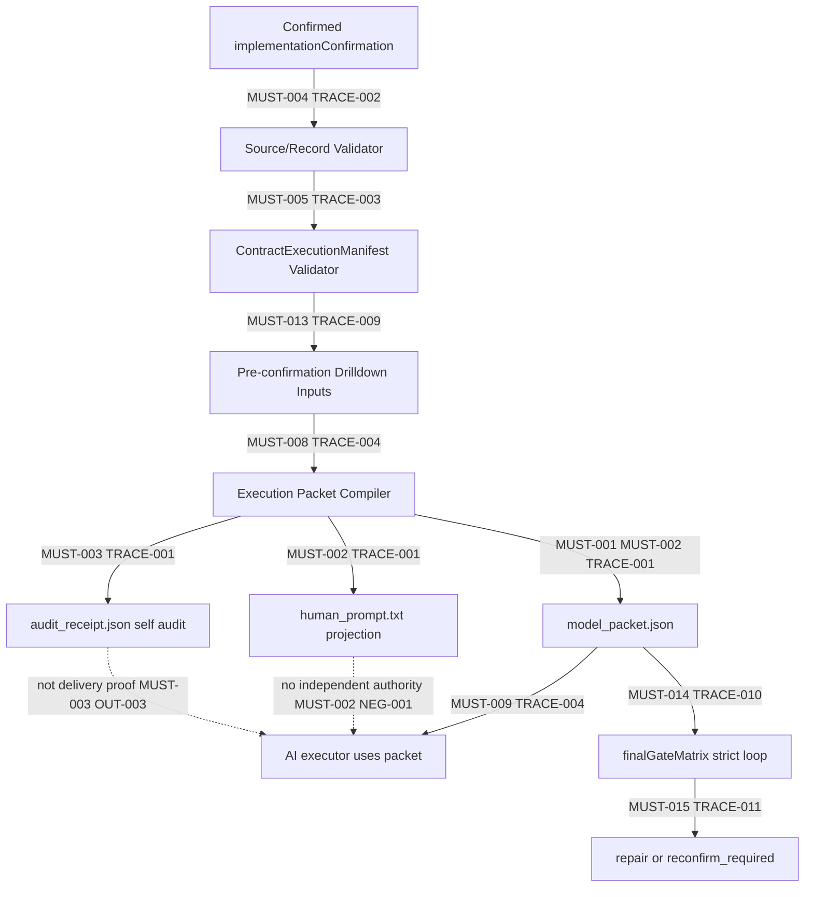
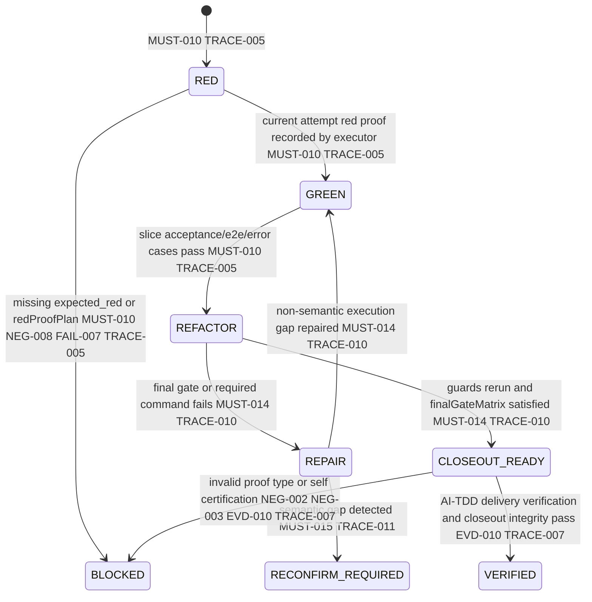
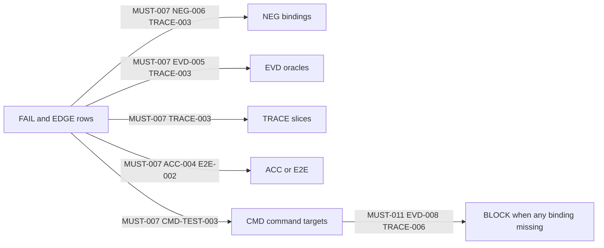

# Req Trace Matrix AI-TDD Execution Packet Compiler

Date: 2026-05-25
Status: Implementation Source Draft
Source request: Upgrade `req-trace-matrix-prompt-generator` from a prompt-only generator into a confirmed `implementationConfirmation` to AI-TDD Contract Execution Packet compiler.

## Scope Summary

This source document defines the confirmed-scope draft for upgrading `req-trace-matrix-prompt-generator` so AI execution receives a machine-readable execution packet, a human-readable prompt projection, and a generator audit receipt.

The target is not a looser natural-language prompt. The target is a productized compiler:

```text
confirmed implementationConfirmation
-> pre-confirmation drilldown authority
-> source/record validation
-> ContractExecutionManifest validation
-> execution packet compilation
-> model_packet.json + human_prompt.txt + audit_receipt.json
```

## Human-Readable Confirmation Views

### Execution Packet Metadata

确认范围是把 `req-trace-matrix-prompt-generator` 从单一提示词生成器升级为 AI-TDD Contract Execution Packet Compiler。生成器必须从已确认的 `implementationConfirmation` 和受控 requirement record 编译执行包，而不是让执行模型从 prose 自由推断。

主输出是 `model_packet.json`。`human_prompt.txt` 只是可读投影，`audit_receipt.json` 只是生成器自审收据。三者必须 hash-linked，并且必须指向同一份 source、record、trace order、manifest coverage 和 currentTargetMap。

### Source And Record Authority

`MUST-004` 定义了输入权威：只有 inline `implementationConfirmation`、`status=user_confirmed`、匹配的 requirement-record confirmationHistory、匹配的 source/implementationConfirmation hash、无阻断 open question、有效 trace refs 和 command refs 同时成立时，生成器才允许写出执行产物。

`EDGE-001` 到 `EDGE-003` 是这层的关键反例：draft source、hash mismatch、blocking open question 都必须阻断。阻断结果应出现在 `audit_receipt.json`，但该 receipt 本身不得成为 delivery proof。

### AI-TDD ContractExecutionManifest Projection

`MUST-005` 到 `MUST-007` 要求生成器把 AI-TDD manifest 作为统一标准，而不是自定义另一份 readiness/closeout 清单。以下 section 必须作为一等公民进入 `model_packet.json` 并投影到 `human_prompt.txt`：

- pre-confirmation semantic drilldown inputs
- atomic task lineage
- error cases
- command targets
- trace closure
- current target map
- canonical surfaces
- legacy denial
- closeout proof
- evidence trust
- final gate matrix
- execution loop protocol
- semantic gap escalation
- host execution hints

任何缺失 `failurePaths[]`、`edgeCases[]`、`acceptanceTests[]`、`e2eSuites[]`、`traceRows[].acceptanceRefs[]`、FAIL/EDGE 覆盖或 currentTargetMap 的情况，都必须 fail closed。

`MUST-013` 要求生成器只接受已经通过确认前原子性拆解闭环的已确认源。`semantic-kernel.json`、`must_decomposition_packet.json`、Critical Auditor 三轮 no-new-valid-gap、packet/source reconciliation 和 pre-render gate report 必须作为执行包输入可见，但它们仍然不是交付证据。

### Red-Green-Refactor State Machine

每个 trace slice 必须按 RED -> GREEN -> REFACTOR -> CLOSEOUT 执行。生成器阶段不需要真实 RED proof，但必须要求 `expectedPreImplementationState: expected_red` 和 `redProofPlan`。真实 RED/GREEN/REFACTOR proof 由执行阶段写入 runtime/control store。

如果 ACC/E2E 缺 `expected_red` 或 `redProofPlan`，`PRE_IMPLEMENTATION_RED_PROOF_PLAN_REQUIRED` 必须阻断生成。

`MUST-014` 要求 `model_packet.json` 输出 `executionLoopProtocol` 和 `finalGateMatrix`。执行提示词必须要求执行模型按 atomic task 和 trace slice 迭代开发、修复、重跑，直到 AI-TDD gate、required commands、delivery verification 和 closeout integrity 的 current-attempt 受控结果全部通过。Codex-capable host 可投影 `/goal` objective 来替代旧 `continue nonstop` 文本；非 Codex host 只能收到 branch-specific future-work 指令，且不得泄漏 `/goal`。

### False-Positive Proof Boundary

`NEG-002` 到 `NEG-005` 是防假阳性的硬边界：

- Completion Evidence Packet 只是证据索引。
- `audit_receipt.json` 只是生成器自审。
- `exitCode=0` 只是诊断信号。
- mock-only、self-certification、stale attempt、legacy proof、smoke-only proof 都不能 closeout。
- confirmed source `traceRows.status` 不能被执行器改写成 runtime PASS。

closeout 只能由 AI-TDD gate、delivery verification、closeout integrity 的 current-attempt 受控报告决定。

如果执行中发现的是非语义 execution gap，执行包可以要求修复并重跑当前 slice；如果发现需求语义边界、MUST 拆解、OUT 边界、acceptance oracle 或用户决策发生变化，`MUST-015` 要求停止执行并进入 `reconfirm_required`，不能静默继续。

### Current And Target State

现状：执行提示主要以自然语言 prompt 呈现，错误用例、RED 计划、canonical surfaces、legacy denial 和 closeout 证明规则容易成为文字建议，而不是机器可执行约束。

目标态：`model_packet.json` 将这些结构全部提升为字段和矩阵；`human_prompt.txt` 只从这些字段投影；`audit_receipt.json` 证明生成器输入输出一致，但不证明实现完成。

`currentTargetMap` 是确认页一级硬门禁。确认页必须显示当前 prompt-only 模式与目标 AI-TDD compiler 模式的差异，特别是输出权威、manifest completeness、atomic task lineage、TDD protocol、error cases、execution loop protocol、host execution hints 和 closeout authority。

## Mermaid Views







## Evidence Overview

The evidence model is intentionally strict:

- `EVD-001` to `EVD-003` prove the three synchronized artifacts and receipt content.
- `EVD-004` proves source/record authority and confirmation hash validation.
- `EVD-005` proves ContractExecutionManifest completeness and error-case closure.
- `EVD-006` proves packet trace slice shape and runtime write policy.
- `EVD-007` proves RED/GREEN/REFACTOR/CLOSEOUT state-machine fields and red proof plan blocking.
- `EVD-008` proves stable BLOCK code behavior.
- `EVD-009` proves end-to-end synchronized generation without scope reduction.
- `EVD-010` proves invalid proof types cannot be closeout authority.
- `EVD-011` proves synchronized pre-confirmation drilldown and atomic task lineage are packet inputs.
- `EVD-012` proves execution loop protocol, final gate matrix, and host-aware `/goal` projection preserve strict stop authority.
- `EVD-013` proves semantic gaps stop execution and require reconfirmation instead of silent repair.

## E2E Overview

`E2E-001` is the valid confirmed-source compiler path: source and record pass, then packet, prompt, and receipt are produced with synchronized hashes and required sections.

`E2E-002` is the incomplete manifest and error-case path: missing AI-TDD applicability, currentTargetMap, error-case closure, acceptance binding, or red proof plan blocks generation.

`E2E-003` is the strict autonomous iteration path: a valid packet projects atomic task lineage, `/goal` only for Codex-capable hosts, final gate retries, and semantic-gap escalation, while blocking partial-success stop claims.

Skill and agent prompt routing is explicitly deferred under `OUT-004`; there is no current-scope E2E path requiring bugfix, standalone tasks, story, or non-Codex agent prompts to call this compiler.

## Definition of Done

This source document is ready for confirmation render only when:

- `implementationConfirmation` remains `draft` until explicit user confirmation.
- Every MUST and NEG has EVD, TRACE, ACC/E2E, CMD, and view coverage.
- Every FAIL and EDGE has NEG/EVD/TRACE/ACC or E2E/CMD coverage.
- `currentTargetMap` uses `schemaVersion=current-target-map/v1` and `displayProfile=closed_loop_current_target_map`.
- `targetModificationPaths[]` explicitly lists affected compiler scripts, generated outputs, tests, and deferred routing boundaries.
- AI-TDD manifest projection covers pre-confirmation drilldown inputs, atomic task lineage, error cases, command targets, trace closure, currentTargetMap, canonical surfaces, legacy denial, final gate matrix, execution loop protocol, semantic gap escalation, closeout proof, and evidence trust.
- `finalGateMatrix` requires AI-TDD gate, required commands, delivery verification, and closeout integrity current-attempt PASS before any completion claim.
- `hostExecutionHints` projects `/goal` only when the target execution host supports Codex `/goal`; otherwise it emits branch-specific continuation text without changing skill routing surfaces.
- The pre-render global consistency gate passes.
- Encoding integrity reports zero findings.

Implementation is not done by this source document. Confirmation only authorizes scope; delivery remains blocked until later implementation, AI-TDD delivery verification, and closeout integrity all pass with current-attempt evidence.

## Reverse Audit Report

### implementationConfirmation Findings

The inline `implementationConfirmation` block remains the authoritative scope surface. It now includes pre-confirmation drilldown metadata, atomic task lineage, strict final gate iteration semantics, host execution hints, and semantic gap escalation.

### HTML Confirmation Findings

The HTML confirmation renderer must show current/target state, packet authority, pre-confirmation semantic drilldown, atomic task lineage, final gate loop policy, host-aware `/goal` projection, semantic gap policy, target modifications, and delivery readiness. Confirmation HTML remains read-only and cannot mark implementation complete.

### Contract Confirmability

This draft is intended to be confirmable after HTML render because it contains a complete inline `implementationConfirmation`, mandatory applicability decisions, current/target map, failure paths, edge cases, trace rows, acceptance/E2E rows, artifact plan, command matrix, target modification paths, and AI-TDD manifest projection.

### Diagram And Step Findings

Mermaid diagrams and sequence/flow views reference declared IDs only. The updated diagrams show the source/record validator, ContractExecutionManifest validator, pre-confirmation drilldown inputs, execution packet compiler, finalGateMatrix loop, and reconfirm_required branch.

### Artifact Automation Plan Findings

Artifact automation separates execution inputs (`model_packet.json`, `human_prompt.txt`) from generator self-audit (`audit_receipt.json`) and from downstream delivery proof. Generated packet, prompt, receipt, `/goal`, continuation text, stdout, command exit code, HTTP 200, page render, and mock calls are not closeout evidence.

### E2E Anti-Smoke Findings

The source explicitly rejects smoke-only evidence such as exit code, stdout, HTTP 200, page render, mock calls, prompt completion, `/goal` completion, audit receipt, and completion packet self-certification. E2E rows must use oracle-bound acceptance and current-attempt controlled reports, not smoke-only proof.

Smoke-only proof such as exit code, stdout, HTTP 200, page render, and mock calls cannot satisfy delivery verification or closeout.

### Open Findings

Implementation readiness is intentionally not claimed while `implementationConfirmation.status=draft`, controlled confirmation ingest has not run, and the pre-confirmation semantic drilldown gate is blocked by missing semantic kernel, missing synchronized must decomposition packet, missing Critical Auditor receipts, and failed packet/source reconciliation.

### Implementation Readiness Boundary

The draft does not claim implementation readiness. `status` is `draft`, confirmation render has not been produced in this checkpoint authoring task, and controlled confirmation ingest has not run.

### Delivery Verification Boundary

The draft does not claim delivery verification. `model_packet.json`, `human_prompt.txt`, `audit_receipt.json`, command exit codes, stdout, and completion packet are explicitly non-closeout proof unless validated by downstream AI-TDD delivery verification and closeout integrity controlled reports.

### Anti-Smoke And Anti-Happy-Path Checks

The source blocks happy-path-only behavior through `NEG-006`, `FAIL-005`, `EDGE-006`, `EDGE-008`, `ACC-004`, `ACC-005`, `ACC-008`, and `E2E-002`. Smoke command `CMD-SMOKE-001` is explicitly `smoke_only_not_closeout`.

### Report Shape Checks

After implementation, reverse audit and render report must show:

- `confirmability=confirmable` only for scope confirmation.
- `deliveryReadiness.ready=false` until current-attempt controlled execution evidence exists.
- AI-TDD manifest coverage sections are present and non-empty.
- current/target coverage is non-zero and displayed.
- target modification paths are visible.
- invalid proof taxonomy is visible in both packet and prompt projections.
- pre-confirmation drilldown lineage, atomic task lineage, final gate matrix, execution loop protocol, semantic-gap escalation, and host execution hints are visible in packet and prompt projections.

### Checkpoint Repair Closure

The pre-render gate repair added missing currentTargetMap process coverage and fail-closed/idempotency/recovery semantics for control-affecting artifacts. This cp-08 closure note confirms the human-readable reverse-audit layer reflects those repaired machine-readable sections and does not introduce new executable scope.

## Current Problem

The current generator emits a single natural-language execution prompt. It validates the confirmed inline `implementationConfirmation`, requirement-record confirmation history, semantic hashes, trace references, and command references, but the output still lets an execution model infer too much from prose and prompt text.

That creates three current-scope product risks:

1. Error cases can be omitted while happy-path traces still look complete.
2. `TRACE-*` rows can be executed without a structured RED/GREEN/REFACTOR state machine.
3. A completion packet, command exit code, stale evidence, partial gate pass, or mock-only proof can be mistaken for closeout evidence by downstream execution.
4. Old `continue nonstop` prompt text can request long execution without defining strict current-attempt stop authority, semantic-gap escalation, or host-specific `/goal` behavior.

Deferred risk: bugfix, standalone task, story, and other agent prompt routing can still use old templates. That integration is intentionally out of current scope under `OUT-004`.

## Target State

`req-trace-matrix-prompt-generator` becomes an AI-TDD Contract Execution Packet compiler. The compiler consumes only a confirmed implementation source document plus its controlled requirement record, then emits three synchronized outputs:

- `model_packet.json`: the machine-readable execution authority for AI execution.
- `human_prompt.txt`: the readable prompt projection over `model_packet.json`.
- `audit_receipt.json`: the generator self-audit receipt proving that source, record, hashes, trace coverage, acceptance coverage, AI-TDD manifest coverage, and current/target mapping passed.

Execution models must treat `model_packet.json` as the primary execution authority. `human_prompt.txt` helps the model and user read the plan, but it must not introduce, remove, shrink, or reinterpret anything absent from the packet.

When the execution host supports Codex `/goal`, `human_prompt.txt` may include a `/goal` objective projected from `model_packet.json.hostExecutionHints.codexCapable.goalObjectiveTemplate`. When the host does not support `/goal`, the prompt projection must emit branch-specific continuation instructions without using `/goal`. In both cases, the generated prompt must instruct the executor to keep iterating repairs and reruns until `finalGateMatrix` allows stop, or to halt for reconfirmation on semantic gaps.

## Non-Goals

- Do not make the generator execute implementation commands.
- Do not let the generator write runtime PASS, close trace rows, or write `record_closed`.
- Do not make `human_prompt.txt` the primary authority when `model_packet.json` exists.
- Do not make `audit_receipt.json` a delivery proof; it proves generator input/output validity only.
- Do not allow exit-code-only, mock-only, stale attempt, self-certification, legacy proof, smoke-only proof, or completion-packet self proof to satisfy closeout.
- Do not keep independent readiness or closeout completeness checklists that diverge from AI-TDD `ContractExecutionManifest`.
- Do not require real RED execution proof at generation time; the compiler only requires an `expected_red` declaration and a `redProofPlan`.
- Do not change bugfix, standalone tasks, story, or other agent prompt routing in this requirement; `/goal` is only an in-scope projection hint inside artifacts produced by this compiler for a confirmed source.
- Do not let `/goal`, branch-specific continuation text, `executionLoopProtocol`, or `finalGateMatrix` become delivery proof; they are execution instructions and stop conditions only.

## Frozen Decisions

- The implementation source document remains the source authority through inline `implementationConfirmation`.
- The generator must require `status=user_confirmed` and a matching requirement-record confirmation history before producing execution artifacts.
- `model_packet.json` is mandatory and is the execution authority.
- `human_prompt.txt` is mandatory and is a projection over `model_packet.json`.
- `audit_receipt.json` is mandatory and records generator self-audit, not delivery verification.
- AI-TDD `ContractExecutionManifest` is mandatory whenever `applicability.aiTddContractGate.applies=true`.
- `currentTargetMap` is mandatory and must be projected into both the model packet and human prompt.
- Every `TRACE-*` slice must carry ACC/E2E/error-case/current-target/canonical/legacy/evidence-trust bindings.
- RED/GREEN/REFACTOR/CLOSEOUT is a structured state machine, not prose guidance.
- Pre-confirmation drilldown artifacts and atomic task lineage are mandatory packet inputs before prompt projection.
- `finalGateMatrix` and `executionLoopProtocol` define autonomous repair iteration and stop authority.
- Codex `/goal` is allowed only as a host-aware projection when `/goal` is available; non-Codex branch prompt design remains deferred under `OUT-004`.
- Bugfix, standalone tasks, story, and other agent prompt routing changes are deferred under `OUT-004`; this source only confirms the compiler core and directly related generator/test surfaces.

## Checkpoint Authoring Record

Scale assessment selected `checkpoint_required` with `authoringMode=kernel_then_checkpoint`. This document is authored through the semantic checkpoint sequence below before HTML render:

1. `cp-01-header-scope-decisions`
2. `cp-02-confirmation-core-applicability`
3. `cp-03-must-neg-out-evidence`
4. `cp-04-failure-edge-trace`
5. `cp-05-views`
6. `cp-06-artifacts-commands-closeout`
7. `cp-07-conditional-modules`
8. `cp-08-human-readable-views-dod-reverse-audit`

## Applicability Decisions

This requirement is a standalone task packet because it upgrades an existing local skill and generator script. It does not change a consuming product feature, database schema, external runtime service, dashboard scoring model, or SFT dataset.

`scriptsAndHooks.applies=true` because `_bmad/skills/req-trace-matrix-prompt-generator/scripts/generate_prompt.js`, its Python compatibility launcher, AI-TDD gate integration, and related acceptance tests may change. Bugfix, standalone tasks, story, and other agent prompt-routing surfaces are deferred under `OUT-004`.

`aiTddContractGate.applies=true` because the compiler must consume the latest AI-TDD `ContractExecutionManifest` standard and must not define separate readiness or closeout checklists.

`currentTargetMap.applies=true` because the user explicitly treats current/target comparison as a primary confirmation and anti-false-positive surface. The compiler must make the target execution surface visible in `model_packet.json`, `human_prompt.txt`, and `audit_receipt.json`.

`governanceEvents.applies=false` for this source document because the implementation does not add new controlled event types or writer permissions. It only defines generator outputs and prompt/compiler behavior. Runtime closeout remains delegated to existing AI-TDD gate, delivery verification, and closeout integrity controlled reports.

`runtimeRecovery.applies=false` because no resume, rerun, hook, active requirement resolver, or recovery context behavior is changed by this compiler upgrade.

## implementationConfirmation Draft

```yaml
implementationConfirmation:
  contractSchemaVersion: 1
  status: user_confirmed
  recordId: REQ-REQ-TRACE-AI-TDD-PACKET-COMPILER
  requirementSetId: REQ-REQ-TRACE-AI-TDD-PACKET-COMPILER
  entryFlow: standalone_tasks
  entryFlowClass: task_packet_entry
  workflowAdapter: direct
  contractAuthoringRequired: true
  confirmationLanguage: zh-CN
  confirmationProfile: implementation_confirmation
  requiredViewPacks:
    - currentTargetMap
  optionalViewPacks: []
  confirmedAt: '2026-05-26T02:11:09.925Z'
  confirmedBy: user
  sourceDocumentHash: sha256:5ebb9dfd3c5f7ccb7d09654bba53bb0dc1d61752cbad34b3ec364b0236414baa
  implementationConfirmationHash: sha256:e8890ee3dca89838461fd4b18293e019a5780ef64b52e2a22ce81ffa28407502
  confirmationRender:
    htmlPath: >-
      D:/Dev/BMAD-Speckit-SDD-Flow/_bmad-output/runtime/requirement-records/REQ-REQ-TRACE-AI-TDD-PACKET-COMPILER/confirmation/confirmation.html
    summaryPath: >-
      D:/Dev/BMAD-Speckit-SDD-Flow/_bmad-output/runtime/requirement-records/REQ-REQ-TRACE-AI-TDD-PACKET-COMPILER/confirmation/confirmation-summary.json
    reportPath: >-
      D:/Dev/BMAD-Speckit-SDD-Flow/_bmad-output/runtime/requirement-records/REQ-REQ-TRACE-AI-TDD-PACKET-COMPILER/confirmation/confirmation-render-report.json
    htmlHash: sha256:4cbbdac9870e51b55d2e8c0f52515464e256fb1b7d7a6e45bea078cd36dd56d0
    confirmationPhrase: |-
      确认以上范围进入下一阶段
      sourceDocumentHash=sha256:5ebb9dfd3c5f7ccb7d09654bba53bb0dc1d61752cbad34b3ec364b0236414baa
      implementationConfirmationHash=sha256:e8890ee3dca89838461fd4b18293e019a5780ef64b52e2a22ce81ffa28407502
      confirmationPageHash=sha256:4cbbdac9870e51b55d2e8c0f52515464e256fb1b7d7a6e45bea078cd36dd56d0
  preConfirmationDrilldown:
    semanticKernelRef:
      path: _bmad-output/runtime/requirement-records/REQ-REQ-TRACE-AI-TDD-PACKET-COMPILER/authoring/semantic-kernel.json
      hash: null
    mustDecompositionPacketRef:
      path: >-
        _bmad-output/runtime/requirement-records/REQ-REQ-TRACE-AI-TDD-PACKET-COMPILER/authoring/must_decomposition_packet.json
      hash: null
      status: synchronized
    criticalAuditor:
      minimumRounds: 3
      consecutiveNoNewGapRounds: 3
      latestReceiptHash: null
      convergenceVerdict: bounded_no_new_gap
    packetSourceReconciliation:
      reportPath: >-
        _bmad-output/runtime/requirement-records/REQ-REQ-TRACE-AI-TDD-PACKET-COMPILER/authoring/must_packet_source_reconciliation_report.json
      verdict: pass
    preRenderGateReportPath: >-
      _bmad-output/runtime/requirement-records/REQ-REQ-TRACE-AI-TDD-PACKET-COMPILER/authoring/pre-render-must-decomposition-gate-report.json
  applicability:
    governanceEvents:
      applies: false
      reasonCode: no_new_control_event_type_required_for_prompt_compiler
    runtimeRecovery:
      applies: false
      reasonCode: no_resume_rerun_closeout_hook_ingest_or_trace_checkpoint_runtime_change
      requiresFunctionalResumeFailureCaseRegistry: false
      activeRequirementResolutionRequired: false
      retiredContextSurfaceForbidden: true
    scoringDashboardSft:
      applies: false
      reasonCode: no_scoring_dashboard_sft_dataset_or_read_model_changes
    currentTargetMap:
      applies: true
      reasonCode: requirements_contract_authoring_requires_visible_current_target_map
    scriptsAndHooks:
      applies: true
      reasonCode: req_trace_generator_scripts_and_tests_change
    aiTddContractGate:
      applies: true
      reasonCode: compiler_must_emit_ai_tdd_contract_execution_packet
  must:
    - id: MUST-001
      text: >-
        The generator must compile three synchronized outputs for every confirmed source: model_packet.json,
        human_prompt.txt, and audit_receipt.json.
      textZh: 生成器必须为每个已确认源文档编译三份同步产物：model_packet.json、human_prompt.txt 和 audit_receipt.json。
      evidenceRefs:
        - EVD-001
        - EVD-009
      coveredByTraceRows:
        - TRACE-001
      acceptanceRefs:
        - ACC-001
        - E2E-001
      coveredBySequenceViews:
        - SEQ-001
      riskLevel: critical
    - id: MUST-002
      text: >-
        model_packet.json must be the primary machine-readable execution authority, and human_prompt.txt must be only a
        readable projection over the packet.
      textZh: model_packet.json 必须是机器可读主执行权威，human_prompt.txt 只能是该执行包的可读投影。
      evidenceRefs:
        - EVD-001
        - EVD-002
        - EVD-009
      coveredByTraceRows:
        - TRACE-001
      acceptanceRefs:
        - ACC-001
        - E2E-001
      coveredBySequenceViews:
        - SEQ-001
      riskLevel: critical
    - id: MUST-003
      text: >-
        audit_receipt.json must record the generator self-audit for source, requirement record, hashes, trace
        references, acceptance coverage, AI-TDD manifest coverage, currentTargetMap coverage, and emitted artifact
        hashes.
      textZh: >-
        audit_receipt.json 必须记录生成器自审：source、requirement record、hash、trace 引用、验收覆盖、AI-TDD manifest 覆盖、currentTargetMap
        覆盖和输出工件 hash。
      evidenceRefs:
        - EVD-003
        - EVD-009
      coveredByTraceRows:
        - TRACE-001
      acceptanceRefs:
        - ACC-002
        - E2E-001
      coveredBySequenceViews:
        - SEQ-001
      riskLevel: critical
    - id: MUST-004
      text: >-
        Source/Record Validator must require inline implementationConfirmation, status=user_confirmed,
        requirement-record confirmationHistory, matching semantic source and implementationConfirmation hashes, no
        blocking open questions, valid trace refs, and valid command refs.
      textZh: >-
        Source/Record Validator 必须要求 inline implementationConfirmation、status=user_confirmed、requirement-record
        confirmationHistory、语义 source 和 implementationConfirmation hash 匹配、无阻断 open questions、trace refs 有效、command refs
        有效。
      evidenceRefs:
        - EVD-004
        - EVD-009
      coveredByTraceRows:
        - TRACE-002
      acceptanceRefs:
        - ACC-003
        - E2E-001
      coveredBySequenceViews:
        - SEQ-002
      riskLevel: critical
    - id: MUST-005
      text: >-
        ContractExecutionManifest Validator must fail closed unless applicability.aiTddContractGate.applies=true,
        applicability.currentTargetMap.applies=true, failurePaths[], edgeCases[], acceptanceTests[], and e2eSuites[] are
        non-empty and closed over the confirmed IDs.
      textZh: >-
        ContractExecutionManifest Validator 必须在 aiTddContractGate/currentTargetMap
        适用声明、failurePaths、edgeCases、acceptanceTests、e2eSuites 非空且与确认 ID 闭环时才放行。
      evidenceRefs:
        - EVD-005
        - EVD-009
      coveredByTraceRows:
        - TRACE-003
      acceptanceRefs:
        - ACC-004
        - E2E-001
      coveredBySequenceViews:
        - SEQ-003
      riskLevel: critical
    - id: MUST-006
      text: Every MUST-* and NEG-* must have TRACE, EVD, ACC or E2E, and CMD coverage before packet generation succeeds.
      textZh: 每个 MUST-* 和 NEG-* 在执行包生成成功前必须具备 TRACE、EVD、ACC 或 E2E、CMD 覆盖。
      evidenceRefs:
        - EVD-005
        - EVD-009
      coveredByTraceRows:
        - TRACE-003
      acceptanceRefs:
        - ACC-004
      coveredBySequenceViews:
        - SEQ-003
      riskLevel: critical
    - id: MUST-007
      text: >-
        Every FAIL-* and EDGE-* must have NEG, EVD, TRACE, ACC or E2E, and CMD coverage before packet generation
        succeeds.
      textZh: 每个 FAIL-* 和 EDGE-* 在执行包生成成功前必须具备 NEG、EVD、TRACE、ACC 或 E2E、CMD 覆盖。
      evidenceRefs:
        - EVD-005
        - EVD-009
      coveredByTraceRows:
        - TRACE-003
      acceptanceRefs:
        - ACC-004
        - ACC-005
      coveredBySequenceViews:
        - SEQ-004
      riskLevel: critical
    - id: MUST-008
      text: >-
        Execution Packet Compiler must emit a structured model_packet.json containing execution metadata, source
        authority, immutable contract snapshot, AI-TDD manifest projection, TDD state machine, trace slice registry,
        error case matrix, acceptance/e2e matrix, currentTargetMap surface, canonical surfaces, legacy denial, evidence
        trust, runtime write policy, final gate matrix, blocking decision table, and completion evidence packet schema.
      textZh: >-
        Execution Packet Compiler 必须输出结构化 model_packet.json，包含执行元数据、source authority、不可变契约快照、AI-TDD manifest 投影、TDD
        状态机、trace slice 注册表、错误用例矩阵、ACC/E2E 矩阵、currentTargetMap、canonical surfaces、legacy denial、evidence trust、runtime
        write policy、final gate matrix、blocking decision table 和 completion evidence packet schema。
      evidenceRefs:
        - EVD-001
        - EVD-006
        - EVD-009
      coveredByTraceRows:
        - TRACE-004
      acceptanceRefs:
        - ACC-001
        - ACC-006
        - E2E-001
      coveredBySequenceViews:
        - SEQ-005
      riskLevel: critical
    - id: MUST-009
      text: >-
        Every trace slice in model_packet.json must include traceId, requirementRefs, negativeRequirementRefs,
        failurePathRefs, edgeCaseRefs, acceptanceRefs, e2eRefs, delivery command refs, artifactRefs,
        targetModificationPaths, currentTargetMapRefs, canonicalSurfaceRefs, legacyDenialRefs, expectedRedProofs,
        greenExitCriteria, refactorGuards, allowedRuntimeWrites, and forbiddenProofTypes.
      textZh: >-
        model_packet.json 中每个 trace slice 必须包含
        traceId、requirementRefs、negativeRequirementRefs、failurePathRefs、edgeCaseRefs、acceptanceRefs、e2eRefs、delivery
        command
        refs、artifactRefs、targetModificationPaths、currentTargetMapRefs、canonicalSurfaceRefs、legacyDenialRefs、expectedRedProofs、greenExitCriteria、refactorGuards、allowedRuntimeWrites
        和 forbiddenProofTypes。
      evidenceRefs:
        - EVD-006
        - EVD-009
      coveredByTraceRows:
        - TRACE-004
      acceptanceRefs:
        - ACC-006
        - E2E-001
      coveredBySequenceViews:
        - SEQ-005
      riskLevel: critical
    - id: MUST-010
      text: >-
        The generated RED/GREEN/REFACTOR/CLOSEOUT state machine must require expected_red and redProofPlan at generation
        time, then require real current-attempt RED/GREEN/REFACTOR proof during execution.
      textZh: >-
        生成的 RED/GREEN/REFACTOR/CLOSEOUT 状态机必须在生成阶段要求 expected_red 和 redProofPlan，并在执行阶段要求真实 current-attempt
        RED/GREEN/REFACTOR 证据。
      evidenceRefs:
        - EVD-007
        - EVD-009
      coveredByTraceRows:
        - TRACE-005
      acceptanceRefs:
        - ACC-007
        - E2E-001
      coveredBySequenceViews:
        - SEQ-006
      riskLevel: critical
    - id: MUST-011
      text: >-
        The generator must emit explicit BLOCK codes for missing applicability declarations, missing AI-TDD gate
        applicability, invalid trace acceptance binding, incomplete ContractExecutionManifest, missing target
        modification trace binding, missing closeout proof policy, missing red proof plan, invalid proof policy, and
        control store not ready for execution.
      textZh: >-
        生成器必须为缺失 applicability、缺失 AI-TDD gate 适用声明、trace acceptance 绑定无效、ContractExecutionManifest 不完整、目标修改路径 trace
        绑定缺失、closeout proof policy 缺失、red proof plan 缺失、proof policy 无效、control store 未准备好执行输出明确 BLOCK。
      evidenceRefs:
        - EVD-008
        - EVD-009
      coveredByTraceRows:
        - TRACE-006
      acceptanceRefs:
        - ACC-008
      coveredBySequenceViews:
        - SEQ-007
      riskLevel: high
    - id: MUST-013
      text: >-
        The compiler must consume pre-confirmation drilldown inputs as first-class packet inputs: semantic kernel ref,
        synchronized must_decomposition_packet ref, Critical Auditor convergence, packet/source reconciliation,
        pre-render gate report, atomicImplementationTaskList, mustToAtomicTaskMap, and atomicTaskToTraceMap.
      textZh: >-
        编译器必须把确认前 drilldown 输入作为执行包一等输入：semantic kernel 引用、已同步 must_decomposition_packet 引用、Critical Auditor
        收敛、packet/source reconciliation、pre-render gate report、atomicImplementationTaskList、mustToAtomicTaskMap 和
        atomicTaskToTraceMap。
      evidenceRefs:
        - EVD-011
      coveredByTraceRows:
        - TRACE-009
      acceptanceRefs:
        - ACC-010
        - E2E-003
      coveredBySequenceViews:
        - SEQ-008
      riskLevel: critical
    - id: MUST-014
      text: >-
        The compiler must emit executionLoopProtocol, finalGateMatrix, and hostExecutionHints so generated execution
        instructions keep repairing and rerunning by atomic task and trace slice until all strict final acceptance gates
        pass with current-attempt evidence; when Codex /goal is available the prompt projection must use /goal instead
        of legacy continue nonstop, and when it is unavailable the prompt must use branch-specific continuation text
        without leaking /goal. The emitted state-change instructions must fail closed on missing gate evidence, retry
        only idempotent command reruns, recover by preserving current-attempt provenance and rerunning the same trace
        slice, assert all finalGateMatrix gates before stop, and never roll back or rewrite confirmed source semantics.
      textZh: >-
        编译器必须输出 executionLoopProtocol、finalGateMatrix 和 hostExecutionHints，使生成的执行指令按 atomic task 与 trace slice
        持续修复和重跑，直到所有严格最终验收门禁以 current-attempt 证据通过；Codex /goal 可用时 prompt 投影必须使用 /goal 替代旧 continue
        nonstop，不可用时必须使用按分支的延续文本且不得泄漏 /goal。输出的状态变更指令必须在缺少 gate 证据时 fail closed，只重试幂等命令重跑，通过保留 current-attempt
        provenance 并重跑同一 trace slice 恢复，停机前断言所有 finalGateMatrix 门禁，并且不得回滚或改写已确认源语义。
      evidenceRefs:
        - EVD-012
      coveredByTraceRows:
        - TRACE-010
      acceptanceRefs:
        - ACC-011
        - E2E-003
      coveredBySequenceViews:
        - SEQ-009
      riskLevel: critical
    - id: MUST-015
      text: >-
        The generated packet and prompt must distinguish non-semantic execution gaps from semantic gaps: non-semantic
        gaps may repair and rerun the active atomic task, while semantic boundary, OUT boundary, acceptance oracle, MUST
        decomposition, or unresolved user-decision gaps must halt execution and require reconfirm_required before
        continuing.
      textZh: >-
        生成的执行包和 prompt 必须区分非语义执行缺口与语义缺口：非语义缺口可以修复并重跑当前 atomic task；语义边界、OUT 边界、验收 oracle、MUST 拆解或未解决用户决策缺口必须停止执行，并要求
        reconfirm_required 后才能继续。
      evidenceRefs:
        - EVD-013
      coveredByTraceRows:
        - TRACE-011
      acceptanceRefs:
        - ACC-012
        - E2E-003
      coveredBySequenceViews:
        - SEQ-010
      riskLevel: critical
  notDone:
    - id: NEG-001
      text: A single natural-language prompt must not be the only generated artifact for confirmed execution.
      textZh: 单一自然语言 prompt 不能作为已确认执行的唯一生成产物。
      evidenceRefs:
        - EVD-001
        - EVD-002
      whyItBlocksCompletion: Prompt-only output leaves execution authority ambiguous and allows model inference drift.
      whyItBlocksCompletionZh: 仅输出 prompt 会让执行权威不清晰，并允许模型推断漂移。
      negativeAssertionRequired: true
      coveredByFailurePath:
        - FAIL-001
      acceptanceRefs:
        - ACC-001
    - id: NEG-002
      text: >-
        Completion Evidence Packet, audit_receipt.json, command exit code, stdout, report render, or
        dashboard/read-model state must not be accepted as PASS or closeout authority.
      textZh: Completion Evidence Packet、audit_receipt.json、命令退出码、stdout、报告渲染、dashboard/read-model 状态不得作为 PASS 或 closeout 权威。
      evidenceRefs:
        - EVD-010
      whyItBlocksCompletion: These are evidence indexes or diagnostics, not delivery verification.
      whyItBlocksCompletionZh: 这些只是证据索引或诊断信号，不是交付核验。
      negativeAssertionRequired: true
      coveredByFailurePath:
        - FAIL-002
      acceptanceRefs:
        - ACC-009
    - id: NEG-003
      text: >-
        Mock-only, self-certification, stale attempt evidence, legacy proof, smoke-only proof, and exitCode-only proof
        must not close any TRACE, NEG, FAIL, EDGE, ACC, E2E, or closeout state.
      textZh: >-
        mock-only、self-certification、stale attempt evidence、legacy proof、smoke-only proof 和 exitCode-only proof 不得关闭任何
        TRACE、NEG、FAIL、EDGE、ACC、E2E 或 closeout 状态。
      evidenceRefs:
        - EVD-010
      whyItBlocksCompletion: Invalid proof types caused previous false-positive delivery risks.
      whyItBlocksCompletionZh: 无效证明类型会导致假阳性交付风险。
      negativeAssertionRequired: true
      coveredByFailurePath:
        - FAIL-003
      acceptanceRefs:
        - ACC-009
    - id: NEG-004
      text: taskRefs completion must not equal requirement PASS.
      textZh: taskRefs 完成不得等同于 requirement PASS。
      evidenceRefs:
        - EVD-006
        - EVD-010
      whyItBlocksCompletion: Task completion can happen without oracle-bound requirement evidence.
      whyItBlocksCompletionZh: 任务完成可能没有绑定 oracle 的需求证据。
      negativeAssertionRequired: true
      coveredByFailurePath:
        - FAIL-002
      acceptanceRefs:
        - ACC-006
        - ACC-009
    - id: NEG-005
      text: >-
        The executor must not rewrite confirmed source traceRows.status or source evidence fields to represent runtime
        PASS or MISSING_EVIDENCE.
      textZh: 执行器不得改写已确认源文档 traceRows.status 或源 evidence 字段来表示 runtime PASS 或 MISSING_EVIDENCE。
      evidenceRefs:
        - EVD-006
        - EVD-010
      whyItBlocksCompletion: Confirmed trace rows are contract projection only.
      whyItBlocksCompletionZh: 已确认 trace rows 只是契约投影。
      negativeAssertionRequired: true
      coveredByFailurePath:
        - FAIL-004
      acceptanceRefs:
        - ACC-009
    - id: NEG-006
      text: Any uncovered NEG, FAIL, or EDGE row must block packet closeout instructions.
      textZh: 任何未覆盖的 NEG、FAIL 或 EDGE 行必须阻断执行包 closeout 指令。
      evidenceRefs:
        - EVD-005
        - EVD-008
      whyItBlocksCompletion: Error-case gaps are the primary happy-path-only false-positive source.
      whyItBlocksCompletionZh: 错误用例缺口是假阳性 happy-path-only 的主要来源。
      negativeAssertionRequired: true
      coveredByFailurePath:
        - FAIL-005
      acceptanceRefs:
        - ACC-004
        - ACC-005
        - ACC-008
    - id: NEG-007
      text: A trace row without acceptanceRefs[] must not be compiled into an executable trace slice.
      textZh: 缺少 acceptanceRefs[] 的 trace row 不得被编译成可执行 trace slice。
      evidenceRefs:
        - EVD-005
        - EVD-008
      whyItBlocksCompletion: Without acceptance binding, command execution can look complete without an oracle.
      whyItBlocksCompletionZh: 没有验收绑定时，命令执行可能看起来完成但没有 oracle。
      negativeAssertionRequired: true
      coveredByFailurePath:
        - FAIL-006
      acceptanceRefs:
        - ACC-004
        - ACC-008
    - id: NEG-008
      text: >-
        An ACC-* or E2E-* row without expectedPreImplementationState=expected_red or redProofPlan must not be accepted
        for implementation execution.
      textZh: 缺少 expectedPreImplementationState=expected_red 或 redProofPlan 的 ACC-* 或 E2E-* 行不得被接受用于实施执行。
      evidenceRefs:
        - EVD-007
        - EVD-008
      whyItBlocksCompletion: The generator must not ask the executor to fake red proof after implementation.
      whyItBlocksCompletionZh: 生成器不得要求执行器在实现后伪造红灯证明。
      negativeAssertionRequired: true
      coveredByFailurePath:
        - FAIL-007
      acceptanceRefs:
        - ACC-007
        - ACC-008
    - id: NEG-009
      text: >-
        A trace slice, command target, evidence row, acceptance row, currentTargetMap row, or AI-TDD manifest projection
        without atomic task lineage must not be compiled into executable packet authority.
      textZh: >-
        缺少 atomic task lineage 的 trace slice、command target、evidence row、acceptance row、currentTargetMap row 或 AI-TDD
        manifest projection 不得被编译成可执行执行包权威。
      evidenceRefs:
        - EVD-011
      whyItBlocksCompletion: Without atomic lineage, the executor can skip pre-confirmation decomposition and run prose-derived work.
      whyItBlocksCompletionZh: 没有 atomic lineage 时，执行模型可能跳过确认前拆解并执行 prose 派生工作。
      negativeAssertionRequired: true
      coveredByFailurePath:
        - FAIL-008
      acceptanceRefs:
        - ACC-010
    - id: NEG-010
      text: >-
        Slice green, partial required-command pass, exit 0, prompt completion text, or /goal completion must not stop
        execution before finalGateMatrix and current-attempt controlled delivery/closeout reports pass.
      textZh: >-
        slice green、部分 required-command 通过、exit 0、prompt 完成文本或 /goal 完成不得在 finalGateMatrix 与 current-attempt 受控
        delivery/closeout 报告通过前停止执行。
      evidenceRefs:
        - EVD-012
      whyItBlocksCompletion: Autonomous execution must iterate repair until strict final acceptance, not stop at partial green.
      whyItBlocksCompletionZh: 自主执行必须持续迭代修复直到严格最终验收，而不是停在局部 green。
      negativeAssertionRequired: true
      coveredByFailurePath:
        - FAIL-009
      acceptanceRefs:
        - ACC-011
    - id: NEG-011
      text: >-
        A semantic gap discovered during execution must not be silently converted into implementation repair,
        branch-specific continuation text, /goal continuation, or OUT-* reinterpretation without reconfirmation.
      textZh: 执行中发现的语义缺口不得被静默转换为实现修复、按分支延续文本、/goal 延续或 OUT-* 重新解释，除非先重新确认。
      evidenceRefs:
        - EVD-013
      whyItBlocksCompletion: Semantic changes require user confirmation and cannot be resolved by autonomous execution.
      whyItBlocksCompletionZh: 语义变化需要用户确认，不能由自主执行自行解决。
      negativeAssertionRequired: true
      coveredByFailurePath:
        - FAIL-010
      acceptanceRefs:
        - ACC-012
  mustNot:
    - id: OUT-001
      text: This requirement does not authorize implementation execution, delivery verification, or closeout.
      textZh: 本需求不授权实施执行、交付核验或 closeout。
      scopeBoundary: source_document_authoring_only
      scopeBoundaryZh: 仅限源文档编写和范围确认
      userApprovalRequiredIfChanged: true
      coveredByBoundaryView:
        - BOUNDARY-001
    - id: OUT-002
      text: >-
        This requirement does not replace the existing confirmation ingest, AI-TDD gate, delivery verification, or
        closeout integrity writer.
      textZh: 本需求不替换现有 confirmation ingest、AI-TDD gate、交付核验或 closeout integrity writer。
      scopeBoundary: compiler_consumes_or_references_existing_gates
      scopeBoundaryZh: 编译器只能消费或引用现有门禁
      userApprovalRequiredIfChanged: true
      coveredByBoundaryView:
        - BOUNDARY-001
    - id: OUT-003
      text: >-
        This requirement does not make generated model_packet.json, human_prompt.txt, or audit_receipt.json valid
        closeout evidence by themselves.
      textZh: 本需求不使生成的 model_packet.json、human_prompt.txt 或 audit_receipt.json 自身成为有效 closeout 证据。
      scopeBoundary: generated_artifacts_are_execution_inputs_or_generator_receipts
      scopeBoundaryZh: 生成工件只是执行输入或生成器收据
      userApprovalRequiredIfChanged: true
      coveredByBoundaryView:
        - BOUNDARY-002
    - id: OUT-004
      text: >-
        This requirement does not require bugfix, standalone tasks, story, or other agent prompt surfaces to
        automatically call the compiler when a confirmed implementationConfirmation exists; consumer-specific routing
        and non-Codex branch prompt-surface redesign remain deferred. In-scope Codex /goal behavior is limited to
        hostExecutionHints projected by this compiler after a confirmed source is already being compiled.
      textZh: >-
        本需求暂不要求 bugfix、standalone tasks、story 或其它 agent prompt surface 在发现已确认 implementationConfirmation
        时自动调用该编译器；消费方专属路由和非 Codex 分支 prompt surface 重设计仍延期。当前范围内的 Codex /goal 行为仅限于本编译器在已确认源正在被编译后投影的
        hostExecutionHints。
      scopeBoundary: deferred_skill_and_agent_prompt_routing
      scopeBoundaryZh: 技能与 agent prompt 路由延期
      deferredRationale: >-
        Existing skill definitions have been validated over long multi-agent runs; changing them now risks untestable
        regressions.
      deferredRationaleZh: 现有技能定义已经经过多 agent 长时间验证，立即修改会带来难以测试的功能回退。
      userApprovalRequiredIfChanged: true
      coveredByBoundaryView:
        - BOUNDARY-001
  evidence:
    - id: EVD-001
      text: >-
        Acceptance tests prove the compiler writes model_packet.json, human_prompt.txt, and audit_receipt.json together
        for a confirmed source.
      textZh: 验收测试证明编译器会为已确认源文档同时写出 model_packet.json、human_prompt.txt 和 audit_receipt.json。
      gate: npx vitest run tests/acceptance/req-trace-confirmation-block-generator.test.ts
      oracle: The test asserts all three files exist, are hash-linked, and represent the same source/record/trace order.
      oracleZh: 测试必须断言三份文件同时存在、hash 互相绑定，并指向同一份 source、record 和 trace 顺序。
      requiredCommandRefs:
        - CMD-TEST-001
      artifactRefs:
        - ART-001
        - ART-002
        - ART-003
        - ART-004
      acceptanceType: acceptance_contract
      projectionStatus: synchronized
      derivedFromMustRef:
        - MUST-001
        - MUST-002
        - MUST-003
      derivedFromProjectionRef: must_decomposition_packet:evidence[EVD-001]
    - id: EVD-002
      text: >-
        Tests prove human_prompt.txt is a projection over model_packet.json and cannot introduce unpacketized
        requirements.
      textZh: 测试证明 human_prompt.txt 是 model_packet.json 的投影，不能引入执行包外的需求。
      gate: npx vitest run tests/acceptance/req-trace-confirmation-block-generator.test.ts
      oracle: Prompt audit compares prompt sections against model packet sections and rejects extra authority.
      oracleZh: Prompt 审计必须把 human_prompt.txt 区块与 model_packet.json 区块逐项对比，并拒绝额外执行权威。
      requiredCommandRefs:
        - CMD-TEST-001
      artifactRefs:
        - ART-002
        - ART-004
      acceptanceType: acceptance_contract
      projectionStatus: synchronized
      derivedFromMustRef:
        - MUST-001
        - MUST-002
        - MUST-003
      derivedFromProjectionRef: must_decomposition_packet:evidence[EVD-002]
    - id: EVD-003
      text: >-
        Tests prove audit_receipt.json records source/record/hash/coverage/manifest/currentTargetMap validations and
        emitted artifact hashes.
      textZh: 测试证明 audit_receipt.json 记录 source、record、hash、coverage、manifest、currentTargetMap 校验和输出工件 hash。
      gate: npx vitest run tests/acceptance/req-trace-confirmation-block-generator.test.ts
      oracle: Receipt contains validator decisions and outputHashes for all generated artifacts.
      oracleZh: Receipt 必须包含所有校验器决策，以及全部生成工件的 outputHashes。
      requiredCommandRefs:
        - CMD-TEST-001
      artifactRefs:
        - ART-003
        - ART-004
      acceptanceType: acceptance_contract
      projectionStatus: synchronized
      derivedFromMustRef:
        - MUST-001
        - MUST-002
        - MUST-003
      derivedFromProjectionRef: must_decomposition_packet:evidence[EVD-003]
    - id: EVD-004
      text: >-
        Tests prove Source/Record Validator preserves current confirmed source, requirement-record, hash, open question,
        trace ref, and command ref blocking semantics.
      textZh: 测试证明 Source/Record Validator 保留当前已确认源文档、requirement-record、hash、open question、trace ref、command ref 阻断语义。
      gate: >-
        npx vitest run tests/acceptance/req-trace-confirmation-block-generator.test.ts
        tests/acceptance/requirements-confirmation-ingest.test.ts
      oracle: >-
        Existing confirmation-block regressions continue to pass and new packet output appears only after controlled
        ingest.
      oracleZh: 既有确认块回归必须继续通过，并且新的 packet 输出只能在受控 ingest 后出现。
      requiredCommandRefs:
        - CMD-TEST-002
      artifactRefs:
        - ART-001
        - ART-003
      acceptanceType: regression_contract
      projectionStatus: synchronized
      derivedFromMustRef: MUST-004
      derivedFromProjectionRef: must_decomposition_packet:evidence[EVD-004]
    - id: EVD-005
      text: >-
        Tests prove ContractExecutionManifest Validator blocks missing applicability, currentTargetMap, failurePaths,
        edgeCases, acceptanceTests, e2eSuites, and missing MUST/NEG/FAIL/EDGE closure.
      textZh: >-
        测试证明 ContractExecutionManifest Validator 会阻断缺失
        applicability、currentTargetMap、failurePaths、edgeCases、acceptanceTests、e2eSuites，以及缺失 MUST/NEG/FAIL/EDGE 闭环。
      gate: >-
        npx vitest run tests/acceptance/req-trace-confirmation-block-generator.test.ts
        tests/acceptance/ai-tdd-contract-gate.test.ts
      oracle: Each missing manifest section or broken mapping returns the expected BLOCK code.
      oracleZh: 每个缺失的 manifest 区块或断裂映射都必须返回预期 BLOCK code。
      requiredCommandRefs:
        - CMD-TEST-003
      artifactRefs:
        - ART-003
        - ART-006
      acceptanceType: adversarial_contract
      projectionStatus: synchronized
      derivedFromMustRef:
        - MUST-005
        - MUST-006
        - MUST-007
      derivedFromProjectionRef: must_decomposition_packet:evidence[EVD-005]
    - id: EVD-006
      text: Tests prove model_packet.json includes full trace slice registry fields and runtime write policy.
      textZh: 测试证明 model_packet.json 包含完整 trace slice registry 字段和 runtime write policy。
      gate: npx vitest run tests/acceptance/req-trace-confirmation-block-generator.test.ts
      oracle: Every compiled trace slice contains required refs, guard fields, allowed writes, and forbidden proof types.
      oracleZh: 每个编译后的 trace slice 都必须包含必需 refs、guard 字段、允许写入字段和禁止证明类型。
      requiredCommandRefs:
        - CMD-TEST-001
      artifactRefs:
        - ART-001
        - ART-004
      acceptanceType: acceptance_contract
      projectionStatus: synchronized
      derivedFromMustRef:
        - MUST-008
        - MUST-009
      derivedFromProjectionRef: must_decomposition_packet:evidence[EVD-006]
    - id: EVD-007
      text: >-
        Tests prove RED/GREEN/REFACTOR/CLOSEOUT state machine contains expected_red, redProofPlan, unexpected_green, and
        current-attempt proof requirements.
      textZh: 测试证明 RED/GREEN/REFACTOR/CLOSEOUT 状态机包含 expected_red、redProofPlan、unexpected_green 和 current-attempt 证据要求。
      gate: >-
        npx vitest run tests/acceptance/req-trace-confirmation-block-generator.test.ts
        tests/acceptance/ai-tdd-contract-gate.test.ts
      oracle: >-
        Missing redProofPlan blocks generation, while real red proof remains an execution-stage runtime/control-store
        responsibility.
      oracleZh: 缺少 redProofPlan 必须阻断生成；真实红灯证明仍由执行阶段 runtime/control-store 负责。
      requiredCommandRefs:
        - CMD-TEST-003
      artifactRefs:
        - ART-001
        - ART-002
        - ART-003
      acceptanceType: adversarial_contract
      projectionStatus: synchronized
      derivedFromMustRef: MUST-010
      derivedFromProjectionRef: must_decomposition_packet:evidence[EVD-007]
    - id: EVD-008
      text: Tests prove every new BLOCK case is emitted for its matching missing or invalid contract condition.
      textZh: 测试证明每个新增 BLOCK case 都会在对应缺失或无效契约条件下输出。
      gate: npx vitest run tests/acceptance/req-trace-confirmation-block-generator.test.ts
      oracle: >-
        BLOCK code snapshots match APPLICABILITY_DECLARATION_REQUIRED, AI_TDD_CONTRACT_GATE_REQUIRED,
        TRACE_ACCEPTANCE_BINDING_INVALID, CONTRACT_EXECUTION_MANIFEST_INCOMPLETE,
        TARGET_MODIFICATION_TRACE_BINDING_REQUIRED, CLOSEOUT_PROOF_POLICY_REQUIRED,
        PRE_IMPLEMENTATION_RED_PROOF_PLAN_REQUIRED, INVALID_PROOF_POLICY, and CONTROL_STORE_NOT_READY_FOR_EXECUTION.
      oracleZh: >-
        BLOCK code 快照必须覆盖 applicability 缺失、AI-TDD gate 缺失、trace acceptance 绑定无效、manifest 不完整、目标修改路径绑定缺失、closeout proof
        policy 缺失、red proof plan 缺失、proof policy 无效和 control store 未就绪。
      requiredCommandRefs:
        - CMD-TEST-001
      artifactRefs:
        - ART-003
      acceptanceType: adversarial_contract
      projectionStatus: synchronized
      derivedFromMustRef:
        - MUST-005
        - MUST-006
        - MUST-007
        - MUST-010
        - MUST-011
      derivedFromProjectionRef: must_decomposition_packet:evidence[EVD-008]
    - id: EVD-009
      text: >-
        End-to-end regression proves a valid confirmed source produces synchronized model packet, prompt, and receipt
        without reducing scope.
      textZh: 端到端回归证明有效已确认源文档会生成同步的 model packet、prompt 和 receipt，且不缩减范围。
      gate: npx vitest run tests/acceptance/req-trace-confirmation-block-generator.test.ts
      oracle: >-
        Output artifact hashes, trace order, source authority, and manifest sections are consistent across the three
        generated files.
      oracleZh: 三份生成文件中的输出工件 hash、trace 顺序、source authority 和 manifest 区块必须一致。
      requiredCommandRefs:
        - CMD-TEST-001
      artifactRefs:
        - ART-001
        - ART-002
        - ART-003
        - ART-004
      acceptanceType: e2e_contract
      projectionStatus: synchronized
      derivedFromMustRef:
        - MUST-001
        - MUST-002
        - MUST-003
        - MUST-005
        - MUST-006
        - MUST-007
        - MUST-008
        - MUST-009
        - MUST-010
      derivedFromProjectionRef: must_decomposition_packet:evidence[EVD-009]
    - id: EVD-010
      text: >-
        Tests prove false-positive proof types cannot appear as allowed closeout proof in model_packet.json or
        human_prompt.txt.
      textZh: 测试证明假阳性证明类型不能在 model_packet.json 或 human_prompt.txt 中作为允许 closeout proof 出现。
      gate: >-
        npx vitest run tests/acceptance/req-trace-confirmation-block-generator.test.ts
        tests/acceptance/strict-closeout-proof-gate.test.ts
      oracle: >-
        The packet lists invalid proof taxonomy and routes closeout to AI-TDD gate, delivery verification, and closeout
        integrity reports only.
      oracleZh: 执行包必须列出无效证明分类，并且只能把 closeout 路由到 AI-TDD gate、交付核验和 closeout integrity 报告。
      requiredCommandRefs:
        - CMD-TEST-004
      artifactRefs:
        - ART-001
        - ART-002
        - ART-003
      acceptanceType: adversarial_contract
      projectionStatus: synchronized
      derivedFromMustRef:
        - MUST-008
        - MUST-009
      derivedFromProjectionRef: must_decomposition_packet:evidence[EVD-010]
    - id: EVD-011
      text: >-
        Tests prove pre-confirmation drilldown artifacts and atomic task lineage are required before packet compilation
        and are projected into model_packet.json and human_prompt.txt.
      textZh: 测试证明确认前 drilldown 工件和 atomic task lineage 是执行包编译前的必需输入，并会投影到 model_packet.json 与 human_prompt.txt。
      gate: >-
        npx vitest run tests/acceptance/req-trace-confirmation-block-generator.test.ts
        tests/acceptance/ai-tdd-contract-gate.test.ts
      oracle: >-
        Fixtures missing semantic kernel refs, synchronized packet refs, Critical Auditor convergence, reconciliation,
        pre-render gate report, atomicImplementationTaskList, mustToAtomicTaskMap, or atomicTaskToTraceMap fail closed.
      oracleZh: >-
        缺失 semantic kernel 引用、已同步 packet 引用、Critical Auditor 收敛、reconciliation、pre-render gate
        report、atomicImplementationTaskList、mustToAtomicTaskMap 或 atomicTaskToTraceMap 的 fixture 必须 fail closed。
      requiredCommandRefs:
        - CMD-TEST-005
      artifactRefs:
        - ART-001
        - ART-002
        - ART-003
        - ART-006
      acceptanceType: adversarial_contract
      projectionStatus: synchronized
      derivedFromMustRef: MUST-013
      derivedFromProjectionRef: must_decomposition_packet:evidence[EVD-011]
    - id: EVD-012
      text: >-
        Tests prove executionLoopProtocol, finalGateMatrix, and hostExecutionHints require autonomous repair reruns
        until strict final acceptance gates pass, with /goal emitted only for Codex-capable projections.
      textZh: >-
        测试证明 executionLoopProtocol、finalGateMatrix 和 hostExecutionHints 要求自主修复重跑直到严格最终验收门禁通过，且 /goal 只在 Codex-capable
        投影中输出。
      gate: >-
        npx vitest run tests/acceptance/req-trace-confirmation-block-generator.test.ts
        tests/acceptance/strict-closeout-proof-gate.test.ts
      oracle: >-
        Codex fixtures emit a /goal objective bound to finalGateMatrix; non-Codex fixtures do not emit /goal; both
        fixtures reject partial green, exitCode-only, prompt-only, or command-subset stop conditions.
      oracleZh: >-
        Codex fixture 必须输出绑定 finalGateMatrix 的 /goal objective；非 Codex fixture 不得输出 /goal；两类 fixture 都必须拒绝 partial
        green、exitCode-only、prompt-only 或部分命令通过作为停机条件。
      requiredCommandRefs:
        - CMD-TEST-005
      artifactRefs:
        - ART-001
        - ART-002
        - ART-003
      acceptanceType: adversarial_contract
      projectionStatus: synchronized
      derivedFromMustRef: MUST-014
      derivedFromProjectionRef: must_decomposition_packet:evidence[EVD-012]
    - id: EVD-013
      text: >-
        Tests prove semantic gaps discovered during execution are escalated to reconfirm_required while non-semantic
        execution gaps remain repair-and-rerun work.
      textZh: 测试证明执行中发现的语义缺口会升级为 reconfirm_required，而非语义执行缺口保留为修复并重跑。
      gate: npx vitest run tests/acceptance/req-trace-confirmation-block-generator.test.ts
      oracle: >-
        Generated packet and prompt contain a semanticGapPolicy with semanticGapClasses, nonSemanticExecutionGapClasses,
        requiredAction=reconfirm_required for semantic gaps, and repair_and_rerun for non-semantic gaps.
      oracleZh: >-
        生成的 packet 和 prompt 必须包含 semanticGapPolicy，其中 semanticGapClasses、nonSemanticExecutionGapClasses、语义缺口
        requiredAction=reconfirm_required、非语义缺口 action=repair_and_rerun 均明确。
      requiredCommandRefs:
        - CMD-TEST-005
      artifactRefs:
        - ART-001
        - ART-002
        - ART-003
      acceptanceType: adversarial_contract
      projectionStatus: synchronized
      derivedFromMustRef: MUST-015
      derivedFromProjectionRef: must_decomposition_packet:evidence[EVD-013]
  openQuestions: []
  failurePaths:
    - id: FAIL-001
      title: Prompt-only output bypasses model_packet authority
      titleZh: 仅输出 prompt 绕过 model_packet 权威
      trigger: A confirmed implementationConfirmation is processed but only human_prompt.txt or prompt text is emitted.
      triggerZh: 已确认 implementationConfirmation 被处理时，只输出 human_prompt.txt 或自然语言 prompt。
      expectedBehavior: Generation fails or emits all three synchronized artifacts, with model_packet.json marked as primary authority.
      expectedBehaviorZh: 生成必须失败，或同时输出三份同步工件，并明确 model_packet.json 是主执行权威。
      forbiddenBehavior: Treating a single natural-language prompt as sufficient execution input.
      forbiddenBehaviorZh: 把单一自然语言 prompt 当作足够的执行输入。
      blocksCompletionWhenViolated: true
      linkedNegIds:
        - NEG-001
      linkedEvidenceIds:
        - EVD-001
        - EVD-002
      requiredAssertions:
        - model_packet.json exists and has executionPacketMetadata.
        - human_prompt.txt declares itself as a projection over model_packet.json.
        - audit_receipt.json hashes both outputs and the source.
      projectionStatus: synchronized
      derivedFromMustRef:
        - MUST-001
        - MUST-002
        - MUST-003
      derivedFromProjectionRef: must_decomposition_packet:failurePaths[FAIL-001]
    - id: FAIL-002
      title: Diagnostic or completion packet is mistaken for PASS
      titleZh: 诊断信号或完成证据包被误当作 PASS
      trigger: A completion packet, exitCode=0, stdout, read model, or audit_receipt.json is used as closeout authority.
      triggerZh: completion packet、exitCode=0、stdout、read model 或 audit_receipt.json 被当作 closeout 权威。
      expectedBehavior: >-
        Packet and prompt list these as evidence indexes or diagnostics only and route closeout to controlled AI-TDD
        delivery verification.
      expectedBehaviorZh: 执行包和 prompt 必须把这些内容标记为证据索引或诊断信号，并把 closeout 路由到受控 AI-TDD 交付核验。
      forbiddenBehavior: >-
        Any generated output says that completion packet, stdout, dashboard/read-model, or exitCode-only evidence can
        close a requirement.
      forbiddenBehaviorZh: 任何生成输出声称 completion packet、stdout、dashboard/read-model 或仅 exitCode 证据可以关闭需求。
      blocksCompletionWhenViolated: true
      linkedNegIds:
        - NEG-002
        - NEG-004
      linkedEvidenceIds:
        - EVD-006
        - EVD-010
      requiredAssertions:
        - runtimeWritePolicy forbids taskRefs-only PASS.
        - completionEvidencePacketSchema is only an evidence index schema.
        - finalGateMatrix requires controlled delivery verification and closeout integrity.
      projectionStatus: synchronized
      derivedFromMustRef:
        - MUST-008
        - MUST-009
      derivedFromProjectionRef: must_decomposition_packet:failurePaths[FAIL-002]
    - id: FAIL-003
      title: Invalid proof type appears as allowed closeout proof
      titleZh: 无效证明类型出现在允许 closeout 证据中
      trigger: >-
        mock-only, stale attempt, self-certification, legacy proof, smoke-only proof, or exitCode-only proof is
        accepted.
      triggerZh: mock-only、stale attempt、self-certification、legacy proof、smoke-only proof 或 exitCode-only proof 被接受。
      expectedBehavior: Invalid proof taxonomy rejects these proof types for TRACE, NEG, FAIL, EDGE, ACC, E2E, and closeout.
      expectedBehaviorZh: 无效证明分类必须拒绝这些证明类型用于 TRACE、NEG、FAIL、EDGE、ACC、E2E 和 closeout。
      forbiddenBehavior: Generated packet or prompt instructs the executor to use invalid proof types as PASS evidence.
      forbiddenBehaviorZh: 生成的执行包或 prompt 指示执行模型使用无效证明类型作为 PASS 证据。
      blocksCompletionWhenViolated: true
      linkedNegIds:
        - NEG-003
      linkedEvidenceIds:
        - EVD-010
      requiredAssertions:
        - forbiddenProofTypes is populated for every trace slice.
        - human_prompt.txt contains the invalid proof taxonomy.
        - audit_receipt.json records invalid-proof-policy validation.
      projectionStatus: synchronized
      derivedFromMustRef:
        - MUST-008
        - MUST-009
      derivedFromProjectionRef: must_decomposition_packet:failurePaths[FAIL-003]
    - id: FAIL-004
      title: Executor writes runtime status back into confirmed source
      titleZh: 执行器把运行时状态写回已确认源文档
      trigger: >-
        A generated execution instruction tells the executor to change confirmed traceRows.status or source evidence
        rows.
      triggerZh: 生成的执行指令要求执行器修改已确认 traceRows.status 或 source evidence 行。
      expectedBehavior: Runtime closure is written only through requirement-record/control-store governed fields.
      expectedBehaviorZh: 运行时关闭状态只能写入 requirement-record/control-store 管控字段。
      forbiddenBehavior: Source traceRows.status or source evidence fields are rewritten as runtime PASS or MISSING_EVIDENCE.
      forbiddenBehaviorZh: 源文档 traceRows.status 或 evidence 字段被改写为 runtime PASS 或 MISSING_EVIDENCE。
      blocksCompletionWhenViolated: true
      linkedNegIds:
        - NEG-005
      linkedEvidenceIds:
        - EVD-006
        - EVD-010
      requiredAssertions:
        - allowedRuntimeWrites excludes confirmed source traceRows.status.
        - runtimeWritePolicy names requirement-record/control-store as runtime authority.
        - human_prompt.txt repeats the no-source-runtime-write rule.
      projectionStatus: synchronized
      derivedFromMustRef:
        - MUST-008
        - MUST-009
      derivedFromProjectionRef: must_decomposition_packet:failurePaths[FAIL-004]
    - id: FAIL-005
      title: Uncovered NEG/FAIL/EDGE is allowed to proceed
      titleZh: 未覆盖的 NEG/FAIL/EDGE 被允许继续
      trigger: A NEG, FAIL, or EDGE row lacks trace, evidence, acceptance, E2E, or command closure.
      triggerZh: NEG、FAIL 或 EDGE 行缺少 trace、evidence、acceptance、E2E 或 command 闭环。
      expectedBehavior: Generation blocks with CONTRACT_EXECUTION_MANIFEST_INCOMPLETE.
      expectedBehaviorZh: 生成必须以 CONTRACT_EXECUTION_MANIFEST_INCOMPLETE 阻断。
      forbiddenBehavior: Generator emits model_packet.json while any error-case row is unbound.
      forbiddenBehaviorZh: 任一错误用例行未绑定时，生成器仍输出 model_packet.json。
      blocksCompletionWhenViolated: true
      linkedNegIds:
        - NEG-006
      linkedEvidenceIds:
        - EVD-005
        - EVD-008
      requiredAssertions:
        - Every NEG has linked failurePath coverage.
        - Every FAIL and EDGE has ACC or E2E coverage.
        - Every error-case coverage row has commandRefs.
      projectionStatus: synchronized
      derivedFromMustRef:
        - MUST-005
        - MUST-006
        - MUST-007
        - MUST-010
        - MUST-011
      derivedFromProjectionRef: must_decomposition_packet:failurePaths[FAIL-005]
    - id: FAIL-006
      title: Trace row has no acceptance binding
      titleZh: Trace row 缺少验收绑定
      trigger: A traceRows[] entry has no acceptanceRefs[] or references an unknown ACC/E2E row.
      triggerZh: traceRows[] 条目没有 acceptanceRefs[]，或引用未知 ACC/E2E 行。
      expectedBehavior: Generation blocks with TRACE_ACCEPTANCE_BINDING_INVALID.
      expectedBehaviorZh: 生成必须以 TRACE_ACCEPTANCE_BINDING_INVALID 阻断。
      forbiddenBehavior: Trace slice is compiled from a trace row that has no acceptance oracle.
      forbiddenBehaviorZh: 从没有 acceptance oracle 的 trace row 编译 trace slice。
      blocksCompletionWhenViolated: true
      linkedNegIds:
        - NEG-007
      linkedEvidenceIds:
        - EVD-005
        - EVD-008
      requiredAssertions:
        - traceRows[].acceptanceRefs[] is non-empty.
        - Every acceptanceRef resolves to acceptanceTests[] or e2eSuites[].
        - The trace slice copies the resolved acceptance/e2e refs into model_packet.json.
      projectionStatus: synchronized
      derivedFromMustRef:
        - MUST-005
        - MUST-006
        - MUST-007
        - MUST-010
        - MUST-011
      derivedFromProjectionRef: must_decomposition_packet:failurePaths[FAIL-006]
    - id: FAIL-007
      title: Missing RED proof plan
      titleZh: 缺少 RED 证明计划
      trigger: ACC/E2E row lacks expectedPreImplementationState=expected_red or redProofPlan.
      triggerZh: ACC/E2E 行缺少 expectedPreImplementationState=expected_red 或 redProofPlan。
      expectedBehavior: Generation blocks with PRE_IMPLEMENTATION_RED_PROOF_PLAN_REQUIRED.
      expectedBehaviorZh: 生成必须以 PRE_IMPLEMENTATION_RED_PROOF_PLAN_REQUIRED 阻断。
      forbiddenBehavior: Executor receives a trace slice that can start GREEN without an expected-red plan.
      forbiddenBehaviorZh: 执行器收到可以跳过 expected-red 计划直接进入 GREEN 的 trace slice。
      blocksCompletionWhenViolated: true
      linkedNegIds:
        - NEG-008
      linkedEvidenceIds:
        - EVD-007
        - EVD-008
      requiredAssertions:
        - 'Each ACC/E2E row states expectedPreImplementationState: expected_red.'
        - Each ACC/E2E row states a redProofPlan.
        - State machine defines unexpected_green handling.
      projectionStatus: synchronized
      derivedFromMustRef:
        - MUST-010
        - MUST-005
        - MUST-006
        - MUST-007
        - MUST-011
      derivedFromProjectionRef: must_decomposition_packet:failurePaths[FAIL-007]
    - id: FAIL-008
      title: Atomic lineage is missing from executable rows
      titleZh: 可执行行缺少 atomic lineage
      trigger: >-
        A trace, command, evidence, acceptance, currentTargetMap, or AI-TDD manifest projection cannot be traced back to
        synchronized packet projections and atomic tasks.
      triggerZh: >-
        trace、command、evidence、acceptance、currentTargetMap 或 AI-TDD manifest projection 无法回链到已同步 packet projection 和
        atomic task。
      expectedBehavior: Generation blocks with ATOMIC_TASK_LINEAGE_REQUIRED before writing model_packet.json.
      expectedBehaviorZh: 生成必须在写入 model_packet.json 前以 ATOMIC_TASK_LINEAGE_REQUIRED 阻断。
      forbiddenBehavior: Compiler emits executable packet sections from source rows that bypass pre-confirmation atomic decomposition.
      forbiddenBehaviorZh: 编译器从绕过确认前原子拆解的源行输出可执行执行包区块。
      blocksCompletionWhenViolated: true
      linkedNegIds:
        - NEG-009
      linkedEvidenceIds:
        - EVD-011
      requiredAssertions:
        - preConfirmationDrilldown refs exist and point to current hashes.
        - must_decomposition_packet.status is synchronized.
        - Every executable row resolves through atomicImplementationTaskList and atomicTaskToTraceMap.
      projectionStatus: synchronized
      derivedFromMustRef: MUST-013
      derivedFromProjectionRef: must_decomposition_packet:failurePaths[FAIL-008]
    - id: FAIL-009
      title: Autonomous execution stops before final acceptance
      titleZh: 自主执行在最终验收前停止
      trigger: >-
        A generated prompt, /goal objective, or packet stop condition allows completion after partial green, exit 0, or
        a subset of required commands.
      triggerZh: 生成的 prompt、/goal objective 或 packet stop condition 允许在 partial green、exit 0 或部分 required command 通过后完成。
      expectedBehavior: >-
        executionLoopProtocol keeps repair-and-rerun active until finalGateMatrix, AI-TDD gate, delivery verification,
        and closeout integrity are current-attempt PASS.
      expectedBehaviorZh: >-
        executionLoopProtocol 必须保持修复并重跑，直到 finalGateMatrix、AI-TDD gate、delivery verification 和 closeout integrity 均为
        current-attempt PASS。
      forbiddenBehavior: Prompt or packet says the work is done before strict final acceptance gates all pass.
      forbiddenBehaviorZh: prompt 或 packet 在严格最终验收门禁全部通过前声明工作完成。
      blocksCompletionWhenViolated: true
      linkedNegIds:
        - NEG-010
      linkedEvidenceIds:
        - EVD-012
      requiredAssertions:
        - finalGateMatrix contains all required gates and stop authority.
        - executionLoopProtocol onGateFailure is repair_and_retry_same_trace_slice.
        - hostExecutionHints never makes /goal a proof source.
      projectionStatus: synchronized
      derivedFromMustRef: MUST-014
      derivedFromProjectionRef: must_decomposition_packet:failurePaths[FAIL-009]
    - id: FAIL-010
      title: Semantic gap is silently treated as repair work
      titleZh: 语义缺口被静默当作修复工作
      trigger: >-
        Execution discovers a changed semantic boundary, OUT boundary, acceptance oracle, MUST decomposition, or
        unresolved user decision.
      triggerZh: 执行发现语义边界、OUT 边界、验收 oracle、MUST 拆解或未解决用户决策发生变化。
      expectedBehavior: Packet and prompt halt implementation and require reconfirm_required before continuing.
      expectedBehaviorZh: 执行包和 prompt 必须停止实施，并要求 reconfirm_required 后才能继续。
      forbiddenBehavior: The executor continues through /goal, branch-specific continuation text, or local repair without reconfirmation.
      forbiddenBehaviorZh: 执行模型通过 /goal、按分支延续文本或本地修复继续，而未重新确认。
      blocksCompletionWhenViolated: true
      linkedNegIds:
        - NEG-011
      linkedEvidenceIds:
        - EVD-013
      requiredAssertions:
        - semanticGapPolicy lists semantic and non-semantic classes separately.
        - Semantic classes require reconfirm_required.
        - Non-semantic classes require repair_and_rerun without scope changes.
      projectionStatus: synchronized
      derivedFromMustRef: MUST-015
      derivedFromProjectionRef: must_decomposition_packet:failurePaths[FAIL-010]
  edgeCases:
    - id: EDGE-001
      category: source_authority
      condition: Source document has no inline implementationConfirmation or status is not user_confirmed.
      conditionZh: 源文档没有 inline implementationConfirmation，或状态不是 user_confirmed。
      expectedBehavior: Generation blocks before writing artifacts.
      expectedBehaviorZh: 生成必须在写入任何工件前阻断。
      forbiddenBehavior: Compiler generates execution artifacts from prose-only or draft source.
      forbiddenBehaviorZh: 编译器从纯 prose 或 draft 源文档生成执行工件。
      linkedFailurePathIds:
        - FAIL-006
      linkedEvidenceIds:
        - EVD-004
      projectionStatus: synchronized
      derivedFromMustRef:
        - MUST-005
        - MUST-006
        - MUST-007
        - MUST-010
        - MUST-011
        - MUST-004
      derivedFromProjectionRef: must_decomposition_packet:edgeCases[EDGE-001]
    - id: EDGE-002
      category: source_authority
      condition: >-
        Requirement record confirmationHistory hash does not match the current source or implementationConfirmation
        hash.
      conditionZh: requirement record 的 confirmationHistory hash 与当前 source 或 implementationConfirmation hash 不匹配。
      expectedBehavior: Source/Record Validator blocks generation.
      expectedBehaviorZh: Source/Record Validator 必须阻断生成。
      forbiddenBehavior: Compiler proceeds with stale or mismatched confirmation evidence.
      forbiddenBehaviorZh: 编译器在确认依据过期或 hash 不匹配时继续执行。
      linkedFailurePathIds:
        - FAIL-006
      linkedEvidenceIds:
        - EVD-004
      projectionStatus: synchronized
      derivedFromMustRef:
        - MUST-005
        - MUST-006
        - MUST-007
        - MUST-010
        - MUST-011
        - MUST-004
      derivedFromProjectionRef: must_decomposition_packet:edgeCases[EDGE-002]
    - id: EDGE-003
      category: source_authority
      condition: Any openQuestions[] row has blocksImplementation=true.
      conditionZh: 任一 openQuestions[] 行的 blocksImplementation=true。
      expectedBehavior: Generation blocks until the source is reconfirmed or the question is resolved.
      expectedBehaviorZh: 生成必须阻断，直到源文档重新确认或问题被解决。
      forbiddenBehavior: Compiler hides blocking questions inside generated prompt text.
      forbiddenBehaviorZh: 编译器把阻断问题隐藏在生成的 prompt 文本里。
      linkedFailurePathIds:
        - FAIL-006
      linkedEvidenceIds:
        - EVD-004
      projectionStatus: synchronized
      derivedFromMustRef:
        - MUST-005
        - MUST-006
        - MUST-007
        - MUST-010
        - MUST-011
        - MUST-004
      derivedFromProjectionRef: must_decomposition_packet:edgeCases[EDGE-003]
    - id: EDGE-004
      category: manifest_applicability
      condition: applicability.aiTddContractGate.applies is false or missing.
      conditionZh: applicability.aiTddContractGate.applies 为 false 或缺失。
      expectedBehavior: Generation blocks with AI_TDD_CONTRACT_GATE_REQUIRED or APPLICABILITY_DECLARATION_REQUIRED.
      expectedBehaviorZh: 生成必须以 AI_TDD_CONTRACT_GATE_REQUIRED 或 APPLICABILITY_DECLARATION_REQUIRED 阻断。
      forbiddenBehavior: Compiler emits packet while using local readiness checklists.
      forbiddenBehaviorZh: 编译器使用本地 readiness checklist 时仍输出执行包。
      linkedFailurePathIds:
        - FAIL-005
      linkedEvidenceIds:
        - EVD-005
        - EVD-008
      projectionStatus: synchronized
      derivedFromMustRef:
        - MUST-005
        - MUST-006
        - MUST-007
        - MUST-010
        - MUST-011
      derivedFromProjectionRef: must_decomposition_packet:edgeCases[EDGE-004]
    - id: EDGE-005
      category: current_target_map
      condition: applicability.currentTargetMap.applies is false, missing, or currentTargetMap lacks required fields.
      conditionZh: applicability.currentTargetMap.applies 为 false、缺失，或 currentTargetMap 缺少必需字段。
      expectedBehavior: Generation blocks with CONTRACT_EXECUTION_MANIFEST_INCOMPLETE.
      expectedBehaviorZh: 生成必须以 CONTRACT_EXECUTION_MANIFEST_INCOMPLETE 阻断。
      forbiddenBehavior: Packet omits current/target execution surface.
      forbiddenBehaviorZh: 执行包遗漏现状/目标态执行面。
      linkedFailurePathIds:
        - FAIL-005
      linkedEvidenceIds:
        - EVD-005
      projectionStatus: synchronized
      derivedFromMustRef:
        - MUST-005
        - MUST-006
        - MUST-007
        - MUST-010
        - MUST-011
      derivedFromProjectionRef: must_decomposition_packet:edgeCases[EDGE-005]
    - id: EDGE-006
      category: manifest_completeness
      condition: failurePaths[], edgeCases[], acceptanceTests[], or e2eSuites[] is empty.
      conditionZh: failurePaths[]、edgeCases[]、acceptanceTests[] 或 e2eSuites[] 为空。
      expectedBehavior: Generation blocks before packet compilation.
      expectedBehaviorZh: 生成必须在执行包编译前阻断。
      forbiddenBehavior: Compiler emits happy-path-only trace slices.
      forbiddenBehaviorZh: 编译器输出只有 happy path 的 trace slices。
      linkedFailurePathIds:
        - FAIL-005
      linkedEvidenceIds:
        - EVD-005
      projectionStatus: synchronized
      derivedFromMustRef:
        - MUST-005
        - MUST-006
        - MUST-007
        - MUST-010
        - MUST-011
      derivedFromProjectionRef: must_decomposition_packet:edgeCases[EDGE-006]
    - id: EDGE-007
      category: trace_binding
      condition: traceRows[].acceptanceRefs[] is missing, empty, or references an unknown ACC/E2E row.
      conditionZh: traceRows[].acceptanceRefs[] 缺失、为空，或引用未知 ACC/E2E 行。
      expectedBehavior: Generation blocks with TRACE_ACCEPTANCE_BINDING_INVALID.
      expectedBehaviorZh: 生成必须以 TRACE_ACCEPTANCE_BINDING_INVALID 阻断。
      forbiddenBehavior: Trace slice is executable without an acceptance oracle.
      forbiddenBehaviorZh: trace slice 在没有 acceptance oracle 的情况下可执行。
      linkedFailurePathIds:
        - FAIL-006
      linkedEvidenceIds:
        - EVD-005
        - EVD-008
      projectionStatus: synchronized
      derivedFromMustRef:
        - MUST-005
        - MUST-006
        - MUST-007
        - MUST-010
        - MUST-011
      derivedFromProjectionRef: must_decomposition_packet:edgeCases[EDGE-007]
    - id: EDGE-008
      category: error_case_coverage
      condition: FAIL-* or EDGE-* has no NEG, EVD, TRACE, ACC/E2E, or CMD closure.
      conditionZh: FAIL-* 或 EDGE-* 没有 NEG、EVD、TRACE、ACC/E2E 或 CMD 闭环。
      expectedBehavior: Generation blocks with CONTRACT_EXECUTION_MANIFEST_INCOMPLETE.
      expectedBehaviorZh: 生成必须以 CONTRACT_EXECUTION_MANIFEST_INCOMPLETE 阻断。
      forbiddenBehavior: Error-case row is visible in prose but not executable in model_packet.json.
      forbiddenBehaviorZh: 错误用例行只在 prose 可见，但没有进入 model_packet.json 的可执行结构。
      linkedFailurePathIds:
        - FAIL-005
      linkedEvidenceIds:
        - EVD-005
        - EVD-008
      projectionStatus: synchronized
      derivedFromMustRef:
        - MUST-005
        - MUST-006
        - MUST-007
        - MUST-010
        - MUST-011
      derivedFromProjectionRef: must_decomposition_packet:edgeCases[EDGE-008]
    - id: EDGE-009
      category: tdd_red_phase
      condition: ACC/E2E row lacks expectedPreImplementationState=expected_red or redProofPlan.
      conditionZh: ACC/E2E 行缺少 expectedPreImplementationState=expected_red 或 redProofPlan。
      expectedBehavior: Generation blocks with PRE_IMPLEMENTATION_RED_PROOF_PLAN_REQUIRED.
      expectedBehaviorZh: 生成必须以 PRE_IMPLEMENTATION_RED_PROOF_PLAN_REQUIRED 阻断。
      forbiddenBehavior: GREEN phase can start without a red proof plan.
      forbiddenBehaviorZh: GREEN 阶段可以在没有 red proof plan 的情况下启动。
      linkedFailurePathIds:
        - FAIL-007
      linkedEvidenceIds:
        - EVD-007
        - EVD-008
      projectionStatus: synchronized
      derivedFromMustRef:
        - MUST-010
        - MUST-005
        - MUST-006
        - MUST-007
        - MUST-011
      derivedFromProjectionRef: must_decomposition_packet:edgeCases[EDGE-009]
    - id: EDGE-010
      category: prompt_projection
      condition: >-
        human_prompt.txt contains requirement semantics, commands, refs, or closeout rules absent from
        model_packet.json.
      conditionZh: human_prompt.txt 包含 model_packet.json 中不存在的需求语义、命令、引用或 closeout 规则。
      expectedBehavior: Prompt projection audit blocks generation.
      expectedBehaviorZh: Prompt projection audit 必须阻断生成。
      forbiddenBehavior: Human prompt becomes an independent authority.
      forbiddenBehaviorZh: human prompt 成为独立权威。
      linkedFailurePathIds:
        - FAIL-001
      linkedEvidenceIds:
        - EVD-002
      projectionStatus: synchronized
      derivedFromMustRef:
        - MUST-001
        - MUST-002
        - MUST-003
      derivedFromProjectionRef: must_decomposition_packet:edgeCases[EDGE-010]
    - id: EDGE-011
      category: invalid_proof_policy
      condition: Generated packet allows exitCode-only, mock-only, stale, smoke-only, legacy, or self-certified proof.
      conditionZh: 生成的执行包允许 exitCode-only、mock-only、stale、smoke-only、legacy 或 self-certified proof。
      expectedBehavior: Generation blocks with INVALID_PROOF_POLICY.
      expectedBehaviorZh: 生成必须以 INVALID_PROOF_POLICY 阻断。
      forbiddenBehavior: Invalid proof type appears in greenExitCriteria, finalGateMatrix, or closeout instructions.
      forbiddenBehaviorZh: 无效证明类型出现在 greenExitCriteria、finalGateMatrix 或 closeout 指令中。
      linkedFailurePathIds:
        - FAIL-003
      linkedEvidenceIds:
        - EVD-010
      projectionStatus: synchronized
      derivedFromMustRef:
        - MUST-008
        - MUST-009
      derivedFromProjectionRef: must_decomposition_packet:edgeCases[EDGE-011]
    - id: EDGE-012
      category: atomic_lineage
      condition: preConfirmationDrilldown metadata is missing, stale, blocked, or not synchronized.
      conditionZh: preConfirmationDrilldown metadata 缺失、过期、被阻断或未同步。
      expectedBehavior: Compiler blocks before packet compilation and writes atomic lineage blocker details to audit_receipt.json.
      expectedBehaviorZh: 编译器必须在执行包编译前阻断，并把 atomic lineage blocker 详情写入 audit_receipt.json。
      forbiddenBehavior: Compiler regenerates or infers atomic tasks from prose during packet generation.
      forbiddenBehaviorZh: 编译器在执行包生成时从 prose 重新生成或推断 atomic task。
      linkedFailurePathIds:
        - FAIL-008
      linkedEvidenceIds:
        - EVD-011
      projectionStatus: synchronized
      derivedFromMustRef: MUST-013
      derivedFromProjectionRef: must_decomposition_packet:edgeCases[EDGE-012]
    - id: EDGE-013
      category: final_gate_loop
      condition: Only a subset of final required gates or commands passes in the current attempt.
      conditionZh: 当前 attempt 只有部分最终必需门禁或命令通过。
      expectedBehavior: finalGateMatrix remains blocked and executionLoopProtocol continues repair_and_rerun.
      expectedBehaviorZh: finalGateMatrix 必须保持 blocked，executionLoopProtocol 继续 repair_and_rerun。
      forbiddenBehavior: Prompt, /goal, or packet emits a completion claim after subset pass.
      forbiddenBehaviorZh: prompt、/goal 或 packet 在部分通过后输出完成声明。
      linkedFailurePathIds:
        - FAIL-009
      linkedEvidenceIds:
        - EVD-012
      projectionStatus: synchronized
      derivedFromMustRef: MUST-014
      derivedFromProjectionRef: must_decomposition_packet:edgeCases[EDGE-013]
    - id: EDGE-014
      category: semantic_gap_escalation
      condition: Execution finds a requirement meaning, scope boundary, OUT boundary, acceptance oracle, or user decision gap.
      conditionZh: 执行发现需求含义、范围边界、OUT 边界、验收 oracle 或用户决策缺口。
      expectedBehavior: semanticGapPolicy requires halt_for_reconfirmation and source status reconfirm_required before continuation.
      expectedBehaviorZh: semanticGapPolicy 必须要求 halt_for_reconfirmation，且 source status 进入 reconfirm_required 后才能继续。
      forbiddenBehavior: The gap is converted into local implementation repair without user confirmation.
      forbiddenBehaviorZh: 该缺口被转换为本地实现修复，且没有用户确认。
      linkedFailurePathIds:
        - FAIL-010
      linkedEvidenceIds:
        - EVD-013
      projectionStatus: synchronized
      derivedFromMustRef: MUST-015
      derivedFromProjectionRef: must_decomposition_packet:edgeCases[EDGE-014]
  traceRows:
    - id: TRACE-001
      covers:
        - MUST-001
        - MUST-002
        - MUST-003
        - NEG-001
      taskRefs:
        - TASK-001
      evidenceRefs:
        - EVD-001
        - EVD-002
        - EVD-003
        - EVD-009
      contractValidationCommandRefs:
        - CMD-TEST-001
      deliveryEvidenceCommandRefs:
        - CMD-TEST-001
      acceptanceRefs:
        - ACC-001
        - ACC-002
        - E2E-001
      failurePathRefs:
        - FAIL-001
      edgeCaseRefs:
        - EDGE-010
      sequenceViewRefs:
        - SEQ-001
      boundaryViewRefs:
        - BOUNDARY-002
      artifactRefs:
        - ART-001
        - ART-002
        - ART-003
        - ART-004
      targetModificationPaths:
        - _bmad/skills/req-trace-matrix-prompt-generator/scripts/generate_prompt.js
      currentTargetMapRefs:
        - CTM-001
        - CTM-002
        - CTM-003
      canonicalSurfaceRefs:
        - SURFACE-001
        - SURFACE-002
        - SURFACE-003
      legacyDenialRefs:
        - LEGACY-001
      expectedRedProofs:
        - ACC-001
        - ACC-002
        - E2E-001
      greenExitCriteria: All three artifacts are emitted, hash-linked, and semantically synchronized.
      refactorGuards: Refactor cannot change packet authority, artifact count, artifact naming, or projection rules.
      allowedRuntimeWrites:
        - artifactIndex
        - generatorOutputDirectory
      forbiddenProofTypes:
        - completion_packet_self_certification
        - exit_code_only
        - mock_only
        - stale_attempt
      status: PENDING
      projectionStatus: synchronized
      derivedFromMustRef:
        - MUST-001
        - MUST-002
        - MUST-003
      derivedFromProjectionRef: must_decomposition_packet:traceRows[TRACE-001]
    - id: TRACE-002
      covers:
        - MUST-004
      taskRefs:
        - TASK-002
      evidenceRefs:
        - EVD-004
      contractValidationCommandRefs:
        - CMD-TEST-002
      deliveryEvidenceCommandRefs:
        - CMD-TEST-002
      acceptanceRefs:
        - ACC-003
        - E2E-001
      failurePathRefs:
        - FAIL-006
      edgeCaseRefs:
        - EDGE-001
        - EDGE-002
        - EDGE-003
      sequenceViewRefs:
        - SEQ-002
      boundaryViewRefs:
        - BOUNDARY-001
      artifactRefs:
        - ART-001
        - ART-003
      targetModificationPaths:
        - _bmad/skills/req-trace-matrix-prompt-generator/scripts/generate_prompt.js
      currentTargetMapRefs:
        - CTM-004
      canonicalSurfaceRefs:
        - SURFACE-004
      legacyDenialRefs:
        - LEGACY-002
      expectedRedProofs:
        - ACC-003
      greenExitCriteria: >-
        Invalid source, missing confirmation, stale hash, blocking question, bad trace ref, or bad command ref blocks
        generation.
      refactorGuards: Validator refactor must preserve existing confirmation ingest and hash semantics.
      allowedRuntimeWrites:
        - audit_receipt_json
        - generator_failure_report
      forbiddenProofTypes:
        - prose_only_confirmation
        - stale_confirmation_history
        - hash_mismatch_waiver
      status: PENDING
      projectionStatus: synchronized
      derivedFromMustRef: MUST-004
      derivedFromProjectionRef: must_decomposition_packet:traceRows[TRACE-002]
    - id: TRACE-003
      covers:
        - MUST-005
        - MUST-006
        - MUST-007
        - NEG-006
        - NEG-007
      taskRefs:
        - TASK-003
      evidenceRefs:
        - EVD-005
        - EVD-008
        - EVD-009
      contractValidationCommandRefs:
        - CMD-TEST-003
      deliveryEvidenceCommandRefs:
        - CMD-TEST-003
      acceptanceRefs:
        - ACC-004
        - ACC-005
        - ACC-008
        - E2E-002
      failurePathRefs:
        - FAIL-005
        - FAIL-006
      edgeCaseRefs:
        - EDGE-004
        - EDGE-005
        - EDGE-006
        - EDGE-007
        - EDGE-008
      sequenceViewRefs:
        - SEQ-003
        - SEQ-004
      boundaryViewRefs:
        - BOUNDARY-001
      artifactRefs:
        - ART-001
        - ART-003
        - ART-006
      targetModificationPaths:
        - _bmad/skills/req-trace-matrix-prompt-generator/scripts/generate_prompt.js
        - scripts/ai-tdd-contract-gate.ts
      currentTargetMapRefs:
        - CTM-005
        - CTM-006
      canonicalSurfaceRefs:
        - SURFACE-005
        - SURFACE-006
        - SURFACE-007
      legacyDenialRefs:
        - LEGACY-003
      expectedRedProofs:
        - ACC-004
        - ACC-005
        - ACC-008
        - E2E-002
      greenExitCriteria: Manifest validator blocks missing applicability, currentTargetMap, ACC/E2E, and error-case closure.
      refactorGuards: No local duplicate completeness checklist may diverge from ContractExecutionManifest.
      allowedRuntimeWrites:
        - audit_receipt_json
        - generator_failure_report
      forbiddenProofTypes:
        - happy_path_only
        - representative_only
        - omitted_error_cases
      status: PENDING
      projectionStatus: synchronized
      derivedFromMustRef:
        - MUST-005
        - MUST-006
        - MUST-007
      derivedFromProjectionRef: must_decomposition_packet:traceRows[TRACE-003]
    - id: TRACE-004
      covers:
        - MUST-008
        - MUST-009
        - NEG-004
      taskRefs:
        - TASK-004
      evidenceRefs:
        - EVD-006
        - EVD-009
        - EVD-010
      contractValidationCommandRefs:
        - CMD-TEST-001
      deliveryEvidenceCommandRefs:
        - CMD-TEST-001
      acceptanceRefs:
        - ACC-006
        - E2E-001
      failurePathRefs:
        - FAIL-002
      edgeCaseRefs:
        - EDGE-010
        - EDGE-011
      sequenceViewRefs:
        - SEQ-005
      boundaryViewRefs:
        - BOUNDARY-002
      artifactRefs:
        - ART-001
        - ART-002
        - ART-003
        - ART-004
      targetModificationPaths:
        - _bmad/skills/req-trace-matrix-prompt-generator/scripts/generate_prompt.js
      currentTargetMapRefs:
        - CTM-007
      canonicalSurfaceRefs:
        - SURFACE-001
        - SURFACE-008
      legacyDenialRefs:
        - LEGACY-004
      expectedRedProofs:
        - ACC-006
        - E2E-001
      greenExitCriteria: Every trace slice contains the required execution, proof, target, canonical, legacy, and runtime write fields.
      refactorGuards: Field renames require manifest versioning and regression updates.
      allowedRuntimeWrites:
        - model_packet_json
        - human_prompt_txt
        - audit_receipt_json
      forbiddenProofTypes:
        - task_refs_only_pass
        - prompt_only_authority
      status: PENDING
      projectionStatus: synchronized
      derivedFromMustRef:
        - MUST-008
        - MUST-009
      derivedFromProjectionRef: must_decomposition_packet:traceRows[TRACE-004]
    - id: TRACE-005
      covers:
        - MUST-010
        - NEG-008
      taskRefs:
        - TASK-005
      evidenceRefs:
        - EVD-007
        - EVD-008
        - EVD-009
      contractValidationCommandRefs:
        - CMD-TEST-003
      deliveryEvidenceCommandRefs:
        - CMD-TEST-003
      acceptanceRefs:
        - ACC-007
        - ACC-008
        - E2E-001
      failurePathRefs:
        - FAIL-007
      edgeCaseRefs:
        - EDGE-009
      sequenceViewRefs:
        - SEQ-006
      boundaryViewRefs:
        - BOUNDARY-002
      artifactRefs:
        - ART-001
        - ART-002
        - ART-003
      targetModificationPaths:
        - _bmad/skills/req-trace-matrix-prompt-generator/scripts/generate_prompt.js
        - tests/acceptance/req-trace-confirmation-block-generator.test.ts
      currentTargetMapRefs:
        - CTM-008
      canonicalSurfaceRefs:
        - SURFACE-009
      legacyDenialRefs:
        - LEGACY-005
      expectedRedProofs:
        - ACC-007
        - E2E-001
      greenExitCriteria: >-
        State machine includes RED, GREEN, REFACTOR, CLOSEOUT, expected_red, redProofPlan, and unexpected_green
        handling.
      refactorGuards: No implementation slice can skip RED or closeout by completion packet.
      allowedRuntimeWrites:
        - model_packet_json
        - human_prompt_txt
        - audit_receipt_json
      forbiddenProofTypes:
        - post_implementation_red_fabrication
        - expected_red_missing
        - red_proof_plan_missing
      status: PENDING
      projectionStatus: synchronized
      derivedFromMustRef: MUST-010
      derivedFromProjectionRef: must_decomposition_packet:traceRows[TRACE-005]
    - id: TRACE-006
      covers:
        - MUST-011
      taskRefs:
        - TASK-006
      evidenceRefs:
        - EVD-008
      contractValidationCommandRefs:
        - CMD-TEST-001
      deliveryEvidenceCommandRefs:
        - CMD-TEST-001
      acceptanceRefs:
        - ACC-008
        - E2E-002
      failurePathRefs:
        - FAIL-005
        - FAIL-006
        - FAIL-007
      edgeCaseRefs:
        - EDGE-004
        - EDGE-005
        - EDGE-007
        - EDGE-009
        - EDGE-011
      sequenceViewRefs:
        - SEQ-007
      boundaryViewRefs:
        - BOUNDARY-001
      artifactRefs:
        - ART-003
      targetModificationPaths:
        - _bmad/skills/req-trace-matrix-prompt-generator/scripts/generate_prompt.js
      currentTargetMapRefs:
        - CTM-009
      canonicalSurfaceRefs:
        - SURFACE-010
      legacyDenialRefs:
        - LEGACY-003
      expectedRedProofs:
        - ACC-008
        - E2E-002
      greenExitCriteria: All required BLOCK codes are emitted for matching invalid input fixtures.
      refactorGuards: BLOCK codes remain stable unless a schema version migration is declared.
      allowedRuntimeWrites:
        - audit_receipt_json
        - generator_failure_report
      forbiddenProofTypes:
        - generic_error_without_block_code
        - warning_only_blocker
      status: PENDING
      projectionStatus: synchronized
      derivedFromMustRef: MUST-011
      derivedFromProjectionRef: must_decomposition_packet:traceRows[TRACE-006]
    - id: TRACE-007
      covers:
        - NEG-002
        - NEG-003
        - NEG-005
      taskRefs:
        - TASK-007
      evidenceRefs:
        - EVD-006
        - EVD-010
      contractValidationCommandRefs:
        - CMD-TEST-004
      deliveryEvidenceCommandRefs:
        - CMD-TEST-004
      acceptanceRefs:
        - ACC-009
      failurePathRefs:
        - FAIL-002
        - FAIL-003
        - FAIL-004
      edgeCaseRefs:
        - EDGE-011
      sequenceViewRefs:
        - SEQ-005
        - SEQ-006
      boundaryViewRefs:
        - BOUNDARY-002
      artifactRefs:
        - ART-001
        - ART-002
        - ART-003
      targetModificationPaths:
        - _bmad/skills/req-trace-matrix-prompt-generator/scripts/generate_prompt.js
      currentTargetMapRefs:
        - CTM-010
      canonicalSurfaceRefs:
        - SURFACE-011
      legacyDenialRefs:
        - LEGACY-004
        - LEGACY-005
      expectedRedProofs:
        - ACC-009
      greenExitCriteria: Generated artifacts forbid invalid proof, source trace mutation, and self-certified closeout.
      refactorGuards: Closeout wording cannot be weakened to generic PASS or exitCode-only completion.
      allowedRuntimeWrites:
        - model_packet_json
        - human_prompt_txt
        - audit_receipt_json
      forbiddenProofTypes:
        - completion_packet_self_certification
        - source_trace_status_mutation
        - mock_only
        - stale_attempt
        - exit_code_only
      status: PENDING
      projectionStatus: synchronized
      derivedFromMustRef:
        - MUST-008
        - MUST-009
      derivedFromProjectionRef: must_decomposition_packet:traceRows[TRACE-007]
    - id: TRACE-009
      covers:
        - MUST-013
        - NEG-009
      taskRefs:
        - TASK-009
      evidenceRefs:
        - EVD-011
      contractValidationCommandRefs:
        - CMD-TEST-005
      deliveryEvidenceCommandRefs:
        - CMD-TEST-005
      acceptanceRefs:
        - ACC-010
        - E2E-003
      failurePathRefs:
        - FAIL-008
      edgeCaseRefs:
        - EDGE-012
      sequenceViewRefs:
        - SEQ-008
      boundaryViewRefs:
        - BOUNDARY-001
        - BOUNDARY-002
      artifactRefs:
        - ART-001
        - ART-002
        - ART-003
        - ART-006
      targetModificationPaths:
        - _bmad/skills/req-trace-matrix-prompt-generator/scripts/generate_prompt.js
        - scripts/ai-tdd-contract-gate.ts
      currentTargetMapRefs:
        - CTM-017
        - CTM-020
      canonicalSurfaceRefs:
        - SURFACE-012
        - SURFACE-013
      legacyDenialRefs:
        - LEGACY-006
      expectedRedProofs:
        - ACC-010
        - E2E-003
      greenExitCriteria: >-
        Packet contains preConfirmationDrilldownInputs plus atomicImplementationTaskList, mustToAtomicTaskMap, and
        atomicTaskToTraceMap derived from synchronized packet projections.
      refactorGuards: No generated packet section may infer atomic tasks directly from prose or stale authoring artifacts.
      allowedRuntimeWrites:
        - model_packet_json
        - human_prompt_txt
        - audit_receipt_json
        - generator_failure_report
      forbiddenProofTypes:
        - prose_inferred_atomic_task
        - stale_must_packet
        - missing_critic_convergence
      status: PENDING
      projectionStatus: synchronized
      derivedFromMustRef: MUST-013
      derivedFromProjectionRef: must_decomposition_packet:traceRows[TRACE-009]
    - id: TRACE-010
      covers:
        - MUST-014
        - NEG-010
      taskRefs:
        - TASK-010
      evidenceRefs:
        - EVD-012
      contractValidationCommandRefs:
        - CMD-TEST-005
      deliveryEvidenceCommandRefs:
        - CMD-TEST-005
      acceptanceRefs:
        - ACC-011
        - E2E-003
      failurePathRefs:
        - FAIL-009
      edgeCaseRefs:
        - EDGE-013
      sequenceViewRefs:
        - SEQ-009
      boundaryViewRefs:
        - BOUNDARY-002
      artifactRefs:
        - ART-001
        - ART-002
        - ART-003
      targetModificationPaths:
        - _bmad/skills/req-trace-matrix-prompt-generator/scripts/generate_prompt.js
        - tests/acceptance/req-trace-confirmation-block-generator.test.ts
      currentTargetMapRefs:
        - CTM-018
        - CTM-021
      canonicalSurfaceRefs:
        - SURFACE-014
        - SURFACE-015
        - SURFACE-016
      legacyDenialRefs:
        - LEGACY-007
      expectedRedProofs:
        - ACC-011
        - E2E-003
      greenExitCriteria: >-
        executionLoopProtocol and finalGateMatrix reject partial stop states and hostExecutionHints emits /goal only for
        Codex-capable projection.
      refactorGuards: >-
        Continuation text, /goal objective, and finalGateMatrix must remain projections over packet stop authority and
        never become proof.
      allowedRuntimeWrites:
        - model_packet_json
        - human_prompt_txt
        - audit_receipt_json
      forbiddenProofTypes:
        - partial_green_stop
        - prompt_completion_stop
        - goal_completion_as_proof
        - command_subset_pass
      status: PENDING
      projectionStatus: synchronized
      derivedFromMustRef: MUST-014
      derivedFromProjectionRef: must_decomposition_packet:traceRows[TRACE-010]
    - id: TRACE-011
      covers:
        - MUST-015
        - NEG-011
      taskRefs:
        - TASK-011
      evidenceRefs:
        - EVD-013
      contractValidationCommandRefs:
        - CMD-TEST-005
      deliveryEvidenceCommandRefs:
        - CMD-TEST-005
      acceptanceRefs:
        - ACC-012
        - E2E-003
      failurePathRefs:
        - FAIL-010
      edgeCaseRefs:
        - EDGE-014
      sequenceViewRefs:
        - SEQ-010
      boundaryViewRefs:
        - BOUNDARY-001
      artifactRefs:
        - ART-001
        - ART-002
        - ART-003
      targetModificationPaths:
        - _bmad/skills/req-trace-matrix-prompt-generator/scripts/generate_prompt.js
      currentTargetMapRefs:
        - CTM-019
        - CTM-022
      canonicalSurfaceRefs:
        - SURFACE-017
      legacyDenialRefs:
        - LEGACY-008
      expectedRedProofs:
        - ACC-012
        - E2E-003
      greenExitCriteria: >-
        semanticGapPolicy distinguishes semantic gaps from non-semantic execution gaps and requires reconfirm_required
        for semantic changes.
      refactorGuards: Semantic changes cannot be downgraded into local repair or continuation prompts.
      allowedRuntimeWrites:
        - model_packet_json
        - human_prompt_txt
        - audit_receipt_json
      forbiddenProofTypes:
        - silent_scope_change
        - out_boundary_reinterpretation
        - semantic_gap_as_bugfix
      status: PENDING
      projectionStatus: synchronized
      derivedFromMustRef: MUST-015
      derivedFromProjectionRef: must_decomposition_packet:traceRows[TRACE-011]
  atomicImplementationTaskList:
    - id: TASK-001
      title: Emit synchronized packet, prompt, and receipt
      derivedFromMustIds:
        - MUST-001
        - MUST-002
        - MUST-003
      traceRefs:
        - TRACE-001
      atomicityDriver: single artifact synchronization invariant
      projectionRows:
        - EVD-001
        - EVD-002
        - EVD-003
        - ACC-001
        - ACC-002
        - E2E-001
      projectionStatus: synchronized
      derivedFromMustRef:
        - MUST-001
        - MUST-002
        - MUST-003
      derivedFromProjectionRef: must_decomposition_packet:atomicImplementationTaskList[TASK-001]
    - id: TASK-002
      title: Validate source and controlled requirement record authority
      derivedFromMustIds:
        - MUST-004
      traceRefs:
        - TRACE-002
      atomicityDriver: source authority gate
      projectionRows:
        - EVD-004
        - ACC-003
      projectionStatus: synchronized
      derivedFromMustRef: MUST-004
      derivedFromProjectionRef: must_decomposition_packet:atomicImplementationTaskList[TASK-002]
    - id: TASK-003
      title: Validate AI-TDD manifest and error-case closure
      derivedFromMustIds:
        - MUST-005
        - MUST-006
        - MUST-007
      traceRefs:
        - TRACE-003
      atomicityDriver: manifest completeness gate
      projectionRows:
        - EVD-005
        - ACC-004
        - ACC-005
        - E2E-002
      projectionStatus: synchronized
      derivedFromMustRef:
        - MUST-005
        - MUST-006
        - MUST-007
      derivedFromProjectionRef: must_decomposition_packet:atomicImplementationTaskList[TASK-003]
    - id: TASK-004
      title: Compile mandatory packet sections and per-trace fields
      derivedFromMustIds:
        - MUST-008
        - MUST-009
      traceRefs:
        - TRACE-004
      atomicityDriver: packet schema completeness
      projectionRows:
        - EVD-006
        - ACC-006
        - E2E-001
      projectionStatus: synchronized
      derivedFromMustRef:
        - MUST-008
        - MUST-009
      derivedFromProjectionRef: must_decomposition_packet:atomicImplementationTaskList[TASK-004]
    - id: TASK-005
      title: Emit RED/GREEN/REFACTOR/CLOSEOUT state machine
      derivedFromMustIds:
        - MUST-010
      traceRefs:
        - TRACE-005
      atomicityDriver: TDD state transition closure
      projectionRows:
        - EVD-007
        - ACC-007
        - E2E-001
      projectionStatus: synchronized
      derivedFromMustRef: MUST-010
      derivedFromProjectionRef: must_decomposition_packet:atomicImplementationTaskList[TASK-005]
    - id: TASK-006
      title: Emit stable BLOCK code table
      derivedFromMustIds:
        - MUST-011
      traceRefs:
        - TRACE-006
      atomicityDriver: deterministic fail-closed semantics
      projectionRows:
        - EVD-008
        - ACC-008
        - E2E-002
      projectionStatus: synchronized
      derivedFromMustRef: MUST-011
      derivedFromProjectionRef: must_decomposition_packet:atomicImplementationTaskList[TASK-006]
    - id: TASK-007
      title: Reject invalid closeout proof and source status mutation
      derivedFromMustIds:
        - MUST-008
        - MUST-009
      traceRefs:
        - TRACE-007
      atomicityDriver: false-positive closeout guard
      projectionRows:
        - EVD-010
        - ACC-009
      projectionStatus: synchronized
      derivedFromMustRef:
        - MUST-008
        - MUST-009
      derivedFromProjectionRef: must_decomposition_packet:atomicImplementationTaskList[TASK-007]
    - id: TASK-009
      title: Project pre-confirmation drilldown and atomic lineage
      derivedFromMustIds:
        - MUST-013
      traceRefs:
        - TRACE-009
      atomicityDriver: pre-confirmation packet lineage gate
      projectionRows:
        - EVD-011
        - ACC-010
        - E2E-003
      projectionStatus: synchronized
      derivedFromMustRef: MUST-013
      derivedFromProjectionRef: must_decomposition_packet:atomicImplementationTaskList[TASK-009]
    - id: TASK-010
      title: Project execution loop, final gate, and host continuation hints
      derivedFromMustIds:
        - MUST-014
      traceRefs:
        - TRACE-010
      atomicityDriver: strict final acceptance stop authority
      projectionRows:
        - EVD-012
        - ACC-011
        - E2E-003
      projectionStatus: synchronized
      derivedFromMustRef: MUST-014
      derivedFromProjectionRef: must_decomposition_packet:atomicImplementationTaskList[TASK-010]
    - id: TASK-011
      title: Project semantic gap escalation policy
      derivedFromMustIds:
        - MUST-015
      traceRefs:
        - TRACE-011
      atomicityDriver: semantic boundary protection
      projectionRows:
        - EVD-013
        - ACC-012
        - E2E-003
      projectionStatus: synchronized
      derivedFromMustRef: MUST-015
      derivedFromProjectionRef: must_decomposition_packet:atomicImplementationTaskList[TASK-011]
  mustToAtomicTaskMap:
    MUST-001:
      - TASK-001
    MUST-002:
      - TASK-001
    MUST-003:
      - TASK-001
    MUST-004:
      - TASK-002
    MUST-005:
      - TASK-003
    MUST-006:
      - TASK-003
    MUST-007:
      - TASK-003
    MUST-008:
      - TASK-004
    MUST-009:
      - TASK-004
    MUST-010:
      - TASK-005
    MUST-011:
      - TASK-006
    MUST-013:
      - TASK-009
    MUST-014:
      - TASK-010
    MUST-015:
      - TASK-011
  atomicTaskToTraceMap:
    TASK-001:
      - TRACE-001
    TASK-002:
      - TRACE-002
    TASK-003:
      - TRACE-003
    TASK-004:
      - TRACE-004
    TASK-005:
      - TRACE-005
    TASK-006:
      - TRACE-006
    TASK-007:
      - TRACE-007
    TASK-009:
      - TRACE-009
    TASK-010:
      - TRACE-010
    TASK-011:
      - TRACE-011
  acceptanceTests:
    - id: ACC-001
      file: tests/acceptance/req-trace-confirmation-block-generator.test.ts
      covers:
        - MUST-001
        - MUST-002
        - NEG-001
      traceRows:
        - TRACE-001
      evidenceRefs:
        - EVD-001
        - EVD-002
        - EVD-009
      commandRefs:
        - CMD-TEST-001
      failurePathRefs:
        - FAIL-001
      edgeCaseRefs:
        - EDGE-010
      expectedPreImplementationState: expected_red
      redProofPlan: >-
        Before implementation, run against prompt-only generator fixture and assert model_packet.json or
        audit_receipt.json is missing.
      oracle: >-
        A valid confirmed source emits model_packet.json, human_prompt.txt, and audit_receipt.json with matching source
        and artifact hashes.
      positiveControl: true
      negativeControls:
        - NEG-001
      mockOnly: false
      projectionStatus: synchronized
      derivedFromMustRef:
        - MUST-001
        - MUST-002
        - MUST-003
        - MUST-005
        - MUST-006
        - MUST-007
        - MUST-008
        - MUST-009
        - MUST-010
      derivedFromProjectionRef: must_decomposition_packet:acceptanceTests[ACC-001]
    - id: ACC-002
      file: tests/acceptance/req-trace-confirmation-block-generator.test.ts
      covers:
        - MUST-003
      traceRows:
        - TRACE-001
      evidenceRefs:
        - EVD-003
        - EVD-009
      commandRefs:
        - CMD-TEST-001
      failurePathRefs: []
      edgeCaseRefs: []
      expectedPreImplementationState: expected_red
      redProofPlan: Before implementation, assert the generated receipt lacks manifest/currentTargetMap coverage and outputHashes.
      oracle: >-
        audit_receipt.json records validator decisions, output hashes, and coverage counts for all required compiler
        sections.
      positiveControl: true
      negativeControls: []
      mockOnly: false
      projectionStatus: synchronized
      derivedFromMustRef:
        - MUST-001
        - MUST-002
        - MUST-003
        - MUST-005
        - MUST-006
        - MUST-007
        - MUST-008
        - MUST-009
        - MUST-010
      derivedFromProjectionRef: must_decomposition_packet:acceptanceTests[ACC-002]
    - id: ACC-003
      file: tests/acceptance/req-trace-confirmation-block-generator.test.ts
      covers:
        - MUST-004
      traceRows:
        - TRACE-002
      evidenceRefs:
        - EVD-004
      commandRefs:
        - CMD-TEST-002
      failurePathRefs:
        - FAIL-006
      edgeCaseRefs:
        - EDGE-001
        - EDGE-002
        - EDGE-003
      expectedPreImplementationState: expected_red
      redProofPlan: >-
        Before implementation, feed draft, hash-mismatched, no-history, and blocking-open-question fixtures and expect
        no artifacts.
      oracle: >-
        Source/Record Validator blocks every invalid source/record state and allows only current confirmed source plus
        matching requirement record.
      positiveControl: true
      negativeControls: []
      mockOnly: false
      projectionStatus: synchronized
      derivedFromMustRef: MUST-004
      derivedFromProjectionRef: must_decomposition_packet:acceptanceTests[ACC-003]
    - id: ACC-004
      file: tests/acceptance/req-trace-confirmation-block-generator.test.ts
      covers:
        - MUST-005
        - MUST-006
        - NEG-006
        - NEG-007
      traceRows:
        - TRACE-003
      evidenceRefs:
        - EVD-005
        - EVD-008
      commandRefs:
        - CMD-TEST-003
      failurePathRefs:
        - FAIL-005
        - FAIL-006
      edgeCaseRefs:
        - EDGE-004
        - EDGE-005
        - EDGE-006
        - EDGE-007
      expectedPreImplementationState: expected_red
      redProofPlan: >-
        Before implementation, fixtures missing acceptanceTests, e2eSuites, currentTargetMap, or trace acceptanceRefs
        must compile unexpectedly today and then be blocked.
      oracle: Generator fails closed for incomplete ContractExecutionManifest and unresolved trace acceptance binding.
      positiveControl: true
      negativeControls:
        - NEG-006
        - NEG-007
      mockOnly: false
      projectionStatus: synchronized
      derivedFromMustRef:
        - MUST-005
        - MUST-006
        - MUST-007
        - MUST-010
        - MUST-011
      derivedFromProjectionRef: must_decomposition_packet:acceptanceTests[ACC-004]
    - id: ACC-005
      file: tests/acceptance/req-trace-confirmation-block-generator.test.ts
      covers:
        - MUST-007
        - NEG-006
      traceRows:
        - TRACE-003
      evidenceRefs:
        - EVD-005
        - EVD-008
      commandRefs:
        - CMD-TEST-003
      failurePathRefs:
        - FAIL-005
      edgeCaseRefs:
        - EDGE-008
      expectedPreImplementationState: expected_red
      redProofPlan: >-
        Before implementation, fixtures with FAIL-* or EDGE-* rows lacking ACC/E2E/CMD closure must not return the
        expected BLOCK.
      oracle: Every FAIL-* and EDGE-* row is bound to NEG, EVD, TRACE, ACC or E2E, and CMD before packet generation succeeds.
      positiveControl: true
      negativeControls:
        - NEG-006
      mockOnly: false
      projectionStatus: synchronized
      derivedFromMustRef:
        - MUST-005
        - MUST-006
        - MUST-007
        - MUST-010
        - MUST-011
      derivedFromProjectionRef: must_decomposition_packet:acceptanceTests[ACC-005]
    - id: ACC-006
      file: tests/acceptance/req-trace-confirmation-block-generator.test.ts
      covers:
        - MUST-008
        - MUST-009
        - NEG-004
      traceRows:
        - TRACE-004
      evidenceRefs:
        - EVD-006
        - EVD-009
      commandRefs:
        - CMD-TEST-001
      failurePathRefs:
        - FAIL-002
      edgeCaseRefs:
        - EDGE-010
      expectedPreImplementationState: expected_red
      redProofPlan: Before implementation, assert generated packet lacks required top-level sections and per-trace fields.
      oracle: model_packet.json contains every mandatory section and every trace slice contains all required execution fields.
      positiveControl: true
      negativeControls:
        - NEG-004
      mockOnly: false
      projectionStatus: synchronized
      derivedFromMustRef:
        - MUST-008
        - MUST-009
        - MUST-001
        - MUST-002
        - MUST-003
        - MUST-005
        - MUST-006
        - MUST-007
        - MUST-010
      derivedFromProjectionRef: must_decomposition_packet:acceptanceTests[ACC-006]
    - id: ACC-007
      file: tests/acceptance/req-trace-confirmation-block-generator.test.ts
      covers:
        - MUST-010
        - NEG-008
      traceRows:
        - TRACE-005
      evidenceRefs:
        - EVD-007
        - EVD-008
      commandRefs:
        - CMD-TEST-003
      failurePathRefs:
        - FAIL-007
      edgeCaseRefs:
        - EDGE-009
      expectedPreImplementationState: expected_red
      redProofPlan: >-
        Before implementation, fixture ACC/E2E rows missing redProofPlan or expected_red should not be blocked by the
        old generator.
      oracle: Generator blocks missing redProofPlan and emits RED/GREEN/REFACTOR/CLOSEOUT with unexpected_green handling.
      positiveControl: true
      negativeControls:
        - NEG-008
      mockOnly: false
      projectionStatus: synchronized
      derivedFromMustRef:
        - MUST-010
        - MUST-005
        - MUST-006
        - MUST-007
        - MUST-011
      derivedFromProjectionRef: must_decomposition_packet:acceptanceTests[ACC-007]
    - id: ACC-008
      file: tests/acceptance/req-trace-confirmation-block-generator.test.ts
      covers:
        - MUST-011
        - NEG-006
        - NEG-007
        - NEG-008
      traceRows:
        - TRACE-003
        - TRACE-005
        - TRACE-006
      evidenceRefs:
        - EVD-008
      commandRefs:
        - CMD-TEST-001
        - CMD-TEST-003
      failurePathRefs:
        - FAIL-005
        - FAIL-006
        - FAIL-007
      edgeCaseRefs:
        - EDGE-004
        - EDGE-005
        - EDGE-007
        - EDGE-009
        - EDGE-011
      expectedPreImplementationState: expected_red
      redProofPlan: Before implementation, invalid fixtures should not emit the required stable BLOCK code list.
      oracle: Each required invalid state emits its explicit BLOCK code, not a generic PASS, warning, or catch-all failure.
      positiveControl: true
      negativeControls:
        - NEG-006
        - NEG-007
        - NEG-008
      mockOnly: false
      projectionStatus: synchronized
      derivedFromMustRef:
        - MUST-005
        - MUST-006
        - MUST-007
        - MUST-010
        - MUST-011
      derivedFromProjectionRef: must_decomposition_packet:acceptanceTests[ACC-008]
    - id: ACC-009
      file: tests/acceptance/req-trace-confirmation-block-generator.test.ts
      covers:
        - NEG-002
        - NEG-003
        - NEG-005
      traceRows:
        - TRACE-007
      evidenceRefs:
        - EVD-006
        - EVD-010
      commandRefs:
        - CMD-TEST-004
      failurePathRefs:
        - FAIL-002
        - FAIL-003
        - FAIL-004
      edgeCaseRefs:
        - EDGE-011
      expectedPreImplementationState: expected_red
      redProofPlan: >-
        Before implementation, generated prompt may still allow exitCode-only or completion-packet self-certification;
        test must catch it.
      oracle: >-
        Packet and prompt forbid invalid proof types, source trace status mutation, and completion-packet closeout
        authority.
      positiveControl: true
      negativeControls:
        - NEG-002
        - NEG-003
        - NEG-005
      mockOnly: false
      projectionStatus: synchronized
      derivedFromMustRef:
        - MUST-008
        - MUST-009
      derivedFromProjectionRef: must_decomposition_packet:acceptanceTests[ACC-009]
    - id: ACC-010
      file: tests/acceptance/req-trace-confirmation-block-generator.test.ts
      covers:
        - MUST-013
        - NEG-009
      traceRows:
        - TRACE-009
      evidenceRefs:
        - EVD-011
      commandRefs:
        - CMD-TEST-005
      failurePathRefs:
        - FAIL-008
      edgeCaseRefs:
        - EDGE-012
      expectedPreImplementationState: expected_red
      redProofPlan: >-
        Before implementation, fixtures without preConfirmationDrilldown refs, synchronized packet status, Critical
        Auditor convergence, or atomic maps should compile or omit lineage under old behavior.
      oracle: >-
        Generation fails closed without current drilldown refs and atomic maps, and valid fixtures project drilldown
        inputs and atomic lineage into packet and prompt.
      positiveControl: true
      negativeControls:
        - NEG-009
      mockOnly: false
      projectionStatus: synchronized
      derivedFromMustRef: MUST-013
      derivedFromProjectionRef: must_decomposition_packet:acceptanceTests[ACC-010]
    - id: ACC-011
      file: tests/acceptance/req-trace-confirmation-block-generator.test.ts
      covers:
        - MUST-014
        - NEG-010
      traceRows:
        - TRACE-010
      evidenceRefs:
        - EVD-012
      commandRefs:
        - CMD-TEST-005
      failurePathRefs:
        - FAIL-009
      edgeCaseRefs:
        - EDGE-013
      expectedPreImplementationState: expected_red
      redProofPlan: >-
        Before implementation, generated prompt still relies on continue nonstop or lacks finalGateMatrix-bound stop
        authority.
      oracle: >-
        Packet includes executionLoopProtocol, finalGateMatrix, hostExecutionHints, Codex /goal projection, non-Codex
        no-/goal projection, and strict final gate stop conditions.
      positiveControl: true
      negativeControls:
        - NEG-010
      mockOnly: false
      projectionStatus: synchronized
      derivedFromMustRef: MUST-014
      derivedFromProjectionRef: must_decomposition_packet:acceptanceTests[ACC-011]
    - id: ACC-012
      file: tests/acceptance/req-trace-confirmation-block-generator.test.ts
      covers:
        - MUST-015
        - NEG-011
      traceRows:
        - TRACE-011
      evidenceRefs:
        - EVD-013
      commandRefs:
        - CMD-TEST-005
      failurePathRefs:
        - FAIL-010
      edgeCaseRefs:
        - EDGE-014
      expectedPreImplementationState: expected_red
      redProofPlan: >-
        Before implementation, prompts do not expose a semanticGapPolicy that distinguishes reconfirm_required from
        repair_and_rerun.
      oracle: Packet and prompt contain semanticGapPolicy and block silent continuation when semantic classes are encountered.
      positiveControl: true
      negativeControls:
        - NEG-011
      mockOnly: false
      projectionStatus: synchronized
      derivedFromMustRef: MUST-015
      derivedFromProjectionRef: must_decomposition_packet:acceptanceTests[ACC-012]
  e2eSuites:
    - id: E2E-001
      file: tests/acceptance/req-trace-confirmation-block-generator.test.ts
      covers:
        - MUST-001
        - MUST-002
        - MUST-003
        - MUST-008
        - MUST-009
        - MUST-010
      traceRows:
        - TRACE-001
        - TRACE-004
        - TRACE-005
      evidenceRefs:
        - EVD-001
        - EVD-002
        - EVD-003
        - EVD-006
        - EVD-007
        - EVD-009
      commandRefs:
        - CMD-TEST-001
        - CMD-TEST-003
      failurePathRefs:
        - FAIL-001
        - FAIL-007
      edgeCaseRefs:
        - EDGE-009
        - EDGE-010
      expectedPreImplementationState: expected_red
      redProofPlan: >-
        Run a valid confirmed-source fixture before compiler output support and assert synchronized
        packet/prompt/receipt artifacts are absent or incomplete.
      oracle: >-
        A valid confirmed source produces all three synchronized outputs with mandatory packet sections and TDD state
        machine.
      positiveControl: true
      negativeControls:
        - NEG-001
        - NEG-008
      mockOnly: false
      projectionStatus: synchronized
      derivedFromMustRef:
        - MUST-001
        - MUST-002
        - MUST-003
        - MUST-004
        - MUST-008
        - MUST-009
        - MUST-010
        - MUST-005
        - MUST-006
        - MUST-007
      derivedFromProjectionRef: must_decomposition_packet:e2eSuites[E2E-001]
    - id: E2E-002
      file: tests/acceptance/ai-tdd-contract-gate.test.ts
      covers:
        - MUST-005
        - MUST-006
        - MUST-007
        - MUST-011
        - NEG-006
        - NEG-007
        - NEG-008
      traceRows:
        - TRACE-003
        - TRACE-006
      evidenceRefs:
        - EVD-005
        - EVD-008
      commandRefs:
        - CMD-TEST-003
      failurePathRefs:
        - FAIL-005
        - FAIL-006
        - FAIL-007
      edgeCaseRefs:
        - EDGE-004
        - EDGE-005
        - EDGE-006
        - EDGE-007
        - EDGE-008
        - EDGE-009
      expectedPreImplementationState: expected_red
      redProofPlan: Run incomplete manifest fixtures and assert old behavior does not produce all required BLOCK semantics.
      oracle: >-
        AI-TDD manifest validation blocks missing applicability, currentTargetMap, error-case coverage, acceptance
        binding, and red proof plan.
      positiveControl: true
      negativeControls:
        - NEG-006
        - NEG-007
        - NEG-008
      mockOnly: false
      projectionStatus: synchronized
      derivedFromMustRef:
        - MUST-005
        - MUST-006
        - MUST-007
        - MUST-011
        - MUST-010
      derivedFromProjectionRef: must_decomposition_packet:e2eSuites[E2E-002]
    - id: E2E-003
      file: tests/acceptance/req-trace-confirmation-block-generator.test.ts
      covers:
        - MUST-013
        - MUST-014
        - MUST-015
        - NEG-009
        - NEG-010
        - NEG-011
      traceRows:
        - TRACE-009
        - TRACE-010
        - TRACE-011
      evidenceRefs:
        - EVD-011
        - EVD-012
        - EVD-013
      commandRefs:
        - CMD-TEST-005
      failurePathRefs:
        - FAIL-008
        - FAIL-009
        - FAIL-010
      edgeCaseRefs:
        - EDGE-012
        - EDGE-013
        - EDGE-014
      expectedPreImplementationState: expected_red
      redProofPlan: >-
        Run host-capability and drilldown-lineage fixtures before implementation and assert old generator lacks atomic
        lineage, /goal-aware final gate loop, or semantic gap escalation.
      oracle: >-
        A valid confirmed source with synchronized pre-confirmation drilldown compiles packet and prompt surfaces that
        require atomic lineage, strict final gate iteration, Codex-only /goal projection, non-Codex fallback text, and
        reconfirm_required on semantic gaps.
      positiveControl: true
      negativeControls:
        - NEG-009
        - NEG-010
        - NEG-011
      mockOnly: false
      projectionStatus: synchronized
      derivedFromMustRef:
        - MUST-013
        - MUST-014
        - MUST-015
      derivedFromProjectionRef: must_decomposition_packet:e2eSuites[E2E-003]
  requirementBoundary:
    business:
      description: >-
        No consuming-product behavior is changed; this source confirms the user-facing execution artifact contract and
        anti-false-positive acceptance surface.
      descriptionZh: 不改变消费项目业务功能；本源文档确认面向用户可见的执行工件契约和防假阳性验收面。
      requirementIds:
        - MUST-001
        - MUST-002
        - NEG-004
        - NEG-008
      viewRefs:
        - SEQ-001
        - SEQ-006
        - BOUNDARY-002
      diagramRefs:
        - MERMAID-001
        - MERMAID-002
        - MERMAID-003
    governance:
      description: >-
        Prompt generation, execution packet compilation, AI-TDD manifest projection, and anti-false-positive execution
        governance.
      descriptionZh: Prompt 生成、执行包编译、AI-TDD manifest 投影和防假阳性执行治理。
      requirementIds: []
      viewRefs: []
      diagramRefs: []
  governanceEventTypeRegistryPolicy:
    controlFieldVocabulary:
      - decision
      - requirementClosures
      - gateChecks
      - contractChecks
      - deliveryEvidence
      - artifactIndex
      - recordClosed
    payloadKindContracts:
      - payloadKind: no_governance_event_payload
        requiredFields: []
        forbiddenFields:
          - decision
          - requirementClosures
          - gateChecks
          - contractChecks
          - deliveryEvidence
          - artifactIndex
          - recordClosed
        allowedControlWriteModes:
          - no_control_writes
    controlWriteModePolicies:
      - allowedControlWriteMode: no_control_writes
        allowedWritesControlFields: []
    eventSpecificRequirements: []
    applicabilityNote: governanceEvents.applies=false; no new controlled event type or writer permission is introduced by this source.
    applicabilityNoteZh: governanceEvents.applies=false；本源文档不新增受控事件类型或 writer 权限。
  sequenceViews:
    - id: SEQ-001
      title: Confirmed source compiles into synchronized execution artifacts
      titleZh: 已确认源文档编译为同步执行产物
      scope: governance
      covers:
        - MUST-001
        - MUST-002
        - MUST-003
        - NEG-001
        - EVD-001
        - EVD-002
        - EVD-003
        - TRACE-001
      actor: executor
      system: req-trace-matrix-prompt-generator compiler
      steps:
        - Read confirmed implementationConfirmation and controlled requirement record.
        - Compile model_packet.json as primary authority.
        - Project human_prompt.txt from model_packet.json.
        - Write audit_receipt.json with validator decisions and artifact hashes.
      expectedOutcome: The three artifacts describe the same source, trace order, manifest projection, and hash set.
    - id: SEQ-002
      title: Source/Record Validator blocks invalid authority
      titleZh: Source/Record Validator 阻断无效权威
      scope: governance
      covers:
        - MUST-004
        - EVD-004
        - TRACE-002
        - EDGE-001
        - EDGE-002
        - EDGE-003
      actor: generator
      system: Source/Record Validator
      steps:
        - Parse inline implementationConfirmation.
        - Require status=user_confirmed.
        - Load requirement-record confirmationHistory.
        - Compare source and implementationConfirmation hashes.
        - Reject blocking open questions, unknown trace refs, and unknown command refs.
      expectedOutcome: Artifacts are written only for current confirmed source and record authority.
    - id: SEQ-003
      title: ContractExecutionManifest Validator checks first-class sections
      titleZh: ContractExecutionManifest Validator 校验一等清单
      scope: governance
      covers:
        - MUST-005
        - MUST-006
        - NEG-006
        - NEG-007
        - EVD-005
        - EVD-008
        - TRACE-003
      actor: generator
      system: ContractExecutionManifest Validator
      steps:
        - Require aiTddContractGate and currentTargetMap applicability.
        - Require non-empty failurePaths, edgeCases, acceptanceTests, and e2eSuites.
        - Validate every MUST/NEG closure over TRACE, EVD, ACC or E2E, and CMD.
        - Validate traceRows[].acceptanceRefs resolution.
      expectedOutcome: Incomplete or happy-path-only manifests fail closed before packet compilation.
    - id: SEQ-004
      title: Error-case coverage is promoted to executable contract input
      titleZh: 错误用例覆盖提升为可执行契约输入
      scope: governance
      covers:
        - MUST-007
        - NEG-006
        - FAIL-005
        - EDGE-008
        - EVD-005
        - TRACE-003
      actor: generator
      system: Error Case Coverage Matrix
      steps:
        - Collect FAIL-* and EDGE-* rows.
        - Bind each row to NEG, EVD, TRACE, ACC or E2E, and CMD.
        - Emit failurePathRefs and edgeCaseRefs into traceSliceRegistry.
      expectedOutcome: No error case remains prose-only or invisible to the execution model.
    - id: SEQ-005
      title: Execution Packet Compiler emits trace slices and runtime policies
      titleZh: Execution Packet Compiler 输出 trace slices 与运行时策略
      scope: governance
      covers:
        - MUST-008
        - MUST-009
        - NEG-004
        - EVD-006
        - TRACE-004
      actor: compiler
      system: model_packet.json
      steps:
        - Build all mandatory top-level packet sections.
        - Compile each traceRows[] entry into a trace slice.
        - >-
          Copy requirement, negative, failure, edge, acceptance, command, artifact, target, canonical, legacy, and proof
          refs.
        - Emit allowedRuntimeWrites and forbiddenProofTypes per trace slice.
      expectedOutcome: The model executes from structured packet fields rather than prose inference.
    - id: SEQ-006
      title: RED/GREEN/REFACTOR/CLOSEOUT state machine is explicit
      titleZh: RED/GREEN/REFACTOR/CLOSEOUT 状态机显式化
      scope: governance
      covers:
        - MUST-010
        - NEG-008
        - FAIL-007
        - EDGE-009
        - EVD-007
        - TRACE-005
      actor: executor
      system: redGreenRefactorStateMachine
      steps:
        - RED requires expected_red and redProofPlan before implementation.
        - GREEN implements only the active trace slice.
        - REFACTOR runs only after slice green and reruns related tests.
        - CLOSEOUT accepts only current-attempt controlled verification.
      expectedOutcome: The generated execution plan cannot skip red proof planning or close by self-certification.
    - id: SEQ-007
      title: BLOCK decision table has stable failure semantics
      titleZh: BLOCK 决策表具备稳定失败语义
      scope: governance
      covers:
        - MUST-011
        - EVD-008
        - TRACE-006
        - FAIL-005
        - FAIL-006
        - FAIL-007
      actor: generator
      system: blockingDecisionTable
      steps:
        - Map each invalid source or manifest condition to an explicit BLOCK code.
        - Write the BLOCK code into audit_receipt.json.
        - Stop before artifact emission when a blocking condition exists.
      expectedOutcome: Invalid inputs produce deterministic BLOCK codes rather than generic warnings or misleading PASS.
    - id: SEQ-008
      title: Pre-confirmation drilldown becomes packet lineage
      titleZh: 确认前 drilldown 成为执行包 lineage
      scope: governance
      covers:
        - MUST-013
        - NEG-009
        - FAIL-008
        - EDGE-012
        - EVD-011
        - TRACE-009
      actor: compiler
      system: preConfirmationDrilldownInputs
      steps:
        - >-
          Read semantic-kernel, synchronized must_decomposition_packet, Critical Auditor receipt, reconciliation report,
          and pre-render gate report refs.
        - Validate three no-new-valid-gap rounds and packet/source reconciliation.
        - Project atomicImplementationTaskList, mustToAtomicTaskMap, and atomicTaskToTraceMap into model_packet.json.
        - Render lineage summary into human_prompt.txt without making authoring artifacts delivery proof.
      expectedOutcome: Every executable packet row is traceable to a synchronized atomic decomposition projection.
    - id: SEQ-009
      title: Strict final acceptance loop controls autonomous execution
      titleZh: 严格最终验收闭环控制自主执行
      scope: governance
      covers:
        - MUST-014
        - NEG-010
        - FAIL-009
        - EDGE-013
        - EVD-012
        - TRACE-010
      actor: executor
      system: executionLoopProtocol and finalGateMatrix
      steps:
        - Select the active atomic task and trace slice.
        - Repair and rerun related required commands when a gate fails.
        - Keep iterating while finalGateMatrix has any non-PASS required gate.
        - Emit Codex /goal objective only when hostExecutionHints.codexCapable.goalModeAllowed is true.
        - Emit non-Codex branch-specific continuation text without /goal when goalModeAllowed is false.
      expectedOutcome: Generated instructions cannot stop until current-attempt strict final acceptance gates all pass.
    - id: SEQ-010
      title: Semantic gaps halt for reconfirmation
      titleZh: 语义缺口停止并要求重新确认
      scope: governance
      covers:
        - MUST-015
        - NEG-011
        - FAIL-010
        - EDGE-014
        - EVD-013
        - TRACE-011
      actor: executor
      system: semanticGapPolicy
      steps:
        - Classify gaps as semantic or non-semantic execution gaps.
        - Repair and rerun non-semantic execution gaps without changing confirmed scope.
        - >-
          Halt on semantic boundary, OUT boundary, acceptance oracle, MUST decomposition, or unresolved user-decision
          gaps.
        - Require reconfirm_required before continuation on semantic gaps.
      expectedOutcome: Autonomous continuation cannot silently change confirmed semantics.
  flowViews:
    - id: FLOW-001
      title: Compiler pipeline state flow
      titleZh: 编译器流水线状态流
      scope: governance
      covers:
        - MUST-001
        - MUST-004
        - MUST-005
        - MUST-008
        - MUST-010
        - TRACE-001
        - TRACE-002
        - TRACE-003
        - TRACE-004
        - TRACE-005
      states:
        - source_received
        - source_record_validated
        - manifest_validated
        - packet_compiled
        - prompt_projected
        - receipt_written
        - ready_for_execution_packet_use
      forbiddenTransitions:
        - source_received -> packet_compiled without Source/Record Validator PASS
        - manifest_validated -> closeout without AI-TDD delivery verification
        - prompt_projected -> primary_authority
    - id: FLOW-002
      title: TDD slice execution state flow
      titleZh: TDD 切片执行状态流
      scope: governance
      covers:
        - MUST-010
        - MUST-014
        - MUST-015
        - NEG-002
        - NEG-003
        - NEG-005
        - NEG-008
        - NEG-010
        - NEG-011
        - TRACE-005
        - TRACE-007
        - TRACE-010
        - TRACE-011
      states:
        - trace_slice_selected
        - red_plan_declared
        - expected_red_proven_in_runtime
        - green_attempted
        - slice_green
        - repair_and_rerun_required
        - semantic_gap_reconfirm_required
        - refactor_guarded
        - final_gate_matrix_required
        - delivery_verification_required
      forbiddenTransitions:
        - trace_slice_selected -> green_attempted without red_plan_declared
        - slice_green -> record_closed without delivery_verification_required
        - slice_green -> delivery_verification_required while finalGateMatrix has blocking gates
        - semantic_gap_reconfirm_required -> repair_and_rerun_required without user reconfirmation
        - completion_packet_written -> delivery_verified
  edgeCaseViews:
    - id: EDGEVIEW-001
      title: Source authority edge cases
      titleZh: 源权威边界场景
      scope: governance
      covers:
        - EDGE-001
        - EDGE-002
        - EDGE-003
        - FAIL-006
        - MUST-004
      expectedHandling: Block before artifact emission and report the exact invalid source/record condition.
    - id: EDGEVIEW-002
      title: Manifest completeness and acceptance binding edge cases
      titleZh: Manifest 完整性与验收绑定边界场景
      scope: governance
      covers:
        - EDGE-004
        - EDGE-005
        - EDGE-006
        - EDGE-007
        - EDGE-008
        - FAIL-002
        - FAIL-004
        - FAIL-005
        - FAIL-006
        - MUST-005
        - MUST-006
        - MUST-007
        - NEG-002
        - NEG-005
        - NEG-006
        - NEG-007
      expectedHandling: >-
        Fail closed with AI_TDD_CONTRACT_GATE_REQUIRED, CONTRACT_EXECUTION_MANIFEST_INCOMPLETE, or
        TRACE_ACCEPTANCE_BINDING_INVALID.
    - id: EDGEVIEW-003
      title: RED proof and invalid proof edge cases
      titleZh: RED 证明与无效证明边界场景
      scope: governance
      covers:
        - EDGE-009
        - EDGE-011
        - FAIL-003
        - FAIL-007
        - MUST-010
        - NEG-003
        - NEG-008
      expectedHandling: Block missing redProofPlan and forbid invalid proof types in both packet and prompt.
    - id: EDGEVIEW-004
      title: Prompt projection edge cases
      titleZh: Prompt 投影边界场景
      scope: governance
      covers:
        - EDGE-010
        - FAIL-001
        - MUST-002
        - NEG-001
      expectedHandling: Prompt remains projection-only and cannot introduce scope absent from model_packet.json.
    - id: EDGEVIEW-005
      title: Atomic lineage and autonomous loop edge cases
      titleZh: Atomic lineage 与自主闭环边界场景
      scope: governance
      covers:
        - EDGE-012
        - EDGE-013
        - EDGE-014
        - FAIL-008
        - FAIL-009
        - FAIL-010
        - MUST-013
        - MUST-014
        - MUST-015
        - NEG-009
        - NEG-010
        - NEG-011
      expectedHandling: >-
        Block missing atomic lineage, continue repair on partial final gates, and halt for reconfirmation on semantic
        gaps.
  boundaryViews:
    - id: BOUNDARY-001
      title: Compiler scope boundary
      titleZh: 编译器范围边界
      scope: governance
      covers:
        - OUT-001
        - OUT-002
        - OUT-004
        - MUST-004
        - MUST-005
      inScope:
        - Validate confirmed source and requirement record.
        - Validate AI-TDD ContractExecutionManifest completeness.
        - Validate pre-confirmation drilldown refs and atomic task lineage before packet projection.
        - Project Codex /goal only as a host-aware compiler output when a confirmed source is already being compiled.
        - Generate model_packet.json, human_prompt.txt, and audit_receipt.json.
      outOfScope:
        - Change bugfix, standalone tasks, story, or other agent prompt routing.
        - Mandate legacy prompt fallback behavior for existing skill definitions.
        - Require existing skill prompts to replace continue nonstop with Codex /goal.
        - Define or modify branch-specific prompt surfaces for non-Codex agents.
        - Execute implementation commands.
        - Mark requirements PASS.
        - Write record_closed.
        - Replace confirmation ingest, AI-TDD gate, delivery verification, or closeout integrity writer.
    - id: BOUNDARY-002
      title: Generated artifact proof boundary
      titleZh: 生成工件证明边界
      scope: governance
      covers:
        - OUT-003
        - NEG-002
        - NEG-003
        - NEG-004
        - NEG-005
        - TRACE-004
        - TRACE-005
        - TRACE-007
      inScope:
        - Generated artifacts can guide execution and index generator validation.
        - Completion Evidence Packet can index evidence references.
      outOfScope:
        - Generated artifacts cannot prove implementation delivery.
        - ExitCode-only, mock-only, stale, smoke-only, legacy, or self-certified evidence cannot close requirements.
        - Confirmed source traceRows.status cannot be rewritten as runtime PASS.
  artifactAutomationPlan:
    - artifactId: ART-001
      path: _bmad-output/runtime/requirement-records/<recordId>/trace-execution/model_packet.json
      artifactType: execution_packet
      group: executionInput
      sourceOfTruthRole: execution_authority
      canAffectControlFlow: true
      ownerModel: Execution Packet Compiler
      producer: _bmad/skills/req-trace-matrix-prompt-generator/scripts/generate_prompt.js
      consumer: AI execution model and downstream execution workflow
      retention: runtime_requirement_record_artifact_until_requirement_archive
      cleanupPolicy: retain with requirement record; remove from active index only through retention cleanup
      orphanRisk: high_when_missing_record_or_hash_binding
      generatedBy: _bmad/skills/req-trace-matrix-prompt-generator/scripts/generate_prompt.js
      evidenceRefs:
        - EVD-001
        - EVD-006
        - EVD-007
        - EVD-009
        - EVD-010
        - EVD-011
        - EVD-012
        - EVD-013
      traceRows:
        - TRACE-001
        - TRACE-004
        - TRACE-005
        - TRACE-007
        - TRACE-009
        - TRACE-010
        - TRACE-011
      description: Machine-readable AI-TDD execution packet and primary execution authority.
      projectionStatus: synchronized
      derivedFromMustRef:
        - MUST-001
        - MUST-002
        - MUST-003
        - MUST-008
        - MUST-009
        - MUST-010
        - MUST-005
        - MUST-006
        - MUST-007
        - MUST-013
        - MUST-014
        - MUST-015
      derivedFromProjectionRef: must_decomposition_packet:artifactAutomationPlan[ART-001]
    - artifactId: ART-002
      path: _bmad-output/runtime/requirement-records/<recordId>/trace-execution/human_prompt.txt
      artifactType: prompt_projection
      group: executionInput
      sourceOfTruthRole: projection
      canAffectControlFlow: false
      ownerModel: Prompt Projection
      producer: _bmad/skills/req-trace-matrix-prompt-generator/scripts/generate_prompt.js
      consumer: human reviewer and AI execution model
      retention: runtime_requirement_record_artifact_until_requirement_archive
      cleanupPolicy: retain with requirement record; regenerate from model_packet.json when stale
      orphanRisk: medium_when_not_hash_linked_to_model_packet
      generatedBy: _bmad/skills/req-trace-matrix-prompt-generator/scripts/generate_prompt.js
      evidenceRefs:
        - EVD-001
        - EVD-002
        - EVD-007
        - EVD-009
        - EVD-010
        - EVD-011
        - EVD-012
        - EVD-013
      traceRows:
        - TRACE-001
        - TRACE-004
        - TRACE-005
        - TRACE-007
        - TRACE-009
        - TRACE-010
        - TRACE-011
      description: Human-readable projection over model_packet.json; it must not add authority.
      projectionStatus: synchronized
      derivedFromMustRef:
        - MUST-001
        - MUST-002
        - MUST-003
        - MUST-010
        - MUST-005
        - MUST-006
        - MUST-007
        - MUST-008
        - MUST-009
        - MUST-013
        - MUST-014
        - MUST-015
      derivedFromProjectionRef: must_decomposition_packet:artifactAutomationPlan[ART-002]
    - artifactId: ART-003
      path: _bmad-output/runtime/requirement-records/<recordId>/trace-execution/audit_receipt.json
      artifactType: generator_receipt
      group: executionEvidence
      sourceOfTruthRole: generator_self_audit
      canAffectControlFlow: false
      ownerModel: Generator Audit
      producer: _bmad/skills/req-trace-matrix-prompt-generator/scripts/generate_prompt.js
      consumer: readiness and prompt generation audit
      retention: runtime_requirement_record_artifact_until_requirement_archive
      cleanupPolicy: retain as generation receipt; never use as delivery proof
      orphanRisk: medium_when_detached_from_output_hashes
      generatedBy: _bmad/skills/req-trace-matrix-prompt-generator/scripts/generate_prompt.js
      evidenceRefs:
        - EVD-001
        - EVD-003
        - EVD-005
        - EVD-007
        - EVD-008
        - EVD-009
        - EVD-010
        - EVD-011
        - EVD-012
        - EVD-013
      traceRows:
        - TRACE-001
        - TRACE-002
        - TRACE-003
        - TRACE-005
        - TRACE-006
        - TRACE-007
        - TRACE-009
        - TRACE-010
        - TRACE-011
      completionProofPolicy: not_completion_proof
      description: Self-audit receipt for generation validity; never delivery verification.
      projectionStatus: synchronized
      derivedFromMustRef:
        - MUST-001
        - MUST-002
        - MUST-003
        - MUST-005
        - MUST-006
        - MUST-007
        - MUST-010
        - MUST-011
        - MUST-008
        - MUST-009
        - MUST-013
        - MUST-014
        - MUST-015
        - MUST-004
      derivedFromProjectionRef: must_decomposition_packet:artifactAutomationPlan[ART-003]
    - artifactId: ART-004
      path: _bmad/skills/req-trace-matrix-prompt-generator/scripts/generate_prompt.js
      artifactType: script
      group: scripts
      sourceOfTruthRole: implementation
      canAffectControlFlow: true
      ownerModel: AI-TDD Contract Execution Packet Compiler
      producer: repository source
      consumer: req-trace-matrix-prompt-generator skill
      retention: source_controlled
      cleanupPolicy: retain in source; changes require tests and confirmation when semantic
      orphanRisk: high_if_skill_surface_points_to_missing_script
      evidenceRefs:
        - EVD-001
        - EVD-002
        - EVD-003
        - EVD-006
        - EVD-009
        - EVD-011
        - EVD-012
        - EVD-013
      traceRows:
        - TRACE-001
        - TRACE-004
        - TRACE-009
        - TRACE-010
        - TRACE-011
      failureSemantics: >-
        Fail closed before writing outputs when source, manifest, trace binding, red proof plan, atomic lineage, final
        gate loop, semantic gap policy, or invalid proof policy validation fails.
      idempotencySemantics: >-
        Repeated runs for the same source and record write deterministic output names and hashes; stale output is
        overwritten only after validation succeeds.
      recoverySemantics: >-
        On failure, emit a blocking audit receipt or failure report without marking delivery verified or mutating
        confirmed source traceRows.
      description: Primary Node compiler implementation.
      projectionStatus: synchronized
      derivedFromMustRef:
        - MUST-001
        - MUST-002
        - MUST-003
        - MUST-008
        - MUST-009
        - MUST-005
        - MUST-006
        - MUST-007
        - MUST-010
        - MUST-013
        - MUST-014
        - MUST-015
      derivedFromProjectionRef: must_decomposition_packet:artifactAutomationPlan[ART-004]
    - artifactId: ART-005
      path: _bmad/skills/req-trace-matrix-prompt-generator/scripts/generate_prompt.py
      artifactType: script
      group: scripts
      sourceOfTruthRole: compatibility_launcher
      canAffectControlFlow: true
      ownerModel: Compatibility Launcher
      producer: repository source
      consumer: legacy callers expecting Python launcher
      retention: source_controlled
      cleanupPolicy: retain while legacy callers exist; launcher must delegate to Node compiler
      orphanRisk: medium_if_launcher_bypasses_node_compiler
      evidenceRefs:
        - EVD-001
        - EVD-009
      traceRows:
        - TRACE-001
      description: Compatibility launcher must route to the compiler behavior, not legacy prompt-only behavior.
      projectionStatus: synchronized
      derivedFromMustRef:
        - MUST-001
        - MUST-002
        - MUST-003
        - MUST-005
        - MUST-006
        - MUST-007
        - MUST-008
        - MUST-009
        - MUST-010
      derivedFromProjectionRef: must_decomposition_packet:artifactAutomationPlan[ART-005]
    - artifactId: ART-006
      path: scripts/ai-tdd-contract-gate.ts
      artifactType: gate
      group: scripts
      sourceOfTruthRole: contract_manifest_standard
      canAffectControlFlow: true
      ownerModel: AI-TDD Contract Gate
      producer: repository source
      consumer: ContractExecutionManifest Validator and closeout gates
      retention: source_controlled
      cleanupPolicy: retain as shared gate; changes require AI-TDD regression tests
      orphanRisk: high_if_compiler_defines_local_manifest_standard
      evidenceRefs:
        - EVD-005
        - EVD-007
        - EVD-008
        - EVD-011
        - EVD-012
        - EVD-013
      traceRows:
        - TRACE-003
        - TRACE-006
        - TRACE-009
        - TRACE-010
        - TRACE-011
      failureSemantics: >-
        Incomplete ContractExecutionManifest sections, missing currentTargetMap, missing error-case closure, missing
        atomic lineage, missing final gate loop, missing semantic gap policy, or missing red proof plan must block
        generation.
      idempotencySemantics: Validation is read-only and deterministic for the same manifest input.
      recoverySemantics: >-
        Failures are recovered by fixing manifest fields and rerunning validation; no closeout state is written by this
        gate.
      description: AI-TDD ContractExecutionManifest standard consumed by the compiler validator.
      projectionStatus: synchronized
      derivedFromMustRef:
        - MUST-005
        - MUST-006
        - MUST-007
        - MUST-010
        - MUST-011
        - MUST-013
        - MUST-014
        - MUST-015
      derivedFromProjectionRef: must_decomposition_packet:artifactAutomationPlan[ART-006]
    - artifactId: ART-009
      path: tests/acceptance/req-trace-confirmation-block-generator.test.ts
      artifactType: test
      group: tests
      sourceOfTruthRole: acceptance_oracle
      canAffectControlFlow: true
      ownerModel: Acceptance Test Suite
      producer: repository source
      consumer: local validation and CI
      retention: source_controlled
      cleanupPolicy: retain with compiler implementation; update only with contract changes
      orphanRisk: high_if_removed_or_not_executed
      evidenceRefs:
        - EVD-001
        - EVD-002
        - EVD-003
        - EVD-004
        - EVD-005
        - EVD-006
        - EVD-007
        - EVD-008
        - EVD-009
        - EVD-010
        - EVD-011
        - EVD-012
        - EVD-013
      traceRows:
        - TRACE-001
        - TRACE-002
        - TRACE-003
        - TRACE-004
        - TRACE-005
        - TRACE-006
        - TRACE-007
        - TRACE-009
        - TRACE-010
        - TRACE-011
      description: Main acceptance regression suite for compiler packet, prompt, receipt, and false-positive blockers.
      projectionStatus: synchronized
      derivedFromMustRef:
        - MUST-001
        - MUST-002
        - MUST-003
        - MUST-004
        - MUST-005
        - MUST-006
        - MUST-007
        - MUST-008
        - MUST-009
        - MUST-010
        - MUST-011
        - MUST-013
        - MUST-014
        - MUST-015
      derivedFromProjectionRef: must_decomposition_packet:artifactAutomationPlan[ART-009]
    - artifactId: ART-010
      path: tests/acceptance/ai-tdd-contract-gate.test.ts
      artifactType: test
      group: tests
      sourceOfTruthRole: manifest_gate_oracle
      canAffectControlFlow: true
      ownerModel: AI-TDD Gate Acceptance Suite
      producer: repository source
      consumer: local validation and CI
      retention: source_controlled
      cleanupPolicy: retain as shared AI-TDD manifest regression suite
      orphanRisk: high_if_manifest_gate_changes_without_regression
      evidenceRefs:
        - EVD-005
        - EVD-007
        - EVD-008
        - EVD-011
        - EVD-012
        - EVD-013
      traceRows:
        - TRACE-003
        - TRACE-005
        - TRACE-006
        - TRACE-009
        - TRACE-010
        - TRACE-011
      failureSemantics: >-
        Regression tests must fail when AI-TDD manifest coverage, currentTargetMap, atomic lineage, final gate loop,
        semantic gap policy, acceptanceRefs, or redProofPlan is missing.
      idempotencySemantics: Test fixtures are deterministic and rerunnable without changing source confirmation state.
      recoverySemantics: Recover by fixing manifest validator or fixtures, then rerun command receipts in the current attempt.
      description: AI-TDD manifest completeness and red-proof-plan regression suite.
      projectionStatus: synchronized
      derivedFromMustRef:
        - MUST-005
        - MUST-006
        - MUST-007
        - MUST-010
        - MUST-011
        - MUST-013
        - MUST-014
        - MUST-015
      derivedFromProjectionRef: must_decomposition_packet:artifactAutomationPlan[ART-010]
  requiredCommands:
    - id: CMD-TEST-001
      command: npx vitest run tests/acceptance/req-trace-confirmation-block-generator.test.ts
      purpose: Validate compiler outputs, packet sections, prompt projection, receipt hashes, and trace slice fields.
      purposeZh: 验证编译器输出、执行包区块、prompt 投影、receipt hash 和 trace slice 字段。
      traceRows:
        - TRACE-001
        - TRACE-004
        - TRACE-006
      evidenceRefs:
        - EVD-001
        - EVD-002
        - EVD-003
        - EVD-006
        - EVD-008
        - EVD-009
      targetFiles:
        - tests/acceptance/req-trace-confirmation-block-generator.test.ts
      expectedResult: exit 0 only when packet, prompt, receipt, block codes, and section coverage assertions pass.
      projectionStatus: synchronized
      derivedFromMustRef:
        - MUST-001
        - MUST-002
        - MUST-003
        - MUST-008
        - MUST-009
        - MUST-011
        - MUST-005
        - MUST-006
        - MUST-007
        - MUST-010
      derivedFromProjectionRef: must_decomposition_packet:requiredCommands[CMD-TEST-001]
    - id: CMD-TEST-002
      command: >-
        npx vitest run tests/acceptance/req-trace-confirmation-block-generator.test.ts
        tests/acceptance/requirements-confirmation-ingest.test.ts
      purpose: Validate Source/Record authority and preserve confirmation ingest/hash behavior.
      purposeZh: 验证 Source/Record 权威并保持确认 ingest/hash 行为。
      traceRows:
        - TRACE-002
      evidenceRefs:
        - EVD-004
      targetFiles:
        - tests/acceptance/req-trace-confirmation-block-generator.test.ts
        - tests/acceptance/requirements-confirmation-ingest.test.ts
      expectedResult: exit 0 only when invalid source/record fixtures block and confirmed source fixtures pass.
      projectionStatus: synchronized
      derivedFromMustRef: MUST-004
      derivedFromProjectionRef: must_decomposition_packet:requiredCommands[CMD-TEST-002]
    - id: CMD-TEST-003
      command: >-
        npx vitest run tests/acceptance/req-trace-confirmation-block-generator.test.ts
        tests/acceptance/ai-tdd-contract-gate.test.ts
      purpose: >-
        Validate ContractExecutionManifest completeness, error-case closure, acceptanceRefs, and red proof plan
        requirements.
      purposeZh: 验证 ContractExecutionManifest 完整性、错误用例闭环、acceptanceRefs 和 red proof plan 要求。
      traceRows:
        - TRACE-003
        - TRACE-005
        - TRACE-006
      evidenceRefs:
        - EVD-005
        - EVD-007
        - EVD-008
      targetFiles:
        - tests/acceptance/req-trace-confirmation-block-generator.test.ts
        - tests/acceptance/ai-tdd-contract-gate.test.ts
      expectedResult: exit 0 only when missing manifest sections, missing acceptance bindings, and missing redProofPlan are blocked.
      projectionStatus: synchronized
      derivedFromMustRef:
        - MUST-005
        - MUST-006
        - MUST-007
        - MUST-010
        - MUST-011
      derivedFromProjectionRef: must_decomposition_packet:requiredCommands[CMD-TEST-003]
    - id: CMD-TEST-004
      command: >-
        npx vitest run tests/acceptance/req-trace-confirmation-block-generator.test.ts
        tests/acceptance/strict-closeout-proof-gate.test.ts
      purpose: Validate invalid proof taxonomy and closeout authority boundaries.
      purposeZh: 验证无效证明分类和 closeout 权威边界。
      traceRows:
        - TRACE-007
      evidenceRefs:
        - EVD-006
        - EVD-010
      targetFiles:
        - tests/acceptance/req-trace-confirmation-block-generator.test.ts
        - tests/acceptance/strict-closeout-proof-gate.test.ts
      expectedResult: >-
        exit 0 only when generated artifacts forbid completion packet, exitCode-only, mock-only, stale, smoke-only,
        legacy, and self-certified proof.
      projectionStatus: synchronized
      derivedFromMustRef:
        - MUST-008
        - MUST-009
      derivedFromProjectionRef: must_decomposition_packet:requiredCommands[CMD-TEST-004]
    - id: CMD-TEST-005
      command: >-
        npx vitest run tests/acceptance/req-trace-confirmation-block-generator.test.ts
        tests/acceptance/ai-tdd-contract-gate.test.ts tests/acceptance/strict-closeout-proof-gate.test.ts
      purpose: >-
        Validate pre-confirmation atomic lineage, strict autonomous final-gate repair loop, Codex-only /goal projection,
        non-Codex fallback projection, and semantic-gap reconfirmation policy.
      purposeZh: 验证确认前 atomic lineage、严格自主最终门禁修复闭环、仅 Codex 输出 /goal、非 Codex fallback 投影，以及语义缺口重新确认策略。
      traceRows:
        - TRACE-009
        - TRACE-010
        - TRACE-011
      evidenceRefs:
        - EVD-011
        - EVD-012
        - EVD-013
      targetFiles:
        - tests/acceptance/req-trace-confirmation-block-generator.test.ts
        - tests/acceptance/ai-tdd-contract-gate.test.ts
        - tests/acceptance/strict-closeout-proof-gate.test.ts
      expectedResult: >-
        exit 0 only when missing drilldown inputs block generation, finalGateMatrix rejects partial stop states, Codex
        fixtures emit /goal, non-Codex fixtures do not emit /goal, and semantic gaps require reconfirm_required.
      projectionStatus: synchronized
      derivedFromMustRef:
        - MUST-013
        - MUST-014
        - MUST-015
      derivedFromProjectionRef: must_decomposition_packet:requiredCommands[CMD-TEST-005]
  suggestedCommands:
    - id: CMD-SMOKE-001
      command: >-
        node _bmad/skills/req-trace-matrix-prompt-generator/scripts/generate_prompt.js --source <confirmed-source.md>
        --out-dir _bmad-output/runtime/requirement-records/<recordId>/trace-execution --json
      purpose: Manual smoke for artifact emission shape; not acceptance by itself.
      traceRows:
        - TRACE-001
      evidenceRefs:
        - EVD-001
        - EVD-003
      acceptanceRole: smoke_only_not_closeout
  closeoutReadinessPreview:
    requiredCommands:
      - CMD-TEST-001
      - CMD-TEST-002
      - CMD-TEST-003
      - CMD-TEST-004
      - CMD-TEST-005
    orphanPolicy: No generated packet, prompt, or receipt may count as closeout proof by itself.
    currentAttemptPolicy: Delivery verification and closeout integrity must consume current-attempt controlled reports.
    recordClosedPolicy: >-
      record_closed may only be written by existing AI-TDD delivery verification and closeout integrity controlled
      writers, not by this generator.
    proofPolicy: >-
      Completion Evidence Packet, audit_receipt.json, stdout, exitCode-only evidence, mock-only evidence, stale attempt
      evidence, and prompt text are invalid closeout proof.
    continuationPolicy: >-
      Codex /goal, branch-specific future-work text, prompt instructions, executionLoopProtocol, and finalGateMatrix are
      orchestration hints and stop conditions only; closeout remains controlled-report-only.
    items:
      - label: Generation authority
        value: >-
          model_packet.json is execution authority; human_prompt.txt is projection; audit_receipt.json is generator
          self-audit.
      - label: Delivery authority
        value: AI-TDD gate, delivery verification, and closeout integrity controlled reports remain the only closeout path.
      - label: Execution continuation authority
        value: >-
          Loop continuation text or /goal objective must keep repair/rerun active until finalGateMatrix passes; neither
          is delivery or closeout proof.
      - label: Semantic gap authority
        value: >-
          Semantic gaps stop execution and require reconfirm_required; non-semantic gaps repair and rerun the current
          atomic task.
  targetModificationPaths:
    - id: TARGET-MOD-001
      path: _bmad/skills/req-trace-matrix-prompt-generator/scripts/generate_prompt.js
      changeType: modify
      intent: Refactor prompt-only generator into AI-TDD Contract Execution Packet compiler.
      ownerModel: req_trace_matrix_prompt_generator
      requirementRefs:
        - MUST-001
        - MUST-002
        - MUST-003
        - MUST-004
        - MUST-005
        - MUST-006
        - MUST-007
        - MUST-008
        - MUST-009
        - MUST-010
        - MUST-011
        - MUST-013
        - MUST-014
        - MUST-015
      traceRefs:
        - TRACE-001
        - TRACE-002
        - TRACE-003
        - TRACE-004
        - TRACE-005
        - TRACE-006
        - TRACE-007
        - TRACE-009
        - TRACE-010
        - TRACE-011
      evidenceRefs:
        - EVD-001
        - EVD-002
        - EVD-003
        - EVD-004
        - EVD-005
        - EVD-006
        - EVD-007
        - EVD-008
        - EVD-009
        - EVD-010
        - EVD-011
        - EVD-012
        - EVD-013
      artifactRefs:
        - ART-001
        - ART-002
        - ART-003
        - ART-004
      requiresReconfirmationOnChange: true
      projectionStatus: synchronized
      derivedFromMustRef:
        - MUST-001
        - MUST-002
        - MUST-003
        - MUST-004
        - MUST-005
        - MUST-006
        - MUST-007
        - MUST-008
        - MUST-009
        - MUST-010
        - MUST-011
        - MUST-013
        - MUST-014
        - MUST-015
      derivedFromProjectionRef: must_decomposition_packet:targetModificationPaths[TARGET-MOD-001]
    - id: TARGET-MOD-002
      path: _bmad/skills/req-trace-matrix-prompt-generator/scripts/generate_prompt.py
      changeType: modify
      intent: Keep compatibility launcher aligned with compiler behavior.
      ownerModel: req_trace_matrix_prompt_generator
      requirementRefs:
        - MUST-001
        - MUST-002
      traceRefs:
        - TRACE-001
      evidenceRefs:
        - EVD-001
        - EVD-009
      artifactRefs:
        - ART-005
      requiresReconfirmationOnChange: true
      projectionStatus: synchronized
      derivedFromMustRef:
        - MUST-001
        - MUST-002
        - MUST-003
        - MUST-005
        - MUST-006
        - MUST-007
        - MUST-008
        - MUST-009
        - MUST-010
      derivedFromProjectionRef: must_decomposition_packet:targetModificationPaths[TARGET-MOD-002]
    - id: TARGET-MOD-005
      path: tests/acceptance/req-trace-confirmation-block-generator.test.ts
      changeType: modify
      intent: Add compiler, manifest, RED plan, error-case, and invalid-proof regression coverage.
      ownerModel: acceptance_tests
      requirementRefs:
        - MUST-001
        - MUST-002
        - MUST-003
        - MUST-004
        - MUST-005
        - MUST-006
        - MUST-007
        - MUST-008
        - MUST-009
        - MUST-010
        - MUST-011
        - MUST-013
        - MUST-014
        - MUST-015
        - NEG-001
        - NEG-002
        - NEG-003
        - NEG-004
        - NEG-005
        - NEG-006
        - NEG-007
        - NEG-008
        - NEG-009
        - NEG-010
        - NEG-011
      traceRefs:
        - TRACE-001
        - TRACE-002
        - TRACE-003
        - TRACE-004
        - TRACE-005
        - TRACE-006
        - TRACE-007
        - TRACE-009
        - TRACE-010
        - TRACE-011
      evidenceRefs:
        - EVD-001
        - EVD-002
        - EVD-003
        - EVD-004
        - EVD-005
        - EVD-006
        - EVD-007
        - EVD-008
        - EVD-009
        - EVD-010
        - EVD-011
        - EVD-012
        - EVD-013
      artifactRefs:
        - ART-009
      requiresReconfirmationOnChange: true
      projectionStatus: synchronized
      derivedFromMustRef:
        - MUST-001
        - MUST-002
        - MUST-003
        - MUST-004
        - MUST-005
        - MUST-006
        - MUST-007
        - MUST-008
        - MUST-009
        - MUST-010
        - MUST-011
        - MUST-013
        - MUST-014
        - MUST-015
      derivedFromProjectionRef: must_decomposition_packet:targetModificationPaths[TARGET-MOD-005]
    - id: TARGET-MOD-006
      path: tests/acceptance/ai-tdd-contract-gate.test.ts
      changeType: modify
      intent: >-
        Ensure ContractExecutionManifest validates error cases, currentTargetMap, trace acceptance binding, and red
        proof plan as first-class fields.
      ownerModel: ai_tdd_contract_gate
      requirementRefs:
        - MUST-005
        - MUST-006
        - MUST-007
        - MUST-010
        - MUST-011
        - MUST-013
        - MUST-014
        - MUST-015
        - NEG-006
        - NEG-007
        - NEG-008
        - NEG-009
        - NEG-010
        - NEG-011
      traceRefs:
        - TRACE-003
        - TRACE-005
        - TRACE-006
        - TRACE-009
        - TRACE-010
        - TRACE-011
      evidenceRefs:
        - EVD-005
        - EVD-007
        - EVD-008
        - EVD-011
        - EVD-012
        - EVD-013
      artifactRefs:
        - ART-010
      requiresReconfirmationOnChange: true
      projectionStatus: synchronized
      derivedFromMustRef:
        - MUST-005
        - MUST-006
        - MUST-007
        - MUST-010
        - MUST-011
        - MUST-013
        - MUST-014
        - MUST-015
      derivedFromProjectionRef: must_decomposition_packet:targetModificationPaths[TARGET-MOD-006]
    - id: TARGET-MOD-009
      path: _bmad-output/runtime/requirement-records/<recordId>/trace-execution/model_packet.json
      changeType: generated_output
      intent: Generated primary machine-readable execution packet; output path must be visible but is not repo source code.
      ownerModel: req_trace_matrix_prompt_generator
      requirementRefs:
        - MUST-001
        - MUST-002
        - MUST-008
        - MUST-009
        - MUST-010
        - MUST-013
        - MUST-014
        - MUST-015
      traceRefs:
        - TRACE-001
        - TRACE-004
        - TRACE-005
        - TRACE-007
        - TRACE-009
        - TRACE-010
        - TRACE-011
      evidenceRefs:
        - EVD-001
        - EVD-006
        - EVD-007
        - EVD-009
        - EVD-010
        - EVD-011
        - EVD-012
        - EVD-013
      artifactRefs:
        - ART-001
      requiresReconfirmationOnChange: true
      projectionStatus: synchronized
      derivedFromMustRef:
        - MUST-001
        - MUST-002
        - MUST-008
        - MUST-009
        - MUST-010
        - MUST-013
        - MUST-014
        - MUST-015
        - MUST-003
        - MUST-005
        - MUST-006
        - MUST-007
      derivedFromProjectionRef: must_decomposition_packet:targetModificationPaths[TARGET-MOD-009]
    - id: TARGET-MOD-010
      path: _bmad-output/runtime/requirement-records/<recordId>/trace-execution/human_prompt.txt
      changeType: generated_output
      intent: Generated human-readable projection over model_packet.json; visible as output but not delivery proof.
      ownerModel: prompt_projection
      requirementRefs:
        - MUST-001
        - MUST-002
        - MUST-013
        - MUST-014
        - MUST-015
        - NEG-001
        - NEG-010
        - NEG-011
      traceRefs:
        - TRACE-001
        - TRACE-004
        - TRACE-005
        - TRACE-007
        - TRACE-009
        - TRACE-010
        - TRACE-011
      evidenceRefs:
        - EVD-001
        - EVD-002
        - EVD-007
        - EVD-009
        - EVD-010
        - EVD-011
        - EVD-012
        - EVD-013
      artifactRefs:
        - ART-002
      requiresReconfirmationOnChange: true
      projectionStatus: synchronized
      derivedFromMustRef:
        - MUST-001
        - MUST-002
        - MUST-013
        - MUST-014
        - MUST-015
        - MUST-003
        - MUST-008
        - MUST-009
        - MUST-010
        - MUST-005
        - MUST-006
        - MUST-007
      derivedFromProjectionRef: must_decomposition_packet:targetModificationPaths[TARGET-MOD-010]
    - id: TARGET-MOD-011
      path: _bmad-output/runtime/requirement-records/<recordId>/trace-execution/audit_receipt.json
      changeType: generated_output
      intent: Generated compiler self-audit receipt; visible as output and explicitly not delivery verification.
      ownerModel: generator_audit
      requirementRefs:
        - MUST-001
        - MUST-003
        - MUST-013
        - MUST-014
        - MUST-015
        - NEG-003
        - NEG-005
        - NEG-009
        - NEG-010
        - NEG-011
      traceRefs:
        - TRACE-001
        - TRACE-002
        - TRACE-003
        - TRACE-006
        - TRACE-007
        - TRACE-009
        - TRACE-010
        - TRACE-011
      evidenceRefs:
        - EVD-001
        - EVD-003
        - EVD-005
        - EVD-008
        - EVD-010
        - EVD-011
        - EVD-012
        - EVD-013
      artifactRefs:
        - ART-003
      requiresReconfirmationOnChange: true
      projectionStatus: synchronized
      derivedFromMustRef:
        - MUST-001
        - MUST-003
        - MUST-013
        - MUST-014
        - MUST-015
        - MUST-008
        - MUST-009
        - MUST-002
        - MUST-004
        - MUST-005
        - MUST-006
        - MUST-007
        - MUST-011
        - MUST-010
      derivedFromProjectionRef: must_decomposition_packet:targetModificationPaths[TARGET-MOD-011]
    - id: TARGET-MOD-012
      path: scripts/ai-tdd-contract-gate.ts
      changeType: modify
      intent: >-
        Extend shared AI-TDD ContractExecutionManifest validation for error cases, currentTargetMap, trace acceptance
        binding, and red proof plan.
      ownerModel: ai_tdd_contract_gate
      requirementRefs:
        - MUST-005
        - MUST-006
        - MUST-007
        - MUST-010
        - MUST-011
        - MUST-013
        - MUST-014
        - MUST-015
        - NEG-006
        - NEG-007
        - NEG-008
        - NEG-009
        - NEG-010
        - NEG-011
      traceRefs:
        - TRACE-003
        - TRACE-005
        - TRACE-006
        - TRACE-009
        - TRACE-010
        - TRACE-011
      evidenceRefs:
        - EVD-005
        - EVD-007
        - EVD-008
        - EVD-011
        - EVD-012
        - EVD-013
      artifactRefs:
        - ART-006
      requiresReconfirmationOnChange: true
      projectionStatus: synchronized
      derivedFromMustRef:
        - MUST-005
        - MUST-006
        - MUST-007
        - MUST-010
        - MUST-011
        - MUST-013
        - MUST-014
        - MUST-015
      derivedFromProjectionRef: must_decomposition_packet:targetModificationPaths[TARGET-MOD-012]
    - id: TARGET-MOD-013
      path: tests/acceptance/requirements-confirmation-ingest.test.ts
      changeType: validation_only
      intent: >-
        Command target used to protect existing confirmation ingest/hash behavior while validating the compiler
        source/record authority path.
      ownerModel: source_record_validation_tests
      requirementRefs:
        - MUST-004
      traceRefs:
        - TRACE-002
      evidenceRefs:
        - EVD-004
      artifactRefs: []
      requiresReconfirmationOnChange: false
      projectionStatus: synchronized
      derivedFromMustRef: MUST-004
      derivedFromProjectionRef: must_decomposition_packet:targetModificationPaths[TARGET-MOD-013]
    - id: TARGET-MOD-014
      path: tests/acceptance/strict-closeout-proof-gate.test.ts
      changeType: validation_only
      intent: Command target used to validate invalid proof taxonomy and closeout authority boundaries.
      ownerModel: closeout_proof_tests
      requirementRefs:
        - NEG-002
        - NEG-003
        - NEG-005
      traceRefs:
        - TRACE-007
      evidenceRefs:
        - EVD-010
      artifactRefs: []
      requiresReconfirmationOnChange: false
      projectionStatus: synchronized
      derivedFromMustRef:
        - MUST-008
        - MUST-009
      derivedFromProjectionRef: must_decomposition_packet:targetModificationPaths[TARGET-MOD-014]
  currentTargetMap:
    schemaVersion: current-target-map/v1
    displayProfile: closed_loop_current_target_map
    purpose: Make the current prompt-only execution surface and target AI-TDD compiler surface visible before confirmation.
    currentTitle: 'Current state: prompt-oriented execution plan'
    targetTitle: 'Target state: AI-TDD Contract Execution Packet compiler'
    sourceReferences:
      - path: docs/requirements/2026-05-25-req-trace-matrix-ai-tdd-execution-packet-compiler.md
        description: Authoritative source document for this compiler upgrade.
        sourceOfTruthRole: source_document
      - path: _bmad/skills/req-trace-matrix-prompt-generator/scripts/generate_prompt.js
        description: Current prompt generator implementation to be refactored.
        sourceOfTruthRole: implementation_surface
      - path: scripts/ai-tdd-contract-gate.ts
        description: AI-TDD ContractExecutionManifest standard consumed by validator.
        sourceOfTruthRole: manifest_standard
    metrics:
      - value: '3'
        label: mandatory generated artifacts
        tone: gold
      - value: '7'
        label: trace slices in this source
        tone: red
      - value: '11'
        label: edge cases requiring explicit coverage
        tone: red
      - value: '10'
        label: atomic implementation tasks
        tone: gold
      - value: '3'
        label: strict autonomous loop requirements
        tone: red
    currentSummary:
      - id: CTM-001
        title: Prompt is primary surface
        detail: >-
          The current generator centers execution around a readable prompt, leaving the model to infer structure from
          prose.
        tone: red
      - id: CTM-002
        title: Error-case completeness is indirect
        detail: >-
          Failure and edge-case coverage can be discussed in text but is not guaranteed as a machine-readable execution
          matrix.
        tone: red
      - id: CTM-003
        title: Closeout wording can drift
        detail: Prompt text can mention completion evidence without a packet-level invalid-proof taxonomy and closeout policy.
        tone: amber
      - id: CTM-017
        title: Atomic lineage is not first-class
        detail: >-
          Trace rows carry taskRefs, but the generator does not yet require synchronized pre-confirmation drilldown refs
          or bidirectional atomic task maps.
        tone: red
      - id: CTM-018
        title: Continuation text lacks stop authority
        detail: >-
          Legacy continue nonstop wording can request long execution without finalGateMatrix-bound current-attempt stop
          conditions.
        tone: red
      - id: CTM-019
        title: Semantic gaps can be blurred with repair work
        detail: >-
          Prompt-only execution can treat requirement boundary changes as local implementation fixes instead of
          reconfirmation blockers.
        tone: red
    targetSummary:
      - id: CTM-004
        title: model_packet.json is primary authority
        detail: >-
          The compiler emits a machine-readable execution packet that contains all trace, error, acceptance, target,
          canonical, legacy, proof, and gate sections.
        tone: green
      - id: CTM-005
        title: human_prompt.txt is projection
        detail: The prompt is generated from the packet and cannot introduce unpacketized scope or closeout rules.
        tone: green
      - id: CTM-006
        title: audit_receipt.json is generator self-audit
        detail: The receipt records validation decisions and hashes, while explicitly remaining non-delivery proof.
        tone: green
      - id: CTM-020
        title: Atomic lineage is packet authority
        detail: >-
          The packet exposes preConfirmationDrilldownInputs, atomicImplementationTaskList, mustToAtomicTaskMap, and
          atomicTaskToTraceMap before any executable trace slice can run.
        tone: green
      - id: CTM-021
        title: Strict final gate loop is explicit
        detail: >-
          executionLoopProtocol and finalGateMatrix require repair/rerun until current-attempt AI-TDD, required
          commands, delivery verification, and closeout integrity pass.
        tone: green
      - id: CTM-022
        title: Semantic gap escalation is explicit
        detail: semanticGapPolicy distinguishes repairable execution gaps from semantic gaps that require reconfirm_required.
        tone: green
    diffRows:
      - id: CTM-007
        dimension: Output authority
        currentState: Single natural-language prompt can be interpreted as execution authority.
        targetState: model_packet.json is primary; prompt is projection; receipt is self-audit.
        action: replace
      - id: CTM-008
        dimension: Manifest completeness
        currentState: Trace rows and commands are validated, but AI-TDD sections can remain implicit.
        targetState: AI-TDD manifest sections are first-class and fail closed when incomplete.
        action: harden
      - id: CTM-009
        dimension: TDD protocol
        currentState: Prompt instructs execution but does not encode a required RED/GREEN/REFACTOR state machine.
        targetState: Packet contains redGreenRefactorStateMachine and per-trace expectedRedProofs.
        action: add
      - id: CTM-010
        dimension: Error cases
        currentState: FAIL/EDGE coverage can be missing while happy-path traces look complete.
        targetState: ErrorCaseCoverageMatrix binds every FAIL/EDGE to NEG/EVD/TRACE/ACC/E2E/CMD.
        action: add
      - id: CTM-011
        dimension: Closeout authority
        currentState: Completion packet or exit code may be over-trusted by downstream model behavior.
        targetState: Invalid proof taxonomy and finalGateMatrix route closeout only to controlled reports.
        action: restrict
      - id: CTM-023
        dimension: Atomic decomposition lineage
        currentState: >-
          Trace taskRefs can exist without a first-class atomicImplementationTaskList or synchronized packet projection
          source.
        targetState: >-
          Every executable packet row resolves through preConfirmationDrilldownInputs, atomicImplementationTaskList,
          mustToAtomicTaskMap, and atomicTaskToTraceMap.
        action: harden
      - id: CTM-024
        dimension: Continuation protocol
        currentState: >-
          Prompt contains continue nonstop style text without host-aware stop authority or final acceptance loop
          semantics.
        targetState: >-
          Packet encodes bounded-until-final-acceptance loop semantics; Codex-capable hosts may project /goal, non-Codex
          hosts receive branch-specific future-work instructions.
        action: harden
      - id: CTM-025
        dimension: Semantic gap handling
        currentState: Execution can blur semantic requirement changes with non-semantic bug repair.
        targetState: >-
          semanticGapPolicy halts for reconfirm_required on semantic gaps and permits repair/rerun only for non-semantic
          execution gaps.
        action: restrict
    targetFlow:
      - id: CTM-012
        stepTitle: Validate source
        description: >-
          Require confirmed implementationConfirmation, controlled record, matching hashes, no blocking open questions,
          and valid refs.
        output: sourceAndRecordAuthority
        ownerModel: Source/Record Validator
      - id: CTM-013
        stepTitle: Validate manifest
        description: >-
          Require AI-TDD applicability, currentTargetMap, error cases, acceptance/e2e, trace closure, canonical
          surfaces, legacy denial, closeout proof, and evidence trust.
        output: aiTddContractExecutionManifest
        ownerModel: ContractExecutionManifest Validator
      - id: CTM-014
        stepTitle: Compile packet
        description: >-
          Emit model_packet.json with state machine, trace slices, matrices, policies, gates, and completion evidence
          packet schema.
        output: model_packet.json
        ownerModel: Execution Packet Compiler
      - id: CTM-026
        stepTitle: Project atomic lineage
        description: >-
          Copy synchronized pre-confirmation drilldown refs and bidirectional atomic task maps into packet and prompt
          projections.
        output: preConfirmationDrilldownInputs and atomic task maps
        ownerModel: Execution Packet Compiler
      - id: CTM-027
        stepTitle: Project final gate loop
        description: >-
          Emit executionLoopProtocol and finalGateMatrix that keep repair/rerun active until strict current-attempt
          gates pass.
        output: executionLoopProtocol and finalGateMatrix
        ownerModel: Execution Packet Compiler
      - id: CTM-028
        stepTitle: Project host continuation hint
        description: >-
          Emit /goal only for Codex-capable hosts; otherwise emit branch-specific future-work instructions without
          changing routing surfaces.
        output: hostExecutionHints
        ownerModel: Prompt Projection
      - id: CTM-015
        stepTitle: Project prompt
        description: Render human_prompt.txt from packet sections without adding independent authority.
        output: human_prompt.txt
        ownerModel: Prompt Projection
      - id: CTM-016
        stepTitle: Write receipt
        description: Record self-audit decisions and output hashes while marking receipt as non-closeout proof.
        output: audit_receipt.json
        ownerModel: Generator Audit
    process:
      - phase: source validation
        currentState: Prompt generation can rely on a readable confirmed block and manually inferred execution authority.
        targetState: >-
          Source/Record Validator requires confirmed implementationConfirmation, controlled record, matching hashes, no
          blockers, and valid refs.
        input: confirmed implementationConfirmation and requirement record
        output: sourceAndRecordAuthority
        failClosedRule: Block on draft source, hash mismatch, blocking open question, unknown trace ref, or unknown command ref.
      - phase: manifest validation
        currentState: AI-TDD manifest completeness can remain implicit or split across local checklists.
        targetState: >-
          ContractExecutionManifest Validator enforces AI-TDD applicability, pre-confirmation drilldown lineage,
          currentTargetMap, error cases, acceptance/e2e, trace closure, canonical surfaces, legacy denial, final gate
          loop, semantic gap policy, closeout proof, and evidence trust.
        input: AI-TDD ContractExecutionManifest projection
        output: manifest validation decision
        failClosedRule: >-
          Block on missing applicability, currentTargetMap, atomic lineage, error cases, acceptance/e2e, trace closure,
          redProofPlan, canonical surface, legacy denial, final gate loop, semantic gap policy, closeout proof, or
          evidence trust.
      - phase: packet compilation
        currentState: Readable prompt output can be treated as the primary execution plan.
        targetState: >-
          Compiler emits model_packet.json as authority, human_prompt.txt as projection, and audit_receipt.json as
          generator self-audit.
        input: validated source and manifest
        output: model_packet.json, human_prompt.txt, audit_receipt.json
        failClosedRule: Write no executable packet unless all required sections and per-trace fields are present.
      - phase: autonomous loop projection
        currentState: Long-running execution can rely on unbounded continuation text.
        targetState: >-
          executionLoopProtocol, finalGateMatrix, semanticGapPolicy, and hostExecutionHints define bounded iteration,
          stop authority, and reconfirmation blockers.
        input: atomic task lineage, manifest validation decision, host capability
        output: strict loop and host continuation projection
        failClosedRule: Block on missing final gate, partial stop authority, host /goal leakage, or semantic-gap continuation.
    canonicalArtifacts:
      - id: SURFACE-001
        targetPathOrField: model_packet.json.executionPacketMetadata
        functionDescription: Packet identity, version, source hashes, and generation metadata.
        controlPlaneRole: execution_authority
        traceRefs:
          - TRACE-001
          - TRACE-004
        evidenceRefs:
          - EVD-001
          - EVD-006
          - EVD-009
      - id: SURFACE-002
        targetPathOrField: model_packet.json.sourceAndRecordAuthority
        functionDescription: Confirmed source, record, confirmation history, and hash authority.
        controlPlaneRole: source_authority
        traceRefs:
          - TRACE-001
          - TRACE-002
        evidenceRefs:
          - EVD-003
          - EVD-004
      - id: SURFACE-003
        targetPathOrField: model_packet.json.immutableContractSnapshot
        functionDescription: Frozen IDs and source contract snapshot used for execution.
        controlPlaneRole: contract_snapshot
        traceRefs:
          - TRACE-001
        evidenceRefs:
          - EVD-001
          - EVD-009
      - id: SURFACE-004
        targetPathOrField: Source/Record Validator
        functionDescription: Fail-closed validation for source status, record, hashes, open questions, trace refs, and command refs.
        controlPlaneRole: validation_gate
        traceRefs:
          - TRACE-002
        evidenceRefs:
          - EVD-004
      - id: SURFACE-005
        targetPathOrField: model_packet.json.aiTddContractExecutionManifest
        functionDescription: Mandatory AI-TDD manifest projection.
        controlPlaneRole: manifest_authority
        traceRefs:
          - TRACE-003
        evidenceRefs:
          - EVD-005
          - EVD-008
      - id: SURFACE-006
        targetPathOrField: model_packet.json.errorCaseCoverageMatrix
        functionDescription: FAIL/EDGE coverage matrix.
        controlPlaneRole: error_case_gate
        traceRefs:
          - TRACE-003
        evidenceRefs:
          - EVD-005
      - id: SURFACE-007
        targetPathOrField: model_packet.json.acceptanceAndE2eMatrix
        functionDescription: ACC/E2E oracle matrix with expected_red and redProofPlan.
        controlPlaneRole: acceptance_gate
        traceRefs:
          - TRACE-003
          - TRACE-005
        evidenceRefs:
          - EVD-005
          - EVD-007
      - id: SURFACE-008
        targetPathOrField: model_packet.json.traceSliceRegistry[*]
        functionDescription: Per-trace executable slice fields.
        controlPlaneRole: trace_execution_authority
        traceRefs:
          - TRACE-004
        evidenceRefs:
          - EVD-006
      - id: SURFACE-009
        targetPathOrField: model_packet.json.redGreenRefactorStateMachine
        functionDescription: RED/GREEN/REFACTOR/CLOSEOUT state protocol.
        controlPlaneRole: tdd_state_machine
        traceRefs:
          - TRACE-005
        evidenceRefs:
          - EVD-007
      - id: SURFACE-010
        targetPathOrField: model_packet.json.blockingDecisionTable
        functionDescription: Stable BLOCK code table.
        controlPlaneRole: blocking_gate
        traceRefs:
          - TRACE-006
        evidenceRefs:
          - EVD-008
      - id: SURFACE-011
        targetPathOrField: model_packet.json.evidenceTrustAndInvalidProofTaxonomy
        functionDescription: Invalid proof taxonomy and evidence trust rules.
        controlPlaneRole: false_positive_guard
        traceRefs:
          - TRACE-007
        evidenceRefs:
          - EVD-010
      - id: SURFACE-012
        targetPathOrField: model_packet.json.preConfirmationDrilldownInputs
        functionDescription: Semantic kernel, must packet, Critical Auditor, reconciliation, and pre-render gate refs.
        controlPlaneRole: pre_confirmation_lineage_gate
        traceRefs:
          - TRACE-009
        evidenceRefs:
          - EVD-011
      - id: SURFACE-013
        targetPathOrField: model_packet.json.atomicImplementationTaskList
        functionDescription: Atomic tasks and bidirectional MUST/task/trace maps.
        controlPlaneRole: atomic_task_authority
        traceRefs:
          - TRACE-009
        evidenceRefs:
          - EVD-011
      - id: SURFACE-014
        targetPathOrField: model_packet.json.executionLoopProtocol
        functionDescription: Bounded repair/rerun loop until strict final acceptance.
        controlPlaneRole: autonomous_iteration_policy
        traceRefs:
          - TRACE-010
        evidenceRefs:
          - EVD-012
      - id: SURFACE-015
        targetPathOrField: model_packet.json.finalGateMatrix
        functionDescription: Current-attempt strict final gate matrix and stop authority.
        controlPlaneRole: final_acceptance_gate
        traceRefs:
          - TRACE-010
        evidenceRefs:
          - EVD-012
      - id: SURFACE-016
        targetPathOrField: model_packet.json.hostExecutionHints
        functionDescription: Codex /goal projection and non-Codex continuation hint policy.
        controlPlaneRole: host_projection_policy
        traceRefs:
          - TRACE-010
        evidenceRefs:
          - EVD-012
      - id: SURFACE-017
        targetPathOrField: model_packet.json.semanticGapPolicy
        functionDescription: Semantic versus non-semantic gap classification and reconfirmation policy.
        controlPlaneRole: semantic_boundary_guard
        traceRefs:
          - TRACE-011
        evidenceRefs:
          - EVD-013
    artifactPaths:
      - path: _bmad-output/runtime/requirement-records/<recordId>/trace-execution/model_packet.json
        role: execution_authority_output
        targetRole: primary machine-readable execution authority
        traceRefs:
          - TRACE-001
          - TRACE-004
          - TRACE-005
          - TRACE-007
      - path: _bmad-output/runtime/requirement-records/<recordId>/trace-execution/human_prompt.txt
        role: readable_projection_output
        targetRole: human-readable projection over model_packet.json
        traceRefs:
          - TRACE-001
          - TRACE-004
          - TRACE-005
          - TRACE-007
      - path: _bmad-output/runtime/requirement-records/<recordId>/trace-execution/audit_receipt.json
        role: generator_self_audit_output
        targetRole: generator self-audit receipt and hash ledger
        traceRefs:
          - TRACE-001
          - TRACE-002
          - TRACE-003
          - TRACE-006
      - path: _bmad/skills/req-trace-matrix-prompt-generator/scripts/generate_prompt.js
        role: compiler_implementation
        targetRole: Node compiler implementation
        traceRefs:
          - TRACE-001
          - TRACE-002
          - TRACE-003
          - TRACE-004
          - TRACE-005
          - TRACE-006
          - TRACE-007
      - path: tests/acceptance/req-trace-confirmation-block-generator.test.ts
        role: acceptance_oracle
        targetRole: acceptance and regression oracle
        traceRefs:
          - TRACE-001
          - TRACE-002
          - TRACE-003
          - TRACE-004
          - TRACE-005
          - TRACE-006
          - TRACE-007
    pathRegistry:
      - category: output
        fixedPath: _bmad-output/runtime/requirement-records/<recordId>/trace-execution/model_packet.json
        sourceOfTruthRole: execution_authority
        description: Primary machine-readable execution packet.
        traceRefs:
          - TRACE-001
          - TRACE-004
        evidenceRefs:
          - EVD-001
          - EVD-006
      - category: output
        fixedPath: _bmad-output/runtime/requirement-records/<recordId>/trace-execution/human_prompt.txt
        sourceOfTruthRole: projection
        description: Human-readable projection.
        traceRefs:
          - TRACE-001
        evidenceRefs:
          - EVD-002
      - category: output
        fixedPath: _bmad-output/runtime/requirement-records/<recordId>/trace-execution/audit_receipt.json
        sourceOfTruthRole: self_audit_receipt
        description: Generator self-audit receipt.
        traceRefs:
          - TRACE-001
          - TRACE-003
          - TRACE-006
        evidenceRefs:
          - EVD-003
          - EVD-008
    existingArtifacts:
      - currentPath: _bmad-output/runtime/requirement-records/<recordId>/trace-execution-prompt.txt
        currentFunction: Readable execution prompt.
        targetTreatment: Retain as legacy projection or compatibility output only when no confirmed source exists.
        completionProofPolicy: not_completion_proof
        traceRefs:
          - TRACE-001
        evidenceRefs:
          - EVD-001
      - currentPath: _bmad/skills/req-trace-matrix-prompt-generator/scripts/generate_prompt.js
        currentFunction: Validates confirmed block and emits natural-language prompt.
        targetTreatment: Refactor to compile structured packet, prompt projection, and audit receipt.
        completionProofPolicy: implementation_surface
        traceRefs:
          - TRACE-001
          - TRACE-002
          - TRACE-003
          - TRACE-004
          - TRACE-005
          - TRACE-006
          - TRACE-007
        evidenceRefs:
          - EVD-001
          - EVD-004
          - EVD-005
          - EVD-006
          - EVD-007
          - EVD-008
          - EVD-010
      - currentPath: Completion Evidence Packet
        currentFunction: Evidence index emitted after execution.
        targetTreatment: Explicitly treated as evidence index, never PASS source.
        completionProofPolicy: not_completion_proof
        traceRefs:
          - TRACE-007
        evidenceRefs:
          - EVD-010
    scriptConvergence:
      - scriptOrConfigPath: _bmad/skills/req-trace-matrix-prompt-generator/scripts/generate_prompt.js
        currentFunction: Prompt text generator.
        targetOwnerModel: AI-TDD Contract Execution Packet Compiler
        targetWritesOrOutputs: model_packet.json, human_prompt.txt, audit_receipt.json
        completionAuthority: no_closeout
      - scriptOrConfigPath: scripts/ai-tdd-contract-gate.ts
        currentFunction: ContractExecutionManifest validation surface.
        targetOwnerModel: AI-TDD manifest standard
        targetWritesOrOutputs: manifest validation report consumed by generator validator
        completionAuthority: readiness_gate_only
      - scriptOrConfigPath: _bmad/skills/req-trace-matrix-prompt-generator/scripts/generate_prompt.py
        currentFunction: Compatibility launcher.
        targetOwnerModel: compiler launcher
        targetWritesOrOutputs: delegates to Node compiler outputs
        completionAuthority: no_closeout
  aiTddContractExecutionManifestProjection:
    schemaVersion: contract-execution-manifest/v1
    applies: true
    requiredSections:
      - preConfirmationDrilldownInputs
      - atomicImplementationTaskLineage
      - errorCaseCoverage
      - commandTargets
      - traceClosureAssertions
      - currentTargetMap
      - canonicalSurfaceReconciliation
      - legacyDenial
      - finalGateMatrix
      - executionLoopProtocol
      - semanticGapPolicy
      - hostExecutionHints
      - closeoutProof
      - evidenceTrustStates
    preConfirmationDrilldownInputs:
      semanticKernelRequired: true
      synchronizedMustDecompositionPacketRequired: true
      criticalAuditorConsecutiveNoNewGapRounds: 3
      packetSourceReconciliationVerdict: pass
      preRenderGateReportVerdict: PASS
      traceRefs:
        - TRACE-009
      evidenceRefs:
        - EVD-011
    atomicImplementationTaskLineage:
      requiredMaps:
        - atomicImplementationTaskList
        - mustToAtomicTaskMap
        - atomicTaskToTraceMap
      mustRefs:
        - MUST-001
        - MUST-002
        - MUST-003
        - MUST-004
        - MUST-005
        - MUST-006
        - MUST-007
        - MUST-008
        - MUST-009
        - MUST-010
        - MUST-011
        - MUST-013
        - MUST-014
        - MUST-015
      taskRefs:
        - TASK-001
        - TASK-002
        - TASK-003
        - TASK-004
        - TASK-005
        - TASK-006
        - TASK-007
        - TASK-009
        - TASK-010
        - TASK-011
      traceRefs:
        - TRACE-001
        - TRACE-002
        - TRACE-003
        - TRACE-004
        - TRACE-005
        - TRACE-006
        - TRACE-007
        - TRACE-009
        - TRACE-010
        - TRACE-011
      evidenceRefs:
        - EVD-011
    errorCaseCoverage:
      failurePaths:
        - FAIL-001
        - FAIL-002
        - FAIL-003
        - FAIL-004
        - FAIL-005
        - FAIL-006
        - FAIL-007
        - FAIL-008
        - FAIL-009
        - FAIL-010
      edgeCases:
        - EDGE-001
        - EDGE-002
        - EDGE-003
        - EDGE-004
        - EDGE-005
        - EDGE-006
        - EDGE-007
        - EDGE-008
        - EDGE-009
        - EDGE-010
        - EDGE-011
        - EDGE-012
        - EDGE-013
        - EDGE-014
      acceptanceRefs:
        - ACC-001
        - ACC-002
        - ACC-003
        - ACC-004
        - ACC-005
        - ACC-006
        - ACC-007
        - ACC-008
        - ACC-009
        - ACC-010
        - ACC-011
        - ACC-012
        - E2E-001
        - E2E-002
        - E2E-003
    commandTargets:
      commandRefs:
        - CMD-TEST-001
        - CMD-TEST-002
        - CMD-TEST-003
        - CMD-TEST-004
        - CMD-TEST-005
      targetModificationPathRefs:
        - TARGET-MOD-001
        - TARGET-MOD-002
        - TARGET-MOD-005
        - TARGET-MOD-006
        - TARGET-MOD-009
        - TARGET-MOD-010
        - TARGET-MOD-011
        - TARGET-MOD-012
        - TARGET-MOD-014
      atomicTaskCommandBindings:
        TASK-009:
          - CMD-TEST-005
        TASK-010:
          - CMD-TEST-005
        TASK-011:
          - CMD-TEST-005
    traceClosureAssertions:
      - traceId: TRACE-001
        assertion: Three synchronized artifacts exist and are hash-linked.
        evidenceRefs:
          - EVD-001
          - EVD-002
          - EVD-003
          - EVD-009
      - traceId: TRACE-003
        assertion: Incomplete manifest and missing error-case coverage block generation.
        evidenceRefs:
          - EVD-005
          - EVD-008
      - traceId: TRACE-007
        assertion: Invalid proof types and source trace mutation are forbidden.
        evidenceRefs:
          - EVD-010
      - traceId: TRACE-009
        assertion: Every executable row has synchronized pre-confirmation drilldown and atomic task lineage.
        evidenceRefs:
          - EVD-011
      - traceId: TRACE-010
        assertion: Execution loop and final gate matrix prevent partial stop and project /goal only for Codex-capable hosts.
        evidenceRefs:
          - EVD-012
      - traceId: TRACE-011
        assertion: Semantic gaps require reconfirm_required; non-semantic execution gaps repair and rerun.
        evidenceRefs:
          - EVD-013
    currentTargetMapRefs:
      - CTM-001
      - CTM-002
      - CTM-003
      - CTM-004
      - CTM-005
      - CTM-006
      - CTM-007
      - CTM-008
      - CTM-009
      - CTM-010
      - CTM-011
      - CTM-012
      - CTM-017
      - CTM-018
      - CTM-019
      - CTM-020
      - CTM-021
      - CTM-022
      - CTM-023
      - CTM-024
      - CTM-025
      - CTM-026
      - CTM-027
      - CTM-028
    canonicalSurfaceRefs:
      - SURFACE-001
      - SURFACE-002
      - SURFACE-003
      - SURFACE-004
      - SURFACE-005
      - SURFACE-006
      - SURFACE-007
      - SURFACE-008
      - SURFACE-009
      - SURFACE-010
      - SURFACE-011
      - SURFACE-012
      - SURFACE-013
      - SURFACE-014
      - SURFACE-015
      - SURFACE-016
      - SURFACE-017
    legacyDenial:
      - id: LEGACY-001
        deniedSurface: prompt-only output
        replacement: model_packet.json + human_prompt.txt + audit_receipt.json
        traceRefs:
          - TRACE-001
        evidenceRefs:
          - EVD-001
          - EVD-002
      - id: LEGACY-002
        deniedSurface: prose-only or draft source execution
        replacement: confirmed source plus controlled requirement record
        traceRefs:
          - TRACE-002
        evidenceRefs:
          - EVD-004
      - id: LEGACY-003
        deniedSurface: local manifest checklist diverging from AI-TDD manifest
        replacement: ContractExecutionManifest Validator
        traceRefs:
          - TRACE-003
          - TRACE-006
        evidenceRefs:
          - EVD-005
          - EVD-008
      - id: LEGACY-004
        deniedSurface: taskRefs-only or completion-packet closeout
        replacement: runtimeWritePolicy and finalGateMatrix
        traceRefs:
          - TRACE-004
          - TRACE-007
        evidenceRefs:
          - EVD-006
          - EVD-010
      - id: LEGACY-005
        deniedSurface: GREEN without expected RED plan
        replacement: redGreenRefactorStateMachine
        traceRefs:
          - TRACE-005
        evidenceRefs:
          - EVD-007
      - id: LEGACY-006
        deniedSurface: trace slice or manifest row without atomic task lineage
        replacement: preConfirmationDrilldownInputs and atomicImplementationTaskLineage
        traceRefs:
          - TRACE-009
        evidenceRefs:
          - EVD-011
      - id: LEGACY-007
        deniedSurface: continue nonstop or prompt completion as stop authority
        replacement: executionLoopProtocol, finalGateMatrix, and hostExecutionHints
        traceRefs:
          - TRACE-010
        evidenceRefs:
          - EVD-012
      - id: LEGACY-008
        deniedSurface: semantic gap silently handled as implementation repair
        replacement: semanticGapPolicy requiring reconfirm_required
        traceRefs:
          - TRACE-011
        evidenceRefs:
          - EVD-013
    finalGateMatrix:
      requiredCurrentAttemptGates:
        - gateId: final-required-commands
          commandRefs:
            - CMD-TEST-001
            - CMD-TEST-002
            - CMD-TEST-003
            - CMD-TEST-004
            - CMD-TEST-005
          passRequired: true
        - gateId: ai-tdd-contract-gate
          authority: AI_TDD_gate_report
          passRequired: true
        - gateId: delivery-verification
          authority: delivery_verification_report
          passRequired: true
        - gateId: closeout-integrity
          authority: closeout_integrity_report
          passRequired: true
      stopCondition: all_required_current_attempt_gates_pass
      forbiddenStopConditions:
        - partial_green
        - command_subset_pass
        - exitCode_only
        - stdout_only
        - prompt_completion
        - goal_completion
        - audit_receipt_only
        - completion_packet_only
      traceRefs:
        - TRACE-010
      evidenceRefs:
        - EVD-012
    executionLoopProtocol:
      mode: bounded_until_final_acceptance
      authority: packet_only
      startConditions:
        - source_confirmed
        - pre_confirmation_drilldown_passed
        - manifest_validated
      iterationRules:
        onRed: implement_minimal_fix_for_bound_trace_slice
        onGreen: advance_to_next_required_trace_or_gate
        onRefactor: preserve_green_and_recheck_guards
        onGateFailure: repair_and_retry_same_trace_slice
        onSemanticGap: halt_for_reconfirmation
      stopConditions:
        - all_required_trace_slices_current_pass
        - finalGateMatrix_allows_closeout
        - deliveryVerificationControlledReport_pass
        - closeoutIntegrityControlledReport_pass
      forbiddenStopConditions:
        - prompt_only_completion_claim
        - stdout_only_success
        - exit_code_only_success
        - self_certified_done
        - partial_green_without_final_acceptance
      traceRefs:
        - TRACE-010
      evidenceRefs:
        - EVD-012
    semanticGapPolicy:
      semanticGapClasses:
        - requirement_boundary_change
        - out_boundary_change
        - acceptance_oracle_change
        - must_decomposition_change
        - unresolved_user_decision
      nonSemanticExecutionGapClasses:
        - implementation_bug
        - test_failure
        - stale_generated_packet
        - missing_projection_sync
        - renderer_blocking_issue_without_semantic_change
      semanticGapAction: reconfirm_required
      nonSemanticGapAction: repair_and_rerun
      traceRefs:
        - TRACE-011
      evidenceRefs:
        - EVD-013
    hostExecutionHints:
      codexCapable:
        goalModeAllowed: true
        preferredContinuationMechanism: /goal
        goalObjectiveTemplate: >-
          Execute the current model_packet.json trace slices and atomic tasks, repair and rerun until finalGateMatrix,
          AI-TDD gate, delivery verification, and closeout integrity all pass with current-attempt evidence; halt for
          reconfirm_required on semantic gaps.
      nonCodex:
        goalModeAllowed: false
        preferredContinuationMechanism: branch_specific_future_work
        instruction: Use branch-specific continuation instructions without emitting /goal or changing existing routing surfaces.
      proofPolicy: execution_hint_only_not_delivery_or_closeout_proof
      traceRefs:
        - TRACE-010
      evidenceRefs:
        - EVD-012
    closeoutProof:
      allowedAuthorities:
        - AI_TDD_gate_report
        - delivery_verification_report
        - closeout_integrity_report
      forbiddenAuthorities:
        - audit_receipt_json
        - completion_packet_self_certification
        - exitCode_only
        - stdout_only
        - prompt_text
        - goal_completion
        - continuation_text
        - stale_attempt
        - mock_only
        - smoke_only
      recordClosedWriter: existing closeout integrity controlled writer only
    evidenceTrustStates:
      trusted:
        - current_attempt_controlled_report
        - oracle_bound_acceptance
        - oracle_bound_e2e
        - artifact_hash_match
      diagnosticOnly:
        - exitCode_0
        - stdout
        - audit_receipt_json
        - completion_evidence_packet
        - executionLoopProtocol_state
        - finalGateMatrix_state
      forbidden:
        - mock_only
        - self_certification
        - stale_attempt
        - legacy_prompt
        - smoke_only
        - goal_completion_as_proof
        - prompt_completion_as_proof
  architectureImpacts:
    - component: req-trace-matrix-prompt-generator compiler
      currentState: Prompt generator validates confirmed source and emits readable prompt text.
      targetState: Compiler validates source, validates AI-TDD manifest, emits model packet, prompt projection, and audit receipt.
      impactType: skill_architecture
      risk: high
      requiredDecision: >-
        Confirm prompt generation is upgraded into a structured compiler and model_packet.json becomes primary execution
        authority.
      linkedRequirements:
        - MUST-001
        - MUST-002
        - MUST-003
        - MUST-008
        - MUST-009
      linkedEvidence:
        - EVD-001
        - EVD-002
        - EVD-003
        - EVD-006
        - EVD-009
      ownerModel: req_trace_matrix_prompt_generator
    - component: AI-TDD manifest integration
      currentState: Prompt generator does not fully require AI-TDD manifest sections as first-class execution packet sections.
      targetState: ContractExecutionManifest Validator consumes required manifest sections and blocks incomplete coverage.
      impactType: contract_gate_architecture
      risk: high
      requiredDecision: >-
        Confirm readiness and closeout completeness standards are unified through AI-TDD manifest rather than local
        checklists.
      linkedRequirements:
        - MUST-005
        - MUST-006
        - MUST-007
        - MUST-011
      linkedEvidence:
        - EVD-005
        - EVD-008
      ownerModel: ai_tdd_contract_gate
    - component: host-aware continuation protocol
      currentState: >-
        Continuation relies on legacy continue nonstop text and does not encode host-specific /goal capability, final
        gate stop authority, or semantic-gap escalation.
      targetState: >-
        Packet carries executionLoopProtocol, finalGateMatrix, semanticGapPolicy, and hostExecutionHints; Codex-capable
        hosts may use /goal while non-Codex hosts use branch-specific continuation instructions without routing changes.
      impactType: execution_protocol
      risk: medium
      requiredDecision: >-
        Confirm /goal is introduced only as packet/prompt projection for Codex-capable branches and does not change
        skill auto-routing.
      linkedRequirements:
        - MUST-014
        - MUST-015
        - OUT-004
      linkedEvidence:
        - EVD-012
        - EVD-013
      ownerModel: req_trace_matrix_prompt_generator
    - component: skill routing surfaces
      currentState: >-
        Some bugfix, standalone task, story, or non-Codex agent flows can still rely on legacy natural-language prompt
        templates.
      targetState: >-
        Deferred: design consumer-specific routing and non-Codex prompt surfaces separately; current scope only allows
        compiler-produced hostExecutionHints after a confirmed source is already compiled.
      impactType: workflow_routing
      risk: medium
      requiredDecision: >-
        Out of current scope because existing skill definitions have long-running multi-agent validation and immediate
        prompt changes risk untestable regressions.
      linkedRequirements:
        - OUT-004
      linkedEvidence: []
      ownerModel: skill_surfaces
  reconfirmationRequest: null
```
