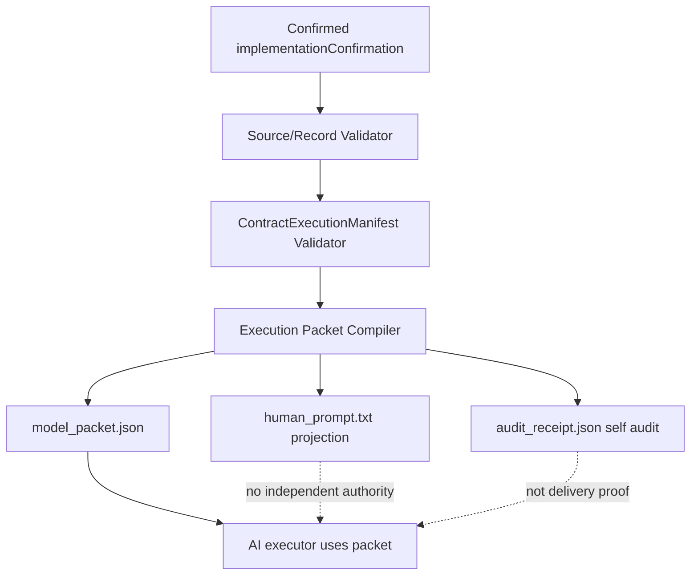
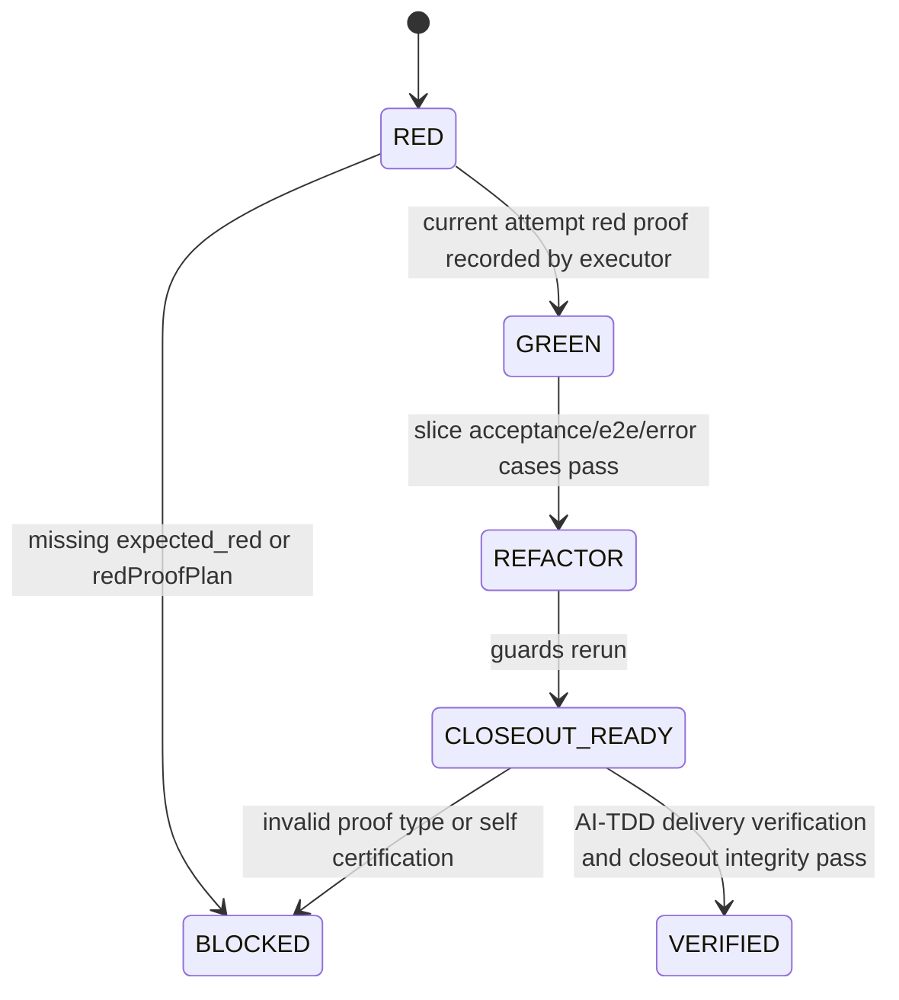
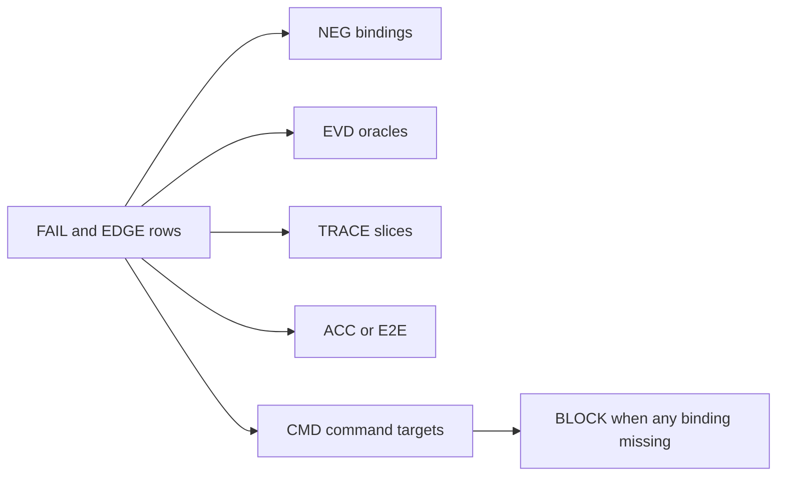

# Req Trace Matrix AI-TDD Execution Packet Compiler

Date: 2026-05-25
Status: Implementation Source Draft
Source request: Upgrade `req-trace-matrix-prompt-generator` from a prompt-only generator into a confirmed `implementationConfirmation` to AI-TDD Contract Execution Packet compiler.

## Scope Summary

This source document defines the confirmed-scope draft for upgrading `req-trace-matrix-prompt-generator` so AI execution receives a machine-readable execution packet, a human-readable prompt projection, and a generator audit receipt.

The target is not a looser natural-language prompt. The target is a productized compiler:

```text
confirmed implementationConfirmation
-> source/record validation
-> ContractExecutionManifest validation
-> execution packet compilation
-> model_packet.json + human_prompt.txt + audit_receipt.json
```

## Human-Readable Confirmation Views

### Execution Packet Metadata

确认范围是把 `req-trace-matrix-prompt-generator` 从单一提示词生成器升级为 AI-TDD Contract Execution Packet Compiler。生成器必须从已确认的 `implementationConfirmation` 和受控 requirement record 编译执行包，而不是让执行模型从 prose 自由推断。

主输出是 `model_packet.json`。`human_prompt.txt` 只是可读投影，`audit_receipt.json` 只是生成器自审收据。三者必须 hash-linked，并且必须指向同一份 source、record、trace order、manifest coverage 和 currentTargetMap。

### Source And Record Authority

`MUST-004` 定义了输入权威：只有 inline `implementationConfirmation`、`status=user_confirmed`、匹配的 requirement-record confirmationHistory、匹配的 source/implementationConfirmation hash、无阻断 open question、有效 trace refs 和 command refs 同时成立时，生成器才允许写出执行产物。

`EDGE-001` 到 `EDGE-003` 是这层的关键反例：draft source、hash mismatch、blocking open question 都必须阻断。阻断结果应出现在 `audit_receipt.json`，但该 receipt 本身不得成为 delivery proof。

### AI-TDD ContractExecutionManifest Projection

`MUST-005` 到 `MUST-007` 要求生成器把 AI-TDD manifest 作为统一标准，而不是自定义另一份 readiness/closeout 清单。以下 section 必须作为一等公民进入 `model_packet.json` 并投影到 `human_prompt.txt`：

- error cases
- command targets
- trace closure
- current target map
- canonical surfaces
- legacy denial
- closeout proof
- evidence trust

任何缺失 `failurePaths[]`、`edgeCases[]`、`acceptanceTests[]`、`e2eSuites[]`、`traceRows[].acceptanceRefs[]`、FAIL/EDGE 覆盖或 currentTargetMap 的情况，都必须 fail closed。

### Red-Green-Refactor State Machine

每个 trace slice 必须按 RED -> GREEN -> REFACTOR -> CLOSEOUT 执行。生成器阶段不需要真实 RED proof，但必须要求 `expectedPreImplementationState: expected_red` 和 `redProofPlan`。真实 RED/GREEN/REFACTOR proof 由执行阶段写入 runtime/control store。

如果 ACC/E2E 缺 `expected_red` 或 `redProofPlan`，`PRE_IMPLEMENTATION_RED_PROOF_PLAN_REQUIRED` 必须阻断生成。

### False-Positive Proof Boundary

`NEG-002` 到 `NEG-005` 是防假阳性的硬边界：

- Completion Evidence Packet 只是证据索引。
- `audit_receipt.json` 只是生成器自审。
- `exitCode=0` 只是诊断信号。
- mock-only、self-certification、stale attempt、legacy proof、smoke-only proof 都不能 closeout。
- confirmed source `traceRows.status` 不能被执行器改写成 runtime PASS。

closeout 只能由 AI-TDD gate、delivery verification、closeout integrity 的 current-attempt 受控报告决定。

### Current And Target State

现状：执行提示主要以自然语言 prompt 呈现，错误用例、RED 计划、canonical surfaces、legacy denial 和 closeout 证明规则容易成为文字建议，而不是机器可执行约束。

目标态：`model_packet.json` 将这些结构全部提升为字段和矩阵；`human_prompt.txt` 只从这些字段投影；`audit_receipt.json` 证明生成器输入输出一致，但不证明实现完成。

`currentTargetMap` 是确认页一级硬门禁。确认页必须显示当前 prompt-only 模式与目标 AI-TDD compiler 模式的差异，特别是输出权威、manifest completeness、TDD protocol、error cases 和 closeout authority。

## Mermaid Views







## Evidence Overview

The evidence model is intentionally strict:

- `EVD-001` to `EVD-003` prove the three synchronized artifacts and receipt content.
- `EVD-004` proves source/record authority and confirmation hash validation.
- `EVD-005` proves ContractExecutionManifest completeness and error-case closure.
- `EVD-006` proves packet trace slice shape and runtime write policy.
- `EVD-007` proves RED/GREEN/REFACTOR/CLOSEOUT state-machine fields and red proof plan blocking.
- `EVD-008` proves stable BLOCK code behavior.
- `EVD-009` proves end-to-end synchronized generation without scope reduction.
- `EVD-010` proves invalid proof types cannot be closeout authority.
- `EVD-011` and `EVD-012` prove skill routing and UTF-8/sync integrity.

## E2E Overview

`E2E-001` is the valid confirmed-source compiler path: source and record pass, then packet, prompt, and receipt are produced with synchronized hashes and required sections.

`E2E-002` is the incomplete manifest and error-case path: missing AI-TDD applicability, currentTargetMap, error-case closure, acceptance binding, or red proof plan blocks generation.

`E2E-003` is the skill routing path: bugfix, standalone tasks, and story surfaces must route confirmed `implementationConfirmation` sources through the compiler, with legacy prompt fallback only when no confirmed source exists.

## Definition Of Done

This source document is ready for confirmation render only when:

- `implementationConfirmation` remains `draft` until explicit user confirmation.
- Every MUST and NEG has EVD, TRACE, ACC/E2E, CMD, and view coverage.
- Every FAIL and EDGE has NEG/EVD/TRACE/ACC or E2E/CMD coverage.
- `currentTargetMap` uses `schemaVersion=current-target-map/v1` and `displayProfile=closed_loop_current_target_map`.
- `targetModificationPaths[]` explicitly lists affected scripts, skill surfaces, and tests.
- AI-TDD manifest projection covers error cases, command targets, trace closure, currentTargetMap, canonical surfaces, legacy denial, closeout proof, and evidence trust.
- The pre-render global consistency gate passes.
- Encoding integrity reports zero findings.

Implementation is not done by this source document. Confirmation only authorizes scope; delivery remains blocked until later implementation, AI-TDD delivery verification, and closeout integrity all pass with current-attempt evidence.

## Reverse Audit Report

### Contract Confirmability

This draft is intended to be confirmable after HTML render because it contains a complete inline `implementationConfirmation`, mandatory applicability decisions, current/target map, failure paths, edge cases, trace rows, acceptance/E2E rows, artifact plan, command matrix, target modification paths, and AI-TDD manifest projection.

### Implementation Readiness Boundary

The draft does not claim implementation readiness. `status` is `draft`, confirmation render has not been produced in this checkpoint authoring task, and controlled confirmation ingest has not run.

### Delivery Verification Boundary

The draft does not claim delivery verification. `model_packet.json`, `human_prompt.txt`, `audit_receipt.json`, command exit codes, stdout, and completion packet are explicitly non-closeout proof unless validated by downstream AI-TDD delivery verification and closeout integrity controlled reports.

### Anti-Smoke And Anti-Happy-Path Checks

The source blocks happy-path-only behavior through `NEG-006`, `FAIL-005`, `EDGE-006`, `EDGE-008`, `ACC-004`, `ACC-005`, `ACC-008`, and `E2E-002`. Smoke command `CMD-SMOKE-001` is explicitly `smoke_only_not_closeout`.

### Report Shape Checks

After implementation, reverse audit and render report must show:

- `confirmability=confirmable` only for scope confirmation.
- `deliveryReadiness.ready=false` until current-attempt controlled execution evidence exists.
- AI-TDD manifest coverage sections are present and non-empty.
- current/target coverage is non-zero and displayed.
- target modification paths are visible.
- invalid proof taxonomy is visible in both packet and prompt projections.

### Checkpoint Repair Closure

The pre-render gate repair added missing currentTargetMap process coverage and fail-closed/idempotency/recovery semantics for control-affecting artifacts. This cp-08 closure note confirms the human-readable reverse-audit layer reflects those repaired machine-readable sections and does not introduce new executable scope.

## Current Problem

The current generator emits a single natural-language execution prompt. It validates the confirmed inline `implementationConfirmation`, requirement-record confirmation history, semantic hashes, trace references, and command references, but the output still lets an execution model infer too much from prose and prompt text.

That creates four product risks:

1. Error cases can be omitted while happy-path traces still look complete.
2. `TRACE-*` rows can be executed without a structured RED/GREEN/REFACTOR state machine.
3. A completion packet, command exit code, stale evidence, or mock-only proof can be mistaken for closeout evidence by downstream execution.
4. Bugfix, standalone task, and story flows can still use old prompt templates when a confirmed `implementationConfirmation` exists.

## Target State

`req-trace-matrix-prompt-generator` becomes an AI-TDD Contract Execution Packet compiler. The compiler consumes only a confirmed implementation source document plus its controlled requirement record, then emits three synchronized outputs:

- `model_packet.json`: the machine-readable execution authority for AI execution.
- `human_prompt.txt`: the readable prompt projection over `model_packet.json`.
- `audit_receipt.json`: the generator self-audit receipt proving that source, record, hashes, trace coverage, acceptance coverage, AI-TDD manifest coverage, and current/target mapping passed.

Execution models must treat `model_packet.json` as the primary execution authority. `human_prompt.txt` helps the model and user read the plan, but it must not introduce, remove, shrink, or reinterpret anything absent from the packet.

## Non-Goals

- Do not make the generator execute implementation commands.
- Do not let the generator write runtime PASS, close trace rows, or write `record_closed`.
- Do not make `human_prompt.txt` the primary authority when `model_packet.json` exists.
- Do not make `audit_receipt.json` a delivery proof; it proves generator input/output validity only.
- Do not allow exit-code-only, mock-only, stale attempt, self-certification, legacy proof, smoke-only proof, or completion-packet self proof to satisfy closeout.
- Do not keep independent readiness or closeout completeness checklists that diverge from AI-TDD `ContractExecutionManifest`.
- Do not require real RED execution proof at generation time; the compiler only requires an `expected_red` declaration and a `redProofPlan`.

## Frozen Decisions

- The implementation source document remains the source authority through inline `implementationConfirmation`.
- The generator must require `status=user_confirmed` and a matching requirement-record confirmation history before producing execution artifacts.
- `model_packet.json` is mandatory and is the execution authority.
- `human_prompt.txt` is mandatory and is a projection over `model_packet.json`.
- `audit_receipt.json` is mandatory and records generator self-audit, not delivery verification.
- AI-TDD `ContractExecutionManifest` is mandatory whenever `applicability.aiTddContractGate.applies=true`.
- `currentTargetMap` is mandatory and must be projected into both the model packet and human prompt.
- Every `TRACE-*` slice must carry ACC/E2E/error-case/current-target/canonical/legacy/evidence-trust bindings.
- RED/GREEN/REFACTOR/CLOSEOUT is a structured state machine, not prose guidance.
- Bugfix, standalone tasks, and story skills must route confirmed `implementationConfirmation` sources through this compiler before implementation.

## Checkpoint Authoring Record

Scale assessment selected `checkpoint_required` with `authoringMode=kernel_then_checkpoint`. This document is authored through the semantic checkpoint sequence below before HTML render:

1. `cp-01-header-scope-decisions`
2. `cp-02-confirmation-core-applicability`
3. `cp-03-must-neg-out-evidence`
4. `cp-04-failure-edge-trace`
5. `cp-05-views`
6. `cp-06-artifacts-commands-closeout`
7. `cp-07-conditional-modules`
8. `cp-08-human-readable-views-dod-reverse-audit`

## Applicability Decisions

This requirement is a standalone task packet because it upgrades an existing local skill and generator script. It does not change a consuming product feature, database schema, external runtime service, dashboard scoring model, or SFT dataset.

`scriptsAndHooks.applies=true` because `_bmad/skills/req-trace-matrix-prompt-generator/scripts/generate_prompt.js`, its Python compatibility launcher, generated host skill surfaces, and related acceptance tests must change.

`aiTddContractGate.applies=true` because the compiler must consume the latest AI-TDD `ContractExecutionManifest` standard and must not define separate readiness or closeout checklists.

`currentTargetMap.applies=true` because the user explicitly treats current/target comparison as a primary confirmation and anti-false-positive surface. The compiler must make the target execution surface visible in `model_packet.json`, `human_prompt.txt`, and `audit_receipt.json`.

`governanceEvents.applies=false` for this source document because the implementation does not add new controlled event types or writer permissions. It only defines generator outputs and prompt/compiler behavior. Runtime closeout remains delegated to existing AI-TDD gate, delivery verification, and closeout integrity controlled reports.

`runtimeRecovery.applies=false` because no resume, rerun, hook, active requirement resolver, or recovery context behavior is changed by this compiler upgrade.

## implementationConfirmation Draft

```yaml
implementationConfirmation:
  contractSchemaVersion: 1
  status: draft
  recordId: REQ-REQ-TRACE-AI-TDD-PACKET-COMPILER
  requirementSetId: REQ-REQ-TRACE-AI-TDD-PACKET-COMPILER
  entryFlow: standalone_tasks
  entryFlowClass: task_packet_entry
  workflowAdapter: direct
  contractAuthoringRequired: true
  confirmationLanguage: zh-CN
  confirmationProfile: implementation_confirmation
  requiredViewPacks:
    - currentTargetMap
  optionalViewPacks: []
  confirmedAt: null
  confirmedBy: null
  sourceDocumentHash: null
  implementationConfirmationHash: null
  confirmationRender:
    htmlPath: null
    summaryPath: null
    reportPath: null
    htmlHash: null
    confirmationPhrase: null
  applicability:
    governanceEvents:
      applies: false
      reasonCode: no_new_control_event_type_required_for_prompt_compiler
    runtimeRecovery:
      applies: false
      reasonCode: no_resume_rerun_closeout_hook_ingest_or_trace_checkpoint_runtime_change
      requiresFunctionalResumeFailureCaseRegistry: false
      activeRequirementResolutionRequired: false
      retiredContextSurfaceForbidden: true
    scoringDashboardSft:
      applies: false
      reasonCode: no_scoring_dashboard_sft_dataset_or_read_model_changes
    currentTargetMap:
      applies: true
      reasonCode: requirements_contract_authoring_requires_visible_current_target_map
    scriptsAndHooks:
      applies: true
      reasonCode: req_trace_generator_scripts_and_skill_surfaces_change
    aiTddContractGate:
      applies: true
      reasonCode: compiler_must_emit_ai_tdd_contract_execution_packet
  must:
    - id: MUST-001
      text: "The generator must compile three synchronized outputs for every confirmed source: model_packet.json, human_prompt.txt, and audit_receipt.json."
      textZh: "生成器必须为每个已确认源文档编译三份同步产物：model_packet.json、human_prompt.txt 和 audit_receipt.json。"
      evidenceRefs: [EVD-001, EVD-009]
      coveredByTraceRows: [TRACE-001]
      acceptanceRefs: [ACC-001, E2E-001]
      coveredBySequenceViews: [SEQ-001]
      riskLevel: critical
    - id: MUST-002
      text: "model_packet.json must be the primary machine-readable execution authority, and human_prompt.txt must be only a readable projection over the packet."
      textZh: "model_packet.json 必须是机器可读主执行权威，human_prompt.txt 只能是该执行包的可读投影。"
      evidenceRefs: [EVD-001, EVD-002, EVD-009]
      coveredByTraceRows: [TRACE-001]
      acceptanceRefs: [ACC-001, E2E-001]
      coveredBySequenceViews: [SEQ-001]
      riskLevel: critical
    - id: MUST-003
      text: "audit_receipt.json must record the generator self-audit for source, requirement record, hashes, trace references, acceptance coverage, AI-TDD manifest coverage, currentTargetMap coverage, and emitted artifact hashes."
      textZh: "audit_receipt.json 必须记录生成器自审：source、requirement record、hash、trace 引用、验收覆盖、AI-TDD manifest 覆盖、currentTargetMap 覆盖和输出工件 hash。"
      evidenceRefs: [EVD-003, EVD-009]
      coveredByTraceRows: [TRACE-001]
      acceptanceRefs: [ACC-002, E2E-001]
      coveredBySequenceViews: [SEQ-001]
      riskLevel: critical
    - id: MUST-004
      text: "Source/Record Validator must require inline implementationConfirmation, status=user_confirmed, requirement-record confirmationHistory, matching semantic source and implementationConfirmation hashes, no blocking open questions, valid trace refs, and valid command refs."
      textZh: "Source/Record Validator 必须要求 inline implementationConfirmation、status=user_confirmed、requirement-record confirmationHistory、语义 source 和 implementationConfirmation hash 匹配、无阻断 open questions、trace refs 有效、command refs 有效。"
      evidenceRefs: [EVD-004, EVD-009]
      coveredByTraceRows: [TRACE-002]
      acceptanceRefs: [ACC-003, E2E-001]
      coveredBySequenceViews: [SEQ-002]
      riskLevel: critical
    - id: MUST-005
      text: "ContractExecutionManifest Validator must fail closed unless applicability.aiTddContractGate.applies=true, applicability.currentTargetMap.applies=true, failurePaths[], edgeCases[], acceptanceTests[], and e2eSuites[] are non-empty and closed over the confirmed IDs."
      textZh: "ContractExecutionManifest Validator 必须在 aiTddContractGate/currentTargetMap 适用声明、failurePaths、edgeCases、acceptanceTests、e2eSuites 非空且与确认 ID 闭环时才放行。"
      evidenceRefs: [EVD-005, EVD-009]
      coveredByTraceRows: [TRACE-003]
      acceptanceRefs: [ACC-004, E2E-001]
      coveredBySequenceViews: [SEQ-003]
      riskLevel: critical
    - id: MUST-006
      text: "Every MUST-* and NEG-* must have TRACE, EVD, ACC or E2E, and CMD coverage before packet generation succeeds."
      textZh: "每个 MUST-* 和 NEG-* 在执行包生成成功前必须具备 TRACE、EVD、ACC 或 E2E、CMD 覆盖。"
      evidenceRefs: [EVD-005, EVD-009]
      coveredByTraceRows: [TRACE-003]
      acceptanceRefs: [ACC-004]
      coveredBySequenceViews: [SEQ-003]
      riskLevel: critical
    - id: MUST-007
      text: "Every FAIL-* and EDGE-* must have NEG, EVD, TRACE, ACC or E2E, and CMD coverage before packet generation succeeds."
      textZh: "每个 FAIL-* 和 EDGE-* 在执行包生成成功前必须具备 NEG、EVD、TRACE、ACC 或 E2E、CMD 覆盖。"
      evidenceRefs: [EVD-005, EVD-009]
      coveredByTraceRows: [TRACE-003]
      acceptanceRefs: [ACC-004, ACC-005]
      coveredBySequenceViews: [SEQ-004]
      riskLevel: critical
    - id: MUST-008
      text: "Execution Packet Compiler must emit a structured model_packet.json containing execution metadata, source authority, immutable contract snapshot, AI-TDD manifest projection, TDD state machine, trace slice registry, error case matrix, acceptance/e2e matrix, currentTargetMap surface, canonical surfaces, legacy denial, evidence trust, runtime write policy, final gate matrix, blocking decision table, and completion evidence packet schema."
      textZh: "Execution Packet Compiler 必须输出结构化 model_packet.json，包含执行元数据、source authority、不可变契约快照、AI-TDD manifest 投影、TDD 状态机、trace slice 注册表、错误用例矩阵、ACC/E2E 矩阵、currentTargetMap、canonical surfaces、legacy denial、evidence trust、runtime write policy、final gate matrix、blocking decision table 和 completion evidence packet schema。"
      evidenceRefs: [EVD-001, EVD-006, EVD-009]
      coveredByTraceRows: [TRACE-004]
      acceptanceRefs: [ACC-001, ACC-006, E2E-001]
      coveredBySequenceViews: [SEQ-005]
      riskLevel: critical
    - id: MUST-009
      text: "Every trace slice in model_packet.json must include traceId, requirementRefs, negativeRequirementRefs, failurePathRefs, edgeCaseRefs, acceptanceRefs, e2eRefs, delivery command refs, artifactRefs, targetModificationPaths, currentTargetMapRefs, canonicalSurfaceRefs, legacyDenialRefs, expectedRedProofs, greenExitCriteria, refactorGuards, allowedRuntimeWrites, and forbiddenProofTypes."
      textZh: "model_packet.json 中每个 trace slice 必须包含 traceId、requirementRefs、negativeRequirementRefs、failurePathRefs、edgeCaseRefs、acceptanceRefs、e2eRefs、delivery command refs、artifactRefs、targetModificationPaths、currentTargetMapRefs、canonicalSurfaceRefs、legacyDenialRefs、expectedRedProofs、greenExitCriteria、refactorGuards、allowedRuntimeWrites 和 forbiddenProofTypes。"
      evidenceRefs: [EVD-006, EVD-009]
      coveredByTraceRows: [TRACE-004]
      acceptanceRefs: [ACC-006, E2E-001]
      coveredBySequenceViews: [SEQ-005]
      riskLevel: critical
    - id: MUST-010
      text: "The generated RED/GREEN/REFACTOR/CLOSEOUT state machine must require expected_red and redProofPlan at generation time, then require real current-attempt RED/GREEN/REFACTOR proof during execution."
      textZh: "生成的 RED/GREEN/REFACTOR/CLOSEOUT 状态机必须在生成阶段要求 expected_red 和 redProofPlan，并在执行阶段要求真实 current-attempt RED/GREEN/REFACTOR 证据。"
      evidenceRefs: [EVD-007, EVD-009]
      coveredByTraceRows: [TRACE-005]
      acceptanceRefs: [ACC-007, E2E-001]
      coveredBySequenceViews: [SEQ-006]
      riskLevel: critical
    - id: MUST-011
      text: "The generator must emit explicit BLOCK codes for missing applicability declarations, missing AI-TDD gate applicability, invalid trace acceptance binding, incomplete ContractExecutionManifest, missing target modification trace binding, missing closeout proof policy, missing red proof plan, invalid proof policy, and control store not ready for execution."
      textZh: "生成器必须为缺失 applicability、缺失 AI-TDD gate 适用声明、trace acceptance 绑定无效、ContractExecutionManifest 不完整、目标修改路径 trace 绑定缺失、closeout proof policy 缺失、red proof plan 缺失、proof policy 无效、control store 未准备好执行输出明确 BLOCK。"
      evidenceRefs: [EVD-008, EVD-009]
      coveredByTraceRows: [TRACE-006]
      acceptanceRefs: [ACC-008]
      coveredBySequenceViews: [SEQ-007]
      riskLevel: high
    - id: MUST-012
      text: "Bugfix, standalone tasks, and story skills must call the compiler when a confirmed implementationConfirmation exists, and legacy hand-written prompts may only be used as fallback when no confirmed implementationConfirmation exists."
      textZh: "bugfix、standalone tasks 和 story 技能在发现已确认 implementationConfirmation 时必须调用该编译器；旧手写提示词只能在没有已确认 implementationConfirmation 时作为 legacy fallback。"
      evidenceRefs: [EVD-011, EVD-012]
      coveredByTraceRows: [TRACE-008]
      acceptanceRefs: [ACC-010]
      coveredBySequenceViews: [SEQ-008]
      riskLevel: high
  notDone:
    - id: NEG-001
      text: "A single natural-language prompt must not be the only generated artifact for confirmed execution."
      textZh: "单一自然语言 prompt 不能作为已确认执行的唯一生成产物。"
      evidenceRefs: [EVD-001, EVD-002]
      whyItBlocksCompletion: "Prompt-only output leaves execution authority ambiguous and allows model inference drift."
      whyItBlocksCompletionZh: "仅输出 prompt 会让执行权威不清晰，并允许模型推断漂移。"
      negativeAssertionRequired: true
      coveredByFailurePath: [FAIL-001]
      acceptanceRefs: [ACC-001]
    - id: NEG-002
      text: "Completion Evidence Packet, audit_receipt.json, command exit code, stdout, report render, or dashboard/read-model state must not be accepted as PASS or closeout authority."
      textZh: "Completion Evidence Packet、audit_receipt.json、命令退出码、stdout、报告渲染、dashboard/read-model 状态不得作为 PASS 或 closeout 权威。"
      evidenceRefs: [EVD-010]
      whyItBlocksCompletion: "These are evidence indexes or diagnostics, not delivery verification."
      whyItBlocksCompletionZh: "这些只是证据索引或诊断信号，不是交付核验。"
      negativeAssertionRequired: true
      coveredByFailurePath: [FAIL-002]
      acceptanceRefs: [ACC-009]
    - id: NEG-003
      text: "Mock-only, self-certification, stale attempt evidence, legacy proof, smoke-only proof, and exitCode-only proof must not close any TRACE, NEG, FAIL, EDGE, ACC, E2E, or closeout state."
      textZh: "mock-only、self-certification、stale attempt evidence、legacy proof、smoke-only proof 和 exitCode-only proof 不得关闭任何 TRACE、NEG、FAIL、EDGE、ACC、E2E 或 closeout 状态。"
      evidenceRefs: [EVD-010]
      whyItBlocksCompletion: "Invalid proof types caused previous false-positive delivery risks."
      whyItBlocksCompletionZh: "无效证明类型会导致假阳性交付风险。"
      negativeAssertionRequired: true
      coveredByFailurePath: [FAIL-003]
      acceptanceRefs: [ACC-009]
    - id: NEG-004
      text: "taskRefs completion must not equal requirement PASS."
      textZh: "taskRefs 完成不得等同于 requirement PASS。"
      evidenceRefs: [EVD-006, EVD-010]
      whyItBlocksCompletion: "Task completion can happen without oracle-bound requirement evidence."
      whyItBlocksCompletionZh: "任务完成可能没有绑定 oracle 的需求证据。"
      negativeAssertionRequired: true
      coveredByFailurePath: [FAIL-002]
      acceptanceRefs: [ACC-006, ACC-009]
    - id: NEG-005
      text: "The executor must not rewrite confirmed source traceRows.status or source evidence fields to represent runtime PASS or MISSING_EVIDENCE."
      textZh: "执行器不得改写已确认源文档 traceRows.status 或源 evidence 字段来表示 runtime PASS 或 MISSING_EVIDENCE。"
      evidenceRefs: [EVD-006, EVD-010]
      whyItBlocksCompletion: "Confirmed trace rows are contract projection only."
      whyItBlocksCompletionZh: "已确认 trace rows 只是契约投影。"
      negativeAssertionRequired: true
      coveredByFailurePath: [FAIL-004]
      acceptanceRefs: [ACC-009]
    - id: NEG-006
      text: "Any uncovered NEG, FAIL, or EDGE row must block packet closeout instructions."
      textZh: "任何未覆盖的 NEG、FAIL 或 EDGE 行必须阻断执行包 closeout 指令。"
      evidenceRefs: [EVD-005, EVD-008]
      whyItBlocksCompletion: "Error-case gaps are the primary happy-path-only false-positive source."
      whyItBlocksCompletionZh: "错误用例缺口是假阳性 happy-path-only 的主要来源。"
      negativeAssertionRequired: true
      coveredByFailurePath: [FAIL-005]
      acceptanceRefs: [ACC-004, ACC-005, ACC-008]
    - id: NEG-007
      text: "A trace row without acceptanceRefs[] must not be compiled into an executable trace slice."
      textZh: "缺少 acceptanceRefs[] 的 trace row 不得被编译成可执行 trace slice。"
      evidenceRefs: [EVD-005, EVD-008]
      whyItBlocksCompletion: "Without acceptance binding, command execution can look complete without an oracle."
      whyItBlocksCompletionZh: "没有验收绑定时，命令执行可能看起来完成但没有 oracle。"
      negativeAssertionRequired: true
      coveredByFailurePath: [FAIL-006]
      acceptanceRefs: [ACC-004, ACC-008]
    - id: NEG-008
      text: "An ACC-* or E2E-* row without expectedPreImplementationState=expected_red or redProofPlan must not be accepted for implementation execution."
      textZh: "缺少 expectedPreImplementationState=expected_red 或 redProofPlan 的 ACC-* 或 E2E-* 行不得被接受用于实施执行。"
      evidenceRefs: [EVD-007, EVD-008]
      whyItBlocksCompletion: "The generator must not ask the executor to fake red proof after implementation."
      whyItBlocksCompletionZh: "生成器不得要求执行器在实现后伪造红灯证明。"
      negativeAssertionRequired: true
      coveredByFailurePath: [FAIL-007]
      acceptanceRefs: [ACC-007, ACC-008]
    - id: NEG-009
      text: "Legacy bugfix, standalone, or story prompts must not bypass the compiler when a confirmed implementationConfirmation exists."
      textZh: "存在已确认 implementationConfirmation 时，旧 bugfix、standalone 或 story prompt 不得绕过该编译器。"
      evidenceRefs: [EVD-011, EVD-012]
      whyItBlocksCompletion: "Bypass paths reintroduce prose-driven execution and inconsistent TDD coverage."
      whyItBlocksCompletionZh: "绕过路径会重新引入 prose-driven execution 和不一致的 TDD 覆盖。"
      negativeAssertionRequired: true
      coveredByFailurePath: [FAIL-008]
      acceptanceRefs: [ACC-010]
  mustNot:
    - id: OUT-001
      text: "This requirement does not authorize implementation execution, delivery verification, or closeout."
      textZh: "本需求不授权实施执行、交付核验或 closeout。"
      scopeBoundary: "source_document_authoring_only"
      userApprovalRequiredIfChanged: true
      coveredByBoundaryView: [BOUNDARY-001]
    - id: OUT-002
      text: "This requirement does not replace the existing confirmation ingest, AI-TDD gate, delivery verification, or closeout integrity writer."
      textZh: "本需求不替换现有 confirmation ingest、AI-TDD gate、交付核验或 closeout integrity writer。"
      scopeBoundary: "compiler_consumes_or_references_existing_gates"
      userApprovalRequiredIfChanged: true
      coveredByBoundaryView: [BOUNDARY-001]
    - id: OUT-003
      text: "This requirement does not make generated model_packet.json, human_prompt.txt, or audit_receipt.json valid closeout evidence by themselves."
      textZh: "本需求不使生成的 model_packet.json、human_prompt.txt 或 audit_receipt.json 自身成为有效 closeout 证据。"
      scopeBoundary: "generated_artifacts_are_execution_inputs_or_generator_receipts"
      userApprovalRequiredIfChanged: true
      coveredByBoundaryView: [BOUNDARY-002]
  evidence:
    - id: EVD-001
      text: "Acceptance tests prove the compiler writes model_packet.json, human_prompt.txt, and audit_receipt.json together for a confirmed source."
      textZh: "验收测试证明编译器会为已确认源文档同时写出 model_packet.json、human_prompt.txt 和 audit_receipt.json。"
      gate: "npx vitest run tests/acceptance/req-trace-confirmation-block-generator.test.ts"
      oracle: "The test asserts all three files exist, are hash-linked, and represent the same source/record/trace order."
      requiredCommandRefs: [CMD-TEST-001]
      artifactRefs: [ART-001, ART-002, ART-003, ART-004]
      acceptanceType: acceptance_contract
    - id: EVD-002
      text: "Tests prove human_prompt.txt is a projection over model_packet.json and cannot introduce unpacketized requirements."
      textZh: "测试证明 human_prompt.txt 是 model_packet.json 的投影，不能引入执行包外的需求。"
      gate: "npx vitest run tests/acceptance/req-trace-confirmation-block-generator.test.ts"
      oracle: "Prompt audit compares prompt sections against model packet sections and rejects extra authority."
      requiredCommandRefs: [CMD-TEST-001]
      artifactRefs: [ART-002, ART-004]
      acceptanceType: acceptance_contract
    - id: EVD-003
      text: "Tests prove audit_receipt.json records source/record/hash/coverage/manifest/currentTargetMap validations and emitted artifact hashes."
      textZh: "测试证明 audit_receipt.json 记录 source、record、hash、coverage、manifest、currentTargetMap 校验和输出工件 hash。"
      gate: "npx vitest run tests/acceptance/req-trace-confirmation-block-generator.test.ts"
      oracle: "Receipt contains validator decisions and outputHashes for all generated artifacts."
      requiredCommandRefs: [CMD-TEST-001]
      artifactRefs: [ART-003, ART-004]
      acceptanceType: acceptance_contract
    - id: EVD-004
      text: "Tests prove Source/Record Validator preserves current confirmed source, requirement-record, hash, open question, trace ref, and command ref blocking semantics."
      textZh: "测试证明 Source/Record Validator 保留当前已确认源文档、requirement-record、hash、open question、trace ref、command ref 阻断语义。"
      gate: "npx vitest run tests/acceptance/req-trace-confirmation-block-generator.test.ts tests/acceptance/requirements-confirmation-ingest.test.ts"
      oracle: "Existing confirmation-block regressions continue to pass and new packet output appears only after controlled ingest."
      requiredCommandRefs: [CMD-TEST-002]
      artifactRefs: [ART-001, ART-003]
      acceptanceType: regression_contract
    - id: EVD-005
      text: "Tests prove ContractExecutionManifest Validator blocks missing applicability, currentTargetMap, failurePaths, edgeCases, acceptanceTests, e2eSuites, and missing MUST/NEG/FAIL/EDGE closure."
      textZh: "测试证明 ContractExecutionManifest Validator 会阻断缺失 applicability、currentTargetMap、failurePaths、edgeCases、acceptanceTests、e2eSuites，以及缺失 MUST/NEG/FAIL/EDGE 闭环。"
      gate: "npx vitest run tests/acceptance/req-trace-confirmation-block-generator.test.ts tests/acceptance/ai-tdd-contract-gate.test.ts"
      oracle: "Each missing manifest section or broken mapping returns the expected BLOCK code."
      requiredCommandRefs: [CMD-TEST-003]
      artifactRefs: [ART-003, ART-006]
      acceptanceType: adversarial_contract
    - id: EVD-006
      text: "Tests prove model_packet.json includes full trace slice registry fields and runtime write policy."
      textZh: "测试证明 model_packet.json 包含完整 trace slice registry 字段和 runtime write policy。"
      gate: "npx vitest run tests/acceptance/req-trace-confirmation-block-generator.test.ts"
      oracle: "Every compiled trace slice contains required refs, guard fields, allowed writes, and forbidden proof types."
      requiredCommandRefs: [CMD-TEST-001]
      artifactRefs: [ART-001, ART-004]
      acceptanceType: acceptance_contract
    - id: EVD-007
      text: "Tests prove RED/GREEN/REFACTOR/CLOSEOUT state machine contains expected_red, redProofPlan, unexpected_green, and current-attempt proof requirements."
      textZh: "测试证明 RED/GREEN/REFACTOR/CLOSEOUT 状态机包含 expected_red、redProofPlan、unexpected_green 和 current-attempt 证据要求。"
      gate: "npx vitest run tests/acceptance/req-trace-confirmation-block-generator.test.ts tests/acceptance/ai-tdd-contract-gate.test.ts"
      oracle: "Missing redProofPlan blocks generation, while real red proof remains an execution-stage runtime/control-store responsibility."
      requiredCommandRefs: [CMD-TEST-003]
      artifactRefs: [ART-001, ART-002, ART-003]
      acceptanceType: adversarial_contract
    - id: EVD-008
      text: "Tests prove every new BLOCK case is emitted for its matching missing or invalid contract condition."
      textZh: "测试证明每个新增 BLOCK case 都会在对应缺失或无效契约条件下输出。"
      gate: "npx vitest run tests/acceptance/req-trace-confirmation-block-generator.test.ts"
      oracle: "BLOCK code snapshots match APPLICABILITY_DECLARATION_REQUIRED, AI_TDD_CONTRACT_GATE_REQUIRED, TRACE_ACCEPTANCE_BINDING_INVALID, CONTRACT_EXECUTION_MANIFEST_INCOMPLETE, TARGET_MODIFICATION_TRACE_BINDING_REQUIRED, CLOSEOUT_PROOF_POLICY_REQUIRED, PRE_IMPLEMENTATION_RED_PROOF_PLAN_REQUIRED, INVALID_PROOF_POLICY, and CONTROL_STORE_NOT_READY_FOR_EXECUTION."
      requiredCommandRefs: [CMD-TEST-001]
      artifactRefs: [ART-003]
      acceptanceType: adversarial_contract
    - id: EVD-009
      text: "End-to-end regression proves a valid confirmed source produces synchronized model packet, prompt, and receipt without reducing scope."
      textZh: "端到端回归证明有效已确认源文档会生成同步的 model packet、prompt 和 receipt，且不缩减范围。"
      gate: "npx vitest run tests/acceptance/req-trace-confirmation-block-generator.test.ts"
      oracle: "Output artifact hashes, trace order, source authority, and manifest sections are consistent across the three generated files."
      requiredCommandRefs: [CMD-TEST-001]
      artifactRefs: [ART-001, ART-002, ART-003, ART-004]
      acceptanceType: e2e_contract
    - id: EVD-010
      text: "Tests prove false-positive proof types cannot appear as allowed closeout proof in model_packet.json or human_prompt.txt."
      textZh: "测试证明假阳性证明类型不能在 model_packet.json 或 human_prompt.txt 中作为允许 closeout proof 出现。"
      gate: "npx vitest run tests/acceptance/req-trace-confirmation-block-generator.test.ts tests/acceptance/strict-closeout-proof-gate.test.ts"
      oracle: "The packet lists invalid proof taxonomy and routes closeout to AI-TDD gate, delivery verification, and closeout integrity reports only."
      requiredCommandRefs: [CMD-TEST-004]
      artifactRefs: [ART-001, ART-002, ART-003]
      acceptanceType: adversarial_contract
    - id: EVD-011
      text: "Skill contract tests prove bugfix, standalone tasks, and story flows call the compiler when a confirmed implementationConfirmation exists."
      textZh: "技能契约测试证明 bugfix、standalone tasks 和 story 流程在存在已确认 implementationConfirmation 时会调用该编译器。"
      gate: "npx vitest run tests/acceptance/requirements-contract-authoring-skill-contract.test.ts tests/acceptance/setup-global-skill-sync-contract.test.ts"
      oracle: "Skill docs and generated surfaces contain the confirmed-source routing rule and do not present legacy prompts as primary."
      requiredCommandRefs: [CMD-TEST-005]
      artifactRefs: [ART-005, ART-007, ART-008]
      acceptanceType: skill_contract
    - id: EVD-012
      text: "Encoding and sync checks prove the updated skill and script surfaces are UTF-8 clean and mirrored to installed surfaces."
      textZh: "编码和同步检查证明更新后的 skill 与 script surfaces UTF-8 干净并同步到安装 surfaces。"
      gate: "node _bmad/skills/encoding-integrity-guardian/scripts/check-encoding-integrity.js"
      oracle: "Encoding integrity scan reports zero findings after edits."
      requiredCommandRefs: [CMD-ENCODING-001]
      artifactRefs: [ART-005, ART-007, ART-008]
      acceptanceType: encoding_integrity
  openQuestions: []
  failurePaths:
    - id: FAIL-001
      title: "Prompt-only output bypasses model_packet authority"
      titleZh: "仅输出 prompt 绕过 model_packet 权威"
      trigger: "A confirmed implementationConfirmation is processed but only human_prompt.txt or prompt text is emitted."
      expectedBehavior: "Generation fails or emits all three synchronized artifacts, with model_packet.json marked as primary authority."
      forbiddenBehavior: "Treating a single natural-language prompt as sufficient execution input."
      blocksCompletionWhenViolated: true
      linkedNegIds: [NEG-001]
      linkedEvidenceIds: [EVD-001, EVD-002]
      requiredAssertions:
        - "model_packet.json exists and has executionPacketMetadata."
        - "human_prompt.txt declares itself as a projection over model_packet.json."
        - "audit_receipt.json hashes both outputs and the source."
    - id: FAIL-002
      title: "Diagnostic or completion packet is mistaken for PASS"
      titleZh: "诊断信号或完成证据包被误当作 PASS"
      trigger: "A completion packet, exitCode=0, stdout, read model, or audit_receipt.json is used as closeout authority."
      expectedBehavior: "Packet and prompt list these as evidence indexes or diagnostics only and route closeout to controlled AI-TDD delivery verification."
      forbiddenBehavior: "Any generated output says that completion packet, stdout, dashboard/read-model, or exitCode-only evidence can close a requirement."
      blocksCompletionWhenViolated: true
      linkedNegIds: [NEG-002, NEG-004]
      linkedEvidenceIds: [EVD-006, EVD-010]
      requiredAssertions:
        - "runtimeWritePolicy forbids taskRefs-only PASS."
        - "completionEvidencePacketSchema is only an evidence index schema."
        - "finalGateMatrix requires controlled delivery verification and closeout integrity."
    - id: FAIL-003
      title: "Invalid proof type appears as allowed closeout proof"
      titleZh: "无效证明类型出现在允许 closeout 证据中"
      trigger: "mock-only, stale attempt, self-certification, legacy proof, smoke-only proof, or exitCode-only proof is accepted."
      expectedBehavior: "Invalid proof taxonomy rejects these proof types for TRACE, NEG, FAIL, EDGE, ACC, E2E, and closeout."
      forbiddenBehavior: "Generated packet or prompt instructs the executor to use invalid proof types as PASS evidence."
      blocksCompletionWhenViolated: true
      linkedNegIds: [NEG-003]
      linkedEvidenceIds: [EVD-010]
      requiredAssertions:
        - "forbiddenProofTypes is populated for every trace slice."
        - "human_prompt.txt contains the invalid proof taxonomy."
        - "audit_receipt.json records invalid-proof-policy validation."
    - id: FAIL-004
      title: "Executor writes runtime status back into confirmed source"
      titleZh: "执行器把运行时状态写回已确认源文档"
      trigger: "A generated execution instruction tells the executor to change confirmed traceRows.status or source evidence rows."
      expectedBehavior: "Runtime closure is written only through requirement-record/control-store governed fields."
      forbiddenBehavior: "Source traceRows.status or source evidence fields are rewritten as runtime PASS or MISSING_EVIDENCE."
      blocksCompletionWhenViolated: true
      linkedNegIds: [NEG-005]
      linkedEvidenceIds: [EVD-006, EVD-010]
      requiredAssertions:
        - "allowedRuntimeWrites excludes confirmed source traceRows.status."
        - "runtimeWritePolicy names requirement-record/control-store as runtime authority."
        - "human_prompt.txt repeats the no-source-runtime-write rule."
    - id: FAIL-005
      title: "Uncovered NEG/FAIL/EDGE is allowed to proceed"
      titleZh: "未覆盖的 NEG/FAIL/EDGE 被允许继续"
      trigger: "A NEG, FAIL, or EDGE row lacks trace, evidence, acceptance, E2E, or command closure."
      expectedBehavior: "Generation blocks with CONTRACT_EXECUTION_MANIFEST_INCOMPLETE."
      forbiddenBehavior: "Generator emits model_packet.json while any error-case row is unbound."
      blocksCompletionWhenViolated: true
      linkedNegIds: [NEG-006]
      linkedEvidenceIds: [EVD-005, EVD-008]
      requiredAssertions:
        - "Every NEG has linked failurePath coverage."
        - "Every FAIL and EDGE has ACC or E2E coverage."
        - "Every error-case coverage row has commandRefs."
    - id: FAIL-006
      title: "Trace row has no acceptance binding"
      titleZh: "Trace row 缺少验收绑定"
      trigger: "A traceRows[] entry has no acceptanceRefs[] or references an unknown ACC/E2E row."
      expectedBehavior: "Generation blocks with TRACE_ACCEPTANCE_BINDING_INVALID."
      forbiddenBehavior: "Trace slice is compiled from a trace row that has no acceptance oracle."
      blocksCompletionWhenViolated: true
      linkedNegIds: [NEG-007]
      linkedEvidenceIds: [EVD-005, EVD-008]
      requiredAssertions:
        - "traceRows[].acceptanceRefs[] is non-empty."
        - "Every acceptanceRef resolves to acceptanceTests[] or e2eSuites[]."
        - "The trace slice copies the resolved acceptance/e2e refs into model_packet.json."
    - id: FAIL-007
      title: "Missing RED proof plan"
      titleZh: "缺少 RED 证明计划"
      trigger: "ACC/E2E row lacks expectedPreImplementationState=expected_red or redProofPlan."
      expectedBehavior: "Generation blocks with PRE_IMPLEMENTATION_RED_PROOF_PLAN_REQUIRED."
      forbiddenBehavior: "Executor receives a trace slice that can start GREEN without an expected-red plan."
      blocksCompletionWhenViolated: true
      linkedNegIds: [NEG-008]
      linkedEvidenceIds: [EVD-007, EVD-008]
      requiredAssertions:
        - "Each ACC/E2E row states expectedPreImplementationState: expected_red."
        - "Each ACC/E2E row states a redProofPlan."
        - "State machine defines unexpected_green handling."
    - id: FAIL-008
      title: "Legacy skill prompt bypasses compiler"
      titleZh: "旧技能 prompt 绕过编译器"
      trigger: "bugfix, standalone tasks, or story flow finds a confirmed implementationConfirmation but uses legacy prompt generation."
      expectedBehavior: "The flow invokes this compiler and treats legacy templates only as fallback when no confirmed source exists."
      forbiddenBehavior: "Confirmed source is ignored and natural-language prompt template is used as primary execution plan."
      blocksCompletionWhenViolated: true
      linkedNegIds: [NEG-009]
      linkedEvidenceIds: [EVD-011, EVD-012]
      requiredAssertions:
        - "Skill docs contain confirmed-source routing."
        - "Regression tests cover bugfix, standalone tasks, and story routing."
        - "Legacy fallback is explicitly guarded by absence of user_confirmed implementationConfirmation."
  edgeCases:
    - id: EDGE-001
      category: source_authority
      condition: "Source document has no inline implementationConfirmation or status is not user_confirmed."
      expectedBehavior: "Generation blocks before writing artifacts."
      forbiddenBehavior: "Compiler generates execution artifacts from prose-only or draft source."
      linkedFailurePathIds: [FAIL-006]
      linkedEvidenceIds: [EVD-004]
    - id: EDGE-002
      category: source_authority
      condition: "Requirement record confirmationHistory hash does not match the current source or implementationConfirmation hash."
      expectedBehavior: "Source/Record Validator blocks generation."
      forbiddenBehavior: "Compiler proceeds with stale or mismatched confirmation evidence."
      linkedFailurePathIds: [FAIL-006]
      linkedEvidenceIds: [EVD-004]
    - id: EDGE-003
      category: source_authority
      condition: "Any openQuestions[] row has blocksImplementation=true."
      expectedBehavior: "Generation blocks until the source is reconfirmed or the question is resolved."
      forbiddenBehavior: "Compiler hides blocking questions inside generated prompt text."
      linkedFailurePathIds: [FAIL-006]
      linkedEvidenceIds: [EVD-004]
    - id: EDGE-004
      category: manifest_applicability
      condition: "applicability.aiTddContractGate.applies is false or missing."
      expectedBehavior: "Generation blocks with AI_TDD_CONTRACT_GATE_REQUIRED or APPLICABILITY_DECLARATION_REQUIRED."
      forbiddenBehavior: "Compiler emits packet while using local readiness checklists."
      linkedFailurePathIds: [FAIL-005]
      linkedEvidenceIds: [EVD-005, EVD-008]
    - id: EDGE-005
      category: current_target_map
      condition: "applicability.currentTargetMap.applies is false, missing, or currentTargetMap lacks required fields."
      expectedBehavior: "Generation blocks with CONTRACT_EXECUTION_MANIFEST_INCOMPLETE."
      forbiddenBehavior: "Packet omits current/target execution surface."
      linkedFailurePathIds: [FAIL-005]
      linkedEvidenceIds: [EVD-005]
    - id: EDGE-006
      category: manifest_completeness
      condition: "failurePaths[], edgeCases[], acceptanceTests[], or e2eSuites[] is empty."
      expectedBehavior: "Generation blocks before packet compilation."
      forbiddenBehavior: "Compiler emits happy-path-only trace slices."
      linkedFailurePathIds: [FAIL-005]
      linkedEvidenceIds: [EVD-005]
    - id: EDGE-007
      category: trace_binding
      condition: "traceRows[].acceptanceRefs[] is missing, empty, or references an unknown ACC/E2E row."
      expectedBehavior: "Generation blocks with TRACE_ACCEPTANCE_BINDING_INVALID."
      forbiddenBehavior: "Trace slice is executable without an acceptance oracle."
      linkedFailurePathIds: [FAIL-006]
      linkedEvidenceIds: [EVD-005, EVD-008]
    - id: EDGE-008
      category: error_case_coverage
      condition: "FAIL-* or EDGE-* has no NEG, EVD, TRACE, ACC/E2E, or CMD closure."
      expectedBehavior: "Generation blocks with CONTRACT_EXECUTION_MANIFEST_INCOMPLETE."
      forbiddenBehavior: "Error-case row is visible in prose but not executable in model_packet.json."
      linkedFailurePathIds: [FAIL-005]
      linkedEvidenceIds: [EVD-005, EVD-008]
    - id: EDGE-009
      category: tdd_red_phase
      condition: "ACC/E2E row lacks expectedPreImplementationState=expected_red or redProofPlan."
      expectedBehavior: "Generation blocks with PRE_IMPLEMENTATION_RED_PROOF_PLAN_REQUIRED."
      forbiddenBehavior: "GREEN phase can start without a red proof plan."
      linkedFailurePathIds: [FAIL-007]
      linkedEvidenceIds: [EVD-007, EVD-008]
    - id: EDGE-010
      category: prompt_projection
      condition: "human_prompt.txt contains requirement semantics, commands, refs, or closeout rules absent from model_packet.json."
      expectedBehavior: "Prompt projection audit blocks generation."
      forbiddenBehavior: "Human prompt becomes an independent authority."
      linkedFailurePathIds: [FAIL-001]
      linkedEvidenceIds: [EVD-002]
    - id: EDGE-011
      category: invalid_proof_policy
      condition: "Generated packet allows exitCode-only, mock-only, stale, smoke-only, legacy, or self-certified proof."
      expectedBehavior: "Generation blocks with INVALID_PROOF_POLICY."
      forbiddenBehavior: "Invalid proof type appears in greenExitCriteria, finalGateMatrix, or closeout instructions."
      linkedFailurePathIds: [FAIL-003]
      linkedEvidenceIds: [EVD-010]
    - id: EDGE-012
      category: skill_integration
      condition: "Confirmed source is discovered by bugfix, standalone tasks, or story flow."
      expectedBehavior: "The flow routes to this compiler and blocks legacy primary prompt generation."
      forbiddenBehavior: "Legacy template is used despite confirmed implementationConfirmation."
      linkedFailurePathIds: [FAIL-008]
      linkedEvidenceIds: [EVD-011, EVD-012]
  traceRows:
    - id: TRACE-001
      covers: [MUST-001, MUST-002, MUST-003, NEG-001]
      taskRefs: [TASK-001]
      evidenceRefs: [EVD-001, EVD-002, EVD-003, EVD-009]
      contractValidationCommandRefs: [CMD-TEST-001]
      deliveryEvidenceCommandRefs: [CMD-TEST-001]
      acceptanceRefs: [ACC-001, ACC-002, E2E-001]
      failurePathRefs: [FAIL-001]
      edgeCaseRefs: [EDGE-010]
      sequenceViewRefs: [SEQ-001]
      boundaryViewRefs: [BOUNDARY-002]
      artifactRefs: [ART-001, ART-002, ART-003, ART-004]
      targetModificationPaths: [_bmad/skills/req-trace-matrix-prompt-generator/scripts/generate_prompt.js]
      currentTargetMapRefs: [CTM-001, CTM-002, CTM-003]
      canonicalSurfaceRefs: [SURFACE-001, SURFACE-002, SURFACE-003]
      legacyDenialRefs: [LEGACY-001]
      expectedRedProofs: [ACC-001, ACC-002, E2E-001]
      greenExitCriteria: "All three artifacts are emitted, hash-linked, and semantically synchronized."
      refactorGuards: "Refactor cannot change packet authority, artifact count, artifact naming, or projection rules."
      allowedRuntimeWrites: [artifactIndex, generatorOutputDirectory]
      forbiddenProofTypes: [completion_packet_self_certification, exit_code_only, mock_only, stale_attempt]
      status: PENDING
    - id: TRACE-002
      covers: [MUST-004]
      taskRefs: [TASK-002]
      evidenceRefs: [EVD-004]
      contractValidationCommandRefs: [CMD-TEST-002]
      deliveryEvidenceCommandRefs: [CMD-TEST-002]
      acceptanceRefs: [ACC-003, E2E-001]
      failurePathRefs: [FAIL-006]
      edgeCaseRefs: [EDGE-001, EDGE-002, EDGE-003]
      sequenceViewRefs: [SEQ-002]
      boundaryViewRefs: [BOUNDARY-001]
      artifactRefs: [ART-001, ART-003]
      targetModificationPaths: [_bmad/skills/req-trace-matrix-prompt-generator/scripts/generate_prompt.js]
      currentTargetMapRefs: [CTM-004]
      canonicalSurfaceRefs: [SURFACE-004]
      legacyDenialRefs: [LEGACY-002]
      expectedRedProofs: [ACC-003]
      greenExitCriteria: "Invalid source, missing confirmation, stale hash, blocking question, bad trace ref, or bad command ref blocks generation."
      refactorGuards: "Validator refactor must preserve existing confirmation ingest and hash semantics."
      allowedRuntimeWrites: [audit_receipt_json, generator_failure_report]
      forbiddenProofTypes: [prose_only_confirmation, stale_confirmation_history, hash_mismatch_waiver]
      status: PENDING
    - id: TRACE-003
      covers: [MUST-005, MUST-006, MUST-007, NEG-006, NEG-007]
      taskRefs: [TASK-003]
      evidenceRefs: [EVD-005, EVD-008, EVD-009]
      contractValidationCommandRefs: [CMD-TEST-003]
      deliveryEvidenceCommandRefs: [CMD-TEST-003]
      acceptanceRefs: [ACC-004, ACC-005, ACC-008, E2E-002]
      failurePathRefs: [FAIL-005, FAIL-006]
      edgeCaseRefs: [EDGE-004, EDGE-005, EDGE-006, EDGE-007, EDGE-008]
      sequenceViewRefs: [SEQ-003, SEQ-004]
      boundaryViewRefs: [BOUNDARY-001]
      artifactRefs: [ART-001, ART-003, ART-006]
      targetModificationPaths: [_bmad/skills/req-trace-matrix-prompt-generator/scripts/generate_prompt.js, scripts/ai-tdd-contract-gate.ts]
      currentTargetMapRefs: [CTM-005, CTM-006]
      canonicalSurfaceRefs: [SURFACE-005, SURFACE-006, SURFACE-007]
      legacyDenialRefs: [LEGACY-003]
      expectedRedProofs: [ACC-004, ACC-005, ACC-008, E2E-002]
      greenExitCriteria: "Manifest validator blocks missing applicability, currentTargetMap, ACC/E2E, and error-case closure."
      refactorGuards: "No local duplicate completeness checklist may diverge from ContractExecutionManifest."
      allowedRuntimeWrites: [audit_receipt_json, generator_failure_report]
      forbiddenProofTypes: [happy_path_only, representative_only, omitted_error_cases]
      status: PENDING
    - id: TRACE-004
      covers: [MUST-008, MUST-009, NEG-004]
      taskRefs: [TASK-004]
      evidenceRefs: [EVD-006, EVD-009, EVD-010]
      contractValidationCommandRefs: [CMD-TEST-001]
      deliveryEvidenceCommandRefs: [CMD-TEST-001]
      acceptanceRefs: [ACC-006, E2E-001]
      failurePathRefs: [FAIL-002]
      edgeCaseRefs: [EDGE-010, EDGE-011]
      sequenceViewRefs: [SEQ-005]
      boundaryViewRefs: [BOUNDARY-002]
      artifactRefs: [ART-001, ART-002, ART-003, ART-004]
      targetModificationPaths: [_bmad/skills/req-trace-matrix-prompt-generator/scripts/generate_prompt.js]
      currentTargetMapRefs: [CTM-007]
      canonicalSurfaceRefs: [SURFACE-001, SURFACE-008]
      legacyDenialRefs: [LEGACY-004]
      expectedRedProofs: [ACC-006, E2E-001]
      greenExitCriteria: "Every trace slice contains the required execution, proof, target, canonical, legacy, and runtime write fields."
      refactorGuards: "Field renames require manifest versioning and regression updates."
      allowedRuntimeWrites: [model_packet_json, human_prompt_txt, audit_receipt_json]
      forbiddenProofTypes: [task_refs_only_pass, prompt_only_authority]
      status: PENDING
    - id: TRACE-005
      covers: [MUST-010, NEG-008]
      taskRefs: [TASK-005]
      evidenceRefs: [EVD-007, EVD-008, EVD-009]
      contractValidationCommandRefs: [CMD-TEST-003]
      deliveryEvidenceCommandRefs: [CMD-TEST-003]
      acceptanceRefs: [ACC-007, ACC-008, E2E-001]
      failurePathRefs: [FAIL-007]
      edgeCaseRefs: [EDGE-009]
      sequenceViewRefs: [SEQ-006]
      boundaryViewRefs: [BOUNDARY-002]
      artifactRefs: [ART-001, ART-002, ART-003]
      targetModificationPaths: [_bmad/skills/req-trace-matrix-prompt-generator/scripts/generate_prompt.js, tests/acceptance/req-trace-confirmation-block-generator.test.ts]
      currentTargetMapRefs: [CTM-008]
      canonicalSurfaceRefs: [SURFACE-009]
      legacyDenialRefs: [LEGACY-005]
      expectedRedProofs: [ACC-007, E2E-001]
      greenExitCriteria: "State machine includes RED, GREEN, REFACTOR, CLOSEOUT, expected_red, redProofPlan, and unexpected_green handling."
      refactorGuards: "No implementation slice can skip RED or closeout by completion packet."
      allowedRuntimeWrites: [model_packet_json, human_prompt_txt, audit_receipt_json]
      forbiddenProofTypes: [post_implementation_red_fabrication, expected_red_missing, red_proof_plan_missing]
      status: PENDING
    - id: TRACE-006
      covers: [MUST-011]
      taskRefs: [TASK-006]
      evidenceRefs: [EVD-008]
      contractValidationCommandRefs: [CMD-TEST-001]
      deliveryEvidenceCommandRefs: [CMD-TEST-001]
      acceptanceRefs: [ACC-008, E2E-002]
      failurePathRefs: [FAIL-005, FAIL-006, FAIL-007]
      edgeCaseRefs: [EDGE-004, EDGE-005, EDGE-007, EDGE-009, EDGE-011]
      sequenceViewRefs: [SEQ-007]
      boundaryViewRefs: [BOUNDARY-001]
      artifactRefs: [ART-003]
      targetModificationPaths: [_bmad/skills/req-trace-matrix-prompt-generator/scripts/generate_prompt.js]
      currentTargetMapRefs: [CTM-009]
      canonicalSurfaceRefs: [SURFACE-010]
      legacyDenialRefs: [LEGACY-003]
      expectedRedProofs: [ACC-008, E2E-002]
      greenExitCriteria: "All required BLOCK codes are emitted for matching invalid input fixtures."
      refactorGuards: "BLOCK codes remain stable unless a schema version migration is declared."
      allowedRuntimeWrites: [audit_receipt_json, generator_failure_report]
      forbiddenProofTypes: [generic_error_without_block_code, warning_only_blocker]
      status: PENDING
    - id: TRACE-007
      covers: [NEG-002, NEG-003, NEG-005]
      taskRefs: [TASK-007]
      evidenceRefs: [EVD-006, EVD-010]
      contractValidationCommandRefs: [CMD-TEST-004]
      deliveryEvidenceCommandRefs: [CMD-TEST-004]
      acceptanceRefs: [ACC-009]
      failurePathRefs: [FAIL-002, FAIL-003, FAIL-004]
      edgeCaseRefs: [EDGE-011]
      sequenceViewRefs: [SEQ-005, SEQ-006]
      boundaryViewRefs: [BOUNDARY-002]
      artifactRefs: [ART-001, ART-002, ART-003]
      targetModificationPaths: [_bmad/skills/req-trace-matrix-prompt-generator/scripts/generate_prompt.js]
      currentTargetMapRefs: [CTM-010]
      canonicalSurfaceRefs: [SURFACE-011]
      legacyDenialRefs: [LEGACY-004, LEGACY-005]
      expectedRedProofs: [ACC-009]
      greenExitCriteria: "Generated artifacts forbid invalid proof, source trace mutation, and self-certified closeout."
      refactorGuards: "Closeout wording cannot be weakened to generic PASS or exitCode-only completion."
      allowedRuntimeWrites: [model_packet_json, human_prompt_txt, audit_receipt_json]
      forbiddenProofTypes: [completion_packet_self_certification, source_trace_status_mutation, mock_only, stale_attempt, exit_code_only]
      status: PENDING
    - id: TRACE-008
      covers: [MUST-012, NEG-009]
      taskRefs: [TASK-008]
      evidenceRefs: [EVD-011, EVD-012]
      contractValidationCommandRefs: [CMD-TEST-005, CMD-ENCODING-001]
      deliveryEvidenceCommandRefs: [CMD-TEST-005, CMD-ENCODING-001]
      acceptanceRefs: [ACC-010, E2E-003]
      failurePathRefs: [FAIL-008]
      edgeCaseRefs: [EDGE-012]
      sequenceViewRefs: [SEQ-008]
      boundaryViewRefs: [BOUNDARY-001]
      artifactRefs: [ART-005, ART-007, ART-008]
      targetModificationPaths: [.codex/skills/req-trace-matrix-prompt-generator/SKILL.md, _bmad/skills/req-trace-matrix-prompt-generator/SKILL.md, .codex/skills/bmad-standalone-tasks/SKILL.md, .codex/skills/bmad-create-story/SKILL.md]
      currentTargetMapRefs: [CTM-011, CTM-012]
      canonicalSurfaceRefs: [SURFACE-012]
      legacyDenialRefs: [LEGACY-006]
      expectedRedProofs: [ACC-010, E2E-003]
      greenExitCriteria: "Confirmed implementationConfirmation sources are routed through the compiler across bugfix, standalone task, and story flows."
      refactorGuards: "Legacy fallback remains explicit and cannot shadow confirmed-source routing."
      allowedRuntimeWrites: [skill_surface_files, audit_receipt_json]
      forbiddenProofTypes: [legacy_prompt_primary, docs_only_without_test]
      status: PENDING
  acceptanceTests:
    - id: ACC-001
      file: "tests/acceptance/req-trace-confirmation-block-generator.test.ts"
      covers: [MUST-001, MUST-002, NEG-001]
      traceRows: [TRACE-001]
      evidenceRefs: [EVD-001, EVD-002, EVD-009]
      commandRefs: [CMD-TEST-001]
      failurePathRefs: [FAIL-001]
      edgeCaseRefs: [EDGE-010]
      expectedPreImplementationState: expected_red
      redProofPlan: "Before implementation, run against prompt-only generator fixture and assert model_packet.json or audit_receipt.json is missing."
      oracle: "A valid confirmed source emits model_packet.json, human_prompt.txt, and audit_receipt.json with matching source and artifact hashes."
      positiveControl: true
      negativeControls: [NEG-001]
      mockOnly: false
    - id: ACC-002
      file: "tests/acceptance/req-trace-confirmation-block-generator.test.ts"
      covers: [MUST-003]
      traceRows: [TRACE-001]
      evidenceRefs: [EVD-003, EVD-009]
      commandRefs: [CMD-TEST-001]
      failurePathRefs: []
      edgeCaseRefs: []
      expectedPreImplementationState: expected_red
      redProofPlan: "Before implementation, assert the generated receipt lacks manifest/currentTargetMap coverage and outputHashes."
      oracle: "audit_receipt.json records validator decisions, output hashes, and coverage counts for all required compiler sections."
      positiveControl: true
      negativeControls: []
      mockOnly: false
    - id: ACC-003
      file: "tests/acceptance/req-trace-confirmation-block-generator.test.ts"
      covers: [MUST-004]
      traceRows: [TRACE-002]
      evidenceRefs: [EVD-004]
      commandRefs: [CMD-TEST-002]
      failurePathRefs: [FAIL-006]
      edgeCaseRefs: [EDGE-001, EDGE-002, EDGE-003]
      expectedPreImplementationState: expected_red
      redProofPlan: "Before implementation, feed draft, hash-mismatched, no-history, and blocking-open-question fixtures and expect no artifacts."
      oracle: "Source/Record Validator blocks every invalid source/record state and allows only current confirmed source plus matching requirement record."
      positiveControl: true
      negativeControls: []
      mockOnly: false
    - id: ACC-004
      file: "tests/acceptance/req-trace-confirmation-block-generator.test.ts"
      covers: [MUST-005, MUST-006, NEG-006, NEG-007]
      traceRows: [TRACE-003]
      evidenceRefs: [EVD-005, EVD-008]
      commandRefs: [CMD-TEST-003]
      failurePathRefs: [FAIL-005, FAIL-006]
      edgeCaseRefs: [EDGE-004, EDGE-005, EDGE-006, EDGE-007]
      expectedPreImplementationState: expected_red
      redProofPlan: "Before implementation, fixtures missing acceptanceTests, e2eSuites, currentTargetMap, or trace acceptanceRefs must compile unexpectedly today and then be blocked."
      oracle: "Generator fails closed for incomplete ContractExecutionManifest and unresolved trace acceptance binding."
      positiveControl: true
      negativeControls: [NEG-006, NEG-007]
      mockOnly: false
    - id: ACC-005
      file: "tests/acceptance/req-trace-confirmation-block-generator.test.ts"
      covers: [MUST-007, NEG-006]
      traceRows: [TRACE-003]
      evidenceRefs: [EVD-005, EVD-008]
      commandRefs: [CMD-TEST-003]
      failurePathRefs: [FAIL-005]
      edgeCaseRefs: [EDGE-008]
      expectedPreImplementationState: expected_red
      redProofPlan: "Before implementation, fixtures with FAIL-* or EDGE-* rows lacking ACC/E2E/CMD closure must not return the expected BLOCK."
      oracle: "Every FAIL-* and EDGE-* row is bound to NEG, EVD, TRACE, ACC or E2E, and CMD before packet generation succeeds."
      positiveControl: true
      negativeControls: [NEG-006]
      mockOnly: false
    - id: ACC-006
      file: "tests/acceptance/req-trace-confirmation-block-generator.test.ts"
      covers: [MUST-008, MUST-009, NEG-004]
      traceRows: [TRACE-004]
      evidenceRefs: [EVD-006, EVD-009]
      commandRefs: [CMD-TEST-001]
      failurePathRefs: [FAIL-002]
      edgeCaseRefs: [EDGE-010]
      expectedPreImplementationState: expected_red
      redProofPlan: "Before implementation, assert generated packet lacks required top-level sections and per-trace fields."
      oracle: "model_packet.json contains every mandatory section and every trace slice contains all required execution fields."
      positiveControl: true
      negativeControls: [NEG-004]
      mockOnly: false
    - id: ACC-007
      file: "tests/acceptance/req-trace-confirmation-block-generator.test.ts"
      covers: [MUST-010, NEG-008]
      traceRows: [TRACE-005]
      evidenceRefs: [EVD-007, EVD-008]
      commandRefs: [CMD-TEST-003]
      failurePathRefs: [FAIL-007]
      edgeCaseRefs: [EDGE-009]
      expectedPreImplementationState: expected_red
      redProofPlan: "Before implementation, fixture ACC/E2E rows missing redProofPlan or expected_red should not be blocked by the old generator."
      oracle: "Generator blocks missing redProofPlan and emits RED/GREEN/REFACTOR/CLOSEOUT with unexpected_green handling."
      positiveControl: true
      negativeControls: [NEG-008]
      mockOnly: false
    - id: ACC-008
      file: "tests/acceptance/req-trace-confirmation-block-generator.test.ts"
      covers: [MUST-011, NEG-006, NEG-007, NEG-008]
      traceRows: [TRACE-003, TRACE-005, TRACE-006]
      evidenceRefs: [EVD-008]
      commandRefs: [CMD-TEST-001, CMD-TEST-003]
      failurePathRefs: [FAIL-005, FAIL-006, FAIL-007]
      edgeCaseRefs: [EDGE-004, EDGE-005, EDGE-007, EDGE-009, EDGE-011]
      expectedPreImplementationState: expected_red
      redProofPlan: "Before implementation, invalid fixtures should not emit the required stable BLOCK code list."
      oracle: "Each required invalid state emits its explicit BLOCK code, not a generic PASS, warning, or catch-all failure."
      positiveControl: true
      negativeControls: [NEG-006, NEG-007, NEG-008]
      mockOnly: false
    - id: ACC-009
      file: "tests/acceptance/req-trace-confirmation-block-generator.test.ts"
      covers: [NEG-002, NEG-003, NEG-005]
      traceRows: [TRACE-007]
      evidenceRefs: [EVD-006, EVD-010]
      commandRefs: [CMD-TEST-004]
      failurePathRefs: [FAIL-002, FAIL-003, FAIL-004]
      edgeCaseRefs: [EDGE-011]
      expectedPreImplementationState: expected_red
      redProofPlan: "Before implementation, generated prompt may still allow exitCode-only or completion-packet self-certification; test must catch it."
      oracle: "Packet and prompt forbid invalid proof types, source trace status mutation, and completion-packet closeout authority."
      positiveControl: true
      negativeControls: [NEG-002, NEG-003, NEG-005]
      mockOnly: false
    - id: ACC-010
      file: "tests/acceptance/requirements-contract-authoring-skill-contract.test.ts"
      covers: [MUST-012, NEG-009]
      traceRows: [TRACE-008]
      evidenceRefs: [EVD-011, EVD-012]
      commandRefs: [CMD-TEST-005, CMD-ENCODING-001]
      failurePathRefs: [FAIL-008]
      edgeCaseRefs: [EDGE-012]
      expectedPreImplementationState: expected_red
      redProofPlan: "Before implementation, skill surface tests should find no mandatory compiler routing for confirmed implementationConfirmation."
      oracle: "bugfix, standalone tasks, and story skill surfaces require compiler routing when a confirmed source exists."
      positiveControl: true
      negativeControls: [NEG-009]
      mockOnly: false
  e2eSuites:
    - id: E2E-001
      file: "tests/acceptance/req-trace-confirmation-block-generator.test.ts"
      covers: [MUST-001, MUST-002, MUST-003, MUST-008, MUST-009, MUST-010]
      traceRows: [TRACE-001, TRACE-004, TRACE-005]
      evidenceRefs: [EVD-001, EVD-002, EVD-003, EVD-006, EVD-007, EVD-009]
      commandRefs: [CMD-TEST-001, CMD-TEST-003]
      failurePathRefs: [FAIL-001, FAIL-007]
      edgeCaseRefs: [EDGE-009, EDGE-010]
      expectedPreImplementationState: expected_red
      redProofPlan: "Run a valid confirmed-source fixture before compiler output support and assert synchronized packet/prompt/receipt artifacts are absent or incomplete."
      oracle: "A valid confirmed source produces all three synchronized outputs with mandatory packet sections and TDD state machine."
      positiveControl: true
      negativeControls: [NEG-001, NEG-008]
      mockOnly: false
    - id: E2E-002
      file: "tests/acceptance/ai-tdd-contract-gate.test.ts"
      covers: [MUST-005, MUST-006, MUST-007, MUST-011, NEG-006, NEG-007, NEG-008]
      traceRows: [TRACE-003, TRACE-006]
      evidenceRefs: [EVD-005, EVD-008]
      commandRefs: [CMD-TEST-003]
      failurePathRefs: [FAIL-005, FAIL-006, FAIL-007]
      edgeCaseRefs: [EDGE-004, EDGE-005, EDGE-006, EDGE-007, EDGE-008, EDGE-009]
      expectedPreImplementationState: expected_red
      redProofPlan: "Run incomplete manifest fixtures and assert old behavior does not produce all required BLOCK semantics."
      oracle: "AI-TDD manifest validation blocks missing applicability, currentTargetMap, error-case coverage, acceptance binding, and red proof plan."
      positiveControl: true
      negativeControls: [NEG-006, NEG-007, NEG-008]
      mockOnly: false
    - id: E2E-003
      file: "tests/acceptance/setup-global-skill-sync-contract.test.ts"
      covers: [MUST-012, NEG-009]
      traceRows: [TRACE-008]
      evidenceRefs: [EVD-011, EVD-012]
      commandRefs: [CMD-TEST-005, CMD-ENCODING-001]
      failurePathRefs: [FAIL-008]
      edgeCaseRefs: [EDGE-012]
      expectedPreImplementationState: expected_red
      redProofPlan: "Before implementation, synchronized skill surfaces lack the confirmed-source compiler routing language."
      oracle: "Installed and repository skill surfaces consistently route confirmed implementationConfirmation sources through the compiler."
      positiveControl: true
      negativeControls: [NEG-009]
      mockOnly: false
  requirementBoundary:
    business:
      description: "No consuming-product behavior is changed; this is an execution-governance compiler upgrade."
      requirementIds: []
      viewRefs: []
      diagramRefs: []
    governance:
      description: "Prompt generation, execution packet compilation, AI-TDD manifest projection, and anti-false-positive execution governance."
      requirementIds: []
      viewRefs: []
      diagramRefs: []
  sequenceViews:
    - id: SEQ-001
      title: "Confirmed source compiles into synchronized execution artifacts"
      titleZh: "已确认源文档编译为同步执行产物"
      scope: governance
      covers: [MUST-001, MUST-002, MUST-003, NEG-001, EVD-001, EVD-002, EVD-003, TRACE-001]
      actor: "executor"
      system: "req-trace-matrix-prompt-generator compiler"
      steps:
        - "Read confirmed implementationConfirmation and controlled requirement record."
        - "Compile model_packet.json as primary authority."
        - "Project human_prompt.txt from model_packet.json."
        - "Write audit_receipt.json with validator decisions and artifact hashes."
      expectedOutcome: "The three artifacts describe the same source, trace order, manifest projection, and hash set."
    - id: SEQ-002
      title: "Source/Record Validator blocks invalid authority"
      titleZh: "Source/Record Validator 阻断无效权威"
      scope: governance
      covers: [MUST-004, EVD-004, TRACE-002, EDGE-001, EDGE-002, EDGE-003]
      actor: "generator"
      system: "Source/Record Validator"
      steps:
        - "Parse inline implementationConfirmation."
        - "Require status=user_confirmed."
        - "Load requirement-record confirmationHistory."
        - "Compare source and implementationConfirmation hashes."
        - "Reject blocking open questions, unknown trace refs, and unknown command refs."
      expectedOutcome: "Artifacts are written only for current confirmed source and record authority."
    - id: SEQ-003
      title: "ContractExecutionManifest Validator checks first-class sections"
      titleZh: "ContractExecutionManifest Validator 校验一等清单"
      scope: governance
      covers: [MUST-005, MUST-006, NEG-006, NEG-007, EVD-005, EVD-008, TRACE-003]
      actor: "generator"
      system: "ContractExecutionManifest Validator"
      steps:
        - "Require aiTddContractGate and currentTargetMap applicability."
        - "Require non-empty failurePaths, edgeCases, acceptanceTests, and e2eSuites."
        - "Validate every MUST/NEG closure over TRACE, EVD, ACC or E2E, and CMD."
        - "Validate traceRows[].acceptanceRefs resolution."
      expectedOutcome: "Incomplete or happy-path-only manifests fail closed before packet compilation."
    - id: SEQ-004
      title: "Error-case coverage is promoted to executable contract input"
      titleZh: "错误用例覆盖提升为可执行契约输入"
      scope: governance
      covers: [MUST-007, NEG-006, FAIL-005, EDGE-008, EVD-005, TRACE-003]
      actor: "generator"
      system: "Error Case Coverage Matrix"
      steps:
        - "Collect FAIL-* and EDGE-* rows."
        - "Bind each row to NEG, EVD, TRACE, ACC or E2E, and CMD."
        - "Emit failurePathRefs and edgeCaseRefs into traceSliceRegistry."
      expectedOutcome: "No error case remains prose-only or invisible to the execution model."
    - id: SEQ-005
      title: "Execution Packet Compiler emits trace slices and runtime policies"
      titleZh: "Execution Packet Compiler 输出 trace slices 与运行时策略"
      scope: governance
      covers: [MUST-008, MUST-009, NEG-004, EVD-006, TRACE-004]
      actor: "compiler"
      system: "model_packet.json"
      steps:
        - "Build all mandatory top-level packet sections."
        - "Compile each traceRows[] entry into a trace slice."
        - "Copy requirement, negative, failure, edge, acceptance, command, artifact, target, canonical, legacy, and proof refs."
        - "Emit allowedRuntimeWrites and forbiddenProofTypes per trace slice."
      expectedOutcome: "The model executes from structured packet fields rather than prose inference."
    - id: SEQ-006
      title: "RED/GREEN/REFACTOR/CLOSEOUT state machine is explicit"
      titleZh: "RED/GREEN/REFACTOR/CLOSEOUT 状态机显式化"
      scope: governance
      covers: [MUST-010, NEG-008, FAIL-007, EDGE-009, EVD-007, TRACE-005]
      actor: "executor"
      system: "redGreenRefactorStateMachine"
      steps:
        - "RED requires expected_red and redProofPlan before implementation."
        - "GREEN implements only the active trace slice."
        - "REFACTOR runs only after slice green and reruns related tests."
        - "CLOSEOUT accepts only current-attempt controlled verification."
      expectedOutcome: "The generated execution plan cannot skip red proof planning or close by self-certification."
    - id: SEQ-007
      title: "BLOCK decision table has stable failure semantics"
      titleZh: "BLOCK 决策表具备稳定失败语义"
      scope: governance
      covers: [MUST-011, EVD-008, TRACE-006, FAIL-005, FAIL-006, FAIL-007]
      actor: "generator"
      system: "blockingDecisionTable"
      steps:
        - "Map each invalid source or manifest condition to an explicit BLOCK code."
        - "Write the BLOCK code into audit_receipt.json."
        - "Stop before artifact emission when a blocking condition exists."
      expectedOutcome: "Invalid inputs produce deterministic BLOCK codes rather than generic warnings or misleading PASS."
    - id: SEQ-008
      title: "Skill integrations route confirmed sources through compiler"
      titleZh: "技能集成将已确认源文档路由到编译器"
      scope: governance
      covers: [MUST-012, NEG-009, EVD-011, EVD-012, TRACE-008]
      actor: "bugfix standalone story skills"
      system: "req-trace-matrix-prompt-generator"
      steps:
        - "Detect confirmed implementationConfirmation."
        - "Invoke the compiler instead of legacy prompt templates."
        - "Use legacy prompt fallback only when no confirmed source exists."
      expectedOutcome: "Confirmed requirements always produce structured AI-TDD execution packet inputs."
  flowViews:
    - id: FLOW-001
      title: "Compiler pipeline state flow"
      titleZh: "编译器流水线状态流"
      scope: governance
      covers: [MUST-001, MUST-004, MUST-005, MUST-008, MUST-010, TRACE-001, TRACE-002, TRACE-003, TRACE-004, TRACE-005]
      states:
        - "source_received"
        - "source_record_validated"
        - "manifest_validated"
        - "packet_compiled"
        - "prompt_projected"
        - "receipt_written"
        - "ready_for_execution_packet_use"
      forbiddenTransitions:
        - "source_received -> packet_compiled without Source/Record Validator PASS"
        - "manifest_validated -> closeout without AI-TDD delivery verification"
        - "prompt_projected -> primary_authority"
    - id: FLOW-002
      title: "TDD slice execution state flow"
      titleZh: "TDD 切片执行状态流"
      scope: governance
      covers: [MUST-010, NEG-002, NEG-003, NEG-005, NEG-008, TRACE-005, TRACE-007]
      states:
        - "trace_slice_selected"
        - "red_plan_declared"
        - "expected_red_proven_in_runtime"
        - "green_attempted"
        - "slice_green"
        - "refactor_guarded"
        - "delivery_verification_required"
      forbiddenTransitions:
        - "trace_slice_selected -> green_attempted without red_plan_declared"
        - "slice_green -> record_closed without delivery_verification_required"
        - "completion_packet_written -> delivery_verified"
  edgeCaseViews:
    - id: EDGEVIEW-001
      title: "Source authority edge cases"
      titleZh: "源权威边界场景"
      scope: governance
      covers: [EDGE-001, EDGE-002, EDGE-003, FAIL-006, MUST-004]
      expectedHandling: "Block before artifact emission and report the exact invalid source/record condition."
    - id: EDGEVIEW-002
      title: "Manifest completeness and acceptance binding edge cases"
      titleZh: "Manifest 完整性与验收绑定边界场景"
      scope: governance
      covers: [EDGE-004, EDGE-005, EDGE-006, EDGE-007, EDGE-008, FAIL-005, FAIL-006, MUST-005, MUST-006, MUST-007, NEG-006, NEG-007]
      expectedHandling: "Fail closed with AI_TDD_CONTRACT_GATE_REQUIRED, CONTRACT_EXECUTION_MANIFEST_INCOMPLETE, or TRACE_ACCEPTANCE_BINDING_INVALID."
    - id: EDGEVIEW-003
      title: "RED proof and invalid proof edge cases"
      titleZh: "RED 证明与无效证明边界场景"
      scope: governance
      covers: [EDGE-009, EDGE-011, FAIL-003, FAIL-007, MUST-010, NEG-003, NEG-008]
      expectedHandling: "Block missing redProofPlan and forbid invalid proof types in both packet and prompt."
    - id: EDGEVIEW-004
      title: "Prompt projection and skill integration edge cases"
      titleZh: "Prompt 投影与技能集成边界场景"
      scope: governance
      covers: [EDGE-010, EDGE-012, FAIL-001, FAIL-008, MUST-002, MUST-012, NEG-001, NEG-009]
      expectedHandling: "Prompt remains projection-only and confirmed-source flows cannot bypass compiler routing."
  boundaryViews:
    - id: BOUNDARY-001
      title: "Compiler scope boundary"
      titleZh: "编译器范围边界"
      scope: governance
      covers: [OUT-001, OUT-002, MUST-004, MUST-005, MUST-012]
      inScope:
        - "Validate confirmed source and requirement record."
        - "Validate AI-TDD ContractExecutionManifest completeness."
        - "Generate model_packet.json, human_prompt.txt, and audit_receipt.json."
        - "Route confirmed-source skill flows into compiler."
      outOfScope:
        - "Execute implementation commands."
        - "Mark requirements PASS."
        - "Write record_closed."
        - "Replace confirmation ingest, AI-TDD gate, delivery verification, or closeout integrity writer."
    - id: BOUNDARY-002
      title: "Generated artifact proof boundary"
      titleZh: "生成工件证明边界"
      scope: governance
      covers: [OUT-003, NEG-002, NEG-003, NEG-004, NEG-005, TRACE-004, TRACE-005, TRACE-007]
      inScope:
        - "Generated artifacts can guide execution and index generator validation."
        - "Completion Evidence Packet can index evidence references."
      outOfScope:
        - "Generated artifacts cannot prove implementation delivery."
        - "ExitCode-only, mock-only, stale, smoke-only, legacy, or self-certified evidence cannot close requirements."
        - "Confirmed source traceRows.status cannot be rewritten as runtime PASS."
  artifactAutomationPlan:
    - artifactId: ART-001
      path: "_bmad-output/runtime/requirement-records/<recordId>/trace-execution/model_packet.json"
      artifactType: execution_packet
      group: executionInput
      sourceOfTruthRole: execution_authority
      canAffectControlFlow: true
      generatedBy: "_bmad/skills/req-trace-matrix-prompt-generator/scripts/generate_prompt.js"
      evidenceRefs: [EVD-001, EVD-006, EVD-007, EVD-009, EVD-010]
      traceRows: [TRACE-001, TRACE-004, TRACE-005, TRACE-007]
      description: "Machine-readable AI-TDD execution packet and primary execution authority."
    - artifactId: ART-002
      path: "_bmad-output/runtime/requirement-records/<recordId>/trace-execution/human_prompt.txt"
      artifactType: prompt_projection
      group: executionInput
      sourceOfTruthRole: projection
      canAffectControlFlow: false
      generatedBy: "_bmad/skills/req-trace-matrix-prompt-generator/scripts/generate_prompt.js"
      evidenceRefs: [EVD-001, EVD-002, EVD-007, EVD-009, EVD-010]
      traceRows: [TRACE-001, TRACE-004, TRACE-005, TRACE-007]
      description: "Human-readable projection over model_packet.json; it must not add authority."
    - artifactId: ART-003
      path: "_bmad-output/runtime/requirement-records/<recordId>/trace-execution/audit_receipt.json"
      artifactType: generator_receipt
      group: executionEvidence
      sourceOfTruthRole: generator_self_audit
      canAffectControlFlow: false
      generatedBy: "_bmad/skills/req-trace-matrix-prompt-generator/scripts/generate_prompt.js"
      evidenceRefs: [EVD-001, EVD-003, EVD-005, EVD-007, EVD-008, EVD-009, EVD-010]
      traceRows: [TRACE-001, TRACE-002, TRACE-003, TRACE-005, TRACE-006, TRACE-007]
      completionProofPolicy: not_completion_proof
      description: "Self-audit receipt for generation validity; never delivery verification."
    - artifactId: ART-004
      path: "_bmad/skills/req-trace-matrix-prompt-generator/scripts/generate_prompt.js"
      artifactType: script
      group: scripts
      sourceOfTruthRole: implementation
      canAffectControlFlow: true
      evidenceRefs: [EVD-001, EVD-002, EVD-003, EVD-006, EVD-009]
      traceRows: [TRACE-001, TRACE-004]
      failureSemantics: "Fail closed before writing outputs when source, manifest, trace binding, red proof plan, or invalid proof policy validation fails."
      idempotencySemantics: "Repeated runs for the same source and record write deterministic output names and hashes; stale output is overwritten only after validation succeeds."
      recoverySemantics: "On failure, emit a blocking audit receipt or failure report without marking delivery verified or mutating confirmed source traceRows."
      description: "Primary Node compiler implementation."
    - artifactId: ART-005
      path: "_bmad/skills/req-trace-matrix-prompt-generator/scripts/generate_prompt.py"
      artifactType: script
      group: scripts
      sourceOfTruthRole: compatibility_launcher
      canAffectControlFlow: true
      evidenceRefs: [EVD-011, EVD-012]
      traceRows: [TRACE-008]
      description: "Compatibility launcher must route to the compiler behavior, not legacy prompt-only behavior."
    - artifactId: ART-006
      path: "scripts/ai-tdd-contract-gate.ts"
      artifactType: gate
      group: scripts
      sourceOfTruthRole: contract_manifest_standard
      canAffectControlFlow: true
      evidenceRefs: [EVD-005, EVD-007, EVD-008]
      traceRows: [TRACE-003, TRACE-006]
      failureSemantics: "Incomplete ContractExecutionManifest sections, missing currentTargetMap, missing error-case closure, or missing red proof plan must block generation."
      idempotencySemantics: "Validation is read-only and deterministic for the same manifest input."
      recoverySemantics: "Failures are recovered by fixing manifest fields and rerunning validation; no closeout state is written by this gate."
      description: "AI-TDD ContractExecutionManifest standard consumed by the compiler validator."
    - artifactId: ART-007
      path: ".codex/skills/req-trace-matrix-prompt-generator/SKILL.md"
      artifactType: skill
      group: skillSurface
      sourceOfTruthRole: repository_skill_surface
      canAffectControlFlow: true
      evidenceRefs: [EVD-011, EVD-012]
      linkedEvidenceIds: [EVD-011, EVD-012]
      traceRows: [TRACE-008]
      failureSemantics: "If confirmed-source routing text is absent or inconsistent, skill contract tests must fail."
      idempotencySemantics: "Surface regeneration must preserve the same compiler routing rule and not duplicate conflicting legacy instructions."
      recoverySemantics: "Recover by syncing the source skill surface and rerunning skill contract plus encoding gates."
      description: "Project Codex skill surface for execution packet compiler usage; must fail closed when confirmed-source routing is absent, preserve idempotent routing text during regeneration, and recover by sync plus skill/encoding receipt checks."
    - artifactId: ART-008
      path: "_bmad/skills/req-trace-matrix-prompt-generator/SKILL.md"
      artifactType: skill
      group: skillSurface
      sourceOfTruthRole: bmad_skill_surface
      canAffectControlFlow: true
      evidenceRefs: [EVD-011, EVD-012]
      traceRows: [TRACE-008]
      failureSemantics: "If the BMAD skill surface permits legacy prompt primary routing for confirmed sources, tests must block."
      idempotencySemantics: "Repeated sync produces the same routing semantics without weakening fallback boundaries."
      recoverySemantics: "Recover by updating the BMAD surface from the confirmed repository source and rerunning sync checks."
      description: "BMAD skill surface mirrored with compiler routing semantics."
    - artifactId: ART-009
      path: "tests/acceptance/req-trace-confirmation-block-generator.test.ts"
      artifactType: test
      group: tests
      sourceOfTruthRole: acceptance_oracle
      canAffectControlFlow: true
      evidenceRefs: [EVD-001, EVD-002, EVD-003, EVD-004, EVD-005, EVD-006, EVD-007, EVD-008, EVD-009, EVD-010]
      traceRows: [TRACE-001, TRACE-002, TRACE-003, TRACE-004, TRACE-005, TRACE-006, TRACE-007]
      description: "Main acceptance regression suite for compiler packet, prompt, receipt, and false-positive blockers."
    - artifactId: ART-010
      path: "tests/acceptance/ai-tdd-contract-gate.test.ts"
      artifactType: test
      group: tests
      sourceOfTruthRole: manifest_gate_oracle
      canAffectControlFlow: true
      evidenceRefs: [EVD-005, EVD-007, EVD-008]
      traceRows: [TRACE-003, TRACE-005, TRACE-006]
      failureSemantics: "Regression tests must fail when AI-TDD manifest coverage, currentTargetMap, acceptanceRefs, or redProofPlan is missing."
      idempotencySemantics: "Test fixtures are deterministic and rerunnable without changing source confirmation state."
      recoverySemantics: "Recover by fixing manifest validator or fixtures, then rerun command receipts in the current attempt."
      description: "AI-TDD manifest completeness and red-proof-plan regression suite."
    - artifactId: ART-011
      path: "tests/acceptance/requirements-contract-authoring-skill-contract.test.ts"
      artifactType: test
      group: tests
      sourceOfTruthRole: skill_contract_oracle
      canAffectControlFlow: true
      evidenceRefs: [EVD-011, EVD-012]
      traceRows: [TRACE-008]
      description: "Skill contract regression for confirmed-source routing."
    - artifactId: ART-012
      path: "tests/acceptance/setup-global-skill-sync-contract.test.ts"
      artifactType: test
      group: tests
      sourceOfTruthRole: sync_oracle
      canAffectControlFlow: true
      evidenceRefs: [EVD-011, EVD-012]
      linkedEvidenceIds: [EVD-011, EVD-012]
      traceRows: [TRACE-008]
      failureSemantics: "Sync contract must fail if installed or repository skill surfaces diverge on compiler routing."
      idempotencySemantics: "Repeated sync validation reads the same surfaces and produces the same pass/fail result."
      recoverySemantics: "Recover by syncing surfaces and rerunning sync plus encoding checks."
      description: "Global skill sync regression for installed and repository surfaces; must fail closed on routing divergence, remain idempotent across repeated checks, and recover by sync plus encoding receipt checks."
  requiredCommands:
    - id: CMD-TEST-001
      command: "npx vitest run tests/acceptance/req-trace-confirmation-block-generator.test.ts"
      purpose: "Validate compiler outputs, packet sections, prompt projection, receipt hashes, and trace slice fields."
      purposeZh: "验证编译器输出、执行包区块、prompt 投影、receipt hash 和 trace slice 字段。"
      traceRows: [TRACE-001, TRACE-004, TRACE-006]
      evidenceRefs: [EVD-001, EVD-002, EVD-003, EVD-006, EVD-008, EVD-009]
      targetFiles: [tests/acceptance/req-trace-confirmation-block-generator.test.ts]
      expectedResult: "exit 0 only when packet, prompt, receipt, block codes, and section coverage assertions pass."
    - id: CMD-TEST-002
      command: "npx vitest run tests/acceptance/req-trace-confirmation-block-generator.test.ts tests/acceptance/requirements-confirmation-ingest.test.ts"
      purpose: "Validate Source/Record authority and preserve confirmation ingest/hash behavior."
      purposeZh: "验证 Source/Record 权威并保持确认 ingest/hash 行为。"
      traceRows: [TRACE-002]
      evidenceRefs: [EVD-004]
      targetFiles: [tests/acceptance/req-trace-confirmation-block-generator.test.ts, tests/acceptance/requirements-confirmation-ingest.test.ts]
      expectedResult: "exit 0 only when invalid source/record fixtures block and confirmed source fixtures pass."
    - id: CMD-TEST-003
      command: "npx vitest run tests/acceptance/req-trace-confirmation-block-generator.test.ts tests/acceptance/ai-tdd-contract-gate.test.ts"
      purpose: "Validate ContractExecutionManifest completeness, error-case closure, acceptanceRefs, and red proof plan requirements."
      purposeZh: "验证 ContractExecutionManifest 完整性、错误用例闭环、acceptanceRefs 和 red proof plan 要求。"
      traceRows: [TRACE-003, TRACE-005, TRACE-006]
      evidenceRefs: [EVD-005, EVD-007, EVD-008]
      targetFiles: [tests/acceptance/req-trace-confirmation-block-generator.test.ts, tests/acceptance/ai-tdd-contract-gate.test.ts]
      expectedResult: "exit 0 only when missing manifest sections, missing acceptance bindings, and missing redProofPlan are blocked."
    - id: CMD-TEST-004
      command: "npx vitest run tests/acceptance/req-trace-confirmation-block-generator.test.ts tests/acceptance/strict-closeout-proof-gate.test.ts"
      purpose: "Validate invalid proof taxonomy and closeout authority boundaries."
      purposeZh: "验证无效证明分类和 closeout 权威边界。"
      traceRows: [TRACE-007]
      evidenceRefs: [EVD-006, EVD-010]
      targetFiles: [tests/acceptance/req-trace-confirmation-block-generator.test.ts, tests/acceptance/strict-closeout-proof-gate.test.ts]
      expectedResult: "exit 0 only when generated artifacts forbid completion packet, exitCode-only, mock-only, stale, smoke-only, legacy, and self-certified proof."
    - id: CMD-TEST-005
      command: "npx vitest run tests/acceptance/requirements-contract-authoring-skill-contract.test.ts tests/acceptance/setup-global-skill-sync-contract.test.ts"
      purpose: "Validate confirmed-source compiler routing across skill surfaces and synced hosts."
      purposeZh: "验证技能表面和同步宿主中的已确认源文档编译器路由。"
      traceRows: [TRACE-008]
      evidenceRefs: [EVD-011, EVD-012]
      targetFiles: [tests/acceptance/requirements-contract-authoring-skill-contract.test.ts, tests/acceptance/setup-global-skill-sync-contract.test.ts]
      expectedResult: "exit 0 only when bugfix, standalone tasks, and story flows route confirmed implementationConfirmation through the compiler."
    - id: CMD-ENCODING-001
      command: "node _bmad/skills/encoding-integrity-guardian/scripts/check-encoding-integrity.js"
      purpose: "Validate UTF-8 integrity for modified skill, script, test, and requirements surfaces."
      purposeZh: "验证修改后的 skill、script、test 和 requirements 表面 UTF-8 完整性。"
      traceRows: [TRACE-008]
      evidenceRefs: [EVD-012]
      targetFiles: [_bmad/skills/encoding-integrity-guardian/scripts/check-encoding-integrity.js]
      expectedResult: "checkedFiles reports zero findings."
  suggestedCommands:
    - id: CMD-SMOKE-001
      command: "node _bmad/skills/req-trace-matrix-prompt-generator/scripts/generate_prompt.js --source <confirmed-source.md> --out-dir _bmad-output/runtime/requirement-records/<recordId>/trace-execution --json"
      purpose: "Manual smoke for artifact emission shape; not acceptance by itself."
      traceRows: [TRACE-001]
      evidenceRefs: [EVD-001, EVD-003]
      acceptanceRole: smoke_only_not_closeout
  closeoutReadinessPreview:
    requiredCommands: [CMD-TEST-001, CMD-TEST-002, CMD-TEST-003, CMD-TEST-004, CMD-TEST-005, CMD-ENCODING-001]
    orphanPolicy: "No generated packet, prompt, or receipt may count as closeout proof by itself."
    currentAttemptPolicy: "Delivery verification and closeout integrity must consume current-attempt controlled reports."
    recordClosedPolicy: "record_closed may only be written by existing AI-TDD delivery verification and closeout integrity controlled writers, not by this generator."
    proofPolicy: "Completion Evidence Packet, audit_receipt.json, stdout, exitCode-only evidence, mock-only evidence, stale attempt evidence, and prompt text are invalid closeout proof."
    items:
      - label: "Generation authority"
        value: "model_packet.json is execution authority; human_prompt.txt is projection; audit_receipt.json is generator self-audit."
      - label: "Delivery authority"
        value: "AI-TDD gate, delivery verification, and closeout integrity controlled reports remain the only closeout path."
  targetModificationPaths:
    - id: TARGET-MOD-001
      path: _bmad/skills/req-trace-matrix-prompt-generator/scripts/generate_prompt.js
      changeType: modify
      intent: "Refactor prompt-only generator into AI-TDD Contract Execution Packet compiler."
      ownerModel: req_trace_matrix_prompt_generator
      requirementRefs: [MUST-001, MUST-002, MUST-003, MUST-004, MUST-005, MUST-006, MUST-007, MUST-008, MUST-009, MUST-010, MUST-011]
      traceRefs: [TRACE-001, TRACE-002, TRACE-003, TRACE-004, TRACE-005, TRACE-006, TRACE-007]
      evidenceRefs: [EVD-001, EVD-002, EVD-003, EVD-004, EVD-005, EVD-006, EVD-007, EVD-008, EVD-009, EVD-010]
      artifactRefs: [ART-001, ART-002, ART-003, ART-004]
      requiresReconfirmationOnChange: true
    - id: TARGET-MOD-002
      path: _bmad/skills/req-trace-matrix-prompt-generator/scripts/generate_prompt.py
      changeType: modify
      intent: "Keep compatibility launcher aligned with compiler behavior."
      ownerModel: req_trace_matrix_prompt_generator
      requirementRefs: [MUST-012, NEG-009]
      traceRefs: [TRACE-008]
      evidenceRefs: [EVD-011, EVD-012]
      artifactRefs: [ART-005]
      requiresReconfirmationOnChange: true
    - id: TARGET-MOD-003
      path: .codex/skills/req-trace-matrix-prompt-generator/SKILL.md
      changeType: modify
      intent: "Document model_packet.json, human_prompt.txt, audit_receipt.json, and confirmed-source compiler routing."
      ownerModel: req_trace_matrix_prompt_generator
      requirementRefs: [MUST-001, MUST-002, MUST-012, NEG-009]
      traceRefs: [TRACE-001, TRACE-008]
      evidenceRefs: [EVD-011, EVD-012]
      artifactRefs: [ART-007]
      requiresReconfirmationOnChange: true
    - id: TARGET-MOD-004
      path: _bmad/skills/req-trace-matrix-prompt-generator/SKILL.md
      changeType: modify
      intent: "Mirror compiler routing in BMAD skill surface."
      ownerModel: req_trace_matrix_prompt_generator
      requirementRefs: [MUST-001, MUST-002, MUST-012, NEG-009]
      traceRefs: [TRACE-001, TRACE-008]
      evidenceRefs: [EVD-011, EVD-012]
      artifactRefs: [ART-008]
      requiresReconfirmationOnChange: true
    - id: TARGET-MOD-005
      path: tests/acceptance/req-trace-confirmation-block-generator.test.ts
      changeType: modify
      intent: "Add compiler, manifest, RED plan, error-case, and invalid-proof regression coverage."
      ownerModel: acceptance_tests
      requirementRefs: [MUST-001, MUST-002, MUST-003, MUST-004, MUST-005, MUST-006, MUST-007, MUST-008, MUST-009, MUST-010, MUST-011, NEG-001, NEG-002, NEG-003, NEG-004, NEG-005, NEG-006, NEG-007, NEG-008]
      traceRefs: [TRACE-001, TRACE-002, TRACE-003, TRACE-004, TRACE-005, TRACE-006, TRACE-007]
      evidenceRefs: [EVD-001, EVD-002, EVD-003, EVD-004, EVD-005, EVD-006, EVD-007, EVD-008, EVD-009, EVD-010]
      artifactRefs: [ART-009]
      requiresReconfirmationOnChange: true
    - id: TARGET-MOD-006
      path: tests/acceptance/ai-tdd-contract-gate.test.ts
      changeType: modify
      intent: "Ensure ContractExecutionManifest validates error cases, currentTargetMap, trace acceptance binding, and red proof plan as first-class fields."
      ownerModel: ai_tdd_contract_gate
      requirementRefs: [MUST-005, MUST-006, MUST-007, MUST-010, MUST-011, NEG-006, NEG-007, NEG-008]
      traceRefs: [TRACE-003, TRACE-005, TRACE-006]
      evidenceRefs: [EVD-005, EVD-007, EVD-008]
      artifactRefs: [ART-010]
      requiresReconfirmationOnChange: true
    - id: TARGET-MOD-007
      path: tests/acceptance/requirements-contract-authoring-skill-contract.test.ts
      changeType: modify
      intent: "Assert skill surfaces route confirmed implementationConfirmation through compiler."
      ownerModel: skill_contract_tests
      requirementRefs: [MUST-012, NEG-009]
      traceRefs: [TRACE-008]
      evidenceRefs: [EVD-011]
      artifactRefs: [ART-011]
      requiresReconfirmationOnChange: true
    - id: TARGET-MOD-008
      path: tests/acceptance/setup-global-skill-sync-contract.test.ts
      changeType: modify
      intent: "Assert synchronized skill surfaces preserve compiler routing."
      ownerModel: skill_sync_tests
      requirementRefs: [MUST-012, NEG-009]
      traceRefs: [TRACE-008]
      evidenceRefs: [EVD-011, EVD-012]
      artifactRefs: [ART-012]
      requiresReconfirmationOnChange: true
  currentTargetMap:
    schemaVersion: current-target-map/v1
    displayProfile: closed_loop_current_target_map
    purpose: "Make the current prompt-only execution surface and target AI-TDD compiler surface visible before confirmation."
    currentTitle: "Current state: prompt-oriented execution plan"
    targetTitle: "Target state: AI-TDD Contract Execution Packet compiler"
    sourceReferences:
      - path: docs/requirements/2026-05-25-req-trace-matrix-ai-tdd-execution-packet-compiler.md
        description: "Authoritative source document for this compiler upgrade."
        sourceOfTruthRole: source_document
      - path: _bmad/skills/req-trace-matrix-prompt-generator/scripts/generate_prompt.js
        description: "Current prompt generator implementation to be refactored."
        sourceOfTruthRole: implementation_surface
      - path: scripts/ai-tdd-contract-gate.ts
        description: "AI-TDD ContractExecutionManifest standard consumed by validator."
        sourceOfTruthRole: manifest_standard
    metrics:
      - value: "3"
        label: "mandatory generated artifacts"
        tone: gold
      - value: "8"
        label: "trace slices in this source"
        tone: red
      - value: "12"
        label: "edge cases requiring explicit coverage"
        tone: red
    currentSummary:
      - id: CTM-001
        title: "Prompt is primary surface"
        detail: "The current generator centers execution around a readable prompt, leaving the model to infer structure from prose."
        tone: red
      - id: CTM-002
        title: "Error-case completeness is indirect"
        detail: "Failure and edge-case coverage can be discussed in text but is not guaranteed as a machine-readable execution matrix."
        tone: red
      - id: CTM-003
        title: "Closeout wording can drift"
        detail: "Prompt text can mention completion evidence without a packet-level invalid-proof taxonomy and closeout policy."
        tone: amber
    targetSummary:
      - id: CTM-004
        title: "model_packet.json is primary authority"
        detail: "The compiler emits a machine-readable execution packet that contains all trace, error, acceptance, target, canonical, legacy, proof, and gate sections."
        tone: green
      - id: CTM-005
        title: "human_prompt.txt is projection"
        detail: "The prompt is generated from the packet and cannot introduce unpacketized scope or closeout rules."
        tone: green
      - id: CTM-006
        title: "audit_receipt.json is generator self-audit"
        detail: "The receipt records validation decisions and hashes, while explicitly remaining non-delivery proof."
        tone: green
    diffRows:
      - id: CTM-007
        dimension: "Output authority"
        currentState: "Single natural-language prompt can be interpreted as execution authority."
        targetState: "model_packet.json is primary; prompt is projection; receipt is self-audit."
        action: replace
      - id: CTM-008
        dimension: "Manifest completeness"
        currentState: "Trace rows and commands are validated, but AI-TDD sections can remain implicit."
        targetState: "AI-TDD manifest sections are first-class and fail closed when incomplete."
        action: harden
      - id: CTM-009
        dimension: "TDD protocol"
        currentState: "Prompt instructs execution but does not encode a required RED/GREEN/REFACTOR state machine."
        targetState: "Packet contains redGreenRefactorStateMachine and per-trace expectedRedProofs."
        action: add
      - id: CTM-010
        dimension: "Error cases"
        currentState: "FAIL/EDGE coverage can be missing while happy-path traces look complete."
        targetState: "ErrorCaseCoverageMatrix binds every FAIL/EDGE to NEG/EVD/TRACE/ACC/E2E/CMD."
        action: add
      - id: CTM-011
        dimension: "Closeout authority"
        currentState: "Completion packet or exit code may be over-trusted by downstream model behavior."
        targetState: "Invalid proof taxonomy and finalGateMatrix route closeout only to controlled reports."
        action: restrict
    targetFlow:
      - id: CTM-012
        stepTitle: "Validate source"
        description: "Require confirmed implementationConfirmation, controlled record, matching hashes, no blocking open questions, and valid refs."
        output: "sourceAndRecordAuthority"
        ownerModel: Source/Record Validator
      - id: CTM-013
        stepTitle: "Validate manifest"
        description: "Require AI-TDD applicability, currentTargetMap, error cases, acceptance/e2e, trace closure, canonical surfaces, legacy denial, closeout proof, and evidence trust."
        output: "aiTddContractExecutionManifest"
        ownerModel: ContractExecutionManifest Validator
      - id: CTM-014
        stepTitle: "Compile packet"
        description: "Emit model_packet.json with state machine, trace slices, matrices, policies, gates, and completion evidence packet schema."
        output: "model_packet.json"
        ownerModel: Execution Packet Compiler
      - id: CTM-015
        stepTitle: "Project prompt"
        description: "Render human_prompt.txt from packet sections without adding independent authority."
        output: "human_prompt.txt"
        ownerModel: Prompt Projection
      - id: CTM-016
        stepTitle: "Write receipt"
        description: "Record self-audit decisions and output hashes while marking receipt as non-closeout proof."
        output: "audit_receipt.json"
        ownerModel: Generator Audit
    process:
      - phase: "source validation"
        input: "confirmed implementationConfirmation and requirement record"
        output: "sourceAndRecordAuthority"
        failClosedRule: "Block on draft source, hash mismatch, blocking open question, unknown trace ref, or unknown command ref."
      - phase: "manifest validation"
        input: "AI-TDD ContractExecutionManifest projection"
        output: "manifest validation decision"
        failClosedRule: "Block on missing applicability, currentTargetMap, error cases, acceptance/e2e, trace closure, redProofPlan, canonical surface, legacy denial, closeout proof, or evidence trust."
      - phase: "packet compilation"
        input: "validated source and manifest"
        output: "model_packet.json, human_prompt.txt, audit_receipt.json"
        failClosedRule: "Write no executable packet unless all required sections and per-trace fields are present."
    canonicalArtifacts:
      - id: SURFACE-001
        targetPathOrField: "model_packet.json.executionPacketMetadata"
        functionDescription: "Packet identity, version, source hashes, and generation metadata."
        controlPlaneRole: execution_authority
        traceRefs: [TRACE-001, TRACE-004]
        evidenceRefs: [EVD-001, EVD-006, EVD-009]
      - id: SURFACE-002
        targetPathOrField: "model_packet.json.sourceAndRecordAuthority"
        functionDescription: "Confirmed source, record, confirmation history, and hash authority."
        controlPlaneRole: source_authority
        traceRefs: [TRACE-001, TRACE-002]
        evidenceRefs: [EVD-003, EVD-004]
      - id: SURFACE-003
        targetPathOrField: "model_packet.json.immutableContractSnapshot"
        functionDescription: "Frozen IDs and source contract snapshot used for execution."
        controlPlaneRole: contract_snapshot
        traceRefs: [TRACE-001]
        evidenceRefs: [EVD-001, EVD-009]
      - id: SURFACE-004
        targetPathOrField: "Source/Record Validator"
        functionDescription: "Fail-closed validation for source status, record, hashes, open questions, trace refs, and command refs."
        controlPlaneRole: validation_gate
        traceRefs: [TRACE-002]
        evidenceRefs: [EVD-004]
      - id: SURFACE-005
        targetPathOrField: "model_packet.json.aiTddContractExecutionManifest"
        functionDescription: "Mandatory AI-TDD manifest projection."
        controlPlaneRole: manifest_authority
        traceRefs: [TRACE-003]
        evidenceRefs: [EVD-005, EVD-008]
      - id: SURFACE-006
        targetPathOrField: "model_packet.json.errorCaseCoverageMatrix"
        functionDescription: "FAIL/EDGE coverage matrix."
        controlPlaneRole: error_case_gate
        traceRefs: [TRACE-003]
        evidenceRefs: [EVD-005]
      - id: SURFACE-007
        targetPathOrField: "model_packet.json.acceptanceAndE2eMatrix"
        functionDescription: "ACC/E2E oracle matrix with expected_red and redProofPlan."
        controlPlaneRole: acceptance_gate
        traceRefs: [TRACE-003, TRACE-005]
        evidenceRefs: [EVD-005, EVD-007]
      - id: SURFACE-008
        targetPathOrField: "model_packet.json.traceSliceRegistry[*]"
        functionDescription: "Per-trace executable slice fields."
        controlPlaneRole: trace_execution_authority
        traceRefs: [TRACE-004]
        evidenceRefs: [EVD-006]
      - id: SURFACE-009
        targetPathOrField: "model_packet.json.redGreenRefactorStateMachine"
        functionDescription: "RED/GREEN/REFACTOR/CLOSEOUT state protocol."
        controlPlaneRole: tdd_state_machine
        traceRefs: [TRACE-005]
        evidenceRefs: [EVD-007]
      - id: SURFACE-010
        targetPathOrField: "model_packet.json.blockingDecisionTable"
        functionDescription: "Stable BLOCK code table."
        controlPlaneRole: blocking_gate
        traceRefs: [TRACE-006]
        evidenceRefs: [EVD-008]
      - id: SURFACE-011
        targetPathOrField: "model_packet.json.evidenceTrustAndInvalidProofTaxonomy"
        functionDescription: "Invalid proof taxonomy and evidence trust rules."
        controlPlaneRole: false_positive_guard
        traceRefs: [TRACE-007]
        evidenceRefs: [EVD-010]
      - id: SURFACE-012
        targetPathOrField: "skill routing surfaces"
        functionDescription: "Bugfix, standalone task, and story confirmed-source routing to compiler."
        controlPlaneRole: skill_integration
        traceRefs: [TRACE-008]
        evidenceRefs: [EVD-011, EVD-012]
    artifactPaths:
      - path: "_bmad-output/runtime/requirement-records/<recordId>/trace-execution/model_packet.json"
        role: execution_authority_output
        traceRefs: [TRACE-001, TRACE-004, TRACE-005, TRACE-007]
      - path: "_bmad-output/runtime/requirement-records/<recordId>/trace-execution/human_prompt.txt"
        role: readable_projection_output
        traceRefs: [TRACE-001, TRACE-004, TRACE-005, TRACE-007]
      - path: "_bmad-output/runtime/requirement-records/<recordId>/trace-execution/audit_receipt.json"
        role: generator_self_audit_output
        traceRefs: [TRACE-001, TRACE-002, TRACE-003, TRACE-006]
      - path: "_bmad/skills/req-trace-matrix-prompt-generator/scripts/generate_prompt.js"
        role: compiler_implementation
        traceRefs: [TRACE-001, TRACE-002, TRACE-003, TRACE-004, TRACE-005, TRACE-006, TRACE-007]
      - path: "tests/acceptance/req-trace-confirmation-block-generator.test.ts"
        role: acceptance_oracle
        traceRefs: [TRACE-001, TRACE-002, TRACE-003, TRACE-004, TRACE-005, TRACE-006, TRACE-007]
    pathRegistry:
      - category: output
        fixedPath: "_bmad-output/runtime/requirement-records/<recordId>/trace-execution/model_packet.json"
        sourceOfTruthRole: execution_authority
        description: "Primary machine-readable execution packet."
        traceRefs: [TRACE-001, TRACE-004]
        evidenceRefs: [EVD-001, EVD-006]
      - category: output
        fixedPath: "_bmad-output/runtime/requirement-records/<recordId>/trace-execution/human_prompt.txt"
        sourceOfTruthRole: projection
        description: "Human-readable projection."
        traceRefs: [TRACE-001]
        evidenceRefs: [EVD-002]
      - category: output
        fixedPath: "_bmad-output/runtime/requirement-records/<recordId>/trace-execution/audit_receipt.json"
        sourceOfTruthRole: self_audit_receipt
        description: "Generator self-audit receipt."
        traceRefs: [TRACE-001, TRACE-003, TRACE-006]
        evidenceRefs: [EVD-003, EVD-008]
    existingArtifacts:
      - currentPath: "_bmad-output/runtime/requirement-records/<recordId>/trace-execution-prompt.txt"
        currentFunction: "Readable execution prompt."
        targetTreatment: "Retain as legacy projection or compatibility output only when no confirmed source exists."
        completionProofPolicy: not_completion_proof
        traceRefs: [TRACE-001, TRACE-008]
        evidenceRefs: [EVD-001, EVD-011]
      - currentPath: "_bmad/skills/req-trace-matrix-prompt-generator/scripts/generate_prompt.js"
        currentFunction: "Validates confirmed block and emits natural-language prompt."
        targetTreatment: "Refactor to compile structured packet, prompt projection, and audit receipt."
        completionProofPolicy: implementation_surface
        traceRefs: [TRACE-001, TRACE-002, TRACE-003, TRACE-004, TRACE-005, TRACE-006, TRACE-007]
        evidenceRefs: [EVD-001, EVD-004, EVD-005, EVD-006, EVD-007, EVD-008, EVD-010]
      - currentPath: "Completion Evidence Packet"
        currentFunction: "Evidence index emitted after execution."
        targetTreatment: "Explicitly treated as evidence index, never PASS source."
        completionProofPolicy: not_completion_proof
        traceRefs: [TRACE-007]
        evidenceRefs: [EVD-010]
    scriptConvergence:
      - scriptOrConfigPath: "_bmad/skills/req-trace-matrix-prompt-generator/scripts/generate_prompt.js"
        currentFunction: "Prompt text generator."
        targetOwnerModel: "AI-TDD Contract Execution Packet Compiler"
        targetWritesOrOutputs: "model_packet.json, human_prompt.txt, audit_receipt.json"
        completionAuthority: "no_closeout"
      - scriptOrConfigPath: "scripts/ai-tdd-contract-gate.ts"
        currentFunction: "ContractExecutionManifest validation surface."
        targetOwnerModel: "AI-TDD manifest standard"
        targetWritesOrOutputs: "manifest validation report consumed by generator validator"
        completionAuthority: "readiness_gate_only"
      - scriptOrConfigPath: "_bmad/skills/req-trace-matrix-prompt-generator/scripts/generate_prompt.py"
        currentFunction: "Compatibility launcher."
        targetOwnerModel: "compiler launcher"
        targetWritesOrOutputs: "delegates to Node compiler outputs"
        completionAuthority: "no_closeout"
  aiTddContractExecutionManifestProjection:
    schemaVersion: contract-execution-manifest/v1
    applies: true
    requiredSections:
      - errorCaseCoverage
      - commandTargets
      - traceClosureAssertions
      - currentTargetMap
      - canonicalSurfaceReconciliation
      - legacyDenial
      - closeoutProof
      - evidenceTrustStates
    errorCaseCoverage:
      failurePaths: [FAIL-001, FAIL-002, FAIL-003, FAIL-004, FAIL-005, FAIL-006, FAIL-007, FAIL-008]
      edgeCases: [EDGE-001, EDGE-002, EDGE-003, EDGE-004, EDGE-005, EDGE-006, EDGE-007, EDGE-008, EDGE-009, EDGE-010, EDGE-011, EDGE-012]
      acceptanceRefs: [ACC-001, ACC-002, ACC-003, ACC-004, ACC-005, ACC-006, ACC-007, ACC-008, ACC-009, ACC-010, E2E-001, E2E-002, E2E-003]
    commandTargets:
      commandRefs: [CMD-TEST-001, CMD-TEST-002, CMD-TEST-003, CMD-TEST-004, CMD-TEST-005, CMD-ENCODING-001]
      targetModificationPathRefs: [TARGET-MOD-001, TARGET-MOD-002, TARGET-MOD-003, TARGET-MOD-004, TARGET-MOD-005, TARGET-MOD-006, TARGET-MOD-007, TARGET-MOD-008]
    traceClosureAssertions:
      - traceId: TRACE-001
        assertion: "Three synchronized artifacts exist and are hash-linked."
        evidenceRefs: [EVD-001, EVD-002, EVD-003, EVD-009]
      - traceId: TRACE-003
        assertion: "Incomplete manifest and missing error-case coverage block generation."
        evidenceRefs: [EVD-005, EVD-008]
      - traceId: TRACE-007
        assertion: "Invalid proof types and source trace mutation are forbidden."
        evidenceRefs: [EVD-010]
    currentTargetMapRefs: [CTM-001, CTM-002, CTM-003, CTM-004, CTM-005, CTM-006, CTM-007, CTM-008, CTM-009, CTM-010, CTM-011, CTM-012]
    canonicalSurfaceRefs: [SURFACE-001, SURFACE-002, SURFACE-003, SURFACE-004, SURFACE-005, SURFACE-006, SURFACE-007, SURFACE-008, SURFACE-009, SURFACE-010, SURFACE-011, SURFACE-012]
    legacyDenial:
      - id: LEGACY-001
        deniedSurface: "prompt-only output"
        replacement: "model_packet.json + human_prompt.txt + audit_receipt.json"
        traceRefs: [TRACE-001]
        evidenceRefs: [EVD-001, EVD-002]
      - id: LEGACY-002
        deniedSurface: "prose-only or draft source execution"
        replacement: "confirmed source plus controlled requirement record"
        traceRefs: [TRACE-002]
        evidenceRefs: [EVD-004]
      - id: LEGACY-003
        deniedSurface: "local manifest checklist diverging from AI-TDD manifest"
        replacement: "ContractExecutionManifest Validator"
        traceRefs: [TRACE-003, TRACE-006]
        evidenceRefs: [EVD-005, EVD-008]
      - id: LEGACY-004
        deniedSurface: "taskRefs-only or completion-packet closeout"
        replacement: "runtimeWritePolicy and finalGateMatrix"
        traceRefs: [TRACE-004, TRACE-007]
        evidenceRefs: [EVD-006, EVD-010]
      - id: LEGACY-005
        deniedSurface: "GREEN without expected RED plan"
        replacement: "redGreenRefactorStateMachine"
        traceRefs: [TRACE-005]
        evidenceRefs: [EVD-007]
      - id: LEGACY-006
        deniedSurface: "legacy skill prompt primary route"
        replacement: "confirmed-source compiler routing"
        traceRefs: [TRACE-008]
        evidenceRefs: [EVD-011, EVD-012]
    closeoutProof:
      allowedAuthorities: [AI_TDD_gate_report, delivery_verification_report, closeout_integrity_report]
      forbiddenAuthorities: [audit_receipt_json, completion_packet_self_certification, exitCode_only, stdout_only, prompt_text, stale_attempt, mock_only, smoke_only]
      recordClosedWriter: "existing closeout integrity controlled writer only"
    evidenceTrustStates:
      trusted: [current_attempt_controlled_report, oracle_bound_acceptance, oracle_bound_e2e, artifact_hash_match]
      diagnosticOnly: [exitCode_0, stdout, audit_receipt_json, completion_evidence_packet]
      forbidden: [mock_only, self_certification, stale_attempt, legacy_prompt, smoke_only]
  architectureImpacts:
    - component: "req-trace-matrix-prompt-generator compiler"
      currentState: "Prompt generator validates confirmed source and emits readable prompt text."
      targetState: "Compiler validates source, validates AI-TDD manifest, emits model packet, prompt projection, and audit receipt."
      impactType: skill_architecture
      risk: high
      requiredDecision: "Confirm prompt generation is upgraded into a structured compiler and model_packet.json becomes primary execution authority."
      linkedRequirements: [MUST-001, MUST-002, MUST-003, MUST-008, MUST-009]
      linkedEvidence: [EVD-001, EVD-002, EVD-003, EVD-006, EVD-009]
      ownerModel: req_trace_matrix_prompt_generator
    - component: "AI-TDD manifest integration"
      currentState: "Prompt generator does not fully require AI-TDD manifest sections as first-class execution packet sections."
      targetState: "ContractExecutionManifest Validator consumes required manifest sections and blocks incomplete coverage."
      impactType: contract_gate_architecture
      risk: high
      requiredDecision: "Confirm readiness and closeout completeness standards are unified through AI-TDD manifest rather than local checklists."
      linkedRequirements: [MUST-005, MUST-006, MUST-007, MUST-011]
      linkedEvidence: [EVD-005, EVD-008]
      ownerModel: ai_tdd_contract_gate
    - component: "skill routing surfaces"
      currentState: "Some bugfix, standalone task, or story flows can still rely on legacy natural-language prompt templates."
      targetState: "Confirmed implementationConfirmation sources are routed through the compiler before implementation execution."
      impactType: workflow_routing
      risk: medium
      requiredDecision: "Confirm legacy templates are fallback only when no confirmed implementationConfirmation exists."
      linkedRequirements: [MUST-012, NEG-009]
      linkedEvidence: [EVD-011, EVD-012]
      ownerModel: skill_surfaces
```
