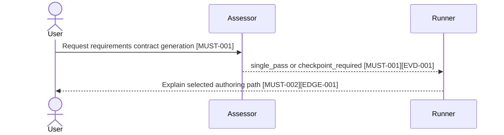
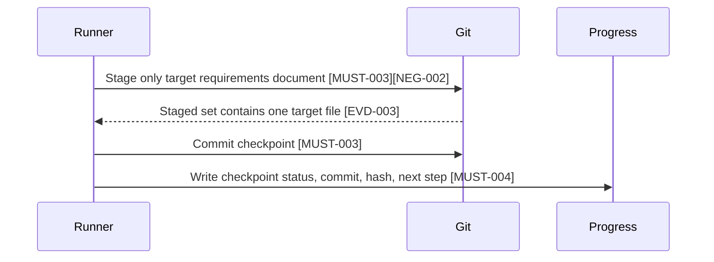
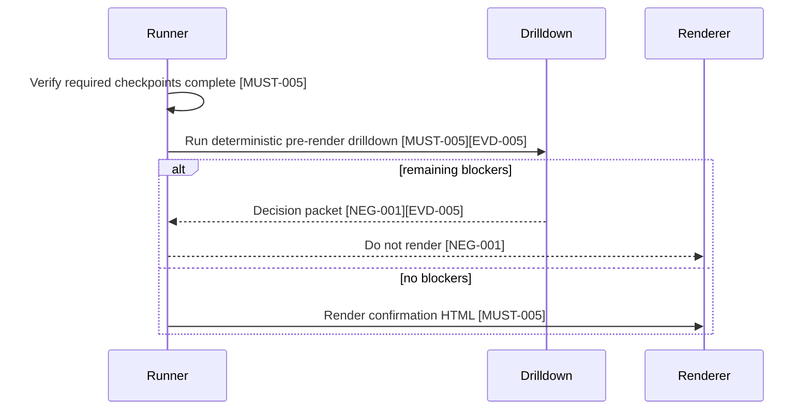
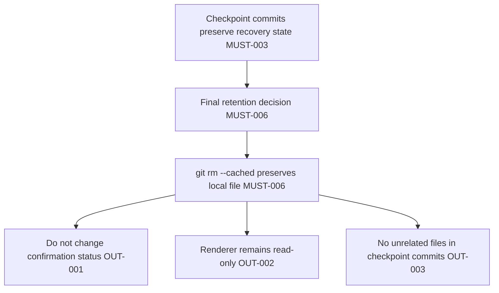

# Requirements Contract Checkpoint Automation

Date: 2026-05-25
Status: Draft
Source: Conversation requirement for automatic scale assessment, semantic checkpoint generation, mandatory checkpoint commits, pre-render automation, and final index cleanup for large requirements contract authoring.

## 1. Goal

This requirement defines an automated workflow for generating confirmation-ready requirements contract source documents without losing work during long streaming sessions, reconnections, or partial rewrites.

The workflow must first classify the authoring request by size and complexity. Small requirements may be authored in one pass. Large requirements must be split into semantic checkpoints. Every completed checkpoint must be committed as a single-file Git safety point before the next checkpoint starts.

The final intent is:

```text
requirement input
-> automatic scale assessment
-> single-pass authoring or checkpoint authoring
-> pre-render structural and semantic gates
-> HTML confirmation render
-> explicit user confirmation
-> controlled confirmation ingest
```

## 2. Problem

Large requirements contract documents can exceed the safe size for one continuous generation pass. During long authoring sessions, streaming transport may time out or reconnect. Models may also rewrite a document by deleting large sections first and then re-adding content. If the rewrite fails midway, the document may be left incomplete and the previous work may be lost.

The existing semantic checkpoint workflow describes a safe manual process, but it does not yet provide an automated scale decision or a render-before automation layer that can resume work deterministically.

## 3. Core Decision

The workflow has two modes:

1. Small requirement mode: author the source document in one pass, then run the normal pre-render checks.
2. Large requirement mode: author the source document through semantic checkpoints. Each checkpoint must end with a single-file commit of the target requirements document.

The checkpoint progress file is a human-readable and machine-readable resume aid. Git commits are the authoritative recovery points.

## 4. Scope

In scope:

1. Automatic scale assessment before requirements contract authoring.
2. Deterministic selection between single-pass authoring and checkpoint authoring.
3. A checkpoint runner that supports `plan`, `run`, `resume`, and `status` modes.
4. Mandatory single-file Git commit after each completed checkpoint in large requirement mode.
5. Human-readable checkpoint progress records that include checkpoint status, commit hash, document hash, validation status, blockers, and next step.
6. Pre-render automation that verifies checkpoint completion before HTML render.
7. Integration with the existing deterministic definition drilldown, previous report filtering, resolution ledger, changed-only mode, and decision packet.
8. Final cleanup that removes temporary requirements contract documents from Git index and places them under `.gitignore` when the final delivery strategy requires it.

Out of scope:

1. Setting `implementationConfirmation.status: user_confirmed`.
2. Rendering HTML before source structure and semantic drilldown gates pass.
3. Replacing the read-only HTML renderer with an authoring orchestrator.
4. Automatically merging unrelated worktree changes.
5. Auto-committing any file other than the active target requirements document during checkpoint commits.
6. Treating checkpoint commits as final delivery readiness.
7. Skipping explicit user confirmation and controlled confirmation ingest.

## 5. Scale Assessment

Before authoring, the workflow must run a read-only scale assessment.

Recommended command:

```bash
node _bmad/skills/requirements-contract-authoring/scripts/assess_contract_authoring_scale.js \
  --source <source-document.md> \
  --out _bmad-output/runtime/requirements-contract/<recordId>/scale-assessment.json \
  --json
```

The assessment must return one of:

```text
single_pass
checkpoint_required
```

The assessment should consider:

1. Document length.
2. Section count.
3. Estimated semantic density.
4. Whether an `implementationConfirmation` block already exists.
5. Estimated number of `MUST`, `NEG`, `OUT`, `EVD`, `TRACE`, `FAIL`, and `EDGE` rows.
6. Whether conditional domains apply, including governance events, runtime recovery, scripts and hooks, scoring/dashboard/SFT, and current-target map.
7. Expected amount of Mermaid views.
8. Expected artifact automation plan size.
9. Expected required command count.
10. Whether prior checkpoint progress exists.
11. Whether a previous interruption or unfinished checkpoint is detected.

Suggested decision rule:

```text
single_pass when the document is small, low-risk, and does not involve conditional governance/runtime modules
checkpoint_required when the document is large, high-risk, interrupted, or contains multiple conditional modules
```

## 6. Checkpoint Sequence

Large requirement mode must use this semantic sequence:

1. Header, background, scope, non-goals, and frozen decisions.
2. `implementationConfirmation` core fields and `applicability`.
3. `must`, `notDone`, `mustNot`, and `evidence`.
4. `failurePaths`, `edgeCases`, and `traceRows`.
5. `sequenceViews`, `flowViews`, `edgeCaseViews`, and `boundaryViews`.
6. `artifactAutomationPlan`, `requiredCommands`, `suggestedCommands`, and `closeoutReadinessPreview`.
7. Conditional modules for governance events, runtime recovery, scoring/dashboard/SFT, current-target map, scripts, and hooks.
8. Human-readable explanations, Mermaid views, evidence overview, E2E overview, requirement boundary overview, Definition of Done, and Reverse Audit Report.
9. HTML render and renderer blocker repair.
10. User confirmation, controlled confirmation ingest, and post-confirmation readiness checks.

A later checkpoint may refine an earlier section, but it must not silently reduce confirmed or previously authored scope.

## 7. Mandatory Checkpoint Commit

For large requirement mode, every checkpoint must end with a single-file commit.

The checkpoint commit is mandatory because the model may delete and rewrite the whole document. If the rewrite fails during streaming, the previous checkpoint commit must remain available as the recovery point.

Required flow for each checkpoint:

```text
check worktree
-> edit only the target requirements document
-> run encoding check
-> run the best available structural or semantic check for the current maturity
-> stage only the target requirements document
-> verify the staged set contains exactly one file
-> commit
-> write checkpoint progress record
```

Required Git safety commands:

```powershell
git add -f -- docs/requirements/<source-document>.md
git diff --cached --name-status
git commit -m "docs(requirements): 补充<checkpoint名称>"
```

If `git diff --cached --name-status` shows any path other than the target source document, the checkpoint runner must stop before commit.

## 8. Checkpoint Progress Record

The progress record is the human-readable resume record. It does not replace Git.

Recommended path:

```text
_bmad-output/runtime/requirements-contract/<recordId>/semantic-checkpoint-progress.json
```

Recommended shape:

```json
{
  "schemaVersion": "semantic-checkpoint-progress/v1",
  "source": "docs/requirements/example.md",
  "mode": "checkpoint_required",
  "lastCompletedCheckpoint": "cp-03-must-neg-out-evidence",
  "currentCheckpoint": "cp-04-failure-edge-trace",
  "lastCommit": "abc1234",
  "documentHash": "sha256:...",
  "validation": {
    "encoding": "pass",
    "definitionDrilldown": "not_applicable",
    "reverseAudit": "expected_fail"
  },
  "blockers": [],
  "next": "cp-04-failure-edge-trace"
}
```

Resume behavior:

1. Read the progress record.
2. Read the latest checkpoint commit.
3. Compute the current document hash.
4. If the hash matches the last checkpoint state, continue from `next`.
5. If the hash differs, inspect the diff before editing.
6. If the diff conflicts with the next checkpoint, stop and request a decision.

## 9. Checkpoint Runner

Recommended command:

```bash
node _bmad/skills/requirements-contract-authoring/scripts/run_semantic_checkpoints.js \
  --source <source-document.md> \
  --assessment <scale-assessment.json> \
  --progress <semantic-checkpoint-progress.json> \
  --mode plan|run|resume|status \
  --until pre-render-ready \
  --json
```

Required modes:

1. `plan`: produce the checkpoint plan without editing.
2. `run`: execute from the first incomplete checkpoint.
3. `resume`: verify progress and continue after interruption.
4. `status`: report current checkpoint state without editing.

Large requirement mode must default to mandatory checkpoint commits. A no-commit mode must not be the default for `checkpoint_required`.

## 10. Pre-Render Automation

HTML render must run only after all pre-render checkpoints are complete.

Required pre-render sequence:

```text
checkpoint completion check
-> source structure check
-> deterministic definition drilldown
-> previous report and resolution filtering
-> decision packet when blockers remain
-> HTML render only when blockers are resolved or converted
```

Recommended definition drilldown command:

```bash
node _bmad/skills/requirements-contract-authoring/scripts/pre_render_definition_drilldown.js \
  --source <source-document.md> \
  --previous-report <previous-grill-definition-report.json> \
  --resolutions <grill-definition-resolutions.json> \
  --changed-only \
  --emit-decision-packet <grill-definition-decision-packet.json> \
  --json
```

If remaining blocking clusters exist, the workflow must stop before HTML render and surface the decision packet. The user should only need to decide on the remaining clustered questions, not re-review all prior blockers.

## 11. Final Index Cleanup

Checkpoint commits are intermediate safety commits. They are not the final retention strategy for generated requirements contract documents.

Before final delivery, temporary requirements contract documents should be removed from Git index and added to `.gitignore` when the project requires local-only retention.

Recommended cleanup:

```powershell
git rm --cached -- docs/requirements/<source-document>.md
```

The cleanup must happen only after the final retention strategy is confirmed.

## 12. Functional Requirements

### FR-001 Scale Assessment

The system must run a read-only scale assessment before requirements contract authoring.

Acceptance:

1. Given a small, low-risk source, the assessment returns `single_pass`.
2. Given a large source or conditional governance/runtime modules, the assessment returns `checkpoint_required`.
3. Given unfinished checkpoint progress, the assessment returns `checkpoint_required`.

### FR-002 Single-Pass Fast Path

The system must allow small requirements to bypass checkpoint commits.

Acceptance:

1. A `single_pass` decision does not require checkpoint progress.
2. A `single_pass` decision still requires pre-render definition drilldown before HTML render.

### FR-003 Checkpoint Plan

The checkpoint runner must produce a deterministic checkpoint plan for large requirements.

Acceptance:

1. The plan lists checkpoint IDs in the required order.
2. Each checkpoint declares its allowed semantic sections.
3. The plan identifies the next incomplete checkpoint.

### FR-004 Mandatory Checkpoint Commit

Every completed checkpoint in large requirement mode must be committed as a single-file Git commit.

Acceptance:

1. The runner stages only the target requirements document.
2. The runner stops if any unrelated staged path exists.
3. The progress record contains the commit hash.

### FR-005 Resume From Checkpoint

The runner must resume after interruption without starting from scratch.

Acceptance:

1. If the current document hash matches the latest progress record, the runner continues from the next checkpoint.
2. If the current document hash differs, the runner reports the diff state and stops before editing.
3. The runner never overwrites uncommitted user edits silently.

### FR-006 Pre-Render Gate

The workflow must block HTML render until checkpoint and definition checks pass.

Acceptance:

1. HTML render is blocked when required checkpoints are incomplete.
2. HTML render is blocked when `pre_render_definition_drilldown.js` reports unresolved blockers.
3. HTML render may proceed when blockers are resolved, waived with current hashes, or converted to explicit open questions or out-of-scope boundaries.

### FR-007 Decision Packet

The workflow must produce a decision packet when unresolved pre-render blockers remain.

Acceptance:

1. The packet groups blockers by cluster.
2. The packet includes recommended actions.
3. The workflow does not keep repeating the same blockers across reruns.

### FR-008 Final Cleanup

The workflow must support removing generated requirements contract documents from Git index after final delivery.

Acceptance:

1. Cleanup uses `git rm --cached`.
2. Cleanup does not delete the local document.
3. Cleanup happens only after the final retention strategy is confirmed.

## 13. Risks

1. A too-sensitive scale assessment may route medium documents into checkpoint mode unnecessarily.
2. A too-lenient scale assessment may still allow large documents to time out.
3. Automatic commits must be strictly single-file to avoid committing unrelated work.
4. Progress records can become stale if users edit the target document manually.
5. Resolution ledger entries must include current hashes to avoid suppressing stale blockers.

## 14. Definition of Done

1. Scale assessment script exists and has acceptance tests.
2. Checkpoint runner supports `plan`, `run`, `resume`, and `status`.
3. Large requirement mode commits every completed checkpoint as a single-file commit.
4. Progress records include checkpoint ID, commit hash, document hash, validation status, blockers, and next step.
5. Pre-render automation blocks HTML render until checkpoint completion and definition drilldown are clean or explicitly resolved.
6. Final cleanup flow is documented and tested.

implementationConfirmation:
  contractSchemaVersion: 1
  status: draft
  recordId: REQ-CHECKPOINT-AUTOMATION
  requirementSetId: REQSET-CHECKPOINT-AUTOMATION
  entryFlow: standalone_tasks
  entryFlowClass: task_packet_entry
  workflowAdapter: bmad
  contractAuthoringRequired: true
  confirmationLanguage: zh-CN
  confirmationProfile: implementation_confirmation
  requiredViewPacks: []
  optionalViewPacks: []
  confirmedAt: null
  confirmedBy: null
  sourceDocumentHash: null
  implementationConfirmationHash: null
  confirmationRender:
    htmlPath: null
    summaryPath: null
    reportPath: null
    htmlHash: null
    confirmationPhrase: null
  applicability:
    governanceEvents:
      applies: false
      reasonCode: no_governance_event_or_control_envelope_changes
    runtimeRecovery:
      applies: false
      reasonCode: no_runtime_resume_or_recovery_runtime_changes
      requiresFunctionalResumeFailureCaseRegistry: false
      activeRequirementResolutionRequired: false
      retiredContextSurfaceForbidden: true
    scoringDashboardSft:
      applies: false
      reasonCode: no_scoring_dashboard_sft_dataset_or_read_model_changes
    currentTargetMap:
      applies: false
      reasonCode: no_current_target_migration_or_governance_comparison_needed
    scriptsAndHooks:
      applies: true
      reasonCode: new_authoring_scale_assessment_and_checkpoint_runner_scripts
  must:
    - id: MUST-001
      text: "The authoring workflow runs a read-only scale assessment before requirements contract source generation and returns either single_pass or checkpoint_required."
      evidenceRefs: ["EVD-001"]
      coveredByTraceRows: ["TRACE-001"]
      coveredBySequenceViews: ["SEQ-001"]
    - id: MUST-002
      text: "When the assessment returns checkpoint_required, the workflow generates the source document through ordered semantic checkpoints instead of one full-document generation pass."
      evidenceRefs: ["EVD-002"]
      coveredByTraceRows: ["TRACE-002"]
      coveredBySequenceViews: ["SEQ-001"]
    - id: MUST-003
      text: "Each completed checkpoint in checkpoint_required mode stages only the target requirements document and creates a single-file Git commit before the next checkpoint starts."
      evidenceRefs: ["EVD-003"]
      coveredByTraceRows: ["TRACE-003"]
      coveredBySequenceViews: ["SEQ-002"]
    - id: MUST-004
      text: "The checkpoint runner writes a progress record containing checkpoint status, commit hash, document hash, validation status, blockers, and next checkpoint, with fail-closed write failure behavior, idempotent updates per checkpoint and commit hash, and recovery from the latest valid progress record."
      evidenceRefs: ["EVD-004"]
      coveredByTraceRows: ["TRACE-004"]
      coveredBySequenceViews: ["SEQ-002"]
    - id: MUST-005
      text: "Before HTML render, the workflow verifies checkpoint completion and runs deterministic definition drilldown with previous report, resolution ledger, changed-only filtering, and decision packet output."
      evidenceRefs: ["EVD-005"]
      coveredByTraceRows: ["TRACE-005"]
      coveredBySequenceViews: ["SEQ-003"]
    - id: MUST-006
      text: "Final cleanup can remove generated requirements contract documents from Git index while preserving local files after the retention strategy is confirmed."
      evidenceRefs: ["EVD-006"]
      coveredByTraceRows: ["TRACE-006"]
      coveredBySequenceViews: ["SEQ-004"]
  notDone:
    - id: NEG-001
      text: "The workflow must not proceed to HTML render while required checkpoints are incomplete or while unresolved pre-render definition blockers remain."
      evidenceRefs: ["EVD-005"]
      whyItBlocksCompletion: "Rendering before source structure and semantic blockers are resolved recreates the timeout and repeated repair loop."
      negativeAssertionRequired: true
      coveredByFailurePath: ["FAIL-001"]
    - id: NEG-002
      text: "The checkpoint runner must not create a checkpoint commit if the staged set contains any file other than the active target requirements document."
      evidenceRefs: ["EVD-003"]
      whyItBlocksCompletion: "Checkpoint commits are recovery points and must not capture unrelated work."
      negativeAssertionRequired: true
      coveredByFailurePath: ["FAIL-002"]
    - id: NEG-003
      text: "The workflow must not silently overwrite manual edits when the current document hash differs from the latest checkpoint progress record; it must fail closed, preserve the current file, and require an explicit recovery decision."
      evidenceRefs: ["EVD-004"]
      whyItBlocksCompletion: "Silent overwrite can lose user changes made after the last checkpoint."
      negativeAssertionRequired: true
      coveredByFailurePath: ["FAIL-003"]
  mustNot:
    - id: OUT-001
      text: "This requirement does not authorize setting implementationConfirmation.status to user_confirmed."
      scopeBoundary: "User confirmation remains a separate explicit chat confirmation and controlled ingest step."
      userApprovalRequiredIfChanged: true
    - id: OUT-002
      text: "This requirement does not replace the read-only HTML renderer with an authoring orchestrator."
      scopeBoundary: "Renderer remains a projection layer and must not own checkpoint execution."
      userApprovalRequiredIfChanged: true
    - id: OUT-003
      text: "This requirement does not allow checkpoint commits to include unrelated files."
      scopeBoundary: "Checkpoint commits are limited to the target requirements source document."
      userApprovalRequiredIfChanged: true
  evidence:
    - id: EVD-001
      text: "Scale assessment returns deterministic routing output for small and large fixture documents."
      gate: "npx vitest run tests/acceptance/requirements-contract-checkpoint-automation.test.ts"
      oracle: "Small fixtures return single_pass; large or interrupted fixtures return checkpoint_required with explicit signals."
      requiredCommandRefs: ["CMD-TEST-001"]
      artifactRefs: ["ART-001"]
      acceptanceType: acceptance_unit
    - id: EVD-002
      text: "Checkpoint plan lists semantic checkpoints in the required order."
      gate: "npx vitest run tests/acceptance/requirements-contract-checkpoint-automation.test.ts"
      oracle: "Plan mode emits ordered checkpoint IDs and allowed semantic sections without editing source files."
      requiredCommandRefs: ["CMD-TEST-001"]
      artifactRefs: ["ART-002"]
      acceptanceType: acceptance_unit
    - id: EVD-003
      text: "Checkpoint commit gate rejects unrelated staged files and records the single-file commit hash."
      gate: "npx vitest run tests/acceptance/requirements-contract-checkpoint-automation.test.ts"
      oracle: "The runner stops before commit when staged files include any path other than the target source document."
      requiredCommandRefs: ["CMD-TEST-001"]
      artifactRefs: ["ART-003"]
      acceptanceType: acceptance_unit
    - id: EVD-004
      text: "Resume mode compares current document hash with progress record and latest checkpoint state."
      gate: "npx vitest run tests/acceptance/requirements-contract-checkpoint-automation.test.ts"
      oracle: "Matching hashes continue from next checkpoint; mismatched hashes produce a blocked resume report without edits."
      requiredCommandRefs: ["CMD-TEST-001"]
      artifactRefs: ["ART-004"]
      acceptanceType: acceptance_unit
    - id: EVD-005
      text: "Pre-render gate blocks HTML render until checkpoint completion and definition drilldown blockers are resolved or converted."
      gate: "npx vitest run tests/acceptance/reverse-audit-contract.test.ts tests/acceptance/requirements-contract-checkpoint-automation.test.ts"
      oracle: "Incomplete checkpoints or unresolved definition blockers prevent render and emit a decision packet."
      requiredCommandRefs: ["CMD-TEST-002"]
      artifactRefs: ["ART-005"]
      acceptanceType: acceptance_e2e
    - id: EVD-006
      text: "Final cleanup removes the generated requirements document from Git index without deleting the local file."
      gate: "npx vitest run tests/acceptance/requirements-contract-checkpoint-automation.test.ts"
      oracle: "Cleanup planning reports git rm --cached behavior and requires retention confirmation before execution."
      requiredCommandRefs: ["CMD-TEST-001"]
      artifactRefs: ["ART-006"]
      acceptanceType: acceptance_unit
  openQuestions: []
  failurePaths:
    - id: FAIL-001
      title: "Render attempted before pre-render readiness"
      trigger: "A caller requests HTML render while checkpoint progress is incomplete or definition drilldown has active blockers."
      expectedBehavior: "Block render and return checkpoint or decision-packet details."
      forbiddenBehavior: "Do not render HTML from an incomplete or semantically blocked source document."
      blocksCompletionWhenViolated: true
      linkedNegIds: ["NEG-001"]
      linkedEvidenceIds: ["EVD-005"]
      requiredAssertions:
        - "Render is blocked."
        - "The blocking checkpoint or remaining definition cluster is visible."
    - id: FAIL-002
      title: "Unrelated staged path during checkpoint commit"
      trigger: "The staged set contains any path other than the target requirements source document."
      expectedBehavior: "Stop before commit and report the unexpected staged paths."
      forbiddenBehavior: "Do not create a checkpoint commit that includes unrelated files."
      blocksCompletionWhenViolated: true
      linkedNegIds: ["NEG-002"]
      linkedEvidenceIds: ["EVD-003"]
      requiredAssertions:
        - "Commit is not created."
        - "Unexpected staged paths are reported."
    - id: FAIL-003
      title: "Resume detects document hash drift"
      trigger: "The current document hash differs from the latest checkpoint progress record."
      expectedBehavior: "Stop before editing and require diff review or user decision."
      forbiddenBehavior: "Do not overwrite manual edits or restart from scratch silently."
      blocksCompletionWhenViolated: true
      linkedNegIds: ["NEG-003"]
      linkedEvidenceIds: ["EVD-004"]
      requiredAssertions:
        - "Resume status is blocked."
        - "The diff state is visible."
  edgeCases:
    - id: EDGE-001
      category: scale_boundary
      condition: "The source document is medium-sized and close to the single-pass threshold."
      expectedBehavior: "The assessment reports score and signals so the routing decision is explainable."
      forbiddenBehavior: "Do not hide why single_pass or checkpoint_required was chosen."
      linkedFailurePathIds: []
      linkedEvidenceIds: ["EVD-001"]
    - id: EDGE-002
      category: interrupted_generation
      condition: "A progress record exists but the last checkpoint commit is not the current working tree state."
      expectedBehavior: "Resume mode blocks and reports mismatch."
      forbiddenBehavior: "Do not continue generation over a changed file."
      linkedFailurePathIds: ["FAIL-003"]
      linkedEvidenceIds: ["EVD-004"]
    - id: EDGE-003
      category: existing_staged_files
      condition: "The user has unrelated staged files before checkpoint commit."
      expectedBehavior: "The runner detects the staged set and stops before adding or committing."
      forbiddenBehavior: "Do not unstage or commit unrelated user work."
      linkedFailurePathIds: ["FAIL-002"]
      linkedEvidenceIds: ["EVD-003"]
  traceRows:
    - id: TRACE-001
      covers: ["MUST-001"]
      taskRefs: ["TASK-001"]
      evidenceRefs: ["EVD-001"]
      contractValidationCommandRefs: ["CMD-TEST-001"]
      deliveryEvidenceCommandRefs: ["CMD-TEST-001"]
      sequenceViewRefs: ["SEQ-001"]
      boundaryViewRefs: []
      artifactRefs: ["ART-001"]
      status: PENDING
    - id: TRACE-002
      covers: ["MUST-002"]
      taskRefs: ["TASK-002"]
      evidenceRefs: ["EVD-002"]
      contractValidationCommandRefs: ["CMD-TEST-001"]
      deliveryEvidenceCommandRefs: ["CMD-TEST-001"]
      sequenceViewRefs: ["SEQ-001"]
      boundaryViewRefs: []
      artifactRefs: ["ART-002"]
      status: PENDING
    - id: TRACE-003
      covers: ["MUST-003", "NEG-002"]
      taskRefs: ["TASK-003"]
      evidenceRefs: ["EVD-003"]
      contractValidationCommandRefs: ["CMD-TEST-001"]
      deliveryEvidenceCommandRefs: ["CMD-TEST-001"]
      sequenceViewRefs: ["SEQ-002"]
      boundaryViewRefs: ["BOUNDARY-001"]
      artifactRefs: ["ART-003"]
      status: PENDING
    - id: TRACE-004
      covers: ["MUST-004", "NEG-003"]
      taskRefs: ["TASK-004"]
      evidenceRefs: ["EVD-004"]
      contractValidationCommandRefs: ["CMD-TEST-001"]
      deliveryEvidenceCommandRefs: ["CMD-TEST-001"]
      sequenceViewRefs: ["SEQ-002"]
      boundaryViewRefs: []
      artifactRefs: ["ART-004"]
      status: PENDING
    - id: TRACE-005
      covers: ["MUST-005", "NEG-001"]
      taskRefs: ["TASK-005"]
      evidenceRefs: ["EVD-005"]
      contractValidationCommandRefs: ["CMD-TEST-002"]
      deliveryEvidenceCommandRefs: ["CMD-TEST-002"]
      sequenceViewRefs: ["SEQ-003"]
      boundaryViewRefs: []
      artifactRefs: ["ART-005"]
      status: PENDING
    - id: TRACE-006
      covers: ["MUST-006"]
      taskRefs: ["TASK-006"]
      evidenceRefs: ["EVD-006"]
      contractValidationCommandRefs: ["CMD-TEST-001"]
      deliveryEvidenceCommandRefs: ["CMD-TEST-001"]
      sequenceViewRefs: ["SEQ-004"]
      boundaryViewRefs: ["BOUNDARY-001"]
      artifactRefs: ["ART-006"]
      status: PENDING
  requirementBoundary:
    business:
      description: "Authoring workflow behavior visible to users who ask for large requirements contract generation."
      requirementIds: ["MUST-001", "MUST-002", "MUST-003", "MUST-004", "MUST-005", "NEG-001", "NEG-002", "NEG-003"]
      viewRefs: ["SEQ-001", "SEQ-002", "SEQ-003", "FLOW-001", "EDGEVIEW-001"]
      diagramRefs: ["MERMAID-001", "MERMAID-002", "MERMAID-003"]
    governance:
      description: "Process boundaries for confirmation status, renderer responsibility, checkpoint commit isolation, and final index cleanup."
      requirementIds: ["MUST-006", "OUT-001", "OUT-002", "OUT-003"]
      viewRefs: ["BOUNDARY-001", "SEQ-004"]
      diagramRefs: ["MERMAID-004"]
  sequenceViews:
    - id: SEQ-001
      title: "Scale assessment routes authoring mode"
      scope: business
      covers: ["MUST-001", "MUST-002"]
      mermaidRef: "MERMAID-001"
    - id: SEQ-002
      title: "Checkpoint commit and resume safety"
      scope: business
      covers: ["MUST-003", "MUST-004", "NEG-002", "NEG-003"]
      mermaidRef: "MERMAID-002"
    - id: SEQ-003
      title: "Pre-render gate blocks unresolved source issues"
      scope: business
      covers: ["MUST-005", "NEG-001"]
      mermaidRef: "MERMAID-003"
    - id: SEQ-004
      title: "Final index cleanup after retention decision"
      scope: governance
      covers: ["MUST-006", "OUT-001", "OUT-002", "OUT-003"]
      mermaidRef: "MERMAID-004"
  flowViews:
    - id: FLOW-001
      title: "Authoring mode decision flow"
      scope: business
      covers: ["MUST-001", "MUST-002", "MUST-005"]
  edgeCaseViews:
    - id: EDGEVIEW-001
      title: "Checkpoint interruption and staged-file edge cases"
      scope: business
      covers: ["NEG-002", "NEG-003", "EVD-003", "EVD-004"]
      cases: ["EDGE-002", "EDGE-003"]
  boundaryViews:
    - id: BOUNDARY-001
      title: "Checkpoint automation boundaries"
      scope: governance
      covers: ["OUT-001", "OUT-002", "OUT-003"]
  artifactAutomationPlan:
    - artifactId: ART-001
      path: "_bmad-output/runtime/requirements-contract/<recordId>/scale-assessment.json"
      artifactType: assessment
      sourceOfTruthRole: evidence
      ownerModel: requirements_contract_authoring
      producer: assess_contract_authoring_scale.js
      consumer: run_semantic_checkpoints.js
      inputArtifacts: ["source-document.md"]
      outputArtifacts: ["scale-assessment.json"]
      recordEventTypes: []
      canAffectControlFlow: true
      failureBehavior: "fail closed when missing or malformed"
      idempotency: "same source hash produces same decision and signal set"
      userApprovalRequired: false
      retention: requirement_lifetime
      cleanupPolicy: keep_until_requirement_cleanup
      orphanRisk: low
      containsSensitiveData: false
      trainingDataEligible: false
    - artifactId: ART-002
      path: "_bmad-output/runtime/requirements-contract/<recordId>/semantic-checkpoint-plan.json"
      artifactType: plan
      sourceOfTruthRole: evidence
      ownerModel: requirements_contract_authoring
      producer: run_semantic_checkpoints.js
      consumer: run_semantic_checkpoints.js
      inputArtifacts: ["scale-assessment.json"]
      outputArtifacts: ["semantic-checkpoint-plan.json"]
      recordEventTypes: []
      canAffectControlFlow: true
      failureBehavior: "fail closed when checkpoint order is incomplete"
      idempotency: "same assessment hash produces same checkpoint plan"
      userApprovalRequired: false
      retention: requirement_lifetime
      cleanupPolicy: keep_until_requirement_cleanup
      orphanRisk: low
      containsSensitiveData: false
      trainingDataEligible: false
    - artifactId: ART-003
      path: "_bmad-output/runtime/requirements-contract/<recordId>/checkpoint-commit-receipt.json"
      artifactType: receipt
      sourceOfTruthRole: evidence
      ownerModel: requirements_contract_authoring
      producer: run_semantic_checkpoints.js
      consumer: user_and_resume_runner
      inputArtifacts: ["target-source-document.md", "git-index"]
      outputArtifacts: ["checkpoint-commit-receipt.json"]
      recordEventTypes: []
      canAffectControlFlow: true
      failureBehavior: "fail closed when staged paths include unrelated files"
      idempotency: "receipt is keyed by checkpoint id and commit hash"
      userApprovalRequired: false
      retention: requirement_lifetime
      cleanupPolicy: keep_until_requirement_cleanup
      orphanRisk: medium
      containsSensitiveData: false
      trainingDataEligible: false
    - artifactId: ART-004
      path: "_bmad-output/runtime/requirements-contract/<recordId>/semantic-checkpoint-progress.json"
      artifactType: progress_record
      sourceOfTruthRole: resume_evidence
      ownerModel: requirements_contract_authoring
      producer: run_semantic_checkpoints.js
      consumer: run_semantic_checkpoints.js
      inputArtifacts: ["checkpoint-commit-receipt.json"]
      outputArtifacts: ["semantic-checkpoint-progress.json"]
      recordEventTypes: []
      canAffectControlFlow: true
      failureBehavior: "fail closed when document hash differs from progress"
      idempotency: "latest completed checkpoint wins only when hashes match"
      userApprovalRequired: false
      retention: requirement_lifetime
      cleanupPolicy: keep_until_requirement_cleanup
      orphanRisk: medium
      containsSensitiveData: false
      trainingDataEligible: false
    - artifactId: ART-005
      path: "_bmad-output/runtime/requirements-contract/<recordId>/grill-definition-decision-packet.json"
      artifactType: decision_packet
      sourceOfTruthRole: evidence
      ownerModel: requirements_contract_authoring
      producer: pre_render_definition_drilldown.js
      consumer: user_and_authoring_runner
      inputArtifacts: ["source-document.md", "previous-grill-definition-report.json", "grill-definition-resolutions.json"]
      outputArtifacts: ["grill-definition-decision-packet.json"]
      recordEventTypes: []
      canAffectControlFlow: true
      failureBehavior: "fail closed when remaining blocking clusters exist"
      idempotency: "same source and resolution hashes produce same remaining clusters"
      userApprovalRequired: false
      retention: requirement_lifetime
      cleanupPolicy: keep_until_requirement_cleanup
      orphanRisk: low
      containsSensitiveData: false
      trainingDataEligible: false
    - artifactId: ART-006
      path: "_bmad-output/runtime/requirements-contract/<recordId>/final-index-cleanup-plan.json"
      artifactType: cleanup_plan
      sourceOfTruthRole: evidence
      ownerModel: requirements_contract_authoring
      producer: run_semantic_checkpoints.js
      consumer: user_and_cleanup_step
      inputArtifacts: ["target-source-document.md"]
      outputArtifacts: ["final-index-cleanup-plan.json"]
      recordEventTypes: []
      canAffectControlFlow: false
      failureBehavior: "do not execute cleanup without retention confirmation"
      idempotency: "cleanup plan is advisory until confirmed"
      userApprovalRequired: true
      retention: short_lived
      cleanupPolicy: remove_after_final_delivery_decision
      orphanRisk: low
      containsSensitiveData: false
      trainingDataEligible: false
  requiredCommands:
    - id: CMD-TEST-001
      command: "npx vitest run tests/acceptance/requirements-contract-checkpoint-automation.test.ts"
    - id: CMD-TEST-002
      command: "npx vitest run tests/acceptance/reverse-audit-contract.test.ts tests/acceptance/requirements-contract-checkpoint-automation.test.ts"
    - id: CMD-ENCODING-001
      command: "node _bmad/skills/encoding-integrity-guardian/scripts/check-encoding-integrity.js"
  suggestedCommands:
    - id: CMD-DRILLDOWN-001
      command: "node _bmad/skills/requirements-contract-authoring/scripts/pre_render_definition_drilldown.js --source <source-document.md> --json"
  closeoutReadinessPreview:
    requiredCommands: ["CMD-TEST-001", "CMD-TEST-002", "CMD-ENCODING-001"]
    orphanPolicy: "Generated assessment, progress, receipt, and decision-packet artifacts must be requirement-scoped and cleaned according to retention strategy."
    currentAttemptPolicy: "Only current source hash, implementationConfirmation hash, context hash, checkpoint commit hash, and current resolution ledger may satisfy the gate."

## 15. Human-Readable Views

### Scale Assessment Sequence



### Checkpoint Commit Sequence



### Pre-Render Gate Sequence



### Cleanup Boundary



## 16. Reverse Audit Report

Verdict: FAIL
Mode: manual draft
Audit command: `node _bmad/skills/requirements-contract-authoring/scripts/reverse_audit_contract.js docs/requirements/2026-05-25-requirements-contract-checkpoint-automation.md`

### implementationConfirmation Findings

Draft source document is not user confirmed. This is expected before HTML render and controlled confirmation ingest.

### HTML Confirmation Findings

Confirmation HTML has not been rendered yet.

### Reconfirmation Findings

No prior confirmation exists.

### ID Reference Findings

All source-authored IDs are intended to be checked by pre-render definition drilldown and renderer before confirmation.

### Diagram And Step Findings

Human-readable Mermaid views reference confirmation IDs.

### Artifact Automation Plan Findings

Artifacts are requirement-scoped and classified as assessment, plan, receipt, progress, decision packet, or cleanup plan.

### traceRows Findings

Trace rows are pending until implementation evidence exists.

### Row Quality Findings

Evidence commands are declared as planned validation commands.

### E2E Anti-Smoke Findings

Acceptance evidence requires fixture assertions and independent oracle checks, not smoke-only proof.

### Open Findings

No blocking open questions are recorded in this draft.

## 17. Pre-Render Semantic Checkpoint Execution Log

This section records automated checkpoint execution before HTML render. It does not mark user confirmation, delivery readiness, or HTML confirmation completion.

### cp-01-header-scope-decisions

Status: passed

Validated scope: header, background, scope, non-goals, and frozen decisions are present in this source document. HTML render remains intentionally not run.

### cp-02-confirmation-core-applicability

Status: passed

Validated scope: `implementationConfirmation` core fields and applicability declarations are present. Conditional expansion remains bounded to the domains declared in the source.

### cp-03-must-neg-out-evidence

Status: passed

Validated scope: `must`, `notDone`, `mustNot`, and `evidence` sections are present and ID-bound for pre-render checks.

### cp-04-failure-edge-trace

Status: passed

Validated scope: `failurePaths`, `edgeCases`, and `traceRows` are present, with failure behavior and trace references available before HTML render.

### cp-05-views

Status: passed

Validated scope: `sequenceViews`, `flowViews`, `edgeCaseViews`, and `boundaryViews` are present and preserve business/governance separation for the renderer.

### cp-06-artifacts-commands-closeout

Status: passed

Validated scope: `artifactAutomationPlan`, `requiredCommands`, `suggestedCommands`, and `closeoutReadinessPreview` are present before render.

### cp-07-conditional-modules

Status: passed

Validated scope: conditional module declarations are present for scripts and hooks, while non-applicable governance/runtime/scoring/current-target domains remain explicitly bounded.
